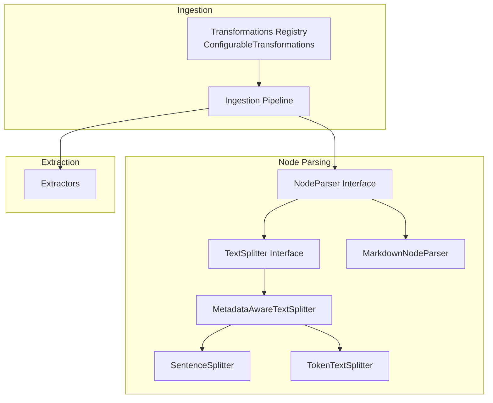
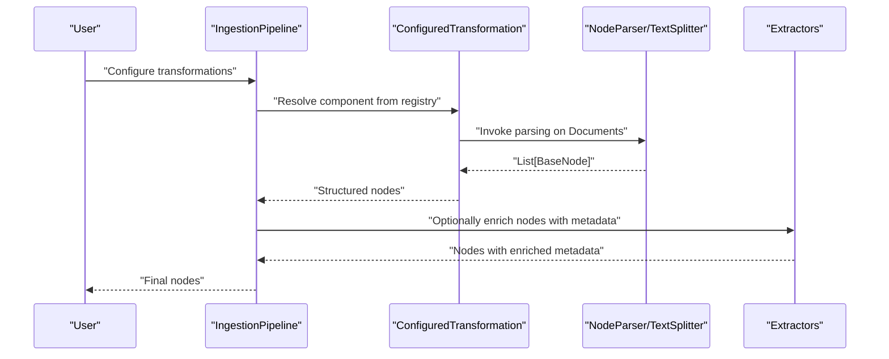
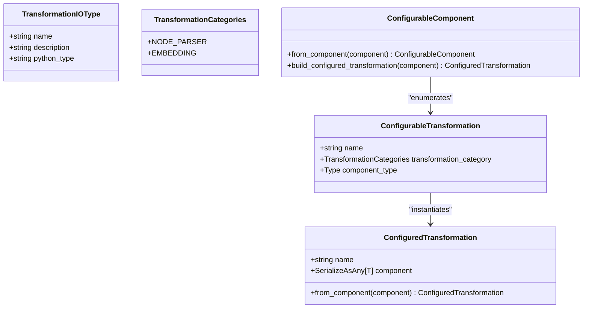
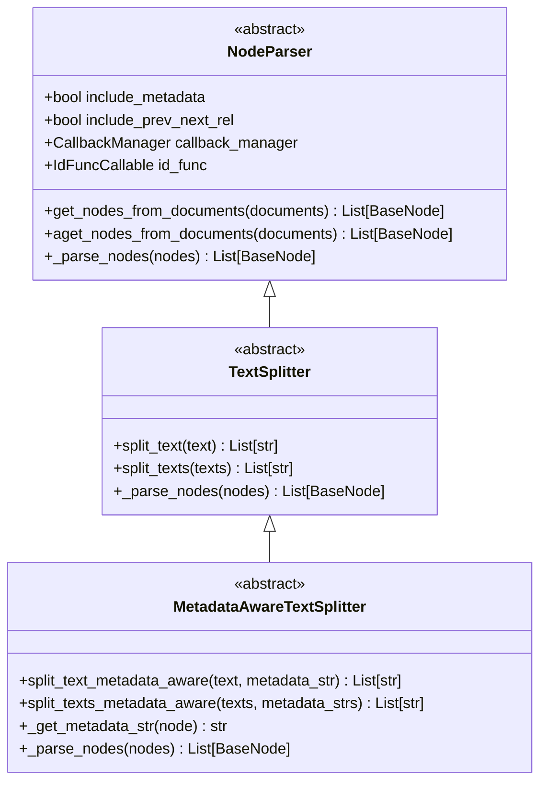
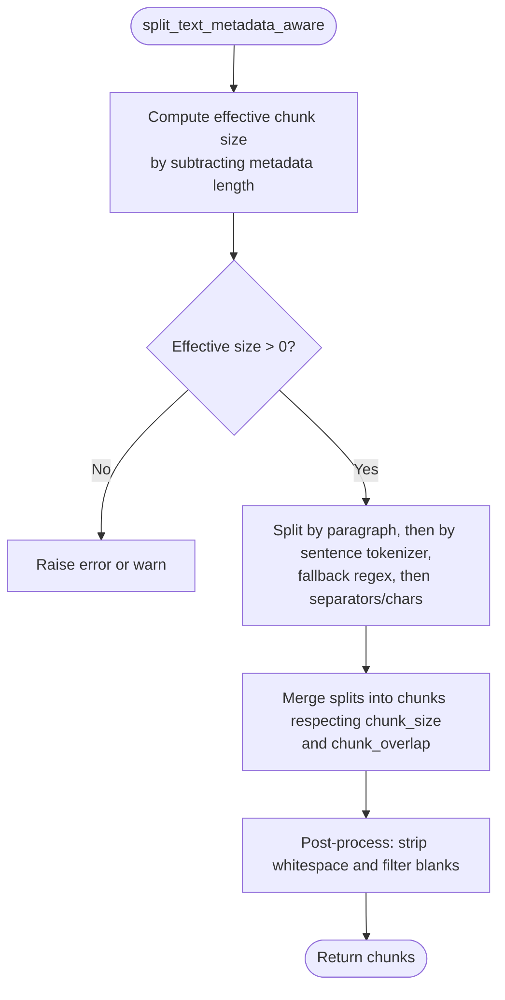
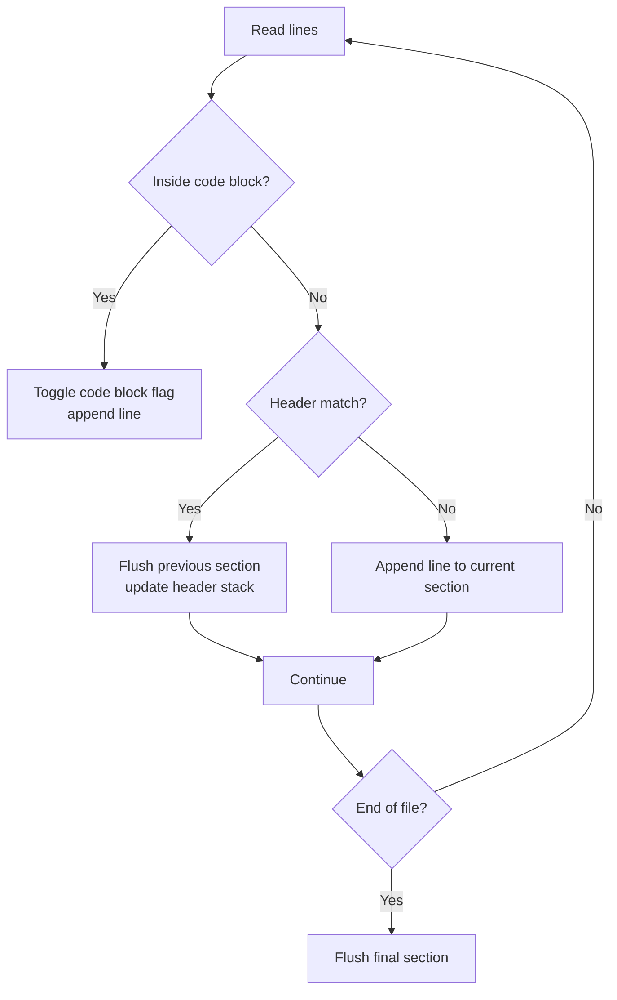
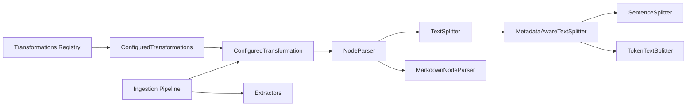

# Transformations

<cite>
**Referenced Files in This Document**
- [transformations.py](file://llama-index-core/llama_index/core/ingestion/transformations.py)
- [interface.py](file://llama-index-core/llama_index/core/node_parser/interface.py)
- [sentence.py](file://llama-index-core/llama_index/core/node_parser/text/sentence.py)
- [token.py](file://llama-index-core/llama_index/core/node_parser/text/token.py)
- [markdown.py](file://llama-index-core/llama_index/core/node_parser/file/markdown.py)
- [__init__.py (node_parser)](file://llama-index-core/llama_index/core/node_parser/__init__.py)
- [__init__.py (text_splitter)](file://llama-index-core/llama_index/core/text_splitter/__init__.py)
- [__init__.py (extractors)](file://llama-index-core/llama_index/core/extractors/__init__.py)
- [pipeline.py](file://llama-index-core/llama_index/core/ingestion/pipeline.py)
- [test_transformations.py](file://llama-index-core/tests/ingestion/test_transformations.py)
</cite>

## Table of Contents
1. [Introduction](#introduction)
2. [Project Structure](#project-structure)
3. [Core Components](#core-components)
4. [Architecture Overview](#architecture-overview)
5. [Detailed Component Analysis](#detailed-component-analysis)
6. [Dependency Analysis](#dependency-analysis)
7. [Performance Considerations](#performance-considerations)
8. [Troubleshooting Guide](#troubleshooting-guide)
9. [Conclusion](#conclusion)
10. [Appendices](#appendices)

## Introduction
This document explains the LlamaIndex Transformations system and how it converts raw documents into structured nodes. It covers the Transformation class, node parser interfaces, and parsing utilities, and describes transformation categories such as text splitting, metadata-aware chunking, and node creation strategies. Practical guidance is included for configuring transformations, chaining them, implementing custom parsers, optimizing performance, handling errors, and applying best practices across document types.

## Project Structure
The transformations system centers around:
- A transformation registry and configuration model that enumerates supported transformations and their categories
- Node parser interfaces and concrete implementations for text and file formats
- Text splitting utilities that operate on token counts and metadata-aware strategies
- Extraction utilities for metadata enrichment
- An ingestion pipeline that orchestrates transformations

**Diagram sources**
- [transformations.py](file://llama-index-core/llama_index/core/ingestion/transformations.py#L118-L342)
- [interface.py](file://llama-index-core/llama_index/core/node_parser/interface.py#L50-L278)
- [sentence.py](file://llama-index-core/llama_index/core/node_parser/text/sentence.py#L34-L332)
- [token.py](file://llama-index-core/llama_index/core/node_parser/text/token.py#L22-L242)
- [markdown.py](file://llama-index-core/llama_index/core/node_parser/file/markdown.py#L14-L142)
- [__init__.py (node_parser)](file://llama-index-core/llama_index/core/node_parser/__init__.py#L1-L73)
- [__init__.py (text_splitter)](file://llama-index-core/llama_index/core/text_splitter/__init__.py#L1-L13)
- [__init__.py (extractors)](file://llama-index-core/llama_index/core/extractors/__init__.py#L1-L20)

**Section sources**
- [transformations.py](file://llama-index-core/llama_index/core/ingestion/transformations.py#L1-L379)
- [interface.py](file://llama-index-core/llama_index/core/node_parser/interface.py#L1-L278)
- [__init__.py (node_parser)](file://llama-index-core/llama_index/core/node_parser/__init__.py#L1-L73)
- [__init__.py (text_splitter)](file://llama-index-core/llama_index/core/text_splitter/__init__.py#L1-L13)
- [__init__.py (extractors)](file://llama-index-core/llama_index/core/extractors/__init__.py#L1-L20)

## Core Components
- Transformation categories and IO types define the contract for transformations in the pipeline
- ConfigurableTransformations enumerates available transformations and maps them to components
- NodeParser and TextSplitter interfaces provide the core parsing APIs
- Concrete implementations include sentence-based and token-based splitters, and file-based parsers
- Extractors enrich nodes with metadata during or prior to parsing

Key responsibilities:
- Define transformation categories (e.g., NodeParser, Embedding)
- Describe input/output types (Documents vs Nodes)
- Provide a registry-backed configuration mechanism
- Implement parsing logic with metadata and relationship handling
- Support metadata-aware chunking and ID generation

**Section sources**
- [transformations.py](file://llama-index-core/llama_index/core/ingestion/transformations.py#L27-L116)
- [transformations.py](file://llama-index-core/llama_index/core/ingestion/transformations.py#L118-L342)
- [interface.py](file://llama-index-core/llama_index/core/node_parser/interface.py#L50-L208)
- [__init__.py (node_parser)](file://llama-index-core/llama_index/core/node_parser/__init__.py#L46-L72)
- [__init__.py (extractors)](file://llama-index-core/llama_index/core/extractors/__init__.py#L1-L20)

## Architecture Overview
The transformation pipeline orchestrates a series of transformations that convert raw Documents into structured BaseNode instances. The pipeline uses a registry-backed configuration to select and instantiate components, ensuring type safety and extensibility.

**Diagram sources**
- [transformations.py](file://llama-index-core/llama_index/core/ingestion/transformations.py#L118-L342)
- [interface.py](file://llama-index-core/llama_index/core/node_parser/interface.py#L157-L207)
- [__init__.py (extractors)](file://llama-index-core/llama_index/core/extractors/__init__.py#L1-L20)

## Detailed Component Analysis

### Transformation Registry and Configuration
- TransformationIOType and TransformationCategories describe the input/output semantics and categories
- ConfigurableComponent builds an enum of supported transformations dynamically, checking availability of embedding providers
- ConfiguredTransformation wraps a component with metadata and provides convenience constructors

**Diagram sources**
- [transformations.py](file://llama-index-core/llama_index/core/ingestion/transformations.py#L27-L116)
- [transformations.py](file://llama-index-core/llama_index/core/ingestion/transformations.py#L118-L342)
- [transformations.py](file://llama-index-core/llama_index/core/ingestion/transformations.py#L347-L379)

**Section sources**
- [transformations.py](file://llama-index-core/llama_index/core/ingestion/transformations.py#L27-L116)
- [transformations.py](file://llama-index-core/llama_index/core/ingestion/transformations.py#L118-L342)
- [transformations.py](file://llama-index-core/llama_index/core/ingestion/transformations.py#L347-L379)

### Node Parser Interfaces
- NodeParser defines the contract for parsing Documents into Nodes, including metadata inclusion, previous/next relationships, and ID generation
- TextSplitter specializes NodeParser to split text content into chunks
- MetadataAwareTextSplitter extends TextSplitter to reserve space for metadata when computing chunk sizes

**Diagram sources**
- [interface.py](file://llama-index-core/llama_index/core/node_parser/interface.py#L50-L208)
- [interface.py](file://llama-index-core/llama_index/core/node_parser/interface.py#L210-L278)

**Section sources**
- [interface.py](file://llama-index-core/llama_index/core/node_parser/interface.py#L50-L208)
- [interface.py](file://llama-index-core/llama_index/core/node_parser/interface.py#L210-L278)

### Text Splitters
- SentenceSplitter performs sentence-aware chunking with overlap, preferring complete sentences and paragraphs
- TokenTextSplitter operates on token boundaries with metadata-aware sizing and configurable separators

**Diagram sources**
- [sentence.py](file://llama-index-core/llama_index/core/node_parser/text/sentence.py#L156-L196)
- [sentence.py](file://llama-index-core/llama_index/core/node_parser/text/sentence.py#L198-L332)
- [token.py](file://llama-index-core/llama_index/core/node_parser/text/token.py#L117-L157)
- [token.py](file://llama-index-core/llama_index/core/node_parser/text/token.py#L159-L242)

**Section sources**
- [sentence.py](file://llama-index-core/llama_index/core/node_parser/text/sentence.py#L34-L332)
- [token.py](file://llama-index-core/llama_index/core/node_parser/text/token.py#L22-L242)

### File-Based Node Parser
- MarkdownNodeParser splits Markdown content by headers, preserving hierarchical context via metadata

**Diagram sources**
- [markdown.py](file://llama-index-core/llama_index/core/node_parser/file/markdown.py#L48-L107)
- [markdown.py](file://llama-index-core/llama_index/core/node_parser/file/markdown.py#L127-L142)

**Section sources**
- [markdown.py](file://llama-index-core/llama_index/core/node_parser/file/markdown.py#L14-L142)

### Extractors
- Extractors enrich nodes with metadata such as summaries, titles, keywords, and contextual information
- They integrate with the transformation pipeline to augment node metadata before downstream steps

**Section sources**
- [__init__.py (extractors)](file://llama-index-core/llama_index/core/extractors/__init__.py#L1-L20)

### Ingestion Pipeline Integration
- The ingestion pipeline composes transformations, invoking node parsers and optional extractors
- It ensures nodes are built with correct relationships and metadata, and supports asynchronous parsing

**Section sources**
- [pipeline.py](file://llama-index-core/llama_index/core/ingestion/pipeline.py)
- [interface.py](file://llama-index-core/llama_index/core/node_parser/interface.py#L157-L207)

## Dependency Analysis
Transformations depend on:
- Node parser interfaces and implementations
- Text splitting utilities and tokenizers
- Extractors for metadata enrichment
- The ingestion pipeline for orchestration

**Diagram sources**
- [transformations.py](file://llama-index-core/llama_index/core/ingestion/transformations.py#L118-L342)
- [interface.py](file://llama-index-core/llama_index/core/node_parser/interface.py#L50-L278)
- [sentence.py](file://llama-index-core/llama_index/core/node_parser/text/sentence.py#L34-L332)
- [token.py](file://llama-index-core/llama_index/core/node_parser/text/token.py#L22-L242)
- [markdown.py](file://llama-index-core/llama_index/core/node_parser/file/markdown.py#L14-L142)
- [__init__.py (node_parser)](file://llama-index-core/llama_index/core/node_parser/__init__.py#L1-L73)
- [__init__.py (extractors)](file://llama-index-core/llama_index/core/extractors/__init__.py#L1-L20)

**Section sources**
- [transformations.py](file://llama-index-core/llama_index/core/ingestion/transformations.py#L118-L342)
- [interface.py](file://llama-index-core/llama_index/core/node_parser/interface.py#L50-L278)
- [__init__.py (node_parser)](file://llama-index-core/llama_index/core/node_parser/__init__.py#L1-L73)
- [__init__.py (extractors)](file://llama-index-core/llama_index/core/extractors/__init__.py#L1-L20)

## Performance Considerations
- Prefer sentence-aware chunking for readability and semantic coherence when appropriate
- Use token-aware splitting to respect model token limits and reserve space for metadata
- Configure chunk size and overlap to balance recall and retrieval quality
- Minimize redundant metadata to avoid reducing effective chunk size
- Enable progress reporting for long-running parsing tasks
- Use asynchronous parsing when processing large batches

[No sources needed since this section provides general guidance]

## Troubleshooting Guide
Common issues and resolutions:
- Chunk size conflicts with metadata: ensure chunk_size accommodates metadata length; otherwise, increase chunk_size or reduce metadata
- Overlap exceeding chunk size: verify chunk_overlap is less than chunk_size
- Empty or whitespace-only chunks: post-processing strips whitespace; adjust separators or keep_whitespaces if needed
- Asynchronous parsing: use async variants for high-throughput scenarios

**Section sources**
- [sentence.py](file://llama-index-core/llama_index/core/node_parser/text/sentence.py#L83-L87)
- [sentence.py](file://llama-index-core/llama_index/core/node_parser/text/sentence.py#L159-L173)
- [token.py](file://llama-index-core/llama_index/core/node_parser/text/token.py#L64-L68)
- [token.py](file://llama-index-core/llama_index/core/node_parser/text/token.py#L121-L135)
- [token.py](file://llama-index-core/llama_index/core/node_parser/text/token.py#L204-L208)

## Conclusion
The LlamaIndex Transformations system provides a robust, extensible framework for converting raw documents into structured nodes. Through a registry-backed configuration, standardized interfaces, and concrete implementations, it supports diverse parsing strategies, metadata-aware chunking, and efficient orchestration via the ingestion pipeline. By following best practices and leveraging the provided utilities, developers can optimize parsing performance and tailor transformations to specific document types and use cases.

[No sources needed since this section summarizes without analyzing specific files]

## Appendices

### Practical Examples and Best Practices
- Configure transformations: choose NodeParser implementations aligned with document type (e.g., MarkdownNodeParser for Markdown, SentenceSplitter for plain text)
- Implement custom parsers: subclass NodeParser or TextSplitter/MetadataAwareTextSplitter and implement the required abstract methods
- Optimize performance: tune chunk_size and chunk_overlap; use token-aware splitting; leverage asynchronous parsing
- Error handling: catch and log chunking warnings; validate chunk_size vs metadata length; handle empty content gracefully
- Transformation chaining: compose multiple transformations in the ingestion pipeline to first parse nodes, then enrich with extractors, and finally embed if needed

**Section sources**
- [transformations.py](file://llama-index-core/llama_index/core/ingestion/transformations.py#L118-L342)
- [interface.py](file://llama-index-core/llama_index/core/node_parser/interface.py#L50-L208)
- [sentence.py](file://llama-index-core/llama_index/core/node_parser/text/sentence.py#L34-L332)
- [token.py](file://llama-index-core/llama_index/core/node_parser/text/token.py#L22-L242)
- [markdown.py](file://llama-index-core/llama_index/core/node_parser/file/markdown.py#L14-L142)
- [test_transformations.py](file://llama-index-core/tests/ingestion/test_transformations.py)