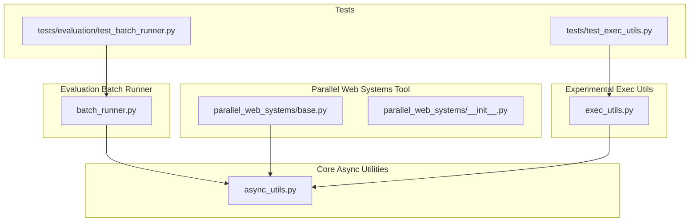
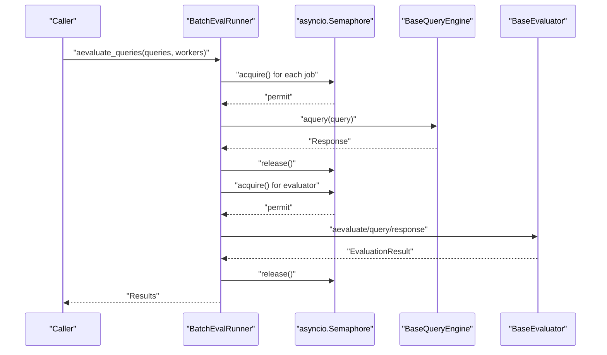
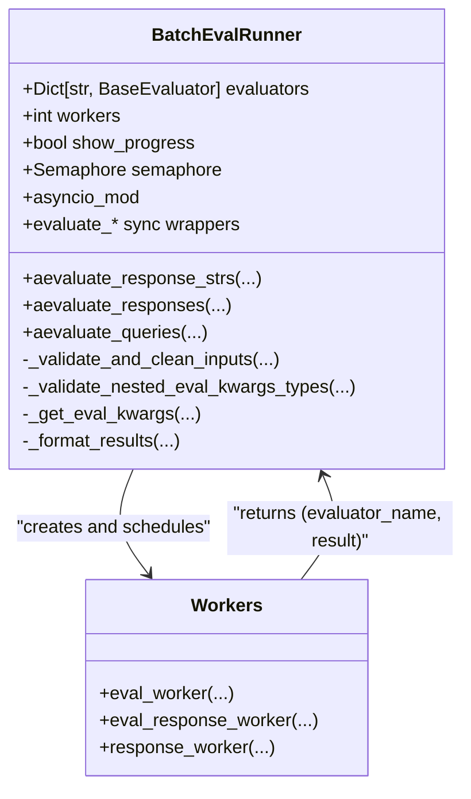
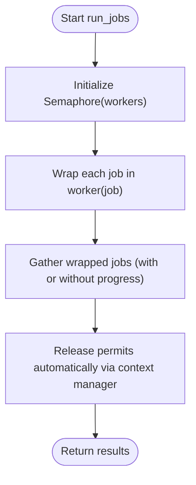
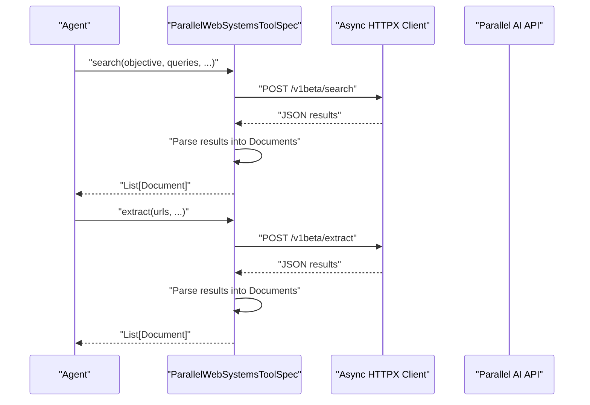
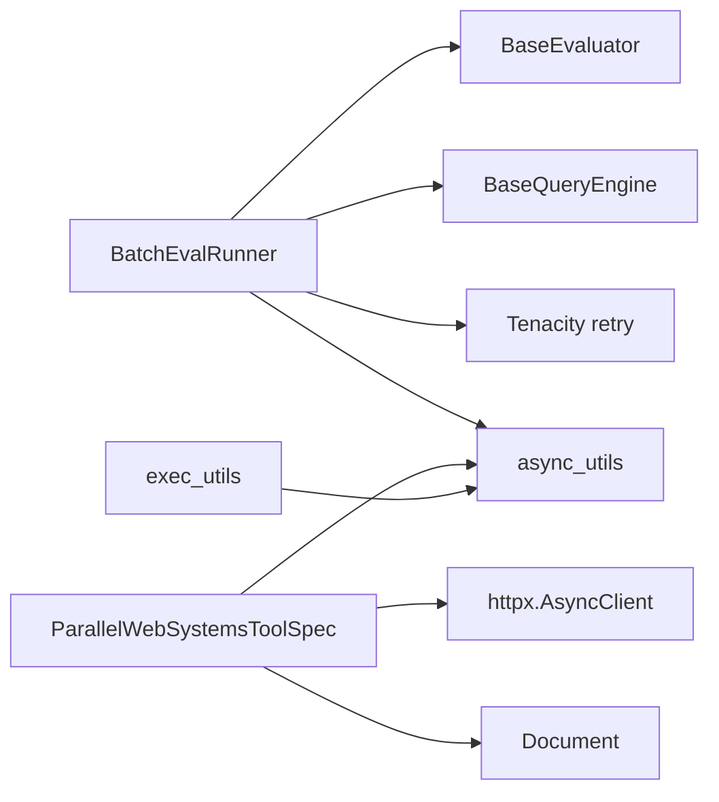

# Batch Processing and Parallelism

<cite>
**Referenced Files in This Document**
- [batch_runner.py](file://llama-index-core/llama_index/core/evaluation/batch_runner.py)
- [async_utils.py](file://llama-index-core/llama_index/core/async_utils.py)
- [base.py](file://llama-index-integrations/tools/llama-index-tools-parallel-web-systems/llama_index/tools/parallel_web_systems/base.py)
- [__init__.py](file://llama-index-integrations/tools/llama-index-tools-parallel-web-systems/llama_index/tools/parallel_web_systems/__init__.py)
- [exec_utils.py](file://llama-index-experimental/llama_index/experimental/exec_utils.py)
- [test_batch_runner.py](file://llama-index-core/tests/evaluation/test_batch_runner.py)
- [test_exec_utils.py](file://llama-index-experimental/tests/test_exec_utils.py)
</cite>

## Table of Contents
1. [Introduction](#introduction)
2. [Project Structure](#project-structure)
3. [Core Components](#core-components)
4. [Architecture Overview](#architecture-overview)
5. [Detailed Component Analysis](#detailed-component-analysis)
6. [Dependency Analysis](#dependency-analysis)
7. [Performance Considerations](#performance-considerations)
8. [Troubleshooting Guide](#troubleshooting-guide)
9. [Conclusion](#conclusion)
10. [Appendices](#appendices)

## Introduction
This document explains LlamaIndex’s batch processing and parallel execution capabilities with a focus on:
- Node batching and chunking mechanisms
- Worker pool configuration via semaphores and concurrency limits
- CPU utilization optimization through controlled parallelism
- Batch size calculation and memory management during parallel processing
- Error handling in distributed and async scenarios
- Trade-offs between multiprocessing and async processing
- Scaling considerations and performance monitoring
- Debugging parallel execution issues and tuning for production

The content is grounded in the repository’s core async utilities, batch evaluation runner, and a parallel web systems tool spec that demonstrates async IO-bound parallelism.

## Project Structure
The relevant parts of the repository for batch and parallel execution are organized as follows:
- Core async utilities and batch helpers: llama-index-core/llama_index/core/async_utils.py
- Batch evaluation runner for async workloads: llama-index-core/llama_index/core/evaluation/batch_runner.py
- Parallel web systems tool spec (async IO): llama-index-integrations/tools/llama-index-tools-parallel-web-systems/llama_index/tools/parallel_web_systems/base.py
- Experimental exec utilities (multiprocessing and process pools): llama-index-experimental/llama_index/experimental/exec_utils.py
- Tests validating batch runner behavior: llama-index-core/tests/evaluation/test_batch_runner.py
- Tests validating experimental exec utilities: llama-index-experimental/tests/test_exec_utils.py

**Diagram sources**
- [async_utils.py](file://llama-index-core/llama_index/core/async_utils.py#L1-L175)
- [batch_runner.py](file://llama-index-core/llama_index/core/evaluation/batch_runner.py#L1-L444)
- [base.py](file://llama-index-integrations/tools/llama-index-tools-parallel-web-systems/llama_index/tools/parallel_web_systems/base.py#L1-L250)
- [__init__.py](file://llama-index-integrations/tools/llama-index-tools-parallel-web-systems/llama_index/tools/parallel_web_systems/__init__.py#L1-L4)
- [exec_utils.py](file://llama-index-experimental/llama_index/experimental/exec_utils.py#L1-L200)
- [test_batch_runner.py](file://llama-index-core/tests/evaluation/test_batch_runner.py#L1-L200)
- [test_exec_utils.py](file://llama-index-experimental/tests/test_exec_utils.py#L1-L200)

**Section sources**
- [async_utils.py](file://llama-index-core/llama_index/core/async_utils.py#L1-L175)
- [batch_runner.py](file://llama-index-core/llama_index/core/evaluation/batch_runner.py#L1-L444)
- [base.py](file://llama-index-integrations/tools/llama-index-tools-parallel-web-systems/llama_index/tools/parallel_web_systems/base.py#L1-L250)
- [__init__.py](file://llama-index-integrations/tools/llama-index-tools-parallel-web-systems/llama_index/tools/parallel_web_systems/__init__.py#L1-L4)
- [exec_utils.py](file://llama-index-experimental/llama_index/experimental/exec_utils.py#L1-L200)
- [test_batch_runner.py](file://llama-index-core/tests/evaluation/test_batch_runner.py#L1-L200)
- [test_exec_utils.py](file://llama-index-experimental/tests/test_exec_utils.py#L1-L200)

## Core Components
- Async utilities and batch helpers:
  - Event loop management and nested async handling
  - Progress-aware async gather wrappers
  - Chunking iterator for batching
  - Generic job runner with configurable worker concurrency via semaphore
- Batch evaluation runner:
  - Async workers for query, response, and evaluator tasks
  - Semaphore-controlled concurrency
  - Input validation and flexible eval kwargs per evaluator
- Parallel web systems tool:
  - Async HTTP client usage for IO-bound parallelism
  - Structured document creation from API responses
- Experimental exec utilities:
  - Multiprocessing and process pool helpers for CPU-intensive tasks

Key implementation references:
- Async utilities and job runner: [async_utils.py](file://llama-index-core/llama_index/core/async_utils.py#L103-L175)
- Batch evaluation runner and workers: [batch_runner.py](file://llama-index-core/llama_index/core/evaluation/batch_runner.py#L11-L73), [batch_runner.py](file://llama-index-core/llama_index/core/evaluation/batch_runner.py#L75-L444)
- Parallel web systems tool: [base.py](file://llama-index-integrations/tools/llama-index-tools-parallel-web-systems/llama_index/tools/parallel_web_systems/base.py#L42-L250)
- Experimental exec utilities: [exec_utils.py](file://llama-index-experimental/llama_index/experimental/exec_utils.py#L1-L200)

**Section sources**
- [async_utils.py](file://llama-index-core/llama_index/core/async_utils.py#L103-L175)
- [batch_runner.py](file://llama-index-core/llama_index/core/evaluation/batch_runner.py#L11-L73)
- [batch_runner.py](file://llama-index-core/llama_index/core/evaluation/batch_runner.py#L75-L444)
- [base.py](file://llama-index-integrations/tools/llama-index-tools-parallel-web-systems/llama_index/tools/parallel_web_systems/base.py#L42-L250)
- [exec_utils.py](file://llama-index-experimental/llama_index/experimental/exec_utils.py#L1-L200)

## Architecture Overview
The system combines:
- Async IO-driven parallelism for network-bound tasks (e.g., web scraping, API calls)
- Semaphore-controlled concurrency for CPU-bound and mixed tasks
- Chunking and batching to manage memory and throughput
- Optional progress bars and robust error handling

**Diagram sources**
- [batch_runner.py](file://llama-index-core/llama_index/core/evaluation/batch_runner.py#L319-L348)
- [batch_runner.py](file://llama-index-core/llama_index/core/evaluation/batch_runner.py#L65-L72)
- [batch_runner.py](file://llama-index-core/llama_index/core/evaluation/batch_runner.py#L40-L57)

## Detailed Component Analysis

### Batch Evaluation Runner
The BatchEvalRunner orchestrates parallel evaluation of queries, responses, and contexts using async workers and a shared semaphore for concurrency control. It supports:
- Evaluating precomputed responses
- Evaluating raw response strings with optional contexts
- Generating responses from a query engine and then evaluating them
- Flexible per-evaluator kwargs with validation and alignment checks
- Formatting results grouped by evaluator name

**Diagram sources**
- [batch_runner.py](file://llama-index-core/llama_index/core/evaluation/batch_runner.py#L75-L444)
- [batch_runner.py](file://llama-index-core/llama_index/core/evaluation/batch_runner.py#L11-L73)

Key behaviors:
- Concurrency control via asyncio.Semaphore initialized with the workers count
- Input validation ensures equal-length inputs and proper eval kwargs structure
- Results are aggregated and grouped by evaluator name
- Retry decorators around worker functions provide resilience against transient failures

**Section sources**
- [batch_runner.py](file://llama-index-core/llama_index/core/evaluation/batch_runner.py#L75-L444)

### Async Utilities and Job Runner
The async utilities provide:
- Event loop detection and safe execution helpers for nested or already-running loops
- Progress-aware async gather wrappers using tqdm_asyncio
- Chunking iterator for batching sequences
- A generic run_jobs function that wraps jobs in a worker function protected by a semaphore
- A batch_gather helper that executes tasks in batches sized by batch_size

**Diagram sources**
- [async_utils.py](file://llama-index-core/llama_index/core/async_utils.py#L137-L175)

Additional helpers:
- chunks: partitions an iterable into fixed-size groups
- batch_gather: iteratively gathers tasks in batches, printing progress if enabled

**Section sources**
- [async_utils.py](file://llama-index-core/llama_index/core/async_utils.py#L103-L175)

### Parallel Web Systems Tool Spec
The ParallelWebSystemsToolSpec demonstrates IO-bound parallelism:
- Uses an async HTTP client to call external APIs
- Supports search and extract operations returning structured Documents
- Includes timeouts and error handling with fallback empty results
- Payload construction and response parsing into Document objects

**Diagram sources**
- [base.py](file://llama-index-integrations/tools/llama-index-tools-parallel-web-systems/llama_index/tools/parallel_web_systems/base.py#L42-L250)

**Section sources**
- [base.py](file://llama-index-integrations/tools/llama-index-tools-parallel-web-systems/llama_index/tools/parallel_web_systems/base.py#L42-L250)
- [__init__.py](file://llama-index-integrations/tools/llama-index-tools-parallel-web-systems/llama_index/tools/parallel_web_systems/__init__.py#L1-L4)

### Experimental Exec Utils (Multiprocessing)
The experimental exec utilities expose multiprocessing and process pool helpers suitable for CPU-intensive tasks:
- Process pool creation and management
- Helpers to distribute CPU-bound workloads across processes
- Useful for scenarios where true parallelism is desired over cooperative async scheduling

Note: These utilities are in the experimental module and intended for advanced use cases.

**Section sources**
- [exec_utils.py](file://llama-index-experimental/llama_index/experimental/exec_utils.py#L1-L200)
- [test_exec_utils.py](file://llama-index-experimental/tests/test_exec_utils.py#L1-L200)

## Dependency Analysis
- BatchEvalRunner depends on:
  - Async utilities for event loop management and gather semantics
  - BaseEvaluator and BaseQueryEngine abstractions for evaluation and querying
  - Tenacity retry decorators for transient failure resilience
- Async utilities depend on:
  - asyncio and contextvars for loop handling
  - Optional tqdm_asyncio for progress bars
- Parallel web systems tool depends on:
  - httpx for async HTTP requests
  - Document schema for structured outputs
- Experimental exec utilities are standalone helpers for multiprocessing

**Diagram sources**
- [batch_runner.py](file://llama-index-core/llama_index/core/evaluation/batch_runner.py#L1-L10)
- [async_utils.py](file://llama-index-core/llama_index/core/async_utils.py#L1-L12)
- [base.py](file://llama-index-integrations/tools/llama-index-tools-parallel-web-systems/llama_index/tools/parallel_web_systems/base.py#L1-L12)
- [exec_utils.py](file://llama-index-experimental/llama_index/experimental/exec_utils.py#L1-L200)

**Section sources**
- [batch_runner.py](file://llama-index-core/llama_index/core/evaluation/batch_runner.py#L1-L10)
- [async_utils.py](file://llama-index-core/llama_index/core/async_utils.py#L1-L12)
- [base.py](file://llama-index-integrations/tools/llama-index-tools-parallel-web-systems/llama_index/tools/parallel_web_systems/base.py#L1-L12)
- [exec_utils.py](file://llama-index-experimental/llama_index/experimental/exec_utils.py#L1-L200)

## Performance Considerations
- Concurrency control:
  - Use a semaphore with a worker count tuned to CPU cores and IO capacity
  - For IO-bound tasks, higher worker counts often improve throughput
  - For CPU-bound tasks, limit workers to physical cores or use multiprocessing
- Batch size calculation:
  - Balance memory footprint and throughput; smaller batches reduce peak memory
  - Larger batches increase CPU utilization but risk memory pressure
  - Use the chunking iterator to split workloads into manageable segments
- Memory management:
  - Prefer streaming or chunked processing for large datasets
  - Avoid accumulating large intermediate results; process in batches
- Progress and monitoring:
  - Enable progress bars for long-running jobs to track completion
  - Log batch completion metrics for operational visibility
- Nested async and event loops:
  - Use the provided async run helpers to avoid nested loop errors
  - Apply nest_asyncio when working in notebook environments

[No sources needed since this section provides general guidance]

## Troubleshooting Guide
Common issues and remedies:
- Nested async runtime errors:
  - Use the async run helpers to safely execute coroutines in existing or nested loops
  - Apply nest_asyncio in notebook environments
- Excessive memory usage:
  - Reduce batch size or switch to chunked processing
  - Monitor peak memory and adjust worker counts accordingly
- Slow IO-bound tasks:
  - Increase worker count cautiously; monitor API rate limits
  - Add retries and exponential backoff around external calls
- Unequal input lengths:
  - Ensure all input lists passed to the batch runner have equal length
  - Validate eval kwargs structure to prevent misalignment
- Progress bar failures:
  - Fallback to non-progress gather when tqdm_asyncio is unavailable

**Section sources**
- [async_utils.py](file://llama-index-core/llama_index/core/async_utils.py#L25-L66)
- [async_utils.py](file://llama-index-core/llama_index/core/async_utils.py#L68-L100)
- [batch_runner.py](file://llama-index-core/llama_index/core/evaluation/batch_runner.py#L112-L142)
- [batch_runner.py](file://llama-index-core/llama_index/core/evaluation/batch_runner.py#L144-L181)

## Conclusion
LlamaIndex provides robust primitives for batch processing and parallel execution:
- Async utilities enable safe, progress-aware execution with configurable concurrency
- BatchEvalRunner offers a structured way to parallelize evaluation workloads with input validation and resilient workers
- Parallel web systems tool showcases IO-bound parallelism with structured error handling
- Experimental exec utilities support CPU-bound workloads via multiprocessing

Adopting the right batch sizes, worker counts, and monitoring strategies enables efficient scaling across diverse hardware configurations and workload types.

[No sources needed since this section summarizes without analyzing specific files]

## Appendices

### Practical Recipes and Examples
- Optimize batch processing for different hardware:
  - Single-core CPU: lower worker count; larger batch size to reduce overhead
  - Multi-core CPU: moderate worker count; balance batch size to utilize cores
  - Many-core CPU: higher worker count; small batch size to keep queues full
- Handle large document volumes:
  - Use chunked processing and streaming
  - Apply backpressure via semaphore-controlled workers
- Monitor performance:
  - Enable progress bars for long runs
  - Track batch completion rates and latency distributions
- Production tuning:
  - Set worker counts based on observed saturation
  - Add circuit-breaker logic around external APIs
  - Use structured logging and metrics for observability

[No sources needed since this section provides general guidance]