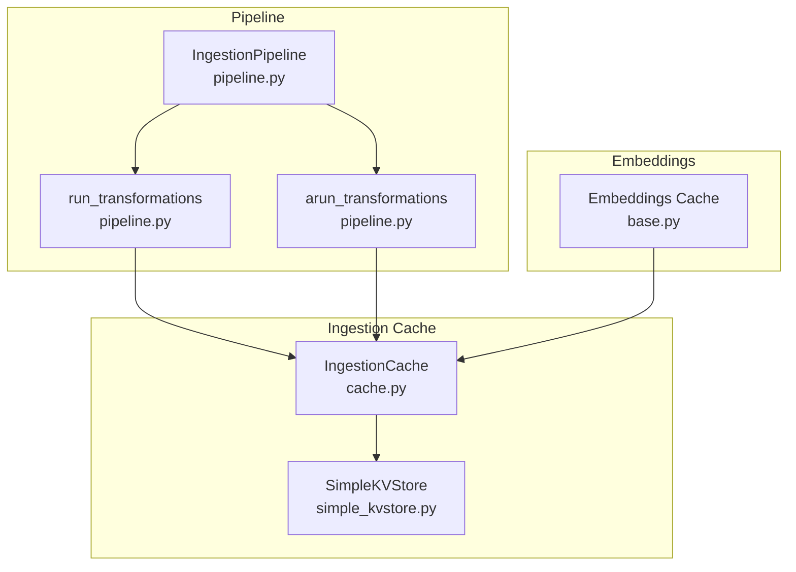
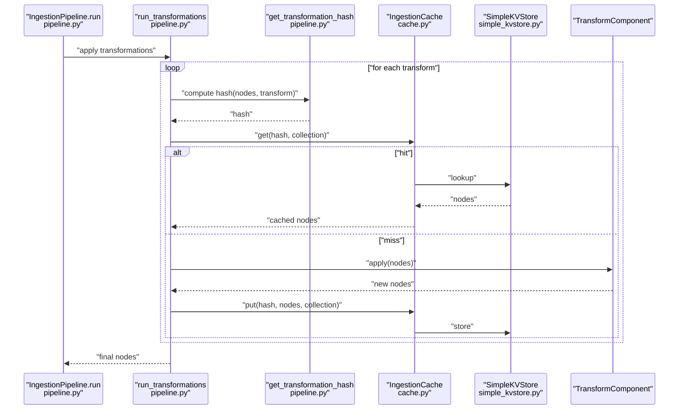
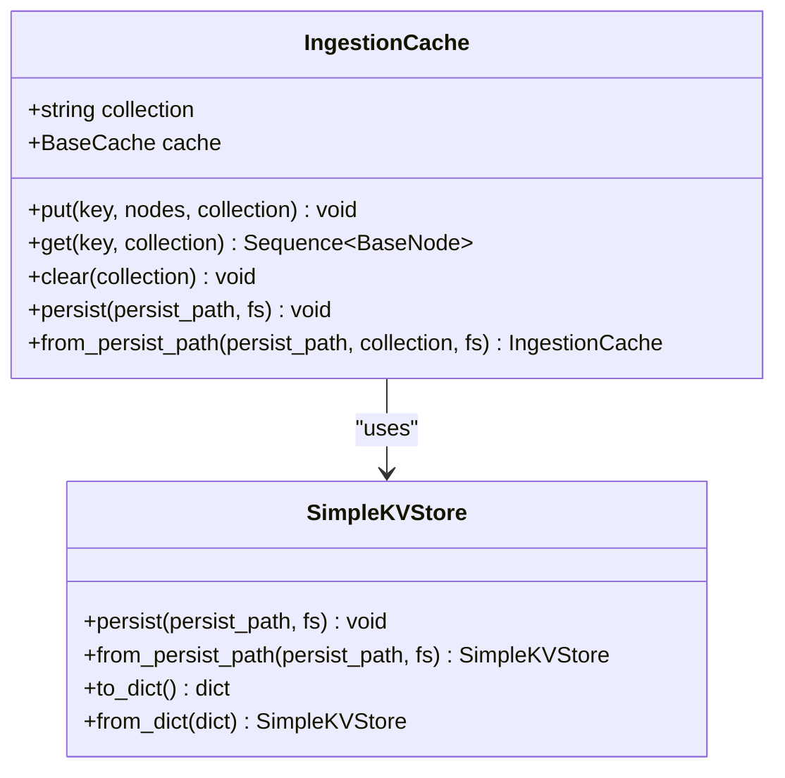
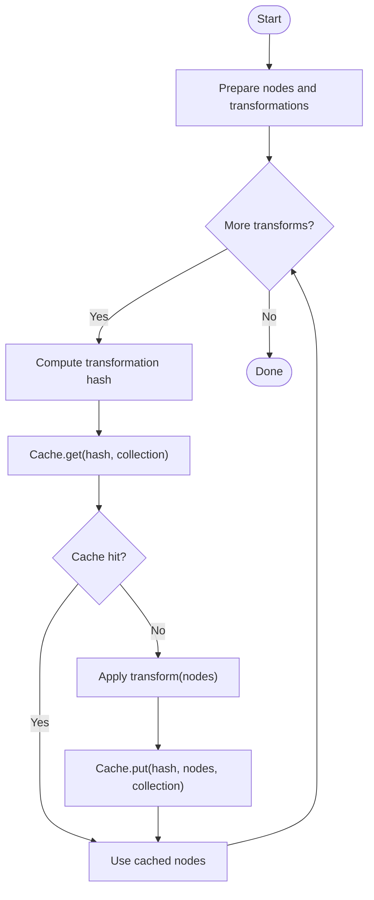
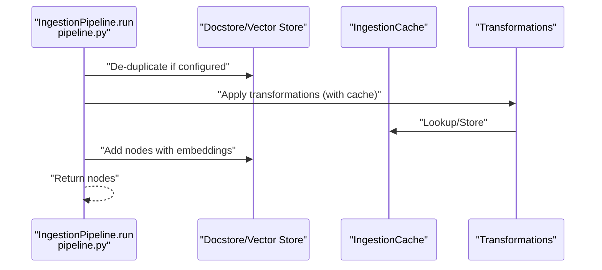
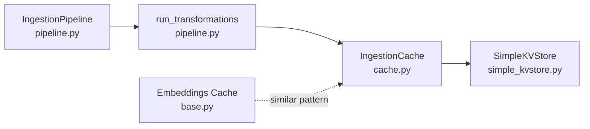

# Caching System

<cite>
**Referenced Files in This Document**
- [cache.py](file://llama-index-core/llama_index/core/ingestion/cache.py)
- [pipeline.py](file://llama-index-core/llama_index/core/ingestion/pipeline.py)
- [simple_kvstore.py](file://llama-index-core/llama_index/core/storage/kvstore/simple_kvstore.py)
- [base.py](file://llama-index-core/llama_index/core/base/embeddings/base.py)
- [test_cache.py](file://llama-index-core/tests/ingestion/test_cache.py)
</cite>

## Table of Contents
1. [Introduction](#introduction)
2. [Project Structure](#project-structure)
3. [Core Components](#core-components)
4. [Architecture Overview](#architecture-overview)
5. [Detailed Component Analysis](#detailed-component-analysis)
6. [Dependency Analysis](#dependency-analysis)
7. [Performance Considerations](#performance-considerations)
8. [Troubleshooting Guide](#troubleshooting-guide)
9. [Conclusion](#conclusion)
10. [Appendices](#appendices)

## Introduction
This document explains LlamaIndex’s ingestion caching system with a focus on:
- Cache architecture and the role of the ingestion cache
- Hash-based caching mechanism for transformation stages
- Cache collections for isolating different transformation sets
- Configuration, persistence, and invalidation strategies
- Performance benefits, memory usage optimization, and debugging techniques
- Example configurations for different deployment scenarios
- Cleanup procedures and troubleshooting cache-related issues
- Sharing caches across pipeline runs and consistency in distributed environments

## Project Structure
The ingestion caching system spans three primary areas:
- Ingestion cache abstraction and persistence
- Pipeline orchestration that applies transformations with caching
- Embedding-level caching for text-to-embedding reuse

**Diagram sources**
- [cache.py](file://llama-index-core/llama_index/core/ingestion/cache.py#L17-L79)
- [simple_kvstore.py](file://llama-index-core/llama_index/core/storage/kvstore/simple_kvstore.py#L16-L66)
- [pipeline.py](file://llama-index-core/llama_index/core/ingestion/pipeline.py#L71-L144)
- [base.py](file://llama-index-core/llama_index/core/base/embeddings/base.py#L290-L489)

**Section sources**
- [cache.py](file://llama-index-core/llama_index/core/ingestion/cache.py#L1-L79)
- [pipeline.py](file://llama-index-core/llama_index/core/ingestion/pipeline.py#L1-L779)
- [simple_kvstore.py](file://llama-index-core/llama_index/core/storage/kvstore/simple_kvstore.py#L1-L66)
- [base.py](file://llama-index-core/llama_index/core/base/embeddings/base.py#L290-L489)

## Core Components
- IngestionCache: A typed cache wrapper around a key-value store, designed to store node sequences keyed by transformation hashes. It supports per-collection isolation and persistence for local development.
- IngestionPipeline: Orchestrates ingestion, applies transformations, and integrates caching via a hash-based lookup strategy. It supports both synchronous and asynchronous transformation execution.
- SimpleKVStore: A simple in-memory key-value store with JSON-backed persistence for local environments.
- Embeddings cache: A separate caching layer for text-to-embedding reuse, independent of ingestion caching but illustrative of caching patterns in the system.

Key responsibilities:
- IngestionCache: put/get/clear/persist/from_persist_path
- IngestionPipeline: hashing transformations, invoking cache, and coordinating with docstore/vector store
- SimpleKVStore: in-memory KV with file-system backed persistence
- Embeddings cache: per-text embedding caching with UUID-based values to avoid collisions

**Section sources**
- [cache.py](file://llama-index-core/llama_index/core/ingestion/cache.py#L17-L79)
- [pipeline.py](file://llama-index-core/llama_index/core/ingestion/pipeline.py#L71-L144)
- [simple_kvstore.py](file://llama-index-core/llama_index/core/storage/kvstore/simple_kvstore.py#L16-L66)
- [base.py](file://llama-index-core/llama_index/core/base/embeddings/base.py#L290-L489)

## Architecture Overview
The ingestion cache sits between the pipeline and transformations. For each transformation, the pipeline computes a deterministic hash from the input nodes and the transformation definition. If a cached result exists under that hash, it is reused; otherwise, the transformation is executed and the result is stored.

**Diagram sources**
- [pipeline.py](file://llama-index-core/llama_index/core/ingestion/pipeline.py#L57-L105)
- [cache.py](file://llama-index-core/llama_index/core/ingestion/cache.py#L27-L46)
- [simple_kvstore.py](file://llama-index-core/llama_index/core/storage/kvstore/simple_kvstore.py#L35-L56)

**Section sources**
- [pipeline.py](file://llama-index-core/llama_index/core/ingestion/pipeline.py#L57-L105)
- [cache.py](file://llama-index-core/llama_index/core/ingestion/cache.py#L27-L46)
- [simple_kvstore.py](file://llama-index-core/llama_index/core/storage/kvstore/simple_kvstore.py#L35-L56)

## Detailed Component Analysis

### IngestionCache
- Purpose: Encapsulates caching of node sequences produced by transformations.
- Key operations:
  - put(key, nodes, collection): Serializes nodes and stores under a key in a named collection.
  - get(key, collection): Retrieves serialized nodes and deserializes them.
  - clear(collection): Iterates keys and deletes all entries in a collection.
  - persist(persist_path, fs): Persists the underlying SimpleKVStore to disk.
  - from_persist_path(persist_path, collection, fs): Loads a persisted cache.
- Collections: Supports multiple named collections to isolate caches across different transformation sets or runs.

**Diagram sources**
- [cache.py](file://llama-index-core/llama_index/core/ingestion/cache.py#L17-L79)
- [simple_kvstore.py](file://llama-index-core/llama_index/core/storage/kvstore/simple_kvstore.py#L16-L66)

**Section sources**
- [cache.py](file://llama-index-core/llama_index/core/ingestion/cache.py#L17-L79)
- [simple_kvstore.py](file://llama-index-core/llama_index/core/storage/kvstore/simple_kvstore.py#L16-L66)

### Transformation Hashing and Caching Flow
- Hash computation: Combines serialized node content and a stable representation of the transformation definition. Unstable values are removed to ensure reproducible hashes across runs.
- Lookup and store: For each transformation, the pipeline checks the cache using the computed hash; if absent, executes the transform and stores the result.

**Diagram sources**
- [pipeline.py](file://llama-index-core/llama_index/core/ingestion/pipeline.py#L57-L105)

**Section sources**
- [pipeline.py](file://llama-index-core/llama_index/core/ingestion/pipeline.py#L57-L105)

### IngestionPipeline Integration
- Applies transformations with optional caching and supports parallel execution across batches.
- Provides methods to persist and load the cache and docstore alongside the pipeline.
- Supports disabling the cache globally via a flag.

**Diagram sources**
- [pipeline.py](file://llama-index-core/llama_index/core/ingestion/pipeline.py#L467-L575)

**Section sources**
- [pipeline.py](file://llama-index-core/llama_index/core/ingestion/pipeline.py#L467-L575)

### Embeddings Cache Pattern
- Demonstrates a similar caching pattern at the embeddings level, storing per-text embeddings with randomized keys to avoid collisions.
- Useful for understanding how caching is integrated into higher-level components.

**Section sources**
- [base.py](file://llama-index-core/llama_index/core/base/embeddings/base.py#L290-L489)

## Dependency Analysis
- IngestionCache depends on a key-value store interface and uses SimpleKVStore by default.
- IngestionPipeline depends on IngestionCache and uses transformation hashing to drive cache lookups.
- Embeddings cache is orthogonal but follows a similar pattern.

**Diagram sources**
- [pipeline.py](file://llama-index-core/llama_index/core/ingestion/pipeline.py#L71-L144)
- [cache.py](file://llama-index-core/llama_index/core/ingestion/cache.py#L17-L79)
- [simple_kvstore.py](file://llama-index-core/llama_index/core/storage/kvstore/simple_kvstore.py#L16-L66)
- [base.py](file://llama-index-core/llama_index/core/base/embeddings/base.py#L290-L489)

**Section sources**
- [pipeline.py](file://llama-index-core/llama_index/core/ingestion/pipeline.py#L71-L144)
- [cache.py](file://llama-index-core/llama_index/core/ingestion/cache.py#L17-L79)
- [simple_kvstore.py](file://llama-index-core/llama_index/core/storage/kvstore/simple_kvstore.py#L16-L66)
- [base.py](file://llama-index-core/llama_index/core/base/embeddings/base.py#L290-L489)

## Performance Considerations
- Hash-based caching avoids recomputation of identical transformations on the same node set, reducing latency and cost.
- Using collections enables partitioning of caches across different transformation sets or runs, preventing accidental cache pollution.
- SimpleKVStore is in-memory by default; persistence is supported for local workflows. For production, consider externalizing the cache backend and enabling persistence to disk or network storage.
- Parallel execution in the pipeline can increase throughput but requires careful coordination of cache access; ensure thread-safe or process-isolated cache usage.

[No sources needed since this section provides general guidance]

## Troubleshooting Guide
Common issues and resolutions:
- Cache misses unexpectedly:
  - Verify transformation definitions are stable and that unstable values are removed during hashing.
  - Confirm the correct cache collection is used for the intended transformation set.
- Cache not persisting:
  - Ensure the cache is persisted to the expected path and that the filesystem is writable.
  - Confirm the cache is loaded from the correct path on subsequent runs.
- Clearing cache:
  - Use the cache clear method to remove all entries in a collection.
- Verifying cache correctness:
  - Use tests that assert cache hits and misses for known inputs.

**Section sources**
- [test_cache.py](file://llama-index-core/tests/ingestion/test_cache.py#L15-L48)
- [cache.py](file://llama-index-core/llama_index/core/ingestion/cache.py#L48-L75)
- [pipeline.py](file://llama-index-core/llama_index/core/ingestion/pipeline.py#L57-L105)

## Conclusion
LlamaIndex’s ingestion caching system leverages deterministic hashing and a simple key-value store to accelerate repeated transformations. By organizing caches into named collections and supporting persistence, it enables efficient reuse across pipeline runs while maintaining flexibility for different deployment scenarios. For distributed or production-grade setups, consider externalizing the cache backend and ensuring consistent hashing across environments.

[No sources needed since this section summarizes without analyzing specific files]

## Appendices

### Configuration and Deployment Scenarios
- Local development with persistence:
  - Persist the cache to a directory and reload it on startup.
  - Use the default SimpleKVStore for quick iteration.
- Isolation across runs:
  - Assign distinct cache collections per run or transformation stage to prevent cross-contamination.
- Disabling cache:
  - Use the pipeline’s disable flag to bypass caching for debugging or reproducibility.

**Section sources**
- [cache.py](file://llama-index-core/llama_index/core/ingestion/cache.py#L55-L75)
- [pipeline.py](file://llama-index-core/llama_index/core/ingestion/pipeline.py#L305-L353)

### Cache Collections for Different Stages
- Use separate collections for preprocessing, splitting, embedding, and postprocessing to avoid cross-stage cache interference.
- Example collections: “preprocessing”, “splitting”, “embedding”, “postprocessing”.

**Section sources**
- [pipeline.py](file://llama-index-core/llama_index/core/ingestion/pipeline.py#L71-L144)

### Cache Persistence Options
- Local filesystem:
  - Persist and load via SimpleKVStore’s JSON-backed persistence.
- Distributed environments:
  - Replace SimpleKVStore with a distributed KV store and ensure consistent hashing and serialization.

**Section sources**
- [simple_kvstore.py](file://llama-index-core/llama_index/core/storage/kvstore/simple_kvstore.py#L35-L56)
- [cache.py](file://llama-index-core/llama_index/core/ingestion/cache.py#L55-L75)

### Cache Invalidation Strategies
- Clear entire collections when transformation definitions change.
- Invalidate specific keys by removing entries from the underlying KV store.
- Rotate cache collections per major release or dataset change.

**Section sources**
- [cache.py](file://llama-index-core/llama_index/core/ingestion/cache.py#L48-L54)

### Cache Debugging Techniques
- Add logging around cache get/put operations.
- Compare hashes of inputs to diagnose mismatches.
- Use tests to assert cache hits and misses for known inputs.

**Section sources**
- [test_cache.py](file://llama-index-core/tests/ingestion/test_cache.py#L15-L48)
- [pipeline.py](file://llama-index-core/llama_index/core/ingestion/pipeline.py#L57-L105)