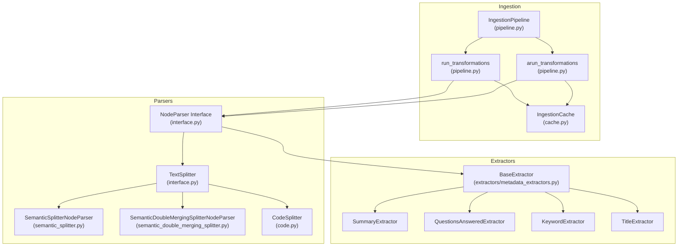
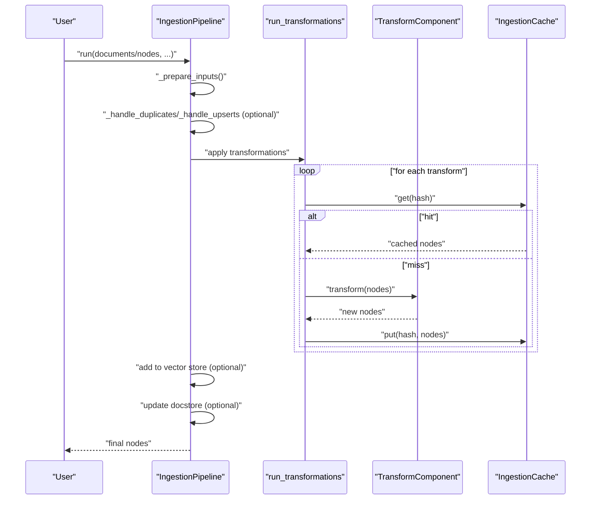
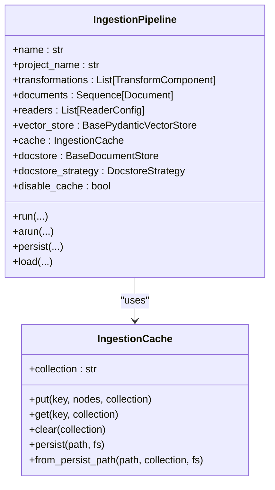
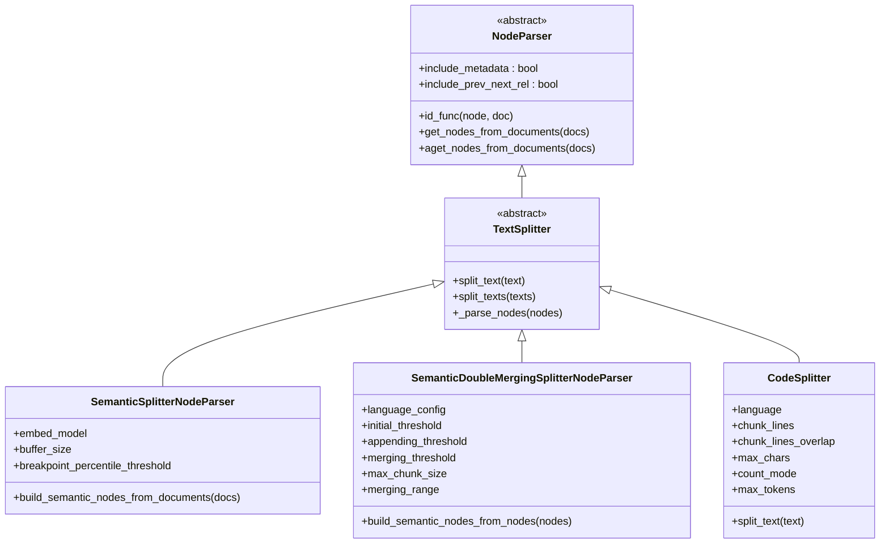
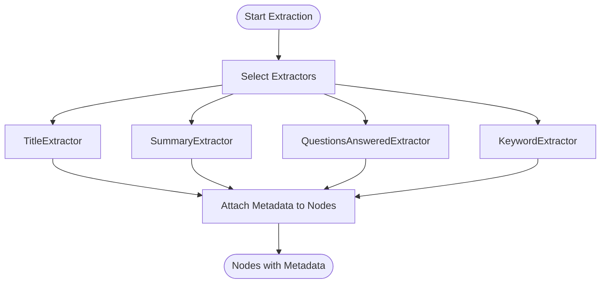
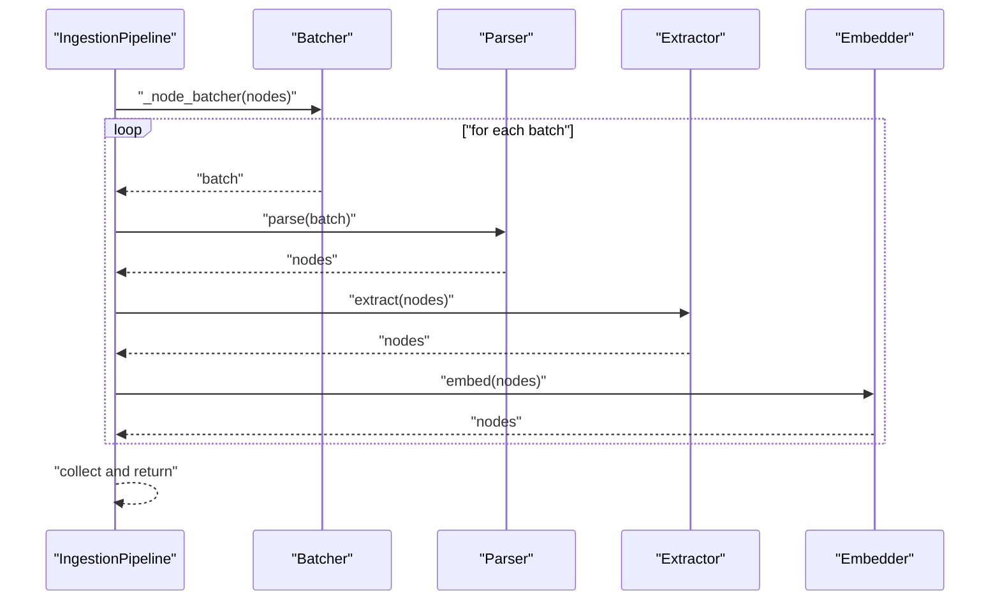
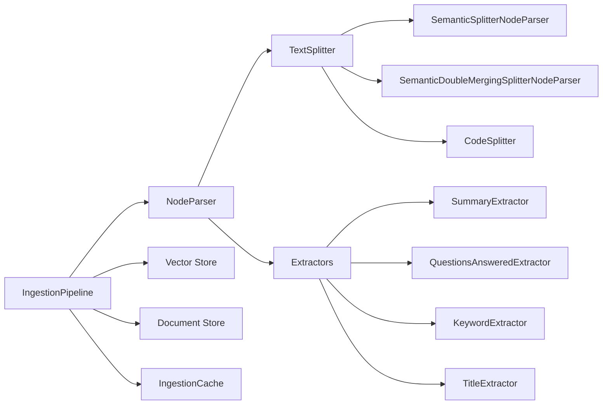

# Data Processing Pipeline

<cite>
**Referenced Files in This Document**
- [pipeline.py](file://llama-index-core/llama_index/core/ingestion/pipeline.py)
- [cache.py](file://llama-index-core/llama_index/core/ingestion/cache.py)
- [__init__.py](file://llama-index-core/llama_index/core/ingestion/__init__.py)
- [interface.py](file://llama-index-core/llama_index/core/node_parser/interface.py)
- [__init__.py](file://llama-index-core/llama_index/core/node_parser/__init__.py)
- [semantic_splitter.py](file://llama-index-core/llama_index/core/node_parser/text/semantic_splitter.py)
- [semantic_double_merging_splitter.py](file://llama-index-core/llama_index/core/node_parser/text/semantic_double_merging_splitter.py)
- [code.py](file://llama-index-core/llama_index/core/node_parser/text/code.py)
- [__init__.py](file://llama-index-core/llama_index/core/extractors/__init__.py)
- [metadata_extractors.py](file://llama-index-core/llama_index/core/extractors/metadata_extractors.py)
- [metadata_extraction.md](file://docs/src/content/docs/framework/module_guides/indexing/metadata_extraction.md)
</cite>

## Table of Contents
1. [Introduction](#introduction)
2. [Project Structure](#project-structure)
3. [Core Components](#core-components)
4. [Architecture Overview](#architecture-overview)
5. [Detailed Component Analysis](#detailed-component-analysis)
6. [Dependency Analysis](#dependency-analysis)
7. [Performance Considerations](#performance-considerations)
8. [Troubleshooting Guide](#troubleshooting-guide)
9. [Conclusion](#conclusion)
10. [Appendices](#appendices)

## Introduction
This document explains LlamaIndex’s comprehensive data ingestion and transformation system. It covers the ingestion pipeline architecture, node parsing strategies, metadata extraction mechanisms, and caching systems. It also documents text splitters, semantic chunkers, and specialized parsers for various document types, along with transformation chains, batch processing, and practical guidance for building custom components, optimizing performance, and debugging parsing issues.

## Project Structure
The ingestion pipeline centers around a high-level orchestration class that applies a chain of transformations to documents and nodes. Parsers convert raw content into structured nodes, extractors enrich nodes with metadata, and caches avoid recomputation. The following diagram maps the primary modules involved in the ingestion pipeline.

**Diagram sources**
- [pipeline.py](file://llama-index-core/llama_index/core/ingestion/pipeline.py#L71-L144)
- [cache.py](file://llama-index-core/llama_index/core/ingestion/cache.py#L17-L79)
- [interface.py](file://llama-index-core/llama_index/core/node_parser/interface.py#L50-L278)
- [semantic_splitter.py](file://llama-index-core/llama_index/core/node_parser/text/semantic_splitter.py#L35-L313)
- [semantic_double_merging_splitter.py](file://llama-index-core/llama_index/core/node_parser/text/semantic_double_merging_splitter.py#L62-L399)
- [code.py](file://llama-index-core/llama_index/core/node_parser/text/code.py#L19-L266)
- [metadata_extractors.py](file://llama-index-core/llama_index/core/extractors/metadata_extractors.py#L55-L536)

**Section sources**
- [pipeline.py](file://llama-index-core/llama_index/core/ingestion/pipeline.py#L193-L575)
- [cache.py](file://llama-index-core/llama_index/core/ingestion/cache.py#L17-L79)
- [interface.py](file://llama-index-core/llama_index/core/node_parser/interface.py#L50-L278)
- [__init__.py](file://llama-index-core/llama_index/core/ingestion/__init__.py#L1-L16)

## Core Components
- IngestionPipeline: Orchestrates ingestion, supports document and node inputs, applies transformations, handles de-duplication via a document store, and integrates with a vector store. It supports both synchronous and asynchronous execution and parallel batching.
- run_transformations/arun_transformations: Executes a sequence of TransformComponents (parsers, extractors, embeddings) with optional caching and in-place updates.
- IngestionCache: Stores previously computed node sequences keyed by a deterministic hash of input nodes and transformation configuration.
- NodeParser interface: Defines the contract for converting documents/nodes into chunked nodes, including metadata inclusion and relationship establishment.
- TextSplitter and specialized splitters: Implement token/character-aware splitting, semantic chunking, and language-specific double-merging strategies.
- Metadata extractors: Add contextual metadata (titles, summaries, questions, keywords) to nodes via LLM prompts.

**Section sources**
- [pipeline.py](file://llama-index-core/llama_index/core/ingestion/pipeline.py#L193-L575)
- [cache.py](file://llama-index-core/llama_index/core/ingestion/cache.py#L17-L79)
- [interface.py](file://llama-index-core/llama_index/core/node_parser/interface.py#L50-L278)
- [__init__.py](file://llama-index-core/llama_index/core/extractors/__init__.py#L1-L20)

## Architecture Overview
The ingestion pipeline follows a staged flow:
- Prepare inputs from documents, nodes, and configured readers.
- Optionally de-duplicate using a document store and vector store.
- Apply transformations in order (e.g., parsers, extractors, embeddings).
- Persist nodes to the vector store and document store.
- Support caching per transformation to avoid recomputation.

**Diagram sources**
- [pipeline.py](file://llama-index-core/llama_index/core/ingestion/pipeline.py#L467-L575)
- [pipeline.py](file://llama-index-core/llama_index/core/ingestion/pipeline.py#L71-L144)
- [cache.py](file://llama-index-core/llama_index/core/ingestion/cache.py#L27-L46)

## Detailed Component Analysis

### IngestionPipeline
- Responsibilities:
  - Accepts documents, nodes, and readers; prepares unified input.
  - De-duplicates via a document store and vector store using configurable strategies.
  - Applies transformations sequentially with optional caching and in-place updates.
  - Adds nodes with embeddings to a vector store and updates the document store.
  - Supports parallel processing via multiprocessing and async variants.
- Parallelism:
  - Splits node batches and executes transformations per batch in parallel processes.
  - Async variant supports async transformations and vector store operations.
- Caching:
  - Uses a deterministic hash of input nodes plus transformation config to cache results.

**Diagram sources**
- [pipeline.py](file://llama-index-core/llama_index/core/ingestion/pipeline.py#L193-L358)
- [cache.py](file://llama-index-core/llama_index/core/ingestion/cache.py#L17-L79)

**Section sources**
- [pipeline.py](file://llama-index-core/llama_index/core/ingestion/pipeline.py#L193-L575)
- [pipeline.py](file://llama-index-core/llama_index/core/ingestion/pipeline.py#L440-L465)
- [pipeline.py](file://llama-index-core/llama_index/core/ingestion/pipeline.py#L530-L563)

### Node Parsing Strategies
- TextSplitters:
  - TokenTextSplitter, SentenceSplitter, TokenTextSplitter: chunk by tokens or sentences with overlap and size controls.
- Semantic chunkers:
  - SemanticSplitterNodeParser: groups semantically similar sentences using embeddings and percentile thresholds.
  - SemanticDoubleMergingSplitterNodeParser: language-aware double-pass merging with thresholds and maximum chunk size.
- Specialized parsers:
  - CodeSplitter: AST-based splitting for code using Tree-sitter, supporting character or token-based sizing.
- Relationship and metadata:
  - NodeParser interface adds prev/next relationships and merges parent metadata into child nodes.

**Diagram sources**
- [interface.py](file://llama-index-core/llama_index/core/node_parser/interface.py#L50-L278)
- [semantic_splitter.py](file://llama-index-core/llama_index/core/node_parser/text/semantic_splitter.py#L35-L313)
- [semantic_double_merging_splitter.py](file://llama-index-core/llama_index/core/node_parser/text/semantic_double_merging_splitter.py#L62-L399)
- [code.py](file://llama-index-core/llama_index/core/node_parser/text/code.py#L19-L266)

**Section sources**
- [interface.py](file://llama-index-core/llama_index/core/node_parser/interface.py#L50-L278)
- [semantic_splitter.py](file://llama-index-core/llama_index/core/node_parser/text/semantic_splitter.py#L160-L313)
- [semantic_double_merging_splitter.py](file://llama-index-core/llama_index/core/node_parser/text/semantic_double_merging_splitter.py#L198-L399)
- [code.py](file://llama-index-core/llama_index/core/node_parser/text/code.py#L225-L266)

### Metadata Extraction Mechanisms
- Extractors:
  - TitleExtractor: infers document-level titles from node samples.
  - SummaryExtractor: generates self/previous/next summaries for nodes.
  - QuestionsAnsweredExtractor: generates questions a node can answer.
  - KeywordExtractor: extracts distinctive keywords.
  - PydanticProgramExtractor: extracts structured data using a Pydantic program.
- Workflows:
  - Configure a list of extractors as transformations.
  - Run via IngestionPipeline to attach metadata to nodes.

**Diagram sources**
- [metadata_extractors.py](file://llama-index-core/llama_index/core/extractors/metadata_extractors.py#L55-L536)
- [metadata_extraction.md](file://docs/src/content/docs/framework/module_guides/indexing/metadata_extraction.md#L19-L47)

**Section sources**
- [metadata_extractors.py](file://llama-index-core/llama_index/core/extractors/metadata_extractors.py#L55-L536)
- [metadata_extraction.md](file://docs/src/content/docs/framework/module_guides/indexing/metadata_extraction.md#L1-L47)

### Transformation Chains and Batch Processing
- Chain composition:
  - Order matters: parsers first, then extractors, then embeddings.
  - Each component receives the output of the previous one.
- Batch processing:
  - IngestionPipeline divides nodes into batches and processes them in parallel.
  - Async variants enable concurrent execution for IO-bound steps.

**Diagram sources**
- [pipeline.py](file://llama-index-core/llama_index/core/ingestion/pipeline.py#L440-L465)
- [pipeline.py](file://llama-index-core/llama_index/core/ingestion/pipeline.py#L530-L563)

**Section sources**
- [pipeline.py](file://llama-index-core/llama_index/core/ingestion/pipeline.py#L440-L563)

### Practical Examples and Recipes
- Building a semantic chunking pipeline:
  - Use SemanticSplitterNodeParser with an embedding model and adjust buffer size and percentile threshold.
- Adding metadata:
  - Compose a chain with SentenceSplitter followed by TitleExtractor, QuestionsAnsweredExtractor, SummaryExtractor, KeywordExtractor, and an entity extractor.
- Handling large documents:
  - Prefer semantic chunkers to maintain meaning across boundaries; tune thresholds and buffer sizes.
- Mixed media:
  - Combine parsers (e.g., CodeSplitter for code, SemanticSplitter for prose) within a single pipeline.

Note: Refer to the metadata extraction guide for a concrete example of constructing a transformation chain and running it via IngestionPipeline.

**Section sources**
- [metadata_extraction.md](file://docs/src/content/docs/framework/module_guides/indexing/metadata_extraction.md#L19-L47)
- [semantic_splitter.py](file://llama-index-core/llama_index/core/node_parser/text/semantic_splitter.py#L84-L124)
- [__init__.py](file://llama-index-core/llama_index/core/extractors/__init__.py#L1-L20)

## Dependency Analysis
- Coupling:
  - IngestionPipeline depends on TransformComponent implementations (parsers, extractors).
  - NodeParser interface decouples splitting logic from downstream consumers.
- Cohesion:
  - Each parser focuses on a specific splitting strategy; extractors encapsulate metadata generation.
- External integrations:
  - Embedding models for semantic chunkers.
  - Vector stores and document stores for persistence and de-duplication.
  - Optional async runtime and multiprocessing for performance.

**Diagram sources**
- [pipeline.py](file://llama-index-core/llama_index/core/ingestion/pipeline.py#L193-L358)
- [interface.py](file://llama-index-core/llama_index/core/node_parser/interface.py#L50-L278)
- [metadata_extractors.py](file://llama-index-core/llama_index/core/extractors/metadata_extractors.py#L55-L536)

**Section sources**
- [pipeline.py](file://llama-index-core/llama_index/core/ingestion/pipeline.py#L193-L358)
- [interface.py](file://llama-index-core/llama_index/core/node_parser/interface.py#L50-L278)

## Performance Considerations
- Caching:
  - Enable IngestionCache to avoid recomputation of identical transformations on the same inputs.
  - Use cache collections to isolate datasets or stages.
- Parallelism:
  - Use num_workers > 1 to process nodes in parallel; the pipeline caps to available CPUs.
  - Prefer async arun for IO-heavy steps (e.g., external LLM calls).
- Chunking strategy:
  - Semantic chunkers often improve retrieval quality over fixed-size token splitting.
  - Tune thresholds and buffer sizes to balance context and granularity.
- Memory:
  - Avoid storing full document texts in the docstore if not needed; configure store_doc_text accordingly.
- Embeddings:
  - Batch embedding calls where possible; ensure embedding model throughput matches workload.

[No sources needed since this section provides general guidance]

## Troubleshooting Guide
- Parsing failures:
  - Verify parser language support (e.g., Tree-sitter parsers for CodeSplitter).
  - For semantic chunkers, ensure embedding model availability and correct initialization.
- Metadata extraction errors:
  - Confirm LLM availability and prompt templates; extractors rely on LLM calls.
  - Validate that extractors are applied after text nodes are produced.
- Performance issues:
  - Enable caching and tune chunk sizes/thresholds.
  - Reduce num_workers or switch to sequential run for CPU-bound bottlenecks.
- De-duplication mismatches:
  - Check docstore strategy and ensure consistent hashing across runs.
  - For upserts, confirm ref_doc_id alignment and vector store deletion behavior.

**Section sources**
- [code.py](file://llama-index-core/llama_index/core/node_parser/text/code.py#L114-L133)
- [semantic_splitter.py](file://llama-index-core/llama_index/core/node_parser/text/semantic_splitter.py#L99-L111)
- [metadata_extractors.py](file://llama-index-core/llama_index/core/extractors/metadata_extractors.py#L100-L107)
- [pipeline.py](file://llama-index-core/llama_index/core/ingestion/pipeline.py#L530-L563)

## Conclusion
LlamaIndex’s ingestion pipeline offers a modular, extensible framework for transforming raw data into retrieval-ready nodes. By composing parsers, extractors, and embeddings into ordered transformation chains, teams can tailor chunking strategies, enrich nodes with metadata, and optimize performance through caching and parallelism. The provided components and patterns enable robust handling of large, heterogeneous content while maintaining reproducibility and scalability.

[No sources needed since this section summarizes without analyzing specific files]

## Appendices

### Appendix A: API and Method Index
- IngestionPipeline
  - run, arun, persist, load, _node_batcher
- run_transformations, arun_transformations
- IngestionCache
  - put, get, clear, persist, from_persist_path
- NodeParser and TextSplitter
  - get_nodes_from_documents, aget_nodes_from_documents
- Semantic chunkers and code splitter
  - SemanticSplitterNodeParser, SemanticDoubleMergingSplitterNodeParser, CodeSplitter
- Metadata extractors
  - TitleExtractor, SummaryExtractor, QuestionsAnsweredExtractor, KeywordExtractor, PydanticProgramExtractor

**Section sources**
- [pipeline.py](file://llama-index-core/llama_index/core/ingestion/pipeline.py#L193-L779)
- [cache.py](file://llama-index-core/llama_index/core/ingestion/cache.py#L17-L79)
- [interface.py](file://llama-index-core/llama_index/core/node_parser/interface.py#L50-L278)
- [__init__.py](file://llama-index-core/llama_index/core/extractors/__init__.py#L1-L20)