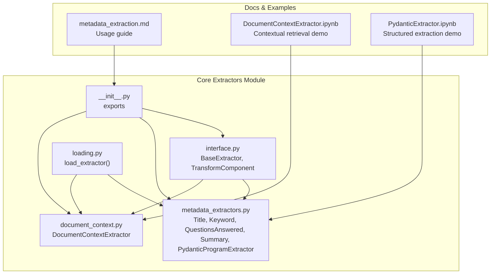
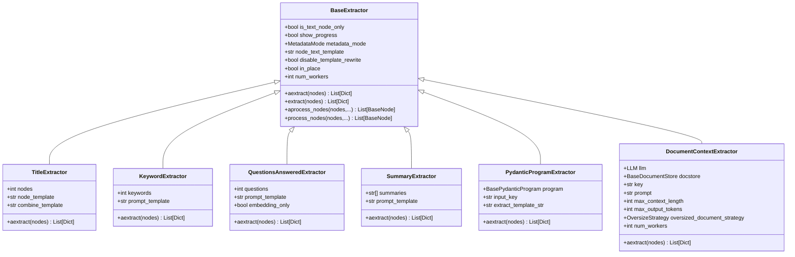
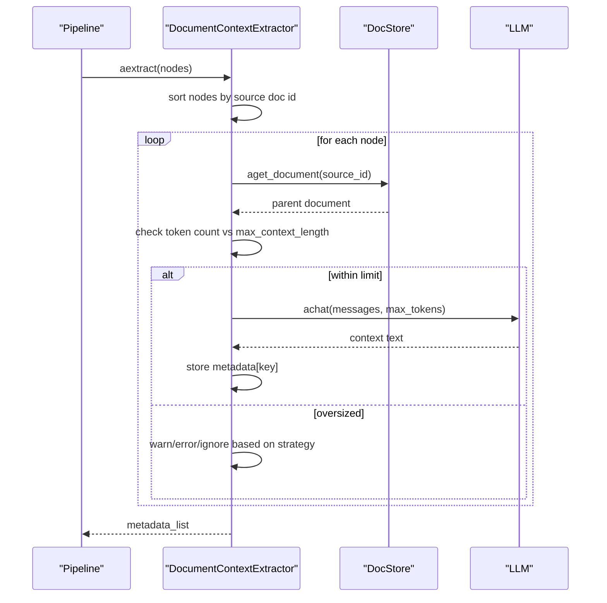
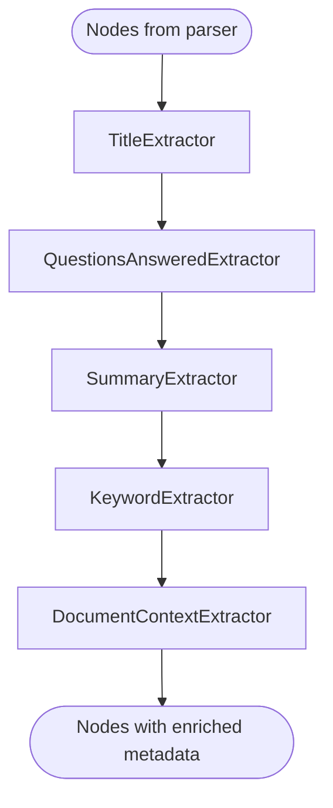
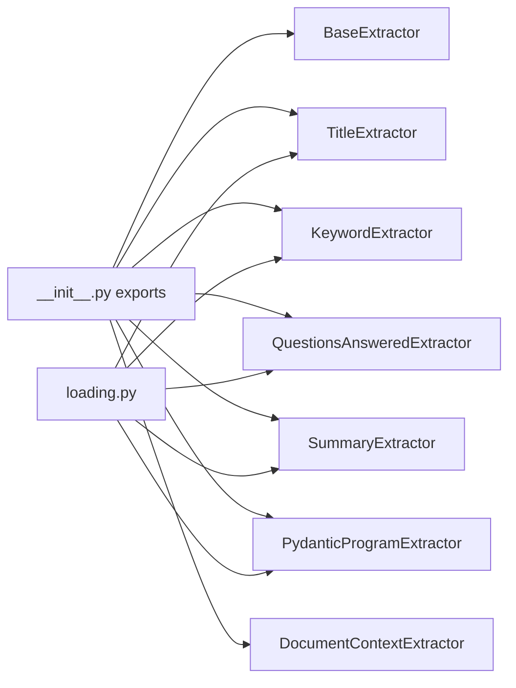

# Built-in Extractors

<cite>
**Referenced Files in This Document**
- [__init__.py](file://llama-index-core/llama_index/core/extractors/__init__.py)
- [interface.py](file://llama-index-core/llama_index/core/extractors/interface.py)
- [metadata_extractors.py](file://llama-index-core/llama_index/core/extractors/metadata_extractors.py)
- [document_context.py](file://llama-index-core/llama_index/core/extractors/document_context.py)
- [loading.py](file://llama-index-core/llama_index/core/extractors/loading.py)
- [test_document_context_extractor.py](file://llama-index-core/tests/extractors/test_document_context_extractor.py)
- [metadata_extraction.md](file://docs/src/content/docs/framework/module_guides/indexing/metadata_extraction.md)
- [DocumentContextExtractor.ipynb](file://docs/examples/metadata_extraction/DocumentContextExtractor.ipynb)
- [PydanticExtractor.ipynb](file://docs/examples/metadata_extraction/PydanticExtractor.ipynb)
</cite>

## Table of Contents
1. [Introduction](#introduction)
2. [Project Structure](#project-structure)
3. [Core Components](#core-components)
4. [Architecture Overview](#architecture-overview)
5. [Detailed Component Analysis](#detailed-component-analysis)
6. [Dependency Analysis](#dependency-analysis)
7. [Performance Considerations](#performance-considerations)
8. [Troubleshooting Guide](#troubleshooting-guide)
9. [Conclusion](#conclusion)
10. [Appendices](#appendices)

## Introduction
This document explains LlamaIndex’s built-in metadata extractors, focusing on the DocumentContextExtractor for document-level context enhancement and other specialized extractors for common metadata patterns. It details configuration options, supported metadata types, usage patterns, chaining capabilities, performance characteristics, and integration with the ingestion pipeline. Practical examples illustrate extracting document categories, publication dates, author information, and custom business metadata, along with best practices for effective use.

## Project Structure
The built-in extractors live in the core extractors module and are complemented by documentation and examples that demonstrate usage in notebooks and guides.

**Diagram sources**
- [__init__.py](file://llama-index-core/llama_index/core/extractors/__init__.py#L1-L20)
- [interface.py](file://llama-index-core/llama_index/core/extractors/interface.py#L22-L179)
- [metadata_extractors.py](file://llama-index-core/llama_index/core/extractors/metadata_extractors.py#L1-L536)
- [document_context.py](file://llama-index-core/llama_index/core/extractors/document_context.py#L55-L352)
- [loading.py](file://llama-index-core/llama_index/core/extractors/loading.py#L1-L30)
- [metadata_extraction.md](file://docs/src/content/docs/framework/module_guides/indexing/metadata_extraction.md#L1-L95)
- [DocumentContextExtractor.ipynb](file://docs/examples/metadata_extraction/DocumentContextExtractor.ipynb#L1-L305)
- [PydanticExtractor.ipynb](file://docs/examples/metadata_extraction/PydanticExtractor.ipynb#L1-L361)

**Section sources**
- [__init__.py](file://llama-index-core/llama_index/core/extractors/__init__.py#L1-L20)
- [metadata_extraction.md](file://docs/src/content/docs/framework/module_guides/indexing/metadata_extraction.md#L1-L95)

## Core Components
- BaseExtractor: Defines the extractor contract, async/sync entry points, and chaining via process_nodes/aprocess_nodes. Supports worker concurrency, metadata modes, and node text templates.
- Specialized extractors:
  - TitleExtractor: Document-level title inference across node groups.
  - KeywordExtractor: Node-level keywords.
  - QuestionsAnsweredExtractor: Node-level question generation.
  - SummaryExtractor: Node-level summaries with optional prev/next sharing.
  - PydanticProgramExtractor: Structured extraction using a Pydantic program.
  - DocumentContextExtractor: LLM-based contextual metadata per node using the parent document.

Supported metadata fields:
- TitleExtractor: document_title
- KeywordExtractor: excerpt_keywords
- QuestionsAnsweredExtractor: questions_this_excerpt_can_answer
- SummaryExtractor: section_summary, prev_section_summary, next_section_summary
- PydanticProgramExtractor: fields from the Pydantic model
- DocumentContextExtractor: configurable key (default “context”)

**Section sources**
- [interface.py](file://llama-index-core/llama_index/core/extractors/interface.py#L22-L179)
- [metadata_extractors.py](file://llama-index-core/llama_index/core/extractors/metadata_extractors.py#L55-L536)
- [document_context.py](file://llama-index-core/llama_index/core/extractors/document_context.py#L55-L103)

## Architecture Overview
The extractors are transform components integrated into the ingestion pipeline. They can be chained and applied to nodes either standalone or as part of transformations.

**Diagram sources**
- [interface.py](file://llama-index-core/llama_index/core/extractors/interface.py#L22-L179)
- [metadata_extractors.py](file://llama-index-core/llama_index/core/extractors/metadata_extractors.py#L55-L536)
- [document_context.py](file://llama-index-core/llama_index/core/extractors/document_context.py#L55-L352)

## Detailed Component Analysis

### DocumentContextExtractor
Purpose:
- Enhances retrieval accuracy by generating per-node contextual metadata using the parent document and an LLM. Implements Anthropic’s contextual retrieval approach.

Key configuration:
- docstore: Required document store for retrieving parent documents.
- llm: LLM instance; defaults to Settings.llm if not provided.
- key: Metadata key to store the generated context (default “context”).
- prompt: Prompt template; supports built-in prompts for succinct or original context.
- max_context_length: Token budget for parent document truncation strategy.
- oversized_document_strategy: Behavior for oversized documents (“warn”, “error”, “ignore”).
- max_output_tokens: Max tokens for LLM context generation.
- num_workers: Concurrency for processing nodes.

Processing logic:
- Sorts nodes by source document ID to optimize docstore access.
- Skips nodes already containing the target metadata key.
- Retrieves parent document, enforces token limits, and applies retry/backoff on rate limits.
- Generates context per node and returns metadata list aligned to input order.

Usage pattern:
- Add documents to the docstore, configure the extractor, and include it in transformations or the ingestion pipeline.

Common metadata produced:
- context (default key)

Example references:
- Notebook demonstrates building a pipeline with DocumentContextExtractor and comparing retrieval scores with and without context.
- Test suite validates behavior for oversized documents and custom prompts.

**Diagram sources**
- [document_context.py](file://llama-index-core/llama_index/core/extractors/document_context.py#L289-L347)
- [DocumentContextExtractor.ipynb](file://docs/examples/metadata_extraction/DocumentContextExtractor.ipynb#L120-L212)

**Section sources**
- [document_context.py](file://llama-index-core/llama_index/core/extractors/document_context.py#L55-L352)
- [test_document_context_extractor.py](file://llama-index-core/tests/extractors/test_document_context_extractor.py#L67-L172)
- [DocumentContextExtractor.ipynb](file://docs/examples/metadata_extraction/DocumentContextExtractor.ipynb#L120-L212)

### TitleExtractor
Purpose:
- Infers document-level titles by sampling node-level clues and combining them into a comprehensive title.

Key configuration:
- llm: LLM instance.
- nodes: Number of leading nodes to use for title clues.
- node_template, combine_template: Prompt templates for clue extraction and combination.

Supported metadata:
- document_title

Usage pattern:
- Typically chained before other extractors to enrich downstream metadata.

**Section sources**
- [metadata_extractors.py](file://llama-index-core/llama_index/core/extractors/metadata_extractors.py#L55-L172)

### KeywordExtractor
Purpose:
- Extracts node-level keywords to aid retrieval and categorization.

Key configuration:
- llm: LLM instance.
- keywords: Number of keywords to extract.
- prompt_template: Template for keyword extraction.

Supported metadata:
- excerpt_keywords

Usage pattern:
- Applied per node; integrates well with summarization and question extraction.

**Section sources**
- [metadata_extractors.py](file://llama-index-core/llama_index/core/extractors/metadata_extractors.py#L179-L251)

### QuestionsAnsweredExtractor
Purpose:
- Generates questions that each node can answer, supporting question-grounded retrieval and evaluation.

Key configuration:
- llm: LLM instance.
- questions: Number of questions to generate.
- prompt_template: Template for question generation.
- embedding_only: Whether to restrict to embedding metadata.

Supported metadata:
- questions_this_excerpt_can_answer

Usage pattern:
- Useful for evaluation datasets and question-focused RAG.

**Section sources**
- [metadata_extractors.py](file://llama-index-core/llama_index/core/extractors/metadata_extractors.py#L268-L346)

### SummaryExtractor
Purpose:
- Produces node-level summaries with optional neighboring context sharing.

Key configuration:
- llm: LLM instance.
- summaries: List of which summaries to extract (“self”, “prev”, “next”).
- prompt_template: Template for summary generation.

Supported metadata:
- section_summary, prev_section_summary, next_section_summary

Usage pattern:
- Enables contextual summarization across adjacent nodes.

**Section sources**
- [metadata_extractors.py](file://llama-index-core/llama_index/core/extractors/metadata_extractors.py#L357-L450)

### PydanticProgramExtractor
Purpose:
- Extracts a structured Pydantic object per node using a program (e.g., OpenAI function calling), returning a flat metadata dictionary.

Key configuration:
- program: A Pydantic program instance.
- input_key: Template variable name for passing content.
- extract_template_str: Prompt template for extraction.

Supported metadata:
- Fields defined by the Pydantic model.

Usage pattern:
- Efficient for extracting multiple related fields in a single LLM call.

**Section sources**
- [metadata_extractors.py](file://llama-index-core/llama_index/core/extractors/metadata_extractors.py#L482-L536)
- [PydanticExtractor.ipynb](file://docs/examples/metadata_extraction/PydanticExtractor.ipynb#L130-L157)

### Extractor Chaining and Integration
- Chaining: BaseExtractor exposes process_nodes/aprocess_nodes to chain extractors and update node metadata in place or as copies.
- Ingestion pipeline: Extractors are commonly included in transformations alongside parsers and splitters.
- Exclusions: process_nodes supports excluding keys from embedding or LLM metadata post-processing.

**Diagram sources**
- [interface.py](file://llama-index-core/llama_index/core/extractors/interface.py#L100-L139)
- [metadata_extraction.md](file://docs/src/content/docs/framework/module_guides/indexing/metadata_extraction.md#L19-L47)

**Section sources**
- [interface.py](file://llama-index-core/llama_index/core/extractors/interface.py#L100-L179)
- [metadata_extraction.md](file://docs/src/content/docs/framework/module_guides/indexing/metadata_extraction.md#L13-L47)

## Dependency Analysis
- Export surface: __init__.py re-exports core extractors and BaseExtractor.
- Loading: loading.py maps class_name to concrete extractor constructors for deserialization.
- Runtime dependencies:
  - LLMs: All LLM-based extractors depend on an LLM instance.
  - DocStore: DocumentContextExtractor depends on a document store for parent document retrieval.
  - Tokenization: DocumentContextExtractor caches token counts via Settings.tokenizer.

**Diagram sources**
- [__init__.py](file://llama-index-core/llama_index/core/extractors/__init__.py#L1-L20)
- [loading.py](file://llama-index-core/llama_index/core/extractors/loading.py#L10-L30)

**Section sources**
- [__init__.py](file://llama-index-core/llama_index/core/extractors/__init__.py#L1-L20)
- [loading.py](file://llama-index-core/llama_index/core/extractors/loading.py#L10-L30)

## Performance Considerations
- Concurrency: num_workers controls parallel processing of nodes; tune based on LLM rate limits and compute capacity.
- Rate limiting: DocumentContextExtractor implements exponential backoff; choose appropriate max_output_tokens and prompt length to reduce cost.
- Token budgeting: DocumentContextExtractor checks token counts and supports oversized document strategies; set max_context_length to balance quality and cost.
- Sorting overhead: DocumentContextExtractor sorts nodes by source ID to optimize docstore access; this improves throughput for large batches.
- Caching: Token counting is cached to avoid repeated computation; oversized documents may bypass cache on second pass.
- Prompt templates: Shorter, focused prompts reduce token usage and cost.

[No sources needed since this section provides general guidance]

## Troubleshooting Guide
Common issues and resolutions:
- Missing LLM: Ensure llm is provided or configured in Settings; DocumentContextExtractor asserts presence of chat capability.
- Oversized documents: Configure oversized_document_strategy to “warn” or “error” depending on desired behavior; adjust max_context_length accordingly.
- Non-text nodes: Some extractors require TextNode; BaseExtractor exposes is_text_node_only to filter unsupported node types.
- Rate limits: DocumentContextExtractor retries with exponential backoff; reduce concurrency or increase delays via configuration.
- Missing docstore content: Ensure documents are added to the docstore before running DocumentContextExtractor.

**Section sources**
- [document_context.py](file://llama-index-core/llama_index/core/extractors/document_context.py#L117-L132)
- [document_context.py](file://llama-index-core/llama_index/core/extractors/document_context.py#L268-L287)
- [test_document_context_extractor.py](file://llama-index-core/tests/extractors/test_document_context_extractor.py#L103-L135)

## Conclusion
LlamaIndex’s built-in extractors provide a robust toolkit for enriching node metadata across diverse use cases. DocumentContextExtractor enhances retrieval by generating contextual metadata per node using the parent document and an LLM. Other extractors enable structured summarization, keyword extraction, question generation, and document-level titles. Together with chaining and ingestion pipeline integration, these extractors support scalable, high-quality RAG systems with configurable performance trade-offs.

[No sources needed since this section summarizes without analyzing specific files]

## Appendices

### Supported Metadata Types and Keys
- TitleExtractor: document_title
- KeywordExtractor: excerpt_keywords
- QuestionsAnsweredExtractor: questions_this_excerpt_can_answer
- SummaryExtractor: section_summary, prev_section_summary, next_section_summary
- PydanticProgramExtractor: fields from the Pydantic model
- DocumentContextExtractor: configurable key (default “context”)

**Section sources**
- [metadata_extractors.py](file://llama-index-core/llama_index/core/extractors/metadata_extractors.py#L5-L21)
- [document_context.py](file://llama-index-core/llama_index/core/extractors/document_context.py#L102-L103)

### Usage Patterns and Examples
- Ingestion pipeline: Combine extractors with parsers and splitters; see the usage guide and notebook examples.
- Document-level context: Use DocumentContextExtractor to improve retrieval accuracy by embedding chunks with contextual metadata.
- Structured extraction: Use PydanticProgramExtractor to extract multiple related fields efficiently.

**Section sources**
- [metadata_extraction.md](file://docs/src/content/docs/framework/module_guides/indexing/metadata_extraction.md#L19-L47)
- [DocumentContextExtractor.ipynb](file://docs/examples/metadata_extraction/DocumentContextExtractor.ipynb#L120-L212)
- [PydanticExtractor.ipynb](file://docs/examples/metadata_extraction/PydanticExtractor.ipynb#L130-L157)