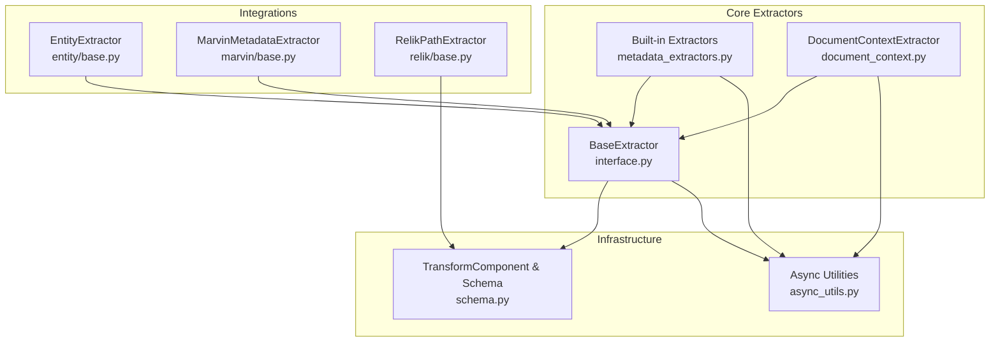
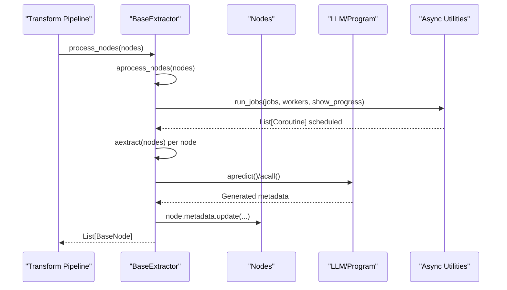
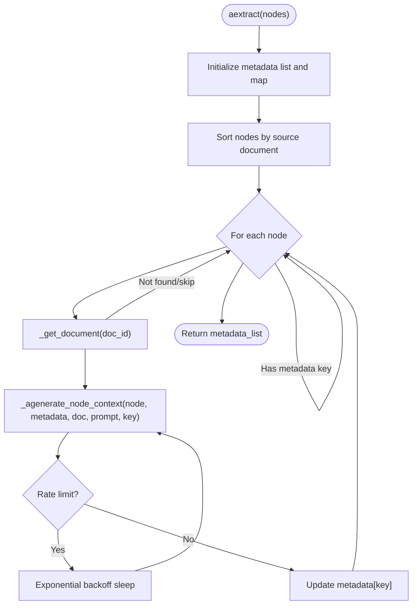
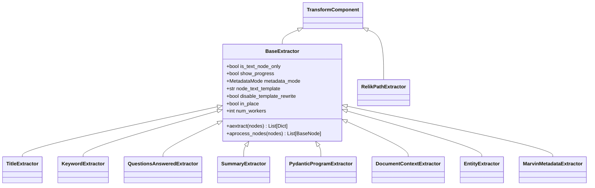

# Custom Extractor Development

<cite>
**Referenced Files in This Document**
- [interface.py](file://llama-index-core/llama_index/core/extractors/interface.py)
- [metadata_extractors.py](file://llama-index-core/llama_index/core/extractors/metadata_extractors.py)
- [document_context.py](file://llama-index-core/llama_index/core/extractors/document_context.py)
- [base.py](file://llama-index-integrations/extractors/llama-index-extractors-entity/llama_index/extractors/entity/base.py)
- [base.py](file://llama-index-integrations/extractors/llama-index-extractors-marvin/llama_index/extractors/marvin/base.py)
- [base.py](file://llama-index-integrations/extractors/llama-index-extractors-relik/llama_index/extractors/relik/base.py)
- [schema.py](file://llama-index-core/llama_index/core/schema.py)
- [async_utils.py](file://llama-index-core/llama_index/core/async_utils.py)
- [test_document_context_extractor.py](file://llama-index-core/tests/extractors/test_document_context_extractor.py)
</cite>

## Table of Contents
1. [Introduction](#introduction)
2. [Project Structure](#project-structure)
3. [Core Components](#core-components)
4. [Architecture Overview](#architecture-overview)
5. [Detailed Component Analysis](#detailed-component-analysis)
6. [Dependency Analysis](#dependency-analysis)
7. [Performance Considerations](#performance-considerations)
8. [Troubleshooting Guide](#troubleshooting-guide)
9. [Conclusion](#conclusion)
10. [Appendices](#appendices)

## Introduction
This document explains how to build custom metadata extractors in LlamaIndex. It covers the BaseExtractor interface, required methods, async/await patterns, node processing workflows, and integration with the TransformComponent system. It also provides step-by-step examples for domain-specific extractors, handling different data formats, configuration and parameter handling, error management, testing strategies, performance optimization, concurrent processing, and production best practices.

## Project Structure
The extractor ecosystem centers around the core BaseExtractor interface and several built-in extractors. Integrations provide additional specialized extractors. The TransformComponent base enables chaining and consistent processing across extractors.

**Diagram sources**
- [interface.py](file://llama-index-core/llama_index/core/extractors/interface.py#L22-L179)
- [metadata_extractors.py](file://llama-index-core/llama_index/core/extractors/metadata_extractors.py#L55-L536)
- [document_context.py](file://llama-index-core/llama_index/core/extractors/document_context.py#L55-L352)
- [base.py](file://llama-index-integrations/extractors/llama-index-extractors-entity/llama_index/extractors/entity/base.py#L31-L154)
- [base.py](file://llama-index-integrations/extractors/llama-index-extractors-marvin/llama_index/extractors/marvin/base.py#L16-L74)
- [base.py](file://llama-index-integrations/extractors/llama-index-extractors-relik/llama_index/extractors/relik/base.py#L16-L144)
- [schema.py](file://llama-index-core/llama_index/core/schema.py#L190-L200)
- [async_utils.py](file://llama-index-core/llama_index/core/async_utils.py#L137-L175)

**Section sources**
- [interface.py](file://llama-index-core/llama_index/core/extractors/interface.py#L22-L179)
- [metadata_extractors.py](file://llama-index-core/llama_index/core/extractors/metadata_extractors.py#L55-L536)
- [document_context.py](file://llama-index-core/llama_index/core/extractors/document_context.py#L55-L352)
- [base.py](file://llama-index-integrations/extractors/llama-index-extractors-entity/llama_index/extractors/entity/base.py#L31-L154)
- [base.py](file://llama-index-integrations/extractors/llama-index-extractors-marvin/llama_index/extractors/marvin/base.py#L16-L74)
- [base.py](file://llama-index-integrations/extractors/llama-index-extractors-relik/llama_index/extractors/relik/base.py#L16-L144)
- [schema.py](file://llama-index-core/llama_index/core/schema.py#L190-L200)
- [async_utils.py](file://llama-index-core/llama_index/core/async_utils.py#L137-L175)

## Core Components
- BaseExtractor: Defines the async metadata extraction contract and integrates with TransformComponent for node processing and chaining.
- Built-in Extractors: TitleExtractor, KeywordExtractor, QuestionsAnsweredExtractor, SummaryExtractor, PydanticProgramExtractor demonstrate patterns for LLM-driven and programmatic extraction.
- DocumentContextExtractor: Demonstrates advanced async orchestration, rate-limit handling, token counting, and parallel processing.
- Integration Extractors: EntityExtractor (NLP model), MarvinMetadataExtractor (external casting), RelikPathExtractor (graph extraction) show diverse extraction strategies.

Key responsibilities:
- Async extraction via aextract(nodes) returning per-node metadata dicts.
- Synchronous wrappers extract(...) delegating to asyncio event loop helpers.
- Node processing via aprocess_nodes(...) that updates node.metadata and optionally rewrites text templates.
- Configuration via Pydantic fields, including num_workers, show_progress, metadata_mode, and node_text_template.

**Section sources**
- [interface.py](file://llama-index-core/llama_index/core/extractors/interface.py#L22-L179)
- [metadata_extractors.py](file://llama-index-core/llama_index/core/extractors/metadata_extractors.py#L55-L536)
- [document_context.py](file://llama-index-core/llama_index/core/extractors/document_context.py#L55-L352)
- [base.py](file://llama-index-integrations/extractors/llama-index-extractors-entity/llama_index/extractors/entity/base.py#L31-L154)
- [base.py](file://llama-index-integrations/extractors/llama-index-extractors-marvin/llama_index/extractors/marvin/base.py#L16-L74)
- [base.py](file://llama-index-integrations/extractors/llama-index-extractors-relik/llama_index/extractors/relik/base.py#L16-L144)

## Architecture Overview
The extractor pipeline integrates with the TransformComponent system. Extractors receive sequences of nodes, compute metadata, and either mutate nodes in place or return copies. They support parallel execution and progress reporting.

**Diagram sources**
- [interface.py](file://llama-index-core/llama_index/core/extractors/interface.py#L100-L154)
- [async_utils.py](file://llama-index-core/llama_index/core/async_utils.py#L137-L175)
- [metadata_extractors.py](file://llama-index-core/llama_index/core/extractors/metadata_extractors.py#L241-L250)

## Detailed Component Analysis

### BaseExtractor Interface
- Purpose: Unified interface for metadata extraction with async/await support and TransformComponent integration.
- Required methods:
  - aextract(nodes): Asynchronous extraction returning List[Dict].
  - extract(nodes): Synchronous wrapper delegating to asyncio event loop.
  - aprocess_nodes(...): Post-process nodes, update metadata, manage in_place, excluded_* keys, and text templates.
  - process_nodes(...): Synchronous wrapper.
  - __call__/acall: Allow chaining in TransformComponent pipelines.
- Configuration:
  - is_text_node_only: Filter non-TextNode inputs.
  - show_progress: Toggle progress bars.
  - metadata_mode: Control how node content is assembled for extraction.
  - node_text_template/disable_template_rewrite: Control how node text is presented to downstream components.
  - in_place: Mutate nodes or deep-copy before processing.
  - num_workers: Concurrency level for async job execution.

Implementation patterns:
- Use run_jobs(...) to schedule and constrain concurrency.
- Respect metadata_mode when assembling context strings.
- Support optional LLM loading via from_dict(...) for serialization compatibility.

**Section sources**
- [interface.py](file://llama-index-core/llama_index/core/extractors/interface.py#L22-L179)
- [async_utils.py](file://llama-index-core/llama_index/core/async_utils.py#L137-L175)

### Built-in Extractors

#### TitleExtractor
- Domain: Document-level title inference across multiple nodes.
- Behavior:
  - Filters nodes by ref_doc_id and limits to configured count.
  - Generates candidate titles per node via LLM.
  - Combines candidates into a single document title via another LLM call.
- Patterns:
  - Separate nodes by ref_doc_id.
  - Parallelize per-document title extraction.
  - Aggregate results into per-node metadata.

**Section sources**
- [metadata_extractors.py](file://llama-index-core/llama_index/core/extractors/metadata_extractors.py#L55-L172)

#### KeywordExtractor
- Domain: Node-level keywords.
- Behavior:
  - Calls LLM per node with a prompt template.
  - Returns a standardized metadata key for keywords.

**Section sources**
- [metadata_extractors.py](file://llama-index-core/llama_index/core/extractors/metadata_extractors.py#L179-L251)

#### QuestionsAnsweredExtractor
- Domain: Node-level question generation.
- Behavior:
  - Generates questions per node using a prompt template.
  - Supports embedding-only mode for downstream indexing.

**Section sources**
- [metadata_extractors.py](file://llama-index-core/llama_index/core/extractors/metadata_extractors.py#L268-L346)

#### SummaryExtractor
- Domain: Node-level summaries with optional prev/next sharing.
- Behavior:
  - Validates TextNode requirement.
  - Computes summaries for each node and optionally shares neighbor summaries.

**Section sources**
- [metadata_extractors.py](file://llama-index-core/llama_index/core/extractors/metadata_extractors.py#L357-L450)

#### PydanticProgramExtractor
- Domain: Structured extraction using a Pydantic program.
- Behavior:
  - Formats extraction prompt with node content.
  - Executes program.acall(...) and returns model_dump().

**Section sources**
- [metadata_extractors.py](file://llama-index-core/llama_index/core/extractors/metadata_extractors.py#L482-L536)

### DocumentContextExtractor
- Domain: Enhances retrieval accuracy by generating contextual metadata per node using the parent document.
- Advanced patterns:
  - Token counting with caching and optional oversized document strategies (warn/error/ignore).
  - Rate-limit handling with exponential backoff and prompt caching headers.
  - Parallel processing via run_jobs with configurable workers.
  - Sorting nodes by source document to optimize prompt caching and reduce redundant work.
  - Skips nodes already containing the target metadata key.

**Diagram sources**
- [document_context.py](file://llama-index-core/llama_index/core/extractors/document_context.py#L289-L347)
- [document_context.py](file://llama-index-core/llama_index/core/extractors/document_context.py#L146-L250)
- [document_context.py](file://llama-index-core/llama_index/core/extractors/document_context.py#L252-L287)

**Section sources**
- [document_context.py](file://llama-index-core/llama_index/core/extractors/document_context.py#L55-L352)
- [test_document_context_extractor.py](file://llama-index-core/tests/extractors/test_document_context_extractor.py#L77-L172)

### Integration Extractors

#### EntityExtractor (SpanMarker)
- Domain: Named entity extraction using a pre-trained NER model.
- Behavior:
  - Predicts spans per node text.
  - Aggregates entities by mapped labels.
  - Supports device selection and confidence thresholds.

**Section sources**
- [base.py](file://llama-index-integrations/extractors/llama-index-extractors-entity/llama_index/extractors/entity/base.py#L31-L154)

#### MarvinMetadataExtractor
- Domain: Cast node content into a Pydantic model using an external library.
- Behavior:
  - Uses async casting to produce structured metadata.

**Section sources**
- [base.py](file://llama-index-integrations/extractors/llama-index-extractors-marvin/llama_index/extractors/marvin/base.py#L16-L74)

#### RelikPathExtractor
- Domain: Extract entities and relations into a graph structure.
- Behavior:
  - Converts Relik output into graph nodes/edges.
  - Applies confidence thresholds and optional self-loop filtering.

**Section sources**
- [base.py](file://llama-index-integrations/extractors/llama-index-extractors-relik/llama_index/extractors/relik/base.py#L16-L144)

## Dependency Analysis
- BaseExtractor extends TransformComponent, enabling seamless integration into transformation pipelines.
- Built-in extractors depend on LLMs and Pydantic programs for structured extraction.
- DocumentContextExtractor depends on:
  - LLM chat APIs supporting prompt caching headers.
  - Tokenizer for length estimation.
  - DocumentStore for retrieving parent documents.
- Async utilities provide concurrency control and progress reporting.

**Diagram sources**
- [schema.py](file://llama-index-core/llama_index/core/schema.py#L190-L200)
- [interface.py](file://llama-index-core/llama_index/core/extractors/interface.py#L22-L179)
- [metadata_extractors.py](file://llama-index-core/llama_index/core/extractors/metadata_extractors.py#L55-L536)
- [document_context.py](file://llama-index-core/llama_index/core/extractors/document_context.py#L55-L352)
- [base.py](file://llama-index-integrations/extractors/llama-index-extractors-entity/llama_index/extractors/entity/base.py#L31-L154)
- [base.py](file://llama-index-integrations/extractors/llama-index-extractors-marvin/llama_index/extractors/marvin/base.py#L16-L74)
- [base.py](file://llama-index-integrations/extractors/llama-index-extractors-relik/llama_index/extractors/relik/base.py#L16-L144)

**Section sources**
- [schema.py](file://llama-index-core/llama_index/core/schema.py#L190-L200)
- [interface.py](file://llama-index-core/llama_index/core/extractors/interface.py#L22-L179)
- [metadata_extractors.py](file://llama-index-core/llama_index/core/extractors/metadata_extractors.py#L55-L536)
- [document_context.py](file://llama-index-core/llama_index/core/extractors/document_context.py#L55-L352)
- [base.py](file://llama-index-integrations/extractors/llama-index-extractors-entity/llama_index/extractors/entity/base.py#L31-L154)
- [base.py](file://llama-index-integrations/extractors/llama-index-extractors-marvin/llama_index/extractors/marvin/base.py#L16-L74)
- [base.py](file://llama-index-integrations/extractors/llama-index-extractors-relik/llama_index/extractors/relik/base.py#L16-L144)

## Performance Considerations
- Concurrency control:
  - Use num_workers to cap concurrent jobs.
  - run_jobs(...) enforces a semaphore to avoid overwhelming external APIs.
- Progress reporting:
  - show_progress toggles tqdm-based progress bars for long-running extractions.
- Token budgeting:
  - DocumentContextExtractor caches token counts and applies strategies for oversized documents.
- In-place processing:
  - in_place=True reduces memory overhead by mutating nodes directly.
- Template rewriting:
  - node_text_template can be customized to improve downstream LLM prompts.
- Worker sizing:
  - DEFAULT_NUM_WORKERS is a sensible baseline; tune based on API rate limits and latency.

[No sources needed since this section provides general guidance]

## Troubleshooting Guide
Common issues and resolutions:
- Rate limits:
  - DocumentContextExtractor implements exponential backoff and logs retry attempts. Adjust max_output_tokens and num_workers to reduce burst usage.
- Oversized documents:
  - Choose warn/error/ignore strategy. For error, catch and handle exceptions upstream.
- Non-TextNode inputs:
  - Some extractors enforce TextNode only. Ensure node parsing yields TextNode instances.
- Missing metadata keys:
  - DocumentContextExtractor skips nodes already containing the target key. Verify key names and extraction order.
- Testing:
  - Use the provided test suite as a reference for mocking LLM responses and validating metadata presence.

**Section sources**
- [document_context.py](file://llama-index-core/llama_index/core/extractors/document_context.py#L198-L248)
- [test_document_context_extractor.py](file://llama-index-core/tests/extractors/test_document_context_extractor.py#L103-L135)

## Conclusion
Custom extractors in LlamaIndex are built on BaseExtractor, which standardizes async metadata extraction and integrates seamlessly with TransformComponent pipelines. By leveraging built-in extractors and integration extractors as patterns, you can implement domain-specific metadata extraction efficiently. Apply concurrency controls, progress reporting, and robust error handling to achieve reliable, production-grade performance.

[No sources needed since this section summarizes without analyzing specific files]

## Appendices

### Step-by-Step: Building a Custom Extractor
- Define a class extending BaseExtractor.
- Implement aextract(nodes) to compute metadata per node and return List[Dict].
- Optionally override process_nodes(...) to customize node mutation behavior.
- Configure Pydantic fields for parameters (e.g., num_workers, metadata_mode).
- Use run_jobs(...) to parallelize extraction and respect show_progress.
- Integrate into a Transform pipeline alongside parsers and other extractors.

**Section sources**
- [interface.py](file://llama-index-core/llama_index/core/extractors/interface.py#L78-L154)
- [async_utils.py](file://llama-index-core/llama_index/core/async_utils.py#L137-L175)

### Handling Different Data Formats
- TextNode-only extractors: Ensure nodes are TextNode instances before extraction.
- Mixed-format extractors: Use is_text_node_only=False and filter appropriately.
- Graph extractors: Use TransformComponent-compatible classes (e.g., RelikPathExtractor) to enrich nodes with graph metadata.

**Section sources**
- [metadata_extractors.py](file://llama-index-core/llama_index/core/extractors/metadata_extractors.py#L118-L124)
- [base.py](file://llama-index-integrations/extractors/llama-index-extractors-relik/llama_index/extractors/relik/base.py#L74-L84)

### Configuration and Parameter Handling
- Use Pydantic fields for typed configuration.
- Load external components (e.g., LLMs) via from_dict(...) for serialization compatibility.
- Tune num_workers, show_progress, and metadata_mode for your workload.

**Section sources**
- [interface.py](file://llama-index-core/llama_index/core/extractors/interface.py#L50-L72)
- [metadata_extractors.py](file://llama-index-core/llama_index/core/extractors/metadata_extractors.py#L85-L107)

### Async/Await Patterns and Node Processing
- Prefer aextract(...) and aprocess_nodes(...) for asynchronous workflows.
- Use asyncio_run(...) wrappers only when synchronous APIs are required.
- Chain extractors by passing them to TransformComponent pipelines.

**Section sources**
- [interface.py](file://llama-index-core/llama_index/core/extractors/interface.py#L89-L179)
- [schema.py](file://llama-index-core/llama_index/core/schema.py#L190-L200)

### Testing Strategies
- Mock LLM responses to validate extraction outputs deterministically.
- Test edge cases: oversized documents, missing keys, invalid node types.
- Validate metadata presence and structure across multiple documents and nodes.

**Section sources**
- [test_document_context_extractor.py](file://llama-index-core/tests/extractors/test_document_context_extractor.py#L77-L172)