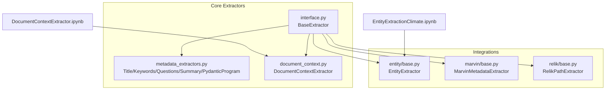
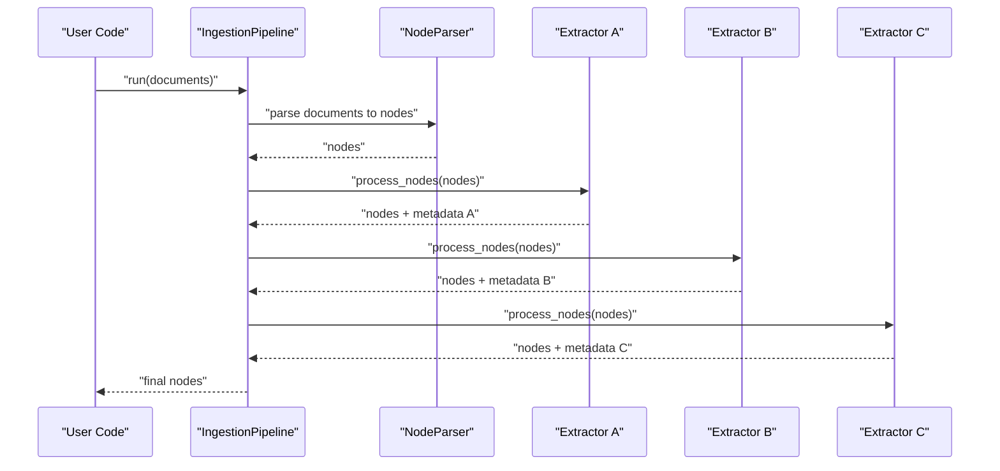
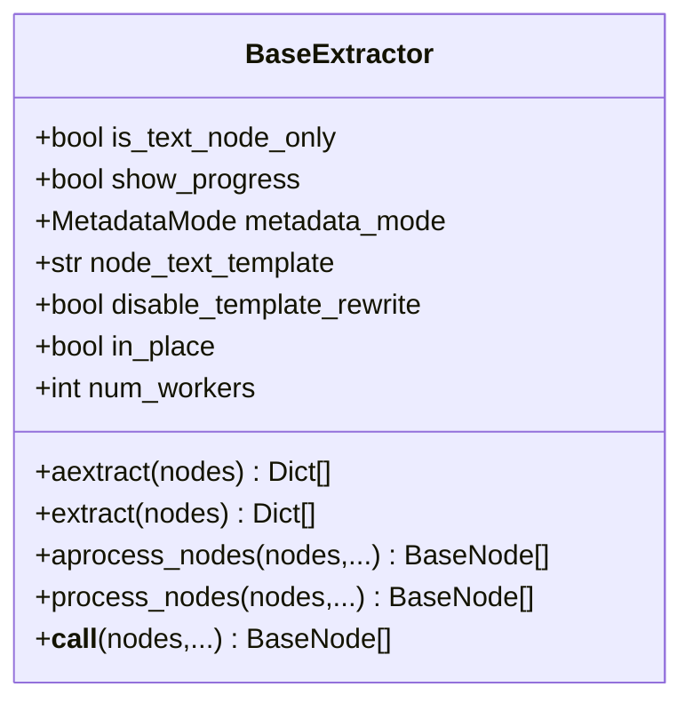
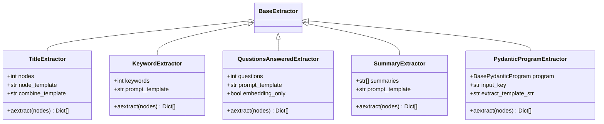
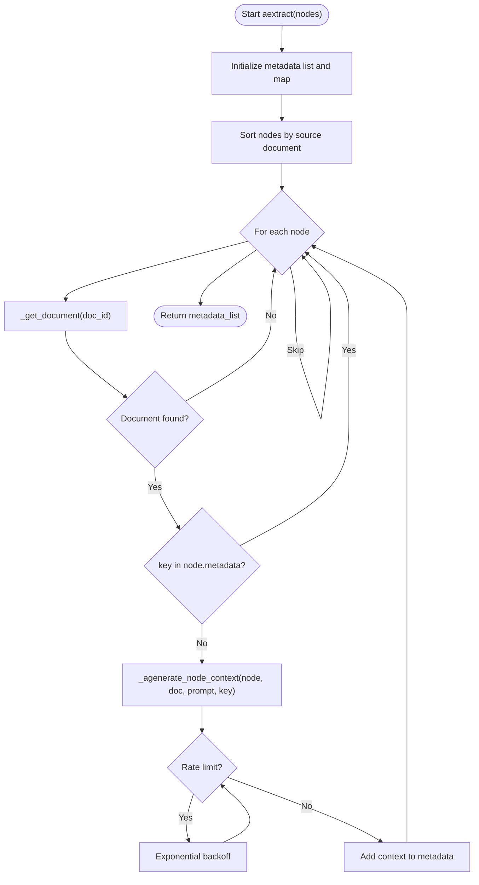
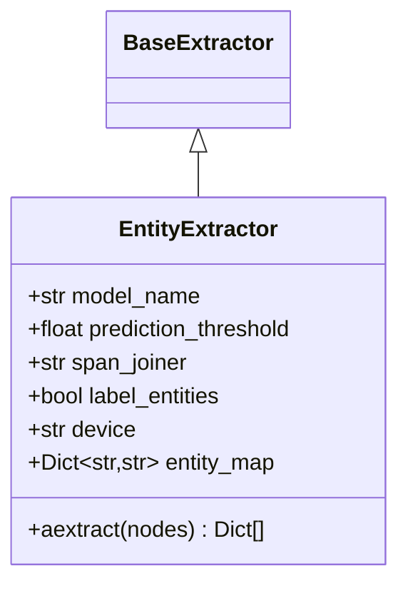
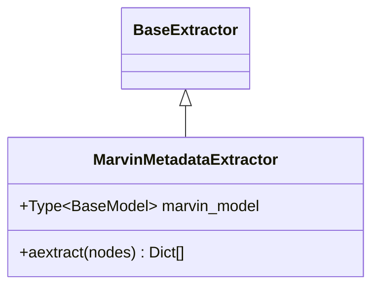
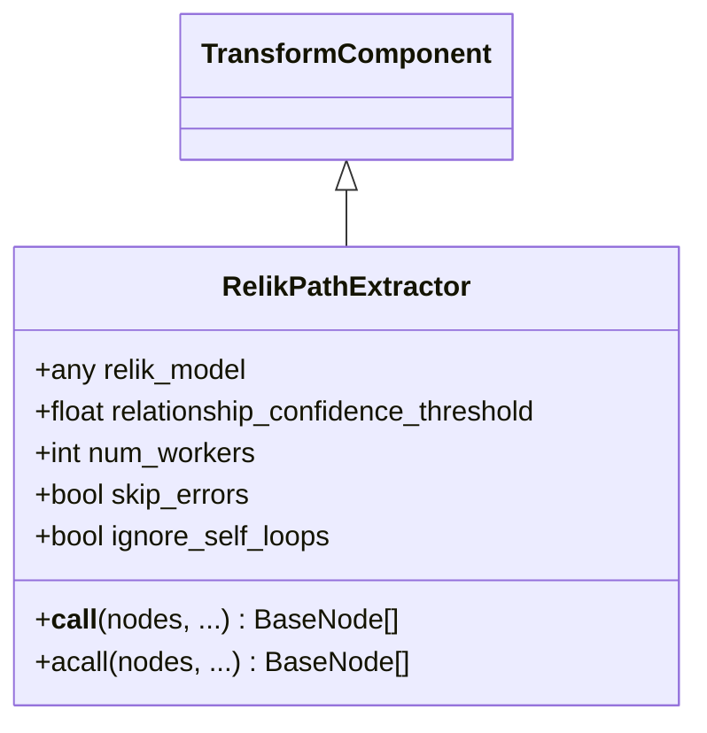
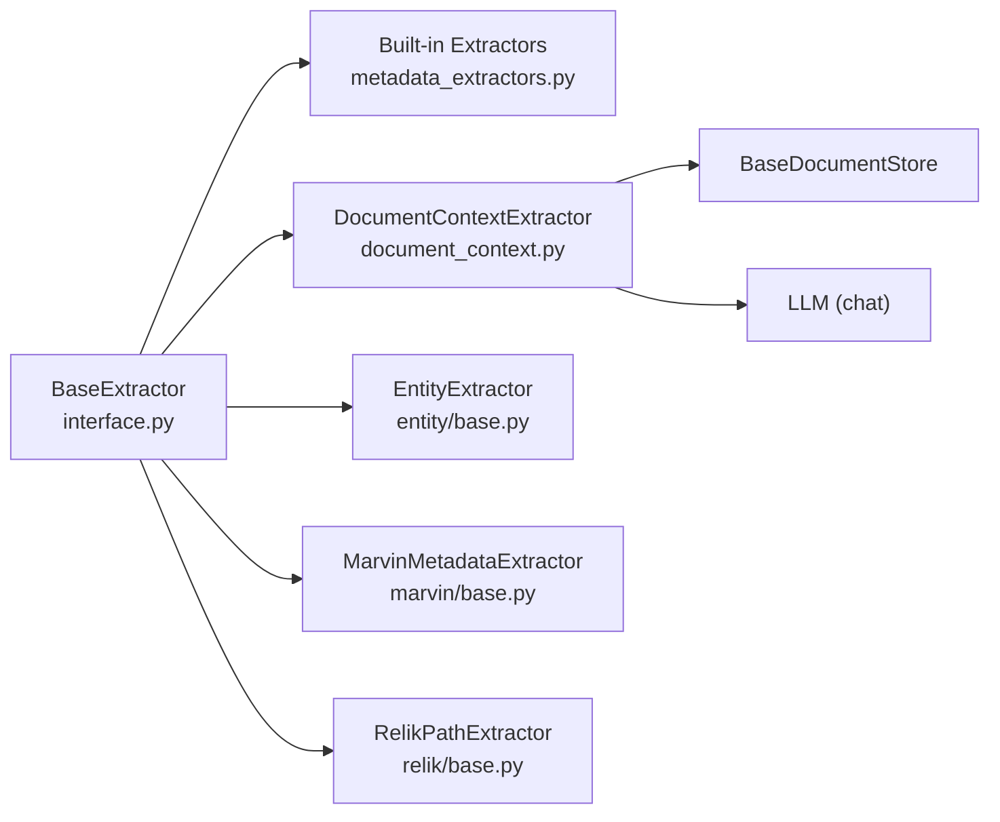

# Extraction Pipelines

<cite>
**Referenced Files in This Document**
- [metadata_extraction.md](file://docs/src/content/docs/framework/module_guides/indexing/metadata_extraction.md)
- [DocumentContextExtractor.ipynb](file://docs/examples/metadata_extraction/DocumentContextExtractor.ipynb)
- [EntityExtractionClimate.ipynb](file://docs/examples/metadata_extraction/EntityExtractionClimate.ipynb)
- [__init__.py](file://llama-index-core/llama_index/core/extractors/__init__.py)
- [interface.py](file://llama-index-core/llama_index/core/extractors/interface.py)
- [metadata_extractors.py](file://llama-index-core/llama_index/core/extractors/metadata_extractors.py)
- [document_context.py](file://llama-index-core/llama_index/core/extractors/document_context.py)
- [base.py (EntityExtractor)](file://llama-index-integrations/extractors/llama-index-extractors-entity/llama_index/extractors/entity/base.py)
- [base.py (MarvinMetadataExtractor)](file://llama-index-integrations/extractors/llama-index-extractors-marvin/llama_index/extractors/marvin/base.py)
- [base.py (RelikPathExtractor)](file://llama-index-integrations/extractors/llama-index-extractors-relik/llama_index/extractors/relik/base.py)
</cite>

## Table of Contents
1. [Introduction](#introduction)
2. [Project Structure](#project-structure)
3. [Core Components](#core-components)
4. [Architecture Overview](#architecture-overview)
5. [Detailed Component Analysis](#detailed-component-analysis)
6. [Dependency Analysis](#dependency-analysis)
7. [Performance Considerations](#performance-considerations)
8. [Troubleshooting Guide](#troubleshooting-guide)
9. [Conclusion](#conclusion)
10. [Appendices](#appendices)

## Introduction
This document explains how to build and manage metadata extraction pipelines in LlamaIndex. It focuses on chaining multiple extractors, configuring extraction order, resolving metadata conflicts, and tuning performance. It also covers integration with the broader ingestion and transformation system, along with practical examples and debugging strategies.

## Project Structure
The extraction pipeline capability spans core extractors and several integrations:
- Core extractors define the base interface and built-in extractors (title, keywords, questions, summaries, document context).
- Integrations provide specialized extractors (entity, marvin-based, relik-based) and notebooks demonstrating end-to-end workflows.

**Diagram sources**
- [interface.py](file://llama-index-core/llama_index/core/extractors/interface.py#L22-L179)
- [metadata_extractors.py](file://llama-index-core/llama_index/core/extractors/metadata_extractors.py#L55-L536)
- [document_context.py](file://llama-index-core/llama_index/core/extractors/document_context.py#L55-L352)
- [base.py (EntityExtractor)](file://llama-index-integrations/extractors/llama-index-extractors-entity/llama_index/extractors/entity/base.py#L31-L154)
- [base.py (MarvinMetadataExtractor)](file://llama-index-integrations/extractors/llama-index-extractors-marvin/llama_index/extractors/marvin/base.py#L16-L74)
- [base.py (RelikPathExtractor)](file://llama-index-integrations/extractors/llama-index-extractors-relik/llama_index/extractors/relik/base.py#L16-L144)
- [DocumentContextExtractor.ipynb](file://docs/examples/metadata_extraction/DocumentContextExtractor.ipynb#L120-L212)
- [EntityExtractionClimate.ipynb](file://docs/examples/metadata_extraction/EntityExtractionClimate.ipynb#L94-L196)

**Section sources**
- [__init__.py](file://llama-index-core/llama_index/core/extractors/__init__.py#L1-L20)
- [metadata_extraction.md](file://docs/src/content/docs/framework/module_guides/indexing/metadata_extraction.md#L1-L95)

## Core Components
- BaseExtractor: Defines the common interface for all extractors, including synchronous/asynchronous extraction, node processing, and worker configuration.
- Built-in extractors: TitleExtractor, KeywordExtractor, QuestionsAnsweredExtractor, SummaryExtractor, PydanticProgramExtractor.
- DocumentContextExtractor: Generates contextual metadata per node using the full document via an LLM, with robust rate-limit handling and token counting.
- Integration extractors: EntityExtractor (SpanMarker NER), MarvinMetadataExtractor (Pydantic casting via Marvin), RelikPathExtractor (knowledge graph triples).

Key capabilities:
- Chaining: Extractors implement a process_nodes method enabling sequential application.
- Parallelism: Worker count controls concurrency; progress reporting is configurable.
- Conflict handling: Metadata updates occur via node.metadata.update; later extractors overwrite earlier ones with the same key unless excluded.

**Section sources**
- [interface.py](file://llama-index-core/llama_index/core/extractors/interface.py#L22-L179)
- [metadata_extractors.py](file://llama-index-core/llama_index/core/extractors/metadata_extractors.py#L55-L536)
- [document_context.py](file://llama-index-core/llama_index/core/extractors/document_context.py#L55-L352)
- [base.py (EntityExtractor)](file://llama-index-integrations/extractors/llama-index-extractors-entity/llama_index/extractors/entity/base.py#L31-L154)
- [base.py (MarvinMetadataExtractor)](file://llama-index-integrations/extractors/llama-index-extractors-marvin/llama_index/extractors/marvin/base.py#L16-L74)
- [base.py (RelikPathExtractor)](file://llama-index-integrations/extractors/llama-index-extractors-relik/llama_index/extractors/relik/base.py#L16-L144)

## Architecture Overview
The extraction pipeline integrates with the ingestion system. Nodes flow through a sequence of transformations (parsers and extractors), each enriching node.metadata. Extractors can be chained and configured for parallel execution.

**Diagram sources**
- [metadata_extraction.md](file://docs/src/content/docs/framework/module_guides/indexing/metadata_extraction.md#L19-L47)
- [interface.py](file://llama-index-core/llama_index/core/extractors/interface.py#L100-L138)

## Detailed Component Analysis

### BaseExtractor and Chaining
- Provides aextract/extract and process_nodes/aprocess_nodes for synchronous/asynchronous enrichment.
- Supports in-place processing, metadata exclusion lists, and text template rewriting.
- Enables chaining by passing nodes through successive extractors.

**Diagram sources**
- [interface.py](file://llama-index-core/llama_index/core/extractors/interface.py#L22-L179)

**Section sources**
- [interface.py](file://llama-index-core/llama_index/core/extractors/interface.py#L22-L179)

### Built-in Extractors
- TitleExtractor: Infers document-level titles from node samples and merges them into a single title per document.
- KeywordExtractor: Generates concise keywords per node.
- QuestionsAnsweredExtractor: Produces questions a node can answer.
- SummaryExtractor: Summarizes self, previous, and next nodes; supports adjacent sharing.
- PydanticProgramExtractor: Uses a Pydantic program to extract structured data into metadata.

**Diagram sources**
- [metadata_extractors.py](file://llama-index-core/llama_index/core/extractors/metadata_extractors.py#L55-L536)

**Section sources**
- [metadata_extractors.py](file://llama-index-core/llama_index/core/extractors/metadata_extractors.py#L55-L536)

### DocumentContextExtractor
- Generates contextual metadata per node using the full document and an LLM.
- Handles oversized documents via token counting and configurable strategies (warn/error/ignore).
- Implements retry/backoff for rate limits and caches token counts.
- Sorts nodes by source document to optimize processing order.

**Diagram sources**
- [document_context.py](file://llama-index-core/llama_index/core/extractors/document_context.py#L289-L347)

**Section sources**
- [document_context.py](file://llama-index-core/llama_index/core/extractors/document_context.py#L55-L352)

### EntityExtractor (Integration)
- Performs NER using SpanMarker and stores entities in metadata.
- Supports confidence thresholds, labeling, and device selection.
- Outputs sets of entities per node, converted to lists.

**Diagram sources**
- [base.py (EntityExtractor)](file://llama-index-integrations/extractors/llama-index-extractors-entity/llama_index/extractors/entity/base.py#L31-L154)

**Section sources**
- [base.py (EntityExtractor)](file://llama-index-integrations/extractors/llama-index-extractors-entity/llama_index/extractors/entity/base.py#L31-L154)

### MarvinMetadataExtractor (Integration)
- Casts node content into a Pydantic model using Marvin and stores the result under a dedicated metadata key.
- Useful for structured custom metadata extraction.

**Diagram sources**
- [base.py (MarvinMetadataExtractor)](file://llama-index-integrations/extractors/llama-index-extractors-marvin/llama_index/extractors/marvin/base.py#L16-L74)

**Section sources**
- [base.py (MarvinMetadataExtractor)](file://llama-index-integrations/extractors/llama-index-extractors-marvin/llama_index/extractors/marvin/base.py#L16-L74)

### RelikPathExtractor (Integration)
- Converts node text into knowledge graph triples using the Relik library.
- Stores nodes and relations in metadata keys for downstream graph processing.

**Diagram sources**
- [base.py (RelikPathExtractor)](file://llama-index-integrations/extractors/llama-index-extractors-relik/llama_index/extractors/relik/base.py#L16-L144)

**Section sources**
- [base.py (RelikPathExtractor)](file://llama-index-integrations/extractors/llama-index-extractors-relik/llama_index/extractors/relik/base.py#L16-L144)

## Dependency Analysis
- Core extractors depend on BaseExtractor and share common fields (metadata_mode, num_workers, show_progress).
- DocumentContextExtractor depends on a document store and an LLM with chat capabilities.
- Integration extractors depend on external libraries (SpanMarker, Marvin, Relik) and are optional.

**Diagram sources**
- [interface.py](file://llama-index-core/llama_index/core/extractors/interface.py#L22-L179)
- [metadata_extractors.py](file://llama-index-core/llama_index/core/extractors/metadata_extractors.py#L55-L536)
- [document_context.py](file://llama-index-core/llama_index/core/extractors/document_context.py#L55-L132)
- [base.py (EntityExtractor)](file://llama-index-integrations/extractors/llama-index-extractors-entity/llama_index/extractors/entity/base.py#L31-L114)
- [base.py (MarvinMetadataExtractor)](file://llama-index-integrations/extractors/llama-index-extractors-marvin/llama_index/extractors/marvin/base.py#L16-L51)
- [base.py (RelikPathExtractor)](file://llama-index-integrations/extractors/llama-index-extractors-relik/llama_index/extractors/relik/base.py#L39-L68)

**Section sources**
- [__init__.py](file://llama-index-core/llama_index/core/extractors/__init__.py#L1-L20)
- [document_context.py](file://llama-index-core/llama_index/core/extractors/document_context.py#L88-L132)

## Performance Considerations
- Parallelism: Control concurrency via num_workers; adjust based on LLM rate limits and local resources.
- Progress reporting: Enable/disable via show_progress to balance feedback and overhead.
- Token budgeting: DocumentContextExtractor enforces max_context_length and uses token counting; tune oversized_document_strategy.
- Rate limiting: DocumentContextExtractor implements exponential backoff; ensure adequate wait times and consider batching.
- Memory and devices: EntityExtractor supports device selection; offload heavy models to GPU when available.
- Sorting and ordering: DocumentContextExtractor sorts nodes by source to reduce redundant document reads and improve cost efficiency.

[No sources needed since this section provides general guidance]

## Troubleshooting Guide
Common issues and resolutions:
- Missing LLM chat support: DocumentContextExtractor requires an LLM with chat capabilities; ensure the selected LLM exposes the appropriate interface.
- Oversized documents: Configure max_context_length and oversized_document_strategy to warn/error/ignore as needed.
- Rate limits: Expect retries with exponential backoff; consider lowering num_workers or staggering runs.
- Metadata conflicts: Later extractors overwrite earlier metadata with the same key; use excluded_embed_metadata_keys/excluded_llm_metadata_keys to prevent unwanted overwrites.
- External dependencies: EntityExtractor requires SpanMarker; MarvinMetadataExtractor requires Marvin; RelikPathExtractor requires Relik. Install and configure accordingly.

**Section sources**
- [document_context.py](file://llama-index-core/llama_index/core/extractors/document_context.py#L104-L132)
- [document_context.py](file://llama-index-core/llama_index/core/extractors/document_context.py#L270-L286)
- [document_context.py](file://llama-index-core/llama_index/core/extractors/document_context.py#L230-L248)
- [interface.py](file://llama-index-core/llama_index/core/extractors/interface.py#L120-L138)
- [base.py (EntityExtractor)](file://llama-index-integrations/extractors/llama-index-extractors-entity/llama_index/extractors/entity/base.py#L36-L37)
- [base.py (MarvinMetadataExtractor)](file://llama-index-integrations/extractors/llama-index-extractors-marvin/llama_index/extractors/marvin/base.py#L22-L27)
- [base.py (RelikPathExtractor)](file://llama-index-integrations/extractors/llama-index-extractors-relik/llama_index/extractors/relik/base.py#L54-L58)

## Conclusion
LlamaIndex provides a flexible, extensible framework for building metadata extraction pipelines. By chaining extractors, controlling parallelism, and carefully handling metadata conflicts, you can construct robust, high-quality pipelines tailored to your retrieval and downstream tasks. Integrate built-in extractors with specialized integrations and follow the performance and troubleshooting guidance to achieve reliable, scalable results.

[No sources needed since this section summarizes without analyzing specific files]

## Appendices

### Pipeline Configuration Options
- Parallel processing: Adjust num_workers for concurrency.
- Progress reporting: Toggle show_progress for feedback.
- Metadata exclusion: Use excluded_embed_metadata_keys and excluded_llm_metadata_keys to protect sensitive or redundant metadata.
- In-place processing: Control via in_place to mutate nodes or deepcopy before processing.

**Section sources**
- [interface.py](file://llama-index-core/llama_index/core/extractors/interface.py#L45-L48)
- [interface.py](file://llama-index-core/llama_index/core/extractors/interface.py#L120-L138)

### Examples and Workflows
- Document context extraction: Demonstrates DocumentContextExtractor with a document store and LLM, including comparison with and without context.
- Entity extraction: Shows EntityExtractor usage with a long document, highlighting metadata enrichment and query-time differences.

**Section sources**
- [DocumentContextExtractor.ipynb](file://docs/examples/metadata_extraction/DocumentContextExtractor.ipynb#L120-L212)
- [EntityExtractionClimate.ipynb](file://docs/examples/metadata_extraction/EntityExtractionClimate.ipynb#L94-L196)