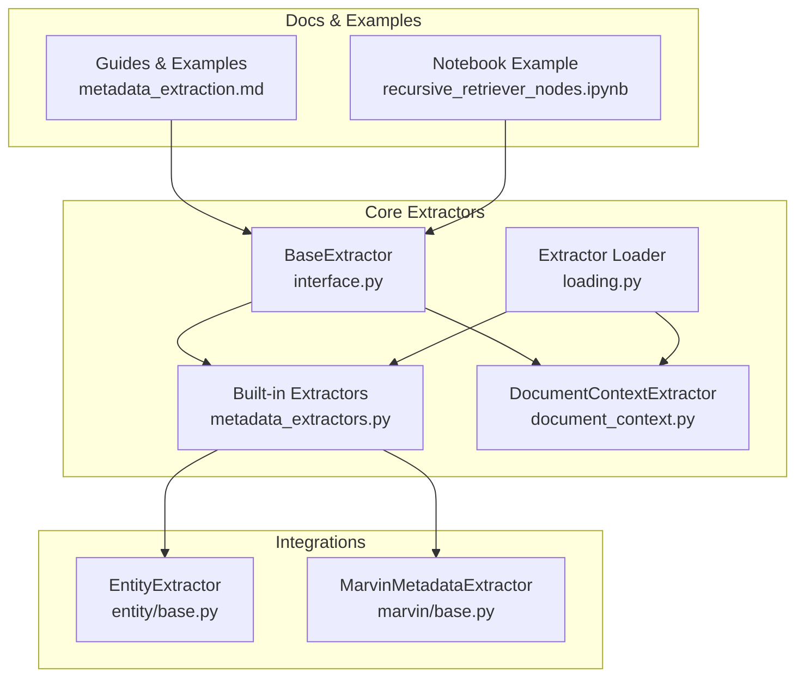
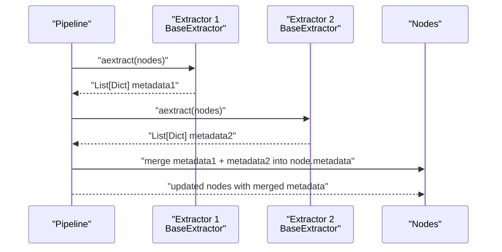
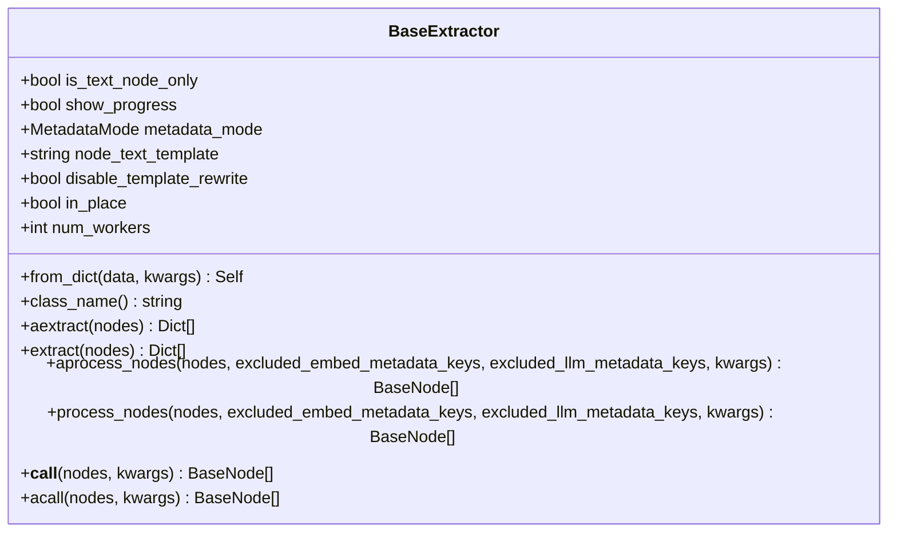
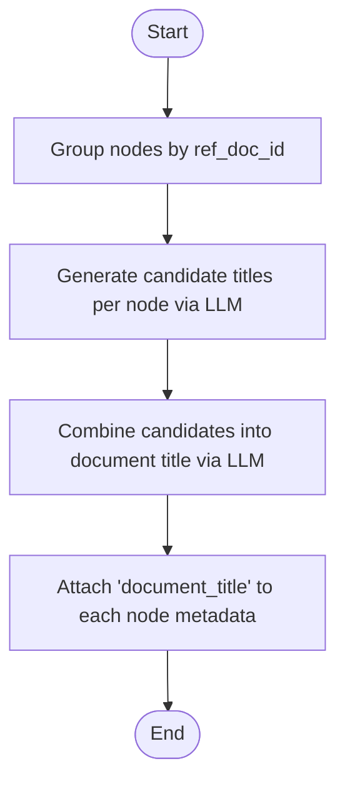
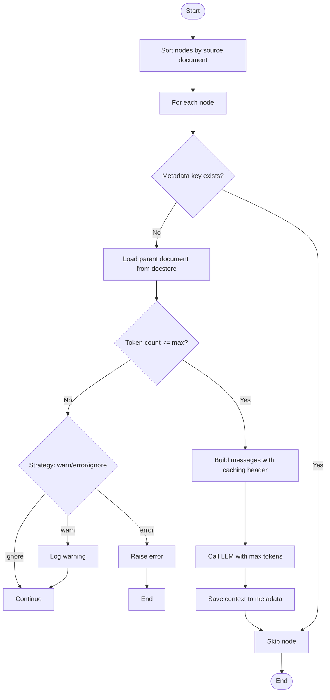
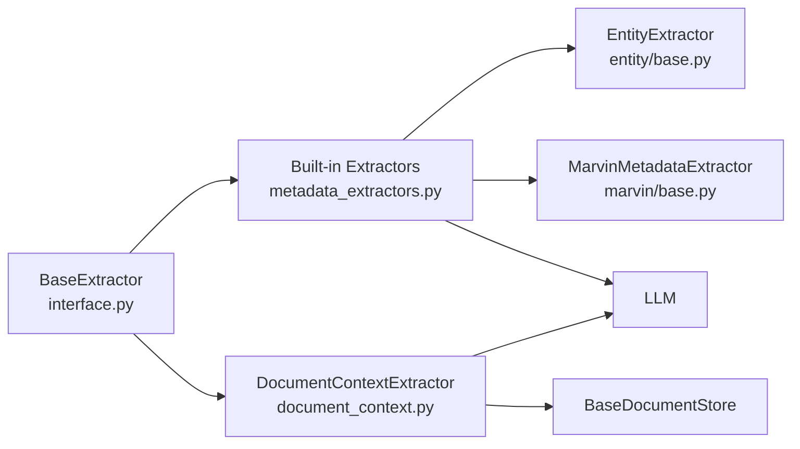

# Metadata Extraction

<cite>
**Referenced Files in This Document**
- [interface.py](file://llama-index-core/llama_index/core/extractors/interface.py)
- [metadata_extractors.py](file://llama-index-core/llama_index/core/extractors/metadata_extractors.py)
- [document_context.py](file://llama-index-core/llama_index/core/extractors/document_context.py)
- [__init__.py](file://llama-index-core/llama_index/core/extractors/__init__.py)
- [loading.py](file://llama-index-core/llama_index/core/extractors/loading.py)
- [entity/base.py](file://llama-index-integrations/extractors/llama-index-extractors-entity/llama_index/extractors/entity/base.py)
- [marvin/base.py](file://llama-index-integrations/extractors/llama-index-extractors-marvin/llama_index/extractors/marvin/base.py)
- [metadata_extraction.md](file://docs/src/content/docs/framework/module_guides/indexing/metadata_extraction.md)
- [recursive_retriever_nodes.ipynb](file://docs/examples/retrievers/recursive_retriever_nodes.ipynb)
- [test_document_context_extractor.py](file://llama-index-core/tests/extractors/test_document_context_extractor.py)
</cite>

## Table of Contents
1. [Introduction](#introduction)
2. [Project Structure](#project-structure)
3. [Core Components](#core-components)
4. [Architecture Overview](#architecture-overview)
5. [Detailed Component Analysis](#detailed-component-analysis)
6. [Dependency Analysis](#dependency-analysis)
7. [Performance Considerations](#performance-considerations)
8. [Troubleshooting Guide](#troubleshooting-guide)
9. [Conclusion](#conclusion)
10. [Appendices](#appendices)

## Introduction
This document explains LlamaIndex’s metadata extraction system. It covers the extraction interface, built-in extractors for document context, entity extraction, and custom metadata, and how to configure extraction pipelines, chain extractors, and handle different metadata types. It also provides guidance on performance optimization, handling missing metadata, integrating with external extraction services, debugging extraction issues, and extending the system with custom extractors.

## Project Structure
The metadata extraction system is centered around a shared interface and several built-in extractors. Integration packages provide additional extractors such as entity and Marvin-based extractors. The core interface and extractors live under the core module, while integrations live under the integrations tree.

**Diagram sources**
- [interface.py](file://llama-index-core/llama_index/core/extractors/interface.py#L22-L179)
- [metadata_extractors.py](file://llama-index-core/llama_index/core/extractors/metadata_extractors.py#L1-L536)
- [document_context.py](file://llama-index-core/llama_index/core/extractors/document_context.py#L55-L352)
- [loading.py](file://llama-index-core/llama_index/core/extractors/loading.py#L1-L29)
- [entity/base.py](file://llama-index-integrations/extractors/llama-index-extractors-entity/llama_index/extractors/entity/base.py#L31-L154)
- [marvin/base.py](file://llama-index-integrations/extractors/llama-index-extractors-marvin/llama_index/extractors/marvin/base.py#L16-L74)
- [metadata_extraction.md](file://docs/src/content/docs/framework/module_guides/indexing/metadata_extraction.md#L61-L95)
- [recursive_retriever_nodes.ipynb](file://docs/examples/retrievers/recursive_retriever_nodes.ipynb#L590-L633)

**Section sources**
- [__init__.py](file://llama-index-core/llama_index/core/extractors/__init__.py#L1-L20)
- [interface.py](file://llama-index-core/llama_index/core/extractors/interface.py#L22-L179)
- [metadata_extractors.py](file://llama-index-core/llama_index/core/extractors/metadata_extractors.py#L1-L536)
- [document_context.py](file://llama-index-core/llama_index/core/extractors/document_context.py#L55-L352)
- [entity/base.py](file://llama-index-integrations/extractors/llama-index-extractors-entity/llama_index/extractors/entity/base.py#L31-L154)
- [marvin/base.py](file://llama-index-integrations/extractors/llama-index-extractors-marvin/llama_index/extractors/marvin/base.py#L16-L74)
- [metadata_extraction.md](file://docs/src/content/docs/framework/module_guides/indexing/metadata_extraction.md#L61-L95)
- [recursive_retriever_nodes.ipynb](file://docs/examples/retrievers/recursive_retriever_nodes.ipynb#L590-L633)

## Core Components
- BaseExtractor: Defines the asynchronous extraction contract, supports chaining via process_nodes, and exposes configuration fields such as metadata_mode, node_text_template, in_place, and num_workers.
- Built-in Extractors:
  - TitleExtractor: Extracts document-level titles across multiple nodes.
  - KeywordExtractor: Extracts keywords per node.
  - QuestionsAnsweredExtractor: Generates questions a node excerpt can answer.
  - SummaryExtractor: Produces self/previous/next section summaries with adjacency sharing.
  - PydanticProgramExtractor: Extracts structured metadata using a Pydantic program.
- DocumentContextExtractor: Generates retrieval-oriented context per node using a parent document store and an LLM.
- Integration Extractors:
  - EntityExtractor: Extracts named entities using a pretrained NER model.
  - MarvinMetadataExtractor: Extracts structured metadata using a Pydantic model via an external library.

**Section sources**
- [interface.py](file://llama-index-core/llama_index/core/extractors/interface.py#L22-L179)
- [metadata_extractors.py](file://llama-index-core/llama_index/core/extractors/metadata_extractors.py#L55-L536)
- [document_context.py](file://llama-index-core/llama_index/core/extractors/document_context.py#L55-L352)
- [entity/base.py](file://llama-index-integrations/extractors/llama-index-extractors-entity/llama_index/extractors/entity/base.py#L31-L154)
- [marvin/base.py](file://llama-index-integrations/extractors/llama-index-extractors-marvin/llama_index/extractors/marvin/base.py#L16-L74)

## Architecture Overview
The extraction pipeline is designed around a common interface and optional chaining. Extractors can be applied in sequence, with each stage updating node metadata. Some extractors rely on an LLM, while others use local models or external libraries.

**Diagram sources**
- [interface.py](file://llama-index-core/llama_index/core/extractors/interface.py#L100-L179)
- [metadata_extractors.py](file://llama-index-core/llama_index/core/extractors/metadata_extractors.py#L113-L171)

## Detailed Component Analysis

### BaseExtractor Interface
- Responsibilities:
  - Define async extraction contract (aextract).
  - Provide synchronous wrapper (extract).
  - Enable chaining via process_nodes/aprocess_nodes, which updates node.metadata and optionally rewrites text templates.
  - Support concurrency via num_workers and progress reporting via show_progress.
- Key fields:
  - metadata_mode: controls how node content is composed for extraction.
  - node_text_template: template for mixing node content with metadata.
  - in_place: whether to mutate nodes or deep-copy them before processing.
  - num_workers: worker count for concurrent job execution.

**Diagram sources**
- [interface.py](file://llama-index-core/llama_index/core/extractors/interface.py#L22-L179)

**Section sources**
- [interface.py](file://llama-index-core/llama_index/core/extractors/interface.py#L22-L179)

### Built-in Extractors

#### TitleExtractor
- Purpose: Extract document-level titles by aggregating node-level candidates and combining them.
- Behavior:
  - Separates nodes by ref_doc_id.
  - Generates candidate titles per node via LLM.
  - Combines candidates into a final document title via LLM.
  - Attaches a document_title to each node’s metadata.

**Diagram sources**
- [metadata_extractors.py](file://llama-index-core/llama_index/core/extractors/metadata_extractors.py#L113-L171)

**Section sources**
- [metadata_extractors.py](file://llama-index-core/llama_index/core/extractors/metadata_extractors.py#L55-L171)

#### KeywordExtractor
- Purpose: Extract keywords per node.
- Behavior:
  - Uses a prompt template to request a fixed number of keywords.
  - Returns a metadata dictionary with a comma-separated keyword list.

**Section sources**
- [metadata_extractors.py](file://llama-index-core/llama_index/core/extractors/metadata_extractors.py#L179-L250)

#### QuestionsAnsweredExtractor
- Purpose: Generate questions that a node excerpt can answer.
- Behavior:
  - Builds a prompt with surrounding context hints.
  - Returns a metadata dictionary with a list of generated questions.

**Section sources**
- [metadata_extractors.py](file://llama-index-core/llama_index/core/extractors/metadata_extractors.py#L268-L345)

#### SummaryExtractor
- Purpose: Produce section summaries with optional previous/next neighbor summaries.
- Behavior:
  - Validates that only TextNode is used.
  - Generates self/prev/next summaries concurrently.
  - Merges results into metadata fields.

**Section sources**
- [metadata_extractors.py](file://llama-index-core/llama_index/core/extractors/metadata_extractors.py#L357-L449)

#### PydanticProgramExtractor
- Purpose: Extract structured metadata using a Pydantic program in a single LLM call.
- Behavior:
  - Formats extraction prompt with node content and target class name.
  - Executes a program and returns a dictionary of attributes.

**Section sources**
- [metadata_extractors.py](file://llama-index-core/llama_index/core/extractors/metadata_extractors.py#L482-L535)

### DocumentContextExtractor
- Purpose: Enhance retrieval accuracy by generating retrieval-oriented context per node using the parent document.
- Behavior:
  - Validates LLM capability for chat with caching headers.
  - Retrieves parent document from a document store.
  - Counts tokens and enforces max_context_length with configurable strategy (warn/error/ignore).
  - Generates succinct context per node via LLM with exponential backoff on rate limits.
  - Stores context under a configurable metadata key.

**Diagram sources**
- [document_context.py](file://llama-index-core/llama_index/core/extractors/document_context.py#L289-L347)

**Section sources**
- [document_context.py](file://llama-index-core/llama_index/core/extractors/document_context.py#L55-L352)
- [test_document_context_extractor.py](file://llama-index-core/tests/extractors/test_document_context_extractor.py#L127-L171)

### Integration Extractors

#### EntityExtractor
- Purpose: Extract named entities using a pretrained NER model and SpanMarker.
- Behavior:
  - Initializes a SpanMarker model and tokenizer.
  - Applies prediction threshold and optional labeling.
  - Aggregates entities into node metadata.

**Section sources**
- [entity/base.py](file://llama-index-integrations/extractors/llama-index-extractors-entity/llama_index/extractors/entity/base.py#L31-L154)

#### MarvinMetadataExtractor
- Purpose: Extract structured metadata using a Pydantic model via an external library.
- Behavior:
  - Uses an async casting function to coerce node content into a target Pydantic model.
  - Stores the result under a dedicated metadata key.

**Section sources**
- [marvin/base.py](file://llama-index-integrations/extractors/llama-index-extractors-marvin/llama_index/extractors/marvin/base.py#L16-L74)

### Loading and Initialization
- The loader supports deserializing extractors from dictionaries, including nested LLMs and predictors.
- Supported extractors include built-ins and TitleExtractor, QuestionsAnsweredExtractor, SummaryExtractor, KeywordExtractor.

**Section sources**
- [loading.py](file://llama-index-core/llama_index/core/extractors/loading.py#L1-L29)

### Chaining Extractors and Pipelines
- Extractors can be chained using process_nodes, which merges metadata into nodes and optionally rewrites text templates.
- Example notebook demonstrates running multiple extractors and merging results.

**Section sources**
- [interface.py](file://llama-index-core/llama_index/core/extractors/interface.py#L100-L179)
- [recursive_retriever_nodes.ipynb](file://docs/examples/retrievers/recursive_retriever_nodes.ipynb#L590-L633)

## Dependency Analysis
- Core dependencies:
  - BaseExtractor depends on schema types, async utilities, and pydantic fields.
  - Built-in extractors depend on LLMs, prompt templates, and async job runners.
  - DocumentContextExtractor depends on a document store, tokenizer, and LLM chat APIs.
- Integration dependencies:
  - EntityExtractor depends on SpanMarker and NLTK tokenization.
  - MarvinMetadataExtractor depends on an external library for casting.

**Diagram sources**
- [interface.py](file://llama-index-core/llama_index/core/extractors/interface.py#L22-L179)
- [metadata_extractors.py](file://llama-index-core/llama_index/core/extractors/metadata_extractors.py#L1-L536)
- [document_context.py](file://llama-index-core/llama_index/core/extractors/document_context.py#L88-L132)
- [entity/base.py](file://llama-index-integrations/extractors/llama-index-extractors-entity/llama_index/extractors/entity/base.py#L1-L154)
- [marvin/base.py](file://llama-index-integrations/extractors/llama-index-extractors-marvin/llama_index/extractors/marvin/base.py#L1-L74)

**Section sources**
- [interface.py](file://llama-index-core/llama_index/core/extractors/interface.py#L22-L179)
- [metadata_extractors.py](file://llama-index-core/llama_index/core/extractors/metadata_extractors.py#L1-L536)
- [document_context.py](file://llama-index-core/llama_index/core/extractors/document_context.py#L88-L132)
- [entity/base.py](file://llama-index-integrations/extractors/llama-index-extractors-entity/llama_index/extractors/entity/base.py#L1-L154)
- [marvin/base.py](file://llama-index-integrations/extractors/llama-index-extractors-marvin/llama_index/extractors/marvin/base.py#L1-L74)

## Performance Considerations
- Concurrency:
  - Use num_workers to parallelize extraction jobs.
  - Progress bars can be disabled to reduce overhead.
- Token counting and caching:
  - DocumentContextExtractor caches token counts to speed up repeated computations.
- Rate limiting:
  - DocumentContextExtractor implements exponential backoff for rate-limited responses.
- Prompt caching:
  - Uses LLM-specific headers to leverage prompt caching when available.
- Memory and batching:
  - Prefer grouping nodes by source document to minimize repeated document loads.
- Model selection:
  - Choose lightweight extractors (keyword, questions) when heavy LLM calls are unnecessary.
  - For entity extraction, tune prediction thresholds and device placement.

[No sources needed since this section provides general guidance]

## Troubleshooting Guide
- Missing metadata:
  - Verify metadata_mode and node_text_template to ensure content is included.
  - Confirm that in_place is set appropriately if you expect node mutations.
- Oversized documents:
  - Configure oversized_document_strategy to warn or error to catch large inputs early.
- Rate limits:
  - Reduce num_workers or increase backoff delays; consider throttling LLM calls.
- Entity extraction issues:
  - Ensure the SpanMarker model is installed and device is configured correctly.
- External library errors:
  - Validate that the external library is available and compatible with the current environment.

**Section sources**
- [document_context.py](file://llama-index-core/llama_index/core/extractors/document_context.py#L270-L287)
- [test_document_context_extractor.py](file://llama-index-core/tests/extractors/test_document_context_extractor.py#L127-L171)

## Conclusion
LlamaIndex’s metadata extraction system provides a flexible, extensible framework for enriching nodes with diverse metadata. The BaseExtractor interface enables consistent chaining and configuration, while built-in and integration extractors cover common scenarios such as titles, keywords, questions, summaries, retrieval-oriented context, entities, and structured metadata. By tuning concurrency, handling rate limits, and leveraging prompt caching, teams can optimize extraction performance. Extensibility is straightforward via custom extractors and integration packages.

[No sources needed since this section summarizes without analyzing specific files]

## Appendices

### How to Configure Extraction Pipelines
- Instantiate extractors with desired parameters (e.g., LLM, prompt templates, thresholds).
- Chain extractors using process_nodes to merge metadata into nodes.
- Use the loader to deserialize extractors from configuration dictionaries.

**Section sources**
- [interface.py](file://llama-index-core/llama_index/core/extractors/interface.py#L100-L179)
- [loading.py](file://llama-index-core/llama_index/core/extractors/loading.py#L1-L29)
- [recursive_retriever_nodes.ipynb](file://docs/examples/retrievers/recursive_retriever_nodes.ipynb#L590-L633)

### Examples of Extracting Specific Metadata Types
- Author information: Use TitleExtractor and document-level summarization to infer authorship cues; augment with external metadata sources if available.
- Publication dates: Use PydanticProgramExtractor or MarvinMetadataExtractor to extract structured date fields.
- Document categories: Use KeywordExtractor or EntityExtractor to derive category-related keywords or entities.
- Custom business metadata: Implement a custom extractor inheriting from BaseExtractor and return a dictionary of business-specific fields.

**Section sources**
- [metadata_extractors.py](file://llama-index-core/llama_index/core/extractors/metadata_extractors.py#L179-L250)
- [entity/base.py](file://llama-index-integrations/extractors/llama-index-extractors-entity/llama_index/extractors/entity/base.py#L31-L154)
- [marvin/base.py](file://llama-index-integrations/extractors/llama-index-extractors-marvin/llama_index/extractors/marvin/base.py#L16-L74)
- [metadata_extraction.md](file://docs/src/content/docs/framework/module_guides/indexing/metadata_extraction.md#L61-L95)

### Integrating with External Extraction Services
- For entity extraction, use EntityExtractor with SpanMarker-backed models.
- For structured metadata, use MarvinMetadataExtractor to cast content into Pydantic models.
- For retrieval-oriented context, use DocumentContextExtractor with an LLM supporting prompt caching.

**Section sources**
- [entity/base.py](file://llama-index-integrations/extractors/llama-index-extractors-entity/llama_index/extractors/entity/base.py#L31-L154)
- [marvin/base.py](file://llama-index-integrations/extractors/llama-index-extractors-marvin/llama_index/extractors/marvin/base.py#L16-L74)
- [document_context.py](file://llama-index-core/llama_index/core/extractors/document_context.py#L146-L250)

### Extending the System with Custom Extractors
- Subclass BaseExtractor and implement aextract to return a list of metadata dictionaries.
- Optionally integrate with LLMs or external libraries for richer metadata.
- Use class_name for serialization and loader compatibility.

**Section sources**
- [metadata_extraction.md](file://docs/src/content/docs/framework/module_guides/indexing/metadata_extraction.md#L61-L95)
- [interface.py](file://llama-index-core/llama_index/core/extractors/interface.py#L74-L76)