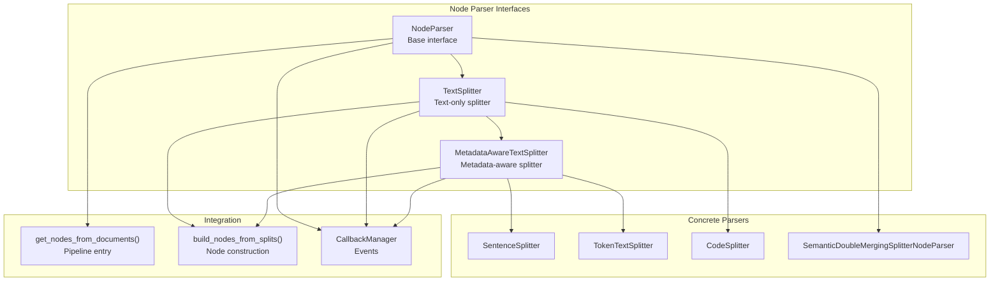
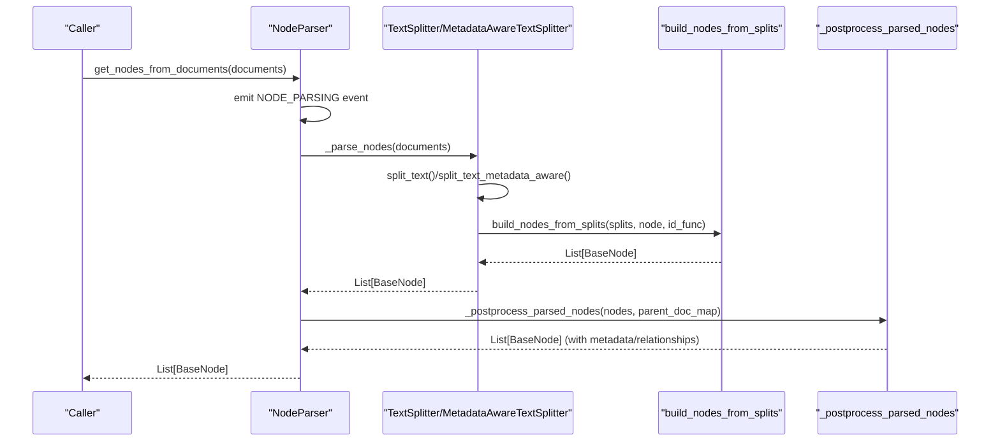
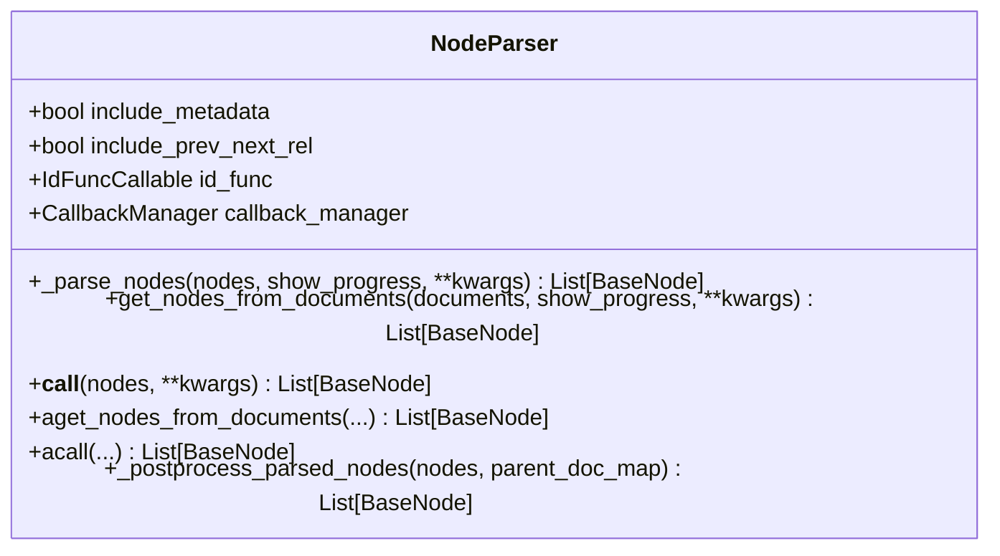
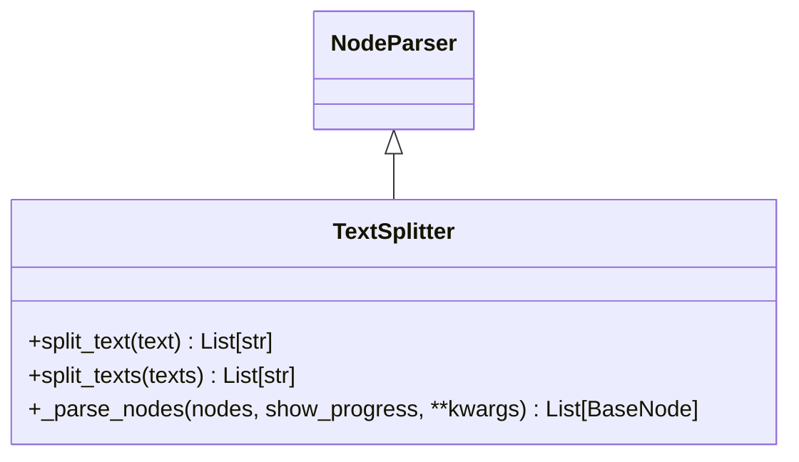
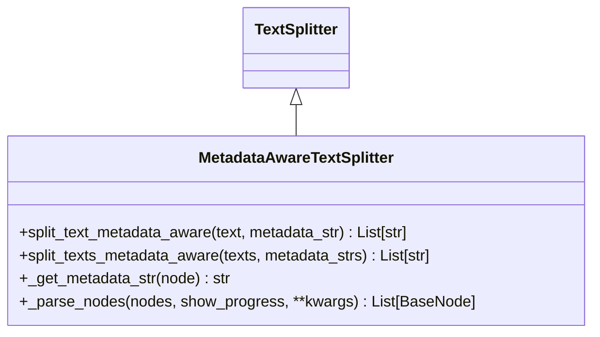
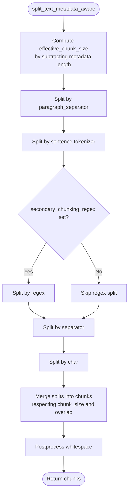
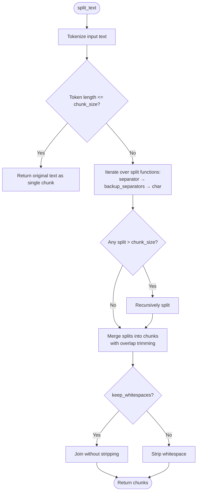
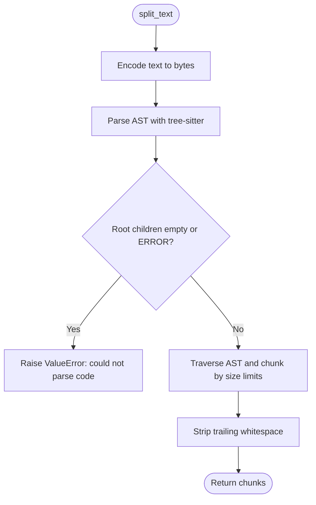
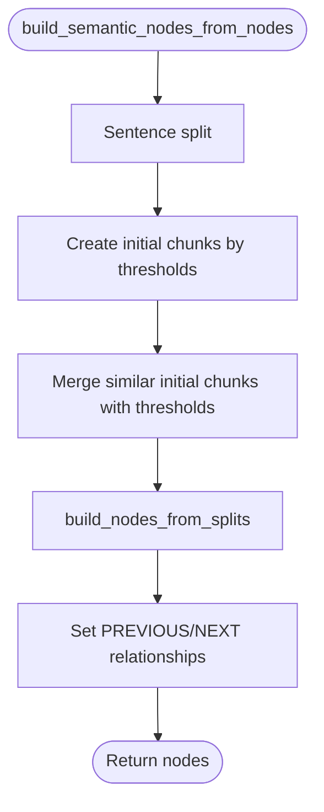
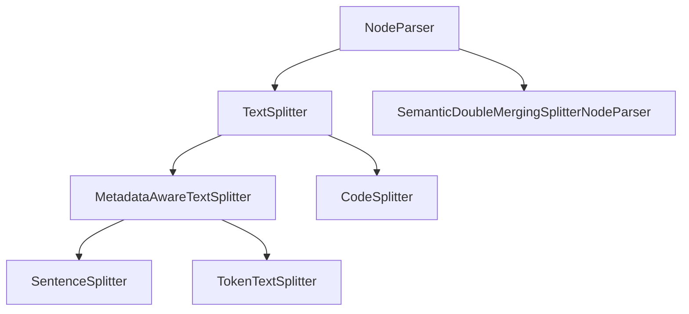

# Custom Parser Development

<cite>
**Referenced Files in This Document**
- [interface.py](file://llama-index-core/llama_index/core/node_parser/interface.py)
- [code.py](file://llama-index-core/llama_index/core/node_parser/text/code.py)
- [sentence.py](file://llama-index-core/llama_index/core/node_parser/text/sentence.py)
- [token.py](file://llama-index-core/llama_index/core/node_parser/text/token.py)
- [semantic_double_merging_splitter.py](file://llama-index-core/llama_index/core/node_parser/text/semantic_double_merging_splitter.py)
- [__init__.py](file://llama-index-core/llama_index/core/text_splitter/__init__.py)
- [test_code_splitter.py](file://llama-index-core/tests/text_splitter/test_code_splitter.py)
- [test_sentence_splitter.py](file://llama-index-core/tests/text_splitter/test_sentence_splitter.py)
- [test_token_splitter.py](file://llama-index-core/tests/text_splitter/test_token_splitter.py)
</cite>

## Table of Contents
1. [Introduction](#introduction)
2. [Project Structure](#project-structure)
3. [Core Components](#core-components)
4. [Architecture Overview](#architecture-overview)
5. [Detailed Component Analysis](#detailed-component-analysis)
6. [Dependency Analysis](#dependency-analysis)
7. [Performance Considerations](#performance-considerations)
8. [Troubleshooting Guide](#troubleshooting-guide)
9. [Conclusion](#conclusion)
10. [Appendices](#appendices)

## Introduction
This document explains how to develop custom node parsers and text splitters in LlamaIndex. It covers the NodeParser and TextSplitter base interfaces, required methods and parameters, and provides step-by-step guidance for building custom parsers, handling metadata, and integrating with the ingestion pipeline. It also includes examples of domain-specific parsers, custom chunking algorithms, testing strategies, performance optimization, and best practices.

## Project Structure
The relevant components for custom parser development live under the node parser and text splitter modules. The base interfaces define the contract that all parsers must satisfy, while concrete implementations demonstrate best practices for chunking strategies, metadata handling, and integration with the broader ingestion pipeline.

**Diagram sources**
- [interface.py](file://llama-index-core/llama_index/core/node_parser/interface.py#L50-L278)
- [sentence.py](file://llama-index-core/llama_index/core/node_parser/text/sentence.py#L34-L332)
- [token.py](file://llama-index-core/llama_index/core/node_parser/text/token.py#L22-L242)
- [code.py](file://llama-index-core/llama_index/core/node_parser/text/code.py#L19-L266)
- [semantic_double_merging_splitter.py](file://llama-index-core/llama_index/core/node_parser/text/semantic_double_merging_splitter.py#L62-L399)

**Section sources**
- [interface.py](file://llama-index-core/llama_index/core/node_parser/interface.py#L50-L278)
- [__init__.py](file://llama-index-core/llama_index/core/text_splitter/__init__.py#L1-L13)

## Core Components
This section documents the base interfaces and their responsibilities.

- NodeParser
  - Purpose: Convert Documents or BaseNode sequences into a list of BaseNode chunks with optional metadata and relationship handling.
  - Key methods:
    - _parse_nodes(nodes, show_progress, **kwargs) -> List[BaseNode]: Core parsing logic for a batch of nodes.
    - get_nodes_from_documents(documents, show_progress, **kwargs) -> List[BaseNode]: Pipeline entry point that triggers callbacks and post-processing.
    - __call__ and async variants: Convenience wrappers around the document-based entry point.
  - Fields and behaviors:
    - include_metadata: Controls whether parent metadata is merged into chunk metadata.
    - include_prev_next_rel: Automatically links adjacent chunks from the same source node.
    - id_func: Function to generate deterministic node IDs.
    - callback_manager: Integrates with LlamaIndex’s event system for monitoring and tracing.

- TextSplitter
  - Purpose: Specialized NodeParser that splits text content into chunks and builds nodes from those splits.
  - Required method:
    - split_text(text) -> List[str]: Implements the chunking algorithm for a single text.
  - Optional method:
    - split_texts(texts) -> List[str]: Applies split_text across multiple texts.
  - Behavior:
    - Uses build_nodes_from_splits to convert split strings into TextNode instances.
    - Respects include_metadata and include_prev_next_rel inherited from NodeParser.

- MetadataAwareTextSplitter
  - Purpose: Extends TextSplitter to account for metadata length when computing effective chunk size.
  - Required method:
    - split_text_metadata_aware(text, metadata_str) -> List[str]: Computes chunks respecting reserved space for metadata.
  - Optional method:
    - split_texts_metadata_aware(texts, metadata_strs) -> List[str]: Applies the aware split across multiple pairs.
  - Helper:
    - _get_metadata_str(node): Chooses the appropriate metadata string representation for splitting.

Key parameters and types:
- NodeParser fields: include_metadata (bool), include_prev_next_rel (bool), id_func (callable), callback_manager (CallbackManager).
- TextSplitter fields: language-dependent parameters in concrete implementations (e.g., chunk_size, chunk_overlap, separator, tokenizer).
- MetadataAwareTextSplitter fields: chunk_size, chunk_overlap, separator, backup_separators, keep_whitespaces, tokenizer.

**Section sources**
- [interface.py](file://llama-index-core/llama_index/core/node_parser/interface.py#L50-L278)

## Architecture Overview
The ingestion pipeline integrates parsers via NodeParser.get_nodes_from_documents, which:
- Emits a NODE_PARSING event.
- Calls _parse_nodes to produce raw chunks.
- Runs post-processing to enrich nodes with metadata, source relationships, and character offsets.
- Emits a completion event with the resulting nodes.

**Diagram sources**
- [interface.py](file://llama-index-core/llama_index/core/node_parser/interface.py#L157-L207)
- [interface.py](file://llama-index-core/llama_index/core/node_parser/interface.py#L218-L231)
- [interface.py](file://llama-index-core/llama_index/core/node_parser/interface.py#L261-L277)

## Detailed Component Analysis

### NodeParser Base Class
- Responsibilities:
  - Define the contract for converting documents/nodes into chunk nodes.
  - Manage metadata propagation and node relationships.
  - Integrate with the callback system for observability.
- Notable behaviors:
  - _postprocess_parsed_nodes computes start/end character indices for TextNode and merges metadata from parent documents and source nodes.
  - Establishes PREVIOUS/NEXT relationships when nodes originate from the same source node.

**Diagram sources**
- [interface.py](file://llama-index-core/llama_index/core/node_parser/interface.py#L50-L207)

**Section sources**
- [interface.py](file://llama-index-core/llama_index/core/node_parser/interface.py#L50-L207)

### TextSplitter Base Class
- Responsibilities:
  - Implement split_text for a single text and delegate node construction to build_nodes_from_splits.
  - Support progress reporting and callback events.
- Typical flow:
  - Iterate over nodes, compute splits, and construct nodes with id_func.

**Diagram sources**
- [interface.py](file://llama-index-core/llama_index/core/node_parser/interface.py#L210-L231)

**Section sources**
- [interface.py](file://llama-index-core/llama_index/core/node_parser/interface.py#L210-L231)

### MetadataAwareTextSplitter Base Class
- Responsibilities:
  - Account for metadata length when computing effective chunk size.
  - Provide split_text_metadata_aware for metadata-aware chunking.
- Helper:
  - _get_metadata_str selects the appropriate metadata string for splitting.

**Diagram sources**
- [interface.py](file://llama-index-core/llama_index/core/node_parser/interface.py#L233-L278)

**Section sources**
- [interface.py](file://llama-index-core/llama_index/core/node_parser/interface.py#L233-L278)

### SentenceSplitter (Domain-Specific Example)
- Purpose: Prefer sentence boundaries and minimize partial sentences in chunks.
- Key parameters:
  - chunk_size, chunk_overlap, separator, paragraph_separator, secondary_chunking_regex.
- Implementation highlights:
  - Uses a sentence tokenizer and layered splitting strategies (paragraph → sentence → regex → separator → char).
  - Merges splits into chunks with overlap and postprocesses whitespace.
  - Metadata-aware variant adjusts effective chunk size by metadata length.

**Diagram sources**
- [sentence.py](file://llama-index-core/llama_index/core/node_parser/text/sentence.py#L156-L196)
- [sentence.py](file://llama-index-core/llama_index/core/node_parser/text/sentence.py#L198-L302)

**Section sources**
- [sentence.py](file://llama-index-core/llama_index/core/node_parser/text/sentence.py#L34-L332)

### TokenTextSplitter (Token-Based Chunking)
- Purpose: Split text by tokens with configurable separators and overlap.
- Key parameters:
  - chunk_size, chunk_overlap, separator, backup_separators, keep_whitespaces.
- Implementation highlights:
  - Uses a tokenizer to compute token lengths.
  - Applies a hierarchy of separators and falls back to character splitting.
  - Merges splits into chunks with overlap and trims whitespace when configured.

**Diagram sources**
- [token.py](file://llama-index-core/llama_index/core/node_parser/text/token.py#L138-L157)
- [token.py](file://llama-index-core/llama_index/core/node_parser/text/token.py#L159-L186)
- [token.py](file://llama-index-core/llama_index/core/node_parser/text/token.py#L188-L241)

**Section sources**
- [token.py](file://llama-index-core/llama_index/core/node_parser/text/token.py#L22-L242)

### CodeSplitter (AST-Based Chunking)
- Purpose: Split code using an AST parser to preserve syntactic structure.
- Key parameters:
  - language, chunk_lines, chunk_lines_overlap, max_chars, count_mode, max_tokens.
- Implementation highlights:
  - Builds an AST and recursively chunks nodes respecting size limits (char or token).
  - Validates parser type and raises informative errors for unsupported languages.
  - Integrates with callbacks and supports custom tokenizer.

**Diagram sources**
- [code.py](file://llama-index-core/llama_index/core/node_parser/text/code.py#L225-L263)
- [code.py](file://llama-index-core/llama_index/core/node_parser/text/code.py#L166-L223)

**Section sources**
- [code.py](file://llama-index-core/llama_index/core/node_parser/text/code.py#L19-L266)

### SemanticDoubleMergingSplitterNodeParser (Custom Algorithm Example)
- Purpose: Build nodes by grouping semantically similar sentences using spaCy similarity.
- Key parameters:
  - language_config, initial_threshold, appending_threshold, merging_threshold, max_chunk_size, merging_range, merging_separator, sentence_splitter.
- Implementation highlights:
  - Two-pass algorithm: create initial chunks and then merge similar ones.
  - Cleans text by removing URLs, punctuation, and stopwords before similarity checks.
  - Builds nodes with PREVIOUS/NEXT relationships.

**Diagram sources**
- [semantic_double_merging_splitter.py](file://llama-index-core/llama_index/core/node_parser/text/semantic_double_merging_splitter.py#L198-L237)
- [semantic_double_merging_splitter.py](file://llama-index-core/llama_index/core/node_parser/text/semantic_double_merging_splitter.py#L239-L296)
- [semantic_double_merging_splitter.py](file://llama-index-core/llama_index/core/node_parser/text/semantic_double_merging_splitter.py#L298-L386)

**Section sources**
- [semantic_double_merging_splitter.py](file://llama-index-core/llama_index/core/node_parser/text/semantic_double_merging_splitter.py#L62-L399)

## Dependency Analysis
- NodeParser depends on:
  - CallbackManager for event emission.
  - build_nodes_from_splits for constructing nodes.
  - Node relationships and metadata modes for post-processing.
- TextSplitter and MetadataAwareTextSplitter depend on:
  - Tokenizers and optional sentence tokenizers.
  - Separator strategies and fallbacks.
- Concrete implementations:
  - SentenceSplitter and TokenTextSplitter rely on layered splitting strategies.
  - CodeSplitter relies on tree-sitter parsers and tokenizers.
  - SemanticDoubleMergingSplitterNodeParser relies on spaCy models and sentence tokenizers.

**Diagram sources**
- [interface.py](file://llama-index-core/llama_index/core/node_parser/interface.py#L50-L278)
- [sentence.py](file://llama-index-core/llama_index/core/node_parser/text/sentence.py#L34-L332)
- [token.py](file://llama-index-core/llama_index/core/node_parser/text/token.py#L22-L242)
- [code.py](file://llama-index-core/llama_index/core/node_parser/text/code.py#L19-L266)
- [semantic_double_merging_splitter.py](file://llama-index-core/llama_index/core/node_parser/text/semantic_double_merging_splitter.py#L62-L399)

**Section sources**
- [interface.py](file://llama-index-core/llama_index/core/node_parser/interface.py#L50-L278)

## Performance Considerations
- Tokenization overhead:
  - Prefer efficient tokenizers and reuse them across splits.
  - Avoid excessive recursion by tuning chunk_size and overlap.
- AST parsing:
  - CodeSplitter performance depends on the underlying tree-sitter parser initialization and language pack availability.
- Memory usage:
  - Large documents can produce many small chunks; consider streaming or batching during ingestion.
- Metadata-aware chunking:
  - Metadata-aware splitters compute token lengths twice; cache metadata strings when possible.
- Parallelism:
  - Use async variants (aget_nodes_from_documents, acall) when the underlying implementation supports it.

[No sources needed since this section provides general guidance]

## Troubleshooting Guide
Common issues and resolutions:
- Overlap vs chunk size mismatch:
  - Ensure chunk_overlap <= chunk_size to prevent invalid configurations.
- Metadata too long:
  - Metadata-aware splitters raise explicit errors when metadata dominates the chunk budget; increase chunk_size or reduce metadata.
- Code parsing failures:
  - Verify language support and parser installation; CodeSplitter raises informative errors for missing packages or unsupported languages.
- Empty or whitespace-only chunks:
  - Post-processing strips whitespace; adjust keep_whitespaces or separators to control output.

**Section sources**
- [sentence.py](file://llama-index-core/llama_index/core/node_parser/text/sentence.py#L83-L87)
- [token.py](file://llama-index-core/llama_index/core/node_parser/text/token.py#L64-L68)
- [token.py](file://llama-index-core/llama_index/core/node_parser/text/token.py#L117-L136)
- [code.py](file://llama-index-core/llama_index/core/node_parser/text/code.py#L114-L133)

## Conclusion
Custom parser development in LlamaIndex centers on implementing NodeParser or TextSplitter/MetadataAwareTextSplitter, depending on your needs. By following the established patterns—handling metadata, building nodes, managing relationships, and integrating with callbacks—you can create robust, domain-specific parsers. Use the provided examples as templates and adhere to performance and testing best practices to ensure maintainable and efficient parsers.

[No sources needed since this section summarizes without analyzing specific files]

## Appendices

### Step-by-Step: Implementing a Custom Text Splitter
1. Choose the base class:
   - Use TextSplitter for simple text chunking.
   - Use MetadataAwareTextSplitter if metadata length must influence chunk size.
2. Implement required methods:
   - split_text for TextSplitter.
   - split_text_metadata_aware for MetadataAwareTextSplitter.
3. Configure parameters:
   - Define chunk_size, chunk_overlap, separators, and tokenizer.
4. Integrate with the pipeline:
   - Use get_nodes_from_documents to process batches of documents.
   - Leverage callback_manager for monitoring.
5. Test thoroughly:
   - Validate chunk sizes, overlaps, and metadata propagation.
   - Compare against existing implementations (SentenceSplitter, TokenTextSplitter).

**Section sources**
- [interface.py](file://llama-index-core/llama_index/core/node_parser/interface.py#L210-L278)
- [sentence.py](file://llama-index-core/llama_index/core/node_parser/text/sentence.py#L34-L154)
- [token.py](file://llama-index-core/llama_index/core/node_parser/text/token.py#L22-L115)

### Testing Strategies
- Unit tests for chunking logic:
  - SentenceSplitter: verify sentence boundary preservation and overlap behavior.
  - TokenTextSplitter: verify token-based sizing and separator handling.
  - CodeSplitter: verify AST parsing and error handling for unsupported languages.
- Integration tests:
  - End-to-end ingestion using get_nodes_from_documents and asserting node counts and metadata.
- Performance tests:
  - Measure throughput and memory usage across large documents.

**Section sources**
- [test_sentence_splitter.py](file://llama-index-core/tests/text_splitter/test_sentence_splitter.py)
- [test_token_splitter.py](file://llama-index-core/tests/text_splitter/test_token_splitter.py)
- [test_code_splitter.py](file://llama-index-core/tests/text_splitter/test_code_splitter.py)

### Best Practices
- Keep chunk_size balanced:
  - Too small increases fragmentation; too large reduces retrieval precision.
- Preserve semantic boundaries:
  - Prefer sentence-aware or domain-aware splitting for natural language.
- Handle metadata carefully:
  - Use MetadataAwareTextSplitter to avoid truncating content due to metadata.
- Reuse resources:
  - Share tokenizers and NLP models across runs.
- Monitor with callbacks:
  - Emit and observe CHUNKING and NODE_PARSING events for diagnostics.

[No sources needed since this section provides general guidance]