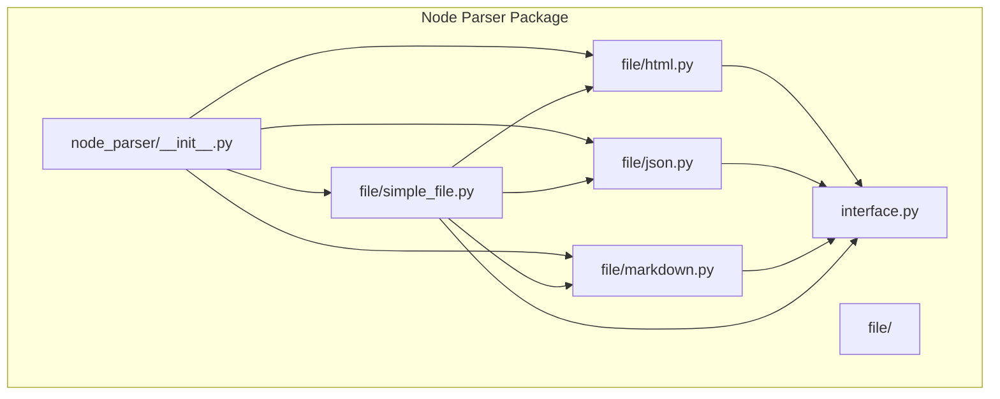
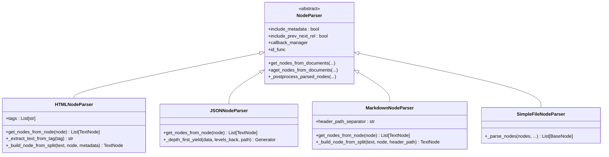
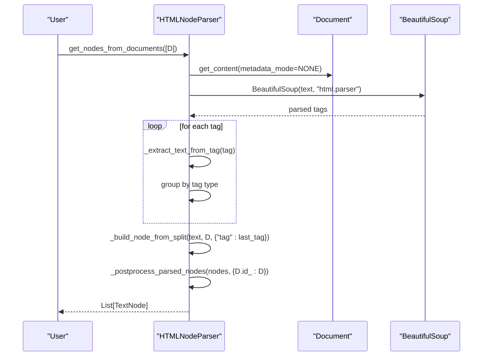
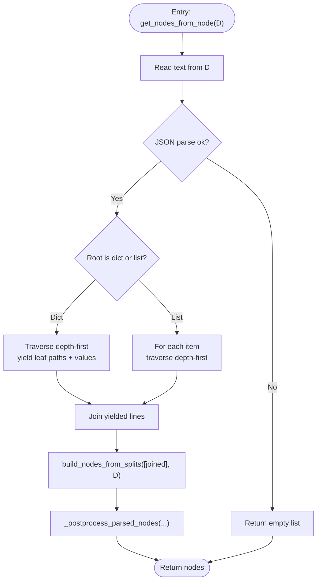
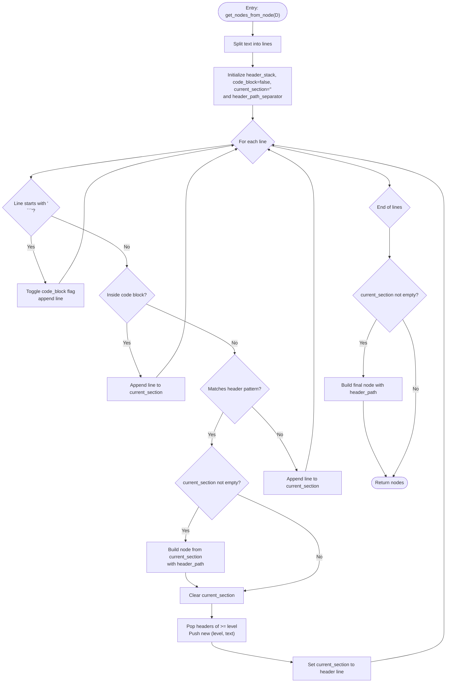
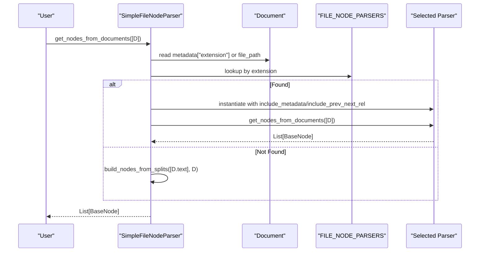
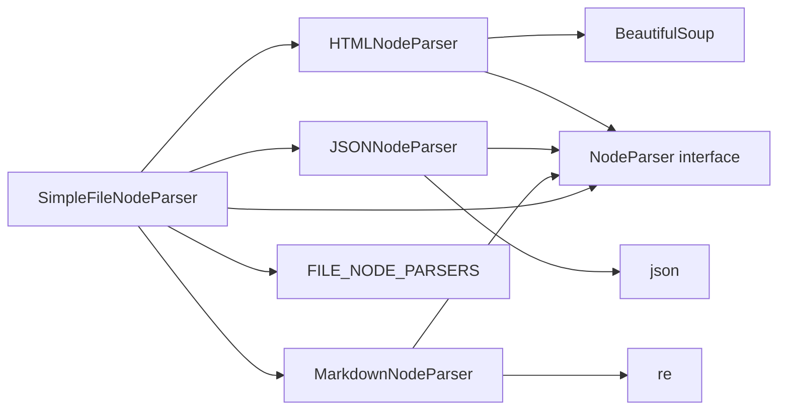

# File-Specific Parsers

<cite>
**Referenced Files in This Document**
- [__init__.py](file://llama-index-core/llama_index/core/node_parser/__init__.py)
- [interface.py](file://llama-index-core/llama_index/core/node_parser/interface.py)
- [html.py](file://llama-index-core/llama_index/core/node_parser/file/html.py)
- [json.py](file://llama-index-core/llama_index/core/node_parser/file/json.py)
- [markdown.py](file://llama-index-core/llama_index/core/node_parser/file/markdown.py)
- [simple_file.py](file://llama-index-core/llama_index/core/node_parser/file/simple_file.py)
- [test_node_parser.py](file://llama-index-core/tests/node_parser/test_node_parser.py)
</cite>

## Table of Contents
1. [Introduction](#introduction)
2. [Project Structure](#project-structure)
3. [Core Components](#core-components)
4. [Architecture Overview](#architecture-overview)
5. [Detailed Component Analysis](#detailed-component-analysis)
6. [Dependency Analysis](#dependency-analysis)
7. [Performance Considerations](#performance-considerations)
8. [Troubleshooting Guide](#troubleshooting-guide)
9. [Conclusion](#conclusion)

## Introduction
This document explains the file-specific node parsers in LlamaIndex core: HTMLNodeParser, JSONNodeParser, MarkdownNodeParser, and SimpleFileNodeParser. It covers parsing strategies, metadata handling, content structure preservation, examples of parsing different file types, encoding considerations, customization options, performance tips for large files, and best practices for mixed-content processing.

## Project Structure
The file-specific parsers live under the node parser module and are exported via the public node parser package.

**Diagram sources**
- [__init__.py](file://llama-index-core/llama_index/core/node_parser/__init__.py#L1-L73)
- [html.py](file://llama-index-core/llama_index/core/node_parser/file/html.py#L1-L144)
- [json.py](file://llama-index-core/llama_index/core/node_parser/file/json.py#L1-L108)
- [markdown.py](file://llama-index-core/llama_index/core/node_parser/file/markdown.py#L1-L142)
- [simple_file.py](file://llama-index-core/llama_index/core/node_parser/file/simple_file.py#L1-L102)
- [interface.py](file://llama-index-core/llama_index/core/node_parser/interface.py#L1-L278)

**Section sources**
- [__init__.py](file://llama-index-core/llama_index/core/node_parser/__init__.py#L1-L73)

## Core Components
- HTMLNodeParser: Extracts text from specified HTML tags and groups adjacent segments by tag type into nodes, preserving tag metadata.
- JSONNodeParser: Parses JSON content depth-first, flattening leaves into textual lines with path context.
- MarkdownNodeParser: Splits on headers while tracking header hierarchy to preserve section paths in metadata.
- SimpleFileNodeParser: Automatically selects a parser based on file extension (.md, .html, .json) and falls back to raw text splitting otherwise.

Each parser inherits from NodeParser and participates in shared post-processing for metadata merging, character indexing, and neighbor relationships.

**Section sources**
- [html.py](file://llama-index-core/llama_index/core/node_parser/file/html.py#L18-L144)
- [json.py](file://llama-index-core/llama_index/core/node_parser/file/json.py#L13-L108)
- [markdown.py](file://llama-index-core/llama_index/core/node_parser/file/markdown.py#L14-L142)
- [simple_file.py](file://llama-index-core/llama_index/core/node_parser/file/simple_file.py#L22-L102)
- [interface.py](file://llama-index-core/llama_index/core/node_parser/interface.py#L50-L208)

## Architecture Overview
The parsers implement a common interface and rely on shared utilities for building nodes and post-processing.

**Diagram sources**
- [interface.py](file://llama-index-core/llama_index/core/node_parser/interface.py#L50-L208)
- [html.py](file://llama-index-core/llama_index/core/node_parser/file/html.py#L18-L144)
- [json.py](file://llama-index-core/llama_index/core/node_parser/file/json.py#L13-L108)
- [markdown.py](file://llama-index-core/llama_index/core/node_parser/file/markdown.py#L14-L142)
- [simple_file.py](file://llama-index-core/llama_index/core/node_parser/file/simple_file.py#L22-L102)

## Detailed Component Analysis

### HTMLNodeParser
- Strategy
  - Parses HTML content using a BeautifulSoup-based approach.
  - Gathers text from configured tags and groups consecutive segments of the same tag type into a single node.
  - Emits nodes enriched with tag metadata.
- Metadata handling
  - Merges parent document metadata with node metadata during post-processing.
  - Optionally attaches a tag field to node metadata.
- Content structure preservation
  - Preserves logical grouping by tag type and maintains original ordering.
- Customization
  - Configure the list of tags to extract via the tags field.
- Encoding considerations
  - Relies on the underlying Document content; ensure the Document is constructed with the correct encoding so BeautifulSoup receives properly decoded text.

**Diagram sources**
- [html.py](file://llama-index-core/llama_index/core/node_parser/file/html.py#L56-L107)
- [interface.py](file://llama-index-core/llama_index/core/node_parser/interface.py#L84-L155)

**Section sources**
- [html.py](file://llama-index-core/llama_index/core/node_parser/file/html.py#L18-L144)
- [interface.py](file://llama-index-core/llama_index/core/node_parser/interface.py#L50-L208)

### JSONNodeParser
- Strategy
  - Loads JSON from the document text.
  - Depth-first traversal of dictionaries and lists, emitting leaf values joined into lines with path context.
  - Aggregates all lines into a single split and builds a node.
- Metadata handling
  - Inherits standard metadata merging from NodeParser post-processing.
- Content structure preservation
  - Maintains hierarchical context implicitly via path construction during traversal.
- Customization
  - No explicit configuration fields; behavior is determined by traversal semantics.
- Encoding considerations
  - Ensure the Document content is valid UTF-8 JSON text.

**Diagram sources**
- [json.py](file://llama-index-core/llama_index/core/node_parser/file/json.py#L57-L83)
- [interface.py](file://llama-index-core/llama_index/core/node_parser/interface.py#L84-L155)

**Section sources**
- [json.py](file://llama-index-core/llama_index/core/node_parser/file/json.py#L13-L108)
- [interface.py](file://llama-index-core/llama_index/core/node_parser/interface.py#L50-L208)

### MarkdownNodeParser
- Strategy
  - Splits content at headers while maintaining a header stack to infer section hierarchy.
  - Skips header parsing inside fenced code blocks.
  - Builds nodes containing the section text and a header path derived from ancestors.
- Metadata handling
  - Adds a header_path metadata field indicating ancestor headers separated by a configurable separator.
- Content structure preservation
  - Preserves semantic sections and their hierarchical relationships.
- Customization
  - header_path_separator controls the delimiter used in header_path metadata.
- Encoding considerations
  - Ensure the Document content is UTF-8 text.

**Diagram sources**
- [markdown.py](file://llama-index-core/llama_index/core/node_parser/file/markdown.py#L48-L107)
- [markdown.py](file://llama-index-core/llama_index/core/node_parser/file/markdown.py#L109-L125)

**Section sources**
- [markdown.py](file://llama-index-core/llama_index/core/node_parser/file/markdown.py#L14-L142)
- [interface.py](file://llama-index-core/llama_index/core/node_parser/interface.py#L50-L208)

### SimpleFileNodeParser
- Strategy
  - Determines the file extension from metadata or file_path.
  - Selects a specialized parser (HTML, JSON, Markdown) if supported; otherwise falls back to raw text splitting.
- Metadata handling
  - Delegates to the selected parser; inherits standard merging behavior.
- Content structure preservation
  - Uses the chosen parser’s logic to preserve structure appropriate to the format.
- Customization
  - Extends FILE_NODE_PARSERS to support additional extensions.
- Encoding considerations
  - Ensure the Document is constructed with the correct encoding so downstream parsers receive properly decoded text.

**Diagram sources**
- [simple_file.py](file://llama-index-core/llama_index/core/node_parser/file/simple_file.py#L55-L101)
- [simple_file.py](file://llama-index-core/llama_index/core/node_parser/file/simple_file.py#L15-L19)

**Section sources**
- [simple_file.py](file://llama-index-core/llama_index/core/node_parser/file/simple_file.py#L22-L102)
- [html.py](file://llama-index-core/llama_index/core/node_parser/file/html.py#L18-L144)
- [json.py](file://llama-index-core/llama_index/core/node_parser/file/json.py#L13-L108)
- [markdown.py](file://llama-index-core/llama_index/core/node_parser/file/markdown.py#L14-L142)

## Dependency Analysis
- HTMLNodeParser depends on BeautifulSoup (import-time guard) and uses NodeParser utilities for node creation and post-processing.
- JSONNodeParser depends on Python’s json module and depth-first traversal.
- MarkdownNodeParser depends on regular expressions for header detection and maintains a header stack.
- SimpleFileNodeParser composes the other parsers via a mapping keyed by extension.

**Diagram sources**
- [html.py](file://llama-index-core/llama_index/core/node_parser/file/html.py#L74-L76)
- [json.py](file://llama-index-core/llama_index/core/node_parser/file/json.py#L60-L64)
- [markdown.py](file://llama-index-core/llama_index/core/node_parser/file/markdown.py#L67-L67)
- [simple_file.py](file://llama-index-core/llama_index/core/node_parser/file/simple_file.py#L15-L19)

**Section sources**
- [html.py](file://llama-index-core/llama_index/core/node_parser/file/html.py#L1-L144)
- [json.py](file://llama-index-core/llama_index/core/node_parser/file/json.py#L1-L108)
- [markdown.py](file://llama-index-core/llama_index/core/node_parser/file/markdown.py#L1-L142)
- [simple_file.py](file://llama-index-core/llama_index/core/node_parser/file/simple_file.py#L1-L102)
- [interface.py](file://llama-index-core/llama_index/core/node_parser/interface.py#L1-L278)

## Performance Considerations
- Large HTML documents
  - Grouping by tag reduces node count; consider adjusting tags to balance granularity and retrieval quality.
  - Prefer streaming-friendly preprocessing if content is extremely large.
- Large JSON documents
  - Depth-first traversal is linear in the number of leaf nodes; keep input valid and reasonably sized.
  - Consider pre-filtering or sampling strategies if downstream processing is expensive.
- Large Markdown documents
  - Header stack operations are linear in header depth; very deep nesting may increase overhead.
  - Code fence detection avoids unnecessary header parsing inside code blocks.
- General
  - Enable progress reporting via show_progress to monitor long-running parses.
  - Reuse parsers across documents to benefit from internal caching and initialization costs.
  - For mixed content, use SimpleFileNodeParser to route to the most suitable parser per file.

[No sources needed since this section provides general guidance]

## Troubleshooting Guide
- HTML parsing fails due to missing dependency
  - Ensure BeautifulSoup is installed; the parser raises an ImportError if not available.
- Invalid JSON input
  - JSONNodeParser returns an empty list on decode errors; validate input encoding and structure.
- Unexpected empty output
  - SimpleFileNodeParser falls back to raw text splitting when extension is unsupported; add the extension to FILE_NODE_PARSERS or supply a compatible parser.
- Metadata conflicts
  - NodeParser post-processing merges parent and child metadata, preferring child values; verify merged metadata expectations.
- Character indexing and relationships
  - Post-processing computes start/end positions and establishes prev/next relationships; ensure nodes are in document order for accurate mapping.

**Section sources**
- [html.py](file://llama-index-core/llama_index/core/node_parser/file/html.py#L74-L76)
- [json.py](file://llama-index-core/llama_index/core/node_parser/file/json.py#L60-L64)
- [simple_file.py](file://llama-index-core/llama_index/core/node_parser/file/simple_file.py#L90-L99)
- [interface.py](file://llama-index-core/llama_index/core/node_parser/interface.py#L84-L155)
- [test_node_parser.py](file://llama-index-core/tests/node_parser/test_node_parser.py#L13-L42)

## Conclusion
The file-specific parsers in LlamaIndex provide robust, format-aware extraction:
- HTMLNodeParser preserves logical grouping by tag type.
- JSONNodeParser flattens hierarchical data with path-aware leaves.
- MarkdownNodeParser captures semantic sections and header paths.
- SimpleFileNodeParser automates routing to the right parser by extension.

They integrate seamlessly with the NodeParser interface, offering consistent metadata handling, character indexing, and neighbor relationship establishment. For large-scale ingestion, choose the appropriate parser per file type, validate encodings, and leverage post-processing benefits to streamline downstream retrieval and RAG workflows.