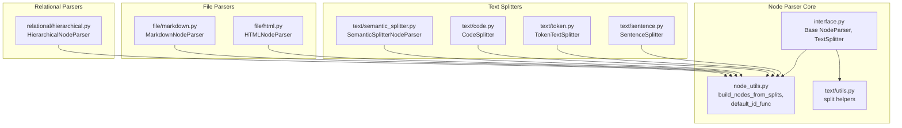
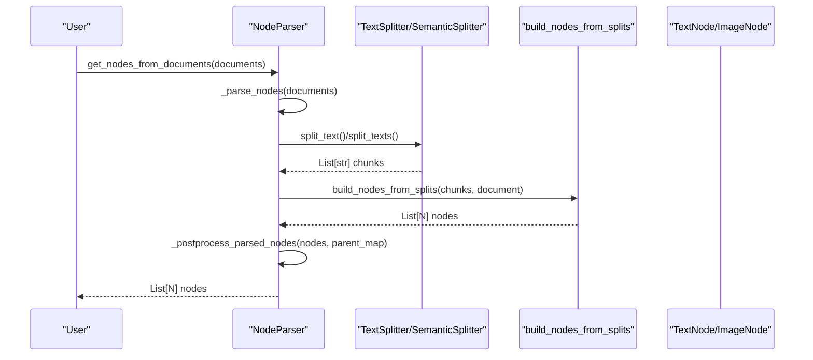
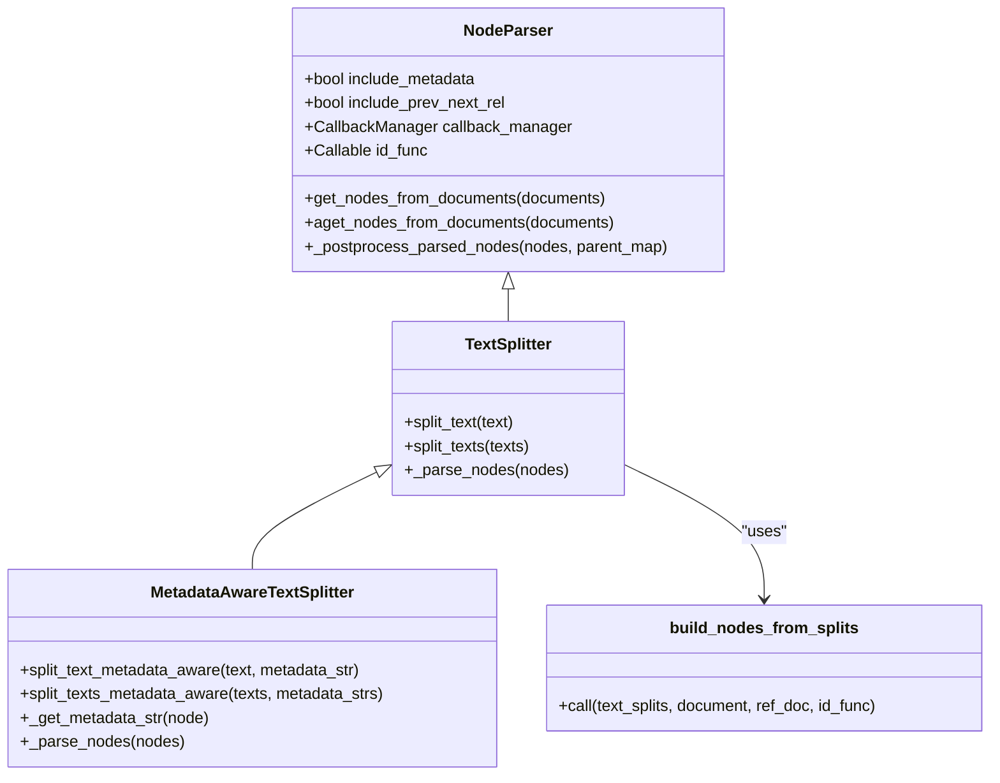
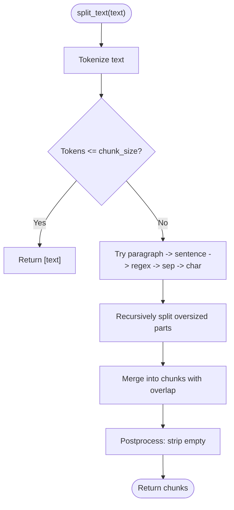
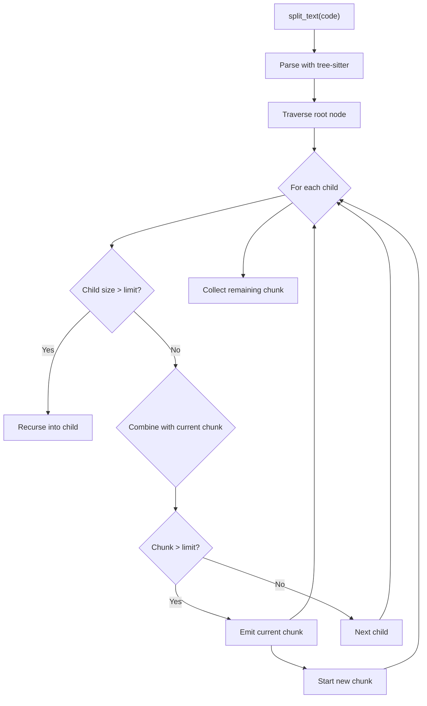
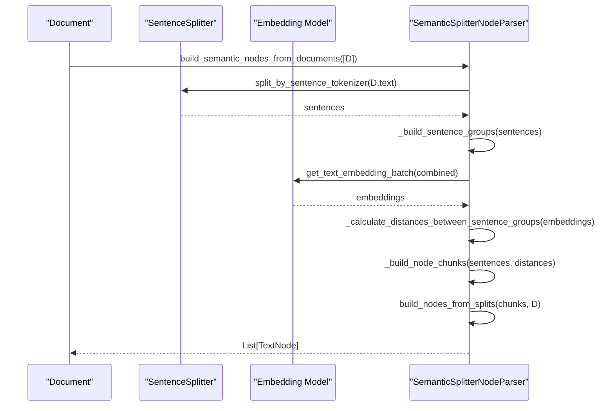
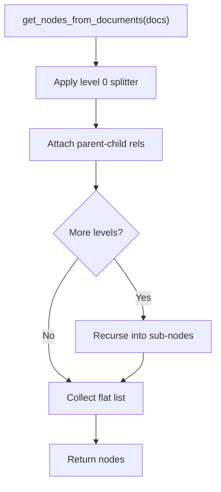
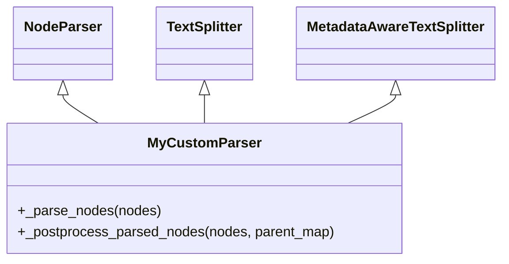
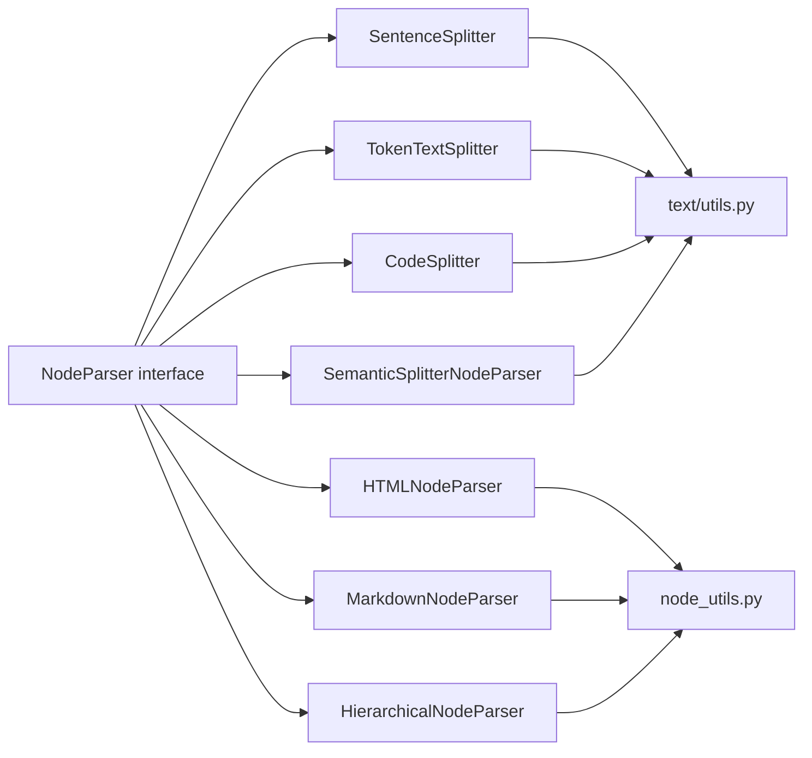

# Node Parsing and Chunking

<cite>
**Referenced Files in This Document**
- [interface.py](file://llama-index-core/llama_index/core/node_parser/interface.py)
- [__init__.py](file://llama-index-core/llama_index/core/node_parser/__init__.py)
- [text/__init__.py](file://llama-index-core/llama_index/core/node_parser/text/__init__.py)
- [sentence.py](file://llama-index-core/llama_index/core/node_parser/text/sentence.py)
- [token.py](file://llama-index-core/llama_index/core/node_parser/text/token.py)
- [semantic_splitter.py](file://llama-index-core/llama_index/core/node_parser/text/semantic_splitter.py)
- [code.py](file://llama-index-core/llama_index/core/node_parser/text/code.py)
- [utils.py](file://llama-index-core/llama_index/core/node_parser/text/utils.py)
- [node_utils.py](file://llama-index-core/llama_index/core/node_parser/node_utils.py)
- [html.py](file://llama-index-core/llama_index/core/node_parser/file/html.py)
- [markdown.py](file://llama-index-core/llama_index/core/node_parser/file/markdown.py)
- [hierarchical.py](file://llama-index-core/llama_index/core/node_parser/relational/hierarchical.py)
</cite>

## Table of Contents
1. [Introduction](#introduction)
2. [Project Structure](#project-structure)
3. [Core Components](#core-components)
4. [Architecture Overview](#architecture-overview)
5. [Detailed Component Analysis](#detailed-component-analysis)
6. [Dependency Analysis](#dependency-analysis)
7. [Performance Considerations](#performance-considerations)
8. [Troubleshooting Guide](#troubleshooting-guide)
9. [Conclusion](#conclusion)
10. [Appendices](#appendices)

## Introduction
This document explains LlamaIndex’s node parsing and chunking system. It covers the base parser interface, built-in text splitters, semantic chunkers, file-specific parsers, and relational parsers. It also provides guidance on implementing custom parsers, choosing chunking strategies, optimizing chunk sizes for different use cases, and understanding performance and memory trade-offs for large document processing.

## Project Structure
The node parsing and chunking logic lives primarily under the node parser module, organized by domain:
- Base interface and shared utilities
- Text-based splitters (sentence, token, code, semantic)
- File-specific parsers (HTML, Markdown)
- Relational parsers (hierarchical, element-based)

**Diagram sources**
- [interface.py](file://llama-index-core/llama_index/core/node_parser/interface.py#L50-L278)
- [node_utils.py](file://llama-index-core/llama_index/core/node_parser/node_utils.py#L29-L91)
- [text/utils.py](file://llama-index-core/llama_index/core/node_parser/text/utils.py#L26-L125)
- [text/sentence.py](file://llama-index-core/llama_index/core/node_parser/text/sentence.py#L34-L332)
- [text/token.py](file://llama-index-core/llama_index/core/node_parser/text/token.py#L22-L242)
- [text/code.py](file://llama-index-core/llama_index/core/node_parser/text/code.py#L19-L266)
- [text/semantic_splitter.py](file://llama-index-core/llama_index/core/node_parser/text/semantic_splitter.py#L35-L313)
- [file/html.py](file://llama-index-core/llama_index/core/node_parser/file/html.py#L18-L144)
- [file/markdown.py](file://llama-index-core/llama_index/core/node_parser/file/markdown.py#L14-L142)
- [relational/hierarchical.py](file://llama-index-core/llama_index/core/node_parser/relational/hierarchical.py#L76-L236)

**Section sources**
- [__init__.py](file://llama-index-core/llama_index/core/node_parser/__init__.py#L1-L73)
- [text/__init__.py](file://llama-index-core/llama_index/core/node_parser/text/__init__.py#L1-L27)

## Core Components
- Base parser interface
  - NodeParser: abstract base for all parsers; provides lifecycle hooks, metadata inclusion, prev/next relationships, and async support.
  - TextSplitter: specialized for text content; exposes split_text and split_texts; builds nodes via shared utilities.
  - MetadataAwareTextSplitter: extends TextSplitter to account metadata length when computing effective chunk size.

- Shared utilities
  - build_nodes_from_splits: converts text chunks into TextNode/ImageNode instances, preserving relationships and templates.
  - default_id_func: generates unique IDs for nodes.

- Public exports
  - The node parser package exports concrete implementations for token-based, sentence-based, code, semantic, hierarchical, and file-specific parsers.

**Section sources**
- [interface.py](file://llama-index-core/llama_index/core/node_parser/interface.py#L50-L278)
- [node_utils.py](file://llama-index-core/llama_index/core/node_parser/node_utils.py#L29-L91)
- [__init__.py](file://llama-index-core/llama_index/core/node_parser/__init__.py#L46-L73)
- [text/__init__.py](file://llama-index-core/llama_index/core/node_parser/text/__init__.py#L17-L27)

## Architecture Overview
The parsing pipeline follows a consistent flow:
- Documents enter as Document or TextNode objects.
- A chosen parser splits content into chunks.
- Chunks are transformed into TextNode/ImageNode instances with relationships to the source document.
- Optional post-processing enriches nodes with metadata and prev/next relationships.

**Diagram sources**
- [interface.py](file://llama-index-core/llama_index/core/node_parser/interface.py#L157-L207)
- [node_utils.py](file://llama-index-core/llama_index/core/node_parser/node_utils.py#L29-L91)
- [text/semantic_splitter.py](file://llama-index-core/llama_index/core/node_parser/text/semantic_splitter.py#L126-L193)

## Detailed Component Analysis

### Base Parser Interface and Utilities
- NodeParser
  - Provides callbacks, metadata inclusion, prev/next relationships, and async variants.
  - Delegates actual chunking to subclasses via _parse_nodes and _aparse_nodes.
  - Post-processes nodes to set source relationships, character offsets, merged metadata, and prev/next links.

- TextSplitter and MetadataAwareTextSplitter
  - TextSplitter defines split_text and split_texts and builds nodes from splits.
  - MetadataAwareTextSplitter computes effective chunk size by subtracting metadata length and warns when remaining tokens are small.

- Utilities
  - build_nodes_from_splits handles Document/ImageDocument/ImageNode inputs and preserves metadata templates and embedding keys.
  - default_id_func generates UUID-based IDs.

**Diagram sources**
- [interface.py](file://llama-index-core/llama_index/core/node_parser/interface.py#L50-L278)
- [node_utils.py](file://llama-index-core/llama_index/core/node_parser/node_utils.py#L29-L91)

**Section sources**
- [interface.py](file://llama-index-core/llama_index/core/node_parser/interface.py#L50-L278)
- [node_utils.py](file://llama-index-core/llama_index/core/node_parser/node_utils.py#L29-L91)

### Text Splitters

#### Sentence-Based Splitting
- SentenceSplitter
  - Prefers sentence boundaries and paragraph separators.
  - Uses a sentence tokenizer and fallback regex to split into sentences.
  - Merges splits into chunks respecting chunk_size and chunk_overlap, preserving sentence integrity.
  - Metadata-aware variant adjusts effective chunk size by subtracting metadata length.

**Diagram sources**
- [text/sentence.py](file://llama-index-core/llama_index/core/node_parser/text/sentence.py#L176-L332)
- [text/utils.py](file://llama-index-core/llama_index/core/node_parser/text/utils.py#L72-L125)

**Section sources**
- [text/sentence.py](file://llama-index-core/llama_index/core/node_parser/text/sentence.py#L34-L332)
- [text/utils.py](file://llama-index-core/llama_index/core/node_parser/text/utils.py#L26-L125)

#### Token-Based Splitting
- TokenTextSplitter
  - Splits by separators and characters, keeping separators by default.
  - Merges splits into chunks respecting chunk_size and chunk_overlap.
  - Metadata-aware variant reserves extra tokens for metadata formatting.

**Section sources**
- [text/token.py](file://llama-index-core/llama_index/core/node_parser/text/token.py#L22-L242)

#### Code-Based Splitting
- CodeSplitter
  - Uses an AST parser (tree-sitter) to split code into semantically coherent chunks.
  - Supports two counting modes: character-based and token-based.
  - Recursively traverses AST nodes to enforce size limits.

**Diagram sources**
- [text/code.py](file://llama-index-core/llama_index/core/node_parser/text/code.py#L166-L266)

**Section sources**
- [text/code.py](file://llama-index-core/llama_index/core/node_parser/text/code.py#L19-L266)

### Semantic Chunking
- SemanticSplitterNodeParser
  - First splits text into sentences using a configurable sentence_splitter.
  - Groups adjacent sentences into combined buffers controlled by buffer_size.
  - Computes embeddings for combined sentence groups and calculates pairwise cosine dissimilarities.
  - Determines breakpoints using a percentile threshold on distances and forms chunks accordingly.
  - Async variant supports asynchronous embedding computation.

**Diagram sources**
- [text/semantic_splitter.py](file://llama-index-core/llama_index/core/node_parser/text/semantic_splitter.py#L160-L313)

**Section sources**
- [text/semantic_splitter.py](file://llama-index-core/llama_index/core/node_parser/text/semantic_splitter.py#L35-L313)

### File-Specific Parsers

#### HTML Parser
- HTMLNodeParser
  - Parses HTML content using BeautifulSoup.
  - Extracts text from configured tags and groups consecutive siblings into sections.
  - Builds nodes with optional tag metadata.

**Section sources**
- [file/html.py](file://llama-index-core/llama_index/core/node_parser/file/html.py#L18-L144)

#### Markdown Parser
- MarkdownNodeParser
  - Splits Markdown by headers, tracking header hierarchy to populate header_path metadata.
  - Skips code blocks to avoid misinterpreting headers inside fenced code blocks.
  - Builds nodes with hierarchical path metadata.

**Section sources**
- [file/markdown.py](file://llama-index-core/llama_index/core/node_parser/file/markdown.py#L14-L142)

### Relational Parsers

#### Hierarchical Node Parser
- HierarchicalNodeParser
  - Recursively applies multiple text splitters with decreasing chunk sizes to build a hierarchy of nodes.
  - Establishes parent-child relationships between successive levels.
  - Provides helper functions to extract leaves, roots, and deeper nodes.

**Diagram sources**
- [relational/hierarchical.py](file://llama-index-core/llama_index/core/node_parser/relational/hierarchical.py#L160-L236)

**Section sources**
- [relational/hierarchical.py](file://llama-index-core/llama_index/core/node_parser/relational/hierarchical.py#L76-L236)

### Implementing a Custom Parser
To implement a custom parser:
- Choose the appropriate base class:
  - NodeParser for document-level parsing.
  - TextSplitter for text-only chunking.
  - MetadataAwareTextSplitter for metadata-aware chunking.
- Implement _parse_nodes to produce a list of BaseNode instances.
- Use build_nodes_from_splits to convert text chunks into nodes.
- Optionally override _postprocess_parsed_nodes to enrich nodes with relationships and metadata.
- Register your parser in the public __all__ list if exposing it via the package’s __init__.

[No sources needed since this diagram shows conceptual workflow, not actual code structure]

## Dependency Analysis
- Coupling and Cohesion
  - Parsers depend on shared utilities (build_nodes_from_splits, default_id_func) and tokenizers.
  - Text splitters rely on text/utils helpers for splitting strategies.
  - Semantic chunker depends on an embedding model and sentence tokenizer.

- External Dependencies
  - BeautifulSoup for HTML parsing.
  - tree-sitter and language pack for code splitting.
  - Embedding providers for semantic chunking.

**Diagram sources**
- [interface.py](file://llama-index-core/llama_index/core/node_parser/interface.py#L50-L278)
- [text/utils.py](file://llama-index-core/llama_index/core/node_parser/text/utils.py#L26-L125)
- [node_utils.py](file://llama-index-core/llama_index/core/node_parser/node_utils.py#L29-L91)

**Section sources**
- [__init__.py](file://llama-index-core/llama_index/core/node_parser/__init__.py#L1-L73)

## Performance Considerations
- Tokenization cost
  - SentenceSplitter and TokenTextSplitter tokenize entire texts; choose efficient tokenizers and avoid overly small chunk sizes.
- Metadata overhead
  - MetadataAwareTextSplitter subtracts metadata length from chunk size; ensure chunk_size accommodates metadata to prevent tiny residual chunks.
- Embedding cost (semantic chunking)
  - Computing embeddings for grouped sentences is compute-intensive; tune buffer_size and breakpoint_percentile_threshold to balance granularity and cost.
- AST traversal (code splitting)
  - tree-sitter parsing and recursion can be expensive for very large files; adjust max_chars/max_tokens and count_mode to control chunk sizes.
- Memory usage
  - Large documents produce many nodes; consider streaming or batching during parsing and chunking.
- Relationship building
  - Building prev/next and parent-child relationships adds overhead; disable include_prev_next_rel or include_metadata when not needed to reduce work.

[No sources needed since this section provides general guidance]

## Troubleshooting Guide
- Overlap vs. size mismatch
  - Ensure chunk_overlap is smaller than chunk_size; otherwise, initialization raises an error.
- Very long metadata
  - Metadata-aware splitters warn when effective chunk size becomes small; increase chunk_size or reduce metadata.
- Empty or whitespace-only chunks
  - Sentence-based splitter strips whitespace-only chunks; verify input content and separators.
- HTML parsing failures
  - BeautifulSoup is required; ensure dependencies are installed.
- Code parsing errors
  - tree-sitter language pack must be installed for supported languages; verify language support and parser availability.
- Semantic chunking thresholds
  - Low breakpoint_percentile_threshold increases node count; tune to balance retrieval quality and index size.

**Section sources**
- [text/sentence.py](file://llama-index-core/llama_index/core/node_parser/text/sentence.py#L83-L87)
- [text/token.py](file://llama-index-core/llama_index/core/node_parser/text/token.py#L64-L68)
- [text/semantic_splitter.py](file://llama-index-core/llama_index/core/node_parser/text/semantic_splitter.py#L99-L111)
- [file/html.py](file://llama-index-core/llama_index/core/node_parser/file/html.py#L74-L77)
- [text/code.py](file://llama-index-core/llama_index/core/node_parser/text/code.py#L114-L132)

## Conclusion
LlamaIndex’s node parsing and chunking system offers flexible, extensible strategies for transforming diverse content into indexed nodes. Choose sentence-based or token-based splitting for general text, code-aware AST splitting for code, semantic chunking for topic coherence, and file-specific parsers for structured markup. Use the base interfaces to implement custom parsers, optimize chunk sizes for your workload, and leverage metadata and relationship features to improve downstream retrieval and RAG quality.

## Appendices

### Practical Configuration Examples
- Sentence-based splitting
  - Configure chunk_size and chunk_overlap; optionally set a custom sentence tokenizer and paragraph separator.
  - Use the metadata-aware variant when documents carry substantial metadata.

- Token-based splitting
  - Set chunk_size and chunk_overlap; configure separators and backup separators.
  - Enable keep_whitespaces if whitespace formatting matters.

- Code splitting
  - Specify language and either character or token-based counting.
  - Adjust chunk_lines and chunk_lines_overlap for code readability.

- Semantic chunking
  - Provide an embedding model and tune buffer_size and breakpoint_percentile_threshold.
  - Use a sentence_splitter compatible with your language.

- File-specific parsing
  - HTMLNodeParser: customize tags to extract.
  - MarkdownNodeParser: configure header_path_separator for hierarchical metadata.

- Relational parsing
  - HierarchicalNodeParser: define chunk_sizes and node parser map; relationships are established automatically.

[No sources needed since this section provides general guidance]