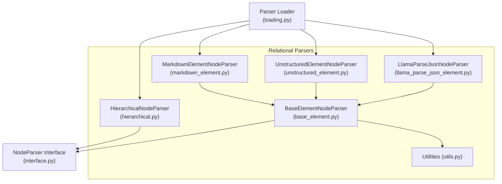
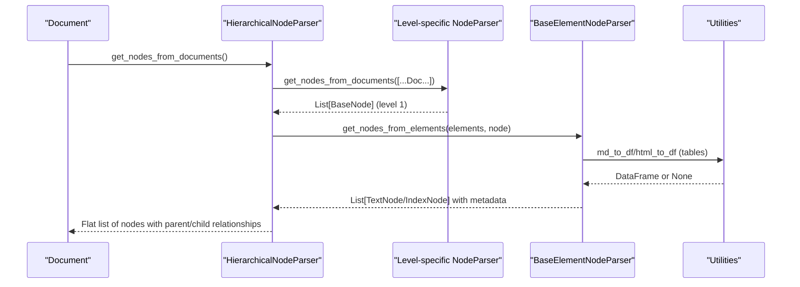
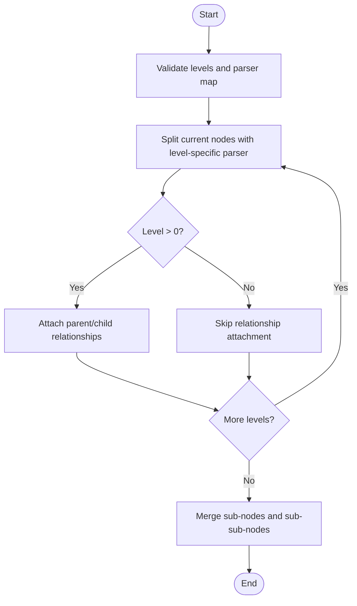
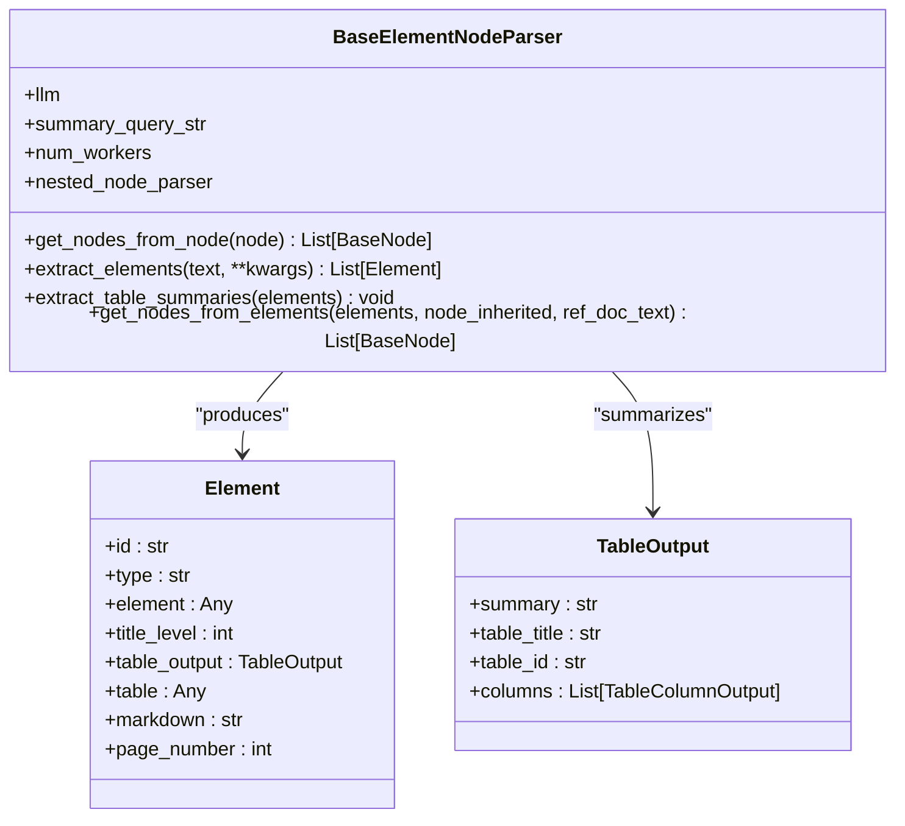
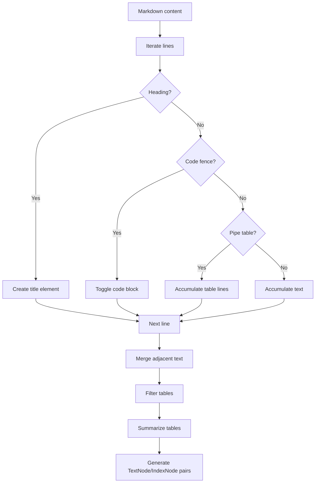
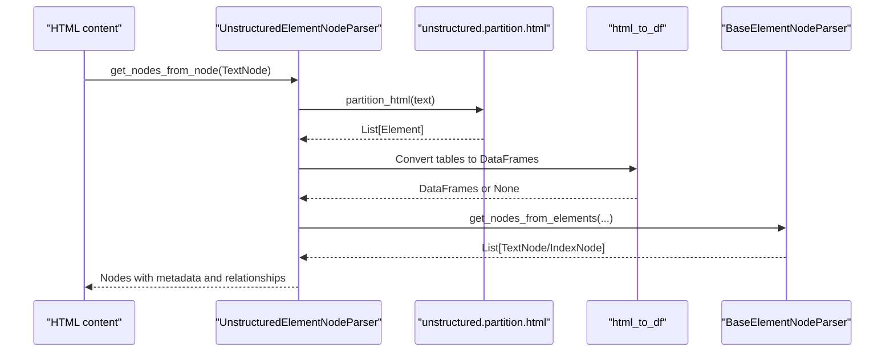
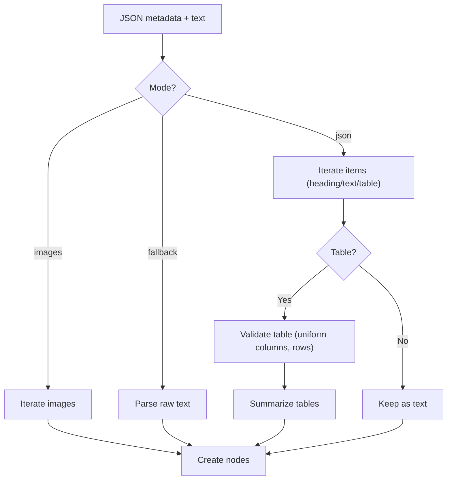
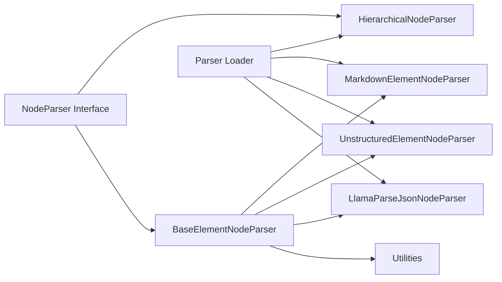

# Relational Parsers

<cite>
**Referenced Files in This Document**
- [hierarchical.py](file://llama-index-core/llama_index/core/node_parser/relational/hierarchical.py)
- [markdown_element.py](file://llama-index-core/llama_index/core/node_parser/relational/markdown_element.py)
- [unstructured_element.py](file://llama-index-core/llama_index/core/node_parser/relational/unstructured_element.py)
- [llama_parse_json_element.py](file://llama-index-core/llama_index/core/node_parser/relational/llama_parse_json_element.py)
- [base_element.py](file://llama-index-core/llama_index/core/node_parser/relational/base_element.py)
- [utils.py](file://llama-index-core/llama_index/core/node_parser/relational/utils.py)
- [interface.py](file://llama-index-core/llama_index/core/node_parser/interface.py)
- [loading.py](file://llama-index-core/llama_index/core/node_parser/loading.py)
</cite>

## Table of Contents
1. [Introduction](#introduction)
2. [Project Structure](#project-structure)
3. [Core Components](#core-components)
4. [Architecture Overview](#architecture-overview)
5. [Detailed Component Analysis](#detailed-component-analysis)
6. [Dependency Analysis](#dependency-analysis)
7. [Performance Considerations](#performance-considerations)
8. [Troubleshooting Guide](#troubleshooting-guide)
9. [Conclusion](#conclusion)
10. [Appendices](#appendices)

## Introduction
This document explains relational node parsing capabilities centered on hierarchical and element-based approaches. It covers:
- HierarchicalNodeParser for building tree-structured document hierarchies
- MarkdownElementNodeParser for extracting elements from Markdown
- UnstructuredElementNodeParser for flexible element extraction from HTML-like content
- LlamaParseJsonNodeParser for processing structured JSON from LlamaParse

It details hierarchical document structures, element relationships, and metadata preservation, and provides examples of parsing complex documents with nested structures, maintaining parent-child relationships, and handling mixed content types. Use cases for hierarchical retrieval and multi-level document analysis are highlighted.

## Project Structure
The relational parsers live under the node parser module and share a common base for element extraction and node generation. Utilities support conversion from Markdown and HTML to tabular form for downstream processing.

**Diagram sources**
- [hierarchical.py](file://llama-index-core/llama_index/core/node_parser/relational/hierarchical.py#L75-L236)
- [markdown_element.py](file://llama-index-core/llama_index/core/node_parser/relational/markdown_element.py#L11-L296)
- [unstructured_element.py](file://llama-index-core/llama_index/core/node_parser/relational/unstructured_element.py#L18-L144)
- [llama_parse_json_element.py](file://llama-index-core/llama_index/core/node_parser/relational/llama_parse_json_element.py#L11-L307)
- [base_element.py](file://llama-index-core/llama_index/core/node_parser/relational/base_element.py#L71-L512)
- [utils.py](file://llama-index-core/llama_index/core/node_parser/relational/utils.py#L6-L75)
- [interface.py](file://llama-index-core/llama_index/core/node_parser/interface.py#L50-L207)
- [loading.py](file://llama-index-core/llama_index/core/node_parser/loading.py#L18-L44)

**Section sources**
- [hierarchical.py](file://llama-index-core/llama_index/core/node_parser/relational/hierarchical.py#L1-L236)
- [markdown_element.py](file://llama-index-core/llama_index/core/node_parser/relational/markdown_element.py#L1-L296)
- [unstructured_element.py](file://llama-index-core/llama_index/core/node_parser/relational/unstructured_element.py#L1-L144)
- [llama_parse_json_element.py](file://llama-index-core/llama_index/core/node_parser/relational/llama_parse_json_element.py#L1-L307)
- [base_element.py](file://llama-index-core/llama_index/core/node_parser/relational/base_element.py#L1-L512)
- [utils.py](file://llama-index-core/llama_index/core/node_parser/relational/utils.py#L1-L75)
- [interface.py](file://llama-index-core/llama_index/core/node_parser/interface.py#L1-L278)
- [loading.py](file://llama-index-core/llama_index/core/node_parser/loading.py#L1-L44)

## Core Components
- HierarchicalNodeParser: Recursively splits documents into multiple levels using pluggable underlying parsers, preserving parent-child relationships across levels.
- BaseElementNodeParser: Shared base for element extraction, table summarization, and node generation from structured elements.
- MarkdownElementNodeParser: Parses Markdown into text and table elements, converts tables to dataframes, and generates index/text nodes with summaries.
- UnstructuredElementNodeParser: Uses unstructured HTML partitioning to extract elements and tables, with filtering and summarization.
- LlamaParseJsonNodeParser: Interprets LlamaParse JSON metadata to reconstruct headings, text, tables, and images, generating index/text nodes accordingly.
- Utilities: Convert Markdown/HTML tables to pandas DataFrames for downstream processing.
- NodeParser Interface: Defines the contract for parsing documents/nodes, including metadata and relationship handling.
- Parser Loader: Central registry for instantiating parsers by class name.

**Section sources**
- [hierarchical.py](file://llama-index-core/llama_index/core/node_parser/relational/hierarchical.py#L75-L236)
- [base_element.py](file://llama-index-core/llama_index/core/node_parser/relational/base_element.py#L71-L512)
- [markdown_element.py](file://llama-index-core/llama_index/core/node_parser/relational/markdown_element.py#L11-L296)
- [unstructured_element.py](file://llama-index-core/llama_index/core/node_parser/relational/unstructured_element.py#L18-L144)
- [llama_parse_json_element.py](file://llama-index-core/llama_index/core/node_parser/relational/llama_parse_json_element.py#L11-L307)
- [utils.py](file://llama-index-core/llama_index/core/node_parser/relational/utils.py#L6-L75)
- [interface.py](file://llama-index-core/llama_index/core/node_parser/interface.py#L50-L207)
- [loading.py](file://llama-index-core/llama_index/core/node_parser/loading.py#L18-L44)

## Architecture Overview
The relational parsers follow a layered design:
- Element extraction: Each specialized parser extracts elements (text, tables, headings, images) from source content.
- Summarization: Tables receive contextual summaries via an LLM-backed index pipeline.
- Node generation: Elements are turned into TextNode/IndexNode pairs, preserving metadata and character spans.
- Hierarchical composition: HierarchicalNodeParser composes multiple levels by chaining parsers and linking parent-child relationships.

**Diagram sources**
- [hierarchical.py](file://llama-index-core/llama_index/core/node_parser/relational/hierarchical.py#L160-L205)
- [base_element.py](file://llama-index-core/llama_index/core/node_parser/relational/base_element.py#L362-L501)
- [utils.py](file://llama-index-core/llama_index/core/node_parser/relational/utils.py#L6-L75)

## Detailed Component Analysis

### HierarchicalNodeParser
Purpose:
- Build a multi-level hierarchy by recursively applying different node parsers per level.
- Maintain parent-child relationships across levels and preserve overlaps between parent and child chunks.

Key behaviors:
- Accepts a list of chunk sizes and corresponding parser IDs; builds a parser map if not provided.
- Recursively splits nodes at each level and attaches parent/child relationships.
- Emits progress and supports callbacks.

**Diagram sources**
- [hierarchical.py](file://llama-index-core/llama_index/core/node_parser/relational/hierarchical.py#L160-L205)

**Section sources**
- [hierarchical.py](file://llama-index-core/llama_index/core/node_parser/relational/hierarchical.py#L75-L236)
- [interface.py](file://llama-index-core/llama_index/core/node_parser/interface.py#L157-L201)

### BaseElementNodeParser
Purpose:
- Provide a reusable foundation for element-based parsing, including:
  - Element extraction helpers
  - Table summarization with context-aware queries
  - Node generation from elements into TextNode/IndexNode pairs
  - Metadata propagation and optional nested splitting

Highlights:
- Element model supports id, type, element payload, title level, table info, markdown, and page number.
- Table summarization uses a SummaryIndex and an LLM to produce a structured TableOutput.
- get_nodes_from_elements serializes tables to markdown for faithful representation and preserves character spans.

**Diagram sources**
- [base_element.py](file://llama-index-core/llama_index/core/node_parser/relational/base_element.py#L71-L512)

**Section sources**
- [base_element.py](file://llama-index-core/llama_index/core/node_parser/relational/base_element.py#L71-L512)

### MarkdownElementNodeParser
Purpose:
- Parse Markdown documents into elements, including headings, code blocks, plain text, and tables.
- Convert tables to DataFrames for downstream processing and summarize them.
- Generate nodes with preserved metadata and relationships.

Processing steps:
- Extract elements line-by-line, recognizing headings, code fences, and pipe tables.
- Split text around HTML table fragments.
- Filter and convert tables to DataFrames; otherwise keep as raw text.
- Summarize tables with surrounding context and generate nodes.

**Diagram sources**
- [markdown_element.py](file://llama-index-core/llama_index/core/node_parser/relational/markdown_element.py#L134-L288)
- [base_element.py](file://llama-index-core/llama_index/core/node_parser/relational/base_element.py#L362-L501)
- [utils.py](file://llama-index-core/llama_index/core/node_parser/relational/utils.py#L6-L38)

**Section sources**
- [markdown_element.py](file://llama-index-core/llama_index/core/node_parser/relational/markdown_element.py#L11-L296)
- [utils.py](file://llama-index-core/llama_index/core/node_parser/relational/utils.py#L6-L38)

### UnstructuredElementNodeParser
Purpose:
- Extract elements from HTML-like content using the unstructured library.
- Partition HTML into structured elements, convert eligible tables to DataFrames, and summarize them.
- Generate nodes with preserved metadata and relationships.

Key points:
- Requires unstructured and lxml packages.
- Filters tables by column count and emptiness.
- Uses html_to_df to parse HTML tables.

**Diagram sources**
- [unstructured_element.py](file://llama-index-core/llama_index/core/node_parser/relational/unstructured_element.py#L103-L136)
- [base_element.py](file://llama-index-core/llama_index/core/node_parser/relational/base_element.py#L362-L501)
- [utils.py](file://llama-index-core/llama_index/core/node_parser/relational/utils.py#L40-L75)

**Section sources**
- [unstructured_element.py](file://llama-index-core/llama_index/core/node_parser/relational/unstructured_element.py#L18-L144)
- [utils.py](file://llama-index-core/llama_index/core/node_parser/relational/utils.py#L40-L75)

### LlamaParseJsonNodeParser
Purpose:
- Interpret structured JSON from LlamaParse to reconstruct headings, text, tables, and images.
- Generate nodes with preserved metadata and relationships.

Processing:
- Mode selection: "json" uses metadata items; "images" uses image metadata; fallback parses raw text.
- Table validation mirrors Markdown logic: checks column uniformity and minimum rows.
- Summarization and node generation follow BaseElementNodeParser patterns.

**Diagram sources**
- [llama_parse_json_element.py](file://llama-index-core/llama_index/core/node_parser/relational/llama_parse_json_element.py#L60-L298)
- [base_element.py](file://llama-index-core/llama_index/core/node_parser/relational/base_element.py#L362-L501)
- [utils.py](file://llama-index-core/llama_index/core/node_parser/relational/utils.py#L6-L38)

**Section sources**
- [llama_parse_json_element.py](file://llama-index-core/llama_index/core/node_parser/relational/llama_parse_json_element.py#L11-L307)

### Utilities: Markdown and HTML to DataFrame
- md_to_df: Converts Markdown pipe tables to CSV and reads with pandas, handling malformed tables gracefully.
- html_to_df: Parses HTML tables via lxml, ensuring consistent column counts.

**Section sources**
- [utils.py](file://llama-index-core/llama_index/core/node_parser/relational/utils.py#L6-L75)

## Dependency Analysis
- HierarchicalNodeParser depends on NodeParser interface and a map of level-specific parsers.
- Element-based parsers depend on BaseElementNodeParser and utilities for table conversion.
- BaseElementNodeParser depends on LLM-backed summarization and pandas for table serialization.
- Parser loader registers built-in parsers and supports instantiation by class name.

**Diagram sources**
- [interface.py](file://llama-index-core/llama_index/core/node_parser/interface.py#L50-L207)
- [hierarchical.py](file://llama-index-core/llama_index/core/node_parser/relational/hierarchical.py#L75-L236)
- [base_element.py](file://llama-index-core/llama_index/core/node_parser/relational/base_element.py#L71-L512)
- [markdown_element.py](file://llama-index-core/llama_index/core/node_parser/relational/markdown_element.py#L11-L296)
- [unstructured_element.py](file://llama-index-core/llama_index/core/node_parser/relational/unstructured_element.py#L18-L144)
- [llama_parse_json_element.py](file://llama-index-core/llama_index/core/node_parser/relational/llama_parse_json_element.py#L11-L307)
- [utils.py](file://llama-index-core/llama_index/core/node_parser/relational/utils.py#L6-L75)
- [loading.py](file://llama-index-core/llama_index/core/node_parser/loading.py#L18-L44)

**Section sources**
- [loading.py](file://llama-index-core/llama_index/core/node_parser/loading.py#L18-L44)
- [interface.py](file://llama-index-core/llama_index/core/node_parser/interface.py#L50-L207)

## Performance Considerations
- Hierarchical parsing increases node count exponentially with depth; tune chunk sizes and levels carefully.
- Table summarization is asynchronous and configurable; adjust num_workers to balance throughput and cost.
- Element merging reduces intermediate text nodes; ensure sufficient context is retained for summarization.
- Metadata propagation and character span computation occur post-processing; avoid excessive metadata to reduce overhead.

[No sources needed since this section provides general guidance]

## Troubleshooting Guide
Common issues and resolutions:
- Missing dependencies:
  - Install pandas for table serialization and conversion.
  - Install unstructured and lxml for UnstructuredElementNodeParser.
- Empty or malformed tables:
  - md_to_df and html_to_df return None for invalid tables; parsers fall back to raw text representation.
- Validation errors during summarization:
  - BaseElementNodeParser falls back to text completion when Pydantic validation fails.
- Relationship and metadata mismatches:
  - Ensure ref_doc_text is provided when computing character spans for accurate indexing.

**Section sources**
- [base_element.py](file://llama-index-core/llama_index/core/node_parser/relational/base_element.py#L191-L306)
- [utils.py](file://llama-index-core/llama_index/core/node_parser/relational/utils.py#L6-L38)
- [utils.py](file://llama-index-core/llama_index/core/node_parser/relational/utils.py#L40-L75)

## Conclusion
Relational parsers enable robust, multi-level document analysis by combining hierarchical composition with element-based extraction and summarization. They preserve parent-child relationships, maintain metadata, and support mixed content types (text, tables, headings, images). Use HierarchicalNodeParser for multi-level retrieval, and choose element parsers based on input format (Markdown, HTML, or LlamaParse JSON) to achieve precise, searchable node hierarchies.

[No sources needed since this section summarizes without analyzing specific files]

## Appendices
- Use cases:
  - Hierarchical retrieval: Navigate from high-level summaries to granular details.
  - Multi-level analysis: Combine coarse-grained topics with fine-grained facts.
  - Mixed-content ingestion: Seamlessly integrate text, tables, and images into unified retrieval.

[No sources needed since this section provides general guidance]