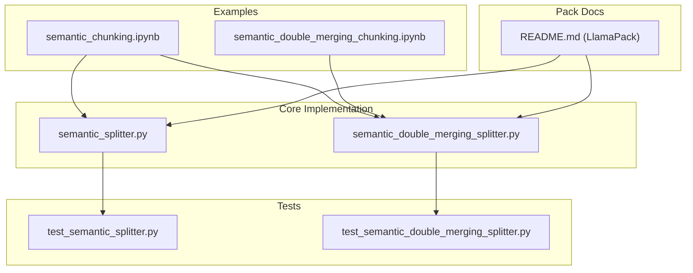
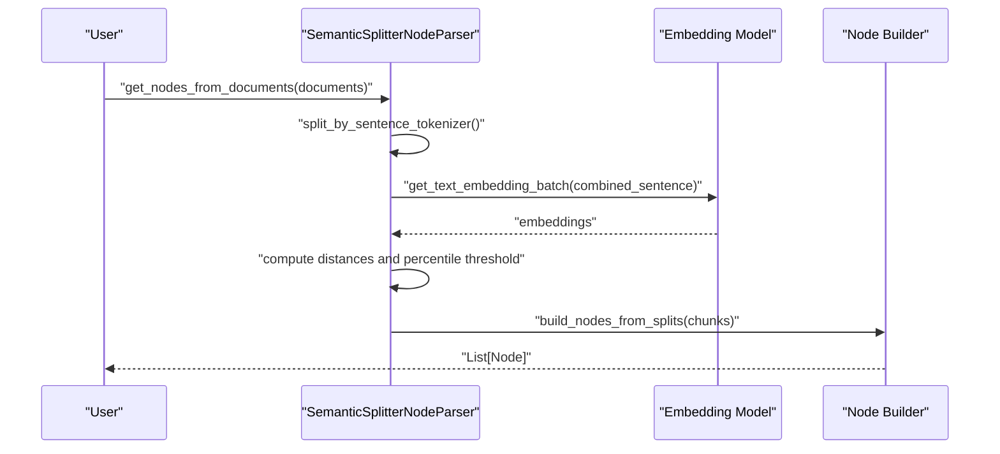
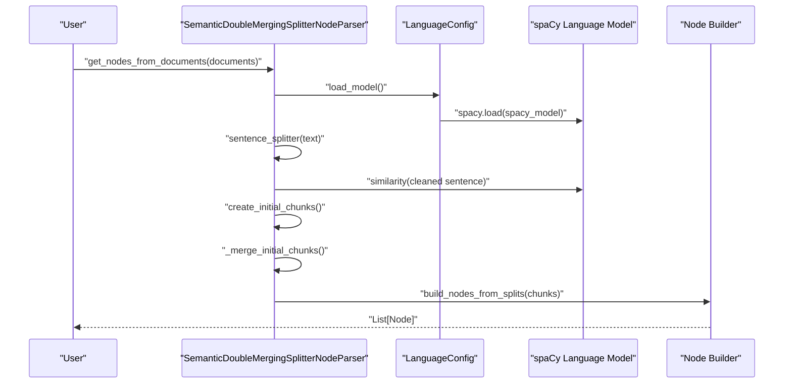
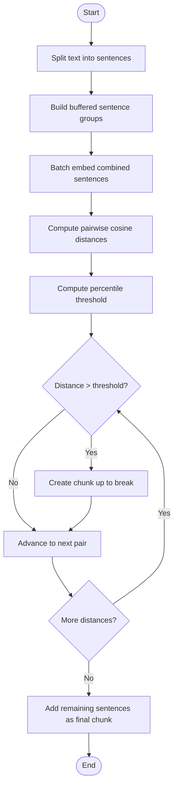
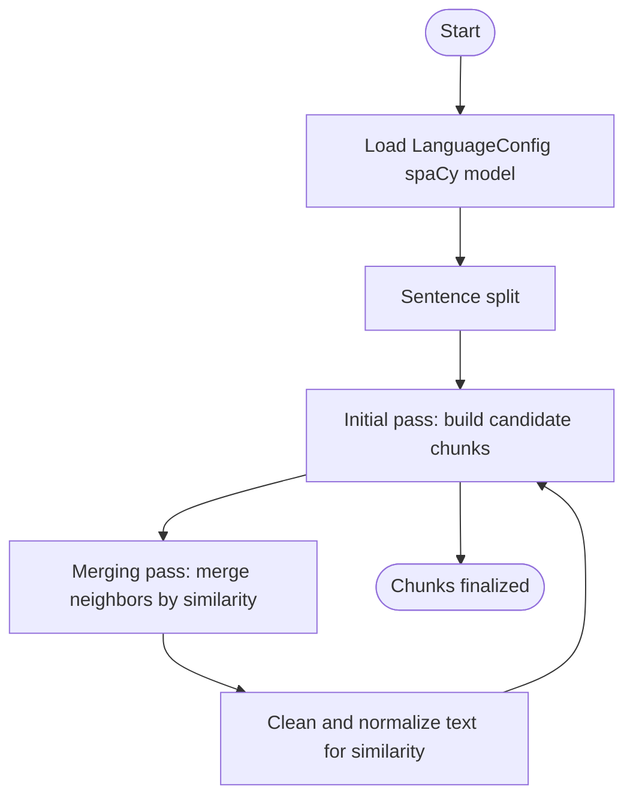
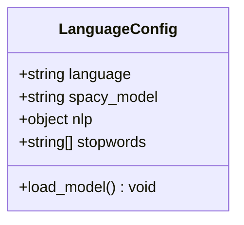
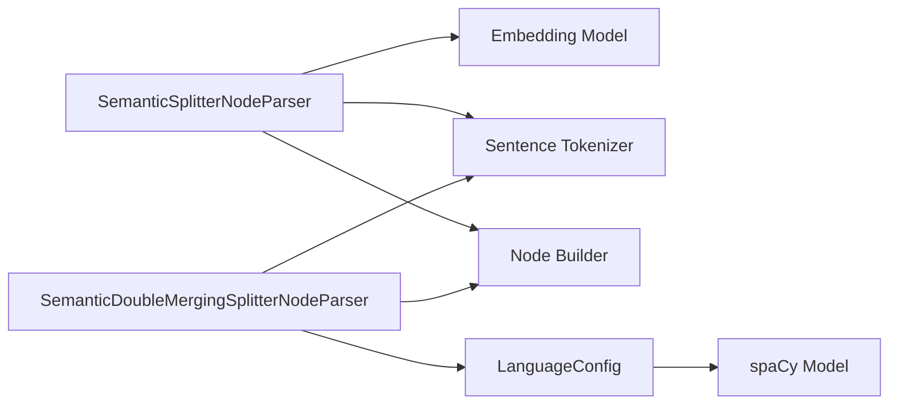

# Semantic Chunking

<cite>
**Referenced Files in This Document**
- [semantic_splitter.py](file://llama-index-core/llama_index/core/node_parser/text/semantic_splitter.py)
- [semantic_double_merging_splitter.py](file://llama-index-core/llama_index/core/node_parser/text/semantic_double_merging_splitter.py)
- [test_semantic_splitter.py](file://llama-index-core/tests/node_parser/test_semantic_splitter.py)
- [test_semantic_double_merging_splitter.py](file://llama-index-core/tests/node_parser/test_semantic_double_merging_splitter.py)
- [semantic_chunking.ipynb](file://docs/examples/node_parsers/semantic_chunking.ipynb)
- [semantic_double_merging_chunking.ipynb](file://docs/examples/node_parsers/semantic_double_merging_chunking.ipynb)
- [README.md](file://llama-index-packs/llama-index-packs-node-parser-semantic-chunking/README.md)
</cite>

## Table of Contents
1. [Introduction](#introduction)
2. [Project Structure](#project-structure)
3. [Core Components](#core-components)
4. [Architecture Overview](#architecture-overview)
5. [Detailed Component Analysis](#detailed-component-analysis)
6. [Dependency Analysis](#dependency-analysis)
7. [Performance Considerations](#performance-considerations)
8. [Troubleshooting Guide](#troubleshooting-guide)
9. [Conclusion](#conclusion)
10. [Appendices](#appendices)

## Introduction
This document explains semantic chunking techniques in LlamaIndex with a focus on:
- SemanticSplitterNodeParser for content-aware, embedding-based chunking that respects semantic boundaries.
- SemanticDoubleMergingSplitterNodeParser for hierarchical, two-pass semantic chunking with language-specific preprocessing via spaCy.
- LanguageConfig for selecting language and spaCy model.
- Practical guidance on configuring embedding models, handling different languages, optimizing chunk boundaries, and balancing semantic coherence versus granularity and performance.

## Project Structure
Semantic chunking is implemented in the core node parser module and validated by unit tests. Example notebooks demonstrate usage patterns and differences between approaches.

**Diagram sources**
- [semantic_splitter.py](file://llama-index-core/llama_index/core/node_parser/text/semantic_splitter.py#L35-L313)
- [semantic_double_merging_splitter.py](file://llama-index-core/llama_index/core/node_parser/text/semantic_double_merging_splitter.py#L62-L399)
- [test_semantic_splitter.py](file://llama-index-core/tests/node_parser/test_semantic_splitter.py#L1-L121)
- [test_semantic_double_merging_splitter.py](file://llama-index-core/tests/node_parser/test_semantic_double_merging_splitter.py#L1-L109)
- [semantic_chunking.ipynb](file://docs/examples/node_parsers/semantic_chunking.ipynb#L1-L630)
- [semantic_double_merging_chunking.ipynb](file://docs/examples/node_parsers/semantic_double_merging_chunking.ipynb#L1-L214)
- [README.md](file://llama-index-packs/llama-index-packs-node-parser-semantic-chunking/README.md#L1-L29)

**Section sources**
- [semantic_splitter.py](file://llama-index-core/llama_index/core/node_parser/text/semantic_splitter.py#L1-L313)
- [semantic_double_merging_splitter.py](file://llama-index-core/llama_index/core/node_parser/text/semantic_double_merging_splitter.py#L1-L399)
- [test_semantic_splitter.py](file://llama-index-core/tests/node_parser/test_semantic_splitter.py#L1-L121)
- [test_semantic_double_merging_splitter.py](file://llama-index-core/tests/node_parser/test_semantic_double_merging_splitter.py#L1-L109)
- [semantic_chunking.ipynb](file://docs/examples/node_parsers/semantic_chunking.ipynb#L1-L630)
- [semantic_double_merging_chunking.ipynb](file://docs/examples/node_parsers/semantic_double_merging_chunking.ipynb#L1-L214)
- [README.md](file://llama-index-packs/llama-index-packs-node-parser-semantic-chunking/README.md#L1-L29)

## Core Components
- SemanticSplitterNodeParser
  - Splits text into sentences, builds buffered combinations of nearby sentences, computes embeddings, measures cosine distances, and creates chunks at percentile-based breakpoints.
  - Key parameters: buffer_size, breakpoint_percentile_threshold, embed_model, sentence_splitter.
- SemanticDoubleMergingSplitterNodeParser
  - Two-pass process: initial chunk creation with thresholds, followed by merging passes considering adjacent chunks up to a configurable range.
  - Language-aware via LanguageConfig and spaCy models; includes text cleaning and stopword filtering.
  - Key parameters: language_config, initial_threshold, appending_threshold, merging_threshold, max_chunk_size, merging_range, merging_separator, sentence_splitter.
- LanguageConfig
  - Encapsulates language selection and spaCy model loading with validation against supported languages and models.

**Section sources**
- [semantic_splitter.py](file://llama-index-core/llama_index/core/node_parser/text/semantic_splitter.py#L35-L313)
- [semantic_double_merging_splitter.py](file://llama-index-core/llama_index/core/node_parser/text/semantic_double_merging_splitter.py#L29-L399)

## Architecture Overview
High-level flow for each approach:

**Diagram sources**
- [semantic_splitter.py](file://llama-index-core/llama_index/core/node_parser/text/semantic_splitter.py#L160-L193)

**Diagram sources**
- [semantic_double_merging_splitter.py](file://llama-index-core/llama_index/core/node_parser/text/semantic_double_merging_splitter.py#L180-L237)

## Detailed Component Analysis

### SemanticSplitterNodeParser
- Sentence grouping: Uses a sliding buffer around each sentence to form combined contexts for embedding.
- Embedding computation: Batch computes embeddings for combined sentences.
- Distance calculation: Computes cosine distance between consecutive combined embeddings.
- Thresholding: Determines a percentile-based breakpoint threshold; chunks are formed at positions exceeding the threshold.
- Edge case: For very small documents with insufficient distances, treats the entire content as a single chunk.

**Diagram sources**
- [semantic_splitter.py](file://llama-index-core/llama_index/core/node_parser/text/semantic_splitter.py#L232-L312)

Key implementation references:
- Sentence grouping and combination: [semantic_splitter.py](file://llama-index-core/llama_index/core/node_parser/text/semantic_splitter.py#L232-L261)
- Distance computation and percentile threshold: [semantic_splitter.py](file://llama-index-core/llama_index/core/node_parser/text/semantic_splitter.py#L263-L286)
- Chunk construction: [semantic_splitter.py](file://llama-index-core/llama_index/core/node_parser/text/semantic_splitter.py#L279-L312)

Example usage and comparison with baseline chunking:
- Notebook demonstrates creating a SemanticSplitterNodeParser, generating nodes, and comparing results to a fixed-size baseline: [semantic_chunking.ipynb](file://docs/examples/node_parsers/semantic_chunking.ipynb#L108-L133)

Unit tests validating grouping and semantic coalescing:
- [test_semantic_splitter.py](file://llama-index-core/tests/node_parser/test_semantic_splitter.py#L74-L121)

**Section sources**
- [semantic_splitter.py](file://llama-index-core/llama_index/core/node_parser/text/semantic_splitter.py#L35-L313)
- [test_semantic_splitter.py](file://llama-index-core/tests/node_parser/test_semantic_splitter.py#L1-L121)
- [semantic_chunking.ipynb](file://docs/examples/node_parsers/semantic_chunking.ipynb#L108-L133)

### SemanticDoubleMergingSplitterNodeParser
- Two-pass strategy:
  - Initial pass: Creates candidate chunks by comparing similarity between the current chunk and the next sentence using initial_threshold and appending_threshold, respecting max_chunk_size.
  - Merging pass: Attempts to merge neighboring chunks based on merging_threshold, optionally extending to 2–3 chunks ahead depending on merging_range.
- Language awareness:
  - LanguageConfig selects language and spaCy model, validates compatibility, and loads the model lazily.
  - Text cleaning removes URLs, punctuation, and filters stopwords using spaCy’s tokenizer and a global stopword set.
- Parameters:
  - initial_threshold, appending_threshold, merging_threshold, max_chunk_size, merging_range, merging_separator, sentence_splitter.

**Diagram sources**
- [semantic_double_merging_splitter.py](file://llama-index-core/llama_index/core/node_parser/text/semantic_double_merging_splitter.py#L180-L237)
- [semantic_double_merging_splitter.py](file://llama-index-core/llama_index/core/node_parser/text/semantic_double_merging_splitter.py#L298-L386)

Key implementation references:
- LanguageConfig and validation: [semantic_double_merging_splitter.py](file://llama-index-core/llama_index/core/node_parser/text/semantic_double_merging_splitter.py#L29-L60)
- Initial chunk creation: [semantic_double_merging_splitter.py](file://llama-index-core/llama_index/core/node_parser/text/semantic_double_merging_splitter.py#L239-L296)
- Merging logic: [semantic_double_merging_splitter.py](file://llama-index-core/llama_index/core/node_parser/text/semantic_double_merging_splitter.py#L298-L386)
- Text cleaning pipeline: [semantic_double_merging_splitter.py](file://llama-index-core/llama_index/core/node_parser/text/semantic_double_merging_splitter.py#L388-L399)

Example usage with LanguageConfig and spaCy model:
- Notebook shows constructing LanguageConfig, initializing the splitter, and generating nodes: [semantic_double_merging_chunking.ipynb](file://docs/examples/node_parsers/semantic_double_merging_chunking.ipynb#L64-L94)

Unit tests validating chunk counts and size constraints:
- [test_semantic_double_merging_splitter.py](file://llama-index-core/tests/node_parser/test_semantic_double_merging_splitter.py#L40-L109)

**Section sources**
- [semantic_double_merging_splitter.py](file://llama-index-core/llama_index/core/node_parser/text/semantic_double_merging_splitter.py#L29-L399)
- [semantic_double_merging_chunking.ipynb](file://docs/examples/node_parsers/semantic_double_merging_chunking.ipynb#L64-L94)
- [test_semantic_double_merging_splitter.py](file://llama-index-core/tests/node_parser/test_semantic_double_merging_splitter.py#L1-L109)

### LanguageConfig
- Purpose: Encapsulate language and spaCy model selection with validation.
- Supported languages and models are enumerated and enforced.
- Lazy loading of the spaCy model and stopword initialization.

**Diagram sources**
- [semantic_double_merging_splitter.py](file://llama-index-core/llama_index/core/node_parser/text/semantic_double_merging_splitter.py#L29-L60)

**Section sources**
- [semantic_double_merging_splitter.py](file://llama-index-core/llama_index/core/node_parser/text/semantic_double_merging_splitter.py#L20-L60)

## Dependency Analysis
- SemanticSplitterNodeParser depends on:
  - A BaseEmbedding-compatible model for text embeddings and similarity computations.
  - Sentence tokenizer utilities for sentence segmentation.
  - Node builder utilities to convert text chunks into nodes.
- SemanticDoubleMergingSplitterNodeParser depends on:
  - LanguageConfig for language and model selection.
  - spaCy for linguistic processing and similarity comparisons.
  - Global helpers for stopwords and sentence tokenization.

**Diagram sources**
- [semantic_splitter.py](file://llama-index-core/llama_index/core/node_parser/text/semantic_splitter.py#L1-L16)
- [semantic_double_merging_splitter.py](file://llama-index-core/llama_index/core/node_parser/text/semantic_double_merging_splitter.py#L1-L16)

**Section sources**
- [semantic_splitter.py](file://llama-index-core/llama_index/core/node_parser/text/semantic_splitter.py#L1-L16)
- [semantic_double_merging_splitter.py](file://llama-index-core/llama_index/core/node_parser/text/semantic_double_merging_splitter.py#L1-L16)

## Performance Considerations
- Embedding cost:
  - SemanticSplitterNodeParser computes embeddings for buffered sentence combinations; larger buffer_size increases embedding calls and latency.
  - Batch embedding calls reduce overhead but increase memory footprint.
- Two-pass complexity:
  - SemanticDoubleMergingSplitterNodeParser performs:
    - Initial pass: O(n) sentence comparisons.
    - Merging pass: O(k) merges with optional lookahead up to merging_range.
  - Memory usage grows with the number of candidate chunks and merged chunk sizes.
- Language model overhead:
  - spaCy model loading and similarity computations add CPU cost; consider caching or reuse where applicable.
- Practical tuning:
  - Adjust buffer_size and thresholds to balance semantic coherence and chunk granularity.
  - Use max_chunk_size to bound downstream processing costs.

[No sources needed since this section provides general guidance]

## Troubleshooting Guide
Common issues and resolutions:
- Missing embedding provider:
  - Ensure an embedding model is configured; the default attempts to initialize an OpenAI embedding model if none is provided.
  - Reference: [semantic_splitter.py](file://llama-index-core/llama_index/core/node_parser/text/semantic_splitter.py#L99-L110)
- Missing spaCy installation or model:
  - Install spaCy and the required language model; LanguageConfig raises an ImportError if spaCy is missing.
  - Reference: [semantic_double_merging_splitter.py](file://llama-index-core/llama_index/core/node_parser/text/semantic_double_merging_splitter.py#L51-L58)
- Unsupported language or mismatched model:
  - LanguageConfig validates language and model compatibility; adjust language_config accordingly.
  - Reference: [semantic_double_merging_splitter.py](file://llama-index-core/llama_index/core/node_parser/text/semantic_double_merging_splitter.py#L36-L44)
- Very small documents:
  - Documents with insufficient sentence pairs may yield a single chunk; verify input length and sentence segmentation.
  - Reference: [semantic_splitter.py](file://llama-index-core/llama_index/core/node_parser/text/semantic_splitter.py#L307-L311)

**Section sources**
- [semantic_splitter.py](file://llama-index-core/llama_index/core/node_parser/text/semantic_splitter.py#L99-L110)
- [semantic_double_merging_splitter.py](file://llama-index-core/llama_index/core/node_parser/text/semantic_double_merging_splitter.py#L51-L58)
- [semantic_double_merging_splitter.py](file://llama-index-core/llama_index/core/node_parser/text/semantic_double_merging_splitter.py#L36-L44)
- [semantic_splitter.py](file://llama-index-core/llama_index/core/node_parser/text/semantic_splitter.py#L307-L311)

## Conclusion
Semantic chunking improves retrieval quality by aligning chunk boundaries with semantic continuity. Choose SemanticSplitterNodeParser for straightforward embedding-based boundary detection and SemanticDoubleMergingSplitterNodeParser for language-aware, hierarchical chunking with tunable thresholds and merging. Carefully select embedding and language models, calibrate thresholds and chunk sizes, and profile performance to meet your application’s accuracy and latency targets.

[No sources needed since this section summarizes without analyzing specific files]

## Appendices

### Practical Examples and Recipes
- Configure SemanticSplitterNodeParser with an embedding model and thresholds:
  - See notebook usage: [semantic_chunking.ipynb](file://docs/examples/node_parsers/semantic_chunking.ipynb#L108-L133)
- Configure SemanticDoubleMergingSplitterNodeParser with LanguageConfig and spaCy:
  - See notebook usage: [semantic_double_merging_chunking.ipynb](file://docs/examples/node_parsers/semantic_double_merging_chunking.ipynb#L64-L94)
- LlamaPack overview of semantic chunking:
  - See pack README: [README.md](file://llama-index-packs/llama-index-packs-node-parser-semantic-chunking/README.md#L1-L29)

**Section sources**
- [semantic_chunking.ipynb](file://docs/examples/node_parsers/semantic_chunking.ipynb#L108-L133)
- [semantic_double_merging_chunking.ipynb](file://docs/examples/node_parsers/semantic_double_merging_chunking.ipynb#L64-L94)
- [README.md](file://llama-index-packs/llama-index-packs-node-parser-semantic-chunking/README.md#L1-L29)