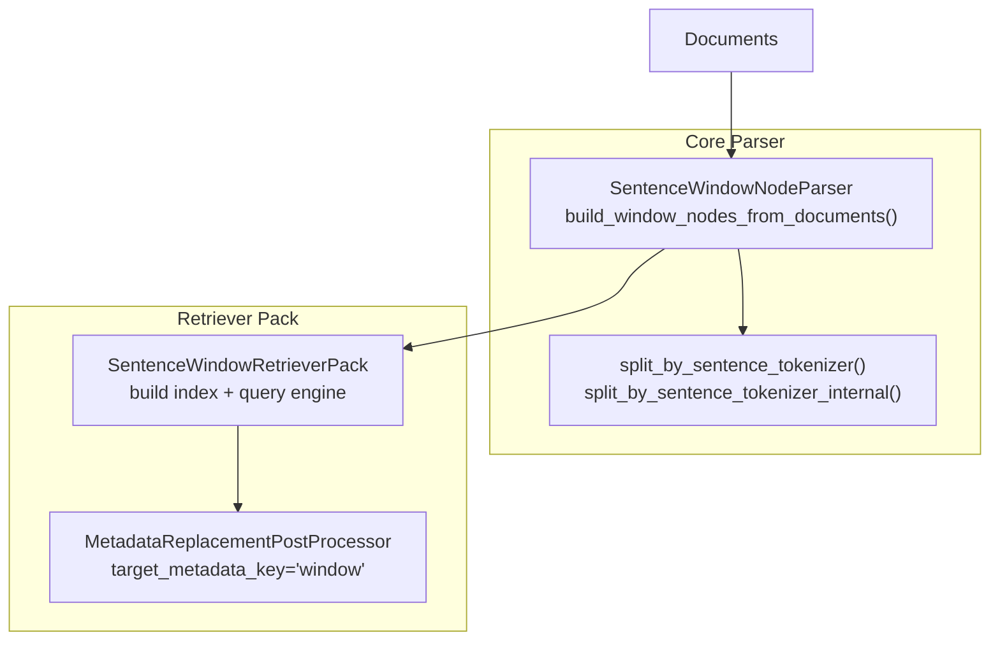
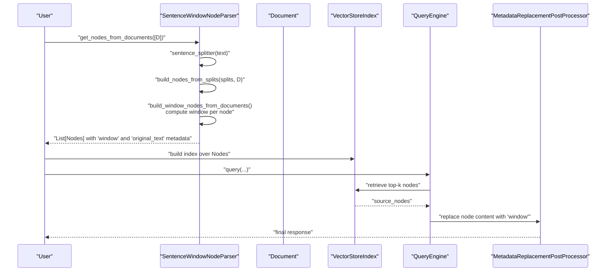
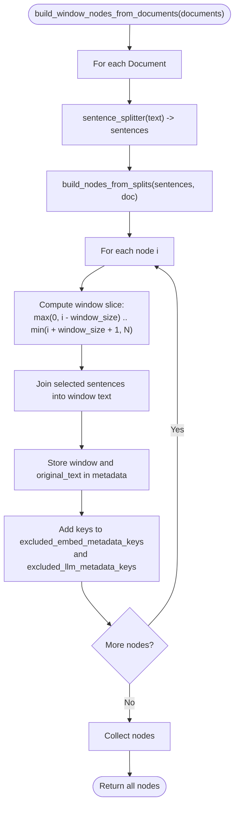
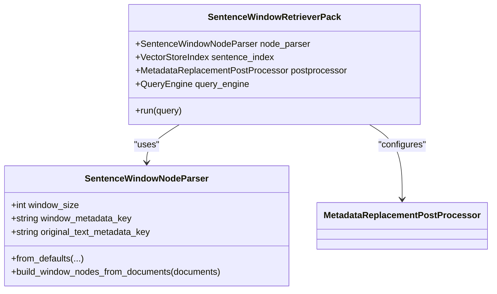
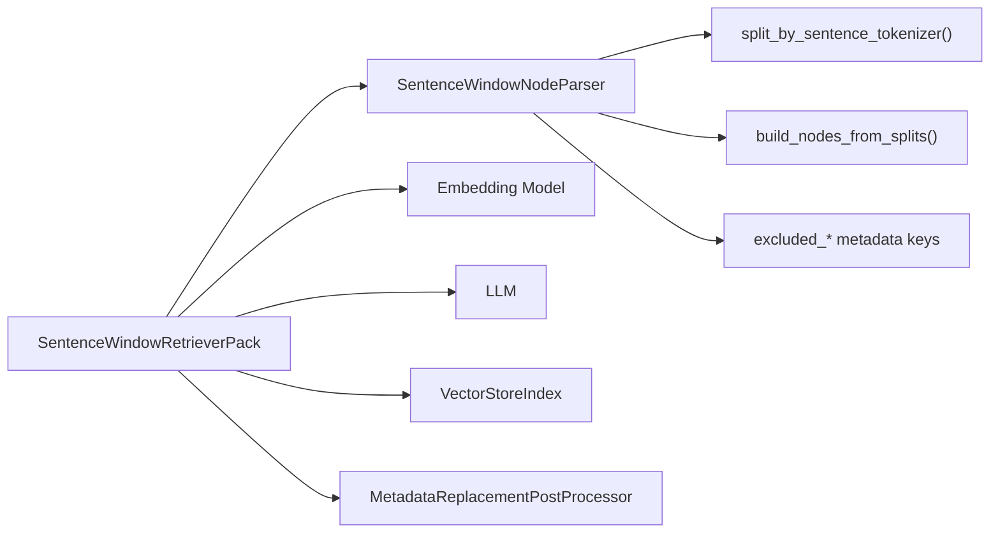

# Sentence Window Chunking

<cite>
**Referenced Files in This Document**
- [sentence_window.py](file://llama-index-core/llama_index/core/node_parser/text/sentence_window.py)
- [utils.py](file://llama-index-core/llama_index/core/node_parser/text/utils.py)
- [sentence_window.md](file://docs/api_reference/api_reference/node_parsers/sentence_window.md)
- [base.py](file://llama-index-packs/llama-index-packs-sentence-window-retriever/llama_index/packs/sentence_window_retriever/base.py)
- [sentence_window.ipynb](file://llama-index-packs/llama-index-packs-sentence-window-retriever/examples/sentence_window.ipynb)
- [sentence_window.py (test)](file://llama-index-core/tests/node_parser/sentence_window.py)
</cite>

## Table of Contents
1. [Introduction](#introduction)
2. [Project Structure](#project-structure)
3. [Core Components](#core-components)
4. [Architecture Overview](#architecture-overview)
5. [Detailed Component Analysis](#detailed-component-analysis)
6. [Dependency Analysis](#dependency-analysis)
7. [Performance Considerations](#performance-considerations)
8. [Troubleshooting Guide](#troubleshooting-guide)
9. [Conclusion](#conclusion)
10. [Appendices](#appendices)

## Introduction
Sentence window chunking is a context-aware chunking technique that creates sentence-sized chunks while preserving surrounding context in each node’s metadata. This approach is particularly effective for retrieval tasks where understanding local context improves relevance, such as question answering and document summarization. The implementation centers around a dedicated parser that splits text into sentences and augments each sentence node with a “window” of neighboring sentences, stored in metadata for downstream retrieval and synthesis.

## Project Structure
This documentation focuses on the core parser implementation and its integration via a retriever pack:
- Core parser: sentence window chunking logic and window construction
- Utilities: sentence segmentation using NLTK Punkt
- Pack: end-to-end pipeline integrating the parser, indexing, and postprocessing
- Examples and tests: usage patterns and validation of window behavior

**Diagram sources**
- [sentence_window.py](file://llama-index-core/llama_index/core/node_parser/text/sentence_window.py#L103-L140)
- [utils.py](file://llama-index-core/llama_index/core/node_parser/text/utils.py#L91-L94)
- [base.py](file://llama-index-packs/llama-index-packs-sentence-window-retriever/llama_index/packs/sentence_window_retriever/base.py#L16-L72)

**Section sources**
- [sentence_window.py](file://llama-index-core/llama_index/core/node_parser/text/sentence_window.py#L1-L141)
- [utils.py](file://llama-index-core/llama_index/core/node_parser/text/utils.py#L1-L125)
- [base.py](file://llama-index-packs/llama-index-packs-sentence-window-retriever/llama_index/packs/sentence_window_retriever/base.py#L1-L73)

## Core Components
- SentenceWindowNodeParser
  - Purpose: Split documents into sentence-sized nodes and attach a contextual window of surrounding sentences to each node’s metadata.
  - Key parameters:
    - window_size: Number of sentences to include on each side of the current sentence (default 3).
    - window_metadata_key: Metadata key storing the concatenated window text (default "window").
    - original_text_metadata_key: Metadata key storing the original sentence text (default "original_text").
    - sentence_splitter: Function to segment text into sentences (default uses NLTK Punkt).
  - Behavior:
    - Splits each document into sentences.
    - Builds nodes from sentence splits.
    - For each node, computes a window by slicing the sentence array around the current index and concatenates the selected sentences.
    - Stores the window and original sentence in metadata and marks keys as excluded from embedding and LLM processing.

- Sentence segmentation utilities
  - Uses NLTK Punkt tokenizer to reliably split text into sentences and compute spans for accurate boundaries.

- SentenceWindowRetrieverPack
  - Integrates the parser, builds a vector index over windowed nodes, and configures a postprocessor to replace node content with the window during synthesis.

**Section sources**
- [sentence_window.py](file://llama-index-core/llama_index/core/node_parser/text/sentence_window.py#L21-L140)
- [utils.py](file://llama-index-core/llama_index/core/node_parser/text/utils.py#L72-L94)
- [base.py](file://llama-index-packs/llama-index-packs-sentence-window-retriever/llama_index/packs/sentence_window_retriever/base.py#L16-L72)

## Architecture Overview
The sentence window chunking pipeline follows a straightforward flow:
- Parse documents into sentence nodes
- Attach contextual windows to each node
- Index nodes (e.g., with embeddings)
- Retrieve top-k nodes
- Replace node content with the window metadata for synthesis

**Diagram sources**
- [sentence_window.py](file://llama-index-core/llama_index/core/node_parser/text/sentence_window.py#L87-L140)
- [base.py](file://llama-index-packs/llama-index-packs-sentence-window-retriever/llama_index/packs/sentence_window_retriever/base.py#L47-L57)

## Detailed Component Analysis

### SentenceWindowNodeParser
- Responsibilities
  - Sentence segmentation using a configurable splitter.
  - Node creation from sentence splits.
  - Window computation around each sentence node.
  - Metadata management to preserve original text and window content while excluding them from embedding/LLM processing.

- Window computation logic
  - For each sentence node at index i, select sentences from i - window_size to i + window_size (inclusive).
  - Clamp indices to document boundaries.
  - Concatenate selected sentences into a single window string stored under the configured metadata key.

- Metadata exclusion
  - Adds both window and original text keys to excluded lists for embedding and LLM processing to avoid redundant duplication in vectors and prompts.

**Diagram sources**
- [sentence_window.py](file://llama-index-core/llama_index/core/node_parser/text/sentence_window.py#L103-L140)

**Section sources**
- [sentence_window.py](file://llama-index-core/llama_index/core/node_parser/text/sentence_window.py#L21-L140)

### Sentence Segmentation Utilities
- Uses NLTK Punkt to tokenize text into sentences and compute spans.
- Ensures accurate sentence boundaries by leveraging tokenizer spans rather than naive punctuation splitting.

**Section sources**
- [utils.py](file://llama-index-core/llama_index/core/node_parser/text/utils.py#L72-L94)

### SentenceWindowRetrieverPack
- Initializes the parser with default window size and metadata keys.
- Builds a vector index over parsed nodes.
- Configures a postprocessor to replace node content with the window metadata during synthesis.
- Exposes a query engine for end-to-end retrieval and response generation.

**Diagram sources**
- [sentence_window.py](file://llama-index-core/llama_index/core/node_parser/text/sentence_window.py#L54-L85)
- [base.py](file://llama-index-packs/llama-index-packs-sentence-window-retriever/llama_index/packs/sentence_window_retriever/base.py#L16-L72)

**Section sources**
- [base.py](file://llama-index-packs/llama-index-packs-sentence-window-retriever/llama_index/packs/sentence_window_retriever/base.py#L16-L72)

### Practical Examples and Impact of Window Size
- Example: Basic sentence window behavior
  - Demonstrates that three sentences produce three nodes, each with a window containing itself and adjacent sentences.
  - Validates that the window metadata concatenates the correct surrounding sentences and that the original text is preserved separately.

- Example: End-to-end retrieval pack
  - Loads documents, initializes the retriever pack, and runs a query.
  - Shows how the pack integrates parsing, indexing, and postprocessing to synthesize answers enriched with context.

- Window size impact
  - Larger window_size increases context coverage, potentially improving recall and relevance for questions requiring broader context.
  - Smaller window_size reduces redundancy and noise, which can improve precision and reduce embedding overhead.
  - Overlap increases with larger windows, affecting index size and retrieval cost.

**Section sources**
- [sentence_window.py (test)](file://llama-index-core/tests/node_parser/sentence_window.py#L7-L24)
- [sentence_window.ipynb](file://llama-index-packs/llama-index-packs-sentence-window-retriever/examples/sentence_window.ipynb#L68-L124)

## Dependency Analysis
- Internal dependencies
  - SentenceWindowNodeParser depends on:
    - Sentence segmentation utilities for reliable sentence splitting.
    - Node building utilities to construct nodes from sentence splits.
    - Metadata exclusion mechanisms to prevent duplication in embeddings and LLM prompts.

- External integrations
  - SentenceWindowRetrieverPack integrates:
    - Embedding model for indexing.
    - LLM for response synthesis.
    - Vector index backend for retrieval.
    - Postprocessor to inject window context into synthesized responses.

**Diagram sources**
- [sentence_window.py](file://llama-index-core/llama_index/core/node_parser/text/sentence_window.py#L103-L140)
- [utils.py](file://llama-index-core/llama_index/core/node_parser/text/utils.py#L91-L94)
- [base.py](file://llama-index-packs/llama-index-packs-sentence-window-retriever/llama_index/packs/sentence_window_retriever/base.py#L16-L72)

**Section sources**
- [sentence_window.py](file://llama-index-core/llama_index/core/node_parser/text/sentence_window.py#L1-L141)
- [base.py](file://llama-index-packs/llama-index-packs-sentence-window-retriever/llama_index/packs/sentence_window_retriever/base.py#L1-L73)

## Performance Considerations
- Window size trade-offs
  - Larger windows increase metadata size and embedding costs but may improve retrieval accuracy for context-dependent queries.
  - Smaller windows reduce index size and latency but risk losing important context for nuanced questions.

- Overlap and redundancy
  - Overlapping windows introduce repeated content across nodes, increasing index size. Consider deduplication or careful tuning of window size and overlap strategy.

- Tokenization quality
  - Using robust sentence segmentation (e.g., NLTK Punkt) ensures accurate boundaries and minimizes fragmenting clauses, improving semantic coherence.

- Retrieval and synthesis
  - Postprocessing replaces node content with the window, reducing prompt size and focusing synthesis on relevant context.

[No sources needed since this section provides general guidance]

## Troubleshooting Guide
- Unexpected empty or truncated windows
  - Verify sentence segmentation produces multiple sentences and that window_size does not exceed the number of sentences.
  - Confirm metadata keys are correctly set and not overwritten elsewhere.

- Retrieval quality issues
  - Adjust window_size to balance context and noise.
  - Ensure postprocessor target key matches the node parser’s window metadata key.

- Embedding or LLM prompt bloat
  - Confirm that window and original text metadata keys are included in excluded lists to avoid duplication in embeddings and prompts.

**Section sources**
- [sentence_window.py](file://llama-index-core/llama_index/core/node_parser/text/sentence_window.py#L125-L136)
- [base.py](file://llama-index-packs/llama-index-packs-sentence-window-retriever/llama_index/packs/sentence_window_retriever/base.py#L50-L57)

## Conclusion
Sentence window chunking enhances retrieval by preserving local context around each sentence node. The core parser efficiently constructs windows and manages metadata to avoid redundancy, while the retriever pack streamlines integration with embedding models, vector stores, and postprocessing. Proper tuning of window size and overlap is essential to balance context richness, retrieval performance, and resource usage.

[No sources needed since this section summarizes without analyzing specific files]

## Appendices
- API reference overview
  - See the API reference for SentenceWindowNodeParser members and configuration options.

**Section sources**
- [sentence_window.md](file://docs/api_reference/api_reference/node_parsers/sentence_window.md#L1-L4)