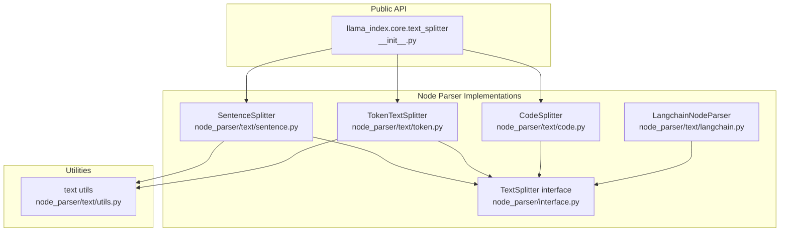
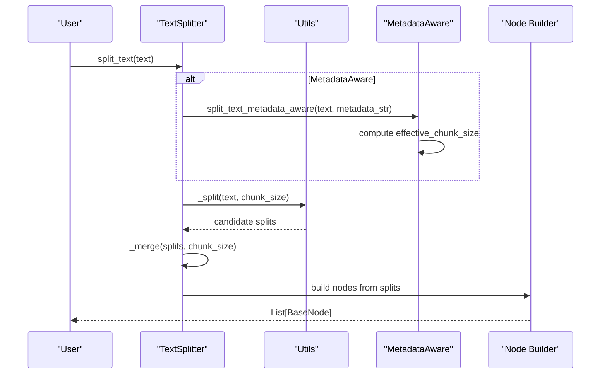
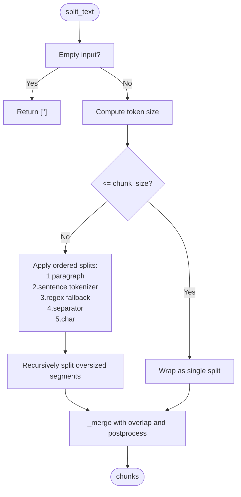
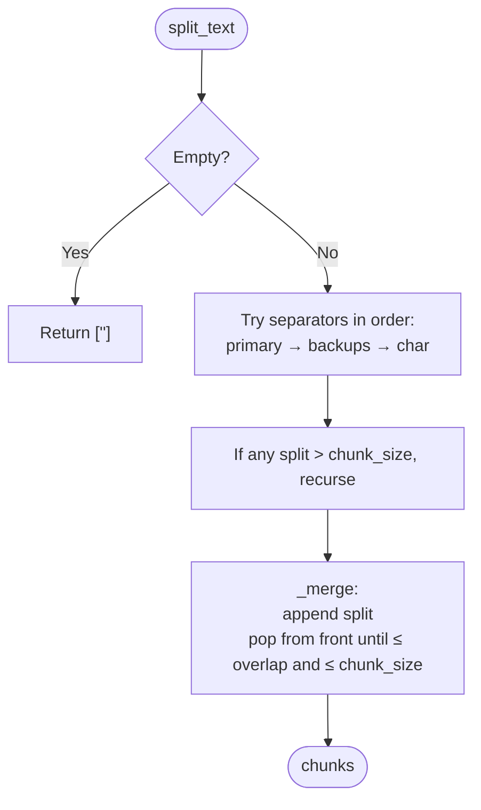
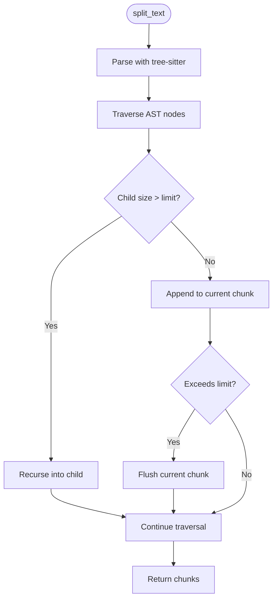
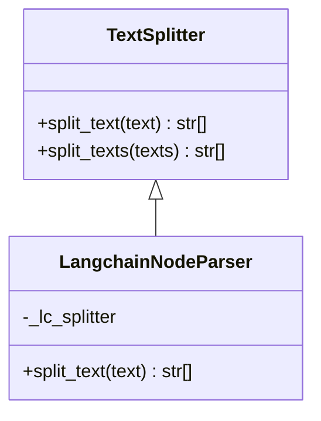
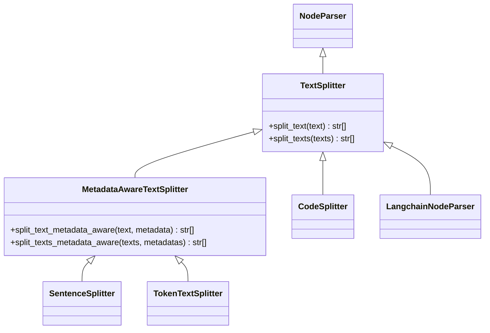

# Text Splitters

<cite>
**Referenced Files in This Document**
- [__init__.py](file://llama-index-core/llama_index/core/text_splitter/__init__.py)
- [sentence.py](file://llama-index-core/llama_index/core/node_parser/text/sentence.py)
- [token.py](file://llama-index-core/llama_index/core/node_parser/text/token.py)
- [code.py](file://llama-index-core/llama_index/core/node_parser/text/code.py)
- [langchain.py](file://llama-index-core/llama_index/core/node_parser/text/langchain.py)
- [interface.py](file://llama-index-core/llama_index/core/node_parser/interface.py)
- [utils.py](file://llama-index-core/llama_index/core/node_parser/text/utils.py)
- [test_sentence_splitter.py](file://llama-index-core/tests/text_splitter/test_sentence_splitter.py)
- [test_token_splitter.py](file://llama-index-core/tests/text_splitter/test_token_splitter.py)
- [test_code_splitter.py](file://llama-index-core/tests/text_splitter/test_code_splitter.py)
- [token_based_code_splitter_example.py](file://examples/token_based_code_splitter_example.py)
</cite>

## Table of Contents
1. [Introduction](#introduction)
2. [Project Structure](#project-structure)
3. [Core Components](#core-components)
4. [Architecture Overview](#architecture-overview)
5. [Detailed Component Analysis](#detailed-component-analysis)
6. [Dependency Analysis](#dependency-analysis)
7. [Performance Considerations](#performance-considerations)
8. [Troubleshooting Guide](#troubleshooting-guide)
9. [Conclusion](#conclusion)

## Introduction
This document explains the text splitting strategies available in LlamaIndex, focusing on four primary implementations:
- SentenceSplitter: sentence-based chunking with strong sentence boundary preservation
- TokenTextSplitter: token-based splitting using a configurable tokenizer
- CodeSplitter: AST-driven, programming language–specific chunking supporting both character and token modes
- LangchainNodeParser: adapter for integrating LangChain text splitters

It covers the underlying algorithms, configuration parameters, typical use cases, practical configuration examples, performance characteristics, and best practices for different document types and languages.

## Project Structure
The text splitting functionality is organized under the node parser module with dedicated implementations for each strategy. A public re-export exists for convenience.

**Diagram sources**
- [__init__.py](file://llama-index-core/llama_index/core/text_splitter/__init__.py#L1-L13)
- [interface.py](file://llama-index-core/llama_index/core/node_parser/interface.py#L210-L278)
- [sentence.py](file://llama-index-core/llama_index/core/node_parser/text/sentence.py#L34-L332)
- [token.py](file://llama-index-core/llama_index/core/node_parser/text/token.py#L22-L242)
- [code.py](file://llama-index-core/llama_index/core/node_parser/text/code.py#L19-L266)
- [langchain.py](file://llama-index-core/llama_index/core/node_parser/text/langchain.py#L15-L46)
- [utils.py](file://llama-index-core/llama_index/core/node_parser/text/utils.py#L10-L125)

**Section sources**
- [__init__.py](file://llama-index-core/llama_index/core/text_splitter/__init__.py#L1-L13)

## Core Components
- SentenceSplitter: Prefers sentence boundaries and minimizes mid-sentence splits. It supports paragraph-aware splitting and a secondary regex fallback for sentence segmentation.
- TokenTextSplitter: Splits by separators and characters, using a tokenizer to enforce chunk size. Supports metadata-aware splitting with reserved space for metadata.
- CodeSplitter: Uses an AST (via tree-sitter) to split code while respecting language syntax. Supports both character-based and token-based modes with configurable line chunking and overlap.
- LangchainNodeParser: Wraps a LangChain text splitter for seamless integration.

**Section sources**
- [sentence.py](file://llama-index-core/llama_index/core/node_parser/text/sentence.py#L34-L332)
- [token.py](file://llama-index-core/llama_index/core/node_parser/text/token.py#L22-L242)
- [code.py](file://llama-index-core/llama_index/core/node_parser/text/code.py#L19-L266)
- [langchain.py](file://llama-index-core/llama_index/core/node_parser/text/langchain.py#L15-L46)

## Architecture Overview
The splitting pipeline follows a consistent pattern:
- A TextSplitter subclass receives raw text
- It applies ordered splitting heuristics (e.g., separators, regex, characters)
- It merges splits into chunks respecting chunk_size and chunk_overlap
- Optional metadata-aware adjustments compute effective chunk size after reserving space for metadata
- The resulting chunks are converted into nodes with optional relationships and metadata propagation

**Diagram sources**
- [interface.py](file://llama-index-core/llama_index/core/node_parser/interface.py#L210-L278)
- [utils.py](file://llama-index-core/llama_index/core/node_parser/text/utils.py#L10-L125)
- [sentence.py](file://llama-index-core/llama_index/core/node_parser/text/sentence.py#L176-L332)
- [token.py](file://llama-index-core/llama_index/core/node_parser/text/token.py#L138-L242)

## Detailed Component Analysis

### SentenceSplitter
- Purpose: Preserve sentence and paragraph boundaries for coherent chunks.
- Key parameters:
  - chunk_size: target token count per chunk
  - chunk_overlap: token overlap between adjacent chunks
  - separator: default word separator
  - paragraph_separator: paragraph delimiter
  - secondary_chunking_regex: fallback regex for sentence-like boundaries
  - tokenizer: callable returning token list
  - chunking_tokenizer_fn: sentence tokenizer function
- Algorithm highlights:
  - Ordered splitting: paragraph → sentence tokenizer → regex fallback → word separator → character
  - Recursive subdivision when a segment exceeds chunk size
  - Merging with overlap management and post-processing to strip whitespace-only chunks
- Metadata awareness:
  - Computes effective chunk size by subtracting metadata token count plus a small buffer
  - Emits warnings when remaining tokens fall below a threshold
- Typical use cases:
  - Natural language documents where sentence coherence matters
  - Multilingual text with varied tokenization behavior
- Practical configuration examples:
  - Configure chunk_size and chunk_overlap for desired token budget and continuity
  - Adjust paragraph_separator for documents with unusual paragraph breaks
  - Provide a custom tokenizer for domain-specific encodings

**Diagram sources**
- [sentence.py](file://llama-index-core/llama_index/core/node_parser/text/sentence.py#L176-L332)
- [utils.py](file://llama-index-core/llama_index/core/node_parser/text/utils.py#L43-L125)

**Section sources**
- [sentence.py](file://llama-index-core/llama_index/core/node_parser/text/sentence.py#L34-L332)
- [test_sentence_splitter.py](file://llama-index-core/tests/text_splitter/test_sentence_splitter.py#L1-L200)

### TokenTextSplitter
- Purpose: Token-aware splitting using separators and character fallback.
- Key parameters:
  - chunk_size: token budget per chunk
  - chunk_overlap: token overlap between adjacent chunks
  - separator: primary separator
  - backup_separators: additional separators
  - keep_whitespaces: preserve leading/trailing whitespace in merged chunks
  - tokenizer: callable returning token list
- Algorithm highlights:
  - Ordered splitting: primary separator → backup separators → character
  - Recursive subdivision for oversized segments
  - Overlap handling by popping from the front of the previous chunk until constraints are satisfied
- Metadata awareness:
  - Reserves space for metadata formatting and warns when remaining tokens are very small
- Typical use cases:
  - General-purpose text when exact token counts are required
  - Multilingual or specialized vocabularies requiring custom tokenization
- Practical configuration examples:
  - Set chunk_size and chunk_overlap aligned with downstream model limits
  - Add backup_separators for structured content (e.g., newline)
  - Enable keep_whitespaces when whitespace formatting is important

**Diagram sources**
- [token.py](file://llama-index-core/llama_index/core/node_parser/text/token.py#L138-L242)

**Section sources**
- [token.py](file://llama-index-core/llama_index/core/node_parser/text/token.py#L22-L242)
- [test_token_splitter.py](file://llama-index-core/tests/text_splitter/test_token_splitter.py#L1-L92)

### CodeSplitter
- Purpose: Language-aware code chunking using AST traversal to respect syntax.
- Key parameters:
  - language: programming language identifier
  - chunk_lines: number of lines per chunk
  - chunk_lines_overlap: overlapping lines between chunks
  - max_chars: maximum characters per chunk (character mode)
  - count_mode: "char" or "token"
  - max_tokens: maximum tokens per chunk (token mode)
  - tokenizer: callable for token-based counting
  - parser: optional tree-sitter parser instance
- Algorithm highlights:
  - Parses code into an AST and traverses nodes
  - Builds current chunk incrementally; if adding a child exceeds the limit, flush and start a new chunk
  - Supports recursive subdivision of oversized children
- Metadata awareness:
  - Not implemented in this class; use the node parser’s metadata-aware pipeline externally if needed
- Typical use cases:
  - Source code repositories, documentation with code blocks, and technical manuals
  - Multi-language support via tree-sitter language pack
- Practical configuration examples:
  - Character mode: tune max_chars and chunk_lines for readability and context
  - Token mode: tune max_tokens and optionally supply a custom tokenizer
  - Provide a prebuilt parser for environments without automatic language pack discovery

**Diagram sources**
- [code.py](file://llama-index-core/llama_index/core/node_parser/text/code.py#L166-L266)

**Section sources**
- [code.py](file://llama-index-core/llama_index/core/node_parser/text/code.py#L19-L266)
- [test_code_splitter.py](file://llama-index-core/tests/text_splitter/test_code_splitter.py#L1-L409)
- [token_based_code_splitter_example.py](file://examples/token_based_code_splitter_example.py#L1-L264)

### LangchainNodeParser
- Purpose: Adapter to integrate LangChain text splitters into LlamaIndex pipelines.
- Key parameters:
  - lc_splitter: a LangChain TextSplitter instance
- Behavior:
  - Delegates split_text to the wrapped LangChain splitter
  - Does not currently expose metadata-aware splitting
- Typical use cases:
  - Leveraging existing LangChain splitters (e.g., RecursiveCharacterTextSplitter) within LlamaIndex workflows
- Practical configuration examples:
  - Instantiate a LangChain splitter with desired parameters and pass it to LangchainNodeParser

**Diagram sources**
- [interface.py](file://llama-index-core/llama_index/core/node_parser/interface.py#L210-L231)
- [langchain.py](file://llama-index-core/llama_index/core/node_parser/text/langchain.py#L15-L46)

**Section sources**
- [langchain.py](file://llama-index-core/llama_index/core/node_parser/text/langchain.py#L15-L46)

## Dependency Analysis
- SentenceSplitter and TokenTextSplitter inherit from MetadataAwareTextSplitter, enabling metadata-aware splitting and node building.
- CodeSplitter inherits from TextSplitter and does not implement metadata-awareness internally.
- Utilities provide shared helpers for splitting by separator, regex, sentence tokenization, and truncation.
- Public exports re-export core splitters for convenient imports.

**Diagram sources**
- [interface.py](file://llama-index-core/llama_index/core/node_parser/interface.py#L50-L278)
- [sentence.py](file://llama-index-core/llama_index/core/node_parser/text/sentence.py#L34-L66)
- [token.py](file://llama-index-core/llama_index/core/node_parser/text/token.py#L22-L48)
- [code.py](file://llama-index-core/llama_index/core/node_parser/text/code.py#L19-L58)
- [langchain.py](file://llama-index-core/llama_index/core/node_parser/text/langchain.py#L15-L41)

**Section sources**
- [__init__.py](file://llama-index-core/llama_index/core/text_splitter/__init__.py#L1-L13)
- [interface.py](file://llama-index-core/llama_index/core/node_parser/interface.py#L50-L278)
- [utils.py](file://llama-index-core/llama_index/core/node_parser/text/utils.py#L10-L125)

## Performance Considerations
- Tokenization cost:
  - SentenceSplitter and TokenTextSplitter rely on a tokenizer; choose efficient tokenizers appropriate for your language and domain.
  - CodeSplitter’s token mode adds overhead proportional to tokenizer calls; consider caching or reuse where feasible.
- AST parsing:
  - CodeSplitter requires tree-sitter parsing; initial parser setup can be expensive but subsequent parsing is linear in code size.
- Memory usage:
  - Intermediate splits and recursive subdivision increase temporary memory; larger chunk_size and chunk_overlap increase peak memory.
  - Keep_whitespaces in TokenTextSplitter increases memory footprint due to preserved whitespace.
- Overlap computation:
  - Overlap removal involves popping from the front of current chunks; ensure chunk_overlap is reasonable to avoid excessive reallocation.
- Recommendations:
  - Tune chunk_size and chunk_overlap conservatively for your model’s context window.
  - Prefer language-appropriate tokenizers (e.g., cl100k_base for modern models).
  - For large codebases, consider batching and streaming to reduce peak memory.

[No sources needed since this section provides general guidance]

## Troubleshooting Guide
- Overlap-induced overflow:
  - Symptom: Chunks exceeding chunk_size after applying overlap.
  - Resolution: Reduce chunk_overlap or increase chunk_size; verify effective chunk size computations in metadata-aware modes.
  - Evidence: Tests validate that overflow is mitigated and all chunks respect the configured size.
- Single split exceeds chunk size:
  - Symptom: Warning or error when a single segment is larger than chunk_size.
  - Resolution: Increase chunk_size or adjust separators/regex to force earlier splits.
- Metadata too large:
  - Symptom: Effective chunk size becomes negative or very small; warnings printed.
  - Resolution: Increase chunk_size or reduce metadata length; ensure metadata formatting reservation is considered.
- Code parsing failures:
  - Symptom: ValueError indicating inability to parse code for the given language.
  - Resolution: Verify language support in tree-sitter language pack or provide a custom parser; confirm language identifier correctness.
- LangChain integration:
  - Symptom: Missing LangChain dependency or incompatible splitter.
  - Resolution: Install LangChain and ensure the passed splitter is a valid LangChain TextSplitter.

**Section sources**
- [sentence.py](file://llama-index-core/llama_index/core/node_parser/text/sentence.py#L156-L174)
- [token.py](file://llama-index-core/llama_index/core/node_parser/text/token.py#L117-L136)
- [code.py](file://llama-index-core/llama_index/core/node_parser/text/code.py#L262-L266)
- [test_sentence_splitter.py](file://llama-index-core/tests/text_splitter/test_sentence_splitter.py#L158-L200)
- [test_token_splitter.py](file://llama-index-core/tests/text_splitter/test_token_splitter.py#L76-L92)
- [test_code_splitter.py](file://llama-index-core/tests/text_splitter/test_code_splitter.py#L20-L40)

## Conclusion
LlamaIndex offers robust, configurable text splitting tailored to different content types:
- Use SentenceSplitter for natural language with strong sentence coherence.
- Use TokenTextSplitter for precise token budgets and general-purpose text.
- Use CodeSplitter for syntax-aware code chunking, especially when maintaining language structure is essential.
- Use LangchainNodeParser to leverage existing LangChain splitters within LlamaIndex.

Configure chunk_size, chunk_overlap, and separators thoughtfully, aligning with your model’s capabilities and document characteristics. Monitor effective chunk sizes in metadata-aware scenarios and adjust parameters accordingly.