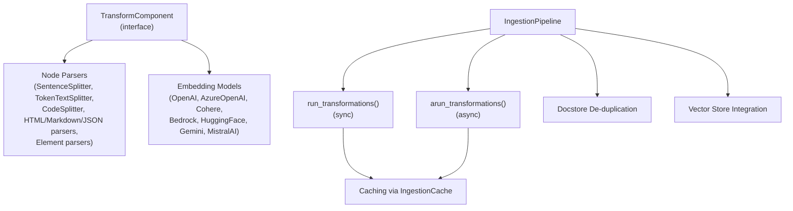
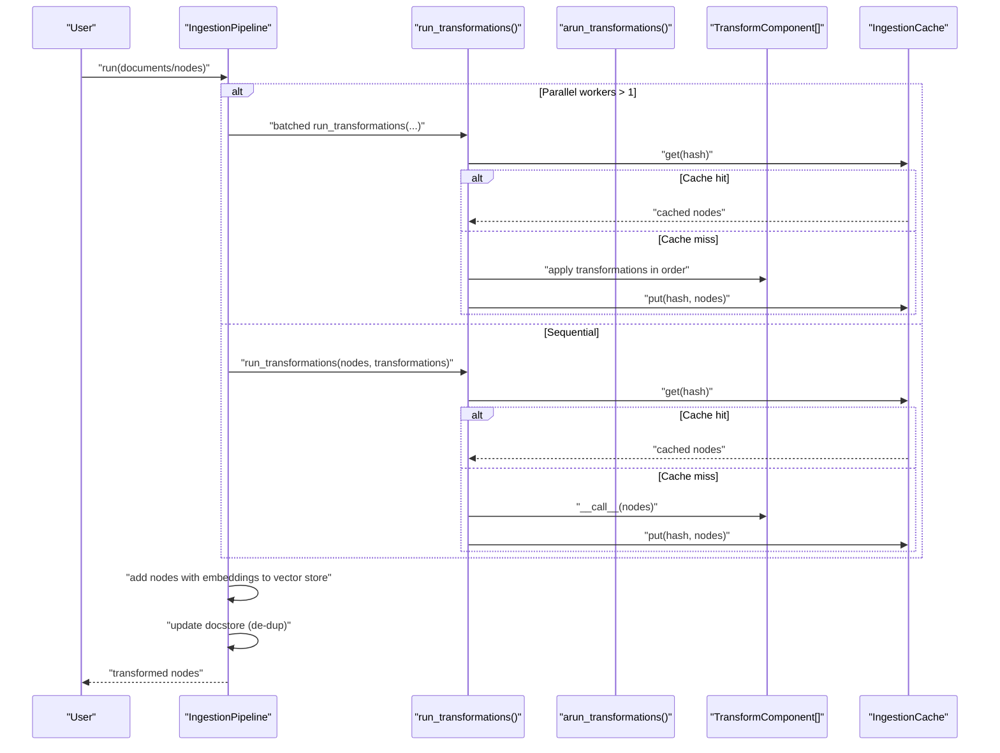
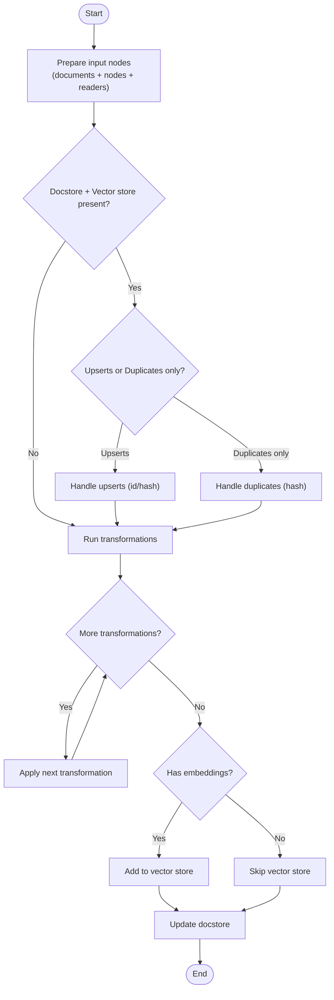
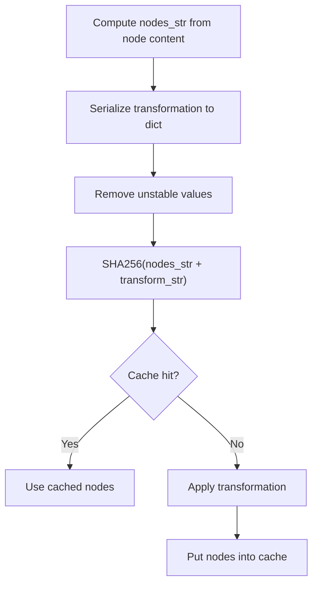
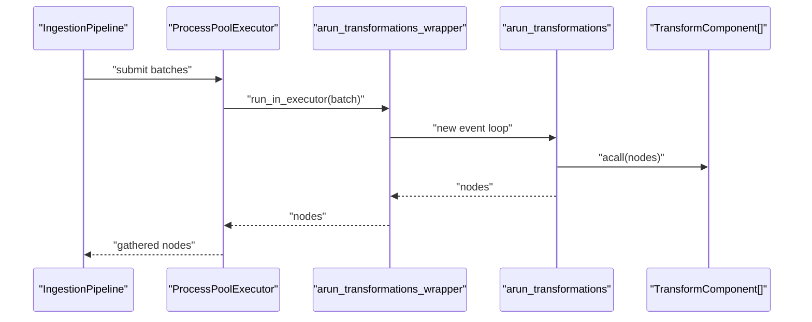
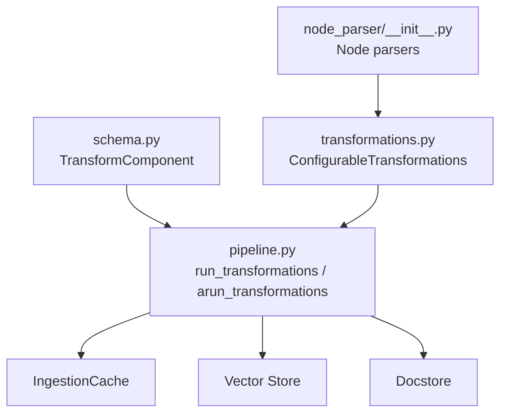

# Transformations and Pipelines

<cite>
**Referenced Files in This Document**
- [transformations.py](file://llama-index-core/llama_index/core/ingestion/transformations.py)
- [pipeline.py](file://llama-index-core/llama_index/core/ingestion/pipeline.py)
- [schema.py](file://llama-index-core/llama_index/core/schema.py)
- [node_parser/__init__.py](file://llama-index-core/llama_index/core/node_parser/__init__.py)
- [test_transformations.py](file://llama-index-core/tests/ingestion/test_transformations.py)
- [transformations.md](file://docs/src/content/docs/framework/module_guides/loading/ingestion_pipeline/transformations.md)
</cite>

## Table of Contents
1. [Introduction](#introduction)
2. [Project Structure](#project-structure)
3. [Core Components](#core-components)
4. [Architecture Overview](#architecture-overview)
5. [Detailed Component Analysis](#detailed-component-analysis)
6. [Dependency Analysis](#dependency-analysis)
7. [Performance Considerations](#performance-considerations)
8. [Troubleshooting Guide](#troubleshooting-guide)
9. [Conclusion](#conclusion)
10. [Appendices](#appendices)

## Introduction
This document explains LlamaIndex’s transformation system and pipeline architecture. It covers the TransformComponent interface, how transformations are chained, how nodes are modified across the pipeline, and how to configure, tune, and optimize transformations. It also documents built-in transformations (node parsing and embedding), caching, batch processing, and memory management for large-scale ingestion.

## Project Structure
The transformation system centers around three key areas:
- TransformComponent interface and base types
- Built-in transformation components (node parsers and embeddings)
- Pipeline orchestration that applies transformations in order, supports caching, batching, and async execution

**Diagram sources**
- [schema.py](file://llama-index-core/llama_index/core/schema.py#L190-L204)
- [transformations.py](file://llama-index-core/llama_index/core/ingestion/transformations.py#L118-L342)
- [pipeline.py](file://llama-index-core/llama_index/core/ingestion/pipeline.py#L71-L171)
- [node_parser/__init__.py](file://llama-index-core/llama_index/core/node_parser/__init__.py#L1-L73)

**Section sources**
- [transformations.py](file://llama-index-core/llama_index/core/ingestion/transformations.py#L1-L379)
- [pipeline.py](file://llama-index-core/llama_index/core/ingestion/pipeline.py#L1-L779)
- [schema.py](file://llama-index-core/llama_index/core/schema.py#L190-L204)
- [node_parser/__init__.py](file://llama-index-core/llama_index/core/node_parser/__init__.py#L1-L73)

## Core Components
- TransformComponent: Base interface for all transformations. Supports both sync and async execution.
- Node parsers: Convert Documents into BaseNode sequences (chunking, splitting, element extraction).
- Embedding models: Add vector embeddings to nodes.
- IngestionPipeline: Orchestrates reading, transforming, de-duplicating, and storing nodes.

Key capabilities:
- Transformation chaining: transformations are applied sequentially to the same node list.
- Async support: each transformation exposes an async acall method.
- Caching: transformation outputs can be cached keyed by node content and component config.
- Batch processing: optional multiprocessing to split node sets into batches.
- De-duplication: optional docstore-based strategies to avoid reprocessing identical content.

**Section sources**
- [schema.py](file://llama-index-core/llama_index/core/schema.py#L190-L204)
- [transformations.py](file://llama-index-core/llama_index/core/ingestion/transformations.py#L118-L342)
- [pipeline.py](file://llama-index-core/llama_index/core/ingestion/pipeline.py#L71-L171)
- [node_parser/__init__.py](file://llama-index-core/llama_index/core/node_parser/__init__.py#L1-L73)

## Architecture Overview
The pipeline applies transformations in order, optionally caching results and supporting parallel execution. It integrates with a docstore for de-duplication and a vector store for embedding persistence.

**Diagram sources**
- [pipeline.py](file://llama-index-core/llama_index/core/ingestion/pipeline.py#L71-L171)
- [pipeline.py](file://llama-index-core/llama_index/core/ingestion/pipeline.py#L467-L575)
- [pipeline.py](file://llama-index-core/llama_index/core/ingestion/pipeline.py#L656-L778)

## Detailed Component Analysis

### TransformComponent Interface
- Purpose: Defines the contract for all transformations.
- Methods:
  - __call__: Synchronous transformation of a sequence of nodes.
  - acall: Asynchronous transformation of a sequence of nodes.
- Behavior: Both methods accept arbitrary kwargs and return a sequence of nodes.

Implementation notes:
- The async acall defaults to delegating to __call__, enabling easy async usage when the underlying operation is not truly async.

**Section sources**
- [schema.py](file://llama-index-core/llama_index/core/schema.py#L190-L204)

### Built-in Transformations: Node Parsers
The system enumerates supported transformation types and their categories. Node parsers convert Documents into BaseNode sequences.

Supported node parser types include:
- CodeSplitter
- SentenceSplitter
- TokenTextSplitter
- HTMLNodeParser
- MarkdownNodeParser
- JSONNodeParser
- SimpleFileNodeParser
- MarkdownElementNodeParser

These are registered under the NODE_PARSER category and can be used directly or configured via the transformation registry.

**Section sources**
- [transformations.py](file://llama-index-core/llama_index/core/ingestion/transformations.py#L118-L213)
- [node_parser/__init__.py](file://llama-index-core/llama_index/core/node_parser/__init__.py#L1-L73)

### Built-in Transformations: Embedding Models
Embedding transformations add vector embeddings to nodes. The system conditionally registers embedding providers if their dependencies are available.

Registered embedding providers include:
- OpenAIEmbedding
- AzureOpenAIEmbedding
- CohereEmbedding
- BedrockEmbedding
- HuggingFaceInferenceAPIEmbedding
- GeminiEmbedding
- MistralAIEmbedding

These are registered under the EMBEDDING category and can be chained after node parsers.

**Section sources**
- [transformations.py](file://llama-index-core/llama_index/core/ingestion/transformations.py#L214-L339)

### Transformation Chaining and Node Modification
- Order matters: transformations are applied in the order provided.
- In-place vs copy: run_transformations respects an in_place flag; when false, it copies nodes before applying transformations.
- Node mutation: transformations can mutate node content, metadata, relationships, and embeddings.

**Diagram sources**
- [pipeline.py](file://llama-index-core/llama_index/core/ingestion/pipeline.py#L467-L575)

**Section sources**
- [pipeline.py](file://llama-index-core/llama_index/core/ingestion/pipeline.py#L71-L171)
- [pipeline.py](file://llama-index-core/llama_index/core/ingestion/pipeline.py#L467-L575)

### Caching and Hashing
- Hash computation: A stable hash is derived from the concatenated node content and the serialized transformation component.
- Cache lookup: Before applying a transformation, the pipeline checks the cache for previously computed results.
- Cache put: After applying a transformation, results are stored under the computed hash.

**Diagram sources**
- [pipeline.py](file://llama-index-core/llama_index/core/ingestion/pipeline.py#L57-L68)
- [pipeline.py](file://llama-index-core/llama_index/core/ingestion/pipeline.py#L93-L104)

**Section sources**
- [pipeline.py](file://llama-index-core/llama_index/core/ingestion/pipeline.py#L57-L68)
- [pipeline.py](file://llama-index-core/llama_index/core/ingestion/pipeline.py#L93-L104)

### Async Transformations and Parallel Execution
- Async pipeline: arun_transformations applies transformations asynchronously and supports caching.
- Parallel workers: IngestionPipeline can spawn multiple processes to process node batches concurrently.
- Event loop wrapper: arun_transformations_wrapper creates a new event loop for async execution inside process pools.

**Diagram sources**
- [pipeline.py](file://llama-index-core/llama_index/core/ingestion/pipeline.py#L146-L170)
- [pipeline.py](file://llama-index-core/llama_index/core/ingestion/pipeline.py#L735-L755)

**Section sources**
- [pipeline.py](file://llama-index-core/llama_index/core/ingestion/pipeline.py#L108-L143)
- [pipeline.py](file://llama-index-core/llama_index/core/ingestion/pipeline.py#L146-L170)
- [pipeline.py](file://llama-index-core/llama_index/core/ingestion/pipeline.py#L735-L755)

### De-duplication Strategies
IngestionPipeline supports strategies to avoid reprocessing identical content:
- Upserts: Compare by id/hash; replace changed documents and delete old entries from vector store if needed.
- Duplicates only: Add only nodes whose hash differs from existing ones.
- Upserts and delete: Also remove references to documents no longer present.

These strategies integrate with a persistent docstore and optional vector store.

**Section sources**
- [pipeline.py](file://llama-index-core/llama_index/core/ingestion/pipeline.py#L173-L191)
- [pipeline.py](file://llama-index-core/llama_index/core/ingestion/pipeline.py#L382-L438)
- [pipeline.py](file://llama-index-core/llama_index/core/ingestion/pipeline.py#L595-L653)

### Transformation Configuration and Parameter Tuning
- ConfigurableTransformations enum: Dynamically builds a registry of supported transformation types and their component classes.
- ConfiguredTransformation: Wraps a component instance with metadata and ensures type safety when building configured transformations from components.
- Tests validate that schemas can be generated for transformation components and that configured transformations are built correctly.

Practical tips:
- Choose node parsers based on content type (e.g., MarkdownNodeParser for Markdown).
- Tune chunk size and overlap in sentence/token splitters for downstream retrieval quality.
- Select embedding models aligned with your vector database and latency budget.

**Section sources**
- [transformations.py](file://llama-index-core/llama_index/core/ingestion/transformations.py#L118-L342)
- [transformations.py](file://llama-index-core/llama_index/core/ingestion/transformations.py#L347-L379)
- [test_transformations.py](file://llama-index-core/tests/ingestion/test_transformations.py#L1-L69)

### Building Custom Transformations
To implement a custom transformation:
- Implement TransformComponent by subclassing and defining __call__ (and optionally acall).
- Ensure the component serializes properly (inherits from BaseComponent).
- Integrate into a pipeline by passing an instance in the transformations list.

Usage patterns:
- Use directly with run_transformations or arun_transformations.
- Use within IngestionPipeline for end-to-end ingestion.

**Section sources**
- [schema.py](file://llama-index-core/llama_index/core/schema.py#L190-L204)
- [transformations.md](file://docs/src/content/docs/framework/module_guides/loading/ingestion_pipeline/transformations.md#L1-L98)

## Dependency Analysis
The transformation system exhibits clear separation of concerns:
- TransformComponent defines the interface.
- Node parsers and embeddings are registered as transformation types.
- Pipeline orchestrates execution, caching, batching, and persistence.

**Diagram sources**
- [schema.py](file://llama-index-core/llama_index/core/schema.py#L190-L204)
- [transformations.py](file://llama-index-core/llama_index/core/ingestion/transformations.py#L118-L342)
- [pipeline.py](file://llama-index-core/llama_index/core/ingestion/pipeline.py#L71-L171)

**Section sources**
- [schema.py](file://llama-index-core/llama_index/core/schema.py#L190-L204)
- [transformations.py](file://llama-index-core/llama_index/core/ingestion/transformations.py#L118-L342)
- [pipeline.py](file://llama-index-core/llama_index/core/ingestion/pipeline.py#L71-L171)

## Performance Considerations
- Caching: Enable caching to avoid recomputation of identical transformations on the same node set.
- Chunk size and overlap: Tune node parser parameters to balance recall and retrieval speed.
- Parallel workers: Use multiple workers for CPU-bound transformations; ensure num_workers does not exceed CPU count.
- Async execution: Prefer arun_transformations for IO-bound steps (e.g., embedding APIs).
- Memory management: Process nodes in batches; avoid loading entire datasets into memory at once.
- Vector store writes: Only nodes with embeddings are added to the vector store; filter accordingly.

[No sources needed since this section provides general guidance]

## Troubleshooting Guide
Common issues and remedies:
- Unexpected node mutations: Verify in_place behavior and whether transformations copy nodes before mutating.
- Slow embeddings: Switch to async embedding calls and enable caching; consider batching.
- Duplicate processing: Configure docstore strategy appropriately; ensure persistent docstore across runs.
- Schema errors: Ensure components serialize/deserialize correctly; use BaseComponent-derived classes.
- Worker limits: If num_workers exceeds CPU count, the pipeline adjusts automatically and warns.

**Section sources**
- [pipeline.py](file://llama-index-core/llama_index/core/ingestion/pipeline.py#L530-L537)
- [pipeline.py](file://llama-index-core/llama_index/core/ingestion/pipeline.py#L539-L553)
- [pipeline.py](file://llama-index-core/llama_index/core/ingestion/pipeline.py#L570-L571)

## Conclusion
LlamaIndex’s transformation system provides a flexible, composable framework for data ingestion. By chaining node parsers and embeddings, leveraging caching and async execution, and integrating with docstore and vector stores, you can build efficient and scalable ingestion pipelines suited to large-scale scenarios.

[No sources needed since this section summarizes without analyzing specific files]

## Appendices

### Appendix A: Built-in Transformations Reference
- Node parsers: CodeSplitter, SentenceSplitter, TokenTextSplitter, HTMLNodeParser, MarkdownNodeParser, JSONNodeParser, SimpleFileNodeParser, MarkdownElementNodeParser.
- Embedding models: OpenAIEmbedding, AzureOpenAIEmbedding, CohereEmbedding, BedrockEmbedding, HuggingFaceInferenceAPIEmbedding, GeminiEmbedding, MistralAIEmbedding.

**Section sources**
- [transformations.py](file://llama-index-core/llama_index/core/ingestion/transformations.py#L118-L339)
- [node_parser/__init__.py](file://llama-index-core/llama_index/core/node_parser/__init__.py#L1-L73)

### Appendix B: Example Usage Patterns
- Direct usage of transformations with run_transformations/arun_transformations.
- Using transformations within IngestionPipeline with caching, batching, and de-duplication.

**Section sources**
- [transformations.md](file://docs/src/content/docs/framework/module_guides/loading/ingestion_pipeline/transformations.md#L1-L98)
- [pipeline.py](file://llama-index-core/llama_index/core/ingestion/pipeline.py#L225-L240)