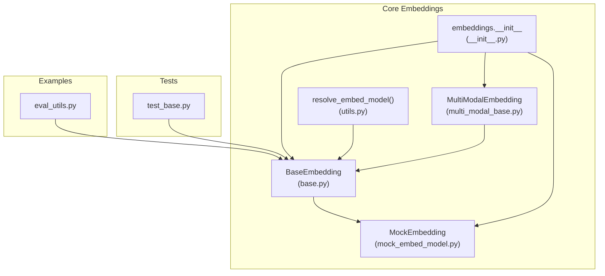
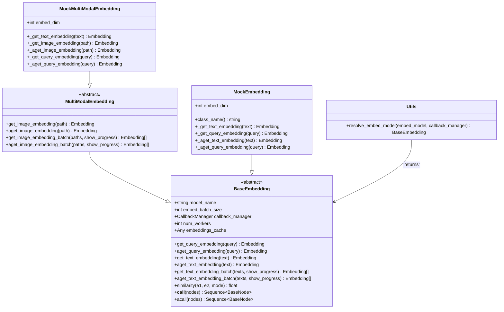
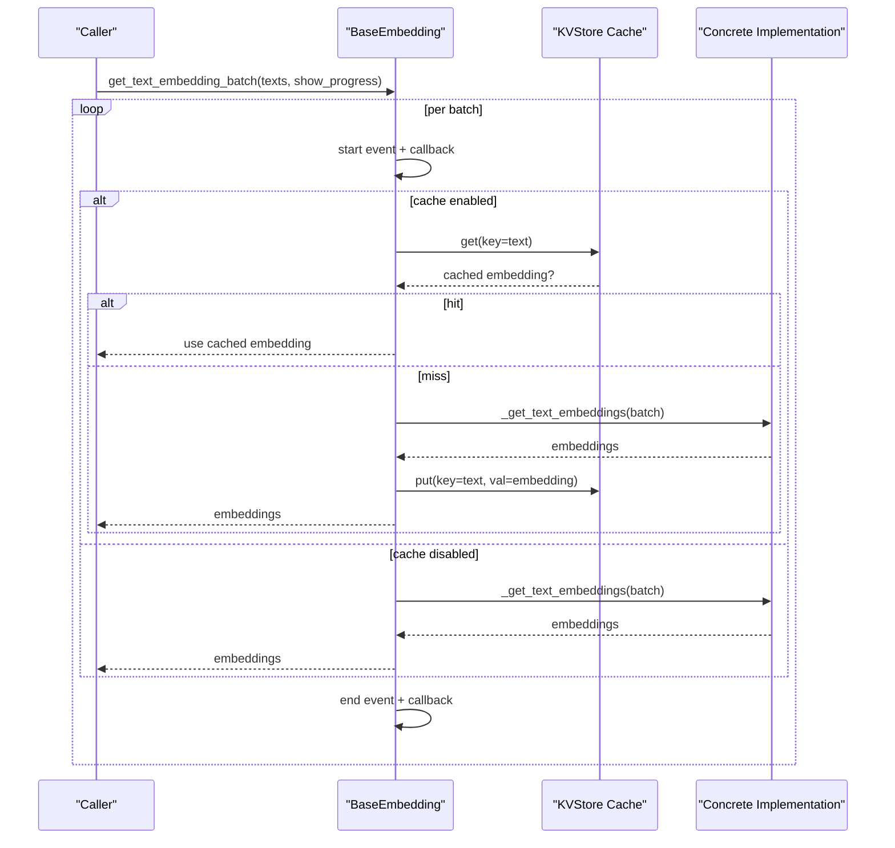
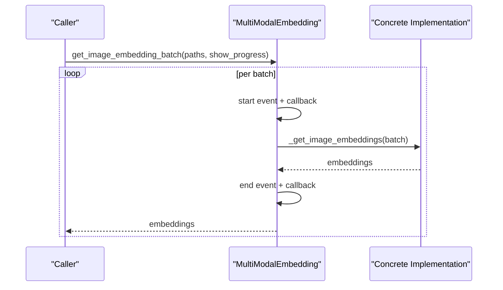
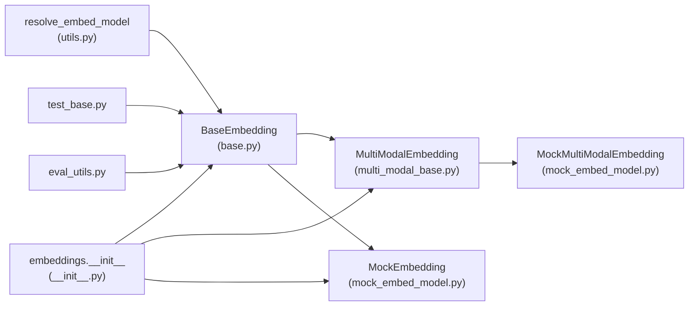

# Custom Embedding Development

<cite>
**Referenced Files in This Document**
- [base.py](file://llama-index-core/llama_index/core/base/embeddings/base.py)
- [multi_modal_base.py](file://llama-index-core/llama_index/core/embeddings/multi_modal_base.py)
- [mock_embed_model.py](file://llama-index-core/llama_index/core/embeddings/mock_embed_model.py)
- [utils.py](file://llama-index-core/llama_index/core/embeddings/utils.py)
- [__init__.py](file://llama-index-core/llama_index/core/embeddings/__init__.py)
- [test_base.py](file://llama-index-core/tests/embeddings/test_base.py)
- [eval_utils.py](file://docs/examples/finetuning/embeddings/eval_utils.py)
</cite>

## Table of Contents
1. [Introduction](#introduction)
2. [Project Structure](#project-structure)
3. [Core Components](#core-components)
4. [Architecture Overview](#architecture-overview)
5. [Detailed Component Analysis](#detailed-component-analysis)
6. [Dependency Analysis](#dependency-analysis)
7. [Performance Considerations](#performance-considerations)
8. [Troubleshooting Guide](#troubleshooting-guide)
9. [Conclusion](#conclusion)
10. [Appendices](#appendices)

## Introduction
This document explains how to develop custom embedding models in the LlamaIndex ecosystem. It covers the embedding interface requirements, implementation patterns, and testing strategies. You will learn how to build synchronous and asynchronous embedding classes, handle different input formats (text, images), implement batch processing, integrate with external services, and validate performance and correctness. Practical examples and diagrams illustrate the recommended development workflow.

## Project Structure
The embedding subsystem centers around a base class that defines the contract for all embeddings, optional multi-modal extensions, utilities for resolving and mocking embeddings, and tests that validate behavior.

**Diagram sources**
- [base.py](file://llama-index-core/llama_index/core/base/embeddings/base.py#L72-L619)
- [multi_modal_base.py](file://llama-index-core/llama_index/core/embeddings/multi_modal_base.py#L16-L187)
- [mock_embed_model.py](file://llama-index-core/llama_index/core/embeddings/mock_embed_model.py#L10-L84)
- [utils.py](file://llama-index-core/llama_index/core/embeddings/utils.py#L31-L141)
- [__init__.py](file://llama-index-core/llama_index/core/embeddings/__init__.py#L1-L16)
- [test_base.py](file://llama-index-core/tests/embeddings/test_base.py#L1-L103)
- [eval_utils.py](file://docs/examples/finetuning/embeddings/eval_utils.py#L1-L67)

**Section sources**
- [base.py](file://llama-index-core/llama_index/core/base/embeddings/base.py#L1-L619)
- [multi_modal_base.py](file://llama-index-core/llama_index/core/embeddings/multi_modal_base.py#L1-L187)
- [mock_embed_model.py](file://llama-index-core/llama_index/core/embeddings/mock_embed_model.py#L1-L84)
- [utils.py](file://llama-index-core/llama_index/core/embeddings/utils.py#L1-L141)
- [__init__.py](file://llama-index-core/llama_index/core/embeddings/__init__.py#L1-L16)

## Core Components
- BaseEmbedding: Defines the core embedding interface, synchronous and asynchronous methods, batch processing, caching, and similarity computation.
- MultiModalEmbedding: Extends BaseEmbedding to support image embeddings alongside text.
- MockEmbedding and MockMultiModalEmbedding: Utility classes for deterministic testing and local evaluation.
- resolve_embed_model: Factory-style resolver that constructs real or mock embeddings from strings or objects.
- Tests and Example Utilities: Validate behavior and demonstrate end-to-end evaluation.

Key responsibilities:
- Implement synchronous and asynchronous embedding methods for text and optionally images.
- Support batch processing with configurable batch sizes and progress reporting.
- Optionally integrate a cache via a KVStore-compatible interface.
- Provide similarity computation modes (cosine, dot product, Euclidean).
- Enable aggregation of multiple embeddings (e.g., mean).

**Section sources**
- [base.py](file://llama-index-core/llama_index/core/base/embeddings/base.py#L72-L619)
- [multi_modal_base.py](file://llama-index-core/llama_index/core/embeddings/multi_modal_base.py#L16-L187)
- [mock_embed_model.py](file://llama-index-core/llama_index/core/embeddings/mock_embed_model.py#L10-L84)
- [utils.py](file://llama-index-core/llama_index/core/embeddings/utils.py#L31-L141)

## Architecture Overview
The embedding architecture separates concerns between the base interface, multi-modal extension, and utilities. The resolver simplifies constructing embeddings from configuration strings or objects. Tests and example utilities validate correctness and performance.

**Diagram sources**
- [base.py](file://llama-index-core/llama_index/core/base/embeddings/base.py#L72-L619)
- [multi_modal_base.py](file://llama-index-core/llama_index/core/embeddings/multi_modal_base.py#L16-L187)
- [mock_embed_model.py](file://llama-index-core/llama_index/core/embeddings/mock_embed_model.py#L10-L84)
- [utils.py](file://llama-index-core/llama_index/core/embeddings/utils.py#L31-L141)

## Detailed Component Analysis

### BaseEmbedding: Embedding Interface and Batch Processing
BaseEmbedding defines the canonical embedding interface:
- Synchronous and asynchronous methods for queries, text, and batch text.
- Optional image embedding support via MultiModalEmbedding.
- Caching integration via a KVStore-compatible cache.
- Progress reporting and callback/event instrumentation.
- Aggregation helpers and similarity computation.

Implementation patterns:
- Override private methods (_get_text_embedding, _aget_text_embedding, etc.) to implement your logic.
- Respect embed_batch_size for throughput tuning.
- Use callback_manager and dispatcher spans for observability.
- Optionally implement _get_text_embeddings and _aget_text_embeddings for efficient batch paths.

Batch processing flow:
- Split inputs into batches up to embed_batch_size.
- For each batch, dispatch start/end events and collect embeddings.
- Flatten results and return.

**Diagram sources**
- [base.py](file://llama-index-core/llama_index/core/base/embeddings/base.py#L445-L494)
- [base.py](file://llama-index-core/llama_index/core/base/embeddings/base.py#L496-L585)

**Section sources**
- [base.py](file://llama-index-core/llama_index/core/base/embeddings/base.py#L72-L619)

### MultiModalEmbedding: Image Embeddings
MultiModalEmbedding extends BaseEmbedding to support image inputs:
- Synchronous and asynchronous image embedding methods.
- Batch image embedding with progress reporting.
- Delegates to concrete implementations for image-specific logic.

Implementation pattern:
- Implement _get_image_embedding and _aget_image_embedding.
- Optionally implement batch image methods for efficiency.

**Diagram sources**
- [multi_modal_base.py](file://llama-index-core/llama_index/core/embeddings/multi_modal_base.py#L95-L129)
- [multi_modal_base.py](file://llama-index-core/llama_index/core/embeddings/multi_modal_base.py#L131-L186)

**Section sources**
- [multi_modal_base.py](file://llama-index-core/llama_index/core/embeddings/multi_modal_base.py#L16-L187)

### MockEmbedding and MockMultiModalEmbedding: Testing Utilities
MockEmbedding and MockMultiModalEmbedding provide deterministic embeddings for testing and local runs:
- Fixed-dimensional vectors for reproducible tests.
- Implement both text and image embedding methods.
- Useful for validating workflows without external dependencies.

Usage:
- Construct with a specific embed_dim.
- Use in unit tests to stub out real embeddings.

**Section sources**
- [mock_embed_model.py](file://llama-index-core/llama_index/core/embeddings/mock_embed_model.py#L10-L84)

### resolve_embed_model: Factory and Resolution
resolve_embed_model converts configuration strings or objects into a concrete BaseEmbedding:
- "default": Returns a MockEmbedding in testing contexts; otherwise attempts OpenAI embedding with validation.
- "clip:<model>": Constructs a CLIP-based embedding.
- "local:<model>": Constructs a local HuggingFace embedding with a cached model folder.
- LangChain Embeddings adapter: Wraps LangChain embeddings via a compatibility layer.
- None: Falls back to a minimal MockEmbedding.

Validation and error handling:
- Raises import errors if required packages are missing.
- Validates API keys for cloud providers.
- Provides actionable messages and fallback suggestions.

**Section sources**
- [utils.py](file://llama-index-core/llama_index/core/embeddings/utils.py#L31-L141)
- [__init__.py](file://llama-index-core/llama_index/core/embeddings/__init__.py#L1-L16)

### Testing Strategies and Validation Procedures
Recommended testing approaches:
- Unit tests for batch behavior and caching:
  - Verify batch boundaries and ordering.
  - Confirm cache hits and misses.
- Similarity and aggregation tests:
  - Validate similarity modes and aggregation functions.
- Integration tests with VectorStoreIndex:
  - Build an index with a custom embedding and run retriever evaluations.
- Example evaluation utility:
  - Use eval_utils to compute hit rate and mean reciprocal rank.

Example references:
- Batch and similarity tests: [test_base.py](file://llama-index-core/tests/embeddings/test_base.py#L42-L103)
- Evaluation pipeline: [eval_utils.py](file://docs/examples/finetuning/embeddings/eval_utils.py#L8-L67)

**Section sources**
- [test_base.py](file://llama-index-core/tests/embeddings/test_base.py#L1-L103)
- [eval_utils.py](file://docs/examples/finetuning/embeddings/eval_utils.py#L1-L67)

## Dependency Analysis
Relationships among core embedding components:

**Diagram sources**
- [base.py](file://llama-index-core/llama_index/core/base/embeddings/base.py#L72-L619)
- [multi_modal_base.py](file://llama-index-core/llama_index/core/embeddings/multi_modal_base.py#L16-L187)
- [mock_embed_model.py](file://llama-index-core/llama_index/core/embeddings/mock_embed_model.py#L10-L84)
- [utils.py](file://llama-index-core/llama_index/core/embeddings/utils.py#L31-L141)
- [__init__.py](file://llama-index-core/llama_index/core/embeddings/__init__.py#L1-L16)
- [test_base.py](file://llama-index-core/tests/embeddings/test_base.py#L1-L103)
- [eval_utils.py](file://docs/examples/finetuning/embeddings/eval_utils.py#L1-L67)

**Section sources**
- [base.py](file://llama-index-core/llama_index/core/base/embeddings/base.py#L1-L619)
- [multi_modal_base.py](file://llama-index-core/llama_index/core/embeddings/multi_modal_base.py#L1-L187)
- [mock_embed_model.py](file://llama-index-core/llama_index/core/embeddings/mock_embed_model.py#L1-L84)
- [utils.py](file://llama-index-core/llama_index/core/embeddings/utils.py#L1-L141)
- [__init__.py](file://llama-index-core/llama_index/core/embeddings/__init__.py#L1-L16)

## Performance Considerations
- Batch sizing:
  - Tune embed_batch_size to balance throughput and latency.
  - Larger batches reduce overhead but increase memory usage.
- Concurrency:
  - Use num_workers > 1 for async batch processing to overlap I/O.
- Caching:
  - Enable embeddings_cache to avoid recomputation for repeated inputs.
  - Ensure cache backend supports async operations if using async APIs.
- Progress reporting:
  - show_progress improves UX during long-running jobs.
- Similarity computation:
  - Prefer vectorized operations; BaseEmbedding’s similarity supports multiple modes.

[No sources needed since this section provides general guidance]

## Troubleshooting Guide
Common issues and resolutions:
- Missing external packages:
  - resolve_embed_model raises import errors when required integrations are absent. Install the appropriate package and retry.
- Invalid configuration strings:
  - "local:" prefix required for local HuggingFace embeddings; "clip:" prefix for CLIP models.
- API key validation failures:
  - For cloud providers, ensure credentials are set and validated before use.
- Async vs sync:
  - If your implementation lacks async support, rely on default async fallbacks or implement _aget_* methods.
- Caching misconfiguration:
  - embeddings_cache must be a KVStore-compatible object; otherwise, a type error is raised.

**Section sources**
- [utils.py](file://llama-index-core/llama_index/core/embeddings/utils.py#L31-L141)
- [base.py](file://llama-index-core/llama_index/core/base/embeddings/base.py#L100-L110)

## Conclusion
By extending BaseEmbedding (and optionally MultiModalEmbedding), you can implement custom embeddings that integrate seamlessly with LlamaIndex workflows. Use resolve_embed_model for flexible instantiation, leverage caching and batching for performance, and validate behavior with unit tests and evaluation utilities. The provided patterns and diagrams offer a clear path to building robust, production-ready embedding solutions.

[No sources needed since this section summarizes without analyzing specific files]

## Appendices

### Step-by-Step: Developing a Custom Text Embedding Class
- Define a class inheriting from BaseEmbedding.
- Implement:
  - _get_text_embedding for synchronous embedding.
  - _aget_text_embedding for asynchronous embedding (optional).
  - _get_text_embeddings for batch optimization (optional).
- Configure:
  - embed_batch_size to control throughput.
  - num_workers for async concurrency.
  - embeddings_cache for deduplication and reuse.
- Test:
  - Validate batch boundaries and ordering.
  - Confirm cache behavior and async paths.
  - Evaluate similarity and aggregation.

References:
- [base.py](file://llama-index-core/llama_index/core/base/embeddings/base.py#L112-L282)
- [test_base.py](file://llama-index-core/tests/embeddings/test_base.py#L42-L66)

### Step-by-Step: Developing a Custom Multi-Modal Embedding Class
- Define a class inheriting from MultiModalEmbedding.
- Implement:
  - _get_text_embedding and _get_image_embedding.
  - _aget_text_embedding and _aget_image_embedding.
  - Optional batch methods for efficiency.
- Integrate:
  - Use resolve_embed_model with "clip:<model>" for CLIP-based models.
  - Wrap LangChain embeddings via the LangChain adapter if needed.

References:
- [multi_modal_base.py](file://llama-index-core/llama_index/core/embeddings/multi_modal_base.py#L19-L93)
- [utils.py](file://llama-index-core/llama_index/core/embeddings/utils.py#L78-L92)

### Integration Patterns
- External services:
  - Implement HTTP clients in _get_* methods; handle retries and timeouts.
  - Use async I/O in _aget_* methods for improved throughput.
- Model hosting platforms:
  - Follow provider SDKs to construct clients and parse responses.
  - Normalize outputs to the Embedding type (List[float]).
- Vector stores:
  - Use resolved embeddings with VectorStoreIndex and retrievers for evaluation.

References:
- [utils.py](file://llama-index-core/llama_index/core/embeddings/utils.py#L31-L141)
- [eval_utils.py](file://docs/examples/finetuning/embeddings/eval_utils.py#L8-L48)

### Error Handling and Debugging Techniques
- Instrumentation:
  - Leverage callback_manager and dispatcher spans for tracing.
- Logging and events:
  - Inspect CBEventType.EMBEDDING payloads for inputs and outputs.
- Deterministic testing:
  - Use MockEmbedding to reproduce scenarios and isolate issues.

References:
- [base.py](file://llama-index-core/llama_index/core/base/embeddings/base.py#L130-L223)
- [mock_embed_model.py](file://llama-index-core/llama_index/core/embeddings/mock_embed_model.py#L10-L46)