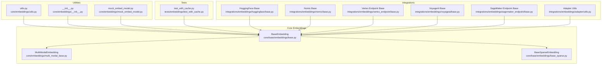
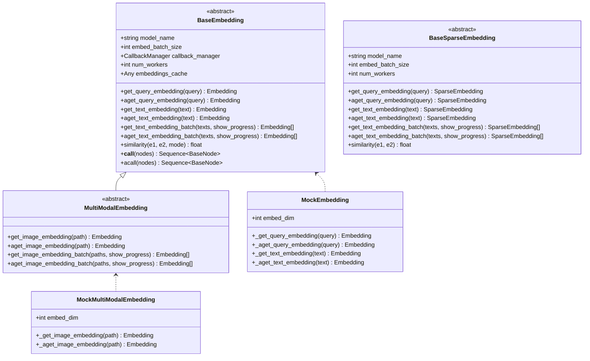
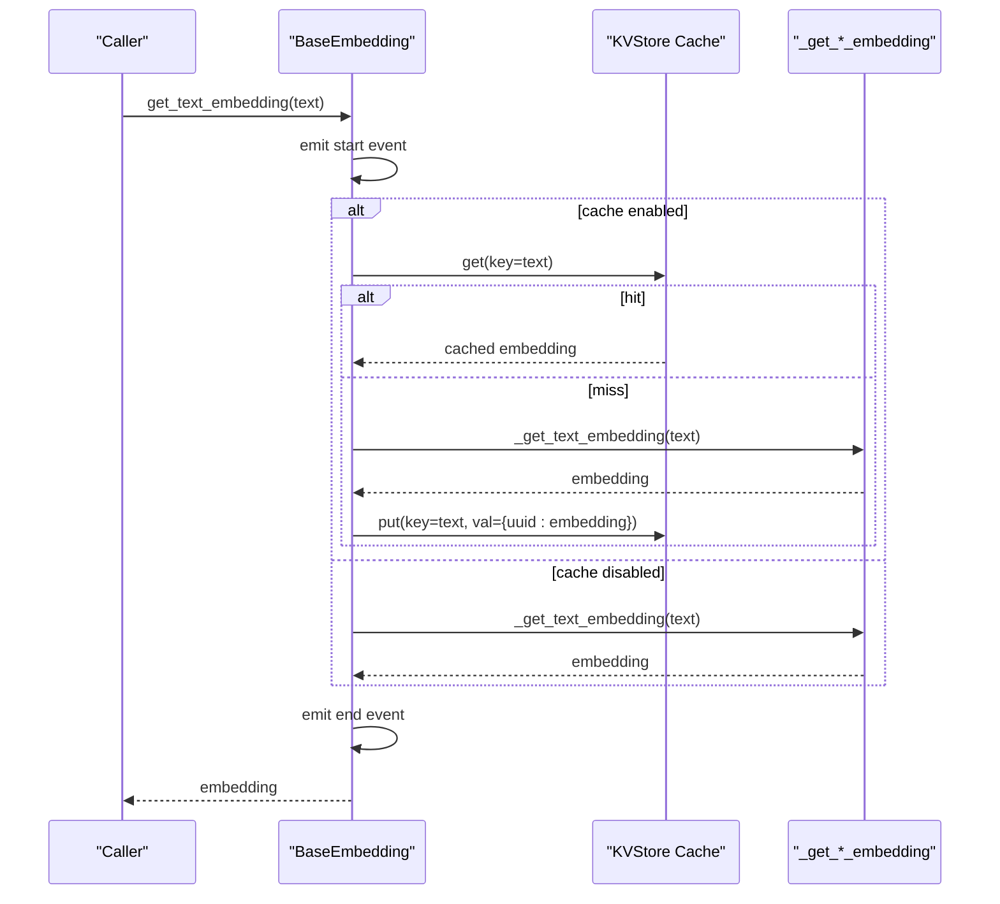
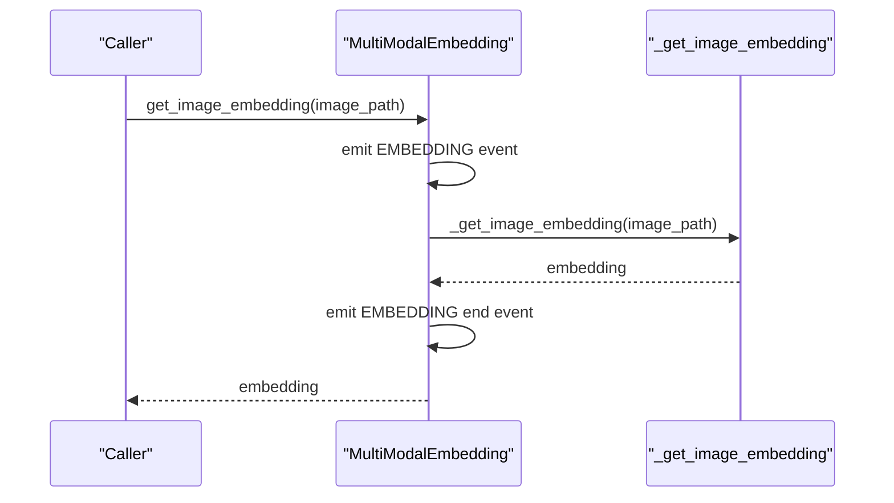
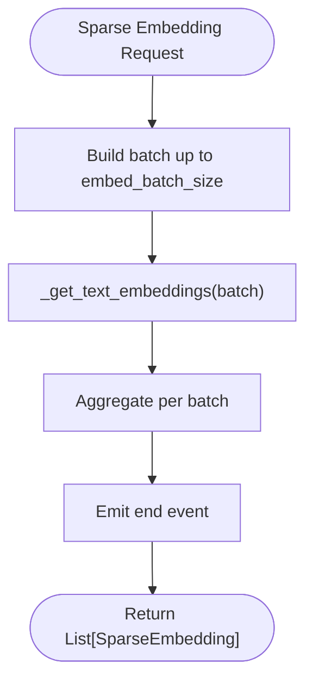
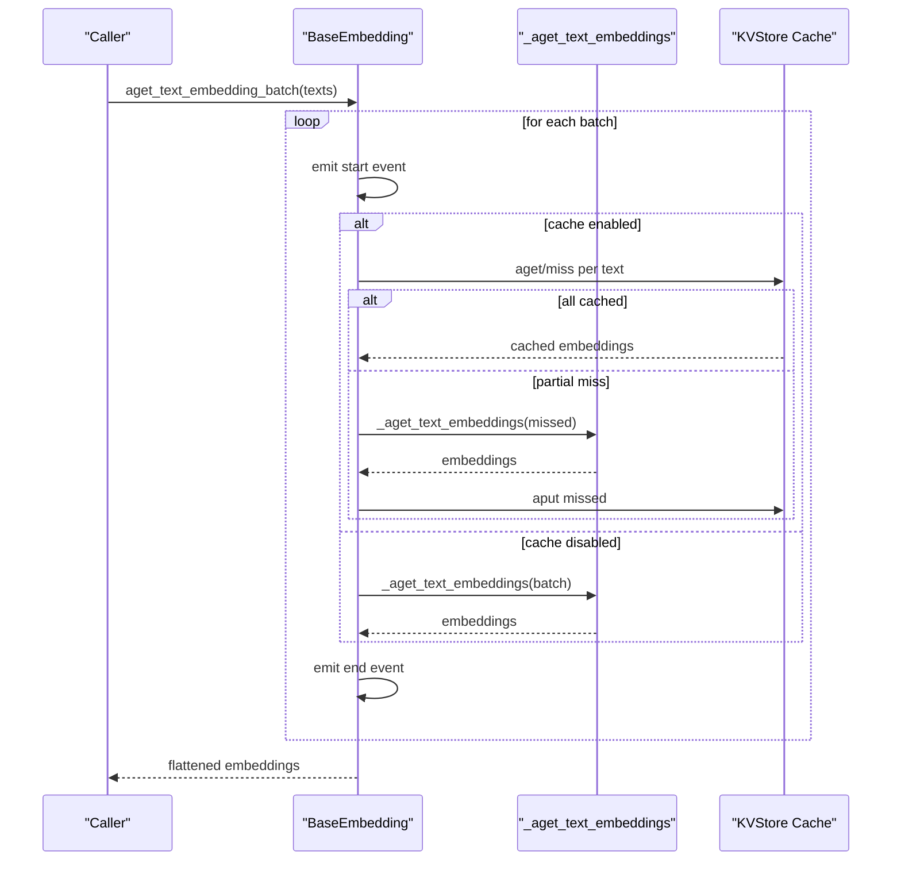
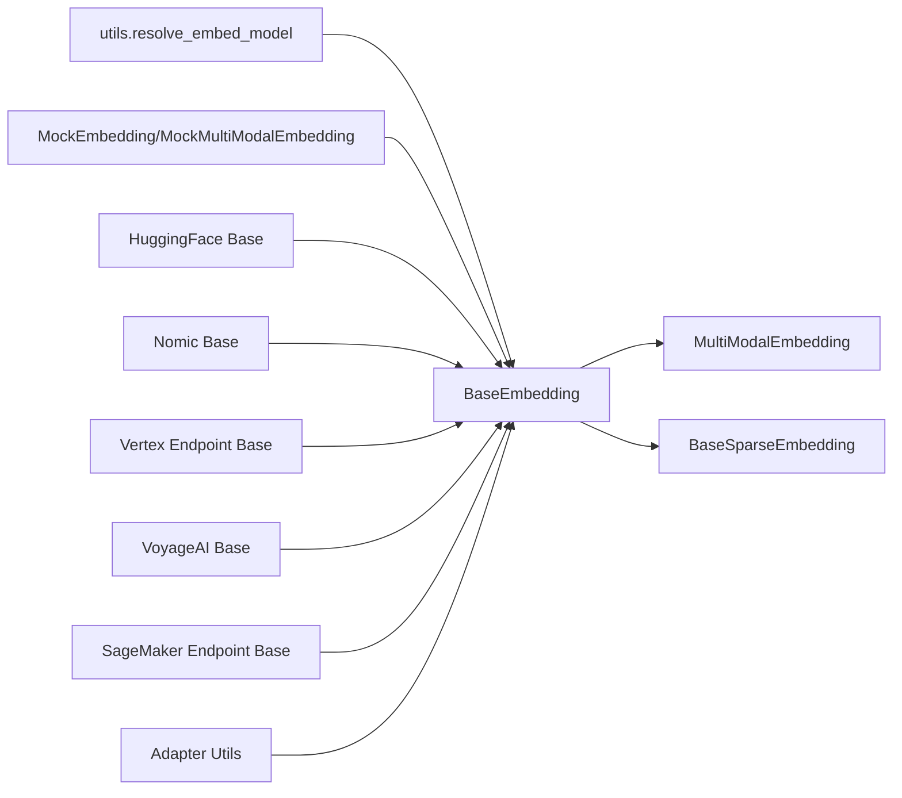

# Embedding Base Abstraction

<cite>
**Referenced Files in This Document**
- [base.py](file://llama-index-core/llama_index/core/base/embeddings/base.py)
- [base_sparse.py](file://llama-index-core/llama_index/core/base/embeddings/base_sparse.py)
- [multi_modal_base.py](file://llama-index-core/llama_index/core/embeddings/multi_modal_base.py)
- [mock_embed_model.py](file://llama-index-core/llama_index/core/embeddings/mock_embed_model.py)
- [utils.py](file://llama-index-core/llama_index/core/embeddings/utils.py)
- [__init__.py](file://llama-index-core/llama_index/core/embeddings/__init__.py)
- [test_with_cache.py](file://llama-index-core/tests/embeddings/test_with_cache.py)
- [base.py](file://llama-index-integrations/embeddings/llama-index-embeddings-huggingface/llama_index/embeddings/huggingface/base.py)
- [base.py](file://llama-index-integrations/embeddings/llama-index-embeddings-nomic/llama_index/embeddings/nomic/base.py)
- [base.py](file://llama-index-integrations/embeddings/llama-index-embeddings-vertex-endpoint/llama_index/embeddings/vertex_endpoint/base.py)
- [base.py](file://llama-index-integrations/embeddings/llama-index-embeddings-voyageai/llama_index/embeddings/voyageai/base.py)
- [base.py](file://llama-index-integrations/embeddings/llama-index-embeddings-sagemaker-endpoint/llama_index/embeddings/sagemaker_endpoint/base.py)
- [base.py](file://llama-index-integrations/embeddings/llama-index-embeddings-adapter/llama_index/embeddings/adapter/utils.py)
- [utils.py](file://llama-index-core/llama_index/core/indices/utils.py)
- [common/_base.py](file://llama-index-integrations/vector_stores/llama-index-vector-stores-azurepostgresql/common/_base.py)
</cite>

## Table of Contents
1. [Introduction](#introduction)
2. [Project Structure](#project-structure)
3. [Core Components](#core-components)
4. [Architecture Overview](#architecture-overview)
5. [Detailed Component Analysis](#detailed-component-analysis)
6. [Dependency Analysis](#dependency-analysis)
7. [Performance Considerations](#performance-considerations)
8. [Troubleshooting Guide](#troubleshooting-guide)
9. [Conclusion](#conclusion)
10. [Appendices](#appendices)

## Introduction
This document explains the Embedding Base Abstraction in LlamaIndex, focusing on the core embedding interface, abstract base classes, and common embedding patterns. It covers the Embedding class structure, method signatures, inheritance hierarchy, embedding dimensions, normalization options, and batch processing capabilities. It also provides guidance on implementing custom embedding classes, handling different input types, managing embedding caches, thread safety, async operations, memory optimization strategies, and integrating with external embedding services.

## Project Structure
The embedding abstraction is centered around core base classes and shared utilities:
- Core base classes define synchronous and asynchronous embedding APIs, caching, batching, and similarity helpers.
- Multi-modal base extends the core embedding interface to support image inputs.
- Sparse embedding base supports sparse vector embeddings.
- Utilities provide resolution of embedding models and basic I/O helpers.
- Tests demonstrate cache behavior and batch semantics.
- Integrations illustrate real-world implementations and advanced features like normalization and async batching.

**Diagram sources**
- [base.py](file://llama-index-core/llama_index/core/base/embeddings/base.py#L72-L619)
- [multi_modal_base.py](file://llama-index-core/llama_index/core/embeddings/multi_modal_base.py#L16-L187)
- [base_sparse.py](file://llama-index-core/llama_index/core/base/embeddings/base_sparse.py#L74-L354)
- [utils.py](file://llama-index-core/llama_index/core/embeddings/utils.py#L31-L141)
- [__init__.py](file://llama-index-core/llama_index/core/embeddings/__init__.py#L1-L16)
- [mock_embed_model.py](file://llama-index-core/llama_index/core/embeddings/mock_embed_model.py#L10-L84)
- [test_with_cache.py](file://llama-index-core/tests/embeddings/test_with_cache.py#L1-L127)
- [base.py](file://llama-index-integrations/embeddings/llama-index-embeddings-huggingface/llama_index/embeddings/huggingface/base.py#L209-L249)
- [base.py](file://llama-index-integrations/embeddings/llama-index-embeddings-nomic/llama_index/embeddings/nomic/base.py#L173-L243)
- [base.py](file://llama-index-integrations/embeddings/llama-index-embeddings-vertex-endpoint/llama_index/embeddings/vertex_endpoint/base.py#L102-L132)
- [base.py](file://llama-index-integrations/embeddings/llama-index-embeddings-voyageai/llama_index/embeddings/voyageai/base.py#L411-L441)
- [base.py](file://llama-index-integrations/embeddings/llama-index-embeddings-sagemaker-endpoint/llama_index/embeddings/sagemaker_endpoint/base.py#L132-L158)
- [base.py](file://llama-index-integrations/embeddings/llama-index-embeddings-adapter/llama_index/embeddings/adapter/utils.py#L133-L168)

**Section sources**
- [base.py](file://llama-index-core/llama_index/core/base/embeddings/base.py#L1-L619)
- [multi_modal_base.py](file://llama-index-core/llama_index/core/embeddings/multi_modal_base.py#L1-L187)
- [base_sparse.py](file://llama-index-core/llama_index/core/base/embeddings/base_sparse.py#L1-L354)
- [utils.py](file://llama-index-core/llama_index/core/embeddings/utils.py#L1-L141)
- [__init__.py](file://llama-index-core/llama_index/core/embeddings/__init__.py#L1-L16)

## Core Components
- BaseEmbedding: Defines the core synchronous and asynchronous embedding APIs, caching, batching, and similarity helpers. It exposes methods for query and text embeddings, batch generation, and optional multi-modal extensions via MultiModalEmbedding. It also integrates instrumentation and callback events.
- MultiModalEmbedding: Extends BaseEmbedding to support image embeddings alongside text and query embeddings.
- BaseSparseEmbedding: Provides a similar abstraction for sparse embeddings represented as index-value mappings.
- Embedding utilities: Resolve embedding models from strings or LangChain wrappers, and provide simple save/load helpers.
- Mock embedding models: Provide deterministic embeddings for testing and development.

Key characteristics:
- Embedding type: Dense embeddings are lists of floats; sparse embeddings are dictionaries mapping indices to floats.
- Dimensions: Determined by the underlying model; integrations may expose configuration for dimensionality and normalization.
- Normalization: Some integrations apply normalization (e.g., L2) and optional model-specific adjustments.
- Batch size: Controlled via embed_batch_size with sensible defaults and bounds.
- Caching: Optional KVStore-backed cache for both query and text embeddings; supports sync and async cache operations.

**Section sources**
- [base.py](file://llama-index-core/llama_index/core/base/embeddings/base.py#L27-L619)
- [multi_modal_base.py](file://llama-index-core/llama_index/core/embeddings/multi_modal_base.py#L16-L187)
- [base_sparse.py](file://llama-index-core/llama_index/core/base/embeddings/base_sparse.py#L28-L354)
- [utils.py](file://llama-index-core/llama_index/core/embeddings/utils.py#L31-L141)
- [mock_embed_model.py](file://llama-index-core/llama_index/core/embeddings/mock_embed_model.py#L10-L84)

## Architecture Overview
The embedding architecture centers on BaseEmbedding with optional extensions for multi-modal and sparse embeddings. Integrations implement the abstract methods to connect to external services or local models, while utilities and tests validate behavior such as caching and batching.

**Diagram sources**
- [base.py](file://llama-index-core/llama_index/core/base/embeddings/base.py#L72-L619)
- [multi_modal_base.py](file://llama-index-core/llama_index/core/embeddings/multi_modal_base.py#L16-L187)
- [base_sparse.py](file://llama-index-core/llama_index/core/base/embeddings/base_sparse.py#L74-L354)
- [mock_embed_model.py](file://llama-index-core/llama_index/core/embeddings/mock_embed_model.py#L10-L84)

## Detailed Component Analysis

### BaseEmbedding: Core Interface and Behavior
- Purpose: Central abstraction for dense embeddings with synchronous and asynchronous methods, caching, batching, and similarity computation.
- Key methods:
  - Synchronous: get_query_embedding, get_text_embedding, get_text_embedding_batch, similarity.
  - Asynchronous: aget_query_embedding, aget_text_embedding, aget_text_embedding_batch.
  - Aggregation helpers: get_agg_embedding_from_queries, aget_agg_embedding_from_queries.
  - Internal hooks: _get_query_embedding, _aget_query_embedding, _get_text_embedding, _aget_text_embedding, _get_text_embeddings, _aget_text_embeddings.
- Caching:
  - Optional KVStore-backed cache keyed by input text/query; stores per-run UUID values to avoid collisions.
  - Supports both sync and async cache operations.
- Batching:
  - Fixed-size batches controlled by embed_batch_size; optional progress reporting.
  - Async batching supports worker concurrency and progress-aware gathering.
- Instrumentation and callbacks:
  - Events emitted around embedding operations for tracing and monitoring.
- Similarity modes:
  - Cosine, dot product, Euclidean via SimilarityMode and similarity function.

**Diagram sources**
- [base.py](file://llama-index-core/llama_index/core/base/embeddings/base.py#L130-L223)
- [base.py](file://llama-index-core/llama_index/core/base/embeddings/base.py#L350-L443)

**Section sources**
- [base.py](file://llama-index-core/llama_index/core/base/embeddings/base.py#L72-L619)
- [test_with_cache.py](file://llama-index-core/tests/embeddings/test_with_cache.py#L14-L68)

### MultiModalEmbedding: Extending to Images
- Purpose: Adds image embedding capabilities to BaseEmbedding.
- Methods:
  - get_image_embedding, aget_image_embedding, get_image_embedding_batch, aget_image_embedding_batch.
  - Delegates to internal hooks _get_image_embedding and _aget_image_embedding.
- Batching mirrors text batching with progress reporting.

**Diagram sources**
- [multi_modal_base.py](file://llama-index-core/llama_index/core/embeddings/multi_modal_base.py#L37-L67)

**Section sources**
- [multi_modal_base.py](file://llama-index-core/llama_index/core/embeddings/multi_modal_base.py#L16-L187)

### BaseSparseEmbedding: Sparse Embeddings
- Purpose: Provides a sparse embedding abstraction using index-value mappings.
- Methods mirror BaseEmbedding for sparse embeddings, including batch and async variants.
- Similarity computed via sparse_similarity using common indices and norms.

**Diagram sources**
- [base_sparse.py](file://llama-index-core/llama_index/core/base/embeddings/base_sparse.py#L242-L279)

**Section sources**
- [base_sparse.py](file://llama-index-core/llama_index/core/base/embeddings/base_sparse.py#L74-L354)

### Embedding Dimensions and Normalization
- Dimensions:
  - Determined by the underlying model; integrations may expose configuration for dimensionality (e.g., Nomic).
- Normalization:
  - Some integrations normalize embeddings (e.g., L2 normalization) and may apply model-specific transformations.

Examples:
- Nomic integration applies normalization and optional model-specific adjustments.
- HuggingFace integration supports normalization and multi-process encoding.

**Section sources**
- [base.py](file://llama-index-integrations/embeddings/llama-index-embeddings-nomic/llama_index/embeddings/nomic/base.py#L173-L243)
- [base.py](file://llama-index-integrations/embeddings/llama-index-embeddings-huggingface/llama_index/embeddings/huggingface/base.py#L209-L249)

### Batch Processing and Async Operations
- Batch size:
  - Controlled by embed_batch_size with validation and bounds.
- Progress reporting:
  - Optional progress bars during batch operations.
- Async batching:
  - Uses asyncio.gather or run_jobs for concurrency; supports worker counts and progress-aware gathering.

**Diagram sources**
- [base.py](file://llama-index-core/llama_index/core/base/embeddings/base.py#L497-L585)
- [base.py](file://llama-index-core/llama_index/core/base/embeddings/base.py#L504-L561)

**Section sources**
- [base.py](file://llama-index-core/llama_index/core/base/embeddings/base.py#L445-L585)

### Implementing Custom Embedding Classes
Patterns observed across integrations:
- Implement abstract methods (_get_*_embedding, optionally *_text_embeddings) to integrate with external services or local models.
- Respect embed_batch_size and normalize outputs when applicable.
- Optionally override batch methods to optimize for service-specific batching.
- Use async variants when the underlying service supports async calls.

Examples of integration patterns:
- Vertex Endpoint: serialize inputs, call client.predict/predict_async, deserialize outputs.
- VoyageAI: dynamic batching based on token limits, async client calls for contextualized and multimodal embeddings.
- SageMaker Endpoint: synchronous and async embedding methods with default fallback loops.

**Section sources**
- [base.py](file://llama-index-integrations/embeddings/llama-index-embeddings-vertex-endpoint/llama_index/embeddings/vertex_endpoint/base.py#L102-L132)
- [base.py](file://llama-index-integrations/embeddings/llama-index-embeddings-voyageai/llama_index/embeddings/voyageai/base.py#L411-L441)
- [base.py](file://llama-index-integrations/embeddings/llama-index-embeddings-sagemaker-endpoint/llama_index/embeddings/sagemaker_endpoint/base.py#L132-L158)

### Handling Different Input Types
- Text: Standard string inputs for query and document embeddings.
- Images: MultiModalEmbedding supports image paths or image types.
- Sparse: Index-value mappings for sparse embeddings.

Validation and usage:
- MultiModalEmbedding defines image embedding methods and batches.
- Sparse embeddings use specialized similarity and aggregation functions.

**Section sources**
- [multi_modal_base.py](file://llama-index-core/llama_index/core/embeddings/multi_modal_base.py#L16-L187)
- [base_sparse.py](file://llama-index-core/llama_index/core/base/embeddings/base_sparse.py#L31-L71)

### Managing Embedding Caches
- Cache contract:
  - KVStore-backed cache keyed by input text/query; values are dicts with a single generated UUID key and the embedding value.
- Mixed scenarios:
  - Tests demonstrate batches with a mix of cached and newly generated embeddings; cache is populated lazily for misses.
- Async cache:
  - Integrations support aget/aget and aput operations for async cache workflows.

**Section sources**
- [base.py](file://llama-index-core/llama_index/core/base/embeddings/base.py#L151-L166)
- [base.py](file://llama-index-core/llama_index/core/base/embeddings/base.py#L284-L314)
- [base.py](file://llama-index-core/llama_index/core/base/embeddings/base.py#L316-L348)
- [test_with_cache.py](file://llama-index-core/tests/embeddings/test_with_cache.py#L28-L68)

### Thread Safety, Async Operations, and Memory Optimization
- Thread safety:
  - Embedding calls are safe to invoke concurrently; async batching leverages asyncio.gather or run_jobs.
- Async operations:
  - Dedicated async methods for queries, texts, and batching; integrations implement async client calls where available.
- Memory optimization:
  - Batching reduces overhead and improves throughput.
  - Optional normalization and model-specific pooling reduce memory footprint.
  - Sparse embeddings use index-value mappings to minimize storage.

**Section sources**
- [base.py](file://llama-index-core/llama_index/core/base/embeddings/base.py#L504-L561)
- [base.py](file://llama-index-integrations/embeddings/llama-index-embeddings-huggingface/llama_index/embeddings/huggingface/base.py#L222-L242)
- [base.py](file://llama-index-integrations/embeddings/llama-index-embeddings-nomic/llama_index/embeddings/nomic/base.py#L232-L241)
- [base_sparse.py](file://llama-index-core/llama_index/core/base/embeddings/base_sparse.py#L183-L200)

### Extending Base Functionality and Integrating External Services
- Extend BaseEmbedding or MultiModalEmbedding to integrate new services.
- Use resolve_embed_model to select models from strings or LangChain wrappers.
- Mock embeddings enable deterministic testing and development workflows.

Integration examples:
- Adapter utilities demonstrate linear transformations that can be composed with embeddings.
- Vector store integrations consume both dense and sparse embeddings, validating embedding dimensions and types.

**Section sources**
- [utils.py](file://llama-index-core/llama_index/core/embeddings/utils.py#L31-L141)
- [base.py](file://llama-index-integrations/embeddings/llama-index-embeddings-adapter/llama_index/embeddings/adapter/utils.py#L133-L168)
- [common/_base.py](file://llama-index-integrations/vector_stores/llama-index-vector-stores-azurepostgresql/common/_base.py#L130-L177)

## Dependency Analysis
The embedding subsystem exhibits clear separation of concerns:
- Base classes encapsulate common behavior (caching, batching, instrumentation).
- Multi-modal and sparse variants extend the base for specialized use cases.
- Integrations depend on the base classes and implement abstract methods.
- Utilities resolve models and provide I/O helpers.
- Tests validate cache correctness and batch semantics.

**Diagram sources**
- [base.py](file://llama-index-core/llama_index/core/base/embeddings/base.py#L72-L619)
- [multi_modal_base.py](file://llama-index-core/llama_index/core/embeddings/multi_modal_base.py#L16-L187)
- [base_sparse.py](file://llama-index-core/llama_index/core/base/embeddings/base_sparse.py#L74-L354)
- [utils.py](file://llama-index-core/llama_index/core/embeddings/utils.py#L31-L141)
- [mock_embed_model.py](file://llama-index-core/llama_index/core/embeddings/mock_embed_model.py#L10-L84)
- [base.py](file://llama-index-integrations/embeddings/llama-index-embeddings-huggingface/llama_index/embeddings/huggingface/base.py#L209-L249)
- [base.py](file://llama-index-integrations/embeddings/llama-index-embeddings-nomic/llama_index/embeddings/nomic/base.py#L173-L243)
- [base.py](file://llama-index-integrations/embeddings/llama-index-embeddings-vertex-endpoint/llama_index/embeddings/vertex_endpoint/base.py#L102-L132)
- [base.py](file://llama-index-integrations/embeddings/llama-index-embeddings-voyageai/llama_index/embeddings/voyageai/base.py#L411-L441)
- [base.py](file://llama-index-integrations/embeddings/llama-index-embeddings-sagemaker-endpoint/llama_index/embeddings/sagemaker_endpoint/base.py#L132-L158)
- [base.py](file://llama-index-integrations/embeddings/llama-index-embeddings-adapter/llama_index/embeddings/adapter/utils.py#L133-L168)

**Section sources**
- [base.py](file://llama-index-core/llama_index/core/base/embeddings/base.py#L72-L619)
- [utils.py](file://llama-index-core/llama_index/core/embeddings/utils.py#L31-L141)

## Performance Considerations
- Batch size tuning:
  - Increase embed_batch_size to improve throughput; ensure it fits service limits and memory constraints.
- Concurrency:
  - Use num_workers for async batching to overlap I/O and computation.
- Normalization and pooling:
  - Apply normalization and efficient pooling strategies to reduce downstream costs.
- Caching:
  - Enable KVStore caching to avoid recomputation for repeated inputs.
- Progress reporting:
  - Use show_progress to monitor long-running batches.

[No sources needed since this section provides general guidance]

## Troubleshooting Guide
Common issues and resolutions:
- Cache type validation:
  - embeddings_cache must be a KVStore; otherwise, a TypeError is raised during validation.
- Mixed cache scenarios:
  - Tests demonstrate that batches with a mix of cached and new inputs work correctly; ensure cache keys match inputs precisely.
- Async batching failures:
  - Verify async client availability and proper error propagation in integrations.

**Section sources**
- [base.py](file://llama-index-core/llama_index/core/base/embeddings/base.py#L100-L110)
- [test_with_cache.py](file://llama-index-core/tests/embeddings/test_with_cache.py#L28-L68)

## Conclusion
The Embedding Base Abstraction in LlamaIndex provides a robust, extensible foundation for dense, sparse, and multi-modal embeddings. By adhering to the BaseEmbedding interface, developers can implement custom embedding providers, leverage caching and batching for performance, and integrate seamlessly with vector stores and downstream components. The provided utilities and tests offer practical patterns for building reliable, production-ready embedding pipelines.

[No sources needed since this section summarizes without analyzing specific files]

## Appendices

### API Surface Summary
- BaseEmbedding:
  - Synchronous: get_query_embedding, get_text_embedding, get_text_embedding_batch, similarity.
  - Asynchronous: aget_query_embedding, aget_text_embedding, aget_text_embedding_batch.
  - Caching: embeddings_cache with sync and async operations.
  - Aggregation: get_agg_embedding_from_queries, aget_agg_embedding_from_queries.
- MultiModalEmbedding:
  - Image embeddings: get_image_embedding, aget_image_embedding, get_image_embedding_batch, aget_image_embedding_batch.
- BaseSparseEmbedding:
  - Sparse embeddings: get_query_embedding, aget_query_embedding, get_text_embedding, aget_text_embedding, batch and async variants, sparse_similarity.

**Section sources**
- [base.py](file://llama-index-core/llama_index/core/base/embeddings/base.py#L112-L243)
- [multi_modal_base.py](file://llama-index-core/llama_index/core/embeddings/multi_modal_base.py#L19-L93)
- [base_sparse.py](file://llama-index-core/llama_index/core/base/embeddings/base_sparse.py#L107-L173)