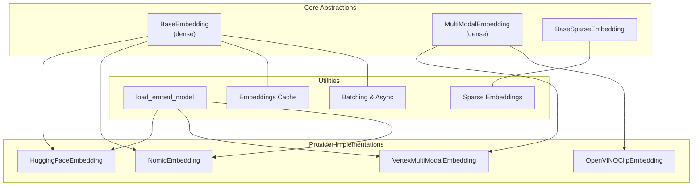
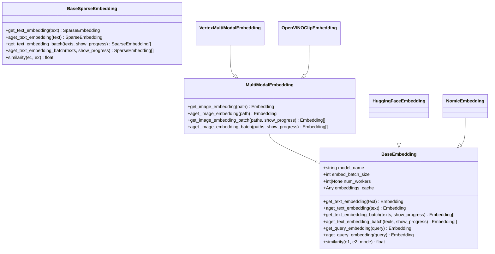
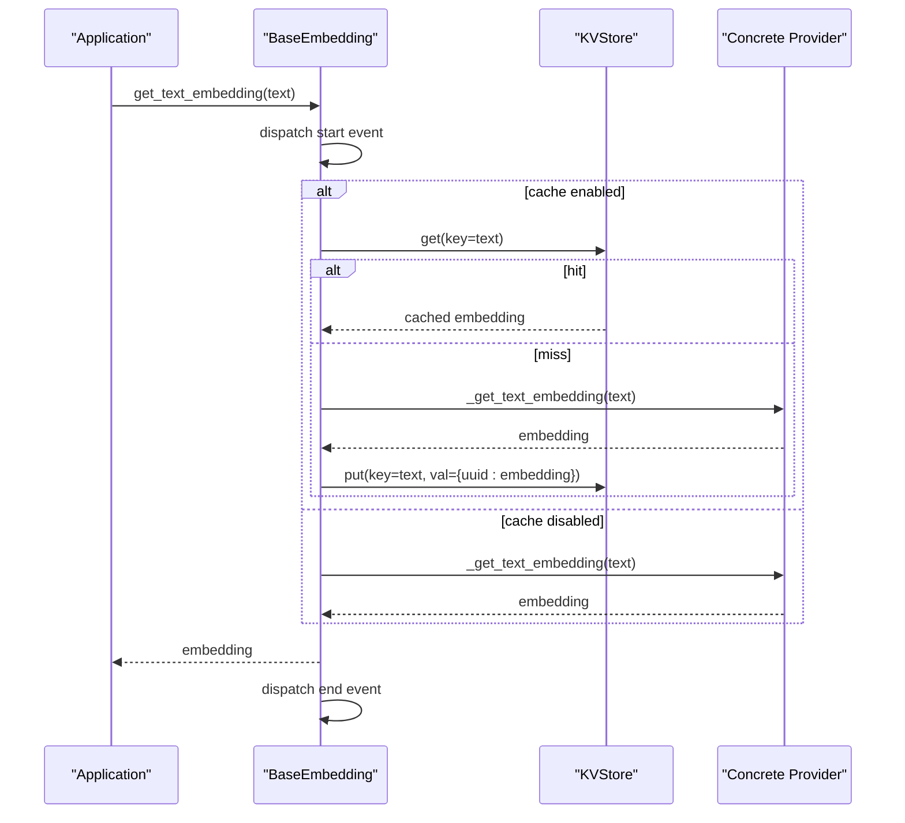
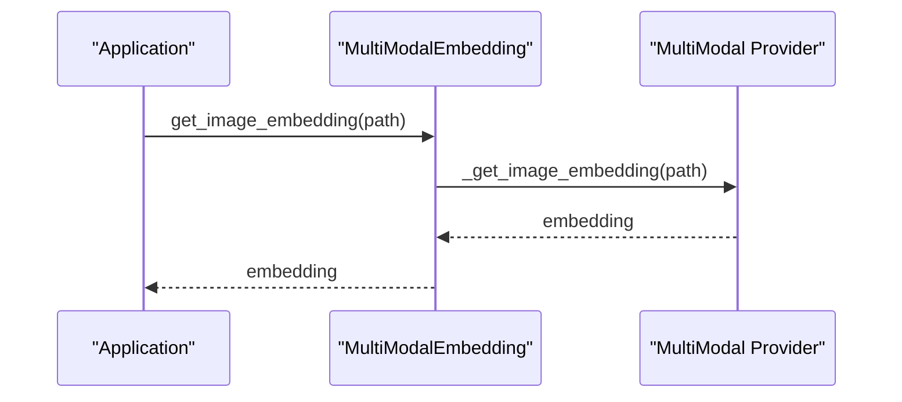
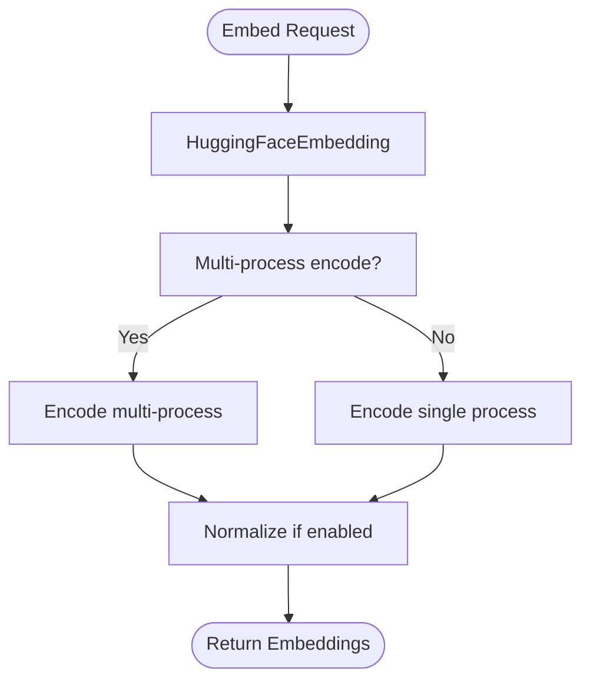
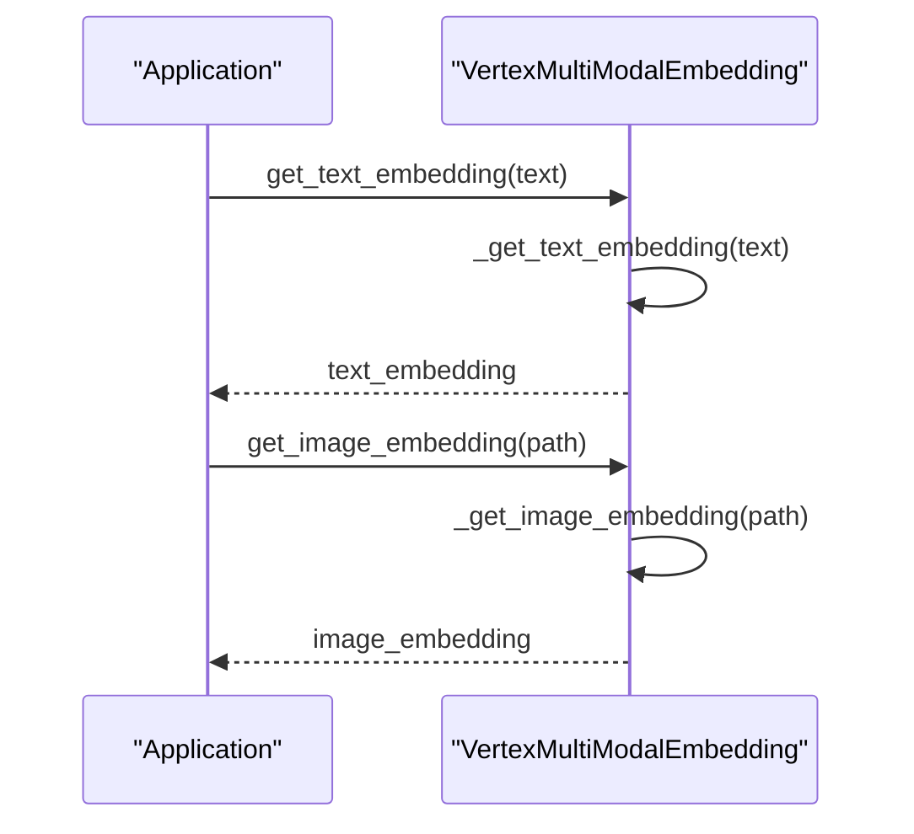
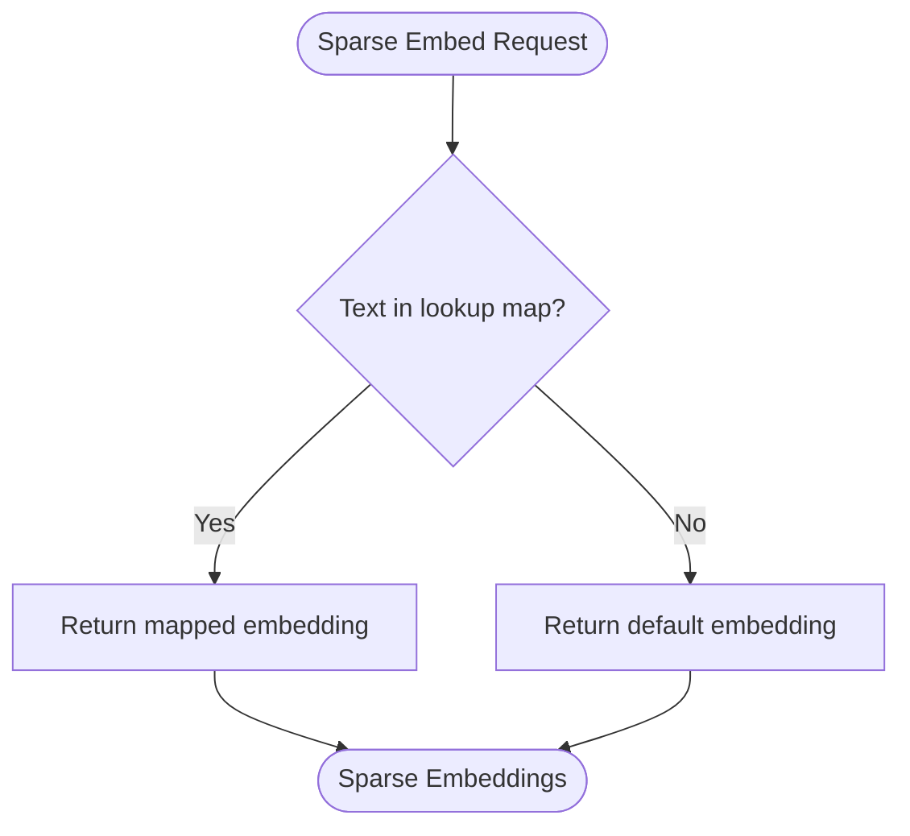
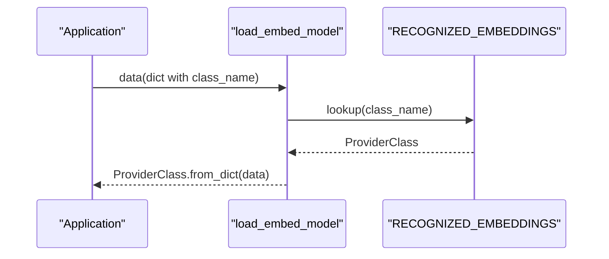
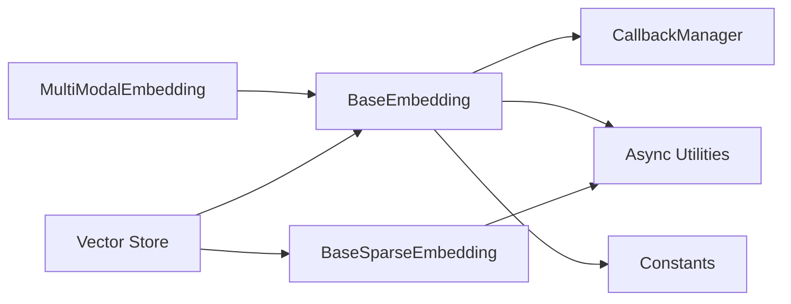

# Embedding Models

<cite>
**Referenced Files in This Document**
- [base.py](file://llama-index-core/llama_index/core/base/embeddings/base.py)
- [multi_modal_base.py](file://llama-index-core/llama_index/core/embeddings/multi_modal_base.py)
- [__init__.py](file://llama-index-core/llama_index/core/embeddings/__init__.py)
- [loading.py](file://llama-index-core/llama_index/core/embeddings/loading.py)
- [mock_embed_model.py](file://llama-index-core/llama_index/core/embeddings/mock_embed_model.py)
- [base_sparse.py](file://llama-index-core/llama_index/core/base/embeddings/base_sparse.py)
- [mock_sparse_embedding.py](file://llama-index-core/llama_index/core/sparse_embeddings/mock_sparse_embedding.py)
- [test_with_cache.py](file://llama-index-core/tests/embeddings/test_with_cache.py)
- [test_mock_sparse_embeddings.py](file://llama-index-core/tests/sparse_embeddings/test_mock_sparse_embeddings.py)
- [base.py](file://llama-index-integrations/embeddings/llama-index-embeddings-vertex/llama_index/embeddings/vertex/base.py)
- [base.py](file://llama-index-integrations/embeddings/llama-index-embeddings-huggingface/llama_index/embeddings/huggingface/base.py)
- [base.py](file://llama-index-integrations/embeddings/llama-index-embeddings-nomic/llama_index/embeddings/nomic/base.py)
- [base.py](file://llama-index-integrations/embeddings/llama-index-embeddings-huggingface-openvino/llama_index/embeddings/huggingface_openvino/base.py)
- [__init__.py](file://llama-index-integrations/sparse_embeddings/llama-index-sparse-embeddings-fastembed/llama_index/sparse_embeddings/fastembed/__init__.py)
- [base.py](file://llama-index-integrations/vector_stores/llama-index-vector-stores-qdrant/llama_index/vector_stores/qdrant/base.py)
- [optimizer.py](file://llama-index-core/llama_index/core/postprocessor/optimizer.py)
</cite>

## Table of Contents
1. [Introduction](#introduction)
2. [Project Structure](#project-structure)
3. [Core Components](#core-components)
4. [Architecture Overview](#architecture-overview)
5. [Detailed Component Analysis](#detailed-component-analysis)
6. [Dependency Analysis](#dependency-analysis)
7. [Performance Considerations](#performance-considerations)
8. [Troubleshooting Guide](#troubleshooting-guide)
9. [Conclusion](#conclusion)
10. [Appendices](#appendices)

## Introduction
This document explains LlamaIndex’s embedding abstraction and multi-modal capabilities. It covers the embedding base class, provider loading mechanisms, multi-modal embedding support, built-in implementations, custom embedding development, sparse embedding strategies, caching, batch processing, and performance optimization. Practical examples demonstrate integrating new providers, implementing custom embeddings, and handling different modalities (text, image). Advanced topics include embedding dimensionality, normalization, and distributed embedding processing. Guidance is also provided for debugging and optimizing embedding performance.

## Project Structure
The embedding system is organized around a core abstraction with optional multi-modal extensions, provider-specific implementations, and utilities for caching, batching, and sparse embeddings. Provider loading is centralized to support dynamic instantiation of embedding models.

**Diagram sources**
- [base.py](file://llama-index-core/llama_index/core/base/embeddings/base.py#L72-L619)
- [multi_modal_base.py](file://llama-index-core/llama_index/core/embeddings/multi_modal_base.py#L16-L187)
- [loading.py](file://llama-index-core/llama_index/core/embeddings/loading.py#L1-L50)
- [base.py](file://llama-index-integrations/embeddings/llama-index-embeddings-huggingface/llama_index/embeddings/huggingface/base.py#L209-L249)
- [base.py](file://llama-index-integrations/embeddings/llama-index-embeddings-vertex/llama_index/embeddings/vertex/base.py#L264-L302)
- [base.py](file://llama-index-integrations/embeddings/llama-index-embeddings-nomic/llama_index/embeddings/nomic/base.py#L173-L243)
- [base.py](file://llama-index-integrations/embeddings/llama-index-embeddings-huggingface-openvino/llama_index/embeddings/huggingface_openvino/base.py#L258-L271)

**Section sources**
- [__init__.py](file://llama-index-core/llama_index/core/embeddings/__init__.py#L1-L16)
- [loading.py](file://llama-index-core/llama_index/core/embeddings/loading.py#L1-L50)

## Core Components
- BaseEmbedding (dense): Defines the canonical interface for text and query embeddings, including synchronous and asynchronous methods, batching, aggregation, similarity, and optional caching. It supports configurable batch sizes and worker counts for async processing.
- MultiModalEmbedding (dense): Extends BaseEmbedding to support image embeddings alongside text and query embeddings, with batching and async support.
- BaseSparseEmbedding: Provides sparse embedding semantics with sparse similarity, batching, and async generation.
- Provider loading: Centralized registry and loader to instantiate embedding models by class name.

Key capabilities:
- Text/query embedding APIs with optional instruction prefixes
- Batch processing with progress reporting and worker concurrency
- Optional KVStore-backed caching for embeddings
- Multi-modal image embedding support
- Sparse embedding support with similarity and aggregation

**Section sources**
- [base.py](file://llama-index-core/llama_index/core/base/embeddings/base.py#L72-L619)
- [multi_modal_base.py](file://llama-index-core/llama_index/core/embeddings/multi_modal_base.py#L16-L187)
- [base_sparse.py](file://llama-index-core/llama_index/core/base/embeddings/base_sparse.py#L1-L353)
- [loading.py](file://llama-index-core/llama_index/core/embeddings/loading.py#L1-L50)

## Architecture Overview
The embedding architecture separates concerns between abstraction, provider implementations, and utilities. Providers implement either BaseEmbedding or MultiModalEmbedding. The loader resolves provider classes by name. Caching and batching are integrated into the base classes. Sparse embeddings are handled via a separate base class and utilities.

**Diagram sources**
- [base.py](file://llama-index-core/llama_index/core/base/embeddings/base.py#L72-L619)
- [multi_modal_base.py](file://llama-index-core/llama_index/core/embeddings/multi_modal_base.py#L16-L187)
- [base_sparse.py](file://llama-index-core/llama_index/core/base/embeddings/base_sparse.py#L1-L353)
- [base.py](file://llama-index-integrations/embeddings/llama-index-embeddings-huggingface/llama_index/embeddings/huggingface/base.py#L209-L249)
- [base.py](file://llama-index-integrations/embeddings/llama-index-embeddings-vertex/llama_index/embeddings/vertex/base.py#L264-L302)
- [base.py](file://llama-index-integrations/embeddings/llama-index-embeddings-nomic/llama_index/embeddings/nomic/base.py#L173-L243)
- [base.py](file://llama-index-integrations/embeddings/llama-index-embeddings-huggingface-openvino/llama_index/embeddings/huggingface_openvino/base.py#L258-L271)

## Detailed Component Analysis

### Dense Embedding Base Class
- Responsibilities: Unified API for text and query embeddings, batching, async execution, similarity computation, and optional caching.
- Notable features:
  - Embedding caching backed by a KVStore
  - Batch size control and progress reporting
  - Worker-based concurrency for async batches
  - Aggregation helpers for multi-query embeddings

**Diagram sources**
- [base.py](file://llama-index-core/llama_index/core/base/embeddings/base.py#L350-L443)

**Section sources**
- [base.py](file://llama-index-core/llama_index/core/base/embeddings/base.py#L72-L619)

### Multi-Modal Embedding Base Class
- Extends dense embedding with image embedding support.
- Provides synchronous and asynchronous image embedding methods, plus batching and async batching.

**Diagram sources**
- [multi_modal_base.py](file://llama-index-core/llama_index/core/embeddings/multi_modal_base.py#L37-L67)

**Section sources**
- [multi_modal_base.py](file://llama-index-core/llama_index/core/embeddings/multi_modal_base.py#L16-L187)

### Built-in Dense Embedding Implementations
- HuggingFaceEmbedding: Supports local and multi-process encoding, pooling, normalization, and progress reporting.
- NomicEmbedding: Configurable dimensionality and normalization, with pooling strategies.
- OpenVINOClipEmbedding: Multi-modal CLIP variant with device-aware models and batching.

**Diagram sources**
- [base.py](file://llama-index-integrations/embeddings/llama-index-embeddings-huggingface/llama_index/embeddings/huggingface/base.py#L209-L249)

**Section sources**
- [base.py](file://llama-index-integrations/embeddings/llama-index-embeddings-huggingface/llama_index/embeddings/huggingface/base.py#L209-L249)
- [base.py](file://llama-index-integrations/embeddings/llama-index-embeddings-nomic/llama_index/embeddings/nomic/base.py#L173-L243)
- [base.py](file://llama-index-integrations/embeddings/llama-index-embeddings-huggingface-openvino/llama_index/embeddings/huggingface_openvino/base.py#L258-L271)

### Multi-Modal Provider Example
- VertexMultiModalEmbedding: Implements text and image embedding using a multi-modal model, with dimension control and async fallbacks.

**Diagram sources**
- [base.py](file://llama-index-integrations/embeddings/llama-index-embeddings-vertex/llama_index/embeddings/vertex/base.py#L274-L299)

**Section sources**
- [base.py](file://llama-index-integrations/embeddings/llama-index-embeddings-vertex/llama_index/embeddings/vertex/base.py#L264-L302)

### Sparse Embedding Support
- BaseSparseEmbedding: Defines sparse embedding semantics, similarity, batching, and async generation.
- MockSparseEmbedding: Test utility for sparse embeddings with configurable defaults and lookup maps.
- FastEmbedSparseEmbedding: Integration entry point for fastembed-based sparse embeddings.

**Diagram sources**
- [base_sparse.py](file://llama-index-core/llama_index/core/base/embeddings/base_sparse.py#L31-L353)
- [mock_sparse_embedding.py](file://llama-index-core/llama_index/core/sparse_embeddings/mock_sparse_embedding.py#L10-L42)
- [__init__.py](file://llama-index-integrations/sparse_embeddings/llama-index-sparse-embeddings-fastembed/llama_index/sparse_embeddings/fastembed/__init__.py#L1-L3)

**Section sources**
- [base_sparse.py](file://llama-index-core/llama_index/core/base/embeddings/base_sparse.py#L1-L353)
- [mock_sparse_embedding.py](file://llama-index-core/llama_index/core/sparse_embeddings/mock_sparse_embedding.py#L1-L42)
- [test_mock_sparse_embeddings.py](file://llama-index-core/tests/sparse_embeddings/test_mock_sparse_embeddings.py#L1-L79)
- [__init__.py](file://llama-index-integrations/sparse_embeddings/llama-index-sparse-embeddings-fastembed/llama_index/sparse_embeddings/fastembed/__init__.py#L1-L3)

### Provider Loading Mechanism
- Central registry maps class names to provider classes.
- Loader instantiates models from serialized dictionaries.

**Diagram sources**
- [loading.py](file://llama-index-core/llama_index/core/embeddings/loading.py#L39-L50)

**Section sources**
- [loading.py](file://llama-index-core/llama_index/core/embeddings/loading.py#L1-L50)
- [__init__.py](file://llama-index-core/llama_index/core/embeddings/__init__.py#L1-L16)

### Practical Examples

#### Integrating a New Dense Provider
- Steps:
  - Implement a subclass of BaseEmbedding.
  - Override `_get_text_embedding`, `_get_query_embedding`, and optionally `_get_text_embeddings`.
  - Optionally enable async by overriding `_aget_*` methods.
  - Register the provider in the loader registry if external.

**Section sources**
- [base.py](file://llama-index-core/llama_index/core/base/embeddings/base.py#L112-L129)
- [loading.py](file://llama-index-core/llama_index/core/embeddings/loading.py#L6-L8)

#### Integrating a New Multi-Modal Provider
- Steps:
  - Subclass MultiModalEmbedding.
  - Implement `_get_image_embedding` and `_aget_image_embedding`.
  - Optionally override batching methods for efficiency.

**Section sources**
- [multi_modal_base.py](file://llama-index-core/llama_index/core/embeddings/multi_modal_base.py#L19-L35)

#### Implementing a Custom Dense Embedding Model
- Use MockEmbedding as a minimal reference for required methods and initialization.

**Section sources**
- [mock_embed_model.py](file://llama-index-core/llama_index/core/embeddings/mock_embed_model.py#L10-L47)

#### Handling Different Modalities
- Text: Use BaseEmbedding APIs.
- Images: Use MultiModalEmbedding APIs.
- Audio: Implement a provider extending BaseEmbedding or a future multi-modal base if added.

**Section sources**
- [multi_modal_base.py](file://llama-index-core/llama_index/core/embeddings/multi_modal_base.py#L16-L187)

## Dependency Analysis
- BaseEmbedding depends on:
  - Callback manager and instrumentation for tracing
  - Async utilities for concurrent batch processing
  - Constants for default batch sizes
- MultiModalEmbedding extends BaseEmbedding and adds image-specific methods.
- Sparse embedding utilities depend on sparse similarity and async job execution.
- Vector stores can consume both dense and sparse embeddings.

**Diagram sources**
- [base.py](file://llama-index-core/llama_index/core/base/embeddings/base.py#L16-L24)
- [multi_modal_base.py](file://llama-index-core/llama_index/core/embeddings/multi_modal_base.py#L1-L14)
- [base_sparse.py](file://llama-index-core/llama_index/core/base/embeddings/base_sparse.py#L15-L23)
- [base.py](file://llama-index-integrations/vector_stores/llama-index-vector-stores-qdrant/llama_index/vector_stores/qdrant/base.py#L336-L368)

**Section sources**
- [base.py](file://llama-index-core/llama_index/core/base/embeddings/base.py#L16-L24)
- [multi_modal_base.py](file://llama-index-core/llama_index/core/embeddings/multi_modal_base.py#L1-L14)
- [base_sparse.py](file://llama-index-core/llama_index/core/base/embeddings/base_sparse.py#L15-L23)
- [base.py](file://llama-index-integrations/vector_stores/llama-index-vector-stores-qdrant/llama_index/vector_stores/qdrant/base.py#L336-L368)

## Performance Considerations
- Batch size tuning:
  - Increase embed_batch_size to reduce overhead and improve throughput.
  - Ensure provider compatibility and resource limits.
- Concurrency:
  - Use num_workers for async batches to parallelize requests.
- Caching:
  - Enable embeddings_cache to avoid recomputation for repeated inputs.
- Normalization and pooling:
  - Apply normalization and pooling consistently across providers to maintain similarity semantics.
- Distributed processing:
  - HuggingFaceEmbedding supports multi-process encoding for CPU-bound workloads.
- Progress reporting:
  - Enable show_progress for long-running batches to monitor progress.

[No sources needed since this section provides general guidance]

## Troubleshooting Guide
- Caching issues:
  - Verify embeddings_cache is a KVStore instance.
  - Confirm cache keys and collections match expectations.
- Async batch failures:
  - Check num_workers and ensure provider supports async batching.
- Sparse similarity:
  - Ensure both embeddings are non-empty and compare using sparse_similarity.
- Vector store hybrid indexing:
  - Confirm both dense and sparse vectors are provided when enabling hybrid mode.

**Section sources**
- [base.py](file://llama-index-core/llama_index/core/base/embeddings/base.py#L100-L110)
- [test_with_cache.py](file://llama-index-core/tests/embeddings/test_with_cache.py#L73-L127)
- [base_sparse.py](file://llama-index-core/llama_index/core/base/embeddings/base_sparse.py#L31-L353)
- [base.py](file://llama-index-integrations/vector_stores/llama-index-vector-stores-qdrant/llama_index/vector_stores/qdrant/base.py#L336-L368)

## Conclusion
LlamaIndex’s embedding abstraction provides a robust, extensible foundation for dense and sparse embeddings, with strong multi-modal support and efficient batch/async processing. The centralized loading mechanism simplifies provider integration, while caching and normalization help optimize performance. By following the patterns outlined here, developers can integrate new providers, implement custom embeddings, and handle diverse modalities effectively.

[No sources needed since this section summarizes without analyzing specific files]

## Appendices

### Advanced Topics

#### Embedding Dimensionality and Normalization
- Set dimensionality explicitly for providers that support it (e.g., NomicEmbedding).
- Normalize embeddings when required by downstream similarity computations.

**Section sources**
- [base.py](file://llama-index-integrations/embeddings/llama-index-embeddings-nomic/llama_index/embeddings/nomic/base.py#L173-L243)

#### Distributed Embedding Processing
- Use multi-process encoding where supported (e.g., HuggingFaceEmbedding) to leverage multiple CPUs.

**Section sources**
- [base.py](file://llama-index-integrations/embeddings/llama-index-embeddings-huggingface/llama_index/embeddings/huggingface/base.py#L222-L242)

#### Hybrid Dense-Sparse Indexing
- Combine dense and sparse embeddings in vector stores for richer retrieval.

**Section sources**
- [base.py](file://llama-index-integrations/vector_stores/llama-index-vector-stores-qdrant/llama_index/vector_stores/qdrant/base.py#L346-L368)

#### Aggregation and Similarity
- Use built-in aggregation and similarity helpers for dense and sparse embeddings.

**Section sources**
- [base.py](file://llama-index-core/llama_index/core/base/embeddings/base.py#L47-L70)
- [base_sparse.py](file://llama-index-core/llama_index/core/base/embeddings/base_sparse.py#L31-L353)