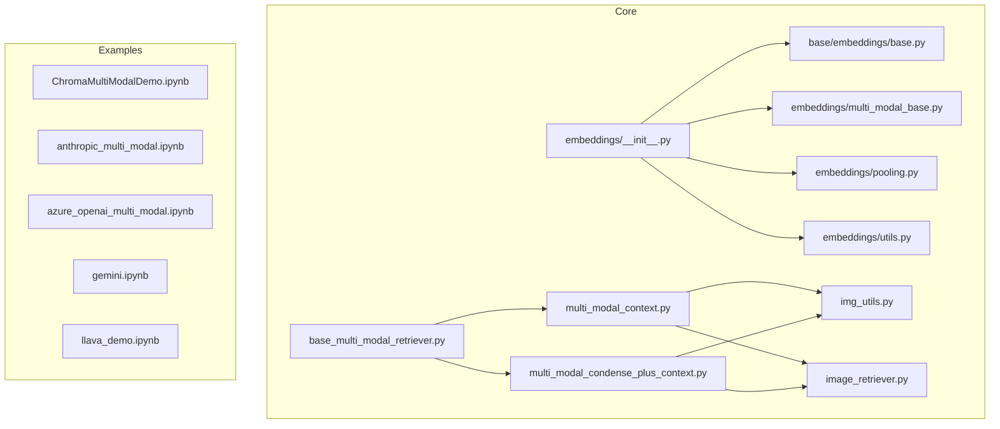
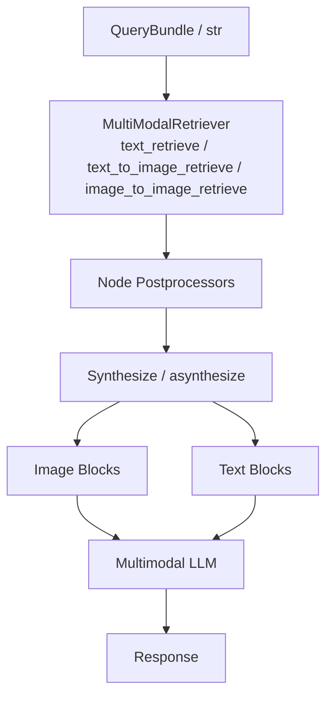
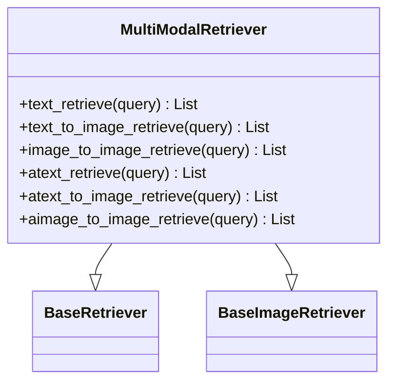
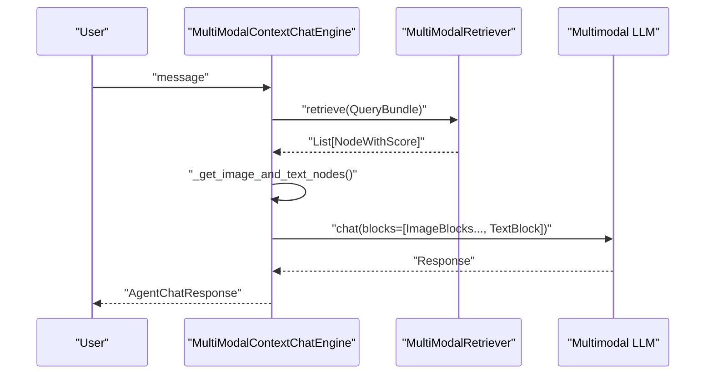
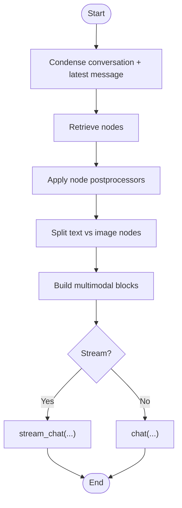
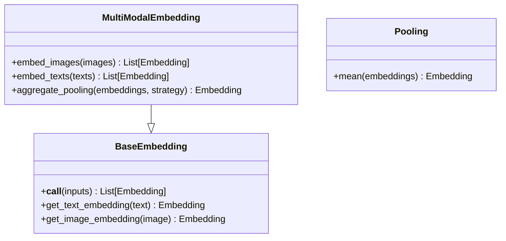
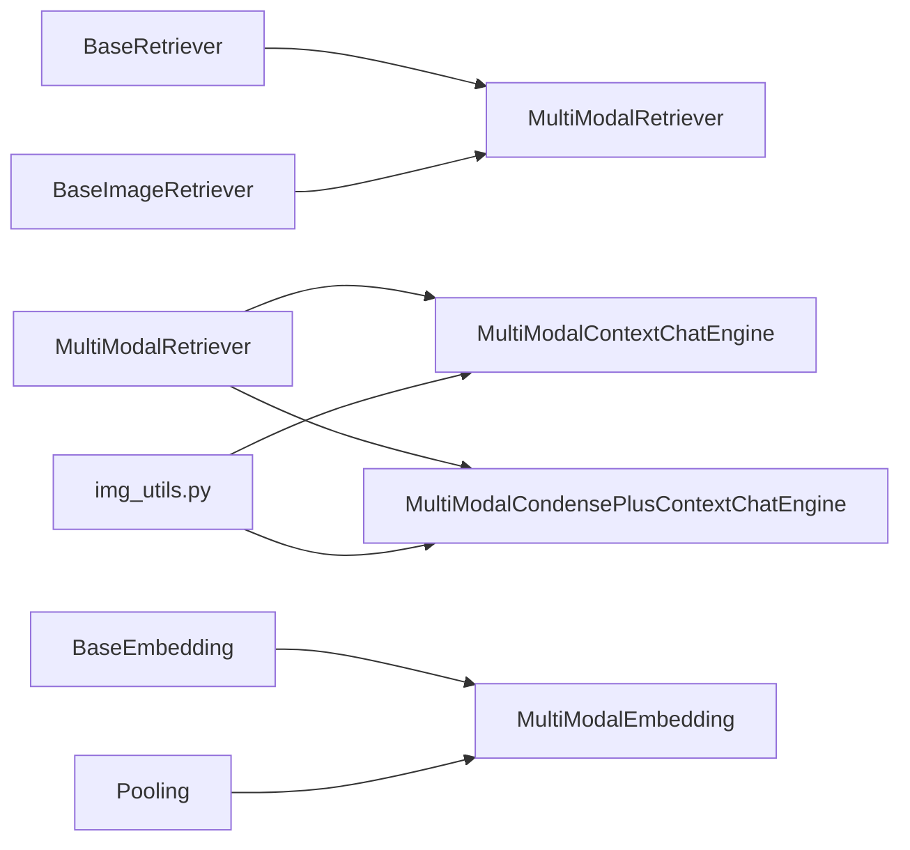

# Multi-modal Embeddings

<cite>
**Referenced Files in This Document**
- [base_multi_modal_retriever.py](file://llama-index-core/llama_index/core/base/base_multi_modal_retriever.py)
- [multi_modal_context.py](file://llama-index-core/llama_index/core/chat_engine/multi_modal_context.py)
- [multi_modal_condense_plus_context.py](file://llama-index-core/llama_index/core/chat_engine/multi_modal_condense_plus_context.py)
- [embeddings_init.py](file://llama-index-core/llama_index/core/embeddings/__init__.py)
- [base.py](file://llama-index-core/llama_index/core/base/embeddings/base.py)
- [mock_embed_model.py](file://llama-index-core/llama_index/core/embeddings/mock_embed_model.py)
- [multi_modal_base.py](file://llama-index-core/llama_index/core/embeddings/multi_modal_base.py)
- [pooling.py](file://llama-index-core/llama_index/core/embeddings/pooling.py)
- [utils.py](file://llama-index-core/llama_index/core/embeddings/utils.py)
- [__init__.py](file://llama-index-core/llama_index/core/__init__.py)
- [img_utils.py](file://llama-index-core/llama_index/core/img_utils.py)
- [image_retriever.py](file://llama-index-core/llama_index/core/image_retriever.py)
- [simple_multi_modal.md](file://docs/api_reference/api_reference/query_engine/simple_multi_modal.md)
- [multi_modal.md](file://docs/api_reference/api_reference/evaluation/multi_modal.md)
- [multi_modal.md](file://docs/api_reference/api_reference/program/multi_modal.md)
- [ChromaMultiModalDemo.ipynb](file://docs/examples/multi_modal/ChromaMultiModalDemo.ipynb)
- [anthropic_multi_modal.ipynb](file://docs/examples/multi_modal/anthropic_multi_modal.ipynb)
- [azure_openai_multi_modal.ipynb](file://docs/examples/multi_modal/azure_openai_multi_modal.ipynb)
- [cohere_multi_modal.ipynb](file://docs/examples/multi_modal/cohere_multi_modal.ipynb)
- [dashscope_multi_modal.ipynb](file://docs/examples/multi_modal/dashscope_multi_modal.ipynb)
- [gemini.ipynb](file://docs/examples/multi_modal/gemini.ipynb)
- [gpt4o_mm_structured_outputs.ipynb](file://docs/examples/multi_modal/gpt4o_mm_structured_outputs.ipynb)
- [gpt4v_experiments_cot.ipynb](file://docs/examples/multi_modal/gpt4v_experiments_cot.ipynb)
- [gpt4v_multi_modal_retrieval.ipynb](file://docs/examples/multi_modal/gpt4v_multi_modal_retrieval.ipynb)
- [image_to_image_retrieval.ipynb](file://docs/examples/multi_modal/image_to_image_retrieval.ipynb)
- [llamaindex_mongodb_voyageai_multimodal.ipynb](file://docs/examples/multi_modal/llamaindex_mongodb_voyageai_multimodal.ipynb)
- [llava_demo.ipynb](file://docs/examples/multi_modal/llava_demo.ipynb)
- [llava_multi_modal_tesla_10q.ipynb](file://docs/examples/multi_modal/llava_multi_modal_tesla_10q.ipynb)
- [mistral_multi_modal.ipynb](file://docs/examples/multi_modal/mistral_multi_modal.ipynb)
- [multi_modal_pydantic.ipynb](file://docs/examples/multi_modal/multi_modal_pydantic.ipynb)
- [multi_modal_rag_nomic.ipynb](file://docs/examples/multi_modal/multi_modal_rag_nomic.ipynb)
- [multi_modal_rag_evaluation.ipynb](file://docs/examples/evaluation/multi_modal/multi_modal_rag_evaluation.ipynb)
</cite>

## Table of Contents
1. [Introduction](#introduction)
2. [Project Structure](#project-structure)
3. [Core Components](#core-components)
4. [Architecture Overview](#architecture-overview)
5. [Detailed Component Analysis](#detailed-component-analysis)
6. [Dependency Analysis](#dependency-analysis)
7. [Performance Considerations](#performance-considerations)
8. [Troubleshooting Guide](#troubleshooting-guide)
9. [Conclusion](#conclusion)
10. [Appendices](#appendices)

## Introduction
This document explains multi-modal embeddings within the LlamaIndex ecosystem, focusing on how the framework handles multiple data types (text, image) in a unified embedding and retrieval pipeline. It covers the multi-modal embedding interface, supported modalities, input formats, modality-specific processing, and integration with vision-language models. Practical guidance is provided for building multi-modal embeddings, handling mixed-content documents, optimizing workflows, and understanding performance and memory characteristics.

## Project Structure
The multi-modal capabilities are primarily implemented in the core module under chat engines, base retrievers, and embeddings. Examples and API references demonstrate real-world usage with various providers and notebooks.

**Diagram sources**
- [base_multi_modal_retriever.py](file://llama-index-core/llama_index/core/base/base_multi_modal_retriever.py#L1-L78)
- [multi_modal_context.py](file://llama-index-core/llama_index/core/chat_engine/multi_modal_context.py#L1-L454)
- [multi_modal_condense_plus_context.py](file://llama-index-core/llama_index/core/chat_engine/multi_modal_condense_plus_context.py#L1-L483)
- [embeddings_init.py](file://llama-index-core/llama_index/core/embeddings/__init__.py#L1-L16)
- [base.py](file://llama-index-core/llama_index/core/base/embeddings/base.py#L1-L60)
- [img_utils.py](file://llama-index-core/llama_index/core/img_utils.py#L1-L200)
- [image_retriever.py](file://llama-index-core/llama_index/core/image_retriever.py#L1-L200)
- [ChromaMultiModalDemo.ipynb](file://docs/examples/multi_modal/ChromaMultiModalDemo.ipynb#L1-L200)
- [gemini.ipynb](file://docs/examples/multi_modal/gemini.ipynb#L1-L200)

**Section sources**
- [base_multi_modal_retriever.py](file://llama-index-core/llama_index/core/base/base_multi_modal_retriever.py#L1-L78)
- [multi_modal_context.py](file://llama-index-core/llama_index/core/chat_engine/multi_modal_context.py#L1-L454)
- [multi_modal_condense_plus_context.py](file://llama-index-core/llama_index/core/chat_engine/multi_modal_condense_plus_context.py#L1-L483)
- [embeddings_init.py](file://llama-index-core/llama_index/core/embeddings/__init__.py#L1-L16)
- [base.py](file://llama-index-core/llama_index/core/base/embeddings/base.py#L1-L60)
- [img_utils.py](file://llama-index-core/llama_index/core/img_utils.py#L1-L200)
- [image_retriever.py](file://llama-index-core/llama_index/core/image_retriever.py#L1-L200)

## Core Components
- MultiModalRetriever: An abstract base for retrieving both text and image nodes, supporting synchronous and asynchronous operations across text-to-text, text-to-image, and image-to-image queries.
- MultiModalContextChatEngine and MultiModalCondensePlusContextChatEngine: Chat engines that integrate multimodal retrieval with multimodal LLMs, combining retrieved text and images into a unified input for generation.
- Embedding subsystem: Provides the embedding interface, pooling strategies, and utilities, including multi-modal embedding abstractions and mock implementations for testing.

Key responsibilities:
- MultiModalRetriever defines the contract for multi-modal retrieval across modalities.
- Chat engines orchestrate retrieval, split text vs. image nodes, assemble multimodal inputs, and interact with multimodal LLMs.
- Embeddings provide the foundational abstraction for generating and aggregating vectors.

**Section sources**
- [base_multi_modal_retriever.py](file://llama-index-core/llama_index/core/base/base_multi_modal_retriever.py#L12-L78)
- [multi_modal_context.py](file://llama-index-core/llama_index/core/chat_engine/multi_modal_context.py#L63-L213)
- [multi_modal_condense_plus_context.py](file://llama-index-core/llama_index/core/chat_engine/multi_modal_condense_plus_context.py#L49-L292)
- [embeddings_init.py](file://llama-index-core/llama_index/core/embeddings/__init__.py#L1-L16)
- [base.py](file://llama-index-core/llama_index/core/base/embeddings/base.py#L26-L51)

## Architecture Overview
The multi-modal embedding and retrieval pipeline integrates retrieval, post-processing, and multimodal LLM interaction. The following diagram maps the primary components and their relationships.

**Diagram sources**
- [base_multi_modal_retriever.py](file://llama-index-core/llama_index/core/base/base_multi_modal_retriever.py#L15-L77)
- [multi_modal_context.py](file://llama-index-core/llama_index/core/chat_engine/multi_modal_context.py#L150-L213)
- [multi_modal_condense_plus_context.py](file://llama-index-core/llama_index/core/chat_engine/multi_modal_condense_plus_context.py#L163-L292)

## Detailed Component Analysis

### MultiModalRetriever
- Purpose: Unified interface for retrieving text and image nodes across modalities.
- Methods:
  - text_retrieve, text_to_image_retrieve, image_to_image_retrieve (sync)
  - atext_retrieve, atext_to_image_retrieve, aimage_to_image_retrieve (async)
- Integration: Inherits from BaseRetriever and BaseImageRetriever, enabling seamless use in multimodal contexts.

**Diagram sources**
- [base_multi_modal_retriever.py](file://llama-index-core/llama_index/core/base/base_multi_modal_retriever.py#L12-L78)

**Section sources**
- [base_multi_modal_retriever.py](file://llama-index-core/llama_index/core/base/base_multi_modal_retriever.py#L12-L78)

### MultiModalContextChatEngine
- Purpose: Retrieves nodes, separates text and image nodes, constructs multimodal inputs, and interacts with a multimodal LLM.
- Key steps:
  - Retrieve nodes via retriever and apply node postprocessors.
  - Split nodes into text and image lists.
  - Convert image nodes to image blocks and append formatted text context.
  - Call multimodal LLM (chat/stream_chat) and manage memory.

**Diagram sources**
- [multi_modal_context.py](file://llama-index-core/llama_index/core/chat_engine/multi_modal_context.py#L150-L213)

**Section sources**
- [multi_modal_context.py](file://llama-index-core/llama_index/core/chat_engine/multi_modal_context.py#L63-L213)

### MultiModalCondensePlusContextChatEngine
- Purpose: Condenses conversation history and latest message into a standalone question, retrieves context, and generates a response using a multimodal LLM.
- Key steps:
  - Condense conversation history to a single query.
  - Retrieve nodes and apply postprocessors.
  - Build multimodal input with text and image blocks.
  - Stream or non-stream chat with the multimodal LLM.

**Diagram sources**
- [multi_modal_condense_plus_context.py](file://llama-index-core/llama_index/core/chat_engine/multi_modal_condense_plus_context.py#L131-L292)

**Section sources**
- [multi_modal_condense_plus_context.py](file://llama-index-core/llama_index/core/chat_engine/multi_modal_condense_plus_context.py#L49-L292)

### Embedding Subsystem
- BaseEmbedding and MultiModalEmbedding: Define the embedding interface and multi-modal embedding abstractions.
- Pooling: Provides aggregation strategies (e.g., mean) for combining embeddings.
- Utilities: Helpers for resolving embedding models and mock implementations for testing.

**Diagram sources**
- [embeddings_init.py](file://llama-index-core/llama_index/core/embeddings/__init__.py#L1-L16)
- [base.py](file://llama-index-core/llama_index/core/base/embeddings/base.py#L26-L51)
- [pooling.py](file://llama-index-core/llama_index/core/embeddings/pooling.py#L1-L200)
- [multi_modal_base.py](file://llama-index-core/llama_index/core/embeddings/multi_modal_base.py#L1-L200)

**Section sources**
- [embeddings_init.py](file://llama-index-core/llama_index/core/embeddings/__init__.py#L1-L16)
- [base.py](file://llama-index-core/llama_index/core/base/embeddings/base.py#L26-L51)
- [pooling.py](file://llama-index-core/llama_index/core/embeddings/pooling.py#L1-L200)
- [multi_modal_base.py](file://llama-index-core/llama_index/core/embeddings/multi_modal_base.py#L1-L200)

## Dependency Analysis
- Retrieval depends on BaseRetriever and BaseImageRetriever to support text and image retrieval.
- Chat engines depend on multimodal LLMs and image block conversion utilities.
- Embeddings depend on pooling and utility helpers for model resolution and testing.

**Diagram sources**
- [base_multi_modal_retriever.py](file://llama-index-core/llama_index/core/base/base_multi_modal_retriever.py#L6-L9)
- [multi_modal_context.py](file://llama-index-core/llama_index/core/chat_engine/multi_modal_context.py#L24-L28)
- [multi_modal_condense_plus_context.py](file://llama-index-core/llama_index/core/chat_engine/multi_modal_condense_plus_context.py#L26-L31)
- [embeddings_init.py](file://llama-index-core/llama_index/core/embeddings/__init__.py#L1-L16)
- [pooling.py](file://llama-index-core/llama_index/core/embeddings/pooling.py#L1-L200)

**Section sources**
- [base_multi_modal_retriever.py](file://llama-index-core/llama_index/core/base/base_multi_modal_retriever.py#L6-L9)
- [multi_modal_context.py](file://llama-index-core/llama_index/core/chat_engine/multi_modal_context.py#L24-L28)
- [multi_modal_condense_plus_context.py](file://llama-index-core/llama_index/core/chat_engine/multi_modal_condense_plus_context.py#L26-L31)
- [embeddings_init.py](file://llama-index-core/llama_index/core/embeddings/__init__.py#L1-L16)

## Performance Considerations
- Token budget: Chat engines configure memory based on the multimodal LLM’s context window to avoid overflow during multimodal prompts.
- Asynchronous retrieval and synthesis: Use async variants to improve throughput when interacting with external embedding or LLM APIs.
- Image block conversion: Efficiently convert image nodes to image blocks to minimize overhead before LLM calls.
- Aggregation strategies: Choose appropriate pooling strategies for combining embeddings to balance quality and compute cost.

[No sources needed since this section provides general guidance]

## Troubleshooting Guide
- Empty retrieval results: Both chat engines fall back to previous chunks if retrieval yields no nodes.
- Memory limits: Ensure memory token limits align with the multimodal LLM’s context window to prevent truncation or errors.
- Image node handling: Verify that retrieved nodes are properly classified as text or image to avoid incorrect input composition.

**Section sources**
- [multi_modal_context.py](file://llama-index-core/llama_index/core/chat_engine/multi_modal_context.py#L280-L284)
- [multi_modal_condense_plus_context.py](file://llama-index-core/llama_index/core/chat_engine/multi_modal_condense_plus_context.py#L113-L116)

## Conclusion
LlamaIndex provides a cohesive multi-modal embedding and retrieval framework that supports text and image inputs, integrates with multimodal LLMs, and offers flexible chat engines for both simple and condensed conversation flows. By leveraging the provided abstractions and examples, developers can build robust multi-modal applications with optimized performance and clear separation of concerns.

[No sources needed since this section summarizes without analyzing specific files]

## Appendices

### Supported Modalities and Input Formats
- Text: Standard string queries and text nodes.
- Images: Image nodes converted to image blocks for multimodal LLM consumption.
- Mixed content: Documents containing both text and images can be handled by splitting nodes and composing multimodal inputs.

**Section sources**
- [multi_modal_context.py](file://llama-index-core/llama_index/core/chat_engine/multi_modal_context.py#L165-L179)
- [multi_modal_condense_plus_context.py](file://llama-index-core/llama_index/core/chat_engine/multi_modal_condense_plus_context.py#L244-L258)

### Embedding Strategies and Normalization
- Embedding interface: BaseEmbedding and MultiModalEmbedding define the contract for text and image embeddings.
- Pooling: Mean aggregation and similar strategies help combine multi-vector outputs.
- Mock implementations: Useful for testing and development without external dependencies.

**Section sources**
- [embeddings_init.py](file://llama-index-core/llama_index/core/embeddings/__init__.py#L1-L16)
- [base.py](file://llama-index-core/llama_index/core/base/embeddings/base.py#L26-L51)
- [pooling.py](file://llama-index-core/llama_index/core/embeddings/pooling.py#L1-L200)
- [mock_embed_model.py](file://llama-index-core/llama_index/core/embeddings/mock_embed_model.py#L1-L200)

### Integration with Vision-Language Models
- Chat engines accept a multimodal LLM and compose inputs from text and image blocks.
- Memory configuration respects the LLM’s context window to maintain efficient conversations.

**Section sources**
- [multi_modal_context.py](file://llama-index-core/llama_index/core/chat_engine/multi_modal_context.py#L107-L139)
- [multi_modal_condense_plus_context.py](file://llama-index-core/llama_index/core/chat_engine/multi_modal_condense_plus_context.py#L94-L129)

### Examples and Usage Patterns
Explore the examples for provider-specific integrations and end-to-end workflows:
- Chroma multi-modal demo
- Anthropic multi-modal
- Azure OpenAI multi-modal
- Gemini multi-modal
- LLaVA demos
- Structured outputs with GPT-4o
- Retrieval with GPT-4V
- Image-to-image retrieval
- MongoDB + Voyage AI multi-modal
- Mistral multi-modal
- Pydantic multi-modal
- Nomic multi-modal
- Evaluation of multi-modal RAG

**Section sources**
- [ChromaMultiModalDemo.ipynb](file://docs/examples/multi_modal/ChromaMultiModalDemo.ipynb#L1-L200)
- [anthropic_multi_modal.ipynb](file://docs/examples/multi_modal/anthropic_multi_modal.ipynb#L1-L200)
- [azure_openai_multi_modal.ipynb](file://docs/examples/multi_modal/azure_openai_multi_modal.ipynb#L1-L200)
- [gemini.ipynb](file://docs/examples/multi_modal/gemini.ipynb#L1-L200)
- [gpt4o_mm_structured_outputs.ipynb](file://docs/examples/multi_modal/gpt4o_mm_structured_outputs.ipynb#L1-L200)
- [gpt4v_multi_modal_retrieval.ipynb](file://docs/examples/multi_modal/gpt4v_multi_modal_retrieval.ipynb#L1-L200)
- [image_to_image_retrieval.ipynb](file://docs/examples/multi_modal/image_to_image_retrieval.ipynb#L1-L200)
- [llamaindex_mongodb_voyageai_multimodal.ipynb](file://docs/examples/multi_modal/llamaindex_mongodb_voyageai_multimodal.ipynb#L1-L200)
- [llava_demo.ipynb](file://docs/examples/multi_modal/llava_demo.ipynb#L1-L200)
- [llava_multi_modal_tesla_10q.ipynb](file://docs/examples/multi_modal/llava_multi_modal_tesla_10q.ipynb#L1-L200)
- [mistral_multi_modal.ipynb](file://docs/examples/multi_modal/mistral_multi_modal.ipynb#L1-L200)
- [multi_modal_pydantic.ipynb](file://docs/examples/multi_modal/multi_modal_pydantic.ipynb#L1-L200)
- [multi_modal_rag_nomic.ipynb](file://docs/examples/multi_modal/multi_modal_rag_nomic.ipynb#L1-L200)
- [multi_modal_rag_evaluation.ipynb](file://docs/examples/evaluation/multi_modal/multi_modal_rag_evaluation.ipynb#L1-L200)