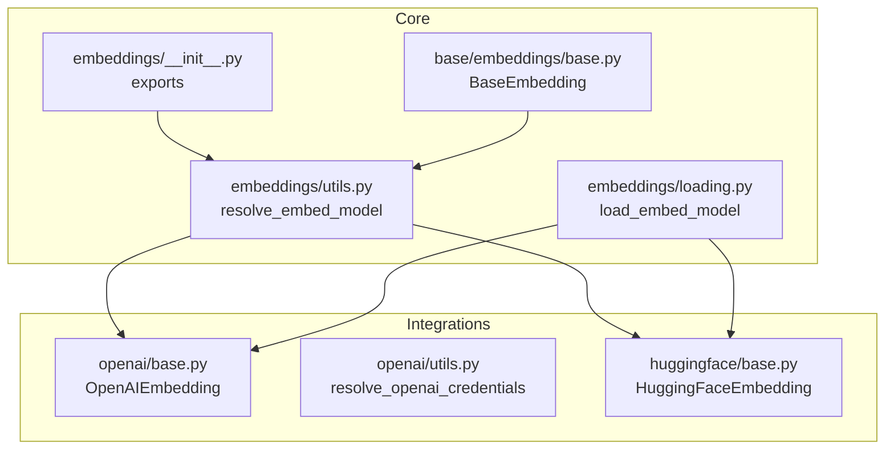
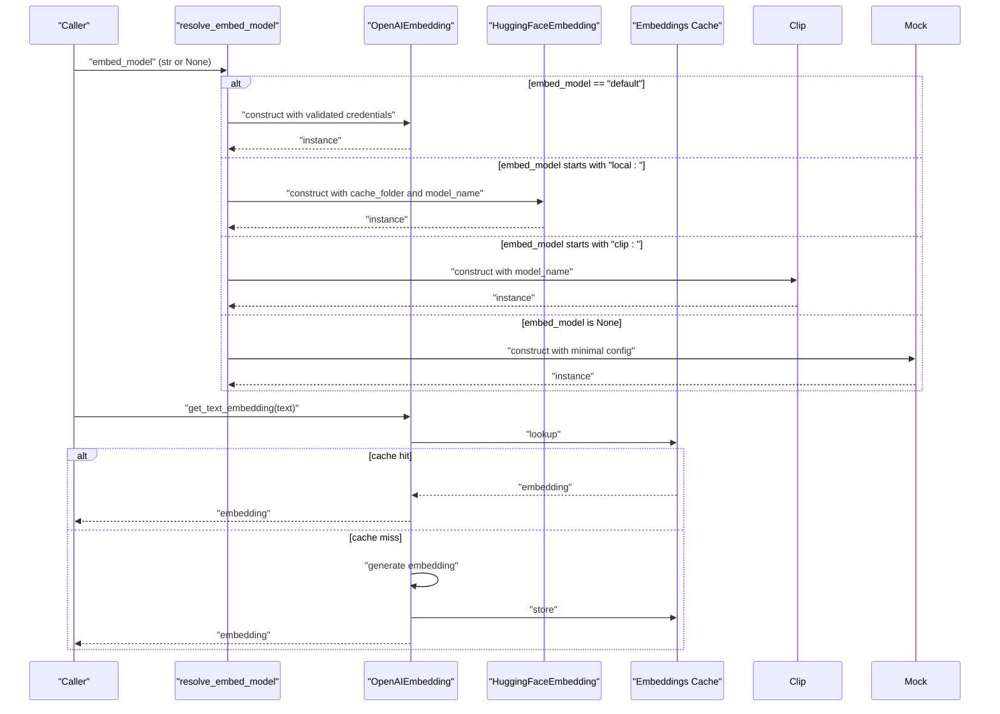
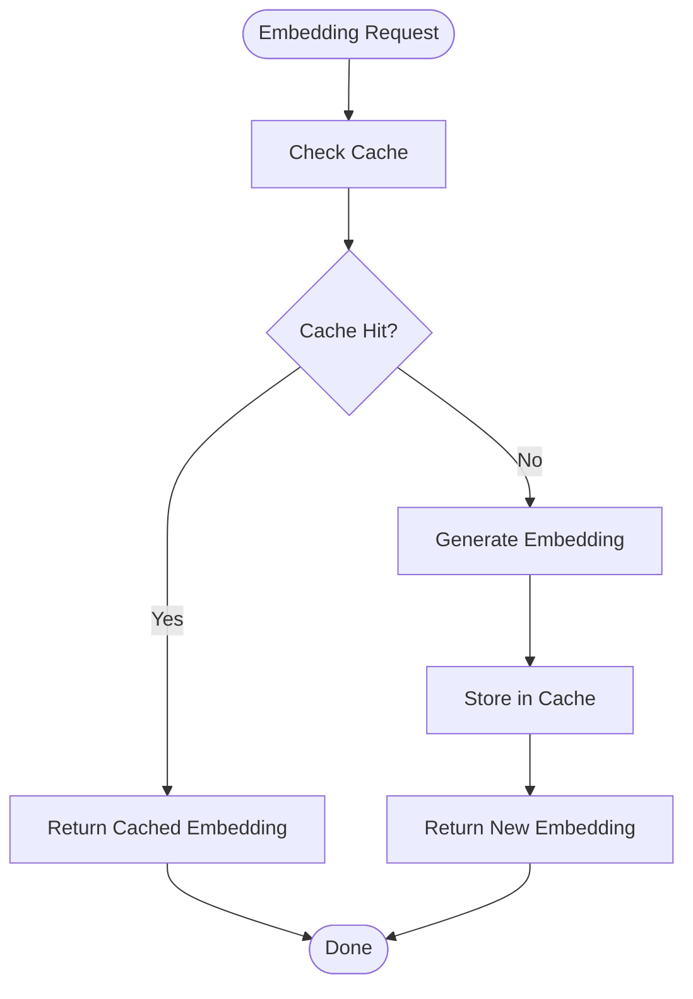
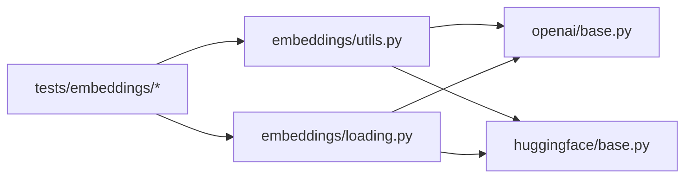

# Provider Loading System

<cite>
**Referenced Files in This Document**
- [loading.py](file://llama-index-core/llama_index/core/embeddings/loading.py)
- [utils.py](file://llama-index-core/llama_index/core/embeddings/utils.py)
- [__init__.py](file://llama-index-core/llama_index/core/embeddings/__init__.py)
- [base.py](file://llama-index-core/llama_index/core/base/embeddings/base.py)
- [test_with_cache.py](file://llama-index-core/tests/embeddings/test_with_cache.py)
- [todo_hf_test_utils.py](file://llama-index-core/tests/embeddings/todo_hf_test_utils.py)
- [transformations.py](file://llama-index-core/llama_index/core/ingestion/transformations.py)
- [openai/base.py](file://llama-index-integrations/embeddings/llama-index-embeddings-openai/llama_index/embeddings/openai/base.py)
- [openai/utils.py](file://llama-index-integrations/embeddings/llama-index-embeddings-openai/llama_index/embeddings/openai/utils.py)
- [huggingface/base.py](file://llama-index-integrations/embeddings/llama-index-embeddings-huggingface/llama_index/embeddings/huggingface/base.py)
- [huggingface/__init__.py](file://llama-index-integrations/embeddings/llama-index-embeddings-huggingface/llama_index/embeddings/huggingface/__init__.py)
</cite>

## Table of Contents
1. [Introduction](#introduction)
2. [Project Structure](#project-structure)
3. [Core Components](#core-components)
4. [Architecture Overview](#architecture-overview)
5. [Detailed Component Analysis](#detailed-component-analysis)
6. [Dependency Analysis](#dependency-analysis)
7. [Performance Considerations](#performance-considerations)
8. [Troubleshooting Guide](#troubleshooting-guide)
9. [Conclusion](#conclusion)

## Introduction
This document explains the Provider Loading System for embedding models in the LlamaIndex ecosystem. It focuses on how embedding providers are discovered, initialized, configured, and dynamically instantiated. It covers supported providers, configuration parameters, environment variable handling, authentication, caching, lazy loading, fallback mechanisms, provider switching, version compatibility, and troubleshooting provider connection issues.

## Project Structure
The embedding loading system spans core utilities and integration packages:
- Core resolution and loading utilities live under the core embeddings module.
- Provider implementations live under the integrations area, organized per provider.
- Tests demonstrate usage patterns and caching behavior.

**Diagram sources**
- [utils.py](file://llama-index-core/llama_index/core/embeddings/utils.py#L31-L141)
- [loading.py](file://llama-index-core/llama_index/core/embeddings/loading.py#L39-L50)
- [__init__.py](file://llama-index-core/llama_index/core/embeddings/__init__.py#L1-L16)
- [base.py](file://llama-index-core/llama_index/core/base/embeddings/base.py#L311-L438)
- [openai/base.py](file://llama-index-integrations/embeddings/llama-index-embeddings-openai/llama_index/embeddings/openai/base.py#L214-L489)
- [openai/utils.py](file://llama-index-integrations/embeddings/llama-index-embeddings-openai/llama_index/embeddings/openai/utils.py#L83-L104)
- [huggingface/base.py](file://llama-index-integrations/embeddings/llama-index-embeddings-huggingface/llama_index/embeddings/huggingface/base.py#L38-L360)

**Section sources**
- [utils.py](file://llama-index-core/llama_index/core/embeddings/utils.py#L31-L141)
- [loading.py](file://llama-index-core/llama_index/core/embeddings/loading.py#L39-L50)
- [__init__.py](file://llama-index-core/llama_index/core/embeddings/__init__.py#L1-L16)

## Core Components
- Provider discovery and registration:
  - Recognized providers are registered centrally and mapped by class name.
  - Dynamic imports are guarded by try/except blocks to enable optional providers.
- Resolution pipeline:
  - String-based provider selection with defaults and fallbacks.
  - Environment-driven credential resolution for cloud providers.
  - Support for local models with caching and device inference.
- Base embedding interface:
  - Provides caching hooks and async support for embedding generation.

Key responsibilities:
- Central registry of recognized embedding providers.
- Resolve provider instances from strings, objects, or defaults.
- Configure credentials via environment variables and parameters.
- Provide caching and async capabilities.

**Section sources**
- [loading.py](file://llama-index-core/llama_index/core/embeddings/loading.py#L6-L50)
- [utils.py](file://llama-index-core/llama_index/core/embeddings/utils.py#L31-L141)
- [base.py](file://llama-index-core/llama_index/core/base/embeddings/base.py#L311-L438)

## Architecture Overview
The provider loading architecture consists of:
- A central resolver that selects and instantiates embedding providers.
- Provider-specific configuration and credential resolution.
- Optional caching and async embedding generation.

**Diagram sources**
- [utils.py](file://llama-index-core/llama_index/core/embeddings/utils.py#L31-L141)
- [openai/base.py](file://llama-index-integrations/embeddings/llama-index-embeddings-openai/llama_index/embeddings/openai/base.py#L214-L489)
- [huggingface/base.py](file://llama-index-integrations/embeddings/llama-index-embeddings-huggingface/llama_index/embeddings/huggingface/base.py#L38-L360)
- [base.py](file://llama-index-core/llama_index/core/base/embeddings/base.py#L311-L438)

## Detailed Component Analysis

### Provider Discovery and Dynamic Instantiation
- Recognized providers are registered in a centralized mapping keyed by class name.
- Optional providers are imported conditionally to avoid hard dependencies.
- The loader accepts either an existing instance or a dictionary with a class name and parameters.

Implementation highlights:
- Central registry populated at import time.
- Loader validates class names and constructs instances via from_dict.

**Section sources**
- [loading.py](file://llama-index-core/llama_index/core/embeddings/loading.py#L6-L50)

### Resolution Pipeline and Fallbacks
- Default provider selection:
  - When embed_model is "default", the resolver attempts to construct an OpenAI embedding after validating credentials.
  - On import errors, it raises a clear message indicating the missing package.
  - On credential validation errors, it raises a descriptive error and suggests alternatives.
- Local provider selection:
  - When embed_model is a string prefixed with "local:", the resolver constructs a HuggingFace embedding with a cache folder and optional model name.
- CLIP multimodal selection:
  - When embed_model starts with "clip:", the resolver constructs a CLIP embedding with an optional model name.
- Explicit disabling:
  - When embed_model is None, a minimal MockEmbedding is used.

Environment-driven configuration:
- Cloud providers resolve credentials from parameters, environment variables, or SDK defaults.

**Section sources**
- [utils.py](file://llama-index-core/llama_index/core/embeddings/utils.py#L31-L141)

### Supported Providers and Configuration Parameters
- OpenAI embeddings:
  - Modes: similarity and text search.
  - Models: legacy and modern variants.
  - Parameters: API key, base URL, version, retries, timeout, headers, client reuse, dimensions.
  - Credentials resolved from parameters, environment, or SDK defaults.

- HuggingFace embeddings:
  - Parameters: model name, max length, instructions, normalization, batch size, cache folder, device, remote code trust, parallel processing, progress reporting.
  - Supports both text and image embeddings via multi-modal base.

- CLIP embeddings:
  - Parameters: model name (optional).
  - Used for image-text embeddings.

- Mock embedding:
  - Minimal embedding for testing and disabled scenarios.

**Section sources**
- [openai/base.py](file://llama-index-integrations/embeddings/llama-index-embeddings-openai/llama_index/embeddings/openai/base.py#L20-L489)
- [huggingface/base.py](file://llama-index-integrations/embeddings/llama-index-embeddings-huggingface/llama_index/embeddings/huggingface/base.py#L38-L360)
- [utils.py](file://llama-index-core/llama_index/core/embeddings/utils.py#L31-L141)

### Environment Variable Handling
- OpenAI:
  - Resolves API key, base URL, and version from parameters, environment variables, or SDK defaults.
  - Validates presence of API key and raises a clear error if missing.

- General:
  - Local model caching uses a cache directory inferred from the environment.

**Section sources**
- [openai/utils.py](file://llama-index-integrations/embeddings/llama-index-embeddings-openai/llama_index/embeddings/openai/utils.py#L83-L104)
- [utils.py](file://llama-index-core/llama_index/core/embeddings/utils.py#L107-L108)

### Authentication and Provider-Specific Settings
- OpenAI:
  - Validates API key presence and raises a descriptive error if absent.
  - Supports custom base URL and version for compatibility with compatible APIs.

- HuggingFace:
  - Uses SentenceTransformers for local models; supports remote code and device selection.
  - Uses Hugging Face Inference API for hosted models (separate integration).

- CLIP:
  - Requires installation of the underlying CLIP library; resolver surfaces import errors with guidance.

**Section sources**
- [openai/utils.py](file://llama-index-integrations/embeddings/llama-index-embeddings-openai/llama_index/embeddings/openai/utils.py#L100-L104)
- [utils.py](file://llama-index-core/llama_index/core/embeddings/utils.py#L78-L92)
- [huggingface/base.py](file://llama-index-integrations/embeddings/llama-index-embeddings-huggingface/llama_index/embeddings/huggingface/base.py#L160-L172)

### Embedding Model Caching, Lazy Loading, and Batch Behavior
- Caching:
  - Base embedding interface provides cached and async cached methods.
  - Cache stores embeddings keyed by text with randomized UUIDs to prevent collisions.
- Lazy loading:
  - Providers initialize clients lazily and optionally reuse them for stability under heavy async loads.
- Batch behavior:
  - Providers implement batching for improved throughput; OpenAI enforces batch limits.

**Diagram sources**
- [base.py](file://llama-index-core/llama_index/core/base/embeddings/base.py#L311-L438)
- [test_with_cache.py](file://llama-index-core/tests/embeddings/test_with_cache.py#L36-L127)

**Section sources**
- [base.py](file://llama-index-core/llama_index/core/base/embeddings/base.py#L311-L438)
- [test_with_cache.py](file://llama-index-core/tests/embeddings/test_with_cache.py#L36-L127)

### Provider Switching and Version Compatibility
- Provider switching:
  - Use string identifiers to switch providers at runtime (e.g., "default", "local:<model>", "clip:<model>").
  - Passing an existing instance bypasses resolution and uses the provided object.
- Version compatibility:
  - OpenAI supports configurable base URL and version for compatibility with alternative endpoints.
  - Modern OpenAI models support dimensionality specification.

**Section sources**
- [utils.py](file://llama-index-core/llama_index/core/embeddings/utils.py#L43-L77)
- [openai/base.py](file://llama-index-integrations/embeddings/llama-index-embeddings-openai/llama_index/embeddings/openai/base.py#L242-L268)

### Practical Examples
- Loading OpenAI embeddings:
  - Use "default" to select OpenAI; ensure OPENAI_API_KEY is set.
  - Alternatively, pass an OpenAIEmbedding instance directly.
- Loading HuggingFace embeddings:
  - Use "local:<model_name>" to select a local model; cache is enabled automatically.
- Loading CLIP embeddings:
  - Use "clip:<model_name>" to select a CLIP model for multimodal embeddings.
- Disabling embeddings:
  - Pass None to use a minimal MockEmbedding.

**Section sources**
- [utils.py](file://llama-index-core/llama_index/core/embeddings/utils.py#L43-L141)
- [todo_hf_test_utils.py](file://llama-index-core/tests/embeddings/todo_hf_test_utils.py#L39-L56)

## Dependency Analysis
- Core depends on provider implementations via optional imports.
- Provider implementations depend on external libraries (OpenAI SDK, Hugging Face, etc.).
- Tests validate resolution behavior and caching.

**Diagram sources**
- [utils.py](file://llama-index-core/llama_index/core/embeddings/utils.py#L31-L141)
- [loading.py](file://llama-index-core/llama_index/core/embeddings/loading.py#L39-L50)
- [openai/base.py](file://llama-index-integrations/embeddings/llama-index-embeddings-openai/llama_index/embeddings/openai/base.py#L214-L489)
- [huggingface/base.py](file://llama-index-integrations/embeddings/llama-index-embeddings-huggingface/llama_index/embeddings/huggingface/base.py#L38-L360)
- [test_with_cache.py](file://llama-index-core/tests/embeddings/test_with_cache.py#L36-L127)

**Section sources**
- [utils.py](file://llama-index-core/llama_index/core/embeddings/utils.py#L31-L141)
- [loading.py](file://llama-index-core/llama_index/core/embeddings/loading.py#L39-L50)
- [test_with_cache.py](file://llama-index-core/tests/embeddings/test_with_cache.py#L36-L127)

## Performance Considerations
- Client reuse:
  - OpenAI provider supports reusing clients to improve stability under heavy async loads.
- Batching:
  - Providers implement batching to reduce overhead and improve throughput.
- Caching:
  - Enable caching to avoid recomputation for repeated inputs.
- Device selection:
  - HuggingFace provider infers device and supports multi-process encoding for large workloads.

[No sources needed since this section provides general guidance]

## Troubleshooting Guide
Common issues and resolutions:
- Missing provider package:
  - The resolver raises explicit import errors with installation guidance for missing packages.
- Missing API key:
  - OpenAI validation raises a clear error; set OPENAI_API_KEY or provide api_key.
- Import failures for optional providers:
  - CLIP and others surface import errors with actionable messages.
- Testing mode:
  - When IS_TESTING is set, "default" resolves to a minimal MockEmbedding.

**Section sources**
- [utils.py](file://llama-index-core/llama_index/core/embeddings/utils.py#L60-L77)
- [utils.py](file://llama-index-core/llama_index/core/embeddings/utils.py#L87-L91)
- [openai/utils.py](file://llama-index-integrations/embeddings/llama-index-embeddings-openai/llama_index/embeddings/openai/utils.py#L100-L104)

## Conclusion
The Provider Loading System offers a robust, extensible mechanism for initializing and configuring embedding providers. It supports multiple providers, environment-driven configuration, caching, and graceful fallbacks. By leveraging the resolver and provider-specific configurations, users can easily switch providers, manage credentials, and optimize performance for production and testing scenarios.