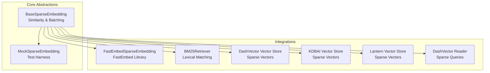
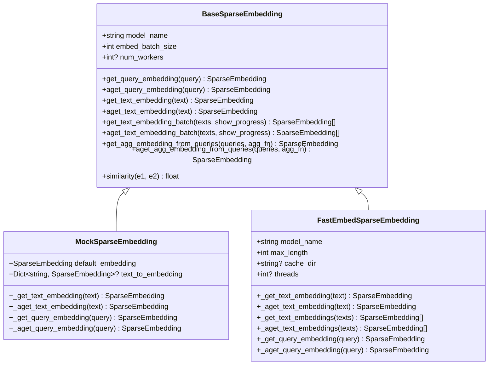
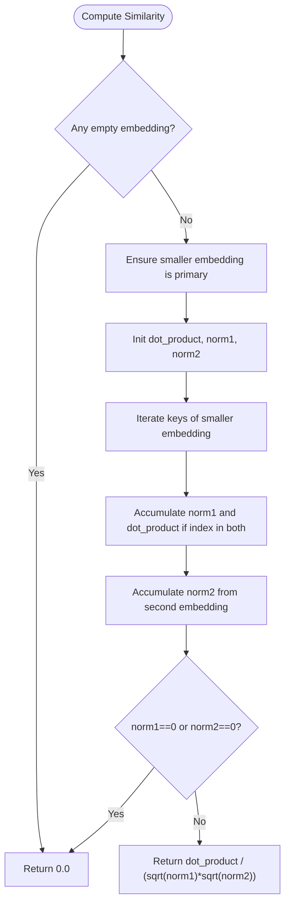
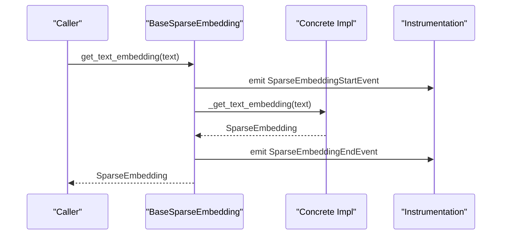
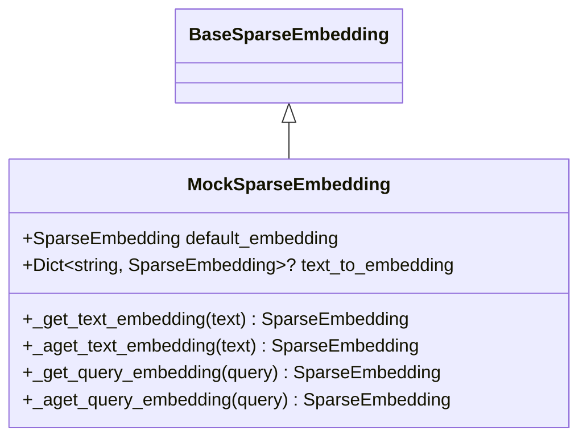
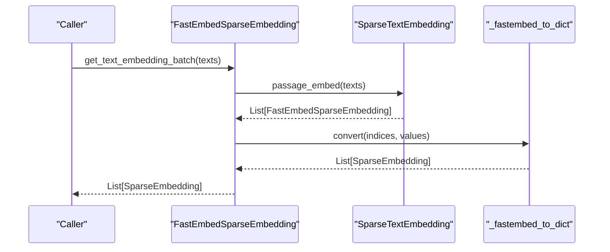
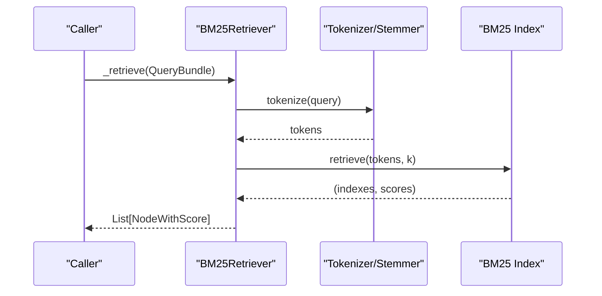
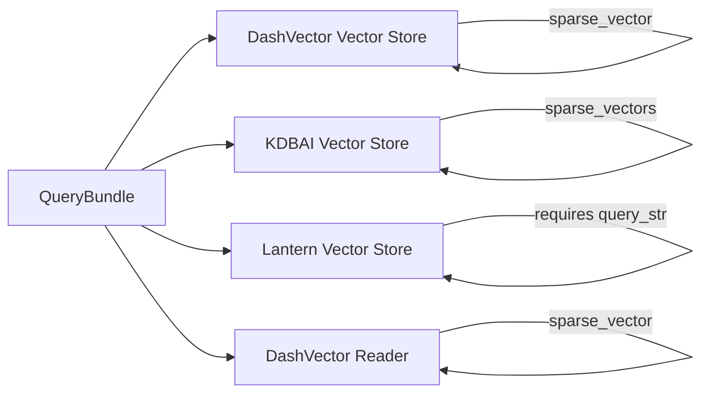
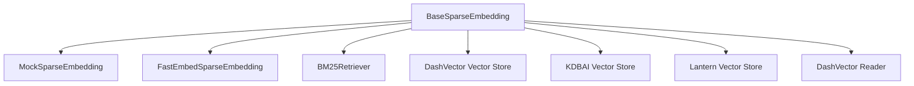

# Sparse Embeddings

<cite>
**Referenced Files in This Document**
- [base_sparse.py](file://llama-index-core/llama_index/core/base/embeddings/base_sparse.py)
- [mock_sparse_embedding.py](file://llama-index-core/llama_index/core/sparse_embeddings/mock_sparse_embedding.py)
- [test_mock_sparse_embeddings.py](file://llama-index-core/tests/sparse_embeddings/test_mock_sparse_embeddings.py)
- [base.py](file://llama-index-integrations/sparse_embeddings/llama-index-sparse-embeddings-fastembed/llama_index/sparse_embeddings/fastembed/base.py)
- [test_sparse_embeddings_fastembed.py](file://llama-index-integrations/sparse_embeddings/llama-index-sparse-embeddings-fastembed/tests/test_sparse_embeddings_fastembed.py)
- [base.py](file://llama-index-integrations/retrievers/llama-index-retrievers-bm25/llama_index/retrievers/bm25/base.py)
- [base.py](file://llama-index-integrations/vector_stores/llama-index-vector-stores-dashvector/llama_index/vector_stores/dashvector/base.py)
- [base.py](file://llama-index-integrations/vector_stores/llama-index-vector-stores-kdbai/llama_index/vector_stores/kdbai/base.py)
- [base.py](file://llama-index-integrations/vector_stores/llama-index-vector-stores-lantern/llama_index/vector_stores/lantern/base.py)
- [base.py](file://llama-index-integrations/readers/llama-index-readers-dashvector/llama_index/readers/dashvector/base.py)
</cite>

## Table of Contents
1. [Introduction](#introduction)
2. [Project Structure](#project-structure)
3. [Core Components](#core-components)
4. [Architecture Overview](#architecture-overview)
5. [Detailed Component Analysis](#detailed-component-analysis)
6. [Dependency Analysis](#dependency-analysis)
7. [Performance Considerations](#performance-considerations)
8. [Troubleshooting Guide](#troubleshooting-guide)
9. [Conclusion](#conclusion)
10. [Appendices](#appendices)

## Introduction
This document explains sparse embeddings in the context of retrieval systems. It covers the concept of sparse vector representations, their advantages over dense embeddings, and practical use cases such as lexical matching and hybrid retrieval. It documents the core sparse embedding abstractions, similarity computation, and batch processing utilities. It also describes integration points with sparse-capable retrievers and vector stores, including BM25-based retrieval and vector databases that support sparse vectors. Guidance is included on building custom sparse embedding models, optimizing storage and query performance, and combining sparse and dense embeddings for robust hybrid strategies.

## Project Structure
The repository organizes sparse embeddings around a core abstraction and several integrations:
- Core abstraction and utilities for sparse embeddings
- A mock implementation for testing
- An integration with a fast sparse embedding library
- Retrievers optimized for sparse/lexical matching
- Vector stores and readers supporting sparse vectors

**Diagram sources**
- [base_sparse.py](file://llama-index-core/llama_index/core/base/embeddings/base_sparse.py#L74-L354)
- [mock_sparse_embedding.py](file://llama-index-core/llama_index/core/sparse_embeddings/mock_sparse_embedding.py#L10-L43)
- [base.py](file://llama-index-integrations/sparse_embeddings/llama-index-sparse-embeddings-fastembed/llama_index/sparse_embeddings/fastembed/base.py#L15-L120)
- [base.py](file://llama-index-integrations/retrievers/llama-index-retrievers-bm25/llama_index/retrievers/bm25/base.py#L41-L254)
- [base.py](file://llama-index-integrations/vector_stores/llama-index-vector-stores-dashvector/llama_index/vector_stores/dashvector/base.py#L57-L207)
- [base.py](file://llama-index-integrations/vector_stores/llama-index-vector-stores-kdbai/llama_index/vector_stores/kdbai/base.py#L219-L221)
- [base.py](file://llama-index-integrations/vector_stores/llama-index-vector-stores-lantern/llama_index/vector_stores/lantern/base.py#L485-L485)
- [base.py](file://llama-index-integrations/readers/llama-index-readers-dashvector/llama_index/readers/dashvector/base.py#L40-L76)

**Section sources**
- [base_sparse.py](file://llama-index-core/llama_index/core/base/embeddings/base_sparse.py#L1-L354)
- [base.py](file://llama-index-integrations/sparse_embeddings/llama-index-sparse-embeddings-fastembed/llama_index/sparse_embeddings/fastembed/base.py#L1-L120)
- [base.py](file://llama-index-integrations/retrievers/llama-index-retrievers-bm25/llama_index/retrievers/bm25/base.py#L1-L254)
- [base.py](file://llama-index-integrations/vector_stores/llama-index-vector-stores-dashvector/llama_index/vector_stores/dashvector/base.py#L57-L207)
- [base.py](file://llama-index-integrations/vector_stores/llama-index-vector-stores-kdbai/llama_index/vector_stores/kdbai/base.py#L219-L221)
- [base.py](file://llama-index-integrations/vector_stores/llama-index-vector-stores-lantern/llama_index/vector_stores/lantern/base.py#L485-L485)
- [base.py](file://llama-index-integrations/readers/llama-index-readers-dashvector/llama_index/readers/dashvector/base.py#L40-L76)

## Core Components
- Sparse embedding type: a dictionary mapping integer indices to float values representing non-zero entries.
- Similarity function: computes cosine similarity between two sparse embeddings by iterating over the smaller set and computing dot product and norms efficiently.
- Aggregation function: computes the mean of multiple sparse embeddings by summing values per index and normalizing.
- BaseSparseEmbedding: abstract interface defining synchronous/asynchronous text and query embedding methods, batch processing, and similarity.

Key capabilities:
- Synchronous and asynchronous embedding for text and queries
- Batch embedding with configurable batch size and optional worker concurrency
- Aggregation helpers for multi-query embeddings
- Instrumented spans for embedding lifecycle events

**Section sources**
- [base_sparse.py](file://llama-index-core/llama_index/core/base/embeddings/base_sparse.py#L28-L354)

## Architecture Overview
The sparse embedding architecture centers on a shared abstraction that enables pluggable implementations and downstream consumers such as retrievers and vector stores.

**Diagram sources**
- [base_sparse.py](file://llama-index-core/llama_index/core/base/embeddings/base_sparse.py#L74-L354)
- [mock_sparse_embedding.py](file://llama-index-core/llama_index/core/sparse_embeddings/mock_sparse_embedding.py#L10-L43)
- [base.py](file://llama-index-integrations/sparse_embeddings/llama-index-sparse-embeddings-fastembed/llama_index/sparse_embeddings/fastembed/base.py#L15-L120)

## Detailed Component Analysis

### Sparse Similarity and Aggregation
- Similarity: Uses the smaller embedding as the iteration set, computes norms incrementally, and accumulates dot products only for common indices to minimize cost.
- Aggregation: Averages non-zero values across indices for multiple embeddings.

**Diagram sources**
- [base_sparse.py](file://llama-index-core/llama_index/core/base/embeddings/base_sparse.py#L31-L58)

**Section sources**
- [base_sparse.py](file://llama-index-core/llama_index/core/base/embeddings/base_sparse.py#L31-L72)

### BaseSparseEmbedding API and Batching
- Methods for synchronous and asynchronous text/query embedding
- Batch APIs with progress reporting and optional worker concurrency
- Aggregation helpers for multi-query scenarios
- Instrumentation spans for embedding lifecycle

**Diagram sources**
- [base_sparse.py](file://llama-index-core/llama_index/core/base/embeddings/base_sparse.py#L203-L240)

**Section sources**
- [base_sparse.py](file://llama-index-core/llama_index/core/base/embeddings/base_sparse.py#L107-L173)
- [base_sparse.py](file://llama-index-core/llama_index/core/base/embeddings/base_sparse.py#L183-L200)
- [base_sparse.py](file://llama-index-core/llama_index/core/base/embeddings/base_sparse.py#L242-L279)
- [base_sparse.py](file://llama-index-core/llama_index/core/base/embeddings/base_sparse.py#L281-L345)

### MockSparseEmbedding
- Provides a deterministic mapping from text to sparse embeddings for testing
- Returns a default embedding when a lookup is not found
- Supports sync and async embedding calls

**Diagram sources**
- [mock_sparse_embedding.py](file://llama-index-core/llama_index/core/sparse_embeddings/mock_sparse_embedding.py#L10-L43)
- [base_sparse.py](file://llama-index-core/llama_index/core/base/embeddings/base_sparse.py#L74-L106)

**Section sources**
- [mock_sparse_embedding.py](file://llama-index-core/llama_index/core/sparse_embeddings/mock_sparse_embedding.py#L1-L43)
- [test_mock_sparse_embeddings.py](file://llama-index-core/tests/sparse_embeddings/test_mock_sparse_embeddings.py#L1-L80)

### FastEmbedSparseEmbedding
- Integrates with a fast sparse embedding library to produce sparse vectors
- Converts library-specific sparse results into the internal dictionary format
- Supports both passage and query embeddings

**Diagram sources**
- [base.py](file://llama-index-integrations/sparse_embeddings/llama-index-sparse-embeddings-fastembed/llama_index/sparse_embeddings/fastembed/base.py#L100-L109)
- [base.py](file://llama-index-integrations/sparse_embeddings/llama-index-sparse-embeddings-fastembed/llama_index/sparse_embeddings/fastembed/base.py#L86-L98)

**Section sources**
- [base.py](file://llama-index-integrations/sparse_embeddings/llama-index-sparse-embeddings-fastembed/llama_index/sparse_embeddings/fastembed/base.py#L15-L120)
- [test_sparse_embeddings_fastembed.py](file://llama-index-integrations/sparse_embeddings/llama-index-sparse-embeddings-fastembed/tests/test_sparse_embeddings_fastembed.py#L1-L33)

### BM25 Retrieval
- Lexical matching via BM25 over tokenized corpus
- Supports stemming, stopword removal, and metadata filtering
- Persists and loads BM25 index and retriever configuration

**Diagram sources**
- [base.py](file://llama-index-integrations/retrievers/llama-index-retrievers-bm25/llama_index/retrievers/bm25/base.py#L222-L253)

**Section sources**
- [base.py](file://llama-index-integrations/retrievers/llama-index-retrievers-bm25/llama_index/retrievers/bm25/base.py#L41-L254)

### Vector Stores with Sparse Support
- DashVector vector store supports sparse vectors and can combine dense and sparse queries
- KDBAI vector store accepts sparse vectors alongside dense vectors
- Lantern vector store enforces presence of query strings for sparse vector queries
- DashVector reader supports sparse vector queries

**Diagram sources**
- [base.py](file://llama-index-integrations/vector_stores/llama-index-vector-stores-dashvector/llama_index/vector_stores/dashvector/base.py#L143-L207)
- [base.py](file://llama-index-integrations/vector_stores/llama-index-vector-stores-kdbai/llama_index/vector_stores/kdbai/base.py#L219-L221)
- [base.py](file://llama-index-integrations/vector_stores/llama-index-vector-stores-lantern/llama_index/vector_stores/lantern/base.py#L485-L485)
- [base.py](file://llama-index-integrations/readers/llama-index-readers-dashvector/llama_index/readers/dashvector/base.py#L40-L76)

**Section sources**
- [base.py](file://llama-index-integrations/vector_stores/llama-index-vector-stores-dashvector/llama_index/vector_stores/dashvector/base.py#L57-L207)
- [base.py](file://llama-index-integrations/vector_stores/llama-index-vector-stores-kdbai/llama_index/vector_stores/kdbai/base.py#L219-L221)
- [base.py](file://llama-index-integrations/vector_stores/llama-index-vector-stores-lantern/llama_index/vector_stores/lantern/base.py#L485-L485)
- [base.py](file://llama-index-integrations/readers/llama-index-readers-dashvector/llama_index/readers/dashvector/base.py#L40-L76)

## Dependency Analysis
- BaseSparseEmbedding defines the contract consumed by all sparse embedding implementations and downstream components.
- FastEmbedSparseEmbedding depends on an external sparse embedding library and converts outputs to the internal format.
- BM25Retriever depends on a tokenization/stemming library and maintains an index of tokenized corpus.
- Vector stores and readers depend on the sparse embedding format and may combine sparse with dense signals.

**Diagram sources**
- [base_sparse.py](file://llama-index-core/llama_index/core/base/embeddings/base_sparse.py#L74-L354)
- [mock_sparse_embedding.py](file://llama-index-core/llama_index/core/sparse_embeddings/mock_sparse_embedding.py#L10-L43)
- [base.py](file://llama-index-integrations/sparse_embeddings/llama-index-sparse-embeddings-fastembed/llama_index/sparse_embeddings/fastembed/base.py#L15-L120)
- [base.py](file://llama-index-integrations/retrievers/llama-index-retrievers-bm25/llama_index/retrievers/bm25/base.py#L41-L254)
- [base.py](file://llama-index-integrations/vector_stores/llama-index-vector-stores-dashvector/llama_index/vector_stores/dashvector/base.py#L57-L207)
- [base.py](file://llama-index-integrations/vector_stores/llama-index-vector-stores-kdbai/llama_index/vector_stores/kdbai/base.py#L219-L221)
- [base.py](file://llama-index-integrations/vector_stores/llama-index-vector-stores-lantern/llama_index/vector_stores/lantern/base.py#L485-L485)
- [base.py](file://llama-index-integrations/readers/llama-index-readers-dashvector/llama_index/readers/dashvector/base.py#L40-L76)

**Section sources**
- [base_sparse.py](file://llama-index-core/llama_index/core/base/embeddings/base_sparse.py#L74-L354)
- [base.py](file://llama-index-integrations/sparse_embeddings/llama-index-sparse-embeddings-fastembed/llama_index/sparse_embeddings/fastembed/base.py#L15-L120)
- [base.py](file://llama-index-integrations/retrievers/llama-index-retrievers-bm25/llama_index/retrievers/bm25/base.py#L41-L254)
- [base.py](file://llama-index-integrations/vector_stores/llama-index-vector-stores-dashvector/llama_index/vector_stores/dashvector/base.py#L57-L207)
- [base.py](file://llama-index-integrations/vector_stores/llama-index-vector-stores-kdbai/llama_index/vector_stores/kdbai/base.py#L219-L221)
- [base.py](file://llama-index-integrations/vector_stores/llama-index-vector-stores-lantern/llama_index/vector_stores/lantern/base.py#L485-L485)
- [base.py](file://llama-index-integrations/readers/llama-index-readers-dashvector/llama_index/readers/dashvector/base.py#L40-L76)

## Performance Considerations
- Sparsity benefits:
  - Lower memory footprint for stored embeddings
  - Efficient similarity computation by iterating over the smaller embedding and common indices
  - Fast batch processing with configurable batch sizes and optional worker concurrency
- Practical tips:
  - Prefer smaller batch sizes for latency-sensitive workloads
  - Use aggregation judiciously; mean aggregation is O(N*I) where N is number of embeddings and I is number of non-zero indices
  - Leverage BM25 for lexical matching when recall over keywords is desired
  - Combine sparse and dense embeddings to improve robustness and coverage

[No sources needed since this section provides general guidance]

## Troubleshooting Guide
- Empty or zero-norm embeddings:
  - Similarity returns zero when either embedding is empty or has zero norm
- Missing lookups in mock:
  - If a text is not found in the mapping, the default embedding is returned
- BM25 k constraint:
  - If requested top-k exceeds the number of indexed documents, the retriever adjusts k or raises an error
- Vector store constraints:
  - Some stores require a query string for sparse vector queries

**Section sources**
- [base_sparse.py](file://llama-index-core/llama_index/core/base/embeddings/base_sparse.py#L36-L58)
- [mock_sparse_embedding.py](file://llama-index-core/llama_index/core/sparse_embeddings/mock_sparse_embedding.py#L27-L30)
- [base.py](file://llama-index-integrations/retrievers/llama-index-retrievers-bm25/llama_index/retrievers/bm25/base.py#L114-L126)
- [base.py](file://llama-index-integrations/vector_stores/llama-index-vector-stores-lantern/llama_index/vector_stores/lantern/base.py#L485-L485)

## Conclusion
Sparse embeddings offer a memory-efficient and effective representation for retrieval tasks, especially for lexical matching and keyword-focused queries. The core abstraction provides a unified interface for embedding generation, batch processing, and similarity computation. Integrations with BM25 retrieval and sparse-capable vector stores enable flexible architectures ranging from pure lexical matching to hybrid dense-sparse retrieval. By leveraging the provided abstractions and integrations, developers can implement custom sparse embedding models, optimize storage and query performance, and build robust retrieval systems.

[No sources needed since this section summarizes without analyzing specific files]

## Appendices

### Working with Sparse Vectors
- Compute similarity between two sparse embeddings using the provided function
- Aggregate multiple embeddings using the mean aggregator
- Generate batches of embeddings with progress reporting and optional concurrency

**Section sources**
- [base_sparse.py](file://llama-index-core/llama_index/core/base/embeddings/base_sparse.py#L31-L72)
- [base_sparse.py](file://llama-index-core/llama_index/core/base/embeddings/base_sparse.py#L242-L279)
- [base_sparse.py](file://llama-index-core/llama_index/core/base/embeddings/base_sparse.py#L281-L345)

### Implementing Custom Sparse Embedding Models
- Extend the base class and implement synchronous and asynchronous embedding methods
- Support batch embedding if the underlying model allows it
- Convert model-specific sparse outputs to the internal dictionary format

**Section sources**
- [base_sparse.py](file://llama-index-core/llama_index/core/base/embeddings/base_sparse.py#L107-L113)
- [base_sparse.py](file://llama-index-core/llama_index/core/base/embeddings/base_sparse.py#L175-L181)
- [base_sparse.py](file://llama-index-core/llama_index/core/base/embeddings/base_sparse.py#L183-L200)
- [base_sparse.py](file://llama-index-core/llama_index/core/base/embeddings/base_sparse.py#L203-L240)

### Optimizing Sparse Embedding Storage
- Use sparse format to reduce memory usage
- Apply batch processing to amortize overhead
- Persist BM25 indices and retriever configurations for reuse

**Section sources**
- [base_sparse.py](file://llama-index-core/llama_index/core/base/embeddings/base_sparse.py#L242-L279)
- [base.py](file://llama-index-integrations/retrievers/llama-index-retrievers-bm25/llama_index/retrievers/bm25/base.py#L204-L220)

### Hybrid Dense-Sparse Strategies
- Combine dense and sparse embeddings in vector stores that support both modalities
- Use alpha blending or weighted fusion to balance dense and sparse signals
- Employ BM25 for lexical recall and dense embeddings for semantic recall

**Section sources**
- [base.py](file://llama-index-integrations/vector_stores/llama-index-vector-stores-dashvector/llama_index/vector_stores/dashvector/base.py#L143-L207)
- [base.py](file://llama-index-integrations/vector_stores/llama-index-vector-stores-kdbai/llama_index/vector_stores/kdbai/base.py#L219-L221)