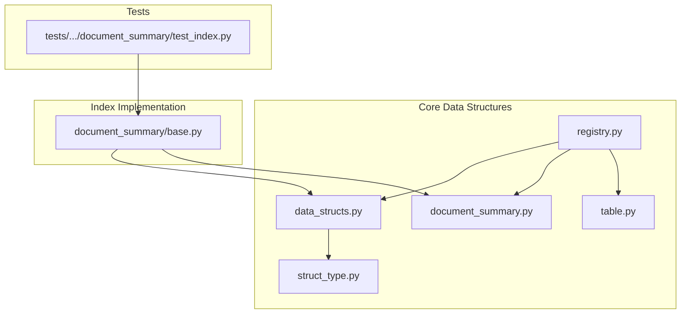
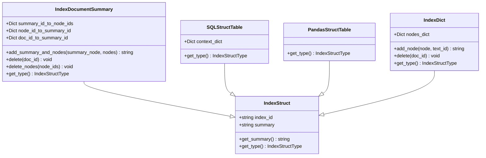
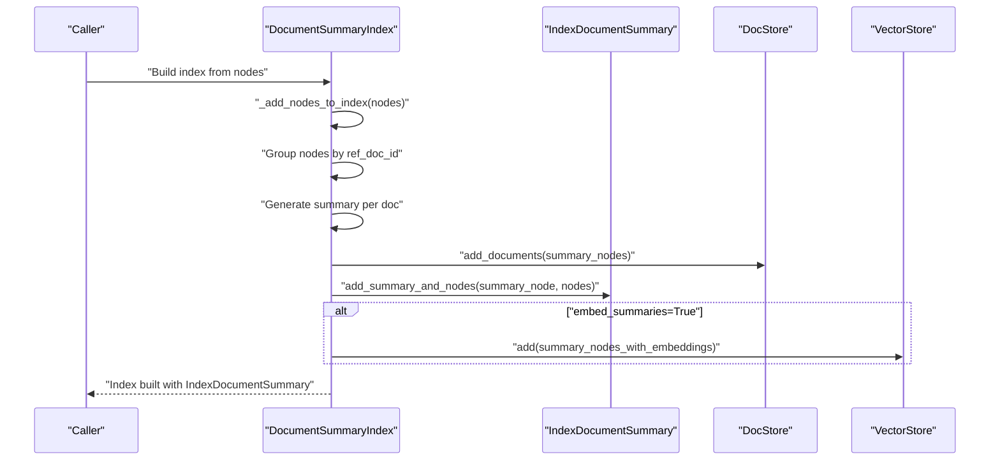
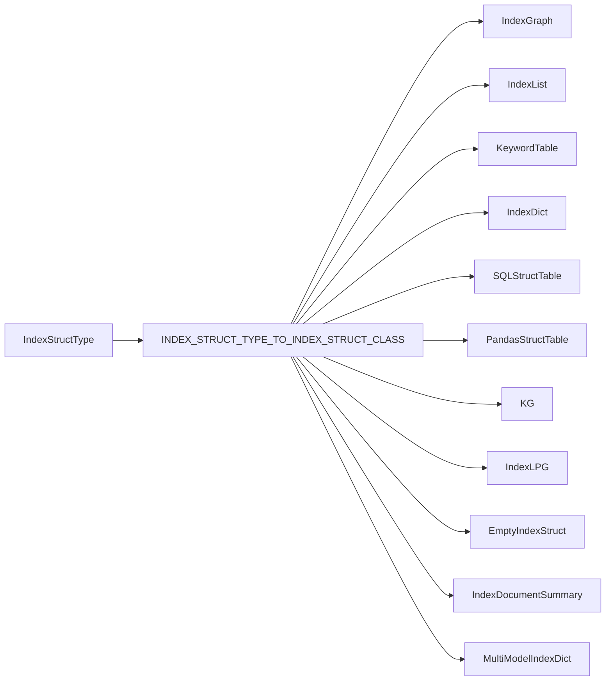

# Data Structures

<cite>
**Referenced Files in This Document**
- [data_structs.py](file://llama-index-core/llama_index/core/data_structs/data_structs.py)
- [document_summary.py](file://llama-index-core/llama_index/core/data_structs/document_summary.py)
- [table.py](file://llama-index-core/llama_index/core/data_structs/table.py)
- [registry.py](file://llama-index-core/llama_index/core/data_structs/registry.py)
- [struct_type.py](file://llama-index-core/llama_index/core/data_structs/struct_type.py)
- [base.py](file://llama-index-core/llama_index/core/indices/document_summary/base.py)
- [test_index.py](file://llama-index-core/tests/indices/document_summary/test_index.py)
</cite>

## Table of Contents
1. [Introduction](#introduction)
2. [Project Structure](#project-structure)
3. [Core Components](#core-components)
4. [Architecture Overview](#architecture-overview)
5. [Detailed Component Analysis](#detailed-component-analysis)
6. [Dependency Analysis](#dependency-analysis)
7. [Performance Considerations](#performance-considerations)
8. [Troubleshooting Guide](#troubleshooting-guide)
9. [Conclusion](#conclusion)

## Introduction
This document explains the Index Data Structures in LlamaIndex. It focuses on the IndexStruct base class, concrete data structure types (DocumentSummary, Table, IndexDict), structure registration patterns, and how these structures map to index types. It also covers serialization mechanisms via dataclasses and JSON mixins, storage requirements, practical creation during index construction, and operational usage. Guidance is included for selecting appropriate structures, optimizing memory, and migrating between structure types.

## Project Structure
The data structures live under the core data_structs package and are complemented by index implementations and tests that demonstrate usage patterns.

**Diagram sources**
- [data_structs.py](file://llama-index-core/llama_index/core/data_structs/data_structs.py#L1-L280)
- [document_summary.py](file://llama-index-core/llama_index/core/data_structs/document_summary.py#L1-L75)
- [table.py](file://llama-index-core/llama_index/core/data_structs/table.py#L1-L45)
- [registry.py](file://llama-index-core/llama_index/core/data_structs/registry.py#L1-L33)
- [struct_type.py](file://llama-index-core/llama_index/core/data_structs/struct_type.py#L1-L117)
- [base.py](file://llama-index-core/llama_index/core/indices/document_summary/base.py#L1-L318)
- [test_index.py](file://llama-index-core/tests/indices/document_summary/test_index.py#L1-L63)

**Section sources**
- [data_structs.py](file://llama-index-core/llama_index/core/data_structs/data_structs.py#L1-L280)
- [registry.py](file://llama-index-core/llama_index/core/data_structs/registry.py#L1-L33)
- [struct_type.py](file://llama-index-core/llama_index/core/data_structs/struct_type.py#L1-L117)

## Core Components
- IndexStruct: Base data structure with an auto-generated index identifier and optional summary. Provides a type interface for mapping to index types.
- IndexDocumentSummary: Stores mappings between document IDs and summary node IDs, and between individual node IDs and their summary node ID. Used by the Document Summary index.
- SQLStructTable and PandasStructTable: Structured table variants for storing structured outputs keyed by context or pandas-backed records.
- IndexDict: A dictionary-based index structure primarily used for vector store-backed indices; supports adding/deleting entries and returns a vector/text ID.
- Registry: Maps IndexStructType values to concrete IndexStruct classes, enabling dynamic instantiation and persistence.

Key characteristics:
- Serialization: Data structures are defined as dataclasses and use a JSON mixin for serialization/deserialization.
- Type identification: Each structure implements a static get_type method returning an IndexStructType value.
- Storage: Indexes persist their IndexStruct in an index store; vectors and embeddings are stored separately in a vector store when applicable.

**Section sources**
- [data_structs.py](file://llama-index-core/llama_index/core/data_structs/data_structs.py#L21-L280)
- [document_summary.py](file://llama-index-core/llama_index/core/data_structs/document_summary.py#L11-L75)
- [table.py](file://llama-index-core/llama_index/core/data_structs/table.py#L11-L45)
- [registry.py](file://llama-index-core/llama_index/core/data_structs/registry.py#L20-L32)
- [struct_type.py](file://llama-index-core/llama_index/core/data_structs/struct_type.py#L6-L117)

## Architecture Overview
The data structure architecture centers around a base class and a registry-driven mapping to index types. Index implementations construct and update their associated IndexStruct during ingestion and expose APIs to query and manage the stored metadata.

**Diagram sources**
- [data_structs.py](file://llama-index-core/llama_index/core/data_structs/data_structs.py#L21-L280)
- [document_summary.py](file://llama-index-core/llama_index/core/data_structs/document_summary.py#L11-L75)
- [table.py](file://llama-index-core/llama_index/core/data_structs/table.py#L19-L45)

## Detailed Component Analysis

### IndexStruct Base Class
- Purpose: Provides a common interface and identity for all index data structures.
- Fields: index_id (auto-generated UUID), summary (optional textual description).
- Methods: get_summary(), get_type() abstract method to be implemented by subclasses.
- Serialization: Inherits JSON serialization via a dataclass mixin, enabling persistence and transport.

Operational notes:
- The summary field is validated to be present before use; otherwise, an error is raised.
- Subclasses define their IndexStructType via get_type().

**Section sources**
- [data_structs.py](file://llama-index-core/llama_index/core/data_structs/data_structs.py#L21-L38)

### IndexDocumentSummary
- Purpose: Supports a Document Summary index by maintaining mappings between document IDs and summary node IDs, and between node IDs and summary node IDs.
- Mappings:
  - summary_id_to_node_ids: summary node ID -> list of underlying node IDs
  - node_id_to_summary_id: node ID -> summary node ID
  - doc_id_to_summary_id: document ID -> summary node ID
- Operations:
  - add_summary_and_nodes(): adds a summary node and its referenced nodes; returns summary node ID
  - delete(doc_id): removes a document and its nodes from all mappings
  - delete_nodes(node_ids): removes specific nodes from their summary mapping
- Type: DOCUMENT_SUMMARY

Usage in index construction:
- The Document Summary index builds summaries per document and updates IndexDocumentSummary accordingly.
- Embeddings for summaries can be computed and stored in a vector store when enabled.

**Section sources**
- [document_summary.py](file://llama-index-core/llama_index/core/data_structs/document_summary.py#L11-L75)
- [base.py](file://llama-index-core/llama_index/core/indices/document_summary/base.py#L152-L237)
- [test_index.py](file://llama-index-core/tests/indices/document_summary/test_index.py#L10-L63)

### SQLStructTable and PandasStructTable
- Purpose: Represent structured table data used by Struct Store indices.
- SQLStructTable: Stores a context dictionary keyed by identifiers.
- PandasStructTable: Provides a pandas-backed variant for tabular structured outputs.
- Type: SQL and PANDAS respectively.

Typical usage:
- Used by Struct Store indices to persist structured datapoints and their fields.

**Section sources**
- [table.py](file://llama-index-core/llama_index/core/data_structs/table.py#L19-L45)

### IndexDict
- Purpose: Dictionary-based index structure commonly used for vector store-backed indices.
- Behavior:
  - add_node(node, text_id): inserts a node and returns a vector/text ID
  - delete(doc_id): removes an entry by ID
- Type: VECTOR_STORE

Memory and performance:
- Efficient O(1) average-time operations for insertions and deletions.
- Suitable for large-scale vector retrieval scenarios.

**Section sources**
- [data_structs.py](file://llama-index-core/llama_index/core/data_structs/data_structs.py#L178-L215)

### Registry and Structure Registration
- INDEX_STRUCT_TYPE_TO_INDEX_STRUCT_CLASS: A mapping from IndexStructType values to concrete IndexStruct classes.
- Supported mappings include TREE, LIST, KEYWORD_TABLE, VECTOR_STORE, SQL, PANDAS, KG, SIMPLE_LPG, EMPTY, DOCUMENT_SUMMARY, MULTIMODAL_VECTOR_STORE.

Implications:
- Enables dynamic construction and deserialization of index structures based on their type.
- Centralized place to extend with new structure types.

**Section sources**
- [registry.py](file://llama-index-core/llama_index/core/data_structs/registry.py#L20-L32)
- [struct_type.py](file://llama-index-core/llama_index/core/data_structs/struct_type.py#L66-L117)

### Index Construction and Metadata Storage
- Document Summary index construction:
  - Groups nodes by document ID.
  - Generates a summary per document using a response synthesizer.
  - Persists summary nodes in the docstore and updates IndexDocumentSummary mappings.
  - Optionally embeds summaries and stores vectors in a vector store.
- Retrieval and deletion:
  - Retrieval uses mappings to resolve document summaries.
  - Deletion removes document-level or node-level mappings and cleans up vector store entries.

**Diagram sources**
- [base.py](file://llama-index-core/llama_index/core/indices/document_summary/base.py#L165-L237)
- [document_summary.py](file://llama-index-core/llama_index/core/data_structs/document_summary.py#L26-L49)

**Section sources**
- [base.py](file://llama-index-core/llama_index/core/indices/document_summary/base.py#L165-L237)
- [test_index.py](file://llama-index-core/tests/indices/document_summary/test_index.py#L10-L47)

### Data Structure Selection Criteria
- Document Summary index: Choose when you want to summarize entire documents and retrieve summaries for downstream tasks. Requires a response synthesizer and optionally embeddings.
- Structured tables (SQL/Pandas): Choose when your index needs to store structured outputs keyed by context or pandas records.
- Vector store-backed indices: Choose IndexDict for dictionary-style mappings; suitable for retrieval augmented generation (RAG) with vector similarity.
- Registry mapping: Use the registry to ensure the correct structure type is selected and persisted.

Guidance:
- Prefer IndexDict for vector store indices requiring fast lookups and deletions.
- Use IndexDocumentSummary when document-level summarization is part of the pipeline.
- Use SQLStructTable or PandasStructTable for structured data retrieval.

**Section sources**
- [registry.py](file://llama-index-core/llama_index/core/data_structs/registry.py#L20-L32)
- [struct_type.py](file://llama-index-core/llama_index/core/data_structs/struct_type.py#L66-L117)
- [base.py](file://llama-index-core/llama_index/core/indices/document_summary/base.py#L58-L107)

### Memory Optimization and Migration
- Memory optimization:
  - IndexDict offers O(1) average-time operations for insert/delete; keep only necessary node IDs to minimize memory footprint.
  - IndexDocumentSummary maintains multiple dictionaries; avoid unnecessary duplication by reusing summary nodes and minimizing redundant mappings.
  - For large datasets, prefer vector store-backed indices and offload embeddings to external stores.
- Migration:
  - To migrate between structure types, serialize the current IndexStruct and construct a new structure of the target type using the registry mapping.
  - Ensure compatibility of fields and relationships (e.g., summary mappings vs. vector mappings) before migration.

[No sources needed since this section provides general guidance]

## Dependency Analysis
The registry centralizes the mapping between IndexStructType and concrete classes, enabling polymorphic behavior across different index types.

**Diagram sources**
- [registry.py](file://llama-index-core/llama_index/core/data_structs/registry.py#L20-L32)
- [struct_type.py](file://llama-index-core/llama_index/core/data_structs/struct_type.py#L66-L117)

**Section sources**
- [registry.py](file://llama-index-core/llama_index/core/data_structs/registry.py#L20-L32)
- [struct_type.py](file://llama-index-core/llama_index/core/data_structs/struct_type.py#L66-L117)

## Performance Considerations
- IndexDict:
  - Fast insertions and deletions; suitable for high-throughput ingestion.
  - Keep node IDs minimal and avoid storing redundant metadata.
- IndexDocumentSummary:
  - Summary generation cost scales with number of documents and nodes per document.
  - Embedding summaries adds compute overhead; batch where possible.
- Structured tables:
  - SQLStructTable uses a dictionary; ensure keys are compact and context_dict remains lean.
  - PandasStructTable benefits from vectorized operations; maintain efficient dtypes.

[No sources needed since this section provides general guidance]

## Troubleshooting Guide
Common issues and resolutions:
- Missing summary in IndexStruct:
  - Symptom: An error is raised when accessing the summary before initialization.
  - Resolution: Ensure the summary field is populated before calling get_summary().
- ref_doc_id is None in Document Summary index:
  - Symptom: An error is raised during index construction when ref_doc_id is missing.
  - Resolution: Ensure nodes have a valid ref_doc_id before building the index.
- Deleting non-existent nodes:
  - Symptom: Warnings logged when attempting to delete nodes not present in the index.
  - Resolution: Verify node IDs against existing mappings before deletion.

**Section sources**
- [data_structs.py](file://llama-index-core/llama_index/core/data_structs/data_structs.py#L28-L32)
- [base.py](file://llama-index-core/llama_index/core/indices/document_summary/base.py#L172-L179)
- [base.py](file://llama-index-core/llama_index/core/indices/document_summary/base.py#L259-L264)

## Conclusion
LlamaIndex’s data structures provide a flexible, type-safe foundation for indexing and retrieval. The IndexStruct base class, combined with a registry-driven mapping, enables consistent construction and persistence of index metadata. IndexDocumentSummary, SQLStructTable, PandasStructTable, and IndexDict serve distinct use cases—document summarization, structured data, and vector store-backed retrieval—respectively. By understanding their selection criteria, leveraging serialization, and applying memory optimization and migration strategies, developers can build efficient and maintainable RAG systems.