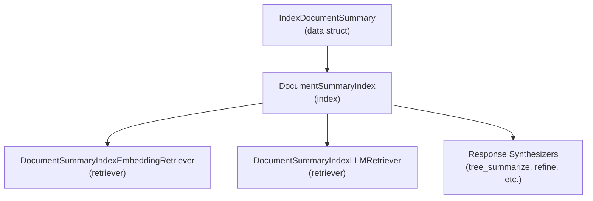
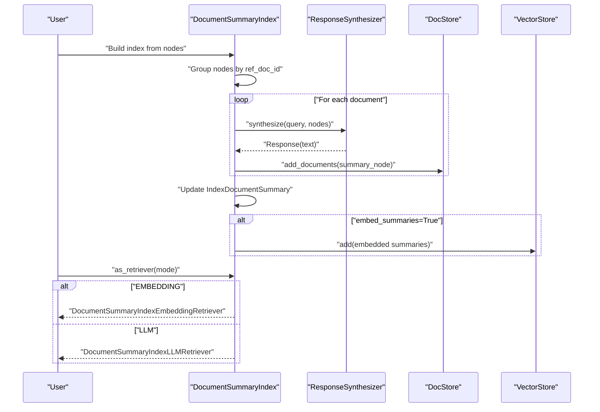
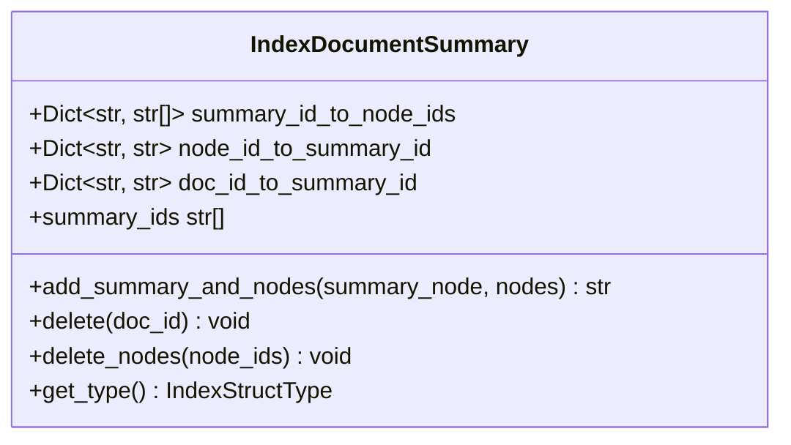
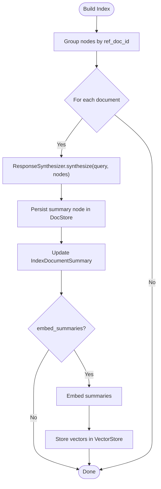
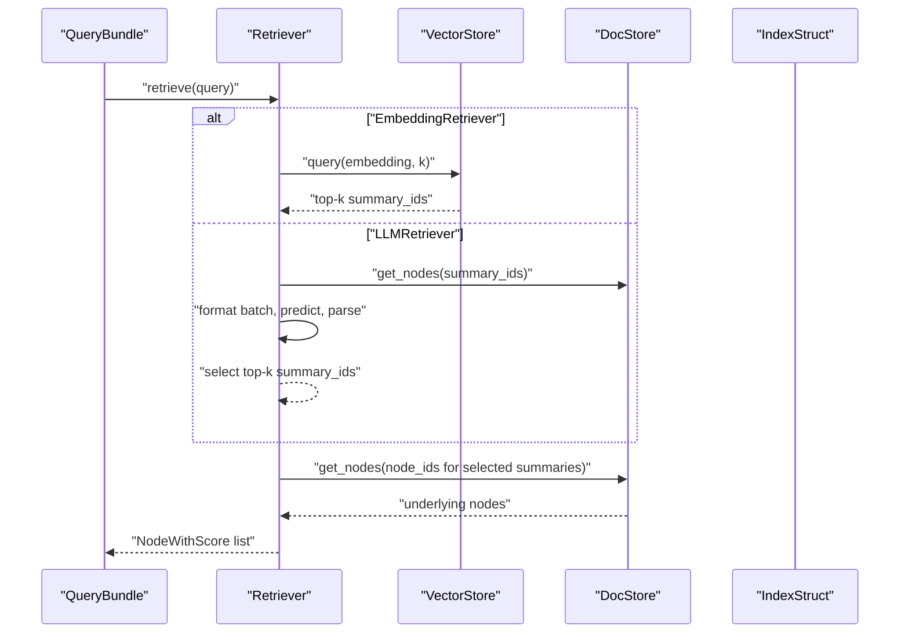
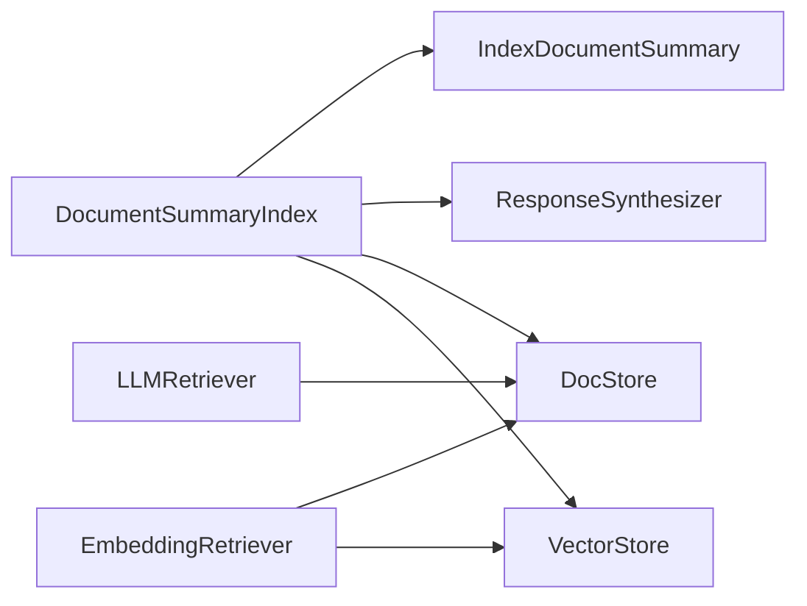

# Document Summary Indexes

<cite>
**Referenced Files in This Document**
- [document_summary.py](file://llama-index-core/llama_index/core/data_structs/document_summary.py)
- [base.py](file://llama-index-core/llama_index/core/indices/document_summary/base.py)
- [retrievers.py](file://llama-index-core/llama_index/core/indices/document_summary/retrievers.py)
- [__init__.py](file://llama-index-core/llama_index/core/indices/document_summary/__init__.py)
- [test_index.py](file://llama-index-core/tests/indices/document_summary/test_index.py)
- [test_retrievers.py](file://llama-index-core/tests/indices/document_summary/test_retrievers.py)
- [tree_summarize.py](file://llama-index-core/llama_index/core/response_synthesizers/tree_summarize.py)
- [simple_summarize.py](file://llama-index-core/llama_index/core/response_synthesizers/simple_summarize.py)
- [refine.py](file://llama-index-core/llama_index/core/response_synthesizers/refine.py)
- [accumulate.py](file://llama-index-core/llama_index/core/response_synthesizers/accumulate.py)
- [compact_and_refine.py](file://llama-index-core/llama_index/core/response_synthesizers/compact_and_refine.py)
- [compact_and_accumulate.py](file://llama-index-core/llama_index/core/response_synthesizers/compact_and_accumulate.py)
- [base.py](file://llama-index-core/llama_index/core/response_synthesizers/base.py)
- [factory.py](file://llama-index-core/llama_index/core/response_synthesizers/factory.py)
</cite>

## Table of Contents
1. [Introduction](#introduction)
2. [Project Structure](#project-structure)
3. [Core Components](#core-components)
4. [Architecture Overview](#architecture-overview)
5. [Detailed Component Analysis](#detailed-component-analysis)
6. [Dependency Analysis](#dependency-analysis)
7. [Performance Considerations](#performance-considerations)
8. [Troubleshooting Guide](#troubleshooting-guide)
9. [Conclusion](#conclusion)
10. [Appendices](#appendices)

## Introduction
This document explains LlamaIndex’s document summary indexing approach and related retrieval mechanisms. It focuses on:
- The DocumentSummaryIndex implementation and its data structure
- Retrieval modes (embedding-based and LLM-based)
- Summarization strategies and response synthesizers used under the hood
- Practical guidance for creating summary indexes, configuring summarization, and formatting outputs
- Advanced topics such as iterative summarization, multi-document summarization, and integration with retrieval systems
- Optimization tips and troubleshooting for summarization quality

## Project Structure
The document summary index lives in the indices module and leverages response synthesizers and retrievers. The core files are:
- Data structure: IndexDocumentSummary
- Index: DocumentSummaryIndex
- Retrievers: embedding-based and LLM-based
- Tests: coverage of index behavior and retriever modes

**Diagram sources**
- [document_summary.py](file://llama-index-core/llama_index/core/data_structs/document_summary.py#L11-L75)
- [base.py](file://llama-index-core/llama_index/core/indices/document_summary/base.py#L58-L318)
- [retrievers.py](file://llama-index-core/llama_index/core/indices/document_summary/retrievers.py#L29-L196)
- [tree_summarize.py](file://llama-index-core/llama_index/core/response_synthesizers/tree_summarize.py)
- [refine.py](file://llama-index-core/llama_index/core/response_synthesizers/refine.py)

**Section sources**
- [__init__.py](file://llama-index-core/llama_index/core/indices/document_summary/__init__.py#L1-L21)
- [document_summary.py](file://llama-index-core/llama_index/core/data_structs/document_summary.py#L1-L75)
- [base.py](file://llama-index-core/llama_index/core/indices/document_summary/base.py#L1-L318)
- [retrievers.py](file://llama-index-core/llama_index/core/indices/document_summary/retrievers.py#L1-L196)

## Core Components
- IndexDocumentSummary: Stores mappings between summary node IDs and underlying document node IDs, and vice versa, plus a mapping from document ID to summary ID.
- DocumentSummaryIndex: Builds per-document summaries, stores them, and supports retrieval via embedding or LLM selection.
- Retrievers:
  - Embedding-based: Uses vector similarity on embedded summaries.
  - LLM-based: Batches summaries and asks an LLM to choose the most relevant ones.

Key behaviors:
- Per-document summarization using a configured response synthesizer
- Optional embedding of summaries for vector retrieval
- Deletion support for entire documents and individual nodes
- Retrieval returns the underlying nodes linked to selected summaries

**Section sources**
- [document_summary.py](file://llama-index-core/llama_index/core/data_structs/document_summary.py#L11-L75)
- [base.py](file://llama-index-core/llama_index/core/indices/document_summary/base.py#L58-L318)
- [retrievers.py](file://llama-index-core/llama_index/core/indices/document_summary/retrievers.py#L29-L196)

## Architecture Overview
The index orchestrates summarization and retrieval:
- Build phase: Group nodes by ref_doc_id, synthesize a summary per document, persist summary nodes, update index struct, optionally embed and store vectors
- Retrieve phase: Choose retriever mode, fetch candidate summaries, resolve to underlying nodes

**Diagram sources**
- [base.py](file://llama-index-core/llama_index/core/indices/document_summary/base.py#L165-L237)
- [tree_summarize.py](file://llama-index-core/llama_index/core/response_synthesizers/tree_summarize.py)
- [retrievers.py](file://llama-index-core/llama_index/core/indices/document_summary/retrievers.py#L124-L196)

## Detailed Component Analysis

### Data Structure: IndexDocumentSummary
- Maintains bidirectional mappings:
  - summary_id_to_node_ids: summary node ID -> list of underlying node IDs
  - node_id_to_summary_id: underlying node ID -> summary node ID
  - doc_id_to_summary_id: document ID -> summary node ID
- Supports adding a summary and associated nodes, deleting a whole document, and deleting specific nodes while keeping others

**Diagram sources**
- [document_summary.py](file://llama-index-core/llama_index/core/data_structs/document_summary.py#L11-L75)

**Section sources**
- [document_summary.py](file://llama-index-core/llama_index/core/data_structs/document_summary.py#L11-L75)

### Index: DocumentSummaryIndex
- Construction parameters:
  - response_synthesizer: defaults to a TREE_SUMMARIZE synthesizer
  - summary_query: default prompt guiding summarization
  - embed_summaries: whether to embed summaries for vector retrieval
- Build process:
  - Groups nodes by ref_doc_id
  - For each group, synthesizes a summary using the configured synthesizer and prompt
  - Persists summary nodes and updates the index struct
  - Optionally embeds summaries and stores vectors
- Retrieval:
  - as_retriever(mode=EMBEDDING|LLM) returns appropriate retriever
  - get_document_summary(doc_id) returns the stored summary text
- Deletion:
  - delete_ref_doc(doc_id) removes a document and its summary
  - delete_nodes(node_ids) removes nodes and prunes empty summaries

**Diagram sources**
- [base.py](file://llama-index-core/llama_index/core/indices/document_summary/base.py#L165-L237)

**Section sources**
- [base.py](file://llama-index-core/llama_index/core/indices/document_summary/base.py#L58-L318)

### Retrievers: Embedding vs LLM
- Embedding-based retriever:
  - Converts query to embedding if needed
  - Issues vector store query for top-k summaries
  - Resolves summary IDs to underlying nodes
- LLM-based retriever:
  - Batches summary nodes and formats them
  - Asks LLM to select relevant summaries and ranks them
  - Returns underlying nodes from chosen summaries

**Diagram sources**
- [retrievers.py](file://llama-index-core/llama_index/core/indices/document_summary/retrievers.py#L124-L196)
- [base.py](file://llama-index-core/llama_index/core/indices/document_summary/base.py#L112-L151)

**Section sources**
- [retrievers.py](file://llama-index-core/llama_index/core/indices/document_summary/retrievers.py#L29-L196)
- [test_retrievers.py](file://llama-index-core/tests/indices/document_summary/test_retrievers.py#L13-L35)

### Summarization Strategies and Response Synthesizers
DocumentSummaryIndex uses a response synthesizer to generate per-document summaries. The default is TREE_SUMMARIZE, but the index accepts any BaseSynthesizer. Common strategies include:
- Tree Summarize: Recursively summarize groups to produce a final summary
- Simple Summarize: Directly summarize all nodes
- Refine: Iteratively refine a draft summary with each node
- Accumulate: Collect information across nodes
- Compact variants: Combine compactness with refinement or accumulation

These strategies influence how much content is preserved and how the summary is constructed.

**Section sources**
- [base.py](file://llama-index-core/llama_index/core/indices/document_summary/base.py#L93-L95)
- [tree_summarize.py](file://llama-index-core/llama_index/core/response_synthesizers/tree_summarize.py)
- [simple_summarize.py](file://llama-index-core/llama_index/core/response_synthesizers/simple_summarize.py)
- [refine.py](file://llama-index-core/llama_index/core/response_synthesizers/refine.py)
- [accumulate.py](file://llama-index-core/llama_index/core/response_synthesizers/accumulate.py)
- [compact_and_refine.py](file://llama-index-core/llama_index/core/response_synthesizers/compact_and_refine.py)
- [compact_and_accumulate.py](file://llama-index-core/llama_index/core/response_synthesizers/compact_and_accumulate.py)
- [base.py](file://llama-index-core/llama_index/core/response_synthesizers/base.py)
- [factory.py](file://llama-index-core/llama_index/core/response_synthesizers/factory.py)

## Dependency Analysis
- DocumentSummaryIndex depends on:
  - IndexDocumentSummary for internal state
  - ResponseSynthesizer for generating summaries
  - DocStore for persistence of summary nodes
  - VectorStore for optional embedding-based retrieval
- Retrievers depend on:
  - DocStore to fetch summary and underlying nodes
  - VectorStore for embedding retriever
  - LLM for LLM retriever

**Diagram sources**
- [base.py](file://llama-index-core/llama_index/core/indices/document_summary/base.py#L58-L318)
- [retrievers.py](file://llama-index-core/llama_index/core/indices/document_summary/retrievers.py#L124-L196)
- [document_summary.py](file://llama-index-core/llama_index/core/data_structs/document_summary.py#L11-L75)

**Section sources**
- [base.py](file://llama-index-core/llama_index/core/indices/document_summary/base.py#L58-L318)
- [retrievers.py](file://llama-index-core/llama_index/core/indices/document_summary/retrievers.py#L124-L196)

## Performance Considerations
- Embedding summaries:
  - Enable embed_summaries to leverage vector similarity for scalable retrieval
  - Consider embedding model cost and latency
- Retrieval mode:
  - Embedding retriever scales better for large corpora
  - LLM retriever may be more accurate but is slower and costlier
- Batch sizes:
  - LLM retriever batching affects throughput and cost; tune choice_batch_size
- Progress reporting:
  - show_progress helps monitor long-running summarization tasks
- Vector store efficiency:
  - Ensure proper similarity_top_k and embedding dimensionality for optimal recall/latency trade-offs

[No sources needed since this section provides general guidance]

## Troubleshooting Guide
Common issues and resolutions:
- Missing ref_doc_id during build:
  - Symptom: ValueError indicating ref_doc_id cannot be None
  - Cause: Nodes were not attached to a document
  - Fix: Ensure nodes have ref_doc_id set before building the index
- Using embedding retriever without embeddings:
  - Symptom: ValueError stating embedding retriever requires embed_summaries=True
  - Fix: Set embed_summaries=True or switch to LLM retriever
- Retrieving a non-existent document:
  - Symptom: ValueError when calling get_document_summary for unknown doc_id
  - Fix: Verify doc_id exists in ref_doc_info or rebuild index
- Deleting nodes leaves dangling references:
  - Behavior: delete_nodes prunes empty summaries and deletes related documents if needed
  - Expected: After deletion, ref_doc_info shrinks accordingly

Validation references:
- Build-time ref_doc_id checks and progress display
- Embedding retriever precondition
- get_document_summary existence check
- Deletion behavior for nodes and documents

**Section sources**
- [base.py](file://llama-index-core/llama_index/core/indices/document_summary/base.py#L172-L179)
- [base.py](file://llama-index-core/llama_index/core/indices/document_summary/base.py#L134-L137)
- [base.py](file://llama-index-core/llama_index/core/indices/document_summary/base.py#L160-L163)
- [base.py](file://llama-index-core/llama_index/core/indices/document_summary/base.py#L246-L298)
- [test_index.py](file://llama-index-core/tests/indices/document_summary/test_index.py#L10-L63)
- [test_retrievers.py](file://llama-index-core/tests/indices/document_summary/test_retrievers.py#L13-L35)

## Conclusion
DocumentSummaryIndex provides a robust, GPT-powered summarization pipeline that maps per-document summaries to underlying nodes. It supports scalable retrieval via embeddings and flexible summarization strategies through response synthesizers. With careful configuration—especially around summarization mode, embedding, and retrieval batching—you can achieve efficient, high-quality document summarization and synthesis for use cases ranging from executive summaries to content synthesis.

[No sources needed since this section summarizes without analyzing specific files]

## Appendices

### Practical Examples and Guidance
- Creating a summary index:
  - Provide nodes grouped by document (ensure ref_doc_id is set)
  - Instantiate DocumentSummaryIndex with desired response synthesizer and summary_query
  - Optionally enable embed_summaries for vector retrieval
- Configuring summarization:
  - Choose a response synthesizer strategy (TREE_SUMMARIZE, SIMPLE_SUMMARIZE, REFINE, etc.)
  - Adjust prompt via summary_query to steer focus (e.g., topics, question coverage)
- Output formatting:
  - get_document_summary(doc_id) returns the synthesized summary text
  - Retrievers return NodeWithScore lists of underlying nodes; downstream formatting is application-specific
- Multi-document summarization:
  - The index builds one summary per ref_doc_id; retrieval aggregates nodes across documents as needed
- Integration with retrieval systems:
  - Use as_retriever(DocumentSummaryRetrieverMode.EMBEDDING) for vector-based retrieval
  - Use as_retriever(DocumentSummaryRetrieverMode.LLM) for LLM-driven selection

Validation references:
- Index behavior and assertions for summaries and ref_doc_info
- Retrieval mode selection and results

**Section sources**
- [test_index.py](file://llama-index-core/tests/indices/document_summary/test_index.py#L10-L24)
- [test_retrievers.py](file://llama-index-core/tests/indices/document_summary/test_retrievers.py#L13-L35)
- [base.py](file://llama-index-core/llama_index/core/indices/document_summary/base.py#L112-L151)
- [base.py](file://llama-index-core/llama_index/core/indices/document_summary/base.py#L152-L163)