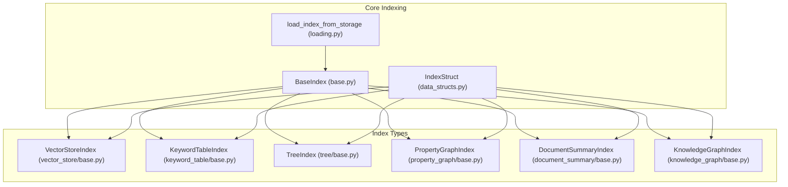
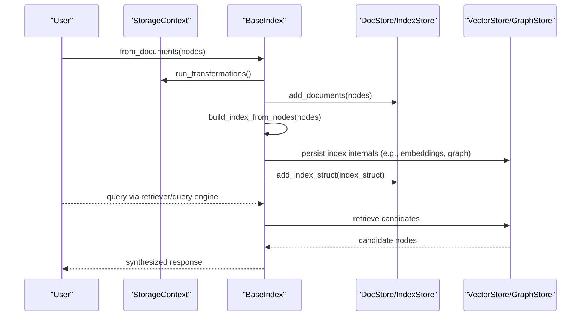
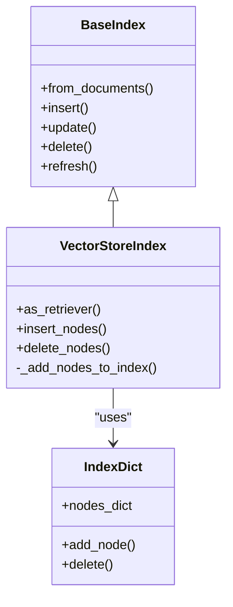
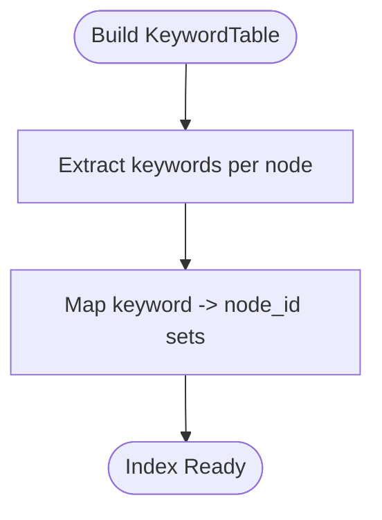
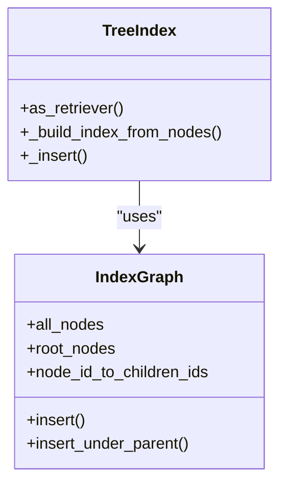
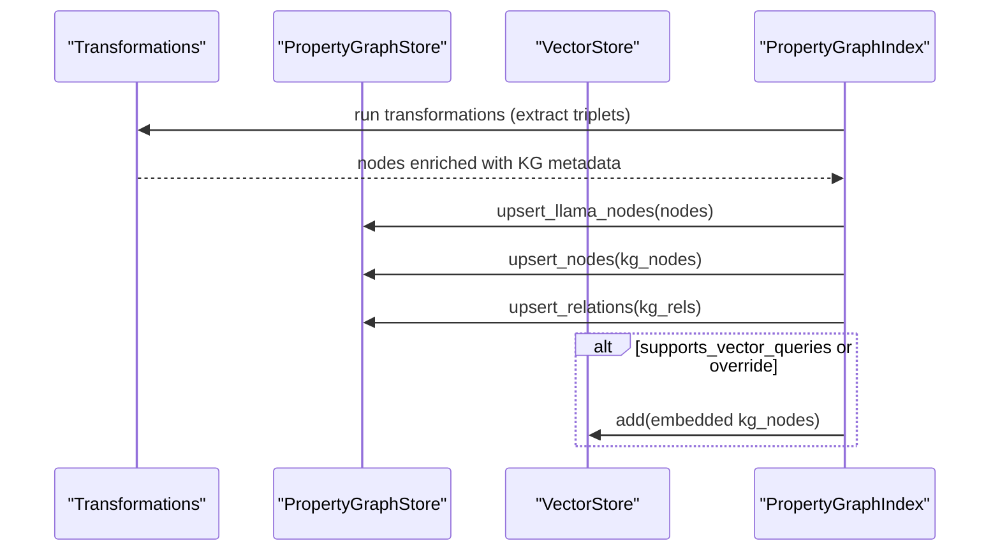
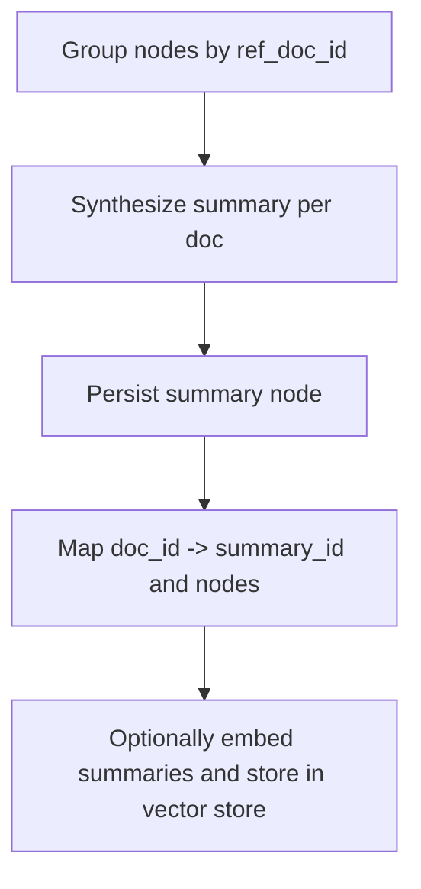
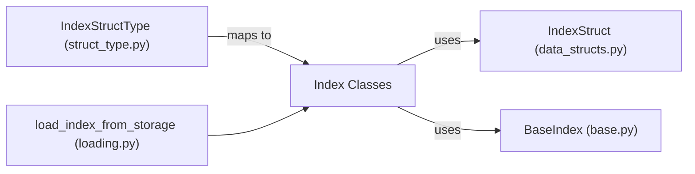

# Indexing Systems

<cite>
**Referenced Files in This Document**
- [data_structs.py](file://llama-index-core/llama_index/core/data_structs/data_structs.py)
- [struct_type.py](file://llama-index-core/llama_index/core/data_structs/struct_type.py)
- [base.py](file://llama-index-core/llama_index/core/indices/base.py)
- [loading.py](file://llama-index-core/llama_index/core/indices/loading.py)
- [vector_store/base.py](file://llama-index-core/llama_index/core/indices/vector_store/base.py)
- [keyword_table/base.py](file://llama-index-core/llama_index/core/indices/keyword_table/base.py)
- [tree/base.py](file://llama-index-core/llama_index/core/indices/tree/base.py)
- [knowledge_graph/base.py](file://llama-index-core/llama_index/core/indices/knowledge_graph/base.py)
- [document_summary/base.py](file://llama-index-core/llama_index/core/indices/document_summary/base.py)
- [property_graph/base.py](file://llama-index-core/llama_index/core/indices/property_graph/base.py)
- [_base.py](file://llama-index-integrations/vector_stores/llama-index-vector-stores-azurepostgresql/llama_index/vector_stores/azure_postgres/common/_base.py)
- [base.py](file://llama-index-integrations/vector_stores/llama-index-vector-stores-neo4jvector/llama_index/vector_stores/neo4jvector/base.py)
- [base.py](file://llama-index-integrations/vector_stores/llama-index-vector-stores-openGauss/llama_index/vector_stores/openGauss/base.py)
- [test_postgres.py](file://llama-index-integrations/vector_stores/llama-index-vector-stores-postgres/tests/test_postgres.py)
</cite>

## Table of Contents
1. [Introduction](#introduction)
2. [Project Structure](#project-structure)
3. [Core Components](#core-components)
4. [Architecture Overview](#architecture-overview)
5. [Detailed Component Analysis](#detailed-component-analysis)
6. [Dependency Analysis](#dependency-analysis)
7. [Performance Considerations](#performance-considerations)
8. [Troubleshooting Guide](#troubleshooting-guide)
9. [Conclusion](#conclusion)
10. [Appendices](#appendices)

## Introduction
This document explains LlamaIndex’s indexing systems across multiple index types: vector store indexes, keyword table indexes, tree structures, property graphs, and document summary indexes. It covers the underlying data structures, typical use cases, performance characteristics, and operational patterns for creating, loading, and managing indexes. It also includes guidance on hybrid indexing, distributed indexes, migration strategies, troubleshooting, and production best practices.

## Project Structure
LlamaIndex organizes index implementations around a shared base class and distinct index structs. Index creation and management leverage a storage context abstraction that coordinates the document store, index store, and vector/graph stores. Loading utilities reconstruct indices from persisted index structs.

```mermaid
graph TB
subgraph "Core Indexing"
Base["BaseIndex (base.py)"]
DS["IndexStruct (data_structs.py)"]
Loader["load_index_from_storage (loading.py)"]
end
subgraph "Index Types"
VS["VectorStoreIndex (vector_store/base.py)"]
KT["KeywordTableIndex (keyword_table/base.py)"]
TR["TreeIndex (tree/base.py)"]
PG["PropertyGraphIndex (property_graph/base.py)"]
DSIdx["DocumentSummaryIndex (document_summary/base.py)"]
KG["KnowledgeGraphIndex (knowledge_graph/base.py)"]
end
Base --> VS
Base --> KT
Base --> TR
Base --> PG
Base --> DSIdx
Base --> KG
DS --> VS
DS --> KT
DS --> TR
DS --> PG
DS --> DSIdx
DS --> KG
Loader --> Base
```

**Diagram sources**
- [base.py](file://llama-index-core/llama_index/core/indices/base.py#L25-L135)
- [data_structs.py](file://llama-index-core/llama_index/core/data_structs/data_structs.py#L21-L112)
- [loading.py](file://llama-index-core/llama_index/core/indices/loading.py#L12-L86)
- [vector_store/base.py](file://llama-index-core/llama_index/core/indices/vector_store/base.py#L36-L125)
- [keyword_table/base.py](file://llama-index-core/llama_index/core/indices/keyword_table/base.py#L43-L128)
- [tree/base.py](file://llama-index-core/llama_index/core/indices/tree/base.py#L39-L129)
- [property_graph/base.py](file://llama-index-core/llama_index/core/indices/property_graph/base.py#L43-L194)
- [document_summary/base.py](file://llama-index-core/llama_index/core/indices/document_summary/base.py#L58-L151)
- [knowledge_graph/base.py](file://llama-index-core/llama_index/core/indices/knowledge_graph/base.py#L42-L151)

**Section sources**
- [base.py](file://llama-index-core/llama_index/core/indices/base.py#L25-L135)
- [data_structs.py](file://llama-index-core/llama_index/core/data_structs/data_structs.py#L21-L112)
- [loading.py](file://llama-index-core/llama_index/core/indices/loading.py#L12-L86)

## Core Components
- BaseIndex: Provides lifecycle hooks for building, inserting, deleting, and refreshing documents; manages storage context and index struct persistence.
- IndexStruct: Lightweight data structures that represent index internals (e.g., graph, keyword table, list, dict, KG).
- Storage Context: Centralizes access to docstore, index store, vector store, and graph stores.
- Loading Utilities: Load a single index or a graph composed of multiple indices from persistent storage.

Key behaviors:
- Creation: from_documents pipeline runs transformations, then delegates to index-specific builders.
- Updates: insert/update/delete/refresh support incremental maintenance.
- Persistence: index structs are added to and retrieved from the index store.

**Section sources**
- [base.py](file://llama-index-core/llama_index/core/indices/base.py#L89-L130)
- [base.py](file://llama-index-core/llama_index/core/indices/base.py#L184-L209)
- [base.py](file://llama-index-core/llama_index/core/indices/base.py#L353-L411)
- [base.py](file://llama-index-core/llama_index/core/indices/base.py#L429-L481)
- [data_structs.py](file://llama-index-core/llama_index/core/data_structs/data_structs.py#L21-L112)
- [loading.py](file://llama-index-core/llama_index/core/indices/loading.py#L12-L86)

## Architecture Overview
The indexing architecture separates concerns:
- Index types encapsulate domain-specific logic (e.g., vector similarity, keyword matching, hierarchical summarization).
- Index structs define compact, serializable representations of index internals.
- Storage context mediates persistence and retrieval across stores.
- Retrievers and query engines consume indices to answer queries.

```mermaid
sequenceDiagram
participant U as "User"
participant Ctx as "StorageContext"
participant IDX as "BaseIndex"
participant DS as "DocStore/IndexStore"
participant VS as "VectorStore/GraphStore"
U->>IDX : from_documents(nodes)
IDX->>Ctx : run_transformations()
IDX->>DS : add_documents(nodes)
IDX->>IDX : build_index_from_nodes(nodes)
IDX->>VS : persist index internals (e.g., embeddings, graph)
IDX->>DS : add_index_struct(index_struct)
U-->>IDX : query via retriever/query engine
IDX->>VS : retrieve candidates
VS-->>IDX : candidate nodes
IDX-->>U : synthesized response
```

**Diagram sources**
- [base.py](file://llama-index-core/llama_index/core/indices/base.py#L89-L130)
- [base.py](file://llama-index-core/llama_index/core/indices/base.py#L184-L190)
- [vector_store/base.py](file://llama-index-core/llama_index/core/indices/vector_store/base.py#L260-L284)
- [loading.py](file://llama-index-core/llama_index/core/indices/loading.py#L12-L86)

## Detailed Component Analysis

### Vector Store Indexes
- Data structure: IndexDict mapping vector-store IDs to node IDs; optionally stores nodes in docstore depending on vector store capabilities.
- Use cases: Semantic search, hybrid retrieval, multi-modal retrieval.
- Performance: Batch embedding, async insertions, configurable batch sizes; vector store index selection impacts latency and recall.
- Management: Supports insert, delete, async variants, and refresh; integrates with external vector stores.

```mermaid
classDiagram
class BaseIndex {
+from_documents()
+insert()
+update()
+delete()
+refresh()
}
class VectorStoreIndex {
+as_retriever()
+insert_nodes()
+delete_nodes()
-_add_nodes_to_index()
}
class IndexDict {
+nodes_dict
+add_node()
+delete()
}
BaseIndex <|-- VectorStoreIndex
VectorStoreIndex --> IndexDict : "uses"
```

**Diagram sources**
- [base.py](file://llama-index-core/llama_index/core/indices/base.py#L25-L135)
- [vector_store/base.py](file://llama-index-core/llama_index/core/indices/vector_store/base.py#L36-L125)
- [data_structs.py](file://llama-index-core/llama_index/core/data_structs/data_structs.py#L179-L215)

Practical guidance:
- Choose vector stores that match workload (diskann, hnsw, ivfflat) and enable hybrid search when needed.
- Use async insertions and batching to improve throughput.
- For vector stores that do not store text, enable store_nodes_override to persist nodes in docstore.

**Section sources**
- [vector_store/base.py](file://llama-index-core/llama_index/core/indices/vector_store/base.py#L36-L125)
- [vector_store/base.py](file://llama-index-core/llama_index/core/indices/vector_store/base.py#L260-L356)
- [vector_store/base.py](file://llama-index-core/llama_index/core/indices/vector_store/base.py#L424-L486)
- [_base.py](file://llama-index-integrations/vector_stores/llama-index-vector-stores-azurepostgresql/llama_index/vector_stores/azure_postgres/common/_base.py#L286-L313)
- [base.py](file://llama-index-integrations/vector_stores/llama-index-vector-stores-neo4jvector/llama_index/vector_stores/neo4jvector/base.py#L56-L76)
- [base.py](file://llama-index-integrations/vector_stores/llama-index-vector-stores-openGauss/llama_index/vector_stores/openGauss/base.py#L108-L143)
- [test_postgres.py](file://llama-index-integrations/vector_stores/llama-index-vector-stores-postgres/tests/test_postgres.py#L1636-L1675)

### Keyword Table Indexes
- Data structure: KeywordTable mapping keywords to sets of node IDs.
- Use cases: Fast keyword-based retrieval; simple, low-latency filtering.
- Performance: O(k) lookup per keyword; aggregate matches across keywords; retrieval cost depends on number of matched nodes.
- Management: Extract keywords from nodes during build; supports multiple extractor modes (default, simple, RAKE).

```mermaid
flowchart TD
Start(["Build KeywordTable"]) --> Extract["Extract keywords per node"]
Extract --> Map["Map keyword -> node_id sets"]
Map --> End(["Index Ready"])
```

**Diagram sources**
- [keyword_table/base.py](file://llama-index-core/llama_index/core/indices/keyword_table/base.py#L138-L184)
- [data_structs.py](file://llama-index-core/llama_index/core/data_structs/data_structs.py#L116-L147)

**Section sources**
- [keyword_table/base.py](file://llama-index-core/llama_index/core/indices/keyword_table/base.py#L43-L128)
- [keyword_table/base.py](file://llama-index-core/llama_index/core/indices/keyword_table/base.py#L138-L207)

### Tree Structures (Hierarchical Summaries)
- Data structure: IndexGraph representing a tree of summarized nodes; maintains node-to-index mapping and parent-child relationships.
- Use cases: Hierarchical reasoning, selective leaf traversal, root-based synthesis.
- Performance: Traversal cost proportional to depth and branching factor; embedding-based leaf selection can reduce search space.
- Management: Build bottom-up; supports multiple retriever modes (select leaf, select leaf with embedding, all leaves, root).

```mermaid
classDiagram
class IndexGraph {
+all_nodes
+root_nodes
+node_id_to_children_ids
+insert()
+insert_under_parent()
}
class TreeIndex {
+as_retriever()
+_build_index_from_nodes()
+_insert()
}
TreeIndex --> IndexGraph : "uses"
```

**Diagram sources**
- [data_structs.py](file://llama-index-core/llama_index/core/data_structs/data_structs.py#L41-L112)
- [tree/base.py](file://llama-index-core/llama_index/core/indices/tree/base.py#L39-L129)

**Section sources**
- [tree/base.py](file://llama-index-core/llama_index/core/indices/tree/base.py#L39-L187)

### Property Graph Indexes
- Data structure: IndexLPG (lightweight); integrates labeled property graph store and optional vector store for hybrid retrieval.
- Use cases: Entity/relation reasoning, schema-aware querying, synonym expansion, vector augmentation.
- Performance: Depends on graph store capabilities and whether vector store is used; embedding of nodes and relations improves retrieval quality.
- Management: Extract triplets and properties via transformations; upsert nodes/relations; optional embedding and vector index population.

```mermaid
sequenceDiagram
participant T as "Transformations"
participant PG as "PropertyGraphStore"
participant VS as "VectorStore"
participant IDX as "PropertyGraphIndex"
IDX->>T : run transformations (extract triplets)
T-->>IDX : nodes enriched with KG metadata
IDX->>PG : upsert_llama_nodes(nodes)
IDX->>PG : upsert_nodes(kg_nodes)
IDX->>PG : upsert_relations(kg_rels)
alt supports_vector_queries or override
IDX->>VS : add(embedded kg_nodes)
end
```

**Diagram sources**
- [property_graph/base.py](file://llama-index-core/llama_index/core/indices/property_graph/base.py#L195-L331)

**Section sources**
- [property_graph/base.py](file://llama-index-core/llama_index/core/indices/property_graph/base.py#L43-L194)
- [property_graph/base.py](file://llama-index-core/llama_index/core/indices/property_graph/base.py#L195-L331)

### Document Summary Indexes
- Data structure: IndexDocumentSummary mapping document IDs to summary nodes and associated node sets; optionally embeds summaries for retrieval.
- Use cases: Fast document-level retrieval, answering “what is this document about?”; efficient for large corpora.
- Performance: Embedding summaries enables semantic retrieval; LLM-based retriever bypasses embeddings.
- Management: Summarize per document; supports deletion by node or entire document.

```mermaid
flowchart TD
A["Group nodes by ref_doc_id"] --> B["Synthesize summary per doc"]
B --> C["Persist summary node"]
C --> D["Map doc_id -> summary_id and nodes"]
D --> E["Optionally embed summaries and store in vector store"]
```

**Diagram sources**
- [document_summary/base.py](file://llama-index-core/llama_index/core/indices/document_summary/base.py#L165-L237)

**Section sources**
- [document_summary/base.py](file://llama-index-core/llama_index/core/indices/document_summary/base.py#L58-L151)
- [document_summary/base.py](file://llama-index-core/llama_index/core/indices/document_summary/base.py#L165-L314)

### Knowledge Graph Indexes (Legacy)
- Data structure: KG mapping keywords to node IDs and optional relation embeddings.
- Use cases: Legacy KG-based retrieval; hybrid keyword and embedding retrieval.
- Performance: Retrieval depends on keyword matching and optional embedding lookups.
- Management: Triple extraction and upsert; embedding support configurable.

Note: KnowledgeGraphIndex is deprecated in favor of PropertyGraphIndex.

**Section sources**
- [knowledge_graph/base.py](file://llama-index-core/llama_index/core/indices/knowledge_graph/base.py#L42-L151)
- [knowledge_graph/base.py](file://llama-index-core/llama_index/core/indices/knowledge_graph/base.py#L204-L255)

## Dependency Analysis
Index types depend on BaseIndex and share index struct types. Loading utilities resolve index classes from index struct types.

```mermaid
graph LR
ST["IndexStructType (struct_type.py)"] --> |maps to| IDX["Index Classes"]
IDX --> |uses| DS["IndexStruct (data_structs.py)"]
IDX --> |uses| Base["BaseIndex (base.py)"]
Loader["load_index_from_storage (loading.py)"] --> IDX
```

**Diagram sources**
- [struct_type.py](file://llama-index-core/llama_index/core/data_structs/struct_type.py#L6-L117)
- [data_structs.py](file://llama-index-core/llama_index/core/data_structs/data_structs.py#L21-L112)
- [base.py](file://llama-index-core/llama_index/core/indices/base.py#L25-L135)
- [loading.py](file://llama-index-core/llama_index/core/indices/loading.py#L12-L86)

**Section sources**
- [struct_type.py](file://llama-index-core/llama_index/core/data_structs/struct_type.py#L6-L117)
- [loading.py](file://llama-index-core/llama_index/core/indices/loading.py#L78-L86)

## Performance Considerations
- Vector store selection: Choose index types (diskann, hnsw, ivfflat) aligned with query latency and recall targets; configure appropriate parameters.
- Hybrid search: Combine vector and lexical indexing for robust retrieval; ensure metadata indices are created for filtered retrieval.
- Batch and async: Use batched embeddings and async insertions to maximize throughput.
- Index struct size: Keep index structs minimal; rely on vector/graph stores for large-scale data.
- Retrieval modes: Prefer embedding-based leaf selection for tree indexes to reduce traversal cost.

[No sources needed since this section provides general guidance]

## Troubleshooting Guide
Common issues and resolutions:
- Missing content nodes: VectorStoreIndex skips nodes without content; ensure nodes have non-empty content for embedding.
- Deleting from vector stores: When vector stores do not store text, deletion requires coordination with docstore and index struct.
- Unsupported ref_doc_info: Some vector store-backed indices do not expose ref_doc_info; use alternative deletion APIs.
- Legacy KG index: KnowledgeGraphIndex is deprecated; migrate to PropertyGraphIndex.

Operational tips:
- Use refresh_ref_docs to incrementally update changed documents.
- Validate serializability of IndexNode objects before insert/update.
- Confirm index store contains expected index structs when loading.

**Section sources**
- [vector_store/base.py](file://llama-index-core/llama_index/core/indices/vector_store/base.py#L298-L310)
- [vector_store/base.py](file://llama-index-core/llama_index/core/indices/vector_store/base.py#L385-L409)
- [vector_store/base.py](file://llama-index-core/llama_index/core/indices/vector_store/base.py#L463-L487)
- [base.py](file://llama-index-core/llama_index/core/indices/base.py#L429-L481)
- [knowledge_graph/base.py](file://llama-index-core/llama_index/core/indices/knowledge_graph/base.py#L33-L42)

## Conclusion
LlamaIndex offers a flexible indexing ecosystem spanning vector, keyword, hierarchical, property graph, and document-summary paradigms. By leveraging index structs, a unified base class, and storage context abstractions, applications can compose retrieval pipelines tailored to accuracy, latency, and scale. Production deployments benefit from careful index selection, hybrid strategies, and robust update/deletion patterns.

[No sources needed since this section summarizes without analyzing specific files]

## Appendices

### Choosing an Index Type
- Vector store indexes: Best for semantic similarity and hybrid retrieval.
- Keyword table indexes: Best for fast keyword filtering and simple setups.
- Tree structures: Best for hierarchical summarization and controlled traversal.
- Property graph indexes: Best for entity/relation reasoning and schema-aware queries.
- Document summary indexes: Best for document-level retrieval and large corpora.

[No sources needed since this section provides general guidance]

### Managing Index Updates
- Incremental updates: Use insert/update/delete/refresh to maintain accuracy without rebuilding.
- Async operations: Utilize async insert and delete paths for higher throughput.
- Migration: Persist index structs and reload via load_index_from_storage; verify index types and struct compatibility.

**Section sources**
- [base.py](file://llama-index-core/llama_index/core/indices/base.py#L195-L209)
- [base.py](file://llama-index-core/llama_index/core/indices/base.py#L353-L411)
- [loading.py](file://llama-index-core/llama_index/core/indices/loading.py#L12-L86)