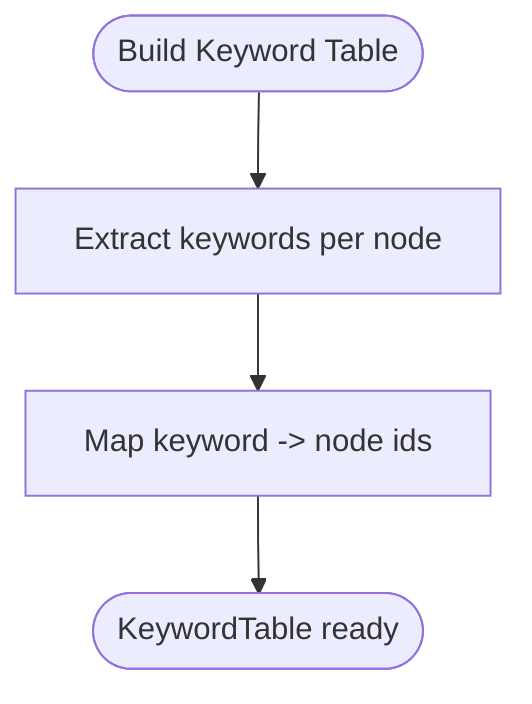

# Indexing Systems

<cite>
**Referenced Files in This Document**
- [base.py](file://llama-index-core/llama_index/core/indices/base.py)
- [loading.py](file://llama-index-core/llama_index/core/indices/loading.py)
- [registry.py](file://llama-index-core/llama_index/core/indices/registry.py)
- [data_structs.py](file://llama-index-core/llama_index/core/data_structs/data_structs.py)
- [struct_type.py](file://llama-index-core/llama_index/core/data_structs/struct_type.py)
- [storage_context.py](file://llama-index-core/llama_index/core/storage/storage_context.py)
- [vector_store/base.py](file://llama-index-core/llama_index/core/indices/vector_store/base.py)
- [tree/base.py](file://llama-index-core/llama_index/core/indices/tree/base.py)
- [keyword_table/base.py](file://llama-index-core/llama_index/core/indices/keyword_table/base.py)
- [knowledge_graph/base.py](file://llama-index-core/llama_index/core/indices/knowledge_graph/base.py)
- [list/base.py](file://llama-index-core/llama_index/core/indices/list/base.py)
</cite>

## Table of Contents
1. [Introduction](#introduction)
2. [Project Structure](#project-structure)
3. [Core Components](#core-components)
4. [Architecture Overview](#architecture-overview)
5. [Detailed Component Analysis](#detailed-component-analysis)
6. [Dependency Analysis](#dependency-analysis)
7. [Performance Considerations](#performance-considerations)
8. [Troubleshooting Guide](#troubleshooting-guide)
9. [Conclusion](#conclusion)
10. [Appendices](#appendices)

## Introduction
This document explains LlamaIndex indexing systems with a focus on index types, base architecture, data structures, and persistence/loading mechanisms. It covers vector store indexes, keyword table indexes, knowledge graph indexes, and tree indexes. It also clarifies how indices relate to vector stores, retrieval strategies, and query processing workflows, and provides practical guidance for selection, performance, and optimization.

## Project Structure
LlamaIndex organizes indexing logic around a shared base index class and specialized index implementations. Indexes rely on data structures to represent their internal state, a registry to map index structs to concrete index classes, and a storage context to persist and load indices alongside document, index, vector, and graph stores.

**Diagram sources**
- [base.py](file://llama-index-core/llama_index/core/indices/base.py#L25-L596)
- [vector_store/base.py](file://llama-index-core/llama_index/core/indices/vector_store/base.py#L36-L490)
- [tree/base.py](file://llama-index-core/llama_index/core/indices/tree/base.py#L39-L191)
- [keyword_table/base.py](file://llama-index-core/llama_index/core/indices/keyword_table/base.py#L43-L256)
- [knowledge_graph/base.py](file://llama-index-core/llama_index/core/indices/knowledge_graph/base.py#L42-L389)
- [list/base.py](file://llama-index-core/llama_index/core/indices/list/base.py#L29-L157)
- [data_structs.py](file://llama-index-core/llama_index/core/data_structs/data_structs.py#L21-L280)
- [struct_type.py](file://llama-index-core/llama_index/core/data_structs/struct_type.py#L6-L117)
- [storage_context.py](file://llama-index-core/llama_index/core/storage/storage_context.py#L52-L278)
- [loading.py](file://llama-index-core/llama_index/core/indices/loading.py#L12-L107)
- [registry.py](file://llama-index-core/llama_index/core/indices/registry.py#L19-L31)

**Section sources**
- [base.py](file://llama-index-core/llama_index/core/indices/base.py#L25-L596)
- [data_structs.py](file://llama-index-core/llama_index/core/data_structs/data_structs.py#L21-L280)
- [struct_type.py](file://llama-index-core/llama_index/core/data_structs/struct_type.py#L6-L117)
- [storage_context.py](file://llama-index-core/llama_index/core/storage/storage_context.py#L52-L278)
- [loading.py](file://llama-index-core/llama_index/core/indices/loading.py#L12-L107)
- [registry.py](file://llama-index-core/llama_index/core/indices/registry.py#L19-L31)

## Core Components
- BaseIndex: Generic base class that orchestrates index construction, insertion, deletion, updates, and exposes as_retriever/as_query_engine. It manages a StorageContext, docstore, vector_store, graph_store, and index_store.
- IndexStruct: Lightweight data structures that capture index internals (e.g., IndexGraph, KeywordTable, IndexList, IndexDict, KG).
- StorageContext: Centralized container for docstore, index_store, vector_stores (namespaced), graph_store, and property graph store. Provides persistence and loading helpers.
- Loading and Registry: Utilities to load indices from storage and map IndexStruct types to concrete index classes.

Key responsibilities:
- Construction: from_documents or from nodes, with transformations applied to produce nodes.
- Persistence: index_structs persisted via index_store; vector stores and docstores persisted separately.
- Retrieval: as_retriever returns a retriever appropriate to the index type.

**Section sources**
- [base.py](file://llama-index-core/llama_index/core/indices/base.py#L25-L596)
- [data_structs.py](file://llama-index-core/llama_index/core/data_structs/data_structs.py#L21-L280)
- [storage_context.py](file://llama-index-core/llama_index/core/storage/storage_context.py#L52-L278)
- [loading.py](file://llama-index-core/llama_index/core/indices/loading.py#L12-L107)
- [registry.py](file://llama-index-core/llama_index/core/indices/registry.py#L19-L31)

## Architecture Overview
The indexing architecture separates concerns:
- Index classes encapsulate index-specific logic (building, inserting, deleting).
- Data structures define the serialized state of each index.
- StorageContext coordinates persistence and retrieval of all stores.
- Registry and loader enable polymorphic reconstruction of indices from persisted state.

**Diagram sources**
- [loading.py](file://llama-index-core/llama_index/core/indices/loading.py#L12-L107)
- [registry.py](file://llama-index-core/llama_index/core/indices/registry.py#L19-L31)
- [storage_context.py](file://llama-index-core/llama_index/core/storage/storage_context.py#L52-L278)
- [base.py](file://llama-index-core/llama_index/core/indices/base.py#L25-L596)

## Detailed Component Analysis

### Base Index Architecture
- Generic design: BaseIndex[IS] binds an index to a specific IndexStruct subclass.
- Construction: from_documents applies transformations, adds documents to docstore, builds index via _build_index_from_nodes, and persists index_struct to index_store.
- Mutation: insert_nodes, ainsert_nodes, delete_nodes, update_ref_doc, refresh_ref_docs; each updates docstore and index_store accordingly.
- Retrieval: as_retriever returns a retriever; as_query_engine wraps retriever with a query engine.

**Diagram sources**
- [base.py](file://llama-index-core/llama_index/core/indices/base.py#L25-L596)
- [storage_context.py](file://llama-index-core/llama_index/core/storage/storage_context.py#L52-L278)
- [data_structs.py](file://llama-index-core/llama_index/core/data_structs/data_structs.py#L21-L38)

**Section sources**
- [base.py](file://llama-index-core/llama_index/core/indices/base.py#L25-L596)
- [storage_context.py](file://llama-index-core/llama_index/core/storage/storage_context.py#L52-L278)

### Vector Store Index
- Purpose: Index built on top of a vector store; stores nodes in docstore when vector store does not keep text; otherwise relies on vector store for text.
- Key behaviors:
  - Embedding computation and batching.
  - Insertion: batch embedding, add to vector store, conditionally add nodes to docstore and index struct.
  - Deletion: delegate to vector store; conditionally remove from docstore and index struct.
  - Retrieval: returns a vector retriever over node ids captured in index struct.
- Relationship to vector stores: depends on BasePydanticVectorStore; supports namespaced vector stores via StorageContext.

**Diagram sources**
- [vector_store/base.py](file://llama-index-core/llama_index/core/indices/vector_store/base.py#L108-L356)
- [base.py](file://llama-index-core/llama_index/core/indices/base.py#L195-L254)

**Section sources**
- [vector_store/base.py](file://llama-index-core/llama_index/core/indices/vector_store/base.py#L36-L490)
- [data_structs.py](file://llama-index-core/llama_index/core/data_structs/data_structs.py#L178-L225)

### Tree Index
- Purpose: Bottom-up summarization index; each internal node summarizes children; supports multiple retriever modes (select leaf, select leaf with embedding, root, all leaf).
- Key behaviors:
  - Building: GPTTreeIndexBuilder constructs summaries and tree structure.
  - Insertion: TreeIndexInserter integrates new nodes respecting num_children and prompts.
  - Retrieval: Mode-driven retrievers traverse or aggregate leaves/root.
- Limitations: Delete not implemented; ref_doc_info derived from index graph.

**Diagram sources**
- [tree/base.py](file://llama-index-core/llama_index/core/indices/tree/base.py#L138-L151)

**Section sources**
- [tree/base.py](file://llama-index-core/llama_index/core/indices/tree/base.py#L39-L191)
- [data_structs.py](file://llama-index-core/llama_index/core/data_structs/data_structs.py#L40-L113)

### Keyword Table Index
- Purpose: Keyword-based retrieval; extracts keywords per node and maps keywords to node ids; retrieves nodes matching query keywords.
- Key behaviors:
  - Building: extract keywords per node and populate KeywordTable.
  - Insertion: add new keywords and node ids.
  - Retrieval: multiple modes (default via LLM, simple keyword match, RAKE).
- Limitations: Delete removes node from keyword sets; ref_doc_info derived from table.

**Diagram sources**
- [keyword_table/base.py](file://llama-index-core/llama_index/core/indices/keyword_table/base.py#L170-L184)

**Section sources**
- [keyword_table/base.py](file://llama-index-core/llama_index/core/indices/keyword_table/base.py#L43-L256)
- [data_structs.py](file://llama-index-core/llama_index/core/data_structs/data_structs.py#L115-L147)

### Knowledge Graph Index
- Purpose: Extract triplets and maintain a graph; supports hybrid retrieval using triplets and embeddings.
- Key behaviors:
  - Building: extract triplets per node, upsert into graph store, update index struct and optional embeddings.
  - Insertion: upsert_triplet and add node; optionally embed triplets.
  - Retrieval: retriever modes include keyword and hybrid (when embeddings present).
- Deprecation note: KnowledgeGraphIndex is deprecated; use PropertyGraphIndex instead.

**Diagram sources**
- [knowledge_graph/base.py](file://llama-index-core/llama_index/core/indices/knowledge_graph/base.py#L204-L255)

**Section sources**
- [knowledge_graph/base.py](file://llama-index-core/llama_index/core/indices/knowledge_graph/base.py#L42-L389)
- [data_structs.py](file://llama-index-core/llama_index/core/data_structs/data_structs.py#L227-L270)

### Summary (List) Index
- Purpose: Simple sequential index; stores node ids in order; supports embedding and LLM-based retrievers.
- Key behaviors:
  - Building: append node ids to IndexList.
  - Insertion: append node ids.
  - Retrieval: default, embedding-based, or LLM-based retrievers.

**Diagram sources**
- [list/base.py](file://llama-index-core/llama_index/core/indices/list/base.py#L96-L118)

**Section sources**
- [list/base.py](file://llama-index-core/llama_index/core/indices/list/base.py#L29-L157)
- [data_structs.py](file://llama-index-core/llama_index/core/data_structs/data_structs.py#L149-L164)

## Dependency Analysis
- Index classes depend on:
  - StorageContext for docstore, index_store, vector_store(s), graph_store.
  - IndexStruct subclasses for internal state.
  - Retrievers tailored per index type.
- Loading depends on:
  - IndexStruct.get_type() mapped via registry to the correct index class.
  - StorageContext providing stores and persisted index structs.

**Diagram sources**
- [struct_type.py](file://llama-index-core/llama_index/core/data_structs/struct_type.py#L6-L117)
- [registry.py](file://llama-index-core/llama_index/core/indices/registry.py#L19-L31)
- [loading.py](file://llama-index-core/llama_index/core/indices/loading.py#L78-L86)

**Section sources**
- [struct_type.py](file://llama-index-core/llama_index/core/data_structs/struct_type.py#L6-L117)
- [registry.py](file://llama-index-core/llama_index/core/indices/registry.py#L19-L31)
- [loading.py](file://llama-index-core/llama_index/core/indices/loading.py#L78-L86)

## Performance Considerations
- Vector store index
  - Batch embedding: tune insert_batch_size to balance throughput and memory.
  - Async insertion: use use_async to overlap IO with embedding computation.
  - store_nodes_override: only store nodes in docstore when vector store does not keep text.
- Tree index
  - num_children controls branching factor; larger values reduce depth but increase summarization cost.
  - build_tree toggles whether to construct the full tree for retrieval modes requiring it.
- Keyword table index
  - Keyword extraction cost scales with number of nodes; async mode reduces latency.
  - max_keywords_per_chunk limits per-chunk keyword cardinality.
- Knowledge graph index
  - Triple extraction cost; embedding triplets increases storage and compute.
  - Hybrid retrieval benefits from precomputed embeddings.
- Summary index
  - Retrievers vary in cost; embedding and LLM modes trade off accuracy and latency.

[No sources needed since this section provides general guidance]

## Troubleshooting Guide
- Loading errors
  - If no index is found or multiple indices are present without specifying index_id, adjust index_id or load_indices_from_storage.
  - Ensure index_store contains the expected index_struct; mismatched types will fail lookup.
- Persistence issues
  - Verify StorageContext.from_defaults or from_persist_dir is used consistently.
  - Namespaced vector stores must be reattached after loading.
- Index-specific pitfalls
  - VectorStoreIndex: if vector store does not store text, nodes are stored in docstore; ensure both are persisted.
  - TreeIndex: retriever modes requiring trees will fail if build_tree is disabled.
  - KnowledgeGraphIndex: deprecated; migrate to PropertyGraphIndex.

**Section sources**
- [loading.py](file://llama-index-core/llama_index/core/indices/loading.py#L12-L107)
- [storage_context.py](file://llama-index-core/llama_index/core/storage/storage_context.py#L112-L149)
- [vector_store/base.py](file://llama-index-core/llama_index/core/indices/vector_store/base.py#L373-L432)
- [tree/base.py](file://llama-index-core/llama_index/core/indices/tree/base.py#L130-L137)
- [knowledge_graph/base.py](file://llama-index-core/llama_index/core/indices/knowledge_graph/base.py#L33-L41)

## Conclusion
LlamaIndex provides a flexible, extensible indexing framework. Indexes share a common lifecycle (build, persist, load, mutate, query) while differing in internal data structures and retrieval strategies. Vector store indexes excel in semantic similarity; tree indexes offer hierarchical summarization; keyword table indexes provide fast lexical matching; knowledge graph indexes enable relational reasoning. Choose an index based on data characteristics, retrieval needs, and performance constraints, and leverage StorageContext and the registry for robust persistence and loading.

[No sources needed since this section summarizes without analyzing specific files]

## Appendices

### Practical Examples (paths only)
- Create a vector store index from documents
  - [VectorStoreIndex.from_documents](file://llama-index-core/llama_index/core/indices/vector_store/base.py#L86-L107)
- Load an index from storage
  - [load_index_from_storage](file://llama-index-core/llama_index/core/indices/loading.py#L12-L48)
- Create a tree index and retrieve
  - [TreeIndex.as_retriever](file://llama-index-core/llama_index/core/indices/tree/base.py#L94-L129)
- Create a keyword table index and retrieve
  - [KeywordTableIndex.as_retriever](file://llama-index-core/llama_index/core/indices/keyword_table/base.py#L100-L128)
- Create a knowledge graph index and upsert triplets
  - [KnowledgeGraphIndex.upsert_triplet](file://llama-index-core/llama_index/core/indices/knowledge_graph/base.py#L256-L276)
- Create a summary index and retrieve
  - [SummaryIndex.as_retriever](file://llama-index-core/llama_index/core/indices/list/base.py#L68-L94)

### Index Selection Criteria
- Prefer vector store indexes for dense semantic retrieval and when embeddings are readily available.
- Use tree indexes when hierarchical summarization and controlled traversal are desired.
- Choose keyword table indexes for fast lexical matching and when LLM keyword extraction is reliable.
- Use knowledge graph indexes for relational queries and when triple extraction quality is high.
- Use summary indexes for simple sequential processing or baseline comparisons.

[No sources needed since this section provides general guidance]