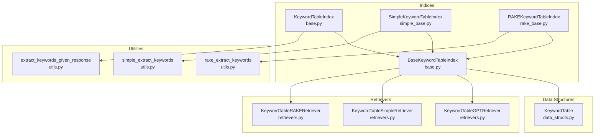
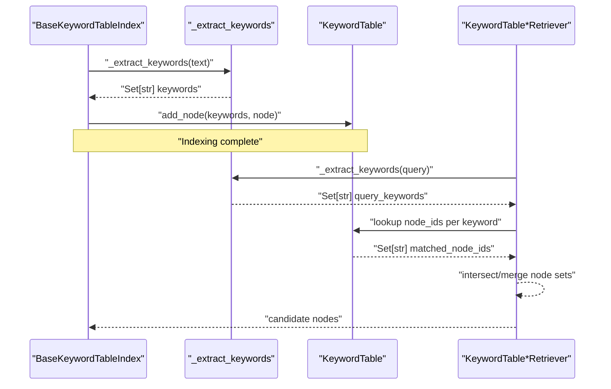
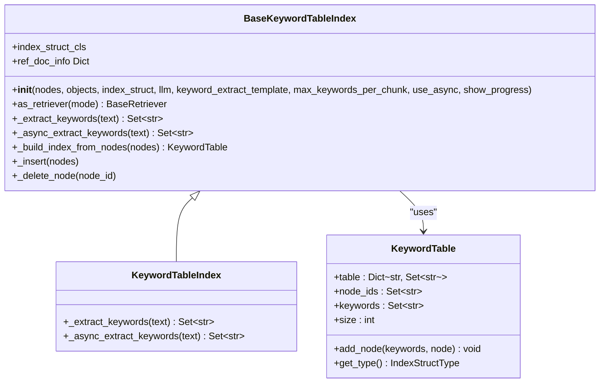
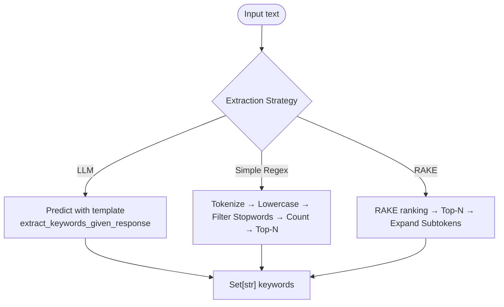
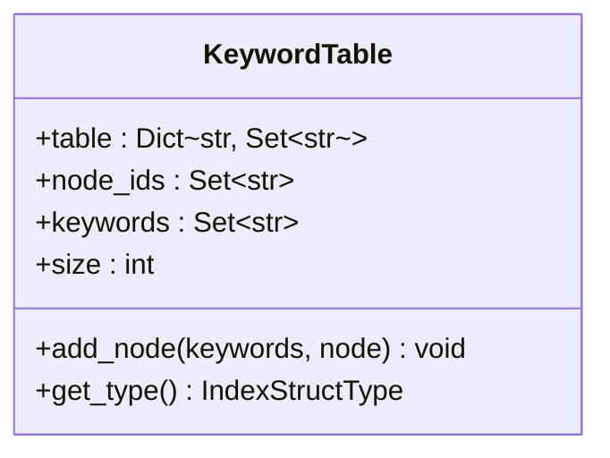
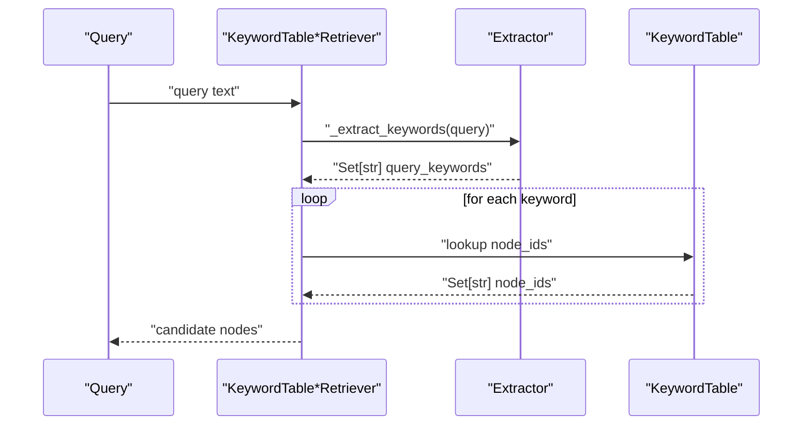
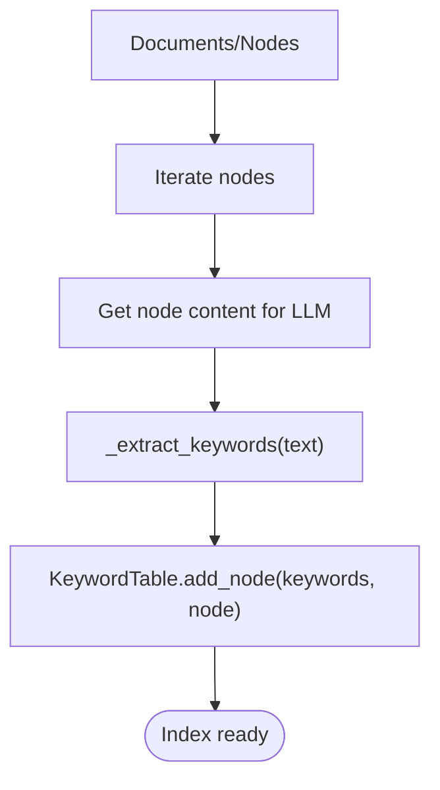
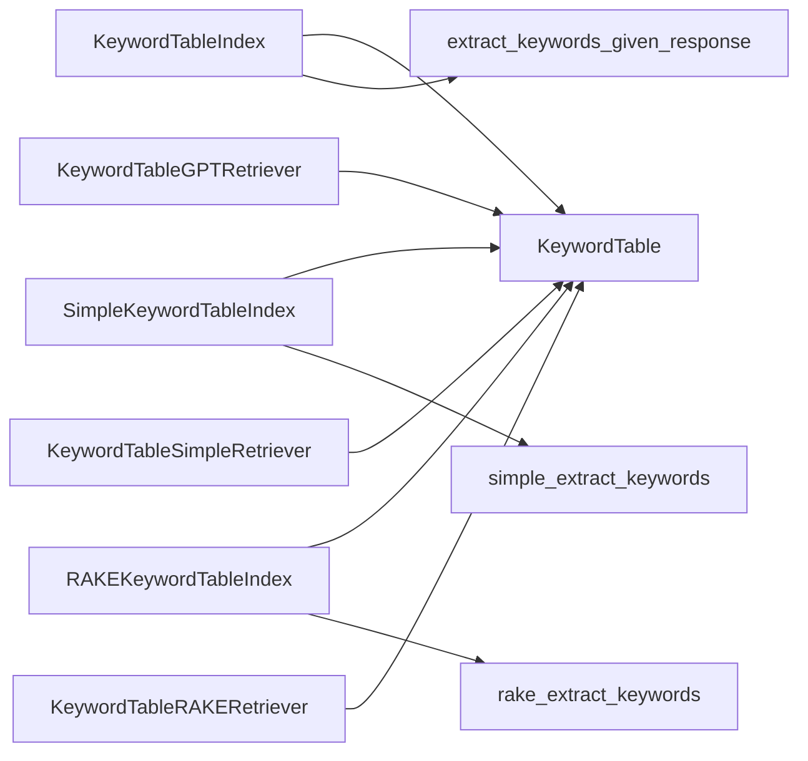

# Keyword Table Indexes

<cite>
**Referenced Files in This Document**
- [base.py](file://llama-index-core/llama_index/core/indices/keyword_table/base.py)
- [simple_base.py](file://llama-index-core/llama_index/core/indices/keyword_table/simple_base.py)
- [rake_base.py](file://llama-index-core/llama_index/core/indices/keyword_table/rake_base.py)
- [utils.py](file://llama-index-core/llama_index/core/indices/keyword_table/utils.py)
- [__init__.py](file://llama-index-core/llama_index/core/indices/keyword_table/__init__.py)
- [data_structs.py](file://llama-index-core/llama_index/core/data_structs/data_structs.py)
- [retrievers.py](file://llama-index-core/llama_index/core/indices/keyword_table/retrievers.py)
- [__init__.py](file://llama-index-core/llama_index/core/indices/__init__.py)
</cite>

## Table of Contents
1. [Introduction](#introduction)
2. [Project Structure](#project-structure)
3. [Core Components](#core-components)
4. [Architecture Overview](#architecture-overview)
5. [Detailed Component Analysis](#detailed-component-analysis)
6. [Dependency Analysis](#dependency-analysis)
7. [Performance Considerations](#performance-considerations)
8. [Troubleshooting Guide](#troubleshooting-guide)
9. [Conclusion](#conclusion)
10. [Appendices](#appendices)

## Introduction
Keyword Table Indexes in LlamaIndex provide an exact-match retrieval mechanism over document collections. They build a keyword-to-node mapping during indexing and retrieve nodes by matching query keywords against this table. This approach emphasizes deterministic, lexical matches and can be combined with semantic vector search for hybrid retrieval. This document explains the keyword-based indexing mechanism, term frequency analysis, exact match retrieval patterns, and practical configuration for real-world use.

## Project Structure
The Keyword Table Index implementation resides under the indices subsystem and includes:
- Index classes for different keyword extraction strategies
- Utility functions for keyword extraction (simple regex, RAKE, and LLM-based)
- The KeywordTable data structure that stores keyword-to-node-id mappings
- Retrievers for exact-match retrieval modes

**Diagram sources**
- [base.py](file://llama-index-core/llama_index/core/indices/keyword_table/base.py#L42-L225)
- [simple_base.py](file://llama-index-core/llama_index/core/indices/keyword_table/simple_base.py#L23-L42)
- [rake_base.py](file://llama-index-core/llama_index/core/indices/keyword_table/rake_base.py#L17-L36)
- [data_structs.py](file://llama-index-core/llama_index/core/data_structs/data_structs.py#L115-L147)
- [retrievers.py](file://llama-index-core/llama_index/core/indices/keyword_table/retrievers.py#L118-L184)
- [utils.py](file://llama-index-core/llama_index/core/indices/keyword_table/utils.py#L11-L77)

**Section sources**
- [base.py](file://llama-index-core/llama_index/core/indices/keyword_table/base.py#L1-L256)
- [simple_base.py](file://llama-index-core/llama_index/core/indices/keyword_table/simple_base.py#L1-L46)
- [rake_base.py](file://llama-index-core/llama_index/core/indices/keyword_table/rake_base.py#L1-L40)
- [utils.py](file://llama-index-core/llama_index/core/indices/keyword_table/utils.py#L1-L77)
- [data_structs.py](file://llama-index-core/llama_index/core/data_structs/data_structs.py#L115-L147)
- [retrievers.py](file://llama-index-core/llama_index/core/indices/keyword_table/retrievers.py#L118-L184)
- [__init__.py](file://llama-index-core/llama_index/core/indices/__init__.py#L11-L22)

## Core Components
- KeywordTableIndex: Uses an LLM to extract keywords and builds the keyword-to-node mapping.
- SimpleKeywordTableIndex: Uses a simple regex-based extractor to extract keywords.
- RAKEKeywordTableIndex: Uses the RAKE algorithm to extract keywords.
- KeywordTable: The index structure storing keyword-to-node-id sets.
- Retriever variants: Exact-match retrievers for each mode.

Key configuration parameters:
- max_keywords_per_chunk: Limits number of keywords extracted per chunk.
- keyword_extract_template: Prompt template passed to the LLM for keyword extraction.
- use_async: Enables asynchronous keyword extraction for throughput.
- show_progress: Controls progress bar display during indexing.

**Section sources**
- [base.py](file://llama-index-core/llama_index/core/indices/keyword_table/base.py#L66-L98)
- [simple_base.py](file://llama-index-core/llama_index/core/indices/keyword_table/simple_base.py#L23-L42)
- [rake_base.py](file://llama-index-core/llama_index/core/indices/keyword_table/rake_base.py#L17-L36)
- [data_structs.py](file://llama-index-core/llama_index/core/data_structs/data_structs.py#L115-L147)

## Architecture Overview
The Keyword Table Index follows a two-phase process:
1) Indexing phase: Extract keywords from each node’s content and populate KeywordTable.
2) Query phase: Extract keywords from the query and intersect matching node sets to retrieve candidate nodes.

**Diagram sources**
- [base.py](file://llama-index-core/llama_index/core/indices/keyword_table/base.py#L137-L184)
- [utils.py](file://llama-index-core/llama_index/core/indices/keyword_table/utils.py#L51-L77)
- [data_structs.py](file://llama-index-core/llama_index/core/data_structs/data_structs.py#L115-L147)
- [retrievers.py](file://llama-index-core/llama_index/core/indices/keyword_table/retrievers.py#L118-L184)

## Detailed Component Analysis

### KeywordTableIndex and BaseKeywordTableIndex
- BaseKeywordTableIndex orchestrates index construction and deletion, supports async indexing, and exposes a retriever factory.
- KeywordTableIndex specializes extraction via an LLM using a configurable prompt template and enforces a maximum number of keywords per chunk.

**Diagram sources**
- [base.py](file://llama-index-core/llama_index/core/indices/keyword_table/base.py#L42-L225)
- [data_structs.py](file://llama-index-core/llama_index/core/data_structs/data_structs.py#L115-L147)

**Section sources**
- [base.py](file://llama-index-core/llama_index/core/indices/keyword_table/base.py#L42-L225)

### Keyword Extraction Strategies
- LLM-based extraction: Uses a prompt to produce a comma-separated list of keywords, then normalizes and expands tokens into subtokens.
- Simple regex extraction: Tokenizes, lowercases, optionally filters stopwords, counts token frequencies, and selects top-N tokens.
- RAKE extraction: Uses NLTK and rake_nltk to rank phrases and optionally expand into subtokens.

**Diagram sources**
- [utils.py](file://llama-index-core/llama_index/core/indices/keyword_table/utils.py#L11-L77)
- [base.py](file://llama-index-core/llama_index/core/indices/keyword_table/base.py#L236-L251)

**Section sources**
- [utils.py](file://llama-index-core/llama_index/core/indices/keyword_table/utils.py#L11-L77)
- [base.py](file://llama-index-core/llama_index/core/indices/keyword_table/base.py#L236-L251)

### KeywordTable Data Structure
- Stores a dictionary mapping each keyword to a set of node identifiers.
- Provides helpers to enumerate all node IDs and keywords, and to compute table size.

**Diagram sources**
- [data_structs.py](file://llama-index-core/llama_index/core/data_structs/data_structs.py#L115-L147)

**Section sources**
- [data_structs.py](file://llama-index-core/llama_index/core/data_structs/data_structs.py#L115-L147)

### Retrievers and Exact Match Patterns
- KeywordTableGPTRetriever: Uses LLM-based keyword extraction for queries.
- KeywordTableSimpleRetriever: Uses simple regex extraction for queries.
- KeywordTableRAKERetriever: Uses RAKE extraction for queries.
- Retrievers select a mode via as_retriever and perform exact-match lookup in KeywordTable.

**Diagram sources**
- [retrievers.py](file://llama-index-core/llama_index/core/indices/keyword_table/retrievers.py#L118-L184)
- [utils.py](file://llama-index-core/llama_index/core/indices/keyword_table/utils.py#L51-L77)
- [data_structs.py](file://llama-index-core/llama_index/core/data_structs/data_structs.py#L115-L147)

**Section sources**
- [retrievers.py](file://llama-index-core/llama_index/core/indices/keyword_table/retrievers.py#L118-L184)

### Index Construction from Documents
- Nodes are processed sequentially (or asynchronously) to extract keywords and populate KeywordTable.
- The max_keywords_per_chunk parameter controls extraction granularity and index size.

**Diagram sources**
- [base.py](file://llama-index-core/llama_index/core/indices/keyword_table/base.py#L137-L184)
- [data_structs.py](file://llama-index-core/llama_index/core/data_structs/data_structs.py#L115-L147)

**Section sources**
- [base.py](file://llama-index-core/llama_index/core/indices/keyword_table/base.py#L137-L184)

### Practical Configuration Examples
- Configure keyword extraction templates and limits:
  - Set max_keywords_per_chunk to balance recall vs. index size.
  - Customize keyword_extract_template for LLM-based extraction.
- Choose extraction strategy:
  - Use KeywordTableIndex for richer keyword semantics.
  - Use SimpleKeywordTableIndex for speed and simplicity.
  - Use RAKEKeywordTableIndex for phrase-based keywords without LLM.
- Combine with vector search:
  - Retrieve candidates from KeywordTable and rerank or fuse with vector scores.
  - Use retriever modes via as_retriever to switch extraction strategies.

**Section sources**
- [base.py](file://llama-index-core/llama_index/core/indices/keyword_table/base.py#L66-L98)
- [simple_base.py](file://llama-index-core/llama_index/core/indices/keyword_table/simple_base.py#L23-L42)
- [rake_base.py](file://llama-index-core/llama_index/core/indices/keyword_table/rake_base.py#L17-L36)
- [retrievers.py](file://llama-index-core/llama_index/core/indices/keyword_table/retrievers.py#L118-L184)

## Dependency Analysis
- Index classes depend on:
  - KeywordTable for storage
  - Extractor utilities for keyword generation
  - LLM for prompt-driven extraction
- Retrievers depend on:
  - Index instances and extractor utilities
  - KeywordTable for exact-match lookups

**Diagram sources**
- [base.py](file://llama-index-core/llama_index/core/indices/keyword_table/base.py#L42-L225)
- [simple_base.py](file://llama-index-core/llama_index/core/indices/keyword_table/simple_base.py#L23-L42)
- [rake_base.py](file://llama-index-core/llama_index/core/indices/keyword_table/rake_base.py#L17-L36)
- [utils.py](file://llama-index-core/llama_index/core/indices/keyword_table/utils.py#L11-L77)
- [data_structs.py](file://llama-index-core/llama_index/core/data_structs/data_structs.py#L115-L147)
- [retrievers.py](file://llama-index-core/llama_index/core/indices/keyword_table/retrievers.py#L118-L184)

**Section sources**
- [__init__.py](file://llama-index-core/llama_index/core/indices/__init__.py#L11-L22)
- [__init__.py](file://llama-index-core/llama_index/core/indices/keyword_table/__init__.py#L1-L34)

## Performance Considerations
- Index size and retrieval cost:
  - KeywordTable grows with unique keywords per node; tune max_keywords_per_chunk to control cardinality.
- Asynchronous indexing:
  - Enable use_async to parallelize keyword extraction during bulk ingestion.
- Extractor overhead:
  - Simple regex extraction is fastest; RAKE adds tokenizer and ranking costs; LLM extraction incurs latency and cost.
- Term frequency analysis:
  - Simple regex computes token frequencies; RAKE ranks phrases; LLM-based extraction yields semantically prioritized keywords.
- Hybrid retrieval:
  - Combine keyword exact matches with vector search to improve precision and reduce candidate set size.

[No sources needed since this section provides general guidance]

## Troubleshooting Guide
- Missing NLTK or rake_nltk:
  - RAKE extraction requires NLTK and rake_nltk; install them if missing.
- Unexpected keyword parsing:
  - LLM-based extraction expects a specific prefix token; ensure the response format matches expectations.
- Empty or sparse results:
  - Increase max_keywords_per_chunk or adjust extraction strategy to capture more terms.
- Deleting nodes:
  - Removing a node updates KeywordTable and prunes empty keywords automatically.

**Section sources**
- [utils.py](file://llama-index-core/llama_index/core/indices/keyword_table/utils.py#L30-L48)
- [base.py](file://llama-index-core/llama_index/core/indices/keyword_table/base.py#L193-L206)

## Conclusion
Keyword Table Indexes offer a robust, exact-match retrieval mechanism that complements semantic vector search. By choosing appropriate extraction strategies—simple regex, RAKE, or LLM—you can tailor precision, performance, and cost to your workload. The KeywordTable data structure enables efficient keyword-to-node lookups, while retrievers provide flexible modes for query-time keyword extraction. For large-scale deployments, leverage asynchronous indexing, tune keyword limits, and integrate with vector search for hybrid retrieval.

[No sources needed since this section summarizes without analyzing specific files]

## Appendices

### API and Factory References
- Index constructors and aliases:
  - KeywordTableIndex, GPTKeywordTableIndex
  - SimpleKeywordTableIndex, GPTSimpleKeywordTableIndex
  - RAKEKeywordTableIndex, GPTRAKEKeywordTableIndex
- Retrievers:
  - KeywordTableGPTRetriever
  - KeywordTableSimpleRetriever
  - KeywordTableRAKERetriever

**Section sources**
- [__init__.py](file://llama-index-core/llama_index/core/indices/__init__.py#L11-L22)
- [__init__.py](file://llama-index-core/llama_index/core/indices/keyword_table/__init__.py#L22-L33)