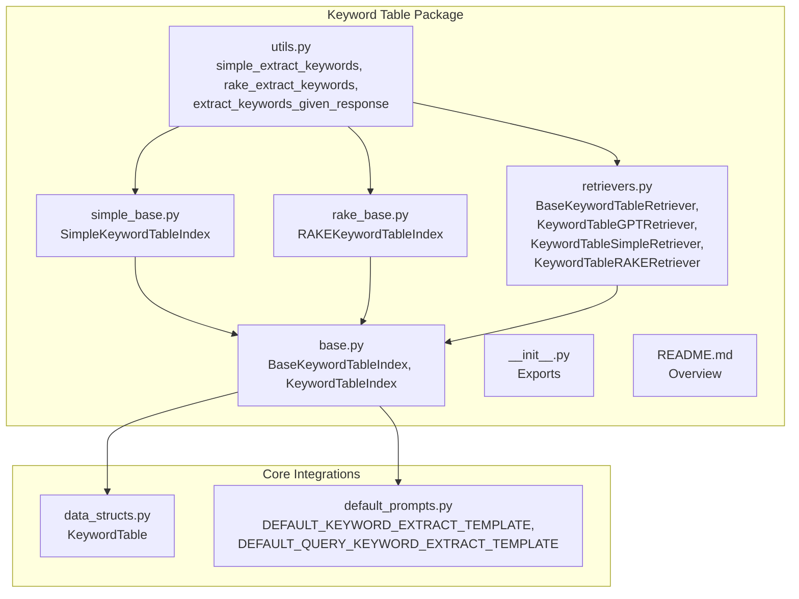
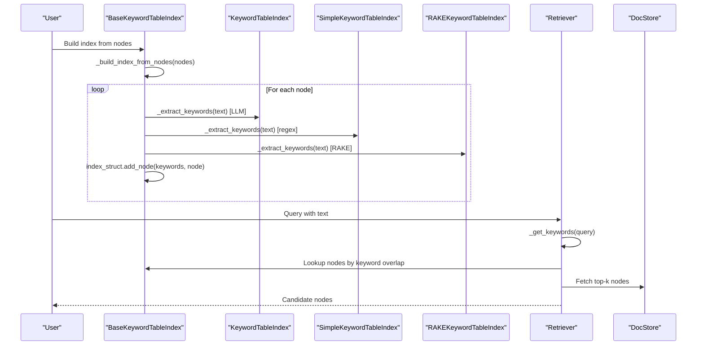
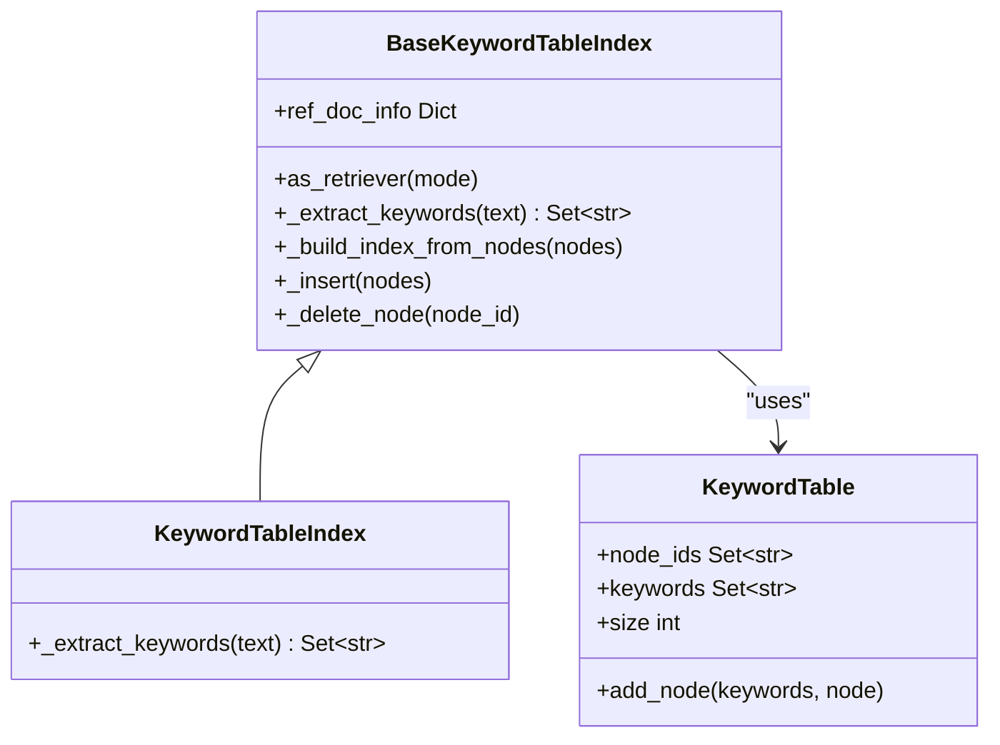
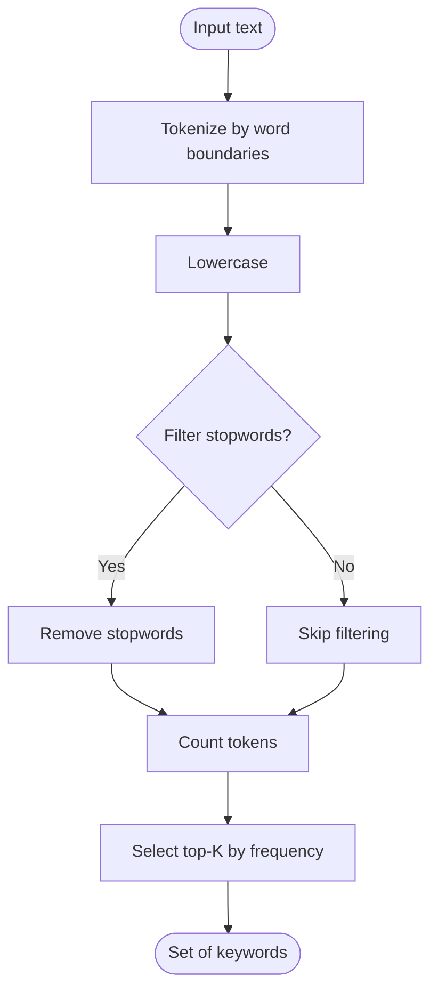
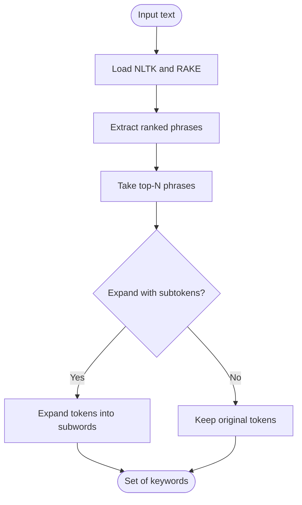
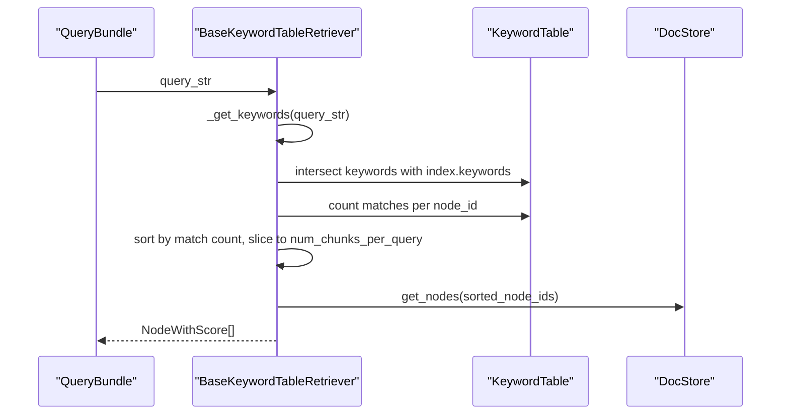
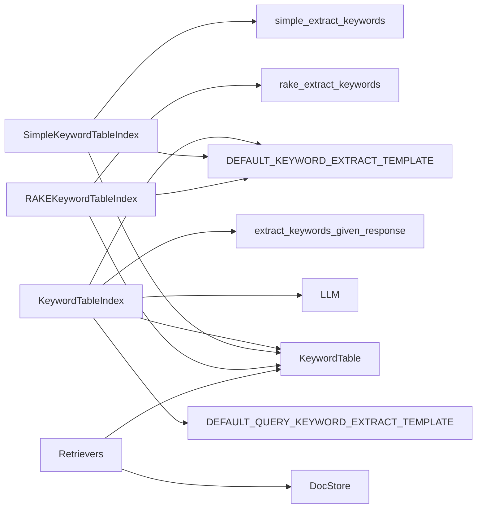

# Keyword Table Indexes

<cite>
**Referenced Files in This Document**
- [base.py](file://llama-index-core/llama_index/core/indices/keyword_table/base.py)
- [simple_base.py](file://llama-index-core/llama_index/core/indices/keyword_table/simple_base.py)
- [rake_base.py](file://llama-index-core/llama_index/core/indices/keyword_table/rake_base.py)
- [utils.py](file://llama-index-core/llama_index/core/indices/keyword_table/utils.py)
- [retrievers.py](file://llama-index-core/llama_index/core/indices/keyword_table/retrievers.py)
- [data_structs.py](file://llama-index-core/llama_index/core/data_structs/data_structs.py)
- [default_prompts.py](file://llama-index-core/llama_index/core/prompts/default_prompts.py)
- [__init__.py](file://llama-index-core/llama_index/core/indices/keyword_table/__init__.py)
- [README.md](file://llama-index-core/llama_index/core/indices/keyword_table/README.md)
- [test_base.py](file://llama-index-core/tests/indices/keyword_table/test_base.py)
</cite>

## Table of Contents
1. [Introduction](#introduction)
2. [Project Structure](#project-structure)
3. [Core Components](#core-components)
4. [Architecture Overview](#architecture-overview)
5. [Detailed Component Analysis](#detailed-component-analysis)
6. [Dependency Analysis](#dependency-analysis)
7. [Performance Considerations](#performance-considerations)
8. [Troubleshooting Guide](#troubleshooting-guide)
9. [Conclusion](#conclusion)
10. [Appendices](#appendices)

## Introduction
This document explains LlamaIndex’s keyword-based indexing approach centered on KeywordTableIndex and its variants. It covers how keyword extraction works, how tokens are processed, and how metadata is indexed. It also outlines practical usage patterns, performance tuning, and advanced topics such as keyword boosting, phrase matching, and hybrid retrieval with vector indexes. The goal is to help you choose the right keyword extraction method for your workload and troubleshoot common indexing challenges.

## Project Structure
The keyword table index implementation lives under the indices/keyword_table package and integrates with the core data structures and prompt templates.

```mermaid
graph TB
subgraph "Keyword Table Package"
A["base.py<br/>BaseKeywordTableIndex, KeywordTableIndex"]
B["simple_base.py<br/>SimpleKeywordTableIndex"]
C["rake_base.py<br/>RAKEKeywordTableIndex"]
D["utils.py<br/>simple_extract_keywords, rake_extract_keywords,<br/>extract_keywords_given_response"]
E["retrievers.py<br/>BaseKeywordTableRetriever,<br/>KeywordTableGPTRetriever,<br/>KeywordTableSimpleRetriever,<br/>KeywordTableRAKERetriever"]
F["__init__.py<br/>Exports"]
G["README.md<br/>Overview"]
end
subgraph "Core Integrations"
H["data_structs.py<br/>KeywordTable"]
I["default_prompts.py<br/>DEFAULT_KEYWORD_EXTRACT_TEMPLATE,<br/>DEFAULT_QUERY_KEYWORD_EXTRACT_TEMPLATE"]
end
A --> H
A --> I
B --> A
C --> A
E --> A
D --> B
D --> C
D --> E
```

**Diagram sources**
- [base.py](file://llama-index-core/llama_index/core/indices/keyword_table/base.py#L43-L256)
- [simple_base.py](file://llama-index-core/llama_index/core/indices/keyword_table/simple_base.py#L24-L48)
- [rake_base.py](file://llama-index-core/llama_index/core/indices/keyword_table/rake_base.py#L18-L42)
- [utils.py](file://llama-index-core/llama_index/core/indices/keyword_table/utils.py#L1-L77)
- [retrievers.py](file://llama-index-core/llama_index/core/indices/keyword_table/retrievers.py#L31-L201)
- [data_structs.py](file://llama-index-core/llama_index/core/data_structs/data_structs.py#L116-L147)
- [default_prompts.py](file://llama-index-core/llama_index/core/prompts/default_prompts.py#L132-L159)
- [__init__.py](file://llama-index-core/llama_index/core/indices/keyword_table/__init__.py#L1-L33)
- [README.md](file://llama-index-core/llama_index/core/indices/keyword_table/README.md#L1-L23)

**Section sources**
- [__init__.py](file://llama-index-core/llama_index/core/indices/keyword_table/__init__.py#L1-L33)
- [README.md](file://llama-index-core/llama_index/core/indices/keyword_table/README.md#L1-L23)

## Core Components
- KeywordTableIndex: Uses an LLM to extract keywords from text chunks during index construction and query time. It relies on prompt templates for keyword extraction and parsing.
- SimpleKeywordTableIndex: Uses a simple regex-based extraction that filters stopwords and selects frequent tokens.
- RAKEKeywordTableIndex: Uses the RAKE algorithm to extract candidate phrases and ranks them.
- KeywordTable: The underlying data structure mapping keywords to sets of node IDs.
- Retrievers: Three retrievers correspond to the three extraction modes, selecting candidate nodes by keyword overlap and limiting by a configurable cap.

Key configuration knobs:
- max_keywords_per_chunk and max_keywords_per_query
- use_async for parallel keyword extraction
- num_chunks_per_query to limit candidates considered
- Keyword extraction prompt templates for both index and query

**Section sources**
- [base.py](file://llama-index-core/llama_index/core/indices/keyword_table/base.py#L67-L98)
- [simple_base.py](file://llama-index-core/llama_index/core/indices/keyword_table/simple_base.py#L24-L48)
- [rake_base.py](file://llama-index-core/llama_index/core/indices/keyword_table/rake_base.py#L18-L42)
- [data_structs.py](file://llama-index-core/llama_index/core/data_structs/data_structs.py#L116-L147)
- [retrievers.py](file://llama-index-core/llama_index/core/indices/keyword_table/retrievers.py#L53-L81)

## Architecture Overview
The keyword table index is a hash-like mapping from keywords to node IDs. Index construction and query follow a consistent flow: extract keywords, map to nodes, and retrieve candidates by overlap.

```mermaid
sequenceDiagram
participant U as "User"
participant IDX as "BaseKeywordTableIndex"
participant KTI as "KeywordTableIndex"
participant SKI as "SimpleKeywordTableIndex"
participant RKI as "RAKEKeywordTableIndex"
participant RET as "Retriever"
participant DOC as "DocStore"
U->>IDX : Build index from nodes
IDX->>IDX : _build_index_from_nodes(nodes)
loop For each node
IDX->>KTI : _extract_keywords(text) [LLM]
IDX->>SKI : _extract_keywords(text) [regex]
IDX->>RKI : _extract_keywords(text) [RAKE]
IDX->>IDX : index_struct.add_node(keywords, node)
end
U->>RET : Query with text
RET->>RET : _get_keywords(query)
RET->>IDX : Lookup nodes by keyword overlap
RET->>DOC : Fetch top-k nodes
RET-->>U : Candidate nodes
```

**Diagram sources**
- [base.py](file://llama-index-core/llama_index/core/indices/keyword_table/base.py#L170-L184)
- [simple_base.py](file://llama-index-core/llama_index/core/indices/keyword_table/simple_base.py#L32-L34)
- [rake_base.py](file://llama-index-core/llama_index/core/indices/keyword_table/rake_base.py#L26-L28)
- [retrievers.py](file://llama-index-core/llama_index/core/indices/keyword_table/retrievers.py#L86-L116)

## Detailed Component Analysis

### KeywordTableIndex and BaseKeywordTableIndex
- BaseKeywordTableIndex orchestrates index construction and insertion, supports async builds, and exposes ref_doc_info for metadata inspection.
- KeywordTableIndex overrides keyword extraction to use an LLM with a keyword extraction prompt template and parses the response into a normalized set of keywords.

```mermaid
classDiagram
class BaseKeywordTableIndex {
+as_retriever(mode)
+_extract_keywords(text) Set~str~
+_build_index_from_nodes(nodes)
+_insert(nodes)
+_delete_node(node_id)
+ref_doc_info Dict
}
class KeywordTableIndex {
+_extract_keywords(text) Set~str~
}
class KeywordTable {
+add_node(keywords, node)
+node_ids Set~str~
+keywords Set~str~
+size int
}
BaseKeywordTableIndex <|-- KeywordTableIndex
BaseKeywordTableIndex --> KeywordTable : "uses"
```

**Diagram sources**
- [base.py](file://llama-index-core/llama_index/core/indices/keyword_table/base.py#L43-L256)
- [data_structs.py](file://llama-index-core/llama_index/core/data_structs/data_structs.py#L116-L147)

**Section sources**
- [base.py](file://llama-index-core/llama_index/core/indices/keyword_table/base.py#L67-L98)
- [base.py](file://llama-index-core/llama_index/core/indices/keyword_table/base.py#L170-L207)
- [base.py](file://llama-index-core/llama_index/core/indices/keyword_table/base.py#L229-L256)

### SimpleKeywordTableIndex
- Uses a simple regex-based extraction that:
  - Tokenizes by word boundaries
  - Optionally filters stopwords
  - Counts tokens and selects the most frequent up to a limit
- Ideal for speed and simplicity when LLM-based extraction is unnecessary or costly.

```mermaid
flowchart TD
Start(["Input text"]) --> Tokenize["Tokenize by word boundaries"]
Tokenize --> Lower["Lowercase"]
Lower --> Stopwords{"Filter stopwords?"}
Stopwords --> |Yes| Filter["Remove stopwords"]
Stopwords --> |No| Skip["Skip filtering"]
Filter --> Count["Count tokens"]
Skip --> Count
Count --> TopK["Select top-K by frequency"]
TopK --> Out(["Set of keywords"])
```

**Diagram sources**
- [utils.py](file://llama-index-core/llama_index/core/indices/keyword_table/utils.py#L11-L21)

**Section sources**
- [simple_base.py](file://llama-index-core/llama_index/core/indices/keyword_table/simple_base.py#L24-L48)
- [utils.py](file://llama-index-core/llama_index/core/indices/keyword_table/utils.py#L11-L21)

### RAKEKeywordTableIndex
- Uses the RAKE algorithm to extract candidate phrases, rank them, and optionally expand tokens into subtokens.
- Requires NLTK and rake-nltk; raises import errors if missing.

```mermaid
flowchart TD
Start(["Input text"]) --> Load["Load NLTK and RAKE"]
Load --> Extract["Extract ranked phrases"]
Extract --> Slice["Take top-N phrases"]
Slice --> Expand{"Expand with subtokens?"}
Expand --> |Yes| Sub["Expand tokens into subwords"]
Expand --> |No| Keep["Keep original tokens"]
Sub --> Out(["Set of keywords"])
Keep --> Out
```

**Diagram sources**
- [utils.py](file://llama-index-core/llama_index/core/indices/keyword_table/utils.py#L24-L48)

**Section sources**
- [rake_base.py](file://llama-index-core/llama_index/core/indices/keyword_table/rake_base.py#L18-L42)
- [utils.py](file://llama-index-core/llama_index/core/indices/keyword_table/utils.py#L24-L48)

### Retrievers and Query Flow
- BaseKeywordTableRetriever:
  - Extracts keywords from the query using the configured method
  - Intersects keywords with the index to score nodes by overlap
  - Returns top-k nodes by score, capped by num_chunks_per_query
- KeywordTableGPTRetriever: Uses LLM-based extraction
- KeywordTableSimpleRetriever: Uses regex extraction
- KeywordTableRAKERetriever: Uses RAKE extraction

```mermaid
sequenceDiagram
participant Q as "QueryBundle"
participant R as "BaseKeywordTableRetriever"
participant IDX as "KeywordTable"
participant DS as "DocStore"
Q->>R : query_str
R->>R : _get_keywords(query_str)
R->>IDX : intersect keywords with index.keywords
R->>IDX : count matches per node_id
R->>R : sort by match count, slice to num_chunks_per_query
R->>DS : get_nodes(sorted_node_ids)
R-->>Q : NodeWithScore[]
```

**Diagram sources**
- [retrievers.py](file://llama-index-core/llama_index/core/indices/keyword_table/retrievers.py#L86-L116)

**Section sources**
- [retrievers.py](file://llama-index-core/llama_index/core/indices/keyword_table/retrievers.py#L31-L81)
- [retrievers.py](file://llama-index-core/llama_index/core/indices/keyword_table/retrievers.py#L119-L201)

### KeywordTable Data Structure
- Maintains a mapping from keyword to set of node IDs
- Provides convenience properties for node_ids, keywords, and size
- Used by all keyword table index variants

**Section sources**
- [data_structs.py](file://llama-index-core/llama_index/core/data_structs/data_structs.py#L116-L147)

### Prompt Templates for Keyword Extraction
- DEFAULT_KEYWORD_EXTRACT_TEMPLATE: Used during index construction
- DEFAULT_QUERY_KEYWORD_EXTRACT_TEMPLATE: Used during query-time extraction
- Both expect a KEYWORDS: prefix and comma-separated list

**Section sources**
- [default_prompts.py](file://llama-index-core/llama_index/core/prompts/default_prompts.py#L132-L159)
- [base.py](file://llama-index-core/llama_index/core/indices/keyword_table/base.py#L84-L90)
- [retrievers.py](file://llama-index-core/llama_index/core/indices/keyword_table/retrievers.py#L158-L164)
- [utils.py](file://llama-index-core/llama_index/core/indices/keyword_table/utils.py#L51-L77)

## Dependency Analysis
- Index classes depend on:
  - KeywordTable for storage
  - Prompt templates for extraction
  - LLM for GPT-based extraction
  - Utilities for tokenization and RAKE
- Retrievers depend on:
  - Index instances
  - DocStore for node retrieval
  - Prompt templates for query-time extraction

```mermaid
graph LR
KTI["KeywordTableIndex"] --> KW["KeywordTable"]
SKI["SimpleKeywordTableIndex"] --> KW
RKI["RAKEKeywordTableIndex"] --> KW
KTI --> P1["DEFAULT_KEYWORD_EXTRACT_TEMPLATE"]
KTI --> P2["DEFAULT_QUERY_KEYWORD_EXTRACT_TEMPLATE"]
SKI --> P1
RKI --> P1
KTI --> LLM["LLM"]
KTI --> U1["extract_keywords_given_response"]
SKI --> U2["simple_extract_keywords"]
RKI --> U3["rake_extract_keywords"]
RET["Retrievers"] --> KW
RET --> DS["DocStore"]
```

**Diagram sources**
- [base.py](file://llama-index-core/llama_index/core/indices/keyword_table/base.py#L20-L29)
- [simple_base.py](file://llama-index-core/llama_index/core/indices/keyword_table/simple_base.py#L16-L19)
- [rake_base.py](file://llama-index-core/llama_index/core/indices/keyword_table/rake_base.py#L15-L15)
- [retrievers.py](file://llama-index-core/llama_index/core/indices/keyword_table/retrievers.py#L18-L24)
- [data_structs.py](file://llama-index-core/llama_index/core/data_structs/data_structs.py#L116-L147)

**Section sources**
- [base.py](file://llama-index-core/llama_index/core/indices/keyword_table/base.py#L12-L32)
- [simple_base.py](file://llama-index-core/llama_index/core/indices/keyword_table/simple_base.py#L9-L19)
- [rake_base.py](file://llama-index-core/llama_index/core/indices/keyword_table/rake_base.py#L8-L15)
- [retrievers.py](file://llama-index-core/llama_index/core/indices/keyword_table/retrievers.py#L8-L24)

## Performance Considerations
- Keyword extraction cost:
  - GPT-based extraction is accurate but expensive; consider Simple or RAKE for large corpora.
  - Simple extraction is fastest; RAKE adds phrase ranking overhead.
- Async builds:
  - Enable use_async to parallelize keyword extraction during index construction.
- Candidate capping:
  - Control num_chunks_per_query to limit downstream processing and latency.
- Token expansion:
  - Subtoken expansion increases recall but may increase index size and query time.

Practical tips:
- Start with Simple extraction for prototyping; switch to RAKE or GPT based on accuracy needs.
- Tune max_keywords_per_chunk and max_keywords_per_query to balance precision/recall.
- Use async builds for multi-core systems.

[No sources needed since this section provides general guidance]

## Troubleshooting Guide
Common issues and resolutions:
- Missing NLTK or RAKE libraries:
  - Install NLTK and rake-nltk when using RAKEKeywordTableIndex.
- Unexpected empty results:
  - Verify keyword extraction templates and ensure responses start with the expected prefix.
- Slow builds:
  - Use Simple extraction or enable use_async.
- Too many or too few keywords:
  - Adjust max_keywords_per_chunk and max_keywords_per_query.
- Deleting documents:
  - Use delete_ref_doc to remove a reference document; verify ref_doc_info reflects remaining nodes.

**Section sources**
- [utils.py](file://llama-index-core/llama_index/core/indices/keyword_table/utils.py#L30-L37)
- [utils.py](file://llama-index-core/llama_index/core/indices/keyword_table/utils.py#L51-L77)
- [test_base.py](file://llama-index-core/tests/indices/keyword_table/test_base.py#L149-L185)

## Conclusion
Keyword table indexes offer a flexible, efficient way to support precise keyword-based retrieval. Choose GPT-based extraction for quality, Simple extraction for speed, or RAKE for phrase-rich domains. Combine keyword retrieval with vector indexes for hybrid retrieval, and tune parameters to meet your latency and accuracy goals.

[No sources needed since this section summarizes without analyzing specific files]

## Appendices

### Practical Examples and Patterns
- Index creation:
  - Build from documents using SimpleKeywordTableIndex for quick iteration.
  - Switch to KeywordTableIndex or RAKEKeywordTableIndex for higher accuracy or phrase matching.
- Keyword extraction configuration:
  - Adjust max_keywords_per_chunk and max_keywords_per_query.
  - Customize prompt templates via keyword_extract_template and query_keyword_extract_template.
- Performance tuning:
  - Enable use_async for parallel extraction.
  - Limit num_chunks_per_query to reduce downstream processing.
- Hybrid retrieval:
  - Use keyword retrieval to select candidate nodes, then rerank with vector similarity or a generative model.

[No sources needed since this section provides general guidance]