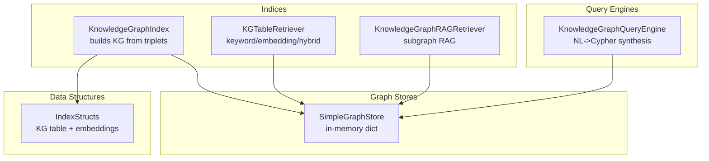
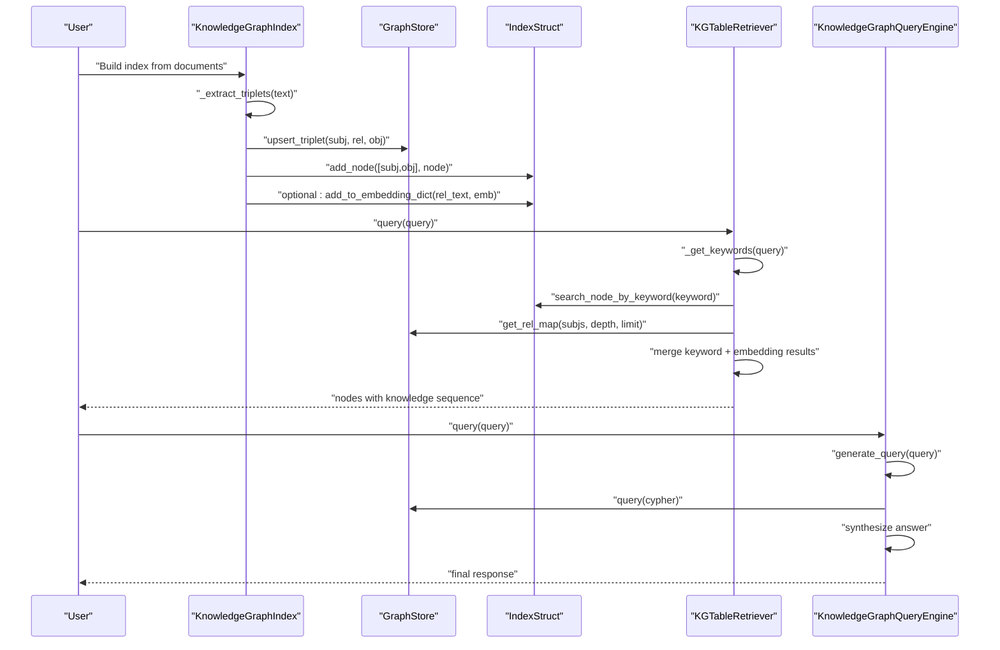
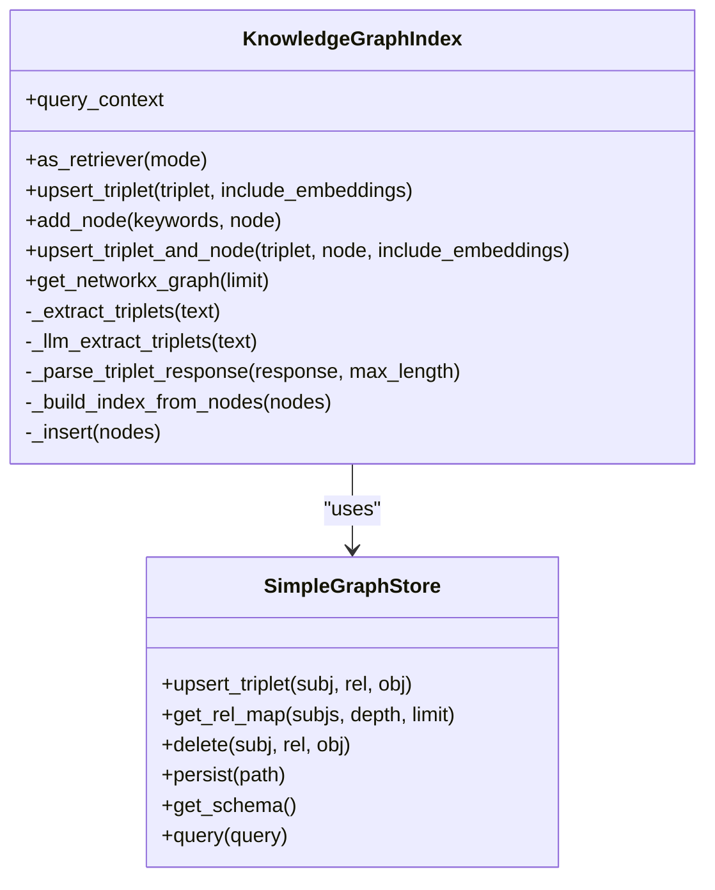
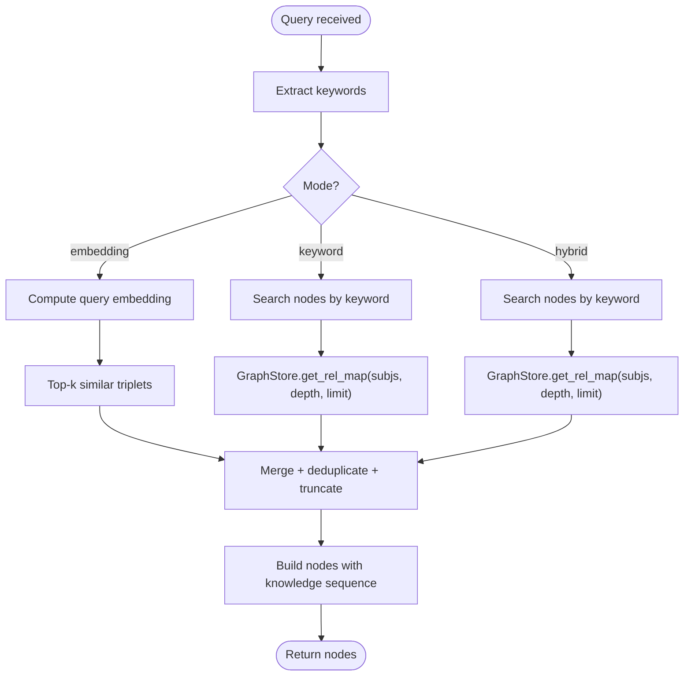
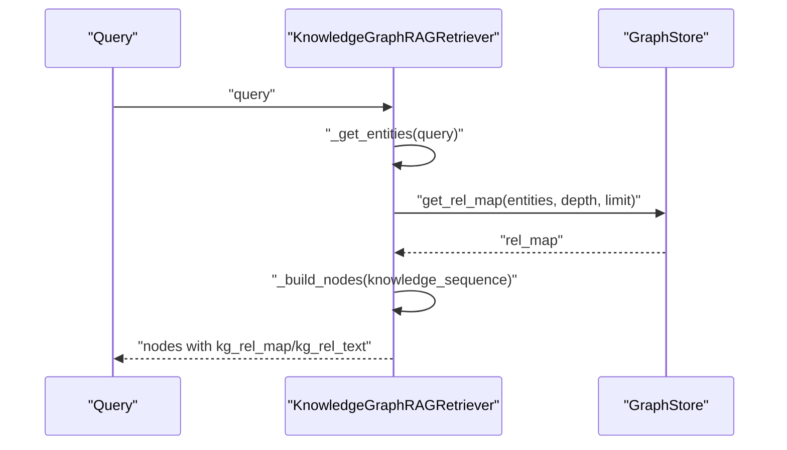
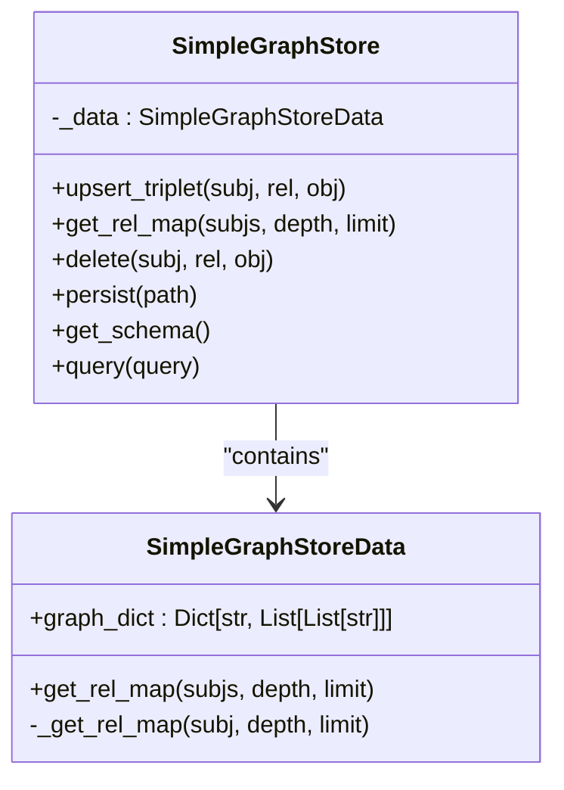
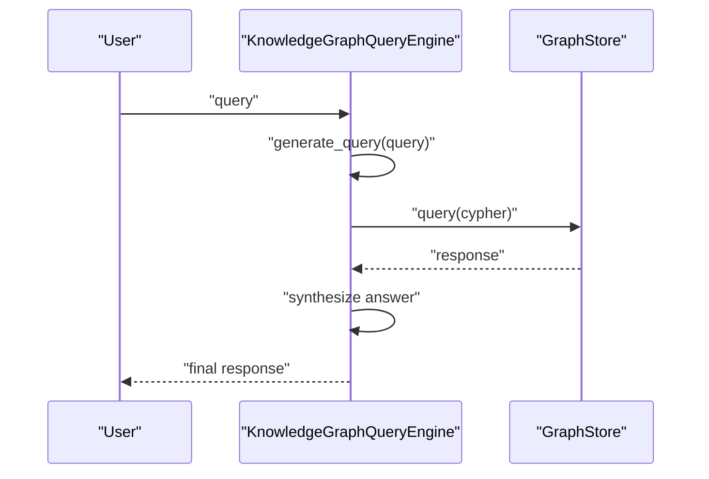
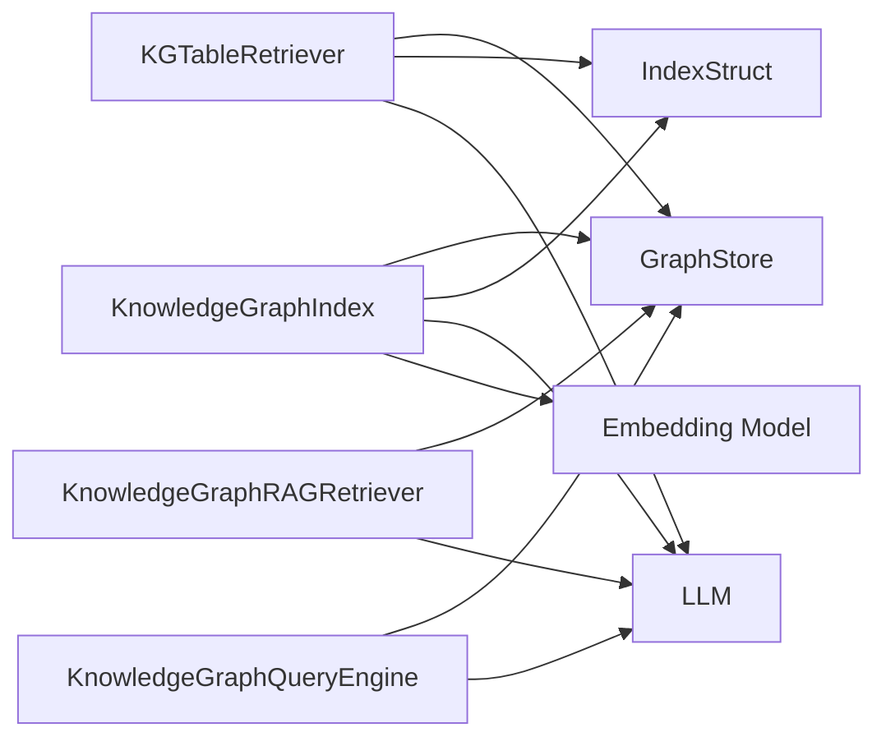

# Knowledge Graph Indexes

<cite>
**Referenced Files in This Document**
- [knowledge_graph/base.py](file://llama-index-core/llama_index/core/indices/knowledge_graph/base.py)
- [knowledge_graph/retrievers.py](file://llama-index-core/llama_index/core/indices/knowledge_graph/retrievers.py)
- [simple.py](file://llama-index-core/llama_index/core/graph_stores/simple.py)
- [knowledge_graph_query_engine.py](file://llama-index-core/llama_index/core/query_engine/knowledge_graph_query_engine.py)
- [data_structs.py](file://llama-index-core/llama_index/core/data_structs/data_structs.py)
- [knowledge_graph.md](file://docs/api_reference/api_reference/indices/knowledge_graph.md)
- [knowledge_graph.md](file://docs/api_reference/api_reference/query_engine/knowledge_graph.md)
- [knowledge_graph2.ipynb](file://docs/examples/index_structs/knowledge_graph/knowledge_graph2.ipynb)
- [knowledge_graph_query_engine.ipynb](file://docs/examples/query_engine/knowledge_graph_query_engine.ipynb)
</cite>

## Table of Contents
1. [Introduction](#introduction)
2. [Project Structure](#project-structure)
3. [Core Components](#core-components)
4. [Architecture Overview](#architecture-overview)
5. [Detailed Component Analysis](#detailed-component-analysis)
6. [Dependency Analysis](#dependency-analysis)
7. [Performance Considerations](#performance-considerations)
8. [Troubleshooting Guide](#troubleshooting-guide)
9. [Conclusion](#conclusion)
10. [Appendices](#appendices)

## Introduction
This document explains Knowledge Graph Indexes in LlamaIndex, focusing on how triplets are extracted from text, how a knowledge graph is built and queried, and how graph stores integrate with retrieval and generation workflows. It covers the KnowledgeGraphIndex class, triple extraction patterns, graph store integration, and graph-based reasoning. Practical examples demonstrate configuring entity extraction, defining relationships, performing graph traversals, and combining graph queries with traditional retrieval. Guidance is also provided for schema design, performance optimization for large knowledge graphs, and integration with external graph databases.

## Project Structure
The Knowledge Graph Index implementation spans several modules:
- Indices: KnowledgeGraphIndex and KG retrievers
- Graph Stores: SimpleGraphStore and others
- Query Engines: KnowledgeGraphQueryEngine for natural-language-to-graph translation
- Data Structures: Index structs backing the KG index

**Diagram sources**
- [knowledge_graph/base.py](file://llama-index-core/llama_index/core/indices/knowledge_graph/base.py#L42-L389)
- [knowledge_graph/retrievers.py](file://llama-index-core/llama_index/core/indices/knowledge_graph/retrievers.py#L68-L860)
- [simple.py](file://llama-index-core/llama_index/core/graph_stores/simple.py#L72-L187)
- [knowledge_graph_query_engine.py](file://llama-index-core/llama_index/core/query_engine/knowledge_graph_query_engine.py#L53-L269)
- [data_structs.py](file://llama-index-core/llama_index/core/data_structs/data_structs.py#L116-L147)

**Section sources**
- [knowledge_graph/base.py](file://llama-index-core/llama_index/core/indices/knowledge_graph/base.py#L1-L389)
- [knowledge_graph/retrievers.py](file://llama-index-core/llama_index/core/indices/knowledge_graph/retrievers.py#L1-L860)
- [simple.py](file://llama-index-core/llama_index/core/graph_stores/simple.py#L1-L187)
- [knowledge_graph_query_engine.py](file://llama-index-core/llama_index/core/query_engine/knowledge_graph_query_engine.py#L1-L269)
- [data_structs.py](file://llama-index-core/llama_index/core/data_structs/data_structs.py#L1-L200)

## Core Components
- KnowledgeGraphIndex: Builds a knowledge graph by extracting triplets from node content and storing them in a graph store. It maintains a keyword-to-node mapping and supports optional embedding storage for triplets.
- KGTableRetriever: Retrieves relevant text chunks and knowledge sequences using keyword extraction, graph store traversal, and optional embedding similarity. Supports modes: keyword, embedding, hybrid.
- KnowledgeGraphRAGRetriever: Performs subgraph RAG by extracting entities and synonyms, expanding to a knowledge sequence, and returning structured context nodes.
- SimpleGraphStore: An in-memory graph store that persists triplets as a subject-to-(relationship, object) adjacency list with depth-aware traversal and limits.
- KnowledgeGraphQueryEngine: Synthesizes graph database queries from natural language and answers questions using the graph store’s response.
- IndexStructs: KeywordTable and related structures that back the KG index’s keyword mapping and optional embedding dictionary.

Key capabilities:
- Triple extraction via LLM or custom extractor
- Graph traversal with configurable depth and limits
- Hybrid retrieval combining keyword and embedding similarity
- Natural language-to-graph query synthesis and response generation

**Section sources**
- [knowledge_graph/base.py](file://llama-index-core/llama_index/core/indices/knowledge_graph/base.py#L42-L389)
- [knowledge_graph/retrievers.py](file://llama-index-core/llama_index/core/indices/knowledge_graph/retrievers.py#L68-L860)
- [simple.py](file://llama-index-core/llama_index/core/graph_stores/simple.py#L72-L187)
- [knowledge_graph_query_engine.py](file://llama-index-core/llama_index/core/query_engine/knowledge_graph_query_engine.py#L53-L269)
- [data_structs.py](file://llama-index-core/llama_index/core/data_structs/data_structs.py#L116-L147)

## Architecture Overview
The Knowledge Graph Index architecture integrates triple extraction, graph storage, retrieval, and generation:

**Diagram sources**
- [knowledge_graph/base.py](file://llama-index-core/llama_index/core/indices/knowledge_graph/base.py#L152-L232)
- [knowledge_graph/retrievers.py](file://llama-index-core/llama_index/core/indices/knowledge_graph/retrievers.py#L190-L381)
- [knowledge_graph_query_engine.py](file://llama-index-core/llama_index/core/query_engine/knowledge_graph_query_engine.py#L125-L208)

## Detailed Component Analysis

### KnowledgeGraphIndex
Responsibilities:
- Extract triplets from node content using an LLM or a custom extractor
- Upsert triplets into the graph store
- Maintain keyword-to-node mapping for retrieval
- Optionally compute and store embeddings for triplets
- Provide a retriever and graph visualization helpers

Key behaviors:
- Triple extraction pipeline: custom extractor or LLM-based extraction with parsing
- Index struct updates: add nodes to keyword table and optionally store embeddings
- Retrieval integration: exposes as_retriever with mode selection

**Diagram sources**
- [knowledge_graph/base.py](file://llama-index-core/llama_index/core/indices/knowledge_graph/base.py#L42-L389)
- [simple.py](file://llama-index-core/llama_index/core/graph_stores/simple.py#L72-L187)

**Section sources**
- [knowledge_graph/base.py](file://llama-index-core/llama_index/core/indices/knowledge_graph/base.py#L42-L389)

### KGTableRetriever
Responsibilities:
- Extract keywords from queries
- Retrieve nodes via keyword mapping
- Traverse the graph store with configurable depth
- Optionally use embeddings to find similar triplets
- Merge results and return nodes enriched with knowledge sequences

Modes:
- keyword: keyword-based retrieval
- embedding: embedding similarity over stored triplets
- hybrid: combine both, deduplicate, truncate, and rank

**Diagram sources**
- [knowledge_graph/retrievers.py](file://llama-index-core/llama_index/core/indices/knowledge_graph/retrievers.py#L190-L381)

**Section sources**
- [knowledge_graph/retrievers.py](file://llama-index-core/llama_index/core/indices/knowledge_graph/retrievers.py#L68-L381)

### KnowledgeGraphRAGRetriever
Responsibilities:
- Extract entities and expand synonyms
- Build a knowledge sequence by traversing the graph store
- Return structured nodes containing the knowledge sequence and optional schema

**Diagram sources**
- [knowledge_graph/retrievers.py](file://llama-index-core/llama_index/core/indices/knowledge_graph/retrievers.py#L417-L771)

**Section sources**
- [knowledge_graph/retrievers.py](file://llama-index-core/llama_index/core/indices/knowledge_graph/retrievers.py#L417-L771)

### SimpleGraphStore
Responsibilities:
- Store triplets as an adjacency list keyed by subject
- Provide depth-aware traversal with limits
- Support upsert, delete, persistence, and schema/query hooks

**Diagram sources**
- [simple.py](file://llama-index-core/llama_index/core/graph_stores/simple.py#L20-L187)

**Section sources**
- [simple.py](file://llama-index-core/llama_index/core/graph_stores/simple.py#L72-L187)

### KnowledgeGraphQueryEngine
Responsibilities:
- Synthesize a graph store query from natural language using an LLM
- Execute the query against the graph store
- Synthesize a final answer using the response and original question

**Diagram sources**
- [knowledge_graph_query_engine.py](file://llama-index-core/llama_index/core/query_engine/knowledge_graph_query_engine.py#L125-L208)

**Section sources**
- [knowledge_graph_query_engine.py](file://llama-index-core/llama_index/core/query_engine/knowledge_graph_query_engine.py#L53-L269)

### IndexStructs and Triple Embeddings
- KeywordTable: maps keywords to node IDs for efficient retrieval
- KG index stores optional embeddings for triplets to enable semantic similarity retrieval

**Section sources**
- [data_structs.py](file://llama-index-core/llama_index/core/data_structs/data_structs.py#L116-L147)
- [knowledge_graph/base.py](file://llama-index-core/llama_index/core/indices/knowledge_graph/base.py#L223-L231)

## Dependency Analysis
- KnowledgeGraphIndex depends on:
  - GraphStore for triple storage and traversal
  - IndexStruct for keyword-to-node mapping and optional embeddings
  - LLM for triplet extraction and optional query synthesis
  - Embedding model for triplet embeddings
- KGTableRetriever and KnowledgeGraphRAGRetriever depend on:
  - GraphStore for knowledge sequence extraction
  - IndexStruct for keyword lookup
  - LLM for keyword/entity extraction and synonym expansion
- KnowledgeGraphQueryEngine depends on:
  - GraphStore for query execution
  - LLM for natural language-to-graph query synthesis

**Diagram sources**
- [knowledge_graph/base.py](file://llama-index-core/llama_index/core/indices/knowledge_graph/base.py#L1-L389)
- [knowledge_graph/retrievers.py](file://llama-index-core/llama_index/core/indices/knowledge_graph/retrievers.py#L1-L860)
- [knowledge_graph_query_engine.py](file://llama-index-core/llama_index/core/query_engine/knowledge_graph_query_engine.py#L1-L269)

**Section sources**
- [knowledge_graph/base.py](file://llama-index-core/llama_index/core/indices/knowledge_graph/base.py#L1-L389)
- [knowledge_graph/retrievers.py](file://llama-index-core/llama_index/core/indices/knowledge_graph/retrievers.py#L1-L860)
- [knowledge_graph_query_engine.py](file://llama-index-core/llama_index/core/query_engine/knowledge_graph_query_engine.py#L1-L269)

## Performance Considerations
- Limit traversal breadth and depth to control graph expansion cost
- Use embedding similarity judiciously; precompute and cache embeddings for large triple sets
- Persist graph store to disk to avoid recomputation
- Truncate knowledge sequences to maintain context window constraints
- Prefer hybrid retrieval only when embeddings are meaningful and representative
- Monitor memory usage when storing large keyword-to-node mappings

[No sources needed since this section provides general guidance]

## Troubleshooting Guide
Common issues and resolutions:
- Missing graph store in storage context: ensure a graph store is provided when constructing retrievers or query engines
- Empty knowledge sequences: verify entity extraction and synonym expansion; confirm graph store contains expected triplets
- Large knowledge sequences: adjust max_knowledge_sequence and traversal depth to fit model context windows
- Schema errors: some graph stores require explicit schema; refresh schema or configure tags/edge types appropriately
- Deprecation warnings: KnowledgeGraphIndex, KGTableRetriever, KnowledgeGraphRAGRetriever, and KnowledgeGraphQueryEngine are deprecated; migrate to PropertyGraphIndex and associated retrievers

**Section sources**
- [knowledge_graph/retrievers.py](file://llama-index-core/llama_index/core/indices/knowledge_graph/retrievers.py#L473-L539)
- [knowledge_graph_query_engine.py](file://llama-index-core/llama_index/core/query_engine/knowledge_graph_query_engine.py#L80-L86)

## Conclusion
Knowledge Graph Indexes in LlamaIndex provide a robust pathway from raw text to a structured knowledge graph, enabling both retrieval-driven and generation-driven reasoning. The KnowledgeGraphIndex orchestrates triple extraction and storage, while KGTableRetriever and KnowledgeGraphRAGRetriever offer flexible retrieval strategies. KnowledgeGraphQueryEngine bridges natural language and graph databases. For production systems, consider migrating to the newer PropertyGraphIndex and associated retrievers, and carefully tune traversal depth, sequence limits, and embedding usage to balance accuracy and performance.

[No sources needed since this section summarizes without analyzing specific files]

## Appendices

### Practical Examples and How-To
- Building a knowledge graph with triple extraction and optional Wikipedia filtering
  - Example notebook demonstrates custom extraction functions and embedding inclusion
  - Reference: [knowledge_graph2.ipynb](file://docs/examples/index_structs/knowledge_graph/knowledge_graph2.ipynb#L403-L418)
- Querying a knowledge graph using natural language with a graph store
  - Example notebook shows KnowledgeGraphQueryEngine usage with a graph store
  - Reference: [knowledge_graph_query_engine.ipynb](file://docs/examples/query_engine/knowledge_graph_query_engine.ipynb#L593-L642)

**Section sources**
- [knowledge_graph2.ipynb](file://docs/examples/index_structs/knowledge_graph/knowledge_graph2.ipynb#L403-L418)
- [knowledge_graph_query_engine.ipynb](file://docs/examples/query_engine/knowledge_graph_query_engine.ipynb#L593-L642)

### API References
- KnowledgeGraphIndex: [knowledge_graph.md](file://docs/api_reference/api_reference/indices/knowledge_graph.md#L1-L4)
- KnowledgeGraphQueryEngine: [knowledge_graph.md](file://docs/api_reference/api_reference/query_engine/knowledge_graph.md#L1-L4)

**Section sources**
- [knowledge_graph.md](file://docs/api_reference/api_reference/indices/knowledge_graph.md#L1-L4)
- [knowledge_graph.md](file://docs/api_reference/api_reference/query_engine/knowledge_graph.md#L1-L4)