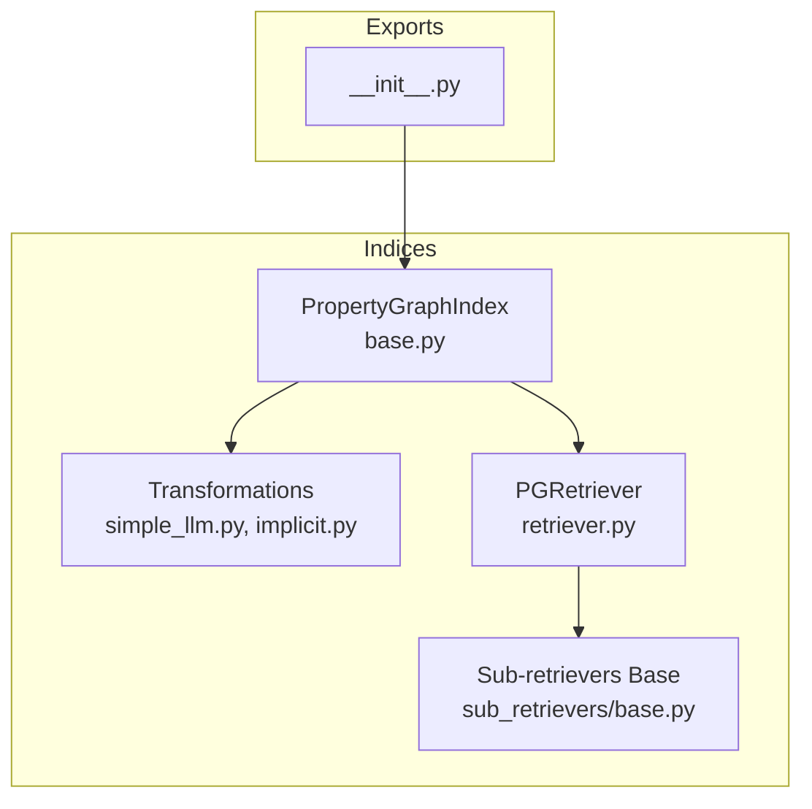
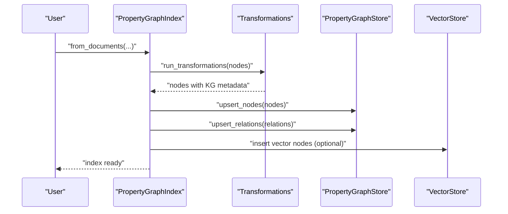
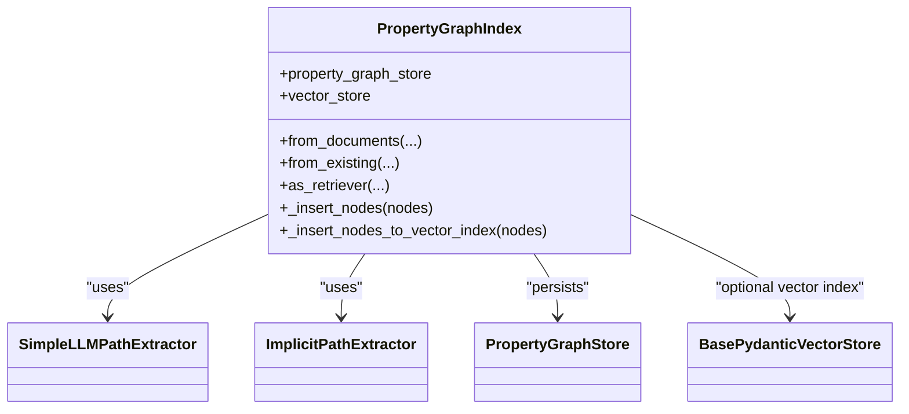
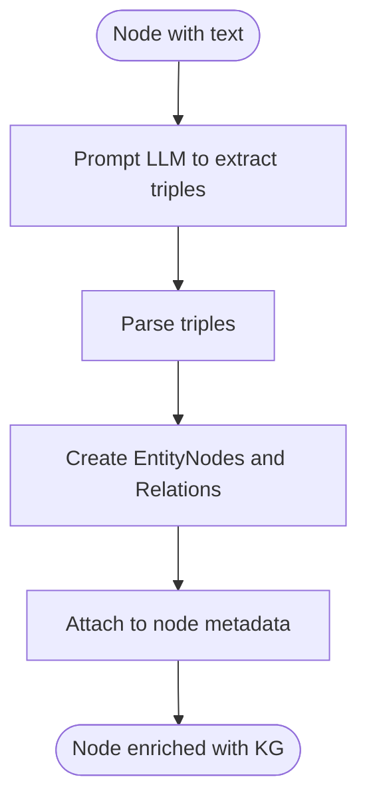
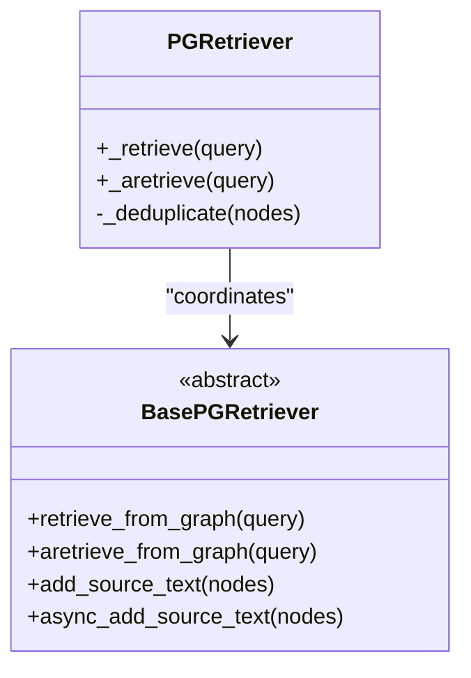
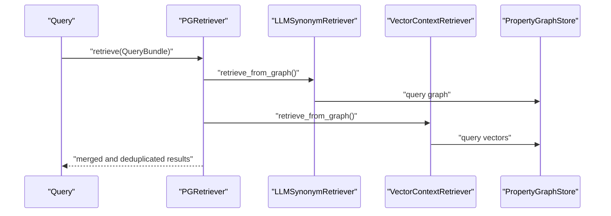
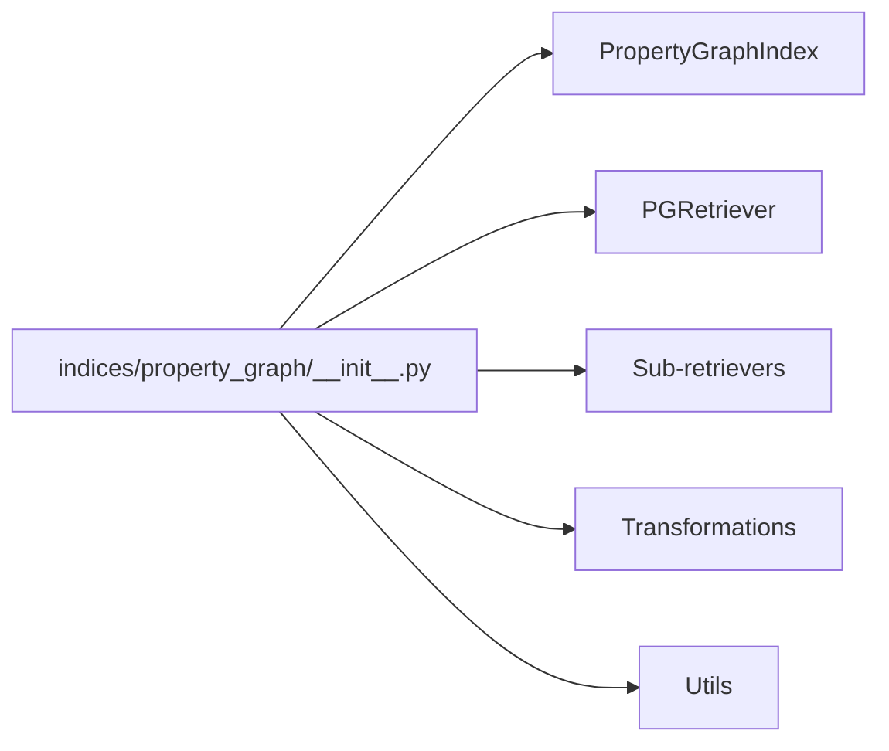

# Property Graph Indexes

<cite>
**Referenced Files in This Document**
- [__init__.py](file://llama-index-core/llama_index/core/indices/property_graph/__init__.py)
- [base.py](file://llama-index-core/llama_index/core/indices/property_graph/base.py)
- [retriever.py](file://llama-index-core/llama_index/core/indices/property_graph/retriever.py)
- [transformations/__init__.py](file://llama-index-core/llama_index/core/indices/property_graph/transformations/__init__.py)
- [simple_llm.py](file://llama-index-core/llama_index/core/indices/property_graph/transformations/simple_llm.py)
- [implicit.py](file://llama-index-core/llama_index/core/indices/property_graph/transformations/implicit.py)
- [base.py](file://llama-index-core/llama_index/core/indices/property_graph/sub_retrievers/base.py)
- [property_graph.md](file://docs/api_reference/api_reference/indices/property_graph.md)
- [property_graph_basic.ipynb](file://docs/examples/property_graph/property_graph_basic.ipynb)
</cite>

## Table of Contents
1. [Introduction](#introduction)
2. [Project Structure](#project-structure)
3. [Core Components](#core-components)
4. [Architecture Overview](#architecture-overview)
5. [Detailed Component Analysis](#detailed-component-analysis)
6. [Dependency Analysis](#dependency-analysis)
7. [Performance Considerations](#performance-considerations)
8. [Troubleshooting Guide](#troubleshooting-guide)
9. [Conclusion](#conclusion)
10. [Appendices](#appendices)

## Introduction
This document explains LlamaIndex’s property graph indexing capabilities with a focus on the PropertyGraphIndex implementation, heterogeneous graph support, and property storage mechanisms. It covers how graphs are constructed from entities and relationships, how node and edge properties are stored and queried, and how traversal-style retrieval works. Practical examples illustrate building a graph index, querying properties, and integrating with external vector stores. Advanced topics include graph partitioning, distributed storage, and performance optimization strategies.

## Project Structure
The property graph index lives under the indices module and composes:
- Index entry points and exports
- The main PropertyGraphIndex class
- Retrievers and sub-retrievers
- Transformation components for extracting explicit and implicit knowledge graph paths
- API reference and example notebooks

**Diagram sources**
- [__init__.py](file://llama-index-core/llama_index/core/indices/property_graph/__init__.py#L1-L54)
- [base.py](file://llama-index-core/llama_index/core/indices/property_graph/base.py#L43-L410)
- [retriever.py](file://llama-index-core/llama_index/core/indices/property_graph/retriever.py#L12-L72)
- [transformations/__init__.py](file://llama-index-core/llama_index/core/indices/property_graph/transformations/__init__.py#L1-L20)
- [simple_llm.py](file://llama-index-core/llama_index/core/indices/property_graph/transformations/simple_llm.py#L22-L131)
- [implicit.py](file://llama-index-core/llama_index/core/indices/property_graph/transformations/implicit.py#L12-L92)
- [base.py](file://llama-index-core/llama_index/core/indices/property_graph/sub_retrievers/base.py#L22-L166)

**Section sources**
- [__init__.py](file://llama-index-core/llama_index/core/indices/property_graph/__init__.py#L1-L54)
- [base.py](file://llama-index-core/llama_index/core/indices/property_graph/base.py#L43-L410)
- [retriever.py](file://llama-index-core/llama_index/core/indices/property_graph/retriever.py#L12-L72)
- [transformations/__init__.py](file://llama-index-core/llama_index/core/indices/property_graph/transformations/__init__.py#L1-L20)
- [simple_llm.py](file://llama-index-core/llama_index/core/indices/property_graph/transformations/simple_llm.py#L22-L131)
- [implicit.py](file://llama-index-core/llama_index/core/indices/property_graph/transformations/implicit.py#L12-L92)
- [base.py](file://llama-index-core/llama_index/core/indices/property_graph/sub_retrievers/base.py#L22-L166)

## Core Components
- PropertyGraphIndex: orchestrates ingestion, extraction, embedding, and insertion into a property graph store; exposes retrieval and query engine interfaces.
- Transformations: extract explicit triples via LLM prompting and implicit edges from node relationships.
- Retrievers: combine multiple sub-retrievers (synonym expansion, vector context) to return graph paths and optionally attach source text.

Key responsibilities:
- Extraction pipeline: SimpleLLMPathExtractor and ImplicitPathExtractor populate node metadata with KG nodes and relations.
- Storage: Property graph store persists nodes, relations, and optionally links to vector store for vectorized retrieval.
- Retrieval: PGRetriever coordinates sub-retrievers and merges results.

**Section sources**
- [base.py](file://llama-index-core/llama_index/core/indices/property_graph/base.py#L43-L410)
- [simple_llm.py](file://llama-index-core/llama_index/core/indices/property_graph/transformations/simple_llm.py#L22-L131)
- [implicit.py](file://llama-index-core/llama_index/core/indices/property_graph/transformations/implicit.py#L12-L92)
- [retriever.py](file://llama-index-core/llama_index/core/indices/property_graph/retriever.py#L12-L72)
- [base.py](file://llama-index-core/llama_index/core/indices/property_graph/sub_retrievers/base.py#L22-L166)

## Architecture Overview
The PropertyGraphIndex integrates transformations, a property graph store, and optional vector store to build and query a heterogeneous graph of entities and relations.

**Diagram sources**
- [base.py](file://llama-index-core/llama_index/core/indices/property_graph/base.py#L195-L308)
- [simple_llm.py](file://llama-index-core/llama_index/core/indices/property_graph/transformations/simple_llm.py#L74-L131)
- [implicit.py](file://llama-index-core/llama_index/core/indices/property_graph/transformations/implicit.py#L23-L92)

## Detailed Component Analysis

### PropertyGraphIndex
Responsibilities:
- Initialize storage context with a property graph store and optional vector store.
- Run transformations to extract explicit and implicit knowledge graph paths.
- Upsert nodes, relations, and optionally embed nodes for vector retrieval.
- Expose retriever and query engine interfaces.

Notable behaviors:
- Embedding control: embedding of KG nodes is enabled when the graph store supports vector queries or when an override vector store is provided.
- Duplicate handling: filters duplicates for both LlamaIndex nodes and KG nodes.
- Schema refresh: refreshes schema if the graph store supports structured queries.

**Diagram sources**
- [base.py](file://llama-index-core/llama_index/core/indices/property_graph/base.py#L43-L410)
- [simple_llm.py](file://llama-index-core/llama_index/core/indices/property_graph/transformations/simple_llm.py#L22-L131)
- [implicit.py](file://llama-index-core/llama_index/core/indices/property_graph/transformations/implicit.py#L12-L92)

**Section sources**
- [base.py](file://llama-index-core/llama_index/core/indices/property_graph/base.py#L80-L143)
- [base.py](file://llama-index-core/llama_index/core/indices/property_graph/base.py#L145-L179)
- [base.py](file://llama-index-core/llama_index/core/indices/property_graph/base.py#L181-L194)
- [base.py](file://llama-index-core/llama_index/core/indices/property_graph/base.py#L195-L308)
- [base.py](file://llama-index-core/llama_index/core/indices/property_graph/base.py#L310-L331)
- [base.py](file://llama-index-core/llama_index/core/indices/property_graph/base.py#L332-L339)
- [base.py](file://llama-index-core/llama_index/core/indices/property_graph/base.py#L341-L393)
- [base.py](file://llama-index-core/llama_index/core/indices/property_graph/base.py#L395-L410)

### Transformations: Explicit and Implicit Path Extraction
- SimpleLLMPathExtractor: prompts an LLM to extract triples from text, parses the output, and attaches entity and relation nodes plus metadata to the source node.
- ImplicitPathExtractor: infers edges from node relationships (e.g., parent/child, previous/next, source) and adds them to the node metadata.

**Diagram sources**
- [simple_llm.py](file://llama-index-core/llama_index/core/indices/property_graph/transformations/simple_llm.py#L74-L115)

**Section sources**
- [simple_llm.py](file://llama-index-core/llama_index/core/indices/property_graph/transformations/simple_llm.py#L22-L131)
- [implicit.py](file://llama-index-core/llama_index/core/indices/property_graph/transformations/implicit.py#L12-L92)

### Retrievers and Sub-Retrievers
- PGRetriever: orchestrates multiple sub-retrievers, deduplicates results, and optionally runs asynchronously.
- BasePGRetriever: base interface for graph-aware retrievers; handles attaching source text and properties to results.

**Diagram sources**
- [retriever.py](file://llama-index-core/llama_index/core/indices/property_graph/retriever.py#L12-L72)
- [base.py](file://llama-index-core/llama_index/core/indices/property_graph/sub_retrievers/base.py#L22-L166)

**Section sources**
- [retriever.py](file://llama-index-core/llama_index/core/indices/property_graph/retriever.py#L12-L72)
- [base.py](file://llama-index-core/llama_index/core/indices/property_graph/sub_retrievers/base.py#L22-L166)

### Property Storage Mechanisms
- Nodes and relations are stored in the property graph store with metadata and optional embeddings.
- Triplets are represented as (EntityNode, Relation, EntityNode) with properties attached.
- A special source key links graph nodes back to the original LlamaIndex node for provenance and text attachment.

Practical implications:
- Properties enable filtering and analytics on entities and relations.
- Embeddings enable vector similarity search for nodes when the graph store lacks native vector support.

**Section sources**
- [base.py](file://llama-index-core/llama_index/core/indices/property_graph/base.py#L219-L235)
- [base.py](file://llama-index-core/llama_index/core/indices/property_graph/base.py#L227-L230)
- [base.py](file://llama-index-core/llama_index/core/indices/property_graph/base.py#L290-L302)
- [base.py](file://llama-index-core/llama_index/core/indices/property_graph/base.py#L310-L331)
- [base.py](file://llama-index-core/llama_index/core/indices/property_graph/sub_retrievers/base.py#L52-L78)

### Graph Traversal and Querying
- Retrieval combines synonym/keyword expansion and vector context retrieval to select candidate nodes.
- Results are returned as graph paths (triplets) and optionally augmented with source text.
- Users can customize sub-retrievers and include/exclude properties for analytics.

**Diagram sources**
- [retriever.py](file://llama-index-core/llama_index/core/indices/property_graph/retriever.py#L51-L72)
- [base.py](file://llama-index-core/llama_index/core/indices/property_graph/sub_retrievers/base.py#L155-L165)

**Section sources**
- [retriever.py](file://llama-index-core/llama_index/core/indices/property_graph/retriever.py#L51-L72)
- [base.py](file://llama-index-core/llama_index/core/indices/property_graph/sub_retrievers/base.py#L143-L153)

### Use Cases and Examples
- Knowledge graphs: extract entities and relations from documents and visualize or persist the graph.
- Semantic networks: leverage vector retrieval to find semantically similar nodes for reasoning.
- Relationship discovery: combine explicit LLM extraction with implicit edges inferred from document structure.

Example references:
- Basic construction, querying, and persistence
- Vector store integration with external stores

**Section sources**
- [property_graph_basic.ipynb](file://docs/examples/property_graph/property_graph_basic.ipynb#L103-L113)
- [property_graph_basic.ipynb](file://docs/examples/property_graph/property_graph_basic.ipynb#L260-L268)
- [property_graph_basic.ipynb](file://docs/examples/property_graph/property_graph_basic.ipynb#L284-L291)
- [property_graph_basic.ipynb](file://docs/examples/property_graph/property_graph_basic.ipynb#L317-L324)
- [property_graph_basic.ipynb](file://docs/examples/property_graph/property_graph_basic.ipynb#L359-L368)

## Dependency Analysis
Exports and public APIs surface the index, retrievers, and transformations.

**Diagram sources**
- [__init__.py](file://llama-index-core/llama_index/core/indices/property_graph/__init__.py#L1-L54)
- [transformations/__init__.py](file://llama-index-core/llama_index/core/indices/property_graph/transformations/__init__.py#L1-L20)
- [property_graph.md](file://docs/api_reference/api_reference/indices/property_graph.md#L1-L4)

**Section sources**
- [__init__.py](file://llama-index-core/llama_index/core/indices/property_graph/__init__.py#L34-L53)
- [transformations/__init__.py](file://llama-index-core/llama_index/core/indices/property_graph/transformations/__init__.py#L14-L19)
- [property_graph.md](file://docs/api_reference/api_reference/indices/property_graph.md#L1-L4)

## Performance Considerations
- Asynchronous transformations and retrievals: enable async execution to improve throughput during extraction and retrieval.
- Parallel extraction: SimpleLLMPathExtractor supports worker-based parallelism to process multiple nodes concurrently.
- Embedding batching: embeddings are computed in batches to reduce overhead.
- Vector store selection: when the graph store lacks vector support, an external vector store can be provided to accelerate nearest neighbor searches.
- Deduplication: PGRetriever deduplicates results to avoid redundant paths.

[No sources needed since this section provides general guidance]

## Troubleshooting Guide
Common issues and remedies:
- Missing source text in results: ensure include_text is enabled in the retriever and that the graph store can map graph nodes back to original LlamaIndex nodes.
- Duplicate nodes/relations: the index filters duplicates for both LlamaIndex nodes and KG nodes; verify that the property graph store supports upsert semantics.
- No vector retrieval: if the graph store does not support vector queries, provide an external vector store and ensure embeddings are generated for KG nodes.
- Schema refresh: if using a graph store that supports structured queries, the index attempts to refresh the schema after insertion.

**Section sources**
- [base.py](file://llama-index-core/llama_index/core/indices/property_graph/base.py#L236-L249)
- [base.py](file://llama-index-core/llama_index/core/indices/property_graph/base.py#L304-L306)
- [base.py](file://llama-index-core/llama_index/core/indices/property_graph/sub_retrievers/base.py#L143-L153)

## Conclusion
PropertyGraphIndex in LlamaIndex provides a robust pipeline to construct heterogeneous property graphs from text, embed nodes when needed, and retrieve meaningful paths via hybrid retrieval. With transformation components for explicit and implicit knowledge extraction, and flexible storage backed by a property graph store and optional vector store, it supports knowledge graphs, semantic networks, and relationship discovery. The retriever orchestration and deduplication help produce coherent and efficient results.

[No sources needed since this section summarizes without analyzing specific files]

## Appendices

### Practical Recipes
- Build a property graph index from documents and persist it to disk.
- Combine an external vector store with the property graph index for vector retrieval.
- Customize extraction by swapping SimpleLLMPathExtractor with other extractors or adding dynamic LLM-based extraction.

**Section sources**
- [property_graph_basic.ipynb](file://docs/examples/property_graph/property_graph_basic.ipynb#L103-L113)
- [property_graph_basic.ipynb](file://docs/examples/property_graph/property_graph_basic.ipynb#L317-L324)
- [property_graph_basic.ipynb](file://docs/examples/property_graph/property_graph_basic.ipynb#L359-L368)
- [transformations/__init__.py](file://llama-index-core/llama_index/core/indices/property_graph/transformations/__init__.py#L1-L20)