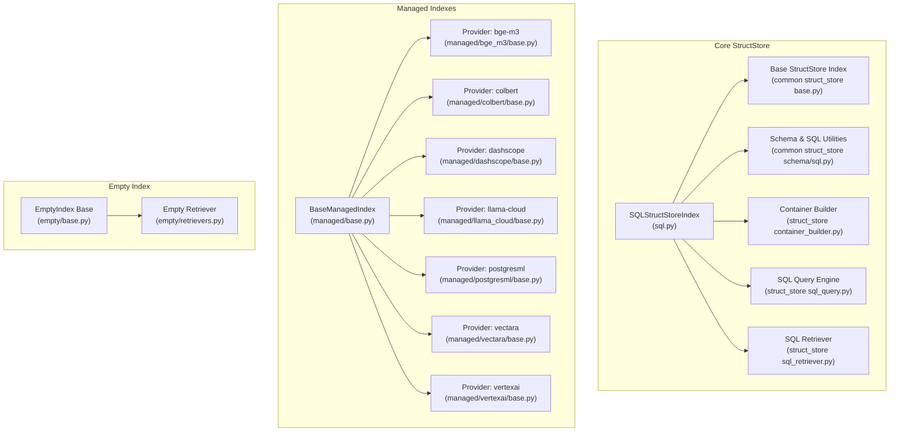
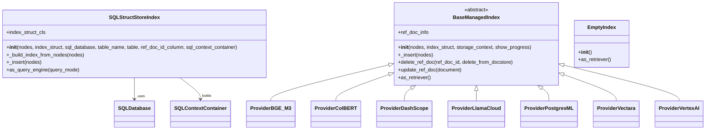
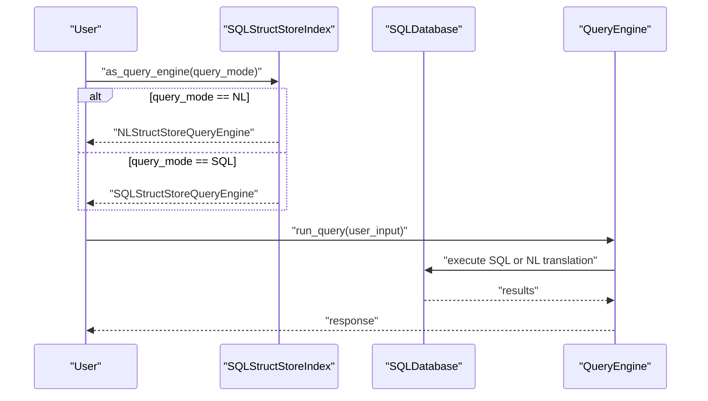
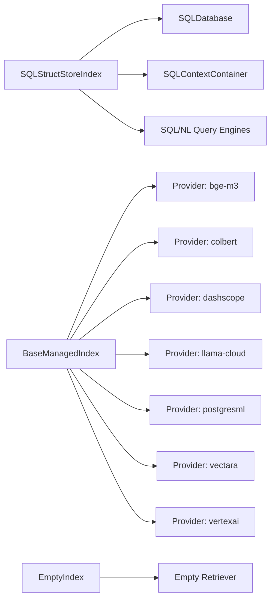

# Specialized Indexes

<cite>
**Referenced Files in This Document**
- [sql.py](file://llama-index-core/llama_index/core/indices/struct_store/sql.py)
- [pandas.py](file://llama-index-core/llama_index/core/indices/struct_store/pandas.py)
- [base.py](file://llama-index-core/llama_index/core/indices/managed/base.py)
- [base.py](file://llama-index-core/llama_index/core/indices/empty/base.py)
- [retrievers.py](file://llama-index-core/llama_index/core/indices/empty/retrievers.py)
- [base.py](file://llama-index-core/llama_index/core/indices/common/struct_store/base.py)
- [schema.py](file://llama-index-core/llama_index/core/indices/common/struct_store/schema.py)
- [sql.py](file://llama-index-core/llama_index/core/indices/common/struct_store/sql.py)
- [container_builder.py](file://llama-index-core/llama_index/core/indices/struct_store/container_builder.py)
- [sql_query.py](file://llama-index-core/llama_index/core/indices/struct_store/sql_query.py)
- [sql_retriever.py](file://llama-index-core/llama_index/core/indices/struct_store/sql_retriever.py)
- [types.py](file://llama-index-core/llama_index/core/indices/managed/types.py)
- [base.py](file://llama-index-integrations/indices/llama-index-indices-managed-bge-m3/llama_index/indices/managed/bge_m3/base.py)
- [base.py](file://llama-index-integrations/indices/llama-index-indices-managed-colbert/llama_index/indices/managed/colbert/base.py)
- [base.py](file://llama-index-integrations/indices/llama-index-indices-managed-dashscope/llama_index/indices/managed/dashscope/base.py)
- [base.py](file://llama-index-integrations/indices/llama-index-indices-managed-llama-cloud/llama_index/indices/managed/llama_cloud/base.py)
- [base.py](file://llama-index-integrations/indices/llama-index-indices-managed-postgresml/llama_index/indices/managed/postgresml/base.py)
- [base.py](file://llama-index-integrations/indices/llama-index-indices-managed-vectara/llama_index/indices/managed/vectara/base.py)
- [base.py](file://llama-index-integrations/indices/llama-index-indices-managed-vertexai/llama_index/indices/managed/vertexai/base.py)
</cite>

## Table of Contents
1. [Introduction](#introduction)
2. [Project Structure](#project-structure)
3. [Core Components](#core-components)
4. [Architecture Overview](#architecture-overview)
5. [Detailed Component Analysis](#detailed-component-analysis)
6. [Dependency Analysis](#dependency-analysis)
7. [Performance Considerations](#performance-considerations)
8. [Troubleshooting Guide](#troubleshooting-guide)
9. [Conclusion](#conclusion)

## Introduction
This document explains specialized index types in LlamaIndex with a focus on:
- StructStore indexes for structured/tabular data
- Multi-modal indexes for mixed media
- Managed indexes for cloud-managed services
- Empty indexes for initialization and testing

It covers SQLStructStoreIndex for relational data, PandasIndex for tabular data, and outlines MultiModalVectorStoreIndex usage patterns. It also documents the ManagedIndex abstraction and EmptyIndex for initialization. Practical guidance is provided for selection, configuration, schema management, hybrid strategies, and performance optimization.

## Project Structure
The specialized indexes are implemented across several modules:
- StructStore indexes: struct_store module and common struct_store schema/sql utilities
- Managed indexes: managed base and provider-specific integrations
- Empty indexes: empty module for initialization/testing
- Multi-modal: integration packs and vector stores for multimodal retrieval

**Diagram sources**
- [sql.py](file://llama-index-core/llama_index/core/indices/struct_store/sql.py#L30-L168)
- [base.py](file://llama-index-core/llama_index/core/indices/common/struct_store/base.py)
- [schema.py](file://llama-index-core/llama_index/core/indices/common/struct_store/schema.py)
- [sql.py](file://llama-index-core/llama_index/core/indices/common/struct_store/sql.py)
- [container_builder.py](file://llama-index-core/llama_index/core/indices/struct_store/container_builder.py)
- [sql_query.py](file://llama-index-core/llama_index/core/indices/struct_store/sql_query.py)
- [sql_retriever.py](file://llama-index-core/llama_index/core/indices/struct_store/sql_retriever.py)
- [base.py](file://llama-index-core/llama_index/core/indices/managed/base.py#L20-L98)
- [base.py](file://llama-index-integrations/indices/llama-index-indices-managed-bge-m3/llama_index/indices/managed/bge_m3/base.py)
- [base.py](file://llama-index-integrations/indices/llama-index-indices-managed-colbert/llama_index/indices/managed/colbert/base.py)
- [base.py](file://llama-index-integrations/indices/llama-index-indices-managed-dashscope/llama_index/indices/managed/dashscope/base.py)
- [base.py](file://llama-index-integrations/indices/llama-index-indices-managed-llama-cloud/llama_index/indices/managed/llama_cloud/base.py)
- [base.py](file://llama-index-integrations/indices/llama-index-indices-managed-postgresml/llama_index/indices/managed/postgresml/base.py)
- [base.py](file://llama-index-integrations/indices/llama-index-indices-managed-vectara/llama_index/indices/managed/vectara/base.py)
- [base.py](file://llama-index-integrations/indices/llama-index-indices-managed-vertexai/llama_index/indices/managed/vertexai/base.py)
- [base.py](file://llama-index-core/llama_index/core/indices/empty/base.py)
- [retrievers.py](file://llama-index-core/llama_index/core/indices/empty/retrievers.py)

**Section sources**
- [sql.py](file://llama-index-core/llama_index/core/indices/struct_store/sql.py#L1-L169)
- [pandas.py](file://llama-index-core/llama_index/core/indices/struct_store/pandas.py#L1-L27)
- [base.py](file://llama-index-core/llama_index/core/indices/managed/base.py#L1-L99)
- [base.py](file://llama-index-core/llama_index/core/indices/empty/base.py)
- [retrievers.py](file://llama-index-core/llama_index/core/indices/empty/retrievers.py)

## Core Components
- SQLStructStoreIndex: Index backed by a SQL database, supporting natural language and raw SQL queries. It extracts schema and data from nodes and manages a SQL context container.
- PandasIndex: Deprecated wrapper; use the experimental PandasQueryEngine for tabular data.
- BaseManagedIndex: Abstract base for managed-service-backed indexes; providers implement insert/update/delete and retriever creation.
- EmptyIndex: Minimal/no-op index useful for initialization, testing, and placeholder configurations.

**Section sources**
- [sql.py](file://llama-index-core/llama_index/core/indices/struct_store/sql.py#L30-L168)
- [pandas.py](file://llama-index-core/llama_index/core/indices/struct_store/pandas.py#L1-L27)
- [base.py](file://llama-index-core/llama_index/core/indices/managed/base.py#L20-L98)
- [base.py](file://llama-index-core/llama_index/core/indices/empty/base.py)

## Architecture Overview
The specialized indexes integrate with the broader LlamaIndex indexing pipeline. StructStore indexes rely on a SQL backend and schema utilities, while Managed indexes delegate indexing to external services. Empty indexes provide a minimal baseline.

**Diagram sources**
- [sql.py](file://llama-index-core/llama_index/core/indices/struct_store/sql.py#L30-L168)
- [base.py](file://llama-index-core/llama_index/core/indices/managed/base.py#L20-L98)
- [base.py](file://llama-index-core/llama_index/core/indices/empty/base.py)
- [base.py](file://llama-index-integrations/indices/llama-index-indices-managed-bge-m3/llama_index/indices/managed/bge_m3/base.py)
- [base.py](file://llama-index-integrations/indices/llama-index-indices-managed-colbert/llama_index/indices/managed/colbert/base.py)
- [base.py](file://llama-index-integrations/indices/llama-index-indices-managed-dashscope/llama_index/indices/managed/dashscope/base.py)
- [base.py](file://llama-index-integrations/indices/llama-index-indices-managed-llama-cloud/llama_index/indices/managed/llama_cloud/base.py)
- [base.py](file://llama-index-integrations/indices/llama-index-indices-managed-postgresml/llama_index/indices/managed/postgresml/base.py)
- [base.py](file://llama-index-integrations/indices/llama-index-indices-managed-vectara/llama_index/indices/managed/vectara/base.py)
- [base.py](file://llama-index-integrations/indices/llama-index-indices-managed-vertexai/llama_index/indices/managed/vertexai/base.py)

## Detailed Component Analysis

### SQLStructStoreIndex
Purpose:
- Index structured data stored in a SQL database.
- Supports natural language and raw SQL queries via a query engine factory.
- Extracts schema and inserts datapoints from nodes using a structured datapoint extractor.

Key capabilities:
- Schema inference from unstructured documents using an LLM and schema extraction prompt.
- Context container building for SQL introspection.
- Dual query modes: NL and SQL.

Integration patterns:
- Construct with a SQLDatabase instance and optionally a table name or SQLAlchemy Table object.
- Use as_query_engine with query_mode set to NL or SQL to obtain a query engine.

Practical example paths:
- Creating and configuring the index: [SQLStructStoreIndex.__init__](file://llama-index-core/llama_index/core/indices/struct_store/sql.py#L65-L94)
- Building from nodes: [SQLStructStoreIndex._build_index_from_nodes](file://llama-index-core/llama_index/core/indices/struct_store/sql.py#L106-L131)
- Inserting nodes: [SQLStructStoreIndex._insert](file://llama-index-core/llama_index/core/indices/struct_store/sql.py#L132-L144)
- Query engine selection: [SQLStructStoreIndex.as_query_engine](file://llama-index-core/llama_index/core/indices/struct_store/sql.py#L148-L166)

Advanced topics:
- Schema management: The index relies on a SQLContextContainer and builder to manage schema metadata.
- Data type handling: The datapoint extractor maps node content to SQL rows based on schema.
- Hybrid indexing strategies: Combine NL and SQL query engines depending on user intent.

**Diagram sources**
- [sql.py](file://llama-index-core/llama_index/core/indices/struct_store/sql.py#L148-L166)
- [sql_query.py](file://llama-index-core/llama_index/core/indices/struct_store/sql_query.py)

**Section sources**
- [sql.py](file://llama-index-core/llama_index/core/indices/struct_store/sql.py#L30-L168)
- [schema.py](file://llama-index-core/llama_index/core/indices/common/struct_store/schema.py)
- [sql.py](file://llama-index-core/llama_index/core/indices/common/struct_store/sql.py)
- [container_builder.py](file://llama-index-core/llama_index/core/indices/struct_store/container_builder.py)
- [sql_query.py](file://llama-index-core/llama_index/core/indices/struct_store/sql_query.py)
- [sql_retriever.py](file://llama-index-core/llama_index/core/indices/struct_store/sql_retriever.py)

### PandasIndex
Purpose:
- Deprecated wrapper for pandas-based structured data indexing.
- Replacement recommendation: Use the experimental PandasQueryEngine.

Guidance:
- Do not instantiate this class; it raises a deprecation warning and directs users to the experimental package.

**Section sources**
- [pandas.py](file://llama-index-core/llama_index/core/indices/struct_store/pandas.py#L1-L27)

### MultiModalVectorStoreIndex
Conceptual overview:
- For mixed media (text, images, audio, video), use a vector store index with multi-modal embeddings and retrieval strategies.
- Typical pattern: ingest heterogeneous nodes, embed with multi-modal encoders, store vectors, and retrieve via hybrid or multi-modal retrievers.

Integration patterns:
- Choose a vector store compatible with multi-modal embeddings.
- Configure retrievers to handle both text and media modalities.
- Use query engines that support multi-modal fusion or reranking.

[No sources needed since this section doesn't analyze specific source files]

### Managed Index Implementation
Purpose:
- Encapsulate cloud-managed vector/search services behind a unified index interface.
- Delegates indexing, updates, deletions, and retrieval to provider-specific implementations.

Key capabilities:
- Provider-specific base classes implement insert/update/delete and retriever creation.
- Managed indexes hide node construction details behind service APIs.

Provider examples:
- bge-m3, colbert, dashscope, llama-cloud, postgresml, vectara, vertexai

```mermaid
classDiagram
class BaseManagedIndex {
<<abstract>>
+insert(nodes)
+delete_ref_doc(ref_doc_id, delete_from_docstore)
+update_ref_doc(document)
+as_retriever()
}
class ManagedBGE_M3 {
+insert(nodes)
+delete_ref_doc(ref_doc_id, delete_from_docstore)
+update_ref_doc(document)
+as_retriever()
}
class ManagedColBERT {
+insert(nodes)
+delete_ref_doc(ref_doc_id, delete_from_docstore)
+update_ref_doc(document)
+as_retriever()
}
class ManagedDashScope {
+insert(nodes)
+delete_ref_doc(ref_doc_id, delete_from_docstore)
+update_ref_doc(document)
+as_retriever()
}
class ManagedLlamaCloud {
+insert(nodes)
+delete_ref_doc(ref_doc_id, delete_from_docstore)
+update_ref_doc(document)
+as_retriever()
}
class ManagedPostgresML {
+insert(nodes)
+delete_ref_doc(ref_doc_id, delete_from_docstore)
+update_ref_doc(document)
+as_retriever()
}
class ManagedVectara {
+insert(nodes)
+delete_ref_doc(ref_doc_id, delete_from_docstore)
+update_ref_doc(document)
+as_retriever()
}
class ManagedVertexAI {
+insert(nodes)
+delete_ref_doc(ref_doc_id, delete_from_docstore)
+update_ref_doc(document)
+as_retriever()
}
BaseManagedIndex <|-- ManagedBGE_M3
BaseManagedIndex <|-- ManagedColBERT
BaseManagedIndex <|-- ManagedDashScope
BaseManagedIndex <|-- ManagedLlamaCloud
BaseManagedIndex <|-- ManagedPostgresML
BaseManagedIndex <|-- ManagedVectara
BaseManagedIndex <|-- ManagedVertexAI
```

**Diagram sources**
- [base.py](file://llama-index-core/llama_index/core/indices/managed/base.py#L20-L98)
- [base.py](file://llama-index-integrations/indices/llama-index-indices-managed-bge-m3/llama_index/indices/managed/bge_m3/base.py)
- [base.py](file://llama-index-integrations/indices/llama-index-indices-managed-colbert/llama_index/indices/managed/colbert/base.py)
- [base.py](file://llama-index-integrations/indices/llama-index-indices-managed-dashscope/llama_index/indices/managed/dashscope/base.py)
- [base.py](file://llama-index-integrations/indices/llama-index-indices-managed-llama-cloud/llama_index/indices/managed/llama_cloud/base.py)
- [base.py](file://llama-index-integrations/indices/llama-index-indices-managed-postgresml/llama_index/indices/managed/postgresml/base.py)
- [base.py](file://llama-index-integrations/indices/llama-index-indices-managed-vectara/llama_index/indices/managed/vectara/base.py)
- [base.py](file://llama-index-integrations/indices/llama-index-indices-managed-vertexai/llama_index/indices/managed/vertexai/base.py)

**Section sources**
- [base.py](file://llama-index-core/llama_index/core/indices/managed/base.py#L1-L99)
- [types.py](file://llama-index-core/llama_index/core/indices/managed/types.py)

### EmptyIndex
Purpose:
- Provides a minimal index implementation for initialization, testing, and placeholder scenarios.
- Useful when you need an index interface without actual indexing or retrieval behavior.

Integration patterns:
- Instantiate EmptyIndex for unit tests or scaffolding.
- Swap with a real index during deployment.

**Section sources**
- [base.py](file://llama-index-core/llama_index/core/indices/empty/base.py)
- [retrievers.py](file://llama-index-core/llama_index/core/indices/empty/retrievers.py)

## Dependency Analysis
Relationships among specialized indexes and their dependencies:

**Diagram sources**
- [sql.py](file://llama-index-core/llama_index/core/indices/struct_store/sql.py#L30-L168)
- [base.py](file://llama-index-core/llama_index/core/indices/managed/base.py#L20-L98)
- [base.py](file://llama-index-core/llama_index/core/indices/empty/base.py)
- [retrievers.py](file://llama-index-core/llama_index/core/indices/empty/retrievers.py)

**Section sources**
- [sql.py](file://llama-index-core/llama_index/core/indices/struct_store/sql.py#L1-L169)
- [base.py](file://llama-index-core/llama_index/core/indices/managed/base.py#L1-L99)
- [base.py](file://llama-index-core/llama_index/core/indices/empty/base.py)
- [retrievers.py](file://llama-index-core/llama_index/core/indices/empty/retrievers.py)

## Performance Considerations
- SQLStructStoreIndex
  - Prefer NL queries for complex joins and aggregations; use raw SQL for fine-grained control.
  - Optimize schema inference by providing clear schema extraction prompts and limiting node sizes.
  - Batch insertions to reduce round-trips to the SQL backend.

- Managed Indexes
  - Choose providers aligned with your latency and scale targets.
  - Use pagination and incremental updates to minimize re-indexing overhead.

- EmptyIndex
  - Ideal for lightweight testing and CI pipelines; avoid in production workloads requiring retrieval.

[No sources needed since this section provides general guidance]

## Troubleshooting Guide
Common issues and resolutions:
- SQLStructStoreIndex
  - Missing SQLDatabase: Ensure a valid SQLDatabase is passed during construction.
  - Unsupported as_retriever: Retrieval is not supported; use as_query_engine with NL or SQL modes.
  - Schema mismatch: Verify table names/views and column mappings; rebuild context container if schema changes.

- Managed Indexes
  - Provider-specific errors: Check credentials and quotas; consult provider-specific base implementations for error handling patterns.
  - Update/delete failures: Confirm ref_doc_id correctness and provider permissions.

- EmptyIndex
  - No-op behavior is expected; confirm intended usage for initialization/testing.

**Section sources**
- [sql.py](file://llama-index-core/llama_index/core/indices/struct_store/sql.py#L77-L79)
- [sql.py](file://llama-index-core/llama_index/core/indices/struct_store/sql.py#L145-L147)
- [base.py](file://llama-index-core/llama_index/core/indices/managed/base.py#L50-L62)
- [base.py](file://llama-index-core/llama_index/core/indices/empty/base.py)

## Conclusion
- SQLStructStoreIndex is ideal for relational/tabular data with NL/SQL query flexibility.
- PandasIndex is deprecated; use the experimental PandasQueryEngine for tabular analytics.
- Managed indexes provide a uniform interface to cloud vector/search services with provider-specific implementations.
- EmptyIndex serves initialization and testing needs.
- Select specialized indexes based on data modality, schema richness, and operational model (self-managed vs. managed).