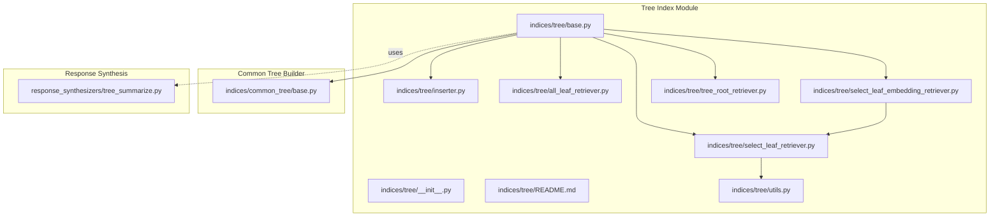
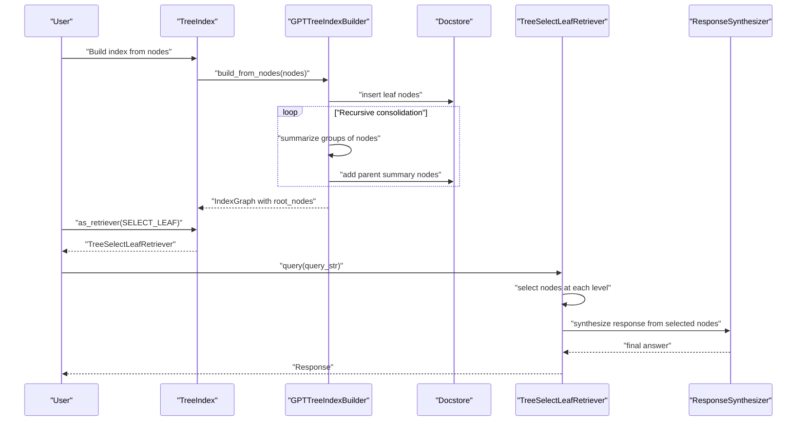
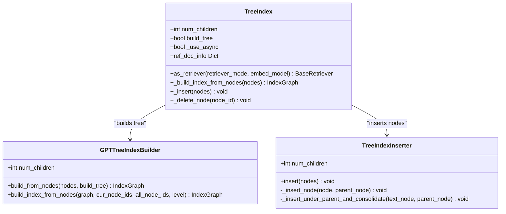
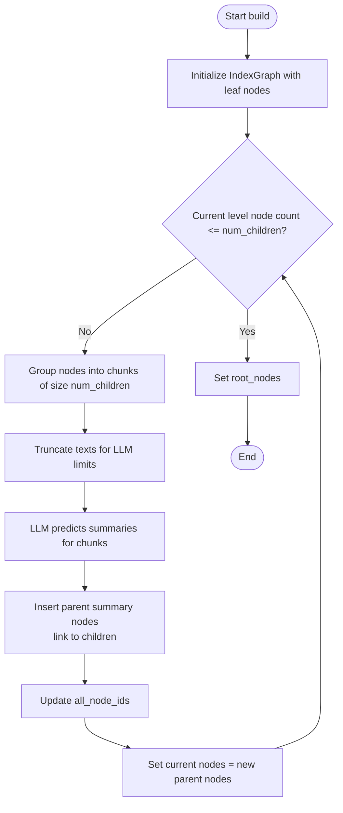
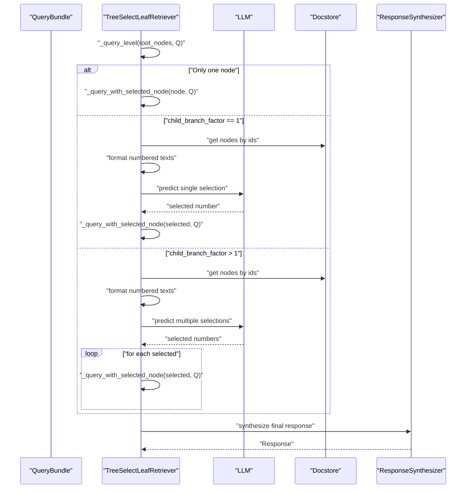
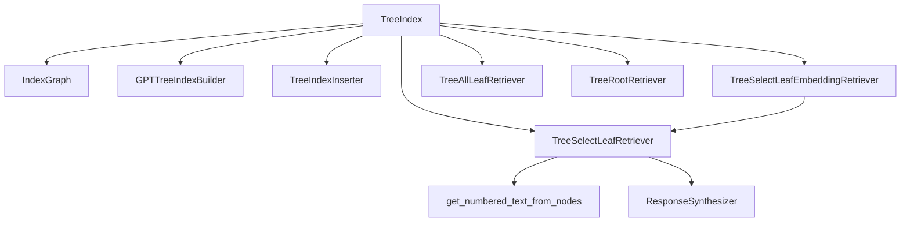

# Tree Indexes

<cite>
**Referenced Files in This Document**
- [base.py](file://llama-index-core/llama_index/core/indices/tree/base.py)
- [__init__.py](file://llama-index-core/llama_index/core/indices/tree/__init__.py)
- [README.md](file://llama-index-core/llama_index/core/indices/tree/README.md)
- [utils.py](file://llama-index-core/llama_index/core/indices/tree/utils.py)
- [inserter.py](file://llama-index-core/llama_index/core/indices/tree/inserter.py)
- [all_leaf_retriever.py](file://llama-index-core/llama_index/core/indices/tree/all_leaf_retriever.py)
- [select_leaf_retriever.py](file://llama-index-core/llama_index/core/indices/tree/select_leaf_retriever.py)
- [select_leaf_embedding_retriever.py](file://llama-index-core/llama_index/core/indices/tree/select_leaf_embedding_retriever.py)
- [tree_root_retriever.py](file://llama-index-core/llama_index/core/indices/tree/tree_root_retriever.py)
- [base.py](file://llama-index-core/llama_index/core/indices/common_tree/base.py)
- [test_index.py](file://llama-index-core/tests/indices/tree/test_index.py)
- [tree_summarize.py](file://llama-index-core/llama_index/core/response_synthesizers/tree_summarize.py)
- [test_tree_summarize.py](file://llama-index-core/tests/indices/response/test_tree_summarize.py)
</cite>

## Table of Contents
1. [Introduction](#introduction)
2. [Project Structure](#project-structure)
3. [Core Components](#core-components)
4. [Architecture Overview](#architecture-overview)
5. [Detailed Component Analysis](#detailed-component-analysis)
6. [Dependency Analysis](#dependency-analysis)
7. [Performance Considerations](#performance-considerations)
8. [Troubleshooting Guide](#troubleshooting-guide)
9. [Conclusion](#conclusion)
10. [Appendices](#appendices)

## Introduction
Tree Indexes in LlamaIndex organize hierarchical document collections into a tree-structured index. Each internal node summarizes its children, enabling efficient recursive retrieval and multi-level aggregation. This document explains the hierarchical tree structure, recursive decomposition, and multi-level aggregation patterns implemented by the TreeIndex class and related components. It also covers tree construction algorithms, leaf/root node management, configuration of tree depths, recursive retrieval strategies, optimization techniques, and practical examples for combining tree structures with other indexing strategies.

## Project Structure
The Tree Index implementation resides primarily under the indices/tree module and leverages shared tree-building utilities. Key files include the index class, retrievers, insertion logic, and helper utilities.

**Diagram sources**
- [base.py](file://llama-index-core/llama_index/core/indices/tree/base.py#L39-L191)
- [__init__.py](file://llama-index-core/llama_index/core/indices/tree/__init__.py#L1-L23)
- [README.md](file://llama-index-core/llama_index/core/indices/tree/README.md#L1-L51)
- [utils.py](file://llama-index-core/llama_index/core/indices/tree/utils.py#L1-L28)
- [inserter.py](file://llama-index-core/llama_index/core/indices/tree/inserter.py#L1-L181)
- [all_leaf_retriever.py](file://llama-index-core/llama_index/core/indices/tree/all_leaf_retriever.py#L1-L57)
- [select_leaf_retriever.py](file://llama-index-core/llama_index/core/indices/tree/select_leaf_retriever.py#L1-L429)
- [select_leaf_embedding_retriever.py](file://llama-index-core/llama_index/core/indices/tree/select_leaf_embedding_retriever.py#L1-L159)
- [tree_root_retriever.py](file://llama-index-core/llama_index/core/indices/tree/tree_root_retriever.py)
- [base.py](file://llama-index-core/llama_index/core/indices/common_tree/base.py#L23-L242)
- [tree_summarize.py](file://llama-index-core/llama_index/core/response_synthesizers/tree_summarize.py)

**Section sources**
- [base.py](file://llama-index-core/llama_index/core/indices/tree/base.py#L1-L191)
- [__init__.py](file://llama-index-core/llama_index/core/indices/tree/__init__.py#L1-L23)
- [README.md](file://llama-index-core/llama_index/core/indices/tree/README.md#L1-L51)

## Core Components
- TreeIndex: The primary index class that constructs a hierarchical tree bottom-up, manages node insertion, and exposes retrievers for different query modes.
- GPTTreeIndexBuilder: Builds the tree structure by recursively summarizing groups of nodes until reaching root nodes.
- TreeIndexInserter: Inserts new nodes into the tree and consolidates when child counts exceed the configured threshold.
- Retrievers:
  - TreeSelectLeafRetriever: Recursively selects promising leaf nodes via LLM prompts and aggregates answers.
  - TreeSelectLeafEmbeddingRetriever: Similar selection but prioritizes nodes by embedding similarity.
  - TreeAllLeafRetriever: Aggregates all leaf nodes for a query-specific response synthesis.
  - TreeRootRetriever: Uses root nodes as context for direct answer synthesis.
- Utilities:
  - get_numbered_text_from_nodes: Formats node lists for LLM prompts.
- Response Synthesizers:
  - TreeSummarize: Supports multi-level aggregation and summarization workflows.

Key configuration parameters:
- num_children: Controls fan-out for consolidation.
- summary_template and insert_prompt: Templates guiding summarization and insertion decisions.
- build_tree: Enables/disables initial tree construction.
- child_branch_factor: Number of child nodes considered at each level during selection.

**Section sources**
- [base.py](file://llama-index-core/llama_index/core/indices/tree/base.py#L39-L191)
- [base.py](file://llama-index-core/llama_index/core/indices/common_tree/base.py#L23-L242)
- [inserter.py](file://llama-index-core/llama_index/core/indices/tree/inserter.py#L24-L181)
- [select_leaf_retriever.py](file://llama-index-core/llama_index/core/indices/tree/select_leaf_retriever.py#L56-L429)
- [select_leaf_embedding_retriever.py](file://llama-index-core/llama_index/core/indices/tree/select_leaf_embedding_retriever.py#L20-L159)
- [all_leaf_retriever.py](file://llama-index-core/llama_index/core/indices/tree/all_leaf_retriever.py#L18-L57)
- [utils.py](file://llama-index-core/llama_index/core/indices/tree/utils.py#L8-L28)
- [tree_summarize.py](file://llama-index-core/llama_index/core/response_synthesizers/tree_summarize.py)

## Architecture Overview
The Tree Index architecture centers around a bottom-up construction phase followed by multiple retrieval strategies. The builder creates a balanced tree by grouping nodes and generating summaries iteratively. Retrievers then traverse the tree either deterministically (selection) or by similarity (embedding), aggregating responses using synthesizers.

**Diagram sources**
- [base.py](file://llama-index-core/llama_index/core/indices/tree/base.py#L138-L150)
- [base.py](file://llama-index-core/llama_index/core/indices/common_tree/base.py#L60-L195)
- [select_leaf_retriever.py](file://llama-index-core/llama_index/core/indices/tree/select_leaf_retriever.py#L161-L286)
- [tree_summarize.py](file://llama-index-core/llama_index/core/response_synthesizers/tree_summarize.py)

## Detailed Component Analysis

### TreeIndex Class
TreeIndex encapsulates the tree index lifecycle: initialization, construction, insertion, and retriever selection. It validates whether tree-based retrievers are supported based on build_tree and exposes as_retriever to obtain different retrieval strategies.

Key behaviors:
- Initialization stores configuration (num_children, summary_template, insert_prompt, build_tree, use_async, show_progress).
- as_retriever maps retriever_mode to concrete retriever classes and enforces tree requirement validation.
- _build_index_from_nodes delegates to GPTTreeIndexBuilder with appropriate parameters.
- _insert delegates to TreeIndexInserter for incremental updates.

**Diagram sources**
- [base.py](file://llama-index-core/llama_index/core/indices/tree/base.py#L39-L191)
- [base.py](file://llama-index-core/llama_index/core/indices/common_tree/base.py#L23-L242)
- [inserter.py](file://llama-index-core/llama_index/core/indices/tree/inserter.py#L24-L181)

**Section sources**
- [base.py](file://llama-index-core/llama_index/core/indices/tree/base.py#L39-L191)

### Tree Construction Algorithms
The builder performs bottom-up consolidation:
- Groups current nodes into chunks of size num_children.
- Truncates and summarizes each chunk to produce a parent summary node.
- Inserts parent nodes and repeats until root nodes remain with size ≤ num_children.

**Diagram sources**
- [base.py](file://llama-index-core/llama_index/core/indices/common_tree/base.py#L60-L195)

**Section sources**
- [base.py](file://llama-index-core/llama_index/core/indices/common_tree/base.py#L60-L195)

### Leaf/Root Node Management and Recursive Retrieval
TreeSelectLeafRetriever implements a top-down selection strategy:
- At each level, it formats child node texts and asks the LLM to choose nodes (single or multiple based on child_branch_factor).
- If a leaf is reached, it synthesizes a response using a text-qa synthesizer; otherwise, it recurses into selected children.
- A refinement template can be applied to aggregate multiple selections.

TreeSelectLeafEmbeddingRetriever mirrors the selection logic but chooses nodes by embedding similarity instead of LLM choice.

TreeAllLeafRetriever collects all leaf nodes for a query-specific synthesis without building the index initially.

TreeRootRetriever uses root nodes as context for direct answer synthesis.

**Diagram sources**
- [select_leaf_retriever.py](file://llama-index-core/llama_index/core/indices/tree/select_leaf_retriever.py#L161-L286)
- [tree_summarize.py](file://llama-index-core/llama_index/core/response_synthesizers/tree_summarize.py)

**Section sources**
- [select_leaf_retriever.py](file://llama-index-core/llama_index/core/indices/tree/select_leaf_retriever.py#L56-L429)
- [select_leaf_embedding_retriever.py](file://llama-index-core/llama_index/core/indices/tree/select_leaf_embedding_retriever.py#L20-L159)
- [all_leaf_retriever.py](file://llama-index-core/llama_index/core/indices/tree/all_leaf_retriever.py#L18-L57)
- [tree_root_retriever.py](file://llama-index-core/llama_index/core/indices/tree/tree_root_retriever.py)

### Multi-Level Aggregation Patterns
Multi-level aggregation occurs during:
- Tree construction: Parent nodes summarize children.
- Query-time selection: Responses from selected nodes are aggregated using a refinement template.
- Root-based synthesis: Root nodes serve as consolidated context for direct answers.

TreeSummarize supports hierarchical aggregation workflows and integrates with tree-based retrieval.

**Section sources**
- [base.py](file://llama-index-core/llama_index/core/indices/common_tree/base.py#L112-L138)
- [select_leaf_retriever.py](file://llama-index-core/llama_index/core/indices/tree/select_leaf_retriever.py#L110-L159)
- [tree_summarize.py](file://llama-index-core/llama_index/core/response_synthesizers/tree_summarize.py)

### Practical Examples and Configuration

- Configure tree depth and fan-out:
  - Adjust num_children to control consolidation granularity. Smaller values increase depth; larger values reduce depth.
  - Use build_tree to defer index construction for query-time strategies (e.g., TreeAllLeafRetriever).

- Handle recursive retrieval:
  - Choose child_branch_factor to balance exploration breadth vs. precision.
  - Use TreeSelectLeafEmbeddingRetriever for similarity-driven selection when LLM parsing is unreliable.

- Optimize tree traversal:
  - Enable use_async in TreeIndex to parallelize summary predictions.
  - Use show_progress to monitor long-running operations.

- Combine with other indexing strategies:
  - Use TreeIndex alongside VectorIndex for hybrid retrieval: retrieve candidate nodes from the vector index and apply TreeSelectLeafRetriever for precise aggregation.
  - Use TreeRootRetriever as a coarse-grained baseline while keeping TreeSelectLeafRetriever for detailed queries.

[No sources needed since this section provides general guidance]

## Dependency Analysis
TreeIndex depends on:
- IndexGraph for storing nodes and relationships.
- GPTTreeIndexBuilder for bottom-up construction.
- TreeIndexInserter for incremental insertion and consolidation.
- Retrievers for query-time strategies.
- Response synthesizers for aggregation.

**Diagram sources**
- [base.py](file://llama-index-core/llama_index/core/indices/tree/base.py#L39-L191)
- [base.py](file://llama-index-core/llama_index/core/indices/common_tree/base.py#L23-L242)
- [inserter.py](file://llama-index-core/llama_index/core/indices/tree/inserter.py#L24-L181)
- [select_leaf_retriever.py](file://llama-index-core/llama_index/core/indices/tree/select_leaf_retriever.py#L56-L429)
- [select_leaf_embedding_retriever.py](file://llama-index-core/llama_index/core/indices/tree/select_leaf_embedding_retriever.py#L20-L159)
- [all_leaf_retriever.py](file://llama-index-core/llama_index/core/indices/tree/all_leaf_retriever.py#L18-L57)
- [utils.py](file://llama-index-core/llama_index/core/indices/tree/utils.py#L8-L28)

**Section sources**
- [base.py](file://llama-index-core/llama_index/core/indices/tree/base.py#L39-L191)
- [__init__.py](file://llama-index-core/llama_index/core/indices/tree/__init__.py#L4-L12)

## Performance Considerations
- Tree depth and num_children: Deeper trees (smaller num_children) improve recall but increase LLM calls and latency.
- Asynchronous summarization: Enabling use_async reduces wall-clock time for bulk summary generation.
- Embedding-based selection: Reduces reliance on LLM parsing and can speed up selection when available.
- Query-time strategies:
  - TreeRootRetriever minimizes traversal cost but may miss nuanced details.
  - TreeAllLeafRetriever avoids building the index but recomputes a query-specific tree each time.

[No sources needed since this section provides general guidance]

## Troubleshooting Guide
- Retrieval mode requires a built tree:
  - If build_tree is disabled and a tree-dependent retriever mode is used, a validation error is raised. Enable build_tree or switch to a compatible mode.

- Insertion consolidation:
  - If insertions cause frequent consolidations, consider increasing num_children to reduce intermediate layers.

- Selection failures:
  - If LLM parsing fails to return valid node numbers, selection falls back to returning current context. Consider adjusting prompts or switching to embedding-based selection.

- Cost and latency:
  - Tree construction and query costs scale with log depth. Use async and embedding-based selection to optimize.

**Section sources**
- [base.py](file://llama-index-core/llama_index/core/indices/tree/base.py#L130-L137)
- [inserter.py](file://llama-index-core/llama_index/core/indices/tree/inserter.py#L37-L40)
- [select_leaf_retriever.py](file://llama-index-core/llama_index/core/indices/tree/select_leaf_retriever.py#L223-L241)

## Conclusion
Tree Indexes in LlamaIndex provide a powerful hierarchical abstraction for organizing and querying large document collections. Through bottom-up construction, multi-level aggregation, and flexible retrieval strategies—ranging from deterministic selection to embedding-based prioritization—the system balances precision, cost, and performance. By tuning parameters like num_children and child_branch_factor, and combining tree structures with other indexing strategies, users can tailor retrieval to diverse use cases involving hierarchical organization, summarization workflows, and complex query processing.

[No sources needed since this section summarizes without analyzing specific files]

## Appendices

### Example Workflows
- Hierarchical document organization:
  - Build a deep tree (small num_children) to capture topic hierarchies; use TreeSelectLeafRetriever for precise answers.
- Summarization workflows:
  - Use TreeRootRetriever for a quick overview; then drill down with TreeSelectLeafRetriever for detailed insights.
- Complex query processing:
  - Combine vector retrieval to narrow candidates, then apply TreeSelectLeafRetriever for hierarchical aggregation.

[No sources needed since this section provides general guidance]