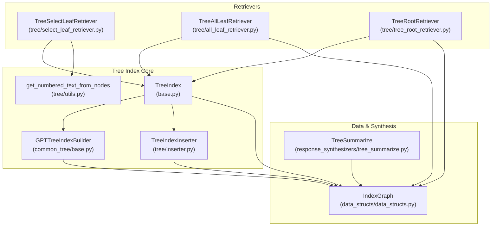
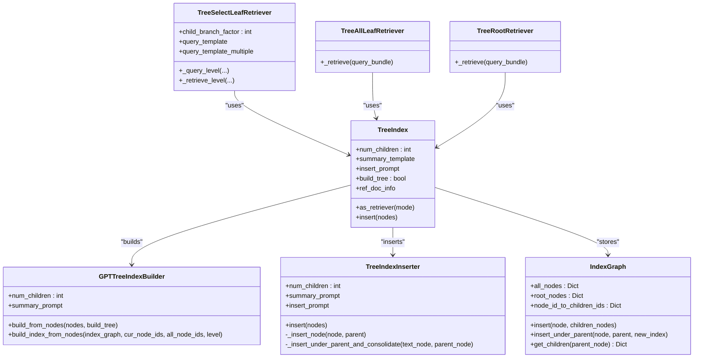
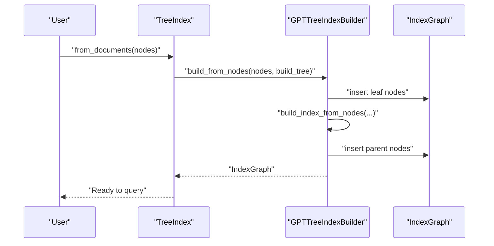
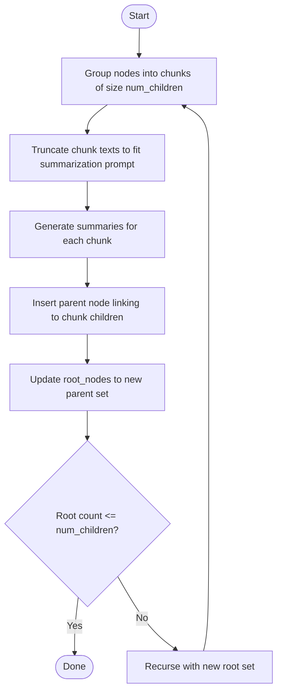
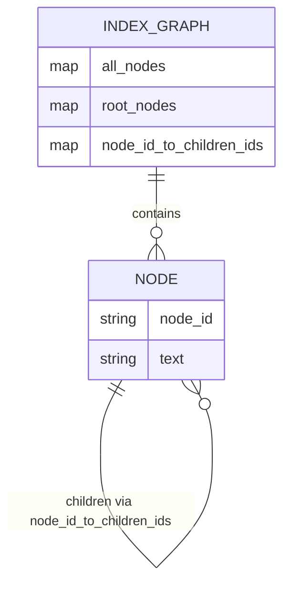
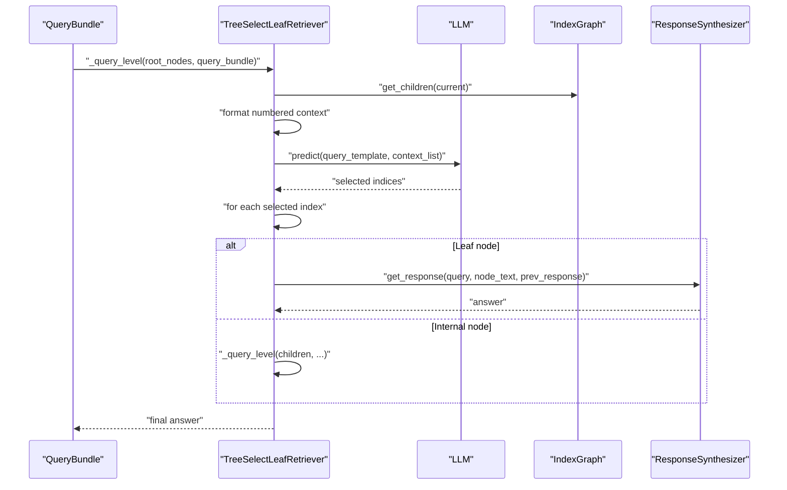
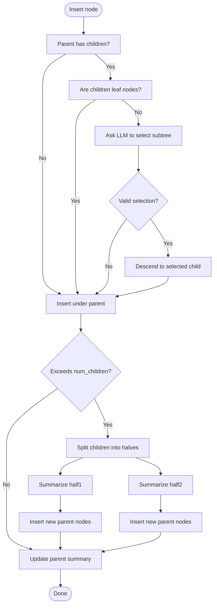
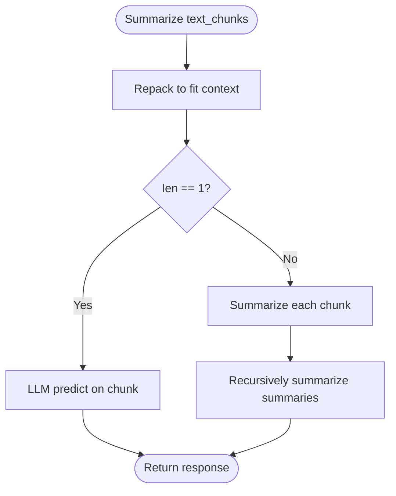
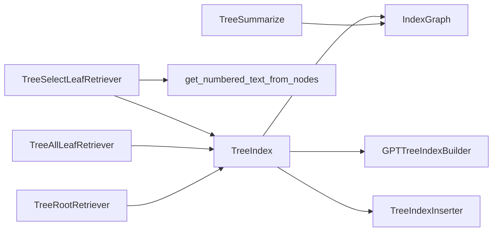

# Tree Indexes

<cite>
**Referenced Files in This Document**
- [base.py](file://llama-index-core/llama_index/core/indices/tree/base.py)
- [inserter.py](file://llama-index-core/llama_index/core/indices/tree/inserter.py)
- [utils.py](file://llama-index-core/llama_index/core/indices/tree/utils.py)
- [README.md](file://llama-index-core/llama_index/core/indices/tree/README.md)
- [base.py](file://llama-index-core/llama_index/core/indices/common_tree/base.py)
- [data_structs.py](file://llama-index-core/llama_index/core/data_structs/data_structs.py)
- [select_leaf_retriever.py](file://llama-index-core/llama_index/core/indices/tree/select_leaf_retriever.py)
- [all_leaf_retriever.py](file://llama-index-core/llama_index/core/indices/tree/all_leaf_retriever.py)
- [tree_root_retriever.py](file://llama-index-core/llama_index/core/indices/tree/tree_root_retriever.py)
- [tree_summarize.py](file://llama-index-core/llama_index/core/response_synthesizers/tree_summarize.py)
- [test_index.py](file://llama-index-core/tests/indices/tree/test_index.py)
- [test_retrievers.py](file://llama-index-core/tests/indices/tree/test_retrievers.py)
</cite>

## Table of Contents
1. [Introduction](#introduction)
2. [Project Structure](#project-structure)
3. [Core Components](#core-components)
4. [Architecture Overview](#architecture-overview)
5. [Detailed Component Analysis](#detailed-component-analysis)
6. [Dependency Analysis](#dependency-analysis)
7. [Performance Considerations](#performance-considerations)
8. [Troubleshooting Guide](#troubleshooting-guide)
9. [Conclusion](#conclusion)
10. [Appendices](#appendices)

## Introduction
Tree Indexes in LlamaIndex organize hierarchical knowledge into a tree-structured index, enabling efficient multi-level summarization and retrieval. The index is built bottom-up: leaf nodes represent original chunks, and internal nodes summarize their children. At query time, the index supports:
- Recursive selection via a leaf retriever that chooses promising branches based on LLM prompts
- Root-based retrieval that synthesizes answers directly from root nodes
- All-leaf retrieval that aggregates leaf nodes for synthesis
- Embedding-based selection for hybrid retrieval strategies

This document explains the TreeIndex implementation, tree construction algorithms, parent-child relationships, and recursive retrieval patterns. It also covers practical configuration, memory management, and advanced topics such as dynamic updates and integration with other index types.

## Project Structure
The Tree Index implementation spans several modules:
- Tree index core and builders
- Retriever implementations for different query modes
- Utilities for prompt formatting and numbering
- Data structures for the index graph
- Response synthesizers for tree-based summarization

```mermaid
graph TB
subgraph "Tree Index Core"
TI["TreeIndex<br/>(base.py)"]
GB["GPTTreeIndexBuilder<br/>(common_tree/base.py)"]
INS["TreeIndexInserter<br/>(tree/inserter.py)"]
UT["get_numbered_text_from_nodes<br/>(tree/utils.py)"]
end
subgraph "Retrievers"
SLR["TreeSelectLeafRetriever<br/>(tree/select_leaf_retriever.py)"]
ALR["TreeAllLeafRetriever<br/>(tree/all_leaf_retriever.py)"]
RRR["TreeRootRetriever<br/>(tree/tree_root_retriever.py)"]
end
subgraph "Data & Synthesis"
IG["IndexGraph<br/>(data_structs/data_structs.py)"]
TS["TreeSummarize<br/>(response_synthesizers/tree_summarize.py)"]
end
TI --> GB
TI --> INS
TI --> IG
SLR --> TI
ALR --> TI
RRR --> TI
SLR --> UT
ALR --> IG
RRR --> IG
GB --> IG
INS --> IG
TS --> IG
```

**Diagram sources**
- [base.py](file://llama-index-core/llama_index/core/indices/tree/base.py#L39-L190)
- [base.py](file://llama-index-core/llama_index/core/indices/common_tree/base.py#L23-L242)
- [inserter.py](file://llama-index-core/llama_index/core/indices/tree/inserter.py#L24-L181)
- [utils.py](file://llama-index-core/llama_index/core/indices/tree/utils.py#L8-L28)
- [data_structs.py](file://llama-index-core/llama_index/core/data_structs/data_structs.py#L41-L112)
- [select_leaf_retriever.py](file://llama-index-core/llama_index/core/indices/tree/select_leaf_retriever.py#L56-L429)
- [all_leaf_retriever.py](file://llama-index-core/llama_index/core/indices/tree/all_leaf_retriever.py#L18-L57)
- [tree_root_retriever.py](file://llama-index-core/llama_index/core/indices/tree/tree_root_retriever.py#L16-L51)
- [tree_summarize.py](file://llama-index-core/llama_index/core/response_synthesizers/tree_summarize.py#L17-L231)

**Section sources**
- [base.py](file://llama-index-core/llama_index/core/indices/tree/base.py#L39-L190)
- [base.py](file://llama-index-core/llama_index/core/indices/common_tree/base.py#L23-L242)
- [data_structs.py](file://llama-index-core/llama_index/core/data_structs/data_structs.py#L41-L112)

## Core Components
- TreeIndex: The primary index class that manages index construction, insertion, and exposes retrievers for different query modes.
- GPTTreeIndexBuilder: Bottom-up builder that consolidates nodes into parents using a summarization prompt, recursively until reaching root nodes.
- TreeIndexInserter: Handles incremental insertion of new nodes, including parent selection and consolidation when a parent exceeds the configured number of children.
- IndexGraph: The underlying graph data structure storing nodes, root nodes, and parent-child relationships.
- Retrievers:
  - TreeSelectLeafRetriever: Recursively selects promising branches using LLM prompts and refines answers.
  - TreeAllLeafRetriever: Aggregates all leaf nodes for synthesis without requiring a prebuilt tree.
  - TreeRootRetriever: Retrieves root nodes for direct synthesis.
- Utilities: Helper to format numbered node lists for prompts.
- TreeSummarize: Response synthesizer that recursively summarizes text chunks in a bottom-up manner.

**Section sources**
- [base.py](file://llama-index-core/llama_index/core/indices/tree/base.py#L39-L190)
- [base.py](file://llama-index-core/llama_index/core/indices/common_tree/base.py#L23-L242)
- [inserter.py](file://llama-index-core/llama_index/core/indices/tree/inserter.py#L24-L181)
- [data_structs.py](file://llama-index-core/llama_index/core/data_structs/data_structs.py#L41-L112)
- [select_leaf_retriever.py](file://llama-index-core/llama_index/core/indices/tree/select_leaf_retriever.py#L56-L429)
- [all_leaf_retriever.py](file://llama-index-core/llama_index/core/indices/tree/all_leaf_retriever.py#L18-L57)
- [tree_root_retriever.py](file://llama-index-core/llama_index/core/indices/tree/tree_root_retriever.py#L16-L51)
- [utils.py](file://llama-index-core/llama_index/core/indices/tree/utils.py#L8-L28)
- [tree_summarize.py](file://llama-index-core/llama_index/core/response_synthesizers/tree_summarize.py#L17-L231)

## Architecture Overview
The Tree Index architecture centers around a hierarchical graph where each internal node summarizes its children. Construction and query are orchestrated by the index class and specialized components.

```mermaid
classDiagram
class TreeIndex {
+num_children : int
+summary_template
+insert_prompt
+build_tree : bool
+as_retriever(mode)
+insert(nodes)
+ref_doc_info
}
class GPTTreeIndexBuilder {
+num_children : int
+summary_prompt
+build_from_nodes(nodes, build_tree)
+build_index_from_nodes(index_graph, cur_node_ids, all_node_ids, level)
}
class TreeIndexInserter {
+num_children : int
+summary_prompt
+insert_prompt
+insert(nodes)
-_insert_node(node, parent)
-_insert_under_parent_and_consolidate(text_node, parent_node)
}
class IndexGraph {
+all_nodes : Dict
+root_nodes : Dict
+node_id_to_children_ids : Dict
+insert(node, children_nodes)
+insert_under_parent(node, parent, new_index)
+get_children(parent_node) Dict
}
class TreeSelectLeafRetriever {
+child_branch_factor : int
+query_template
+query_template_multiple
+_query_level(...)
+_retrieve_level(...)
}
class TreeAllLeafRetriever {
+_retrieve(query_bundle)
}
class TreeRootRetriever {
+_retrieve(query_bundle)
}
TreeIndex --> GPTTreeIndexBuilder : "builds"
TreeIndex --> TreeIndexInserter : "inserts"
TreeIndex --> IndexGraph : "stores"
TreeSelectLeafRetriever --> TreeIndex : "uses"
TreeAllLeafRetriever --> TreeIndex : "uses"
TreeRootRetriever --> TreeIndex : "uses"
```

**Diagram sources**
- [base.py](file://llama-index-core/llama_index/core/indices/tree/base.py#L39-L190)
- [base.py](file://llama-index-core/llama_index/core/indices/common_tree/base.py#L23-L242)
- [inserter.py](file://llama-index-core/llama_index/core/indices/tree/inserter.py#L24-L181)
- [data_structs.py](file://llama-index-core/llama_index/core/data_structs/data_structs.py#L41-L112)
- [select_leaf_retriever.py](file://llama-index-core/llama_index/core/indices/tree/select_leaf_retriever.py#L56-L429)
- [all_leaf_retriever.py](file://llama-index-core/llama_index/core/indices/tree/all_leaf_retriever.py#L18-L57)
- [tree_root_retriever.py](file://llama-index-core/llama_index/core/indices/tree/tree_root_retriever.py#L16-L51)

## Detailed Component Analysis

### TreeIndex: Construction, Insertion, and Retrievers
- Construction: Uses a builder to create a bottom-up tree. The builder groups nodes into chunks sized to fit the LLM’s context and generates summaries to form parent nodes until reaching root nodes.
- Insertion: Inserts new nodes and consolidates when a parent exceeds the configured number of children, generating new intermediate nodes and updating summaries.
- Retrievers: Exposes multiple modes:
  - select_leaf: Recursive selection with refinement
  - all_leaf: Retrieve all leaf nodes for synthesis
  - root: Retrieve root nodes for direct synthesis
  - select_leaf_embedding: Hybrid embedding-based selection

```mermaid
sequenceDiagram
participant U as "User"
participant TI as "TreeIndex"
participant GB as "GPTTreeIndexBuilder"
participant IG as "IndexGraph"
U->>TI : "from_documents(nodes)"
TI->>GB : "build_from_nodes(nodes, build_tree)"
GB->>IG : "insert leaf nodes"
GB->>GB : "build_index_from_nodes(...)"
GB->>IG : "insert parent nodes"
GB-->>TI : "IndexGraph"
TI-->>U : "Ready to query"
```

**Diagram sources**
- [base.py](file://llama-index-core/llama_index/core/indices/tree/base.py#L138-L150)
- [base.py](file://llama-index-core/llama_index/core/indices/common_tree/base.py#L60-L81)
- [base.py](file://llama-index-core/llama_index/core/indices/common_tree/base.py#L140-L195)

**Section sources**
- [base.py](file://llama-index-core/llama_index/core/indices/tree/base.py#L39-L190)
- [base.py](file://llama-index-core/llama_index/core/indices/common_tree/base.py#L23-L242)

### Tree Construction Algorithm (Bottom-Up)
- Groups current nodes into chunks of size equal to num_children.
- Truncates concatenated child texts to fit the summarization prompt.
- Generates summaries for each chunk and inserts a new parent node linking to the chunk’s children.
- Recursively continues until the number of root nodes is less than or equal to num_children.

```mermaid
flowchart TD
Start(["Start"]) --> Prep["Group nodes into chunks of size num_children"]
Prep --> Trunc["Truncate chunk texts to fit summarization prompt"]
Trunc --> Summ["Generate summaries for each chunk"]
Summ --> InsertParent["Insert parent node linking to chunk children"]
InsertParent --> UpdateRoots["Update root_nodes to new parent set"]
UpdateRoots --> Check{"Root count <= num_children?"}
Check --> |Yes| Done(["Done"])
Check --> |No| Recurse["Recurse with new root set"]
Recurse --> Prep
```

**Diagram sources**
- [base.py](file://llama-index-core/llama_index/core/indices/common_tree/base.py#L83-L110)
- [base.py](file://llama-index-core/llama_index/core/indices/common_tree/base.py#L140-L195)

**Section sources**
- [base.py](file://llama-index-core/llama_index/core/indices/common_tree/base.py#L83-L195)

### Parent-Child Relationships and IndexGraph
- IndexGraph maintains:
  - all_nodes: mapping from index to node ID
  - root_nodes: mapping from index to root node ID
  - node_id_to_children_ids: adjacency mapping from parent node ID to children node IDs
- Insertion APIs:
  - insert: adds a node and optionally links children
  - insert_under_parent: inserts under a parent and updates adjacency

```mermaid
erDiagram
INDEX_GRAPH {
map all_nodes
map root_nodes
map node_id_to_children_ids
}
NODE {
string node_id
string text
}
INDEX_GRAPH ||--o{ NODE : "contains"
NODE ||--o{ NODE : "children via node_id_to_children_ids"
```

**Diagram sources**
- [data_structs.py](file://llama-index-core/llama_index/core/data_structs/data_structs.py#L41-L112)

**Section sources**
- [data_structs.py](file://llama-index-core/llama_index/core/data_structs/data_structs.py#L41-L112)

### Recursive Retrieval Pattern (Leaf Selection)
- At each level, the retriever:
  - Formats a numbered list of candidate nodes
  - Asks the LLM to select one or more nodes (branching factor)
  - Recursively descends into selected children
  - On leaf nodes, synthesizes an answer and refines iteratively if needed

```mermaid
sequenceDiagram
participant Q as "QueryBundle"
participant SLR as "TreeSelectLeafRetriever"
participant LLM as "LLM"
participant IG as "IndexGraph"
participant RS as "ResponseSynthesizer"
Q->>SLR : "_query_level(root_nodes, query_bundle)"
SLR->>IG : "get_children(current)"
SLR->>SLR : "format numbered context"
SLR->>LLM : "predict(query_template, context_list)"
LLM-->>SLR : "selected indices"
SLR->>SLR : "for each selected index"
alt Leaf node
SLR->>RS : "get_response(query, node_text, prev_response)"
RS-->>SLR : "answer"
else Internal node
SLR->>SLR : "_query_level(children, ...)"
end
SLR-->>Q : "final answer"
```

**Diagram sources**
- [select_leaf_retriever.py](file://llama-index-core/llama_index/core/indices/tree/select_leaf_retriever.py#L161-L271)

**Section sources**
- [select_leaf_retriever.py](file://llama-index-core/llama_index/core/indices/tree/select_leaf_retriever.py#L56-L429)

### Dynamic Updates and Insertion Strategy
- Insertion:
  - If parent has no children or is a leaf layer, insert directly and consolidate if needed
  - Otherwise, ask the LLM to select a subtree for insertion
  - After insertion, bubble up and update the parent’s summary
- Consolidation:
  - When a parent exceeds num_children, split children into halves, summarize each half, and insert new intermediate nodes

```mermaid
flowchart TD
IStart(["Insert node"]) --> CheckEmpty["Parent has children?"]
CheckEmpty --> |No| InsertDirect["Insert under parent"]
CheckEmpty --> |Yes| IsLeaf["Are children leaf nodes?"]
IsLeaf --> |Yes| InsertDirect
IsLeaf --> |No| AskLLM["Ask LLM to select subtree"]
AskLLM --> Valid{"Valid selection?"}
Valid --> |No| InsertDirect
Valid --> |Yes| Descend["Descend to selected child"]
Descend --> InsertDirect
InsertDirect --> Consolidate{"Exceeds num_children?"}
Consolidate --> |No| UpdateParent["Update parent summary"]
Consolidate --> |Yes| Split["Split children into halves"]
Split --> Summ1["Summarize half1"]
Split --> Summ2["Summarize half2"]
Summ1 --> NewParent1["Insert new parent nodes"]
Summ2 --> NewParent2["Insert new parent nodes"]
NewParent1 --> UpdateParent
NewParent2 --> UpdateParent
UpdateParent --> IEnd(["Done"])
```

**Diagram sources**
- [inserter.py](file://llama-index-core/llama_index/core/indices/tree/inserter.py#L116-L181)

**Section sources**
- [inserter.py](file://llama-index-core/llama_index/core/indices/tree/inserter.py#L24-L181)

### Tree-Based Summarization (TreeSummarize)
- Recursively packs text chunks to fit the LLM context
- If only one chunk remains, returns the LLM’s prediction
- Otherwise, summarizes each chunk and recurses on summaries

```mermaid
flowchart TD
SStart(["Summarize text_chunks"]) --> Repack["Repack to fit context"]
Repack --> OneChunk{"len == 1?"}
OneChunk --> |Yes| Final["LLM predict on chunk"]
OneChunk --> |No| SumEach["Summarize each chunk"]
SumEach --> Recurse["Recursively summarize summaries"]
Final --> SEnd(["Return response"])
Recurse --> SEnd
```

**Diagram sources**
- [tree_summarize.py](file://llama-index-core/llama_index/core/response_synthesizers/tree_summarize.py#L134-L231)

**Section sources**
- [tree_summarize.py](file://llama-index-core/llama_index/core/response_synthesizers/tree_summarize.py#L17-L231)

### Practical Examples and Usage Patterns
- Index creation and basic query:
  - Build a TreeIndex from documents
  - Retrieve nodes via as_retriever() with default mode
- All-leaf retrieval without prebuilt tree:
  - Disable build_tree and use all_leaf mode to aggregate leaves for synthesis
- Root-based retrieval:
  - Use root mode to synthesize answers directly from root nodes

**Section sources**
- [README.md](file://llama-index-core/llama_index/core/indices/tree/README.md#L21-L32)
- [test_retrievers.py](file://llama-index-core/tests/indices/tree/test_retrievers.py#L7-L42)
- [test_index.py](file://llama-index-core/tests/indices/tree/test_index.py#L131-L185)

## Dependency Analysis
Key dependencies and relationships:
- TreeIndex depends on IndexGraph for storage and navigation
- GPTTreeIndexBuilder and TreeIndexInserter both operate on IndexGraph
- Retrievers depend on TreeIndex and IndexGraph for traversal
- Utilities support prompt formatting for retrievers
- TreeSummarize integrates with prompt helpers and LLMs

```mermaid
graph LR
TI["TreeIndex"] --> IG["IndexGraph"]
TI --> GB["GPTTreeIndexBuilder"]
TI --> INS["TreeIndexInserter"]
SLR["TreeSelectLeafRetriever"] --> TI
ALR["TreeAllLeafRetriever"] --> TI
RRR["TreeRootRetriever"] --> TI
SLR --> UT["get_numbered_text_from_nodes"]
TS["TreeSummarize"] --> IG
```

**Diagram sources**
- [base.py](file://llama-index-core/llama_index/core/indices/tree/base.py#L39-L190)
- [base.py](file://llama-index-core/llama_index/core/indices/common_tree/base.py#L23-L242)
- [inserter.py](file://llama-index-core/llama_index/core/indices/tree/inserter.py#L24-L181)
- [select_leaf_retriever.py](file://llama-index-core/llama_index/core/indices/tree/select_leaf_retriever.py#L56-L429)
- [all_leaf_retriever.py](file://llama-index-core/llama_index/core/indices/tree/all_leaf_retriever.py#L18-L57)
- [tree_root_retriever.py](file://llama-index-core/llama_index/core/indices/tree/tree_root_retriever.py#L16-L51)
- [utils.py](file://llama-index-core/llama_index/core/indices/tree/utils.py#L8-L28)
- [tree_summarize.py](file://llama-index-core/llama_index/core/response_synthesizers/tree_summarize.py#L17-L231)

**Section sources**
- [base.py](file://llama-index-core/llama_index/core/indices/tree/base.py#L39-L190)
- [base.py](file://llama-index-core/llama_index/core/indices/common_tree/base.py#L23-L242)
- [inserter.py](file://llama-index-core/llama_index/core/indices/tree/inserter.py#L24-L181)
- [select_leaf_retriever.py](file://llama-index-core/llama_index/core/indices/tree/select_leaf_retriever.py#L56-L429)
- [all_leaf_retriever.py](file://llama-index-core/llama_index/core/indices/tree/all_leaf_retriever.py#L18-L57)
- [tree_root_retriever.py](file://llama-index-core/llama_index/core/indices/tree/tree_root_retriever.py#L16-L51)
- [utils.py](file://llama-index-core/llama_index/core/indices/tree/utils.py#L8-L28)
- [tree_summarize.py](file://llama-index-core/llama_index/core/response_synthesizers/tree_summarize.py#L17-L231)

## Performance Considerations
- num_children tuning:
  - Larger num_children reduces depth but increases summarization cost per parent
  - Smaller num_children increases depth but may reduce per-summary token usage
- Async summarization:
  - Builders and synthesizers support async predictions to improve throughput
- Prompt truncation:
  - PromptHelper ensures chunk sizes fit model context windows
- Memory management:
  - IndexGraph stores node IDs and adjacency; avoid retaining unnecessary intermediate nodes
  - Prefer root or all-leaf modes when synthesis can be done without traversal
- Retrieval optimization:
  - child_branch_factor controls how many candidates are selected per level; higher values increase LLM calls but may improve accuracy

[No sources needed since this section provides general guidance]

## Troubleshooting Guide
- Index not built:
  - Some retriever modes require a prebuilt tree; ensure build_tree is enabled or use all_leaf/root modes
- Insertion failures:
  - If LLM fails to return a valid selection, insertion falls back to inserting under the parent
- Unexpected query behavior:
  - Verify child_branch_factor and query templates; ensure context formatting matches model expectations
- Cost and latency:
  - Monitor summarization calls; consider reducing num_children or disabling async if resources are constrained

**Section sources**
- [base.py](file://llama-index-core/llama_index/core/indices/tree/base.py#L130-L137)
- [inserter.py](file://llama-index-core/llama_index/core/indices/tree/inserter.py#L140-L155)
- [README.md](file://llama-index-core/llama_index/core/indices/tree/README.md#L34-L50)

## Conclusion
Tree Indexes in LlamaIndex provide a powerful hierarchical abstraction for organizing and querying large corpora. The bottom-up construction and recursive retrieval mechanisms enable scalable summarization and targeted answer synthesis. By tuning parameters like num_children and child_branch_factor, and leveraging appropriate retriever modes, users can balance accuracy, cost, and latency for diverse workloads.

[No sources needed since this section summarizes without analyzing specific files]

## Appendices

### Best Practices and Configurations
- Small to medium documents:
  - Use moderate num_children (e.g., 10) and default child_branch_factor
- Large documents or long contexts:
  - Reduce num_children to minimize summarization length
  - Enable async summarization for throughput
- Multi-level aggregation:
  - Use all_leaf mode to aggregate leaves for synthesis without traversal
- Root-based synthesis:
  - Pre-seed the index with a query-aware summary to accelerate root retrieval

**Section sources**
- [base.py](file://llama-index-core/llama_index/core/indices/tree/base.py#L64-L92)
- [base.py](file://llama-index-core/llama_index/core/indices/common_tree/base.py#L32-L54)
- [all_leaf_retriever.py](file://llama-index-core/llama_index/core/indices/tree/all_leaf_retriever.py#L18-L57)
- [tree_root_retriever.py](file://llama-index-core/llama_index/core/indices/tree/tree_root_retriever.py#L16-L51)

### Example Workflows
- Build index and query:
  - Create TreeIndex from documents
  - Retrieve nodes with default mode and synthesize answers
- Dynamic updates:
  - Insert new documents; insertion consolidates when needed and updates parent summaries
- Integration with other indices:
  - Combine TreeIndex with ComposableGraph for multi-index workflows

**Section sources**
- [README.md](file://llama-index-core/llama_index/core/indices/tree/README.md#L21-L32)
- [test_index.py](file://llama-index-core/tests/indices/tree/test_index.py#L131-L185)
- [test_retrievers.py](file://llama-index-core/tests/indices/tree/test_retrievers.py#L7-L42)