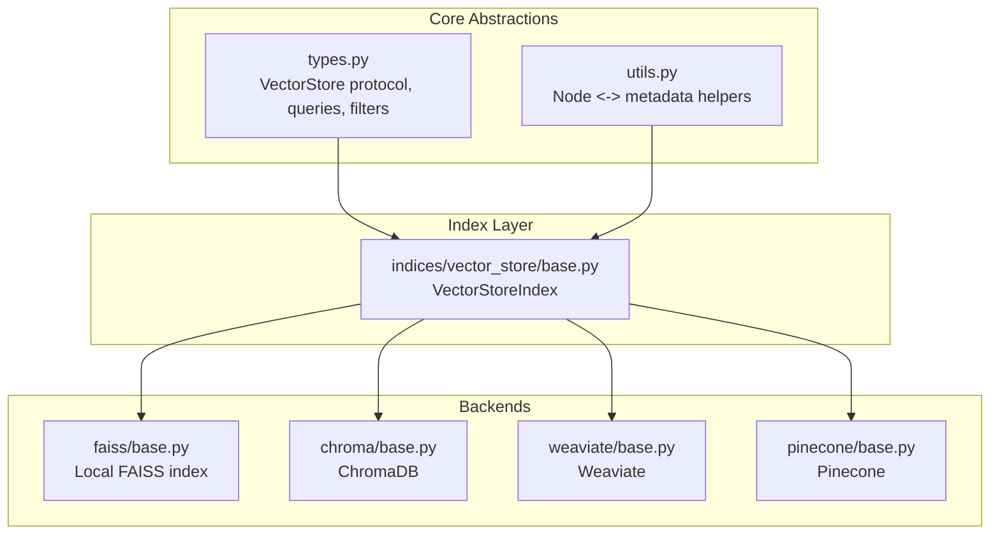
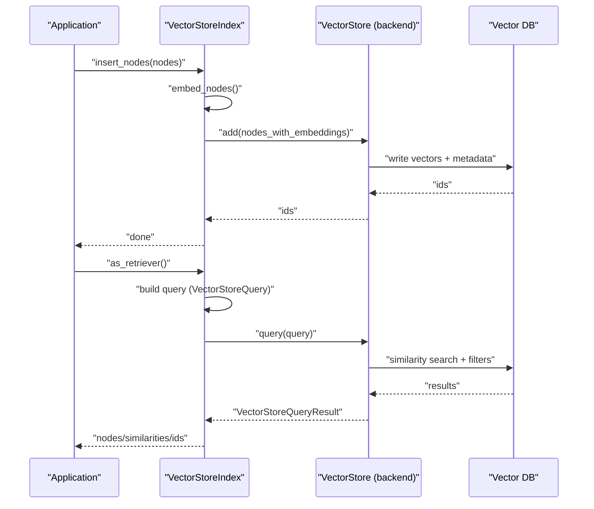
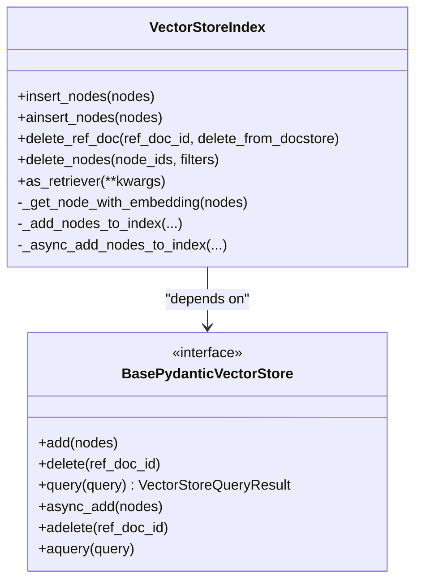
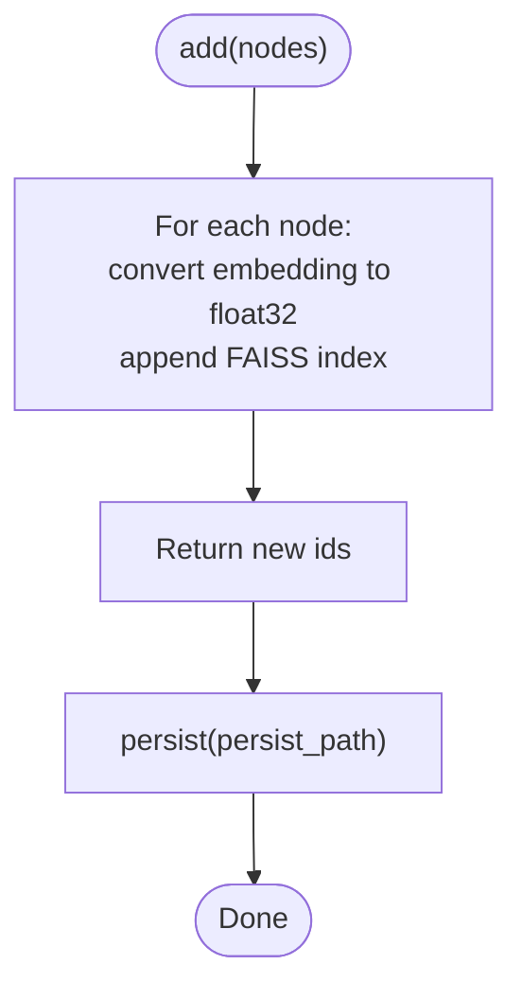
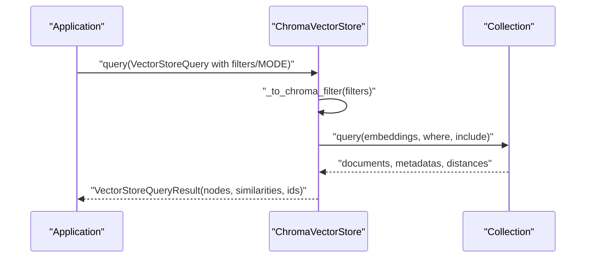
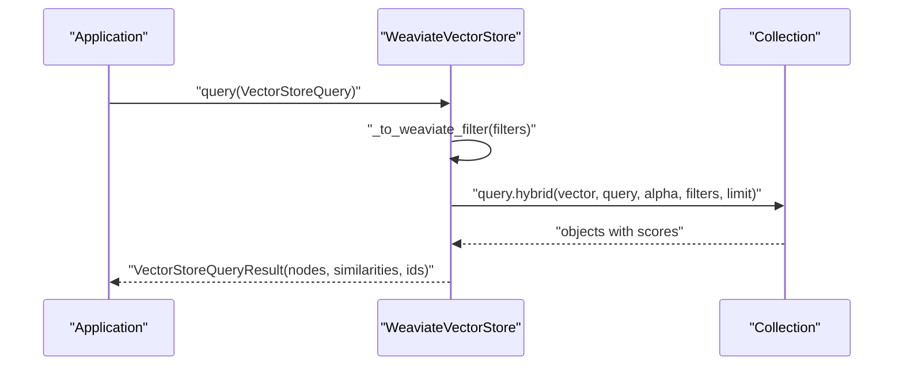
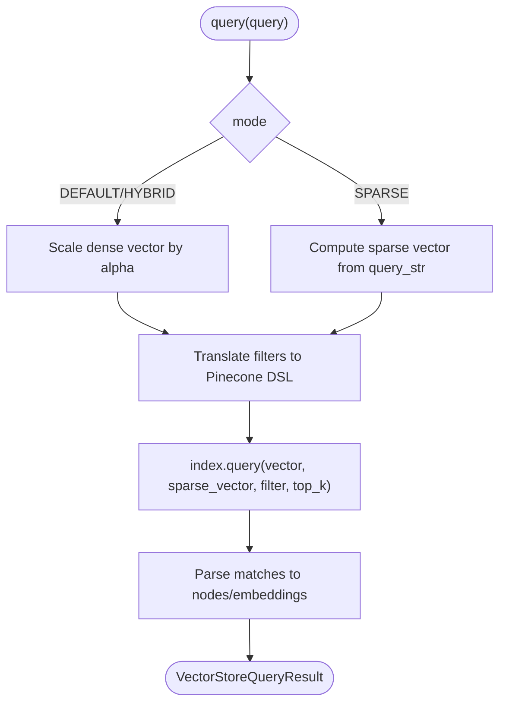
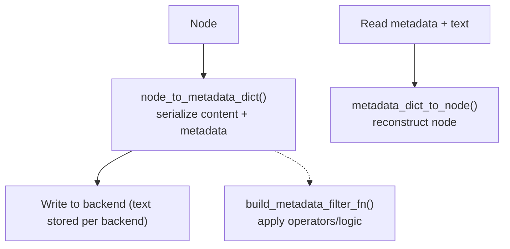
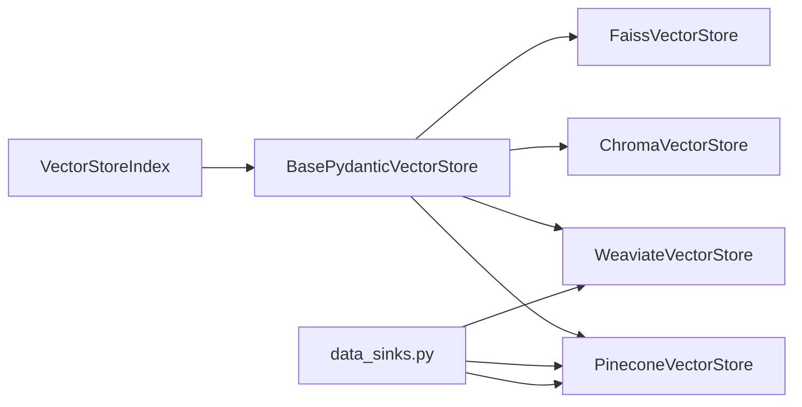

# Vector Store Indexes

<cite>
**Referenced Files in This Document**
- [types.py](file://llama-index-core/llama_index/core/vector_stores/types.py)
- [utils.py](file://llama-index-core/llama_index/core/vector_stores/utils.py)
- [base.py](file://llama-index-core/llama_index/core/indices/vector_store/base.py)
- [base.py](file://llama-index-integrations/vector_stores/llama-index-vector-stores-faiss/llama_index/vector_stores/faiss/base.py)
- [base.py](file://llama-index-integrations/vector_stores/llama-index-vector-stores-chroma/llama_index/vector_stores/chroma/base.py)
- [base.py](file://llama-index-integrations/vector_stores/llama-index-vector-stores-weaviate/llama_index/vector_stores/weaviate/base.py)
- [base.py](file://llama-index-integrations/vector_stores/llama-index-vector-stores-pinecone/llama_index/vector_stores/pinecone/base.py)
- [data_sinks.py](file://llama-index-core/llama_index/core/ingestion/data_sinks.py)
- [index.md](file://docs/examples/index.md)
</cite>

## Table of Contents
1. [Introduction](#introduction)
2. [Project Structure](#project-structure)
3. [Core Components](#core-components)
4. [Architecture Overview](#architecture-overview)
5. [Detailed Component Analysis](#detailed-component-analysis)
6. [Dependency Analysis](#dependency-analysis)
7. [Performance Considerations](#performance-considerations)
8. [Troubleshooting Guide](#troubleshooting-guide)
9. [Conclusion](#conclusion)
10. [Appendices](#appendices)

## Introduction
This document explains LlamaIndex’s vector store architecture with a focus on VectorStoreIndex, the unified query interface, and integrations with popular vector databases. It covers vector embedding strategies, similarity search modes, metadata filtering, hybrid search, and operational guidance for production deployments. Practical examples are referenced from the repository’s vector store implementations and documentation.

## Project Structure
LlamaIndex separates the vector store abstraction from concrete backends:
- Core abstractions define the query model, filters, and protocol for vector stores.
- VectorStoreIndex orchestrates ingestion and retrieval against any backend.
- Integrations implement specific backends (e.g., FAISS, Chroma, Weaviate, Pinecone) with their own persistence, filtering, and query semantics.

**Diagram sources**
- [types.py](file://llama-index-core/llama_index/core/vector_stores/types.py#L268-L439)
- [utils.py](file://llama-index-core/llama_index/core/vector_stores/utils.py#L1-L235)
- [base.py](file://llama-index-core/llama_index/core/indices/vector_store/base.py#L36-L490)
- [base.py](file://llama-index-integrations/vector_stores/llama-index-vector-stores-faiss/llama_index/vector_stores/faiss/base.py#L33-L223)
- [base.py](file://llama-index-integrations/vector_stores/llama-index-vector-stores-chroma/llama_index/vector_stores/chroma/base.py#L120-L709)
- [base.py](file://llama-index-integrations/vector_stores/llama-index-vector-stores-weaviate/llama_index/vector_stores/weaviate/base.py#L113-L556)
- [base.py](file://llama-index-integrations/vector_stores/llama-index-vector-stores-pinecone/llama_index/vector_stores/pinecone/base.py#L114-L552)

**Section sources**
- [types.py](file://llama-index-core/llama_index/core/vector_stores/types.py#L1-L439)
- [utils.py](file://llama-index-core/llama_index/core/vector_stores/utils.py#L1-L235)
- [base.py](file://llama-index-core/llama_index/core/indices/vector_store/base.py#L1-L490)

## Core Components
- VectorStore protocol and query model: Defines the contract for add/query/delete and the VectorStoreQuery structure, including similarity_top_k, filters, and modes (DEFAULT, SPARSE, HYBRID, TEXT_SEARCH, MMR).
- Metadata filtering: Supports rich operators (EQ, GT, LT, NE, GTE, LTE, IN, NIN, ANY, ALL, TEXT_MATCH, TEXT_MATCH_INSENSITIVE, CONTAINS, IS_EMPTY) and logical conditions (AND, OR, NOT).
- Node serialization utilities: Convert nodes to/from metadata dictionaries, preserving text and relationships, and enabling filtering on standardized keys.

Key abstractions and types:
- VectorStoreQuery, VectorStoreQueryMode, MetadataFilters, FilterOperator, FilterCondition
- BasePydanticVectorStore protocol with async variants
- Utilities for node-to-metadata conversion and metadata filtering function builders

**Section sources**
- [types.py](file://llama-index-core/llama_index/core/vector_stores/types.py#L36-L439)
- [utils.py](file://llama-index-core/llama_index/core/vector_stores/utils.py#L40-L176)

## Architecture Overview
VectorStoreIndex builds on top of a BasePydanticVectorStore. It embeds nodes, writes them to the vector store, and retrieves results using a unified query interface. Backends differ in:
- Whether they store text internally (stores_text)
- Supported query modes (e.g., MMR in Chroma, hybrid in Weaviate/Pinecone)
- Metadata filter translation and capabilities
- Persistence and async support

**Diagram sources**
- [base.py](file://llama-index-core/llama_index/core/indices/vector_store/base.py#L126-L356)
- [types.py](file://llama-index-core/llama_index/core/vector_stores/types.py#L240-L267)

## Detailed Component Analysis

### VectorStoreIndex (Core Index Orchestrator)
- Embeds nodes in batches and writes them to the vector store.
- Handles text storage decisions based on stores_text and store_nodes_override.
- Provides retriever integration and supports async operations.
- Deletion paths support ref_doc_id and node_ids with optional docstore cleanup.

**Diagram sources**
- [base.py](file://llama-index-core/llama_index/core/indices/vector_store/base.py#L36-L490)
- [types.py](file://llama-index-core/llama_index/core/vector_stores/types.py#L334-L439)

**Section sources**
- [base.py](file://llama-index-core/llama_index/core/indices/vector_store/base.py#L36-L490)

### FAISS Vector Store
- Non-text storing backend (stores_text = False).
- Adds vectors to an in-memory FAISS index; persistence via local file path.
- Query returns distances and internal ids; metadata filters not supported.
- Typical for CPU-only, local-only scenarios.

**Diagram sources**
- [base.py](file://llama-index-integrations/vector_stores/llama-index-vector-stores-faiss/llama_index/vector_stores/faiss/base.py#L119-L141)
- [base.py](file://llama-index-integrations/vector_stores/llama-index-vector-stores-faiss/llama_index/vector_stores/faiss/base.py#L147-L172)

**Section sources**
- [base.py](file://llama-index-integrations/vector_stores/llama-index-vector-stores-faiss/llama_index/vector_stores/faiss/base.py#L33-L223)

### Chroma Vector Store
- Text storing backend (stores_text = True).
- Supports MMR mode with configurable threshold and prefetch factor.
- Rich metadata filtering translated to Chroma-specific operators and conditions.
- Uses collections with optional persistent or HTTP clients.

**Diagram sources**
- [base.py](file://llama-index-integrations/vector_stores/llama-index-vector-stores-chroma/llama_index/vector_stores/chroma/base.py#L371-L425)
- [base.py](file://llama-index-integrations/vector_stores/llama-index-vector-stores-chroma/llama_index/vector_stores/chroma/base.py#L483-L656)

**Section sources**
- [base.py](file://llama-index-integrations/vector_stores/llama-index-vector-stores-chroma/llama_index/vector_stores/chroma/base.py#L120-L709)

### Weaviate Vector Store
- Text storing backend (stores_text = True).
- Hybrid search supported with configurable alpha mixing dense and sparse.
- Metadata filters mapped to Weaviate Filter DSL; supports AND/OR/NOT and array operators.
- Async and sync clients supported; lazy schema initialization for async.

**Diagram sources**
- [base.py](file://llama-index-integrations/vector_stores/llama-index-vector-stores-weaviate/llama_index/vector_stores/weaviate/base.py#L521-L534)
- [base.py](file://llama-index-integrations/vector_stores/llama-index-vector-stores-weaviate/llama_index/vector_stores/weaviate/base.py#L459-L496)

**Section sources**
- [base.py](file://llama-index-integrations/vector_stores/llama-index-vector-stores-weaviate/llama_index/vector_stores/weaviate/base.py#L113-L556)

### Pinecone Vector Store
- Text storing backend (stores_text = True).
- Supports sparse/dense hybrid search and optional BM25-style sparse vectors.
- Metadata filters translated to Pinecone filter expressions; supports AND/OR.
- Upserts with optional sparse vectors; query requires a vector (defaults to zeros if none provided).

**Diagram sources**
- [base.py](file://llama-index-integrations/vector_stores/llama-index-vector-stores-pinecone/llama_index/vector_stores/pinecone/base.py#L451-L552)
- [base.py](file://llama-index-integrations/vector_stores/llama-index-vector-stores-pinecone/llama_index/vector_stores/pinecone/base.py#L460-L482)

**Section sources**
- [base.py](file://llama-index-integrations/vector_stores/llama-index-vector-stores-pinecone/llama_index/vector_stores/pinecone/base.py#L114-L552)

### Metadata Filtering and Node Serialization
- Standardized metadata filters support numeric/text/array comparisons and containment checks.
- Utilities convert nodes to metadata dictionaries and reconstruct nodes from persisted metadata, enabling retrieval and filtering.

**Diagram sources**
- [utils.py](file://llama-index-core/llama_index/core/vector_stores/utils.py#L40-L98)
- [utils.py](file://llama-index-core/llama_index/core/vector_stores/utils.py#L101-L176)

**Section sources**
- [utils.py](file://llama-index-core/llama_index/core/vector_stores/utils.py#L1-L235)

## Dependency Analysis
VectorStoreIndex depends on the BasePydanticVectorStore protocol and integrates with multiple backends. Some backends expose additional capabilities (e.g., MMR in Chroma, hybrid in Weaviate/Pinecone). The ingestion pipeline wires known backends into data sinks.

**Diagram sources**
- [base.py](file://llama-index-core/llama_index/core/indices/vector_store/base.py#L36-L125)
- [types.py](file://llama-index-core/llama_index/core/vector_stores/types.py#L334-L439)
- [data_sinks.py](file://llama-index-core/llama_index/core/ingestion/data_sinks.py#L81-L134)

**Section sources**
- [data_sinks.py](file://llama-index-core/llama_index/core/ingestion/data_sinks.py#L81-L134)

## Performance Considerations
- Embedding batching: VectorStoreIndex inserts nodes in configurable batches to reduce overhead.
- Backend-specific tuning:
  - FAISS: Choose appropriate index types and pre-sort indices for large-scale retrieval.
  - Chroma: Use MMR with tuned prefetch factors for diversity; chunk large upserts.
  - Weaviate: Configure hybrid alpha and leverage async client for concurrent queries.
  - Pinecone: Enable sparse vectors for keyword-like recall; manage namespaces and batch sizes.
- Metadata filtering cost: Prefer selective filters and avoid expensive text_match on large corpora.
- Retrieval modes:
  - MMR improves diversity at the cost of extra candidates; tune thresholds and prefetch.
  - Hybrid search balances lexical and semantic signals; adjust alpha trade-offs.

[No sources needed since this section provides general guidance]

## Troubleshooting Guide
- Missing text in results:
  - FAISS does not store text; ensure docstore is used or set store_nodes_override when building the index.
- Metadata filters:
  - FAISS does not support metadata filters; use backends that do (Chroma, Weaviate, Pinecone).
  - Ensure filters conform to backend-specific operator sets and nesting rules.
- Hybrid search:
  - Pinecone requires a query string for SPARSE/HYBRID modes; ensure query_str is provided.
  - Weaviate hybrid mixes dense and sparse; verify alpha and backend schema.
- Persistence and async:
  - FAISS supports local-only persistence; avoid fsspec for now.
  - Weaviate async requires an async client; otherwise, SyncClientNotProvidedError is raised.
- Chroma MMR:
  - Validate mmr_threshold and prefetch parameters; avoid specifying both prefetch_factor and prefetch_k.

**Section sources**
- [base.py](file://llama-index-integrations/vector_stores/llama-index-vector-stores-faiss/llama_index/vector_stores/faiss/base.py#L196-L198)
- [base.py](file://llama-index-integrations/vector_stores/llama-index-vector-stores-pinecone/llama_index/vector_stores/pinecone/base.py#L460-L477)
- [base.py](file://llama-index-integrations/vector_stores/llama-index-vector-stores-weaviate/llama_index/vector_stores/weaviate/base.py#L521-L534)
- [base.py](file://llama-index-integrations/vector_stores/llama-index-vector-stores-chroma/llama_index/vector_stores/chroma/base.py#L483-L517)

## Conclusion
LlamaIndex’s VectorStoreIndex provides a uniform abstraction over diverse vector backends. By leveraging standardized query models, metadata filters, and backend-specific features (MMR, hybrid search), applications can optimize for accuracy, diversity, and scalability. Production deployments should select backends aligned with their storage, filtering, and performance needs, and configure ingestion and retrieval parameters accordingly.

[No sources needed since this section summarizes without analyzing specific files]

## Appendices

### Practical Examples and References
- Vector store examples and introductions are cataloged in the documentation examples index, including Pinecone, Chroma, Weaviate, Qdrant, MongoDB Atlas, Redis, Milvus, and Azure AI Search.

**Section sources**
- [index.md](file://docs/examples/index.md#L54-L68)