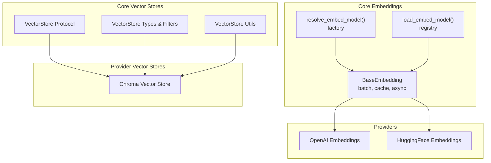
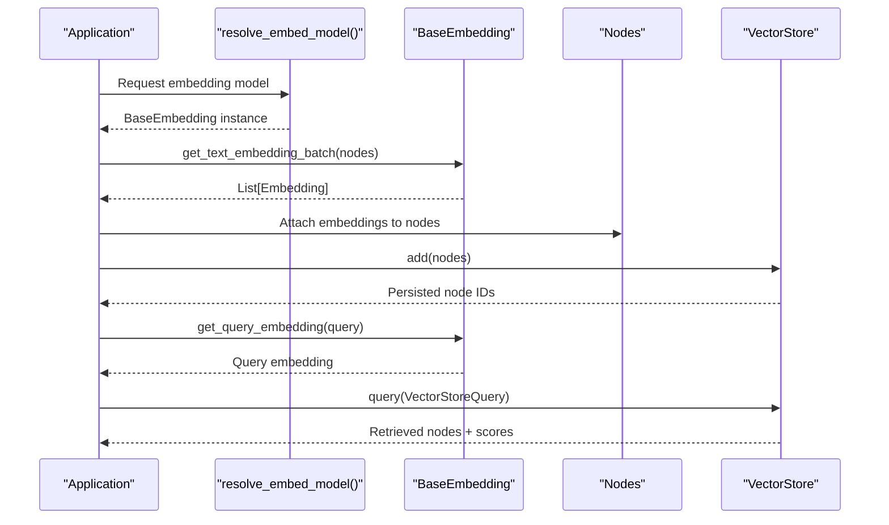
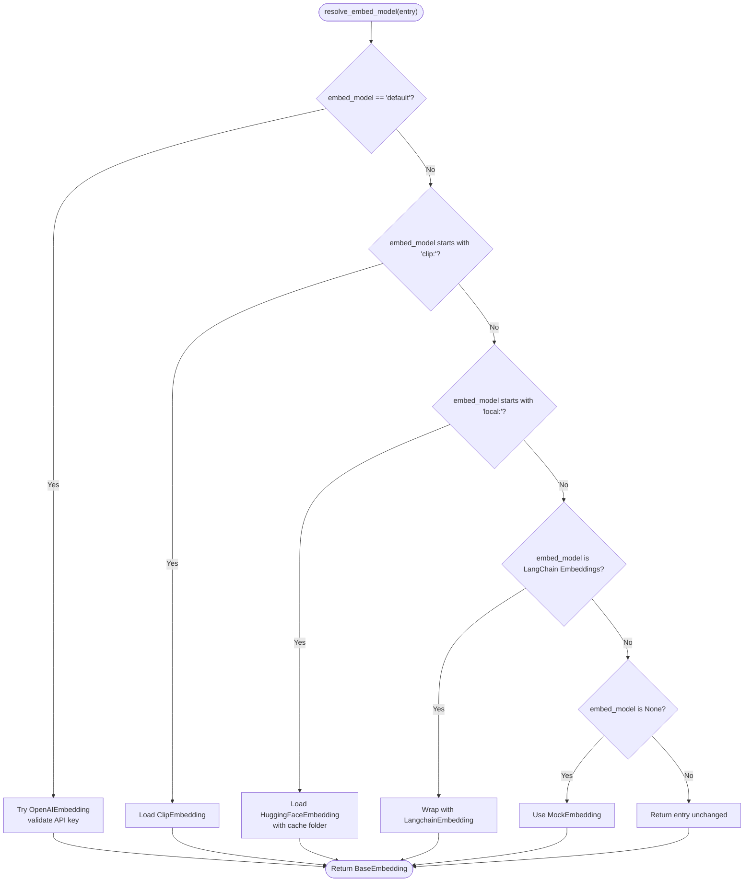
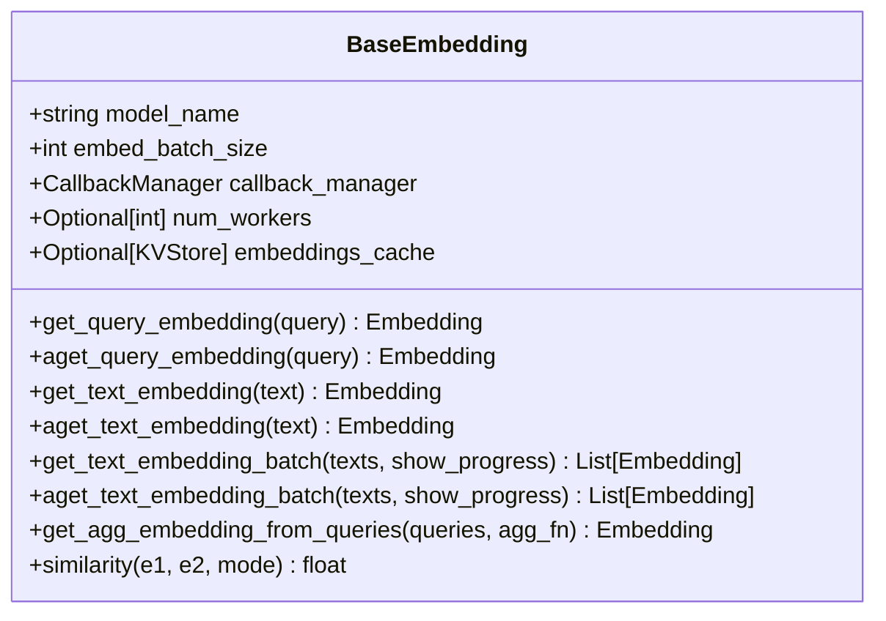
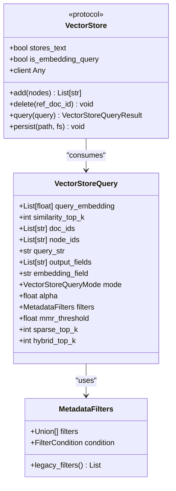
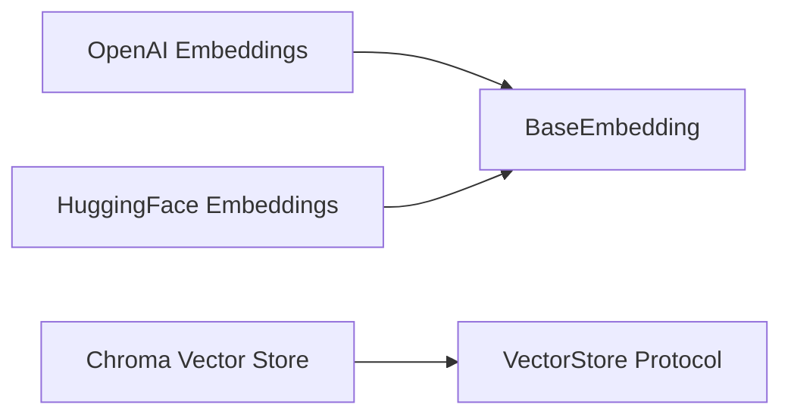
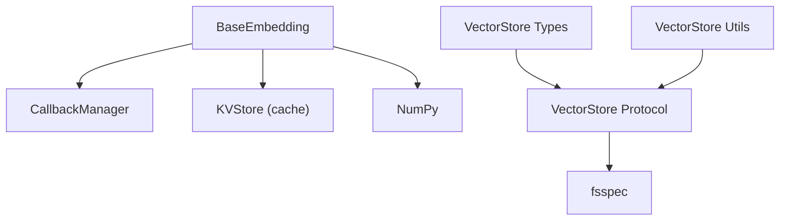

# Embedding Integration

<cite>
**Referenced Files in This Document**
- [base.py](file://llama-index-core/llama_index/core/base/embeddings/base.py)
- [loading.py](file://llama-index-core/llama_index/core/embeddings/loading.py)
- [utils.py](file://llama-index-core/llama_index/core/embeddings/utils.py)
- [types.py](file://llama-index-core/llama_index/core/vector_stores/types.py)
- [utils.py](file://llama-index-core/llama_index/core/vector_stores/utils.py)
- [__init__.py](file://llama-index-integrations/embeddings/llama-index-embeddings-openai/llama_index/embeddings/openai/__init__.py)
- [__init__.py](file://llama-index-integrations/embeddings/llama-index-embeddings-huggingface/llama_index/embeddings/huggingface/__init__.py)
- [__init__.py](file://llama-index-integrations/vector_stores/llama-index-vector-stores-chroma/llama_index/vector_stores/chroma/__init__.py)
</cite>

## Table of Contents
1. [Introduction](#introduction)
2. [Project Structure](#project-structure)
3. [Core Components](#core-components)
4. [Architecture Overview](#architecture-overview)
5. [Detailed Component Analysis](#detailed-component-analysis)
6. [Dependency Analysis](#dependency-analysis)
7. [Performance Considerations](#performance-considerations)
8. [Troubleshooting Guide](#troubleshooting-guide)
9. [Conclusion](#conclusion)
10. [Appendices](#appendices)

## Introduction
This document explains how embedding models integrate with vector store indexes in the repository. It covers embedding model loading, vector dimension matching, caching strategies, batch processing, and memory optimization. It also documents provider integration patterns (OpenAI, HuggingFace, and others), failure handling, pipeline construction, versioning, and operational consistency across vector store operations.

## Project Structure
The embedding and vector store subsystems are organized around core abstractions and integration packages:
- Core embedding abstractions define the BaseEmbedding interface, batch APIs, caching, and instrumentation.
- Provider-specific embedding implementations live under llama-index-integrations/embeddings.
- Vector store abstractions define the protocol and common utilities for persistence and metadata filtering.
- Provider-specific vector stores live under llama-index-integrations/vector_stores.

**Diagram sources**
- [base.py](file://llama-index-core/llama_index/core/base/embeddings/base.py#L72-L619)
- [utils.py](file://llama-index-core/llama_index/core/embeddings/utils.py#L31-L141)
- [loading.py](file://llama-index-core/llama_index/core/embeddings/loading.py#L39-L50)
- [types.py](file://llama-index-core/llama_index/core/vector_stores/types.py#L269-L439)
- [utils.py](file://llama-index-core/llama_index/core/vector_stores/utils.py#L1-L235)
- [__init__.py](file://llama-index-integrations/embeddings/llama-index-embeddings-openai/llama_index/embeddings/openai/__init__.py#L1-L14)
- [__init__.py](file://llama-index-integrations/embeddings/llama-index-embeddings-huggingface/llama_index/embeddings/huggingface/__init__.py#L1-L12)
- [__init__.py](file://llama-index-integrations/vector_stores/llama-index-vector-stores-chroma/llama_index/vector_stores/chroma/__init__.py#L1-L4)

**Section sources**
- [base.py](file://llama-index-core/llama_index/core/base/embeddings/base.py#L72-L619)
- [utils.py](file://llama-index-core/llama_index/core/embeddings/utils.py#L31-L141)
- [loading.py](file://llama-index-core/llama_index/core/embeddings/loading.py#L39-L50)
- [types.py](file://llama-index-core/llama_index/core/vector_stores/types.py#L269-L439)
- [utils.py](file://llama-index-core/llama_index/core/vector_stores/utils.py#L1-L235)
- [__init__.py](file://llama-index-integrations/embeddings/llama-index-embeddings-openai/llama_index/embeddings/openai/__init__.py#L1-L14)
- [__init__.py](file://llama-index-integrations/embeddings/llama-index-embeddings-huggingface/llama_index/embeddings/huggingface/__init__.py#L1-L12)
- [__init__.py](file://llama-index-integrations/vector_stores/llama-index-vector-stores-chroma/llama_index/vector_stores/chroma/__init__.py#L1-L4)

## Core Components
- BaseEmbedding: Defines synchronous/asynchronous embedding APIs, batch processing, caching via a KVStore, aggregation helpers, and instrumentation hooks.
- resolve_embed_model: Factory that resolves a concrete embedding model from string or object, including defaults and local/HF variants.
- load_embed_model: Registry-based loader for embedding classes by class name.
- VectorStore Protocol and Types: Defines query semantics, modes (semantic, sparse, hybrid), filters, and result structures.
- VectorStore Utilities: Node-to-metadata conversion, metadata filtering function builder, and related helpers.

Key capabilities:
- Batch embedding generation with configurable batch size and optional progress reporting.
- Async batch generation with worker concurrency control.
- Caching of embeddings keyed by text/query with UUID-based value storage to avoid collisions.
- Instrumentation and callback events for tracing and monitoring.

**Section sources**
- [base.py](file://llama-index-core/llama_index/core/base/embeddings/base.py#L72-L619)
- [utils.py](file://llama-index-core/llama_index/core/embeddings/utils.py#L31-L141)
- [loading.py](file://llama-index-core/llama_index/core/embeddings/loading.py#L39-L50)
- [types.py](file://llama-index-core/llama_index/core/vector_stores/types.py#L240-L266)
- [utils.py](file://llama-index-core/llama_index/core/vector_stores/utils.py#L40-L98)

## Architecture Overview
The embedding-to-vector-store integration follows a layered pattern:
- Application constructs a BaseEmbedding via resolve_embed_model.
- Nodes are embedded in batches; embeddings are attached to nodes.
- Nodes are persisted to a VectorStore that implements the protocol; metadata is normalized for storage and retrieval.
- Queries embed the incoming query, then delegate to the VectorStore to retrieve relevant nodes.

**Diagram sources**
- [utils.py](file://llama-index-core/llama_index/core/embeddings/utils.py#L31-L141)
- [base.py](file://llama-index-core/llama_index/core/base/embeddings/base.py#L446-L585)
- [types.py](file://llama-index-core/llama_index/core/vector_stores/types.py#L240-L325)
- [utils.py](file://llama-index-core/llama_index/core/vector_stores/utils.py#L40-L98)

## Detailed Component Analysis

### Embedding Model Loading and Resolution
- resolve_embed_model supports:
  - Default provider selection with validation and fallback messaging.
  - Local HuggingFace model resolution with cache folder preparation.
  - CLIs and LangChain bridge integration via adapter embedding wrapper.
  - Explicit disabling by passing None, which yields a minimal MockEmbedding.
- load_embed_model provides a registry lookup by class_name, enabling deserialization of saved embedding configurations.

**Diagram sources**
- [utils.py](file://llama-index-core/llama_index/core/embeddings/utils.py#L31-L141)

**Section sources**
- [utils.py](file://llama-index-core/llama_index/core/embeddings/utils.py#L31-L141)
- [loading.py](file://llama-index-core/llama_index/core/embeddings/loading.py#L39-L50)

### BaseEmbedding: Caching, Batching, and Async
- Caching:
  - Uses a KVStore-backed cache keyed by text/query; values are stored as a mapping with a random UUID key to avoid collisions.
  - Supports both sync and async cache reads/writes during single and batch operations.
- Batching:
  - get_text_embedding_batch streams through texts, grouping into batches up to embed_batch_size.
  - aget_text_embedding_batch supports async gathering and optional worker concurrency.
- Aggregation:
  - Provides helpers to aggregate multiple embeddings (e.g., mean) for queries or composite inputs.
- Instrumentation:
  - Emits start/end events and integrates with callback manager and dispatcher spans.

**Diagram sources**
- [base.py](file://llama-index-core/llama_index/core/base/embeddings/base.py#L72-L619)

**Section sources**
- [base.py](file://llama-index-core/llama_index/core/base/embeddings/base.py#L131-L223)
- [base.py](file://llama-index-core/llama_index/core/base/embeddings/base.py#L351-L443)
- [base.py](file://llama-index-core/llama_index/core/base/embeddings/base.py#L446-L585)

### Vector Store Integration: Types, Filters, and Utilities
- VectorStore Protocol:
  - Defines add, delete, query, and async variants; exposes stores_text and is_embedding_query flags.
- VectorStoreQuery:
  - Carries query_embedding, similarity_top_k, filters, modes (semantic, sparse, hybrid), and optional MMR parameters.
- Metadata Filtering:
  - MetadataFilters supports advanced operators and conditions; a builder produces a filter predicate given a metadata lookup function.
- Node Serialization:
  - node_to_metadata_dict serializes node content and metadata, optionally removing text and storing a JSON blob for reconstruction.
  - metadata_dict_to_node reconstructs nodes from stored metadata.

**Diagram sources**
- [types.py](file://llama-index-core/llama_index/core/vector_stores/types.py#L269-L439)
- [utils.py](file://llama-index-core/llama_index/core/vector_stores/utils.py#L101-L175)

**Section sources**
- [types.py](file://llama-index-core/llama_index/core/vector_stores/types.py#L240-L325)
- [utils.py](file://llama-index-core/llama_index/core/vector_stores/utils.py#L40-L98)
- [utils.py](file://llama-index-core/llama_index/core/vector_stores/utils.py#L101-L175)

### Provider Integrations: OpenAI and HuggingFace
- OpenAI Embeddings:
  - Exported via package init; integrates with BaseEmbedding to provide cloud inference embeddings.
- HuggingFace Embeddings:
  - Exported via package init; supports local inference with caching and model selection.
- Chroma Vector Store:
  - Exported via package init; implements the VectorStore protocol for Chroma-backed storage.

**Diagram sources**
- [__init__.py](file://llama-index-integrations/embeddings/llama-index-embeddings-openai/llama_index/embeddings/openai/__init__.py#L1-L14)
- [__init__.py](file://llama-index-integrations/embeddings/llama-index-embeddings-huggingface/llama_index/embeddings/huggingface/__init__.py#L1-L12)
- [__init__.py](file://llama-index-integrations/vector_stores/llama-index-vector-stores-chroma/llama_index/vector_stores/chroma/__init__.py#L1-L4)

**Section sources**
- [__init__.py](file://llama-index-integrations/embeddings/llama-index-embeddings-openai/llama_index/embeddings/openai/__init__.py#L1-L14)
- [__init__.py](file://llama-index-integrations/embeddings/llama-index-embeddings-huggingface/llama_index/embeddings/huggingface/__init__.py#L1-L12)
- [__init__.py](file://llama-index-integrations/vector_stores/llama-index-vector-stores-chroma/llama_index/vector_stores/chroma/__init__.py#L1-L4)

### Practical Configuration Examples
- OpenAI:
  - Use resolve_embed_model with the default selector to auto-load OpenAIEmbedding after validating the API key. Failure handling suggests installing the integration package or switching to a local model.
- HuggingFace:
  - Use resolve_embed_model with a local selector to load a HuggingFaceEmbedding with a cache folder under the user’s cache directory.
- Custom Models:
  - Implement a subclass of BaseEmbedding and register it via load_embed_model by class_name, then use resolve_embed_model to instantiate it.

Note: The above describe the mechanisms and pathways; consult provider packages for concrete configuration parameters and environment variables.

**Section sources**
- [utils.py](file://llama-index-core/llama_index/core/embeddings/utils.py#L49-L77)
- [utils.py](file://llama-index-core/llama_index/core/embeddings/utils.py#L93-L117)
- [loading.py](file://llama-index-core/llama_index/core/embeddings/loading.py#L39-L50)

### Embedding Versioning, Updates, and Consistency
- Versioning:
  - Embedding models are identified by model_name and class_name; these fields participate in serialization/deserialization via to_dict/from_dict.
- Consistency:
  - VectorStore metadata normalization ensures stable node reconstruction and filtering.
  - Embedding cache keys are derived from the text/query content; UUID-based values prevent collisions.
  - Batch sizes and async workers can be tuned to balance throughput and resource usage.

**Section sources**
- [base.py](file://llama-index-core/llama_index/core/base/embeddings/base.py#L78-L98)
- [utils.py](file://llama-index-core/llama_index/core/vector_stores/utils.py#L40-L98)

## Dependency Analysis
- Embedding core depends on:
  - Callback manager and dispatcher for instrumentation.
  - KVStore for caching (when enabled).
  - NumPy for similarity computations.
- Vector store core depends on:
  - Pydantic models for query/result structures.
  - fsspec for persistence filesystem abstraction.
- Provider integrations depend on their respective SDKs and may optionally depend on LangChain adapters.

**Diagram sources**
- [base.py](file://llama-index-core/llama_index/core/base/embeddings/base.py#L16-L24)
- [types.py](file://llama-index-core/llama_index/core/vector_stores/types.py#L17-L26)

**Section sources**
- [base.py](file://llama-index-core/llama_index/core/base/embeddings/base.py#L16-L24)
- [types.py](file://llama-index-core/llama_index/core/vector_stores/types.py#L17-L26)

## Performance Considerations
- Batch size tuning:
  - Increase embed_batch_size to improve throughput; ensure provider rate limits and memory constraints are respected.
- Concurrency:
  - Use num_workers for async batch processing to overlap I/O and reduce latency.
- Caching:
  - Enable embeddings_cache to avoid recomputation for repeated texts/queries; monitor cache hit ratio and eviction behavior.
- Memory optimization:
  - Prefer streaming batch processing and avoid loading very large batches into memory at once.
  - Use node_to_metadata_dict with remove_text to reduce stored payload sizes when appropriate.
- Similarity computation:
  - Choose similarity mode based on downstream index characteristics; cosine is often preferred for normalized vectors.

[No sources needed since this section provides general guidance]

## Troubleshooting Guide
- OpenAI embedding load failures:
  - Missing integration package or invalid API key triggers explicit ImportError/ValueError messages guiding installation and configuration.
- Local HuggingFace model failures:
  - Missing integration package or model cache issues can be surfaced during resolution; ensure the local selector is used and cache folder exists.
- Vector store metadata filtering errors:
  - Unsupported operators or nested filters raise explicit errors; use MetadataFilters with supported operators and conditions.
- Embedding cache misconfiguration:
  - If embeddings_cache is not a KVStore, validation fails; ensure a proper KVStore is supplied.

**Section sources**
- [utils.py](file://llama-index-core/llama_index/core/embeddings/utils.py#L65-L77)
- [utils.py](file://llama-index-core/llama_index/core/embeddings/utils.py#L113-L117)
- [utils.py](file://llama-index-core/llama_index/core/vector_stores/utils.py#L148-L173)
- [base.py](file://llama-index-core/llama_index/core/base/embeddings/base.py#L100-L110)

## Conclusion
The embedding and vector store subsystems provide a robust, extensible foundation for RAG pipelines. BaseEmbedding offers standardized batch and async APIs with caching and instrumentation. VectorStore types and utilities enable consistent metadata handling and flexible querying. Provider integrations (OpenAI, HuggingFace, Chroma) demonstrate how to plug external systems into this framework while preserving performance and reliability.

[No sources needed since this section summarizes without analyzing specific files]

## Appendices
- Provider package exports:
  - OpenAI: [__init__.py](file://llama-index-integrations/embeddings/llama-index-embeddings-openai/llama_index/embeddings/openai/__init__.py#L1-L14)
  - HuggingFace: [__init__.py](file://llama-index-integrations/embeddings/llama-index-embeddings-huggingface/llama_index/embeddings/huggingface/__init__.py#L1-L12)
  - Chroma: [__init__.py](file://llama-index-integrations/vector_stores/llama-index-vector-stores-chroma/llama_index/vector_stores/chroma/__init__.py#L1-L4)

[No sources needed since this section lists references without analysis]