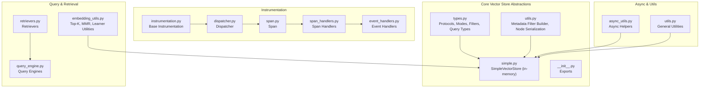
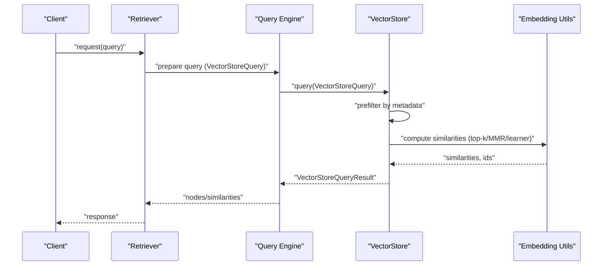
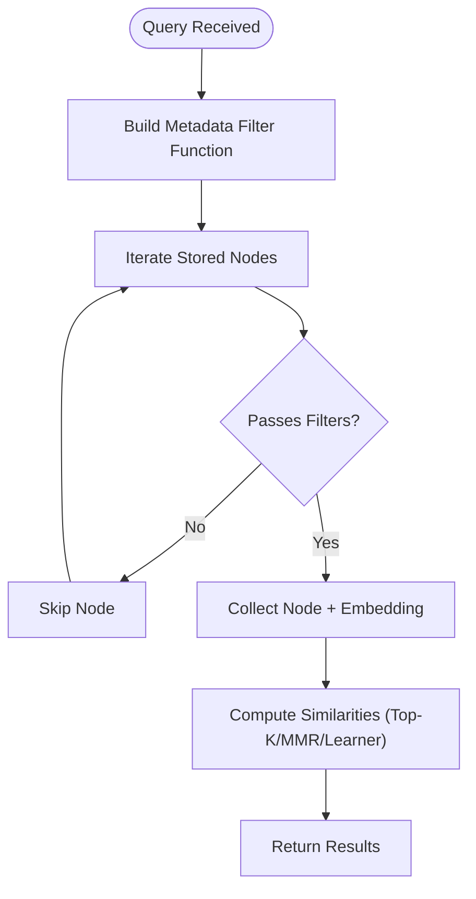
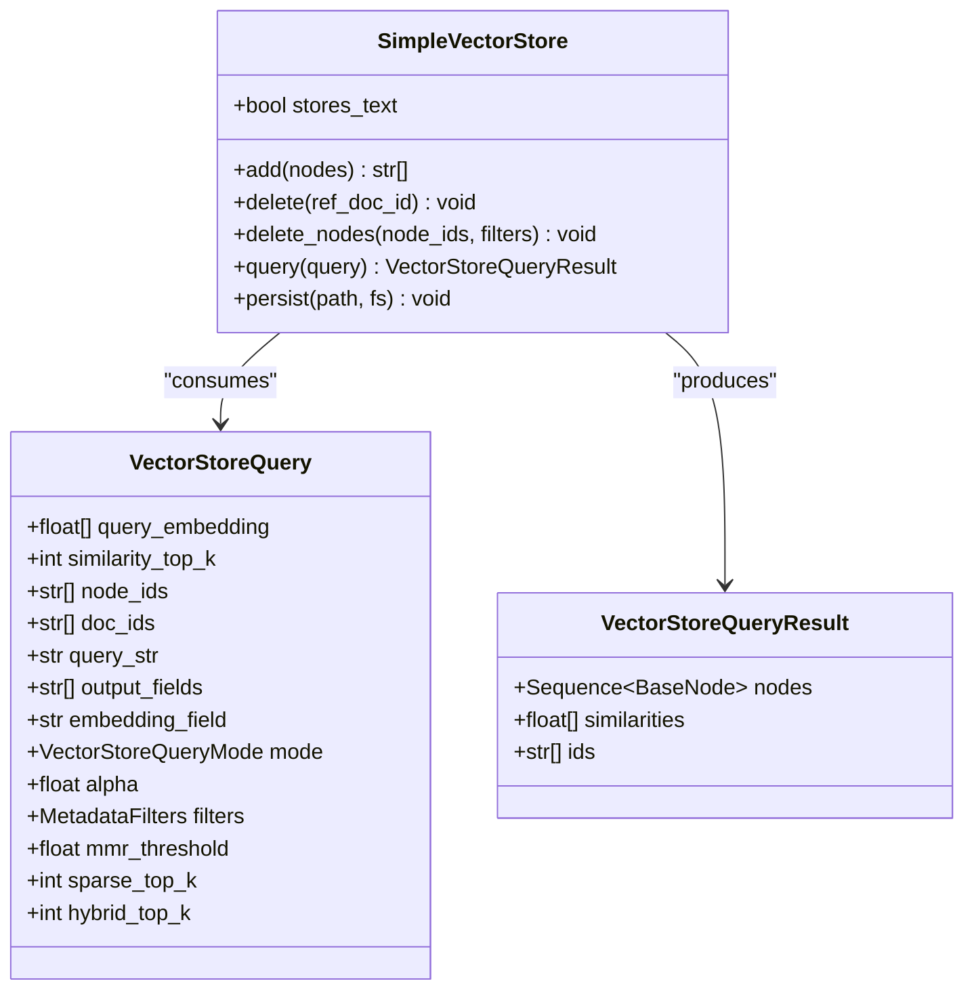
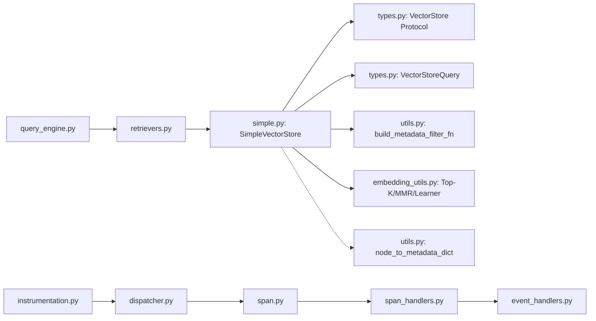

# Performance Optimization

<cite>
**Referenced Files in This Document**
- [types.py](file://llama-index-core/llama_index/core/vector_stores/types.py)
- [simple.py](file://llama-index-core/llama_index/core/vector_stores/simple.py)
- [utils.py](file://llama-index-core/llama_index/core/vector_stores/utils.py)
- [__init__.py](file://llama-index-core/llama_index/core/vector_stores/__init__.py)
- [embedding_utils.py](file://llama-index-core/llama_index/core/indices/query/embedding_utils.py)
- [retrievers.py](file://llama-index-core/llama_index/core/retrievers/__init__.py)
- [query_engine.py](file://llama-index-core/llama_index/core/query_engine/__init__.py)
- [service_context.py](file://llama-index-core/llama_index/core/service_context.py)
- [instrumentation.py](file://llama-index-instrumentation/src/llama_index_instrumentation/base/instrumentation.py)
- [dispatcher.py](file://llama-index-instrumentation/src/llama_index_instrumentation/dispatcher.py)
- [span.py](file://llama-index-instrumentation/src/llama_index_instrumentation/span/span.py)
- [span_handlers.py](file://llama-index-instrumentation/src/llama_index_instrumentation/span_handlers.py)
- [event_handlers.py](file://llama-index-instrumentation/src/llama_index_instrumentation/event_handlers/__init__.py)
- [callbacks.py](file://llama-index-core/llama_index/core/callbacks/callbacks.py)
- [async_utils.py](file://llama-index-core/llama_index/core/async_utils.py)
- [utils.py](file://llama-index-core/llama_index/core/utils.py)
- [vector_store_benchmarking.py](file://docs/examples/benchmarks/vector_store_benchmarking.py)
- [vector_store_monitoring.py](file://docs/examples/benchmarks/vector_store_monitoring.py)
</cite>

## Table of Contents
1. [Introduction](#introduction)
2. [Project Structure](#project-structure)
3. [Core Components](#core-components)
4. [Architecture Overview](#architecture-overview)
5. [Detailed Component Analysis](#detailed-component-analysis)
6. [Dependency Analysis](#dependency-analysis)
7. [Performance Considerations](#performance-considerations)
8. [Troubleshooting Guide](#troubleshooting-guide)
9. [Conclusion](#conclusion)
10. [Appendices](#appendices)

## Introduction
This document provides a comprehensive guide to optimizing vector store performance in LlamaIndex. It focuses on indexing strategies, batch processing, memory management, query optimization, caching, search pruning, scaling, partitioning, distributed deployment, benchmarking, monitoring, bottleneck identification, cost optimization, resource allocation, capacity planning, and maintaining query latency SLAs under high throughput.

## Project Structure
The vector store subsystem centers around a protocol-driven abstraction, a simple in-memory implementation, and shared utilities for metadata filtering and node serialization. Supporting components include retrieval and query engine orchestration, instrumentation for observability, and async utilities for throughput.

**Diagram sources**
- [types.py](file://llama-index-core/llama_index/core/vector_stores/types.py#L268-L439)
- [utils.py](file://llama-index-core/llama_index/core/vector_stores/utils.py#L101-L175)
- [simple.py](file://llama-index-core/llama_index/core/vector_stores/simple.py#L64-L355)
- [embedding_utils.py](file://llama-index-core/llama_index/core/indices/query/embedding_utils.py#L1-L200)
- [retrievers.py](file://llama-index-core/llama_index/core/retrievers/__init__.py#L1-L200)
- [query_engine.py](file://llama-index-core/llama_index/core/query_engine/__init__.py#L1-L200)
- [instrumentation.py](file://llama-index-instrumentation/src/llama_index_instrumentation/base/instrumentation.py#L1-L200)
- [dispatcher.py](file://llama-index-instrumentation/src/llama_index_instrumentation/dispatcher.py#L1-L200)
- [span.py](file://llama-index-instrumentation/src/llama_index_instrumentation/span/span.py#L1-L200)
- [span_handlers.py](file://llama-index-instrumentation/src/llama_index_instrumentation/span_handlers.py#L1-L200)
- [event_handlers.py](file://llama-index-instrumentation/src/llama_index_instrumentation/event_handlers/__init__.py#L1-L200)
- [async_utils.py](file://llama-index-core/llama_index/core/async_utils.py#L1-L200)
- [utils.py](file://llama-index-core/llama_index/core/utils.py#L1-L200)

**Section sources**
- [types.py](file://llama-index-core/llama_index/core/vector_stores/types.py#L1-L439)
- [simple.py](file://llama-index-core/llama_index/core/vector_stores/simple.py#L1-L355)
- [utils.py](file://llama-index-core/llama_index/core/vector_stores/utils.py#L1-L235)
- [__init__.py](file://llama-index-core/llama_index/core/vector_stores/__init__.py#L1-L28)

## Core Components
- VectorStore protocol defines the contract for adding, deleting, querying, and persisting nodes and embeddings. It supports asynchronous variants and optional text storage capabilities.
- VectorStoreQuery encapsulates query intent: embedding vectors, similarity top-k, node/doc filters, modes (dense, sparse, hybrid, semantic_hybrid, MMR, learner-based), and hybrid parameters.
- MetadataFilters and FilterOperator define rich filtering semantics for prefiltering during queries.
- SimpleVectorStore provides an in-memory implementation suitable for small datasets and testing, demonstrating indexing via embedding dictionaries and metadata filtering via a generated predicate function.

Key performance-relevant aspects:
- Query modes and parameters drive compute and memory trade-offs.
- Metadata filtering reduces candidate sets early, lowering downstream compute.
- Batch-friendly APIs (add/query) enable throughput scaling.

**Section sources**
- [types.py](file://llama-index-core/llama_index/core/vector_stores/types.py#L268-L439)
- [types.py](file://llama-index-core/llama_index/core/vector_stores/types.py#L240-L267)
- [types.py](file://llama-index-core/llama_index/core/vector_stores/types.py#L94-L186)
- [simple.py](file://llama-index-core/llama_index/core/vector_stores/simple.py#L64-L355)
- [utils.py](file://llama-index-core/llama_index/core/vector_stores/utils.py#L101-L175)

## Architecture Overview
The vector store architecture separates concerns:
- Abstraction: VectorStore protocol and query types.
- Implementation: SimpleVectorStore for in-memory storage and retrieval.
- Utilities: Metadata filtering and node serialization helpers.
- Orchestration: Retrievers and query engines consume vector stores.
- Observability: Instrumentation pipeline captures spans and events.
- Async: Utilities to scale concurrent operations.

**Diagram sources**
- [types.py](file://llama-index-core/llama_index/core/vector_stores/types.py#L240-L326)
- [simple.py](file://llama-index-core/llama_index/core/vector_stores/simple.py#L244-L315)
- [embedding_utils.py](file://llama-index-core/llama_index/core/indices/query/embedding_utils.py#L1-L200)
- [retrievers.py](file://llama-index-core/llama_index/core/retrievers/__init__.py#L1-L200)
- [query_engine.py](file://llama-index-core/llama_index/core/query_engine/__init__.py#L1-L200)

## Detailed Component Analysis

### VectorStore Protocol and Query Model
- Protocol methods: add, delete, query, async variants, persist.
- Query model: embedding, similarity_top_k, node_ids/doc_ids, query_str, output_fields, embedding_field, mode, alpha, filters, mmr_threshold, sparse_top_k, hybrid_top_k.
- Modes: DEFAULT, SPARSE, HYBRID, TEXT_SEARCH, SEMANTIC_HYBRID, SVM, LOGISTIC_REGRESSION, LINEAR_REGRESSION, MMR.

Optimization implications:
- Mode selection affects compute intensity and memory footprint.
- Filters reduce candidate sets before similarity computation.
- Hybrid parameters balance BM25 and vector contributions.

**Section sources**
- [types.py](file://llama-index-core/llama_index/core/vector_stores/types.py#L268-L439)
- [types.py](file://llama-index-core/llama_index/core/vector_stores/types.py#L240-L267)

### Metadata Filtering and Pruning
- MetadataFilters supports operators (EQ, NE, GT, GTE, LT, LTE, IN, NIN, ANY, ALL, TEXT_MATCH, TEXT_MATCH_INSENSITIVE, CONTAINS, IS_EMPTY) and conditions (AND, OR, NOT).
- build_metadata_filter_fn constructs a predicate from metadata lookup and filter definitions.
- node_to_metadata_dict serializes node metadata for persistence and enables filtering.

Pruning benefits:
- Early elimination of non-matching nodes reduces embedding comparisons.
- Flat metadata validation ensures efficient serialization/deserialization.

**Diagram sources**
- [utils.py](file://llama-index-core/llama_index/core/vector_stores/utils.py#L101-L175)
- [simple.py](file://llama-index-core/llama_index/core/vector_stores/simple.py#L244-L315)

**Section sources**
- [utils.py](file://llama-index-core/llama_index/core/vector_stores/utils.py#L101-L175)
- [utils.py](file://llama-index-core/llama_index/core/vector_stores/utils.py#L40-L99)
- [simple.py](file://llama-index-core/llama_index/core/vector_stores/simple.py#L244-L315)

### SimpleVectorStore: In-Memory Indexing and Retrieval
- Stores embeddings in a dictionary keyed by node_id.
- Maintains metadata_dict and text_id_to_ref_doc_id mappings.
- add: writes embeddings and metadata per node.
- delete/delete_nodes: removes entries by ref_doc_id or filtered node_ids.
- query: applies metadata filters, computes similarities, returns top-k results.

Performance characteristics:
- O(n) scan over stored embeddings after prefiltering.
- Memory proportional to number of nodes × embedding dimension.
- Suitable for small to medium datasets; consider external stores for large-scale.

**Diagram sources**
- [simple.py](file://llama-index-core/llama_index/core/vector_stores/simple.py#L64-L355)
- [types.py](file://llama-index-core/llama_index/core/vector_stores/types.py#L240-L326)

**Section sources**
- [simple.py](file://llama-index-core/llama_index/core/vector_stores/simple.py#L64-L355)
- [types.py](file://llama-index-core/llama_index/core/vector_stores/types.py#L240-L326)

### Query Modes and Similarity Computation
- DEFAULT: Top-K cosine/similarity scoring.
- MMR: Diversity-aware selection using mmr_threshold.
- Learner modes: SVM, Logistic Regression, Linear Regression for fit-based ranking.
- Hybrid modes: Combine BM25 and vector search with alpha weighting.

Operational guidance:
- Choose DEFAULT for speed; MMR for diversity; learner modes for learned ranking.
- Tune similarity_top_k and hybrid parameters to balance precision/recall and latency.

**Section sources**
- [types.py](file://llama-index-core/llama_index/core/vector_stores/types.py#L45-L61)
- [embedding_utils.py](file://llama-index-core/llama_index/core/indices/query/embedding_utils.py#L1-L200)

### Batch Processing and Throughput
- VectorStore.add accepts sequences of nodes for batch ingestion.
- Async variants (async_add, aquery, adelete) enable concurrency.
- Retrievers and query engines orchestrate batching and parallelism.

Best practices:
- Batch node ingestion to amortize overhead.
- Use async APIs to overlap I/O and compute.
- Control similarity_top_k and hybrid_top_k to bound compute.

**Section sources**
- [types.py](file://llama-index-core/llama_index/core/vector_stores/types.py#L280-L326)
- [simple.py](file://llama-index-core/llama_index/core/vector_stores/simple.py#L174-L189)
- [async_utils.py](file://llama-index-core/llama_index/core/async_utils.py#L1-L200)

### Caching Mechanisms
- VectorStore.persist and from_persist_path enable durable caching of in-memory stores.
- Namespaced persistence supports multiple stores per directory.
- Instrumentation spans capture query durations and throughput metrics for cache effectiveness.

Recommendations:
- Persist frequently accessed subsets to reduce cold-start latency.
- Use namespaces to isolate environments or datasets.
- Monitor span durations to assess cache hit rates and adjust persistence cadence.

**Section sources**
- [simple.py](file://llama-index-core/llama_index/core/vector_stores/simple.py#L317-L346)
- [simple.py](file://llama-index-core/llama_index/core/vector_stores/simple.py#L108-L145)
- [instrumentation.py](file://llama-index-instrumentation/src/llama_index_instrumentation/base/instrumentation.py#L1-L200)
- [dispatcher.py](file://llama-index-instrumentation/src/llama_index_instrumentation/dispatcher.py#L1-L200)
- [span.py](file://llama-index-instrumentation/src/llama_index_instrumentation/span/span.py#L1-L200)

### Scaling Approaches and Partitioning
- Partition by doc_ids or metadata filters to shard workload.
- Use namespaces for logical separation in persistent stores.
- For large-scale, integrate with external vector databases via custom VectorStore implementations.

Guidance:
- Shard by time, geography, or domain to limit per-query candidate sets.
- Apply metadata filters early to minimize cross-partition scans.
- Consider replication for availability and read scaling.

**Section sources**
- [simple.py](file://llama-index-core/llama_index/core/vector_stores/simple.py#L191-L239)
- [utils.py](file://llama-index-core/llama_index/core/vector_stores/utils.py#L40-L99)

### Distributed Deployment Patterns
- Instrumentation pipeline (dispatcher, span handlers, event handlers) provides observability across distributed components.
- Use async utilities to coordinate parallel operations across nodes.
- ServiceContext orchestrates components and can influence resource allocation.

Patterns:
- Span-based tracing to identify slow paths.
- Event handlers to emit metrics and alerts.
- Async coordination for multi-node retrieval.

**Section sources**
- [instrumentation.py](file://llama-index-instrumentation/src/llama_index_instrumentation/base/instrumentation.py#L1-L200)
- [dispatcher.py](file://llama-index-instrumentation/src/llama_index_instrumentation/dispatcher.py#L1-L200)
- [span_handlers.py](file://llama-index-instrumentation/src/llama_index_instrumentation/span_handlers.py#L1-L200)
- [event_handlers.py](file://llama-index-instrumentation/src/llama_index_instrumentation/event_handlers/__init__.py#L1-L200)
- [async_utils.py](file://llama-index-core/llama_index/core/async_utils.py#L1-L200)
- [service_context.py](file://llama-index-core/llama_index/core/service_context.py#L1-L200)

## Dependency Analysis
Vector store dependencies emphasize modularity and testability:
- SimpleVectorStore depends on VectorStore protocol, VectorStoreQuery, and metadata utilities.
- Embedding utilities are invoked from query paths to compute similarities.
- Instrumentation integrates with dispatchers and span handlers for observability.

**Diagram sources**
- [simple.py](file://llama-index-core/llama_index/core/vector_stores/simple.py#L64-L355)
- [types.py](file://llama-index-core/llama_index/core/vector_stores/types.py#L268-L439)
- [utils.py](file://llama-index-core/llama_index/core/vector_stores/utils.py#L101-L175)
- [embedding_utils.py](file://llama-index-core/llama_index/core/indices/query/embedding_utils.py#L1-L200)
- [retrievers.py](file://llama-index-core/llama_index/core/retrievers/__init__.py#L1-L200)
- [query_engine.py](file://llama-index-core/llama_index/core/query_engine/__init__.py#L1-L200)
- [instrumentation.py](file://llama-index-instrumentation/src/llama_index_instrumentation/base/instrumentation.py#L1-L200)
- [dispatcher.py](file://llama-index-instrumentation/src/llama_index_instrumentation/dispatcher.py#L1-L200)
- [span.py](file://llama-index-instrumentation/src/llama_index_instrumentation/span/span.py#L1-L200)
- [span_handlers.py](file://llama-index-instrumentation/src/llama_index_instrumentation/span_handlers.py#L1-L200)
- [event_handlers.py](file://llama-index-instrumentation/src/llama_index_instrumentation/event_handlers/__init__.py#L1-L200)

**Section sources**
- [simple.py](file://llama-index-core/llama_index/core/vector_stores/simple.py#L64-L355)
- [types.py](file://llama-index-core/llama_index/core/vector_stores/types.py#L268-L439)
- [utils.py](file://llama-index-core/llama_index/core/vector_stores/utils.py#L101-L175)
- [embedding_utils.py](file://llama-index-core/llama_index/core/indices/query/embedding_utils.py#L1-L200)

## Performance Considerations
- Indexing strategies
  - Prefer metadata filters to prune candidates before similarity computation.
  - Use embedding_field and output_fields to limit payload sizes.
- Batch processing
  - Batch add for ingestion; tune batch sizes to balance throughput and memory.
  - Use async APIs to overlap I/O and compute.
- Memory management
  - Monitor memory growth with increasing node counts.
  - Persist stores periodically to reclaim memory and accelerate restarts.
- Query optimization
  - Adjust similarity_top_k and hybrid parameters to meet latency SLAs.
  - Use MMR for diverse results when needed; otherwise prefer DEFAULT.
- Caching and pruning
  - Enable persistence and namespace isolation for hot partitions.
  - Leverage early filtering to reduce scan sizes.
- Scaling and distribution
  - Partition by doc_ids or metadata; apply filters to constrain scans.
  - Use instrumentation spans to detect hotspots and bottlenecks.

[No sources needed since this section provides general guidance]

## Troubleshooting Guide
- Metadata filtering errors
  - Symptom: ValueError when filters are applied to stores without metadata.
  - Action: Rebuild the store with metadata enabled or avoid filters on legacy stores.
- Persistence failures
  - Symptom: Load errors when persist_path does not exist.
  - Action: Ensure directories exist and use from_persist_path with correct fs.
- High latency queries
  - Actions:
    - Reduce similarity_top_k.
    - Switch from MMR to DEFAULT.
    - Add appropriate metadata filters.
    - Use async APIs and batching.
- Instrumentation gaps
  - Actions:
    - Verify dispatcher registration.
    - Confirm span handlers and event handlers are configured.
    - Inspect spans for long-running segments.

**Section sources**
- [simple.py](file://llama-index-core/llama_index/core/vector_stores/simple.py#L250-L259)
- [simple.py](file://llama-index-core/llama_index/core/vector_stores/simple.py#L337-L346)
- [instrumentation.py](file://llama-index-instrumentation/src/llama_index_instrumentation/base/instrumentation.py#L1-L200)
- [dispatcher.py](file://llama-index-instrumentation/src/llama_index_instrumentation/dispatcher.py#L1-L200)
- [span_handlers.py](file://llama-index-instrumentation/src/llama_index_instrumentation/span_handlers.py#L1-L200)
- [event_handlers.py](file://llama-index-instrumentation/src/llama_index_instrumentation/event_handlers/__init__.py#L1-L200)

## Conclusion
Optimizing vector store performance in LlamaIndex hinges on effective prefiltering, judicious query mode selection, batch processing, and robust caching. For large-scale deployments, combine metadata-driven pruning, partitioning, and distributed instrumentation to maintain query latency SLAs while controlling costs and allocating resources efficiently.

[No sources needed since this section summarizes without analyzing specific files]

## Appendices

### Practical Examples and Benchmarks
- Benchmarking: Use dedicated scripts to measure ingestion and query latencies across configurations.
- Monitoring: Integrate instrumentation spans to track query durations, throughput, and error rates.

Note: Example scripts referenced below illustrate typical benchmarking and monitoring patterns. Replace placeholder paths with actual script locations in your environment.

**Section sources**
- [vector_store_benchmarking.py](file://docs/examples/benchmarks/vector_store_benchmarking.py#L1-L200)
- [vector_store_monitoring.py](file://docs/examples/benchmarks/vector_store_monitoring.py#L1-L200)