# Similarity Search

<cite>
**Referenced Files in This Document**
- [retriever.py](file://llama-index-core/llama_index/core/indices/vector_store/retrievers/retriever.py)
- [auto_retriever.py](file://llama-index-core/llama_index/core/indices/vector_store/retrievers/auto_retriever/auto_retriever.py)
- [types.py](file://llama-index-core/llama_index/core/vector_stores/types.py)
- [utils.py](file://llama-index-core/llama_index/core/vector_stores/utils.py)
</cite>

## Table of Contents
1. [Introduction](#introduction)
2. [Project Structure](#project-structure)
3. [Core Components](#core-components)
4. [Architecture Overview](#architecture-overview)
5. [Detailed Component Analysis](#detailed-component-analysis)
6. [Dependency Analysis](#dependency-analysis)
7. [Performance Considerations](#performance-considerations)
8. [Troubleshooting Guide](#troubleshooting-guide)
9. [Conclusion](#conclusion)

## Introduction
This document explains similarity search in vector store indexes with a focus on embedding-based scoring, distance metrics, and retrieval mechanics. It covers the VectorIndexRetriever and VectorIndexAutoRetriever classes, detailing how queries are processed, how k-nearest neighbors search is executed, and how threshold-based filtering is applied. It also provides guidance on optimization, batch and parallel execution patterns, and practical configuration tips for large-scale deployments.

## Project Structure
The similarity search pipeline centers around two primary retriever classes and supporting types and utilities:
- VectorIndexRetriever: performs similarity search against a vector store index.
- VectorIndexAutoRetriever: uses an LLM to infer retrieval parameters (query rewriting, filters, top_k) for a given user query.
- Vector store types: define query structures, modes, and metadata filters.
- Utilities: handle metadata filtering and node serialization helpers.

**Diagram sources**
- [retriever.py](file://llama-index-core/llama_index/core/indices/vector_store/retrievers/retriever.py#L24-L268)
- [auto_retriever.py](file://llama-index-core/llama_index/core/indices/vector_store/retrievers/auto_retriever/auto_retriever.py#L37-L245)
- [types.py](file://llama-index-core/llama_index/core/vector_stores/types.py#L45-L266)
- [utils.py](file://llama-index-core/llama_index/core/vector_stores/utils.py#L101-L175)

**Section sources**
- [retriever.py](file://llama-index-core/llama_index/core/indices/vector_store/retrievers/retriever.py#L1-L268)
- [auto_retriever.py](file://llama-index-core/llama_index/core/indices/vector_store/retrievers/auto_retriever/auto_retriever.py#L1-L245)
- [types.py](file://llama-index-core/llama_index/core/vector_stores/types.py#L1-L439)
- [utils.py](file://llama-index-core/llama_index/core/vector_stores/utils.py#L1-L235)

## Core Components
- VectorIndexRetriever
  - Accepts a VectorStoreIndex and constructs a VectorStoreQuery from a QueryBundle.
  - Embeddings are optionally computed via an embedding model when required by the selected query mode.
  - Executes the vector store query and enriches results with missing node content from the docstore when needed.
  - Returns scored nodes ordered by similarity.

- VectorIndexAutoRetriever
  - Uses an LLM to parse a structured retrieval specification (query rewrite, filters, top_k).
  - Applies constraints such as max_top_k and optional empty-query default vectors.
  - Builds a VectorIndexRetriever with inferred parameters.

- Vector Store Types
  - VectorStoreQueryMode enumerates supported modes (default, sparse, hybrid, text_search, semantic_hybrid, MMR, and learner-based modes).
  - VectorStoreQuery carries query embedding, top_k, filters, and mode.
  - MetadataFilters and FilterOperator define advanced filtering capabilities.

- Utilities
  - build_metadata_filter_fn builds a predicate to filter nodes by metadata according to operators and conditions.

**Section sources**
- [retriever.py](file://llama-index-core/llama_index/core/indices/vector_store/retrievers/retriever.py#L24-L268)
- [auto_retriever.py](file://llama-index-core/llama_index/core/indices/vector_store/retrievers/auto_retriever/auto_retriever.py#L37-L245)
- [types.py](file://llama-index-core/llama_index/core/vector_stores/types.py#L45-L266)
- [utils.py](file://llama-index-core/llama_index/core/vector_stores/utils.py#L101-L175)

## Architecture Overview
The similarity search flow integrates query processing, embedding generation, vector store querying, and result enrichment.

**Diagram sources**
- [auto_retriever.py](file://llama-index-core/llama_index/core/indices/vector_store/retrievers/auto_retriever/auto_retriever.py#L158-L244)
- [retriever.py](file://llama-index-core/llama_index/core/indices/vector_store/retrievers/retriever.py#L104-L267)
- [types.py](file://llama-index-core/llama_index/core/vector_stores/types.py#L240-L266)

## Detailed Component Analysis

### VectorIndexRetriever
Key responsibilities:
- Decide whether embeddings are needed based on query mode and vector store capability.
- Build a VectorStoreQuery from a QueryBundle and execute it against the underlying vector store.
- Enrich results by fetching missing node content from the docstore when the vector store does not store text.
- Convert raw results into NodeWithScore objects with similarity scores.

Important behaviors:
- Embedding computation is triggered when the vector store requires embeddings and the mode is not text-only.
- Node enrichment avoids redundant fetches by inspecting which nodes lack stored text.
- Scores are populated from the vector store’s similarity array when available.

**Diagram sources**
- [retriever.py](file://llama-index-core/llama_index/core/indices/vector_store/retrievers/retriever.py#L24-L268)
- [types.py](file://llama-index-core/llama_index/core/vector_stores/types.py#L240-L266)
- [types.py](file://llama-index-core/llama_index/core/vector_stores/types.py#L142-L201)

**Section sources**
- [retriever.py](file://llama-index-core/llama_index/core/indices/vector_store/retrievers/retriever.py#L24-L268)
- [types.py](file://llama-index-core/llama_index/core/vector_stores/types.py#L240-L266)
- [types.py](file://llama-index-core/llama_index/core/vector_stores/types.py#L142-L201)

### VectorIndexAutoRetriever
Key responsibilities:
- Generate a structured retrieval specification from a natural language query using an LLM.
- Apply constraints such as max_top_k and empty-query default vectors.
- Construct a VectorIndexRetriever with inferred parameters and return it with a prepared QueryBundle.

Processing logic highlights:
- Parses LLM output into a VectorStoreQuerySpec.
- Merges extra filters with parsed filters.
- Selects top_k considering empty-query behavior and max limits.
- Builds a retriever and returns it with a query bundle (possibly pre-embedded if default_empty_query_vector is provided).

**Diagram sources**
- [auto_retriever.py](file://llama-index-core/llama_index/core/indices/vector_store/retrievers/auto_retriever/auto_retriever.py#L158-L244)

**Section sources**
- [auto_retriever.py](file://llama-index-core/llama_index/core/indices/vector_store/retrievers/auto_retriever/auto_retriever.py#L37-L245)

### Distance Metrics and Scoring Mechanisms
Supported query modes include:
- DEFAULT: standard vector similarity search.
- SPARSE: sparse retrieval (e.g., BM25).
- HYBRID: combination of dense and sparse signals.
- TEXT_SEARCH: pure text search without embeddings.
- SEMANTIC_HYBRID: semantic plus sparse hybrid.
- MMR: maximum marginal relevance for diversity.

Scoring:
- Similarity scores are returned by the vector store and attached to nodes as NodeWithScore entries.
- The presence and ordering of scores depend on the underlying vector store implementation and query mode.

Threshold-based filtering:
- MetadataFilters support a wide range of operators and conditions to restrict candidate sets prior to similarity computation.
- Operators include equality, inequality, numeric comparisons, containment checks, text match, and emptiness checks.

**Diagram sources**
- [types.py](file://llama-index-core/llama_index/core/vector_stores/types.py#L45-L92)
- [types.py](file://llama-index-core/llama_index/core/vector_stores/types.py#L63-L92)
- [types.py](file://llama-index-core/llama_index/core/vector_stores/types.py#L85-L92)
- [types.py](file://llama-index-core/llama_index/core/vector_stores/types.py#L142-L201)

**Section sources**
- [types.py](file://llama-index-core/llama_index/core/vector_stores/types.py#L45-L92)
- [types.py](file://llama-index-core/llama_index/core/vector_stores/types.py#L63-L92)
- [types.py](file://llama-index-core/llama_index/core/vector_stores/types.py#L85-L92)
- [types.py](file://llama-index-core/llama_index/core/vector_stores/types.py#L142-L201)

### Query Processing and KNN Search
- QueryBundle is transformed into a VectorStoreQuery with mode, top_k, and filters.
- For modes that require embeddings, embeddings are computed via the embedding model before querying.
- The vector store returns either node references or node IDs along with similarity scores.
- Missing node content is fetched from the docstore and merged into the result set.

```mermaid
sequenceDiagram
participant RR as "VectorIndexRetriever"
participant EM as "Embedding Model"
participant VS as "VectorStore"
participant DS as "DocStore"
RR->>RR : "_build_vector_store_query()"
alt embedding required
RR->>EM : "get_agg_embedding_from_queries()"
end
RR->>VS : "query(VectorStoreQuery)"
VS-->>RR : "VectorStoreQueryResult"
opt missing text nodes
RR->>DS : "get_nodes(node_ids)"
DS-->>RR : "BaseNode[]"
RR->>RR : "merge nodes into result"
end
RR-->>RR : "attach scores to nodes"
```

**Diagram sources**
- [retriever.py](file://llama-index-core/llama_index/core/indices/vector_store/retrievers/retriever.py#L104-L267)

**Section sources**
- [retriever.py](file://llama-index-core/llama_index/core/indices/vector_store/retrievers/retriever.py#L104-L267)

### Threshold-Based Filtering and Metadata Filters
- MetadataFilters supports nested combinations using AND/OR/NOT.
- FilterOperator defines the comparison semantics for each filter.
- A filter function generator produces a predicate to evaluate per-node metadata.

**Diagram sources**
- [utils.py](file://llama-index-core/llama_index/core/vector_stores/utils.py#L101-L175)
- [types.py](file://llama-index-core/llama_index/core/vector_stores/types.py#L63-L92)
- [types.py](file://llama-index-core/llama_index/core/vector_stores/types.py#L85-L92)
- [types.py](file://llama-index-core/llama_index/core/vector_stores/types.py#L142-L201)

**Section sources**
- [utils.py](file://llama-index-core/llama_index/core/vector_stores/utils.py#L101-L175)
- [types.py](file://llama-index-core/llama_index/core/vector_stores/types.py#L63-L92)
- [types.py](file://llama-index-core/llama_index/core/vector_stores/types.py#L85-L92)
- [types.py](file://llama-index-core/llama_index/core/vector_stores/types.py#L142-L201)

## Dependency Analysis
- VectorIndexRetriever depends on:
  - VectorStoreIndex for access to vector_store, docstore, and embedding model.
  - VectorStoreQuery and MetadataFilters to describe the search intent.
  - DocStore to fetch node content when needed.
- VectorIndexAutoRetriever depends on:
  - An LLM to produce a structured retrieval specification.
  - VectorStoreQuerySpec and VectorStoreInfo to guide inference.
  - VectorIndexRetriever to execute the final retrieval.

**Diagram sources**
- [auto_retriever.py](file://llama-index-core/llama_index/core/indices/vector_store/retrievers/auto_retriever/auto_retriever.py#L37-L245)
- [retriever.py](file://llama-index-core/llama_index/core/indices/vector_store/retrievers/retriever.py#L24-L268)
- [types.py](file://llama-index-core/llama_index/core/vector_stores/types.py#L240-L266)
- [types.py](file://llama-index-core/llama_index/core/vector_stores/types.py#L142-L201)

**Section sources**
- [auto_retriever.py](file://llama-index-core/llama_index/core/indices/vector_store/retrievers/auto_retriever/auto_retriever.py#L37-L245)
- [retriever.py](file://llama-index-core/llama_index/core/indices/vector_store/retrievers/retriever.py#L24-L268)
- [types.py](file://llama-index-core/llama_index/core/vector_stores/types.py#L240-L266)
- [types.py](file://llama-index-core/llama_index/core/vector_stores/types.py#L142-L201)

## Performance Considerations
- Embedding computation cost
  - Trigger embedding computation only when required by the query mode and vector store capability.
  - Prefer precomputed embeddings when feasible to reduce latency.

- Query modes and indexing
  - Choose appropriate modes (DEFAULT, SPARSE, HYBRID, SEMANTIC_HYBRID, MMR) based on workload characteristics.
  - Use MMR for diversity when top_k is large.

- Filtering strategy
  - Apply MetadataFilters early to reduce the candidate set before similarity computation.
  - Combine filters with AND/OR conditions judiciously to minimize false positives.

- Batch and parallel execution
  - VectorIndexRetriever exposes async variants for concurrent retrieval.
  - VectorIndexAutoRetriever exposes async generation of retrieval specs.

- Memory management
  - Limit similarity_top_k to reduce result set size.
  - Avoid storing redundant text in vector stores when nodes are fetched from the docstore.

- Scalability
  - Use hybrid modes to balance recall and speed.
  - Tune sparse_top_k and hybrid_top_k for hybrid vector+BM25 setups.

[No sources needed since this section provides general guidance]

## Troubleshooting Guide
- Empty or missing embeddings
  - Ensure embeddings are computed when the vector store requires them and the query mode is not text-only.
  - Verify that the embedding model is configured and that aggregation is performed for multi-string queries.

- Missing node content after retrieval
  - Confirm that the vector store’s stores_text flag determines whether node text is present.
  - Check that docstore fetches succeed and that node IDs are resolvable.

- Parsing failures in auto-retriever
  - If LLM output parsing fails, the auto retriever falls back to defaults; review prompt templates and schema alignment.

- Filter errors
  - Nested MetadataFilters and unsupported operators will raise errors; ensure filters conform to supported operators and conditions.

**Section sources**
- [retriever.py](file://llama-index-core/llama_index/core/indices/vector_store/retrievers/retriever.py#L104-L267)
- [auto_retriever.py](file://llama-index-core/llama_index/core/indices/vector_store/retrievers/auto_retriever/auto_retriever.py#L139-L156)
- [utils.py](file://llama-index-core/llama_index/core/vector_stores/utils.py#L101-L175)

## Conclusion
Similarity search in vector store indexes leverages embedding-based scoring and flexible query modes to deliver precise and scalable retrieval. VectorIndexRetriever orchestrates the core retrieval loop, while VectorIndexAutoRetriever automates parameter inference using an LLM. Together with robust metadata filtering and careful performance tuning, these components enable production-grade similarity search across diverse workloads.