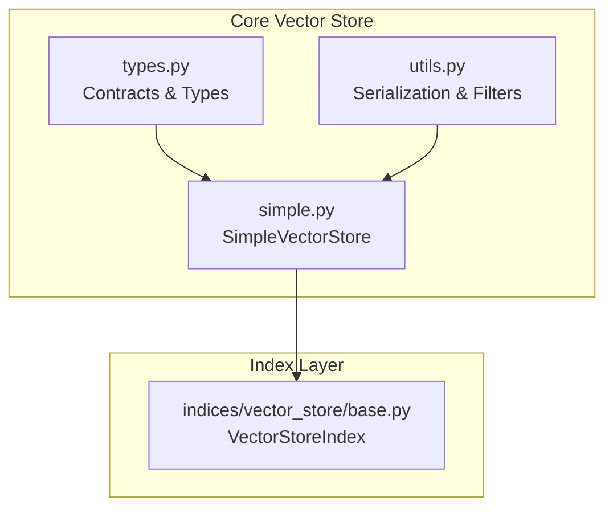
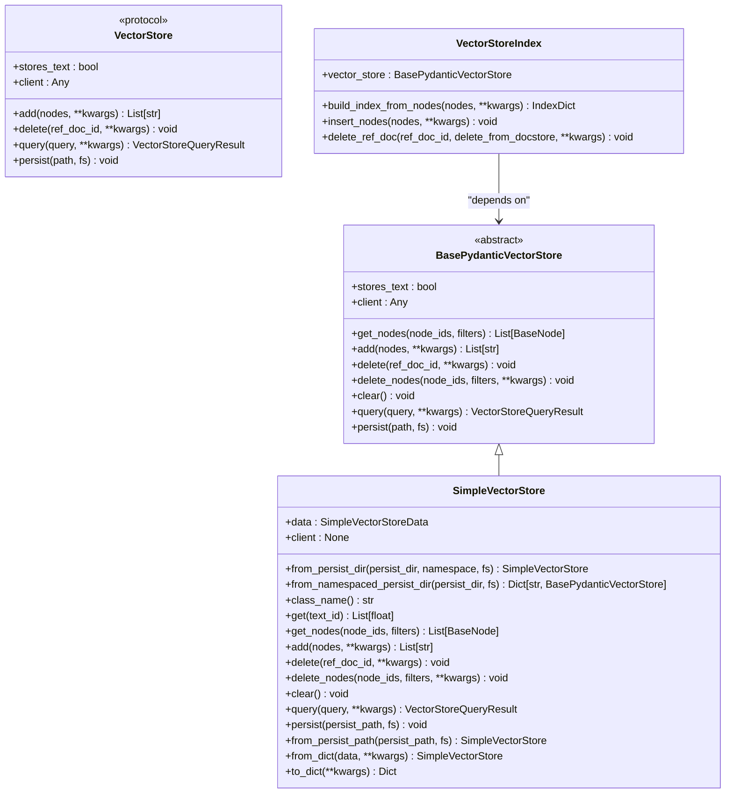
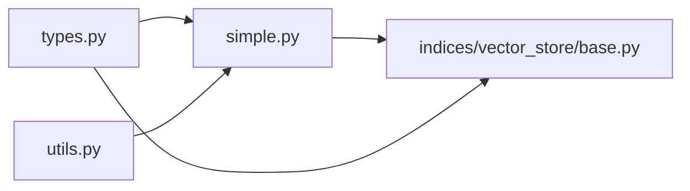
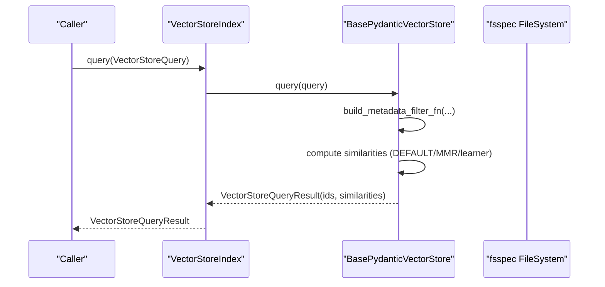

# Vector Store Implementation

<cite>
**Referenced Files in This Document**
- [types.py](file://llama-index-core/llama_index/core/vector_stores/types.py)
- [simple.py](file://llama-index-core/llama_index/core/vector_stores/simple.py)
- [utils.py](file://llama-index-core/llama_index/core/vector_stores/utils.py)
- [base.py](file://llama-index-core/llama_index/core/indices/vector_store/base.py)
- [__init__.py](file://llama-index-core/llama_index/core/vector_stores/__init__.py)
</cite>

## Table of Contents
1. [Introduction](#introduction)
2. [Project Structure](#project-structure)
3. [Core Components](#core-components)
4. [Architecture Overview](#architecture-overview)
5. [Detailed Component Analysis](#detailed-component-analysis)
6. [Dependency Analysis](#dependency-analysis)
7. [Performance Considerations](#performance-considerations)
8. [Troubleshooting Guide](#troubleshooting-guide)
9. [Conclusion](#conclusion)
10. [Appendices](#appendices)

## Introduction
This document explains the Vector Store Implementation in LlamaIndex with a focus on the BaseVectorStoreIndex class architecture, vector store interface contracts, and storage backend abstractions. It documents the VectorStore class hierarchy, including the SimpleVectorStore implementation, and outlines abstract methods for add, get, delete operations. It also covers vector store configuration, connection management, and data serialization patterns. Practical examples demonstrate how to implement custom vector stores, manage metadata storage, and handle vector dimensions. Finally, it provides selection criteria, performance characteristics, and integration patterns with different storage backends.

## Project Structure
The vector store implementation centers around three core modules:
- Vector store interface contracts and shared types
- Simple in-memory vector store implementation
- Utilities for metadata serialization and filtering
- Index layer that builds on top of a vector store

**Diagram sources**
- [types.py](file://llama-index-core/llama_index/core/vector_stores/types.py#L268-L439)
- [utils.py](file://llama-index-core/llama_index/core/vector_stores/utils.py#L1-L235)
- [simple.py](file://llama-index-core/llama_index/core/vector_stores/simple.py#L64-L355)
- [base.py](file://llama-index-core/llama_index/core/indices/vector_store/base.py#L36-L490)

**Section sources**
- [types.py](file://llama-index-core/llama_index/core/vector_stores/types.py#L1-L439)
- [simple.py](file://llama-index-core/llama_index/core/vector_stores/simple.py#L1-L355)
- [utils.py](file://llama-index-core/llama_index/core/vector_stores/utils.py#L1-L235)
- [base.py](file://llama-index-core/llama_index/core/indices/vector_store/base.py#L1-L490)
- [__init__.py](file://llama-index-core/llama_index/core/vector_stores/__init__.py#L1-L28)

## Core Components
- VectorStore protocol and BasePydanticVectorStore abstract class define the contract for vector stores, including add, delete, query, and persistence methods.
- SimpleVectorStore implements an in-memory vector store with JSON-backed persistence, metadata filtering, and query modes (default, MMR, learner-based).
- Utilities provide metadata serialization/deserialization and filter-building logic for metadata queries.
- VectorStoreIndex is the index layer that orchestrates embedding computation, batched insertion, and retrieval against a vector store.

Key responsibilities:
- VectorStore/ BasePydanticVectorStore: Define the interface for adding/deleting/querying vectors and optional persistence.
- SimpleVectorStore: Implements the interface with in-memory dictionaries and JSON persistence; handles metadata storage and filtering.
- VectorStoreIndex: Manages embedding computation, batched insertions, and deletion semantics across vector stores and document stores.

**Section sources**
- [types.py](file://llama-index-core/llama_index/core/vector_stores/types.py#L268-L439)
- [simple.py](file://llama-index-core/llama_index/core/vector_stores/simple.py#L64-L355)
- [utils.py](file://llama-index-core/llama_index/core/vector_stores/utils.py#L40-L176)
- [base.py](file://llama-index-core/llama_index/core/indices/vector_store/base.py#L36-L490)

## Architecture Overview
The architecture separates concerns between the index layer and the vector store abstraction. The index layer computes embeddings and coordinates batched inserts and deletes, while the vector store encapsulates storage and retrieval logic.

**Diagram sources**
- [types.py](file://llama-index-core/llama_index/core/vector_stores/types.py#L268-L439)
- [simple.py](file://llama-index-core/llama_index/core/vector_stores/simple.py#L64-L355)
- [base.py](file://llama-index-core/llama_index/core/indices/vector_store/base.py#L36-L490)

## Detailed Component Analysis

### Vector Store Interfaces and Contracts
- VectorStore protocol defines the minimal contract for vector stores, including synchronous and asynchronous variants for add, delete, query, and persistence.
- BasePydanticVectorStore extends the protocol with additional methods (e.g., get_nodes, delete_nodes, clear) and integrates with Pydantic for configuration.
- VectorStoreQuery, VectorStoreQueryResult, and related filter types define the query schema and metadata filtering capabilities.

Implementation highlights:
- Query modes include DEFAULT, MMR, and learner-based modes (SVM, Logistic Regression, Linear Regression).
- MetadataFilters support advanced operators (EQ, GT, LT, NE, GTE, LTE, IN, NIN, ANY, ALL, TEXT_MATCH, TEXT_MATCH_INSENSITIVE, CONTAINS, IS_EMPTY) combined via AND/OR/NOT.
- VectorStoreInfo and MetadataInfo describe supported metadata fields for auto-retriever integration.

**Section sources**
- [types.py](file://llama-index-core/llama_index/core/vector_stores/types.py#L268-L439)

### SimpleVectorStore Implementation
SimpleVectorStore is an in-memory vector store backed by a data container and JSON persistence. It implements:
- add: Stores embeddings, text_id to ref_doc_id mapping, and metadata per node.
- get: Retrieves a single embedding by text_id.
- delete and delete_nodes: Removes entries by ref_doc_id or filtered node_ids.
- query: Supports DEFAULT, MMR, and learner-based modes; applies metadata filters and node-id restrictions.
- persist/from_persist_dir/from_namespaced_persist_dir: Handles filesystem-backed persistence with optional fsspec abstraction.

Data model:
- SimpleVectorStoreData holds embedding_dict, text_id_to_ref_doc_id, and metadata_dict.
- Metadata serialization uses node_to_metadata_dict to capture node content and ref_doc_id for filtering.

Persistence:
- Uses DEFAULT_PERSIST_DIR and DEFAULT_PERSIST_FNAME with optional namespace separation.
- Supports loading from a specific path or scanning namespaces in a directory.

**Section sources**
- [simple.py](file://llama-index-core/llama_index/core/vector_stores/simple.py#L64-L355)
- [utils.py](file://llama-index-core/llama_index/core/vector_stores/utils.py#L40-L98)

### VectorStoreIndex (BaseVectorStoreIndex)
VectorStoreIndex orchestrates embedding computation and batched insertion into a vector store. Key behaviors:
- Embedding resolution and batching via embed_nodes and async_embed_nodes.
- Conditional storage: If the vector store does not store text or store_nodes_override is enabled, nodes are stored in the index struct and docstore; otherwise, only special node types (ImageNode, IndexNode) are stored in the docstore.
- Deletion semantics: Delegates to vector store delete/delete_nodes and optionally cleans up index struct and docstore.
- Retrieval: Exposes as_retriever to integrate with retrievers.

Integration points:
- Requires a BasePydanticVectorStore instance.
- Works with StorageContext and docstore to maintain consistency.

**Section sources**
- [base.py](file://llama-index-core/llama_index/core/indices/vector_store/base.py#L36-L490)

### Metadata Serialization and Filtering Utilities
Utilities provide:
- node_to_metadata_dict: Serializes node content into metadata, storing node JSON and ref_doc_id under standardized keys for filtering.
- metadata_dict_to_node: Deserializes metadata back into a node object.
- build_metadata_filter_fn: Builds a predicate function from MetadataFilters to prefilter node candidates during queries.

Operational notes:
- Ensures metadata is flat and typed appropriately for reliable filtering.
- Standardized keys (document_id, doc_id, ref_doc_id) enable cross-backend compatibility.

**Section sources**
- [utils.py](file://llama-index-core/llama_index/core/vector_stores/utils.py#L40-L176)

### Vector Store Selection Criteria and Integration Patterns
Selection criteria:
- Embedding-only vs. text-storing vector stores: Some integrations store text in the vector store; others require a separate docstore. VectorStoreIndex enforces that initialization requires stores_text to be true for certain workflows.
- Query modes: Choose DEFAULT for pure semantic search, MMR for diversity, and learner-based modes for specialized ranking.
- Metadata filtering: Ensure the vector store supports the desired operators and conditions.

Integration patterns:
- Use BasePydanticVectorStore for custom implementations to align with the index layer.
- For filesystem-backed persistence, leverage fsspec-compatible filesystems via from_persist_dir/from_namespaced_persist_dir.
- For hybrid search, configure alpha, sparse_top_k, and hybrid_top_k in VectorStoreQuery.

**Section sources**
- [types.py](file://llama-index-core/llama_index/core/vector_stores/types.py#L240-L266)
- [base.py](file://llama-index-core/llama_index/core/indices/vector_store/base.py#L87-L106)

## Dependency Analysis
The following diagram shows dependencies among core vector store components and the index layer.

**Diagram sources**
- [types.py](file://llama-index-core/llama_index/core/vector_stores/types.py#L1-L439)
- [simple.py](file://llama-index-core/llama_index/core/vector_stores/simple.py#L1-L355)
- [utils.py](file://llama-index-core/llama_index/core/vector_stores/utils.py#L1-L235)
- [base.py](file://llama-index-core/llama_index/core/indices/vector_store/base.py#L1-L490)

**Section sources**
- [types.py](file://llama-index-core/llama_index/core/vector_stores/types.py#L1-L439)
- [simple.py](file://llama-index-core/llama_index/core/vector_stores/simple.py#L1-L355)
- [utils.py](file://llama-index-core/llama_index/core/vector_stores/utils.py#L1-L235)
- [base.py](file://llama-index-core/llama_index/core/indices/vector_store/base.py#L1-L490)

## Performance Considerations
- Batched insertion: VectorStoreIndex uses batch sizes to reduce overhead during embedding computation and insertion.
- Query modes: DEFAULT is typically fastest; MMR adds recomputation cost; learner-based modes involve training overhead.
- Metadata filtering: Pre-filtering reduces candidate sets; ensure metadata is populated to avoid errors and enable filtering.
- Persistence: JSON persistence is straightforward but may not scale for very large datasets; consider backend-specific vector stores for production.

[No sources needed since this section provides general guidance]

## Troubleshooting Guide
Common issues and resolutions:
- Query-time metadata filtering errors: If a store was persisted without metadata, attempting to filter raises an error; rebuild the store with metadata enabled.
- Deleting nodes by ref_doc_id: Ensure ref_doc_id is set on nodes; otherwise, mapping to text_ids fails.
- Storing text vs. embeddings only: If stores_text is false, nodes must be stored in the docstore; otherwise, retrieval may fail.

**Section sources**
- [simple.py](file://llama-index-core/llama_index/core/vector_stores/simple.py#L250-L259)
- [simple.py](file://llama-index-core/llama_index/core/vector_stores/simple.py#L191-L212)
- [base.py](file://llama-index-core/llama_index/core/indices/vector_store/base.py#L93-L96)

## Conclusion
LlamaIndex’s vector store implementation cleanly separates the index layer from storage backends via well-defined contracts. SimpleVectorStore demonstrates a practical in-memory implementation with robust metadata handling and persistence. VectorStoreIndex coordinates embedding computation and batched operations, while utilities ensure consistent metadata serialization and filtering. For production deployments, choose vector stores aligned with your storage and query needs, and leverage the provided abstractions to implement custom backends seamlessly.

[No sources needed since this section summarizes without analyzing specific files]

## Appendices

### Practical Example: Implementing a Custom Vector Store
Steps:
- Implement BasePydanticVectorStore to define add, delete, delete_nodes, clear, query, and optional get_nodes.
- Manage vector dimensions by ensuring embeddings passed to add have consistent length.
- Serialize metadata using node_to_metadata_dict to support filtering.
- Integrate with VectorStoreIndex by exposing stores_text appropriately and handling batched operations efficiently.

Integration tips:
- Use VectorStoreQueryResult to return similarities and ids.
- Support async variants where feasible to align with VectorStoreIndex’s async workflows.

**Section sources**
- [types.py](file://llama-index-core/llama_index/core/vector_stores/types.py#L334-L439)
- [utils.py](file://llama-index-core/llama_index/core/vector_stores/utils.py#L40-L98)
- [base.py](file://llama-index-core/llama_index/core/indices/vector_store/base.py#L176-L284)

### Sequence: Query Flow in VectorStoreIndex

**Diagram sources**
- [base.py](file://llama-index-core/llama_index/core/indices/vector_store/base.py#L260-L284)
- [simple.py](file://llama-index-core/llama_index/core/vector_stores/simple.py#L244-L315)
- [utils.py](file://llama-index-core/llama_index/core/vector_stores/utils.py#L101-L175)