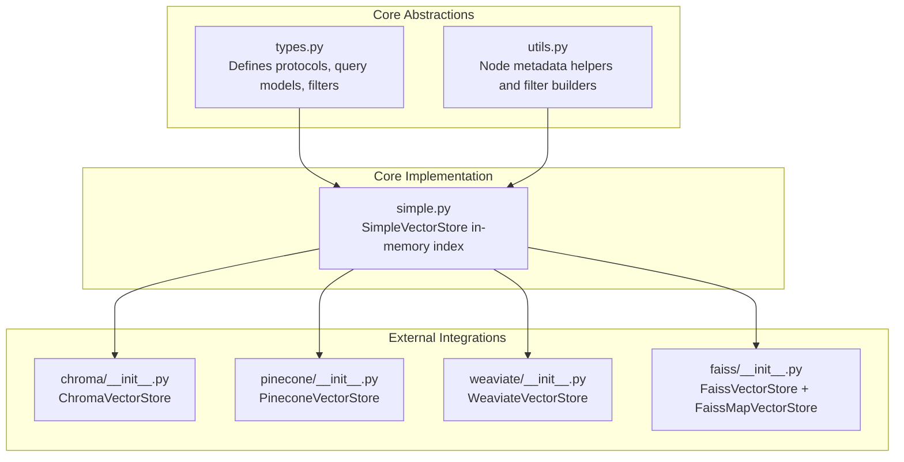
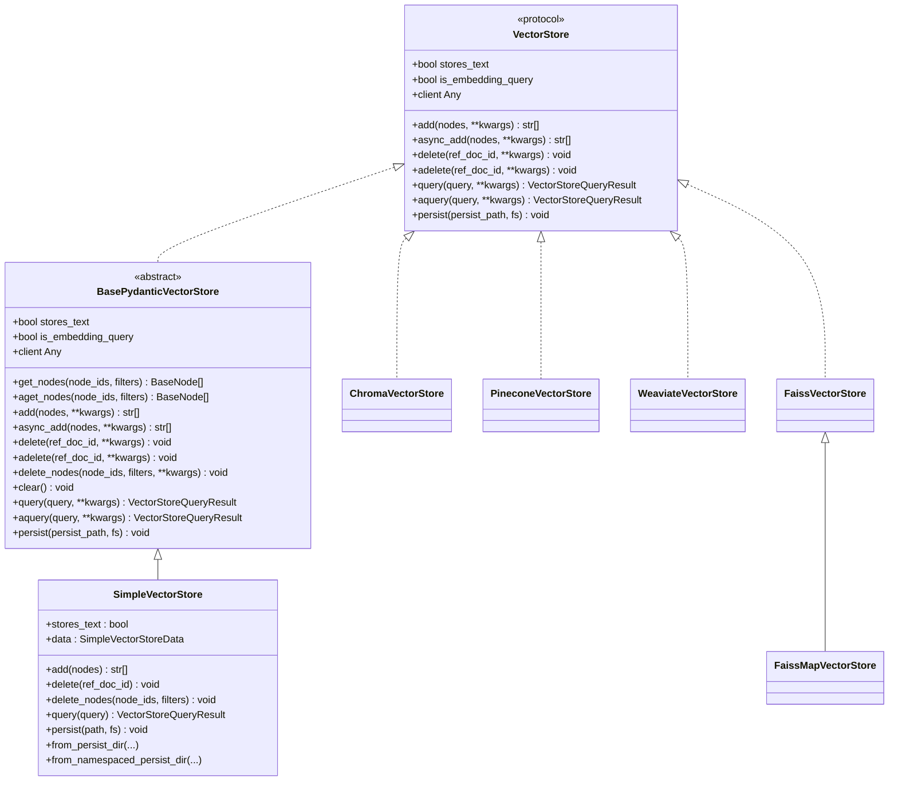
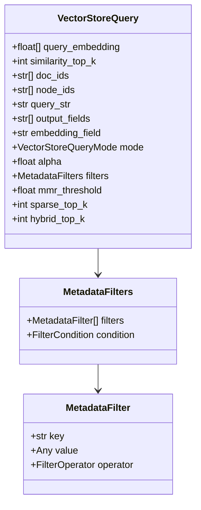
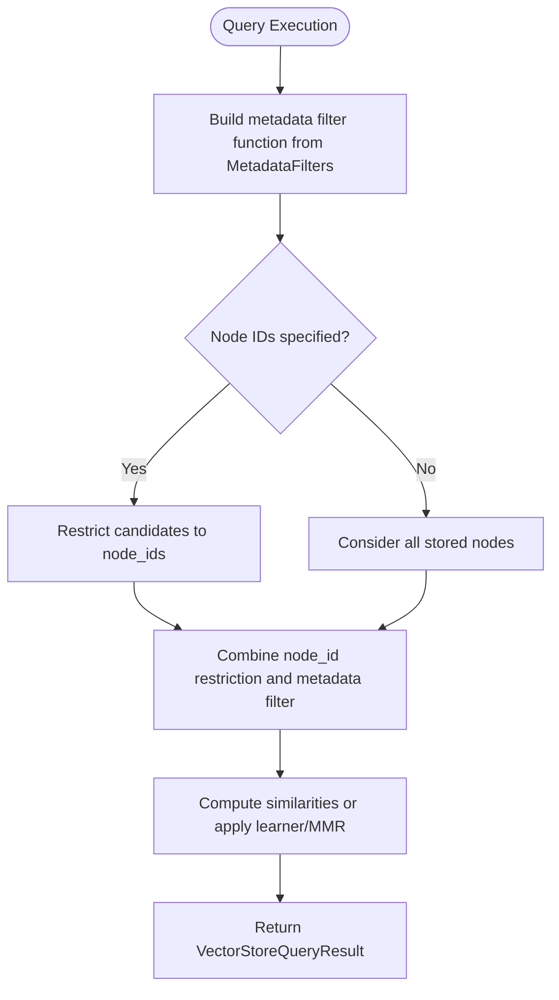
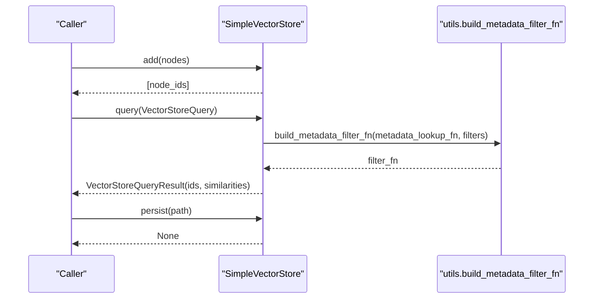
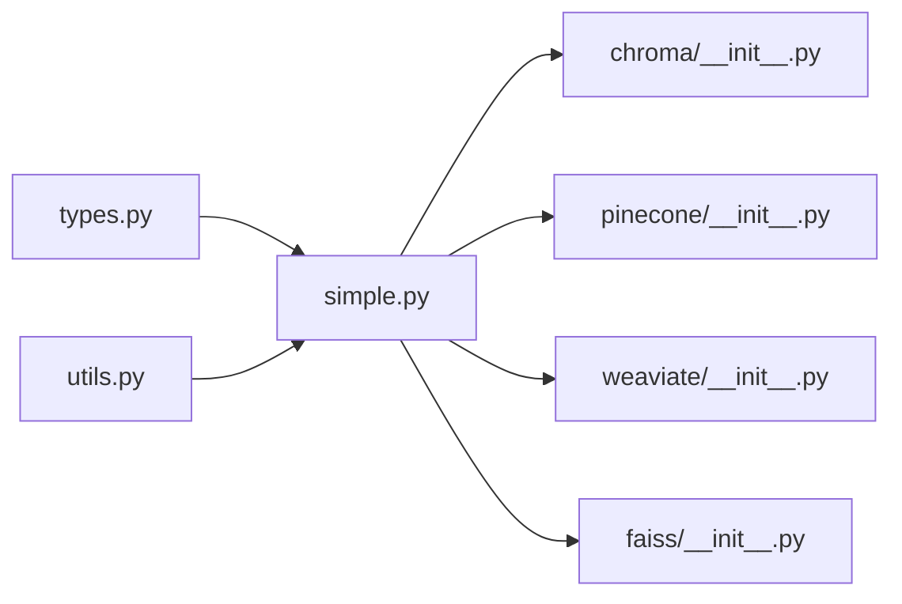

# Vector Store Indexes

<cite>
**Referenced Files in This Document**
- [types.py](file://llama-index-core/llama_index/core/vector_stores/types.py)
- [utils.py](file://llama-index-core/llama_index/core/vector_stores/utils.py)
- [simple.py](file://llama-index-core/llama_index/core/vector_stores/simple.py)
- [chroma/__init__.py](file://llama-index-integrations/vector_stores/llama-index-vector-stores-chroma/llama_index/vector_stores/chroma/__init__.py)
- [pinecone/__init__.py](file://llama-index-integrations/vector_stores/llama-index-vector-stores-pinecone/llama_index/vector_stores/pinecone/__init__.py)
- [weaviate/__init__.py](file://llama-index-integrations/vector_stores/llama-index-vector-stores-weaviate/llama_index/vector_stores/weaviate/__init__.py)
- [faiss/__init__.py](file://llama-index-integrations/vector_stores/llama-index-vector-stores-faiss/llama_index/vector_stores/faiss/__init__.py)
</cite>

## Table of Contents
1. [Introduction](#introduction)
2. [Project Structure](#project-structure)
3. [Core Components](#core-components)
4. [Architecture Overview](#architecture-overview)
5. [Detailed Component Analysis](#detailed-component-analysis)
6. [Dependency Analysis](#dependency-analysis)
7. [Performance Considerations](#performance-considerations)
8. [Troubleshooting Guide](#troubleshooting-guide)
9. [Conclusion](#conclusion)
10. [Appendices](#appendices)

## Introduction
This document explains Vector Store Indexes in LlamaIndex with a focus on the vector store architecture, embedding-based similarity search, and vector database integration patterns. It covers the foundational abstractions, the SimpleVectorStore implementation, and how external vector databases (Chroma, Pinecone, Weaviate, FAISS) integrate via a unified interface. Practical guidance is included for configuring vector stores, handling embeddings, optimizing search performance, selecting appropriate vector stores, applying metadata filtering, implementing hybrid search strategies, and scaling for production.

## Project Structure
The vector store system is composed of:
- Core abstractions and shared utilities under the core module
- A simple in-memory vector store implementation
- Integration packages for external vector databases

**Diagram sources**
- [types.py](file://llama-index-core/llama_index/core/vector_stores/types.py#L268-L439)
- [utils.py](file://llama-index-core/llama_index/core/vector_stores/utils.py#L1-L235)
- [simple.py](file://llama-index-core/llama_index/core/vector_stores/simple.py#L64-L355)
- [chroma/__init__.py](file://llama-index-integrations/vector_stores/llama-index-vector-stores-chroma/llama_index/vector_stores/chroma/__init__.py#L1-L4)
- [pinecone/__init__.py](file://llama-index-integrations/vector_stores/llama-index-vector-stores-pinecone/llama_index/vector_stores/pinecone/__init__.py#L1-L4)
- [weaviate/__init__.py](file://llama-index-integrations/vector_stores/llama-index-vector-stores-weaviate/llama_index/vector_stores/weaviate/__init__.py#L1-L12)
- [faiss/__init__.py](file://llama-index-integrations/vector_stores/llama-index-vector-stores-faiss/llama_index/vector_stores/faiss/__init__.py#L1-L5)

**Section sources**
- [types.py](file://llama-index-core/llama_index/core/vector_stores/types.py#L1-L439)
- [utils.py](file://llama-index-core/llama_index/core/vector_stores/utils.py#L1-L235)
- [simple.py](file://llama-index-core/llama_index/core/vector_stores/simple.py#L1-L355)
- [chroma/__init__.py](file://llama-index-integrations/vector_stores/llama-index-vector-stores-chroma/llama_index/vector_stores/chroma/__init__.py#L1-L4)
- [pinecone/__init__.py](file://llama-index-integrations/vector_stores/llama-index-vector-stores-pinecone/llama_index/vector_stores/pinecone/__init__.py#L1-L4)
- [weaviate/__init__.py](file://llama-index-integrations/vector_stores/llama-index-vector-stores-weaviate/llama_index/vector_stores/weaviate/__init__.py#L1-L12)
- [faiss/__init__.py](file://llama-index-integrations/vector_stores/llama-index-vector-stores-faiss/llama_index/vector_stores/faiss/__init__.py#L1-L5)

## Core Components
- VectorStore protocol and Pydantic base: Defines the contract for adding/deleting/querying vectors, plus persistence and async variants.
- Query models and filters: Provide structured query requests, modes (semantic, sparse, hybrid, MMR), and rich metadata filtering.
- Utilities: Convert nodes to/from metadata dictionaries, and build filter functions for prefiltering.
- SimpleVectorStore: An in-memory implementation demonstrating embedding storage, similarity search, and metadata filtering.

Key responsibilities:
- Embedding storage and retrieval
- Similarity search with configurable modes
- Metadata filtering and hybrid search support
- Persistence and namespacing for multi-tenant or multi-index scenarios

**Section sources**
- [types.py](file://llama-index-core/llama_index/core/vector_stores/types.py#L268-L439)
- [utils.py](file://llama-index-core/llama_index/core/vector_stores/utils.py#L40-L176)
- [simple.py](file://llama-index-core/llama_index/core/vector_stores/simple.py#L64-L355)

## Architecture Overview
The vector store architecture centers on a unified protocol that abstracts away the underlying vector database. Implementations plug into this protocol to provide storage, indexing, and retrieval capabilities.

**Diagram sources**
- [types.py](file://llama-index-core/llama_index/core/vector_stores/types.py#L268-L439)
- [simple.py](file://llama-index-core/llama_index/core/vector_stores/simple.py#L64-L355)
- [chroma/__init__.py](file://llama-index-integrations/vector_stores/llama-index-vector-stores-chroma/llama_index/vector_stores/chroma/__init__.py#L1-L4)
- [pinecone/__init__.py](file://llama-index-integrations/vector_stores/llama-index-vector-stores-pinecone/llama_index/vector_stores/pinecone/__init__.py#L1-L4)
- [weaviate/__init__.py](file://llama-index-integrations/vector_stores/llama-index-vector-stores-weaviate/llama_index/vector_stores/weaviate/__init__.py#L1-L12)
- [faiss/__init__.py](file://llama-index-integrations/vector_stores/llama-index-vector-stores-faiss/llama_index/vector_stores/faiss/__init__.py#L1-L5)

## Detailed Component Analysis

### Vector Store Abstractions and Query Model
- VectorStore and BasePydanticVectorStore define the interface for vector operations, including add, delete, query, and persistence.
- VectorStoreQuery encapsulates the query intent: embedding, similarity top-k, node/doc filters, hybrid parameters, and MMR controls.
- VectorStoreQueryMode supports semantic, sparse, hybrid, text search, and MMR modes.
- MetadataFilters and MetadataFilter provide rich filtering semantics across operators and conditions.

**Diagram sources**
- [types.py](file://llama-index-core/llama_index/core/vector_stores/types.py#L240-L267)
- [types.py](file://llama-index-core/llama_index/core/vector_stores/types.py#L94-L149)

**Section sources**
- [types.py](file://llama-index-core/llama_index/core/vector_stores/types.py#L45-L83)
- [types.py](file://llama-index-core/llama_index/core/vector_stores/types.py#L203-L267)
- [types.py](file://llama-index-core/llama_index/core/vector_stores/types.py#L94-L149)

### Node Metadata Serialization and Filtering
- node_to_metadata_dict serializes node content into metadata while preserving ref_doc_id for filtering and storing node type information.
- metadata_dict_to_node reconstructs nodes from persisted metadata.
- build_metadata_filter_fn constructs a predicate function from MetadataFilters to prefilter during queries.

**Diagram sources**
- [utils.py](file://llama-index-core/llama_index/core/vector_stores/utils.py#L101-L176)
- [simple.py](file://llama-index-core/llama_index/core/vector_stores/simple.py#L244-L315)

**Section sources**
- [utils.py](file://llama-index-core/llama_index/core/vector_stores/utils.py#L40-L98)
- [utils.py](file://llama-index-core/llama_index/core/vector_stores/utils.py#L101-L176)
- [simple.py](file://llama-index-core/llama_index/core/vector_stores/simple.py#L244-L315)

### SimpleVectorStore: In-Memory Index
- Stores embeddings, ref_doc_id mappings, and metadata in memory.
- Supports add, delete by ref_doc_id, delete by node filters, and query with multiple modes.
- Persists to JSON and supports namespaced persistence for multi-store setups.

**Diagram sources**
- [simple.py](file://llama-index-core/llama_index/core/vector_stores/simple.py#L174-L189)
- [simple.py](file://llama-index-core/llama_index/core/vector_stores/simple.py#L244-L315)
- [utils.py](file://llama-index-core/llama_index/core/vector_stores/utils.py#L101-L176)

**Section sources**
- [simple.py](file://llama-index-core/llama_index/core/vector_stores/simple.py#L64-L355)

### External Vector Store Integrations
- ChromaVectorStore: Integration exposed via chroma/__init__.py.
- PineconeVectorStore: Integration exposed via pinecone/__init__.py.
- WeaviateVectorStore: Integration exposed via weaviate/__init__.py.
- FaissVectorStore and FaissMapVectorStore: Integration exposed via faiss/__init__.py.

These integrations implement the VectorStore protocol to connect to their respective vector databases.

**Section sources**
- [chroma/__init__.py](file://llama-index-integrations/vector_stores/llama-index-vector-stores-chroma/llama_index/vector_stores/chroma/__init__.py#L1-L4)
- [pinecone/__init__.py](file://llama-index-integrations/vector_stores/llama-index-vector-stores-pinecone/llama_index/vector_stores/pinecone/__init__.py#L1-L4)
- [weaviate/__init__.py](file://llama-index-integrations/vector_stores/llama-index-vector-stores-weaviate/llama_index/vector_stores/weaviate/__init__.py#L1-L12)
- [faiss/__init__.py](file://llama-index-integrations/vector_stores/llama-index-vector-stores-faiss/llama_index/vector_stores/faiss/__init__.py#L1-L5)

## Dependency Analysis
- SimpleVectorStore depends on:
  - VectorStoreQuery and related enums for query semantics
  - get_top_k_embeddings utilities for similarity computation
  - node_to_metadata_dict and build_metadata_filter_fn for metadata handling
- External vector stores depend on their respective client libraries and implement the VectorStore protocol.

**Diagram sources**
- [types.py](file://llama-index-core/llama_index/core/vector_stores/types.py#L268-L439)
- [utils.py](file://llama-index-core/llama_index/core/vector_stores/utils.py#L1-L235)
- [simple.py](file://llama-index-core/llama_index/core/vector_stores/simple.py#L1-L355)
- [chroma/__init__.py](file://llama-index-integrations/vector_stores/llama-index-vector-stores-chroma/llama_index/vector_stores/chroma/__init__.py#L1-L4)
- [pinecone/__init__.py](file://llama-index-integrations/vector_stores/llama-index-vector-stores-pinecone/llama_index/vector_stores/pinecone/__init__.py#L1-L4)
- [weaviate/__init__.py](file://llama-index-integrations/vector_stores/llama-index-vector-stores-weaviate/llama_index/vector_stores/weaviate/__init__.py#L1-L12)
- [faiss/__init__.py](file://llama-index-integrations/vector_stores/llama-index-vector-stores-faiss/llama_index/vector_stores/faiss/__init__.py#L1-L5)

**Section sources**
- [types.py](file://llama-index-core/llama_index/core/vector_stores/types.py#L1-L439)
- [utils.py](file://llama-index-core/llama_index/core/vector_stores/utils.py#L1-L235)
- [simple.py](file://llama-index-core/llama_index/core/vector_stores/simple.py#L1-L355)

## Performance Considerations
- Choose vector store based on scale and features:
  - SimpleVectorStore is suitable for small datasets and local development.
  - Cloud-hosted vector databases (e.g., Chroma server, Pinecone, Weaviate, FAISS) offer scalability and advanced indexing.
- Optimize embeddings:
  - Use appropriate embedding dimensions and normalization.
  - Pre-filter via metadata to reduce candidate sets.
- Query modes:
  - DEFAULT for pure semantic search.
  - MMR for diversity.
  - Hybrid modes when combining lexical and semantic signals.
- Persistence and namespaces:
  - Use namespaced persistence to manage multiple indexes efficiently.

[No sources needed since this section provides general guidance]

## Troubleshooting Guide
- Metadata filtering errors:
  - If a store was persisted without metadata, filtering is disabled until rebuilt with metadata enabled.
- Node retrieval:
  - SimpleVectorStore does not store node text by default; ensure stores_text is configured appropriately or persist node content separately.
- Async operations:
  - Some vector stores may fall back to synchronous implementations; check protocol support per backend.

**Section sources**
- [simple.py](file://llama-index-core/llama_index/core/vector_stores/simple.py#L250-L259)
- [types.py](file://llama-index-core/llama_index/core/vector_stores/types.py#L334-L439)

## Conclusion
LlamaIndex’s vector store architecture provides a robust, extensible abstraction for embedding-based similarity search. The core protocol enables seamless integration with diverse vector databases, while utilities and query models support advanced features like metadata filtering, hybrid search, and MMR. For production, select a scalable vector database backend, configure embeddings thoughtfully, and leverage metadata filtering and hybrid strategies to improve accuracy and performance.

[No sources needed since this section summarizes without analyzing specific files]

## Appendices

### Practical Configuration Examples (paths only)
- Configure ChromaVectorStore:
  - Import path: [chroma/__init__.py](file://llama-index-integrations/vector_stores/llama-index-vector-stores-chroma/llama_index/vector_stores/chroma/__init__.py#L1-L4)
- Configure PineconeVectorStore:
  - Import path: [pinecone/__init__.py](file://llama-index-integrations/vector_stores/llama-index-vector-stores-pinecone/llama_index/vector_stores/pinecone/__init__.py#L1-L4)
- Configure WeaviateVectorStore:
  - Import path: [weaviate/__init__.py](file://llama-index-integrations/vector_stores/llama-index-vector-stores-weaviate/llama_index/vector_stores/weaviate/__init__.py#L1-L12)
- Configure FAISSVectorStore:
  - Import path: [faiss/__init__.py](file://llama-index-integrations/vector_stores/llama-index-vector-stores-faiss/llama_index/vector_stores/faiss/__init__.py#L1-L5)

### Index Construction from Nodes
- Add nodes with embeddings to a vector store:
  - Use the add method on the chosen VectorStore implementation.
  - Reference: [types.py](file://llama-index-core/llama_index/core/vector_stores/types.py#L280-L312), [simple.py](file://llama-index-core/llama_index/core/vector_stores/simple.py#L174-L189)

### Metadata Filtering Patterns
- Define filters using MetadataFilters and operators:
  - Reference: [types.py](file://llama-index-core/llama_index/core/vector_stores/types.py#L94-L149), [types.py](file://llama-index-core/llama_index/core/vector_stores/types.py#L63-L83)
- Build filter predicates:
  - Reference: [utils.py](file://llama-index-core/llama_index/core/vector_stores/utils.py#L101-L176)

### Hybrid Search Strategies
- Set VectorStoreQueryMode to hybrid and tune alpha:
  - Reference: [types.py](file://llama-index-core/llama_index/core/vector_stores/types.py#L45-L52), [types.py](file://llama-index-core/llama_index/core/vector_stores/types.py#L253-L254)

### Scaling Considerations
- Use cloud vector databases for horizontal scaling and advanced features.
- Employ namespaced persistence and metadata filtering to manage large corpora efficiently.
- Reference: [simple.py](file://llama-index-core/llama_index/core/vector_stores/simple.py#L108-L145)