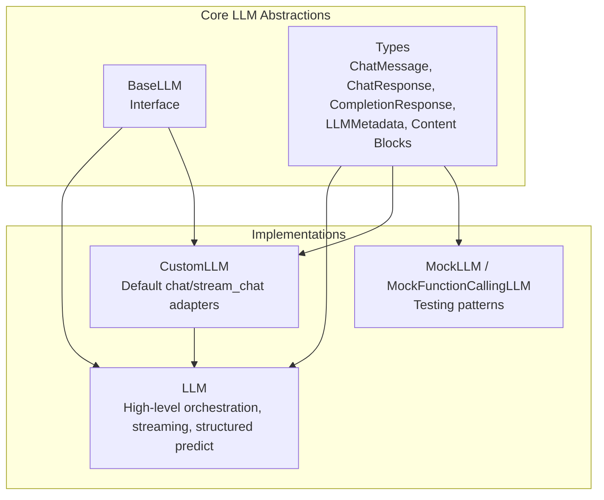
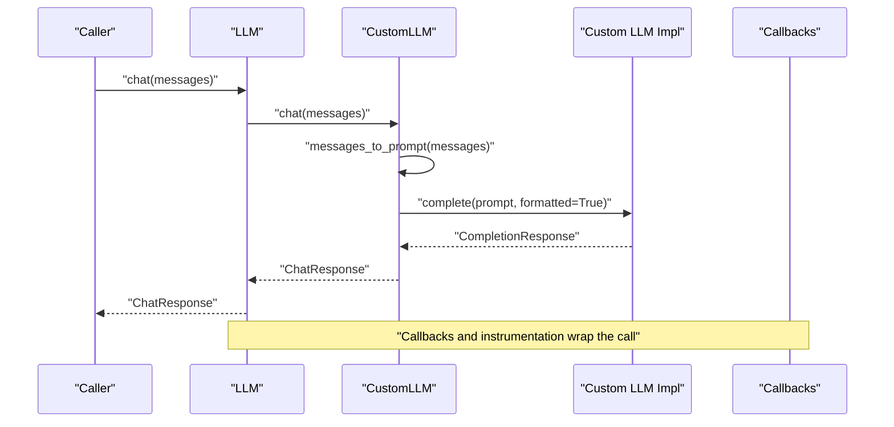
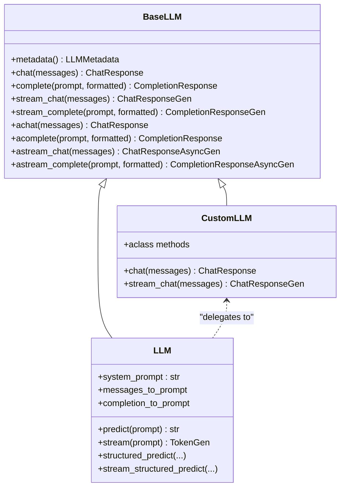

# Custom LLM Development

<cite>
**Referenced Files in This Document**
- [llm.py](file://llama-index-core/llama_index/core/llms/llm.py)
- [custom.py](file://llama-index-core/llama_index/core/llms/custom.py)
- [base.py](file://llama-index-core/llama_index/core/base/llms/base.py)
- [types.py](file://llama-index-core/llama_index/core/base/llms/types.py)
- [callbacks.py](file://llama-index-core/llama_index/core/llms/callbacks.py)
- [mock.py](file://llama-index-core/llama_index/core/llms/mock.py)
- [app.py](file://examples/fastapi_rag_ollama/app.py)
</cite>

## Table of Contents
1. [Introduction](#introduction)
2. [Project Structure](#project-structure)
3. [Core Components](#core-components)
4. [Architecture Overview](#architecture-overview)
5. [Detailed Component Analysis](#detailed-component-analysis)
6. [Dependency Analysis](#dependency-analysis)
7. [Performance Considerations](#performance-considerations)
8. [Troubleshooting Guide](#troubleshooting-guide)
9. [Conclusion](#conclusion)
10. [Appendices](#appendices)

## Introduction
This document explains how to develop custom LLM implementations in LlamaIndex by extending the BaseLLM abstraction. It covers the required and optional method implementations, integration with callbacks and instrumentation, configuration management, and practical scenarios such as internal APIs, edge computing, and domain-specific models. It also provides guidance on testing, performance optimization, and maintaining compatibility with LlamaIndex’s ecosystem.

## Project Structure
LlamaIndex organizes LLM-related code under the core LLM modules:
- Base interface and types define the contract and shared data structures.
- The LLM class implements high-level orchestration, streaming, structured prediction, and integration with callbacks and instrumentation.
- The CustomLLM helper class provides default implementations for chat/stream_chat and async variants, delegating core work to complete/stream_complete.
- Mock implementations demonstrate patterns for testing and function-calling LLMs.

**Diagram sources**
- [base.py](file://llama-index-core/llama_index/core/base/llms/base.py#L25-L292)
- [types.py](file://llama-index-core/llama_index/core/base/llms/types.py#L39-L747)
- [custom.py](file://llama-index-core/llama_index/core/llms/custom.py#L22-L92)
- [llm.py](file://llama-index-core/llama_index/core/llms/llm.py#L163-L931)
- [mock.py](file://llama-index-core/llama_index/core/llms/mock.py#L57-L504)

**Section sources**
- [base.py](file://llama-index-core/llama_index/core/base/llms/base.py#L25-L292)
- [types.py](file://llama-index-core/llama_index/core/base/llms/types.py#L39-L747)
- [custom.py](file://llama-index-core/llama_index/core/llms/custom.py#L22-L92)
- [llm.py](file://llama-index-core/llama_index/core/llms/llm.py#L163-L931)
- [mock.py](file://llama-index-core/llama_index/core/llms/mock.py#L57-L504)

## Core Components
- BaseLLM defines the minimal interface: metadata, chat, complete, stream_chat, stream_complete, plus async variants. Implementers must fulfill these methods.
- LLM adds higher-level features: prompt/message formatting, system prompt injection, structured prediction, streaming token conversion, and instrumentation spans.
- CustomLLM provides default adapters for chat/stream_chat that delegate to complete/stream_complete and apply callbacks, reducing boilerplate for custom LLM authors.
- Types define standardized message/response models, content blocks (text, images, audio, video, documents, citations, tool calls), and metadata.

Key responsibilities:
- Implementers focus on complete/stream_complete and metadata.
- LLM handles orchestration, formatting, and streaming token conversion.
- CustomLLM bridges chat and completion worlds for convenience.

**Section sources**
- [base.py](file://llama-index-core/llama_index/core/base/llms/base.py#L25-L292)
- [llm.py](file://llama-index-core/llama_index/core/llms/llm.py#L163-L931)
- [custom.py](file://llama-index-core/llama_index/core/llms/custom.py#L22-L92)
- [types.py](file://llama-index-core/llama_index/core/base/llms/types.py#L39-L747)

## Architecture Overview
The LlamaIndex LLM stack integrates callbacks, instrumentation, and configuration to provide a cohesive developer experience. The following sequence illustrates a typical chat call flow:

**Diagram sources**
- [llm.py](file://llama-index-core/llama_index/core/llms/llm.py#L588-L631)
- [custom.py](file://llama-index-core/llama_index/core/llms/custom.py#L33-L49)
- [callbacks.py](file://llama-index-core/llama_index/core/llms/callbacks.py#L39-L285)

## Detailed Component Analysis

### BaseLLM Interface
BaseLLM defines the core contract:
- metadata: LLMMetadata describing capabilities and limits.
- chat/messages_to_prompt: Chat endpoint for conversational models.
- complete/completion_to_prompt: Completion endpoint for text-only models.
- stream_chat/stream_complete: Streaming variants for both modes.
- Async methods: achat, acomplete, astream_chat, astream_complete.

Implementation guidance:
- For chat models, implement chat and stream_chat; for text models, implement complete and stream_complete.
- Provide accurate LLMMetadata (context window, output tokens, is_chat_model, is_function_calling_model, model_name, system_role).

**Section sources**
- [base.py](file://llama-index-core/llama_index/core/base/llms/base.py#L25-L292)
- [types.py](file://llama-index-core/llama_index/core/base/llms/types.py#L702-L747)

### LLM Orchestration Layer
LLM builds on BaseLLM to:
- Manage system_prompt and query_wrapper_prompt.
- Convert prompts/messages via messages_to_prompt/completion_to_prompt.
- Support structured prediction and streaming token conversion.
- Emit instrumentation spans and dispatch events.
- Provide sync/async predict/stream and structured predict variants.

Key helpers:
- Token streaming converters: stream_*_response_to_tokens and async variants.
- Structured prediction programs and streaming variants.

Integration touchpoints:
- Callbacks: llm_chat_callback and llm_completion_callback wrap chat/completion calls.
- Instrumentation: dispatcher.span decorates predict/structured predict methods.

**Section sources**
- [llm.py](file://llama-index-core/llama_index/core/llms/llm.py#L163-L931)
- [callbacks.py](file://llama-index-core/llama_index/core/llms/callbacks.py#L39-L546)

### CustomLLM Adapter
CustomLLM simplifies custom LLM development by:
- Implementing chat/stream_chat by converting messages to prompt and delegating to complete/stream_complete.
- Applying llm_chat_callback to all chat methods.
- Providing async wrappers that convert generators to async generators.
- Requiring subclasses to implement: __init__, _complete/_stream_complete, and metadata.

Recommended pattern:
- Subclass CustomLLM and implement:
  - complete(prompt, formatted, **kwargs) -> CompletionResponse
  - stream_complete(prompt, formatted, **kwargs) -> CompletionResponseGen
  - metadata property -> LLMMetadata
- Optionally override messages_to_prompt/completion_to_prompt if you need custom formatting.

**Section sources**
- [custom.py](file://llama-index-core/llama_index/core/llms/custom.py#L22-L92)

### Types and Content Blocks
Standardized types ensure interoperability:
- ChatMessage: role, blocks, additional_kwargs.
- Content blocks: TextBlock, ImageBlock, AudioBlock, VideoBlock, DocumentBlock, CachePoint, CitableBlock, CitationBlock, ThinkingBlock, ToolCallBlock.
- Responses: ChatResponse, CompletionResponse with delta/logprobs/raw.
- LLMMetadata: context_window, num_output, is_chat_model, is_function_calling_model, model_name, system_role.

Usage tips:
- Use blocks for multimodal inputs and advanced features.
- Populate additional_kwargs for tool calls, citations, and custom metadata.

**Section sources**
- [types.py](file://llama-index-core/llama_index/core/base/llms/types.py#L39-L747)

### Callbacks and Instrumentation
Callbacks and instrumentation provide:
- Event lifecycle: start, progress, end, and exception events for chat and completion.
- Payload capture: messages, prompt, response, serialized model, additional kwargs.
- Span decoration for tracing.

Patterns:
- Wrap chat/completion methods with llm_chat_callback and llm_completion_callback.
- Use dispatcher.span for higher-level operations like structured predict.

**Section sources**
- [callbacks.py](file://llama-index-core/llama_index/core/llms/callbacks.py#L39-L546)
- [llm.py](file://llama-index-core/llama_index/core/llms/llm.py#L306-L584)

### Testing Patterns with Mock Implementations
MockLLM demonstrates:
- Minimal complete/stream_complete implementations for testing.
- Streaming behavior and token limits.
- Memory retention of last chat messages for verification.

MockFunctionCallingLLM demonstrates:
- Function-calling patterns with ToolCallBlock extraction and ToolSelection parsing.
- Custom response generation and tool call accumulation.

These are excellent references for validating custom LLM behavior without external dependencies.

**Section sources**
- [mock.py](file://llama-index-core/llama_index/core/llms/mock.py#L57-L504)

### Example Integration: Local LLM via Ollama
The FastAPI example shows how to configure a local LLM (Ollama) and embedder, then serve queries through a simple API. This illustrates configuration management and integration with LlamaIndex settings.

**Section sources**
- [app.py](file://examples/fastapi_rag_ollama/app.py#L1-L30)

## Dependency Analysis
Relationships among core components:

**Diagram sources**
- [base.py](file://llama-index-core/llama_index/core/base/llms/base.py#L25-L292)
- [llm.py](file://llama-index-core/llama_index/core/llms/llm.py#L163-L931)
- [custom.py](file://llama-index-core/llama_index/core/llms/custom.py#L22-L92)

**Section sources**
- [base.py](file://llama-index-core/llama_index/core/base/llms/base.py#L25-L292)
- [llm.py](file://llama-index-core/llama_index/core/llms/llm.py#L163-L931)
- [custom.py](file://llama-index-core/llama_index/core/llms/custom.py#L22-L92)

## Performance Considerations
- Minimize unnecessary conversions: keep messages_to_prompt/simple prompt formatting efficient.
- Prefer streaming for long responses to reduce latency and memory pressure.
- Use LLMMetadata to inform token budgeting and chunking strategies.
- Avoid heavy computation inside callbacks; keep them lightweight for tracing.
- For edge deployments, cap max_tokens and tune context_window to match device constraints.

[No sources needed since this section provides general guidance]

## Troubleshooting Guide
Common issues and remedies:
- Missing messages_to_prompt/completion_to_prompt: LLM sets defaults, but providing explicit functions avoids ambiguity.
- Streaming not emitting deltas: Ensure your stream_* methods yield CompletionResponse/ChatResponse with delta populated.
- Function calling mismatch: Verify ToolCallBlock parsing and ToolSelection construction align with your model’s output.
- Callback/event anomalies: Confirm llm_chat_callback/llm_completion_callback wraps your methods and that exceptions are re-raised after event emission.

**Section sources**
- [llm.py](file://llama-index-core/llama_index/core/llms/llm.py#L210-L230)
- [callbacks.py](file://llama-index-core/llama_index/core/llms/callbacks.py#L39-L546)
- [mock.py](file://llama-index-core/llama_index/core/llms/mock.py#L473-L503)

## Conclusion
By extending BaseLLM (or CustomLLM), you can integrate proprietary or custom language models into LlamaIndex while preserving compatibility with streaming, structured prediction, callbacks, and instrumentation. Focus on implementing complete/stream_complete and metadata, leverage CustomLLM for chat adapters, and adopt the testing patterns from MockLLM to validate behavior. Align LLMMetadata with your model’s capabilities and constraints, and use callbacks/instrumentation to monitor and optimize performance.

[No sources needed since this section summarizes without analyzing specific files]

## Appendices

### Required Methods to Implement
- For chat models: chat, stream_chat, and optionally achat, astream_chat.
- For text models: complete, stream_complete, and optionally acomplete, astream_complete.
- Always implement metadata.

**Section sources**
- [base.py](file://llama-index-core/llama_index/core/base/llms/base.py#L70-L292)

### Optional Enhancements
- Custom prompt transformers: messages_to_prompt, completion_to_prompt.
- Structured prediction: rely on LLM’s structured_predict family.
- Token counting and cost estimation: expose via metadata and/or additional_kwargs in responses.

**Section sources**
- [llm.py](file://llama-index-core/llama_index/core/llms/llm.py#L181-L223)
- [types.py](file://llama-index-core/llama_index/core/base/llms/types.py#L702-L747)

### Example Scenarios
- Internal API LLM: Implement complete/stream_complete to call your internal inference service; set is_chat_model=False; provide accurate token budgets.
- Edge Computing Model: Set conservative context_window and num_output; implement streaming to reduce latency.
- Specialized Domain Model: Provide domain-aware messages_to_prompt; set system_role to match provider expectations; include citations via CitationBlock if supported.

[No sources needed since this section provides general guidance]