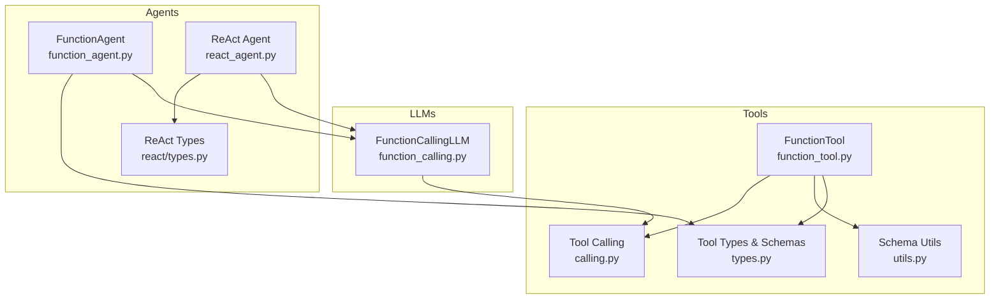
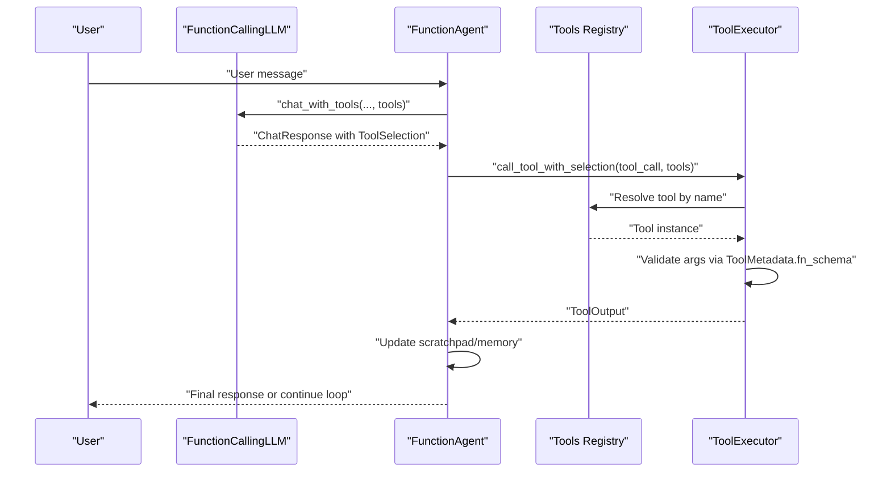
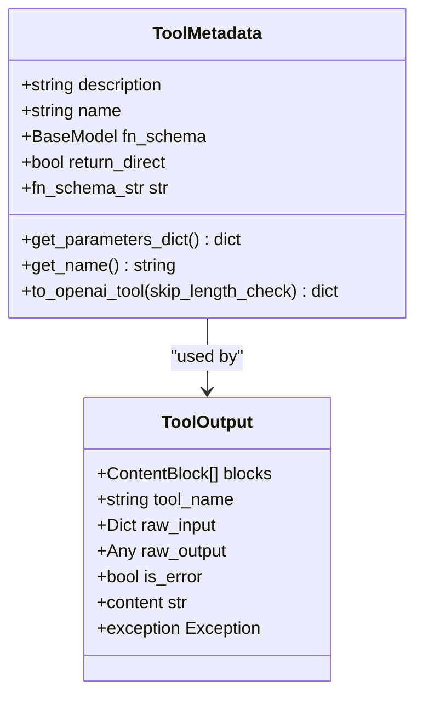
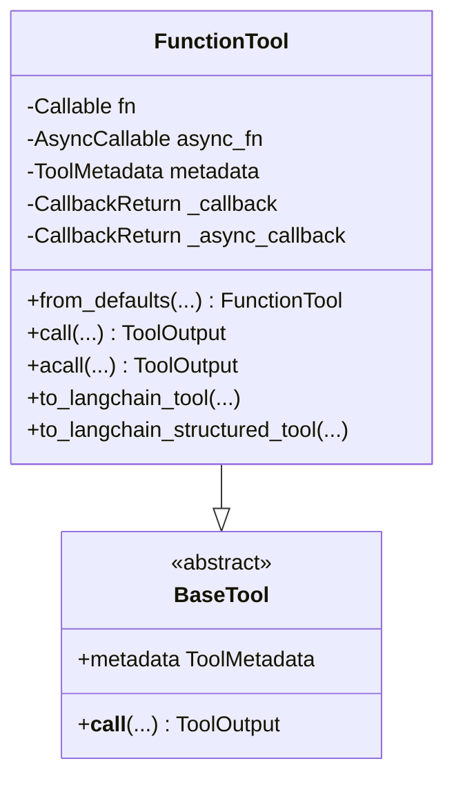
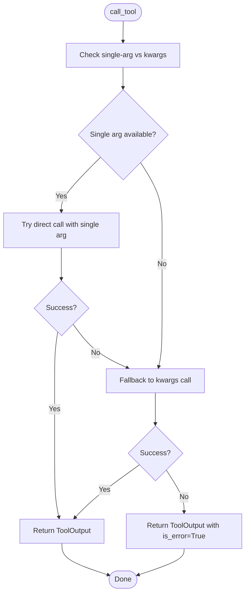
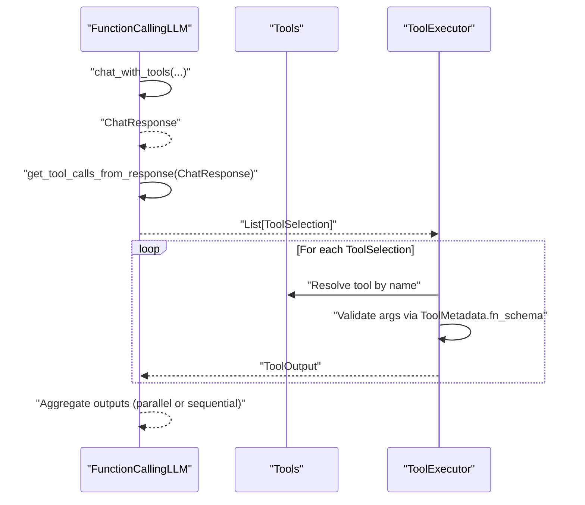
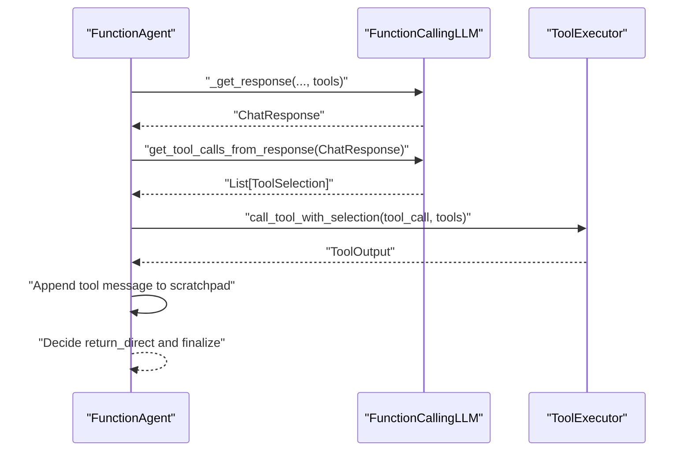
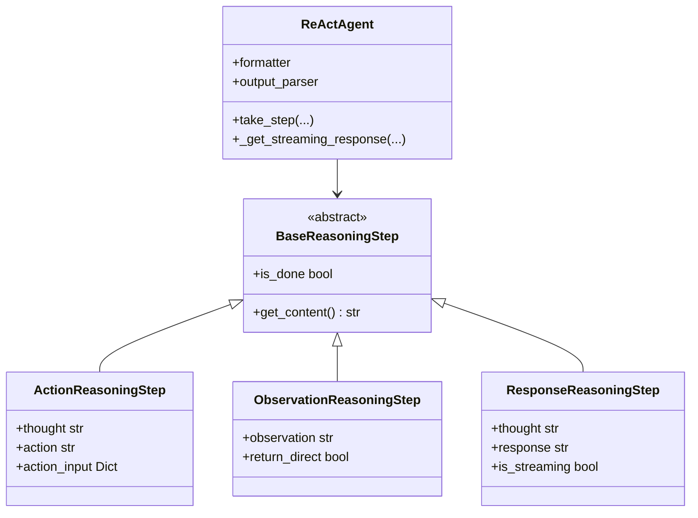
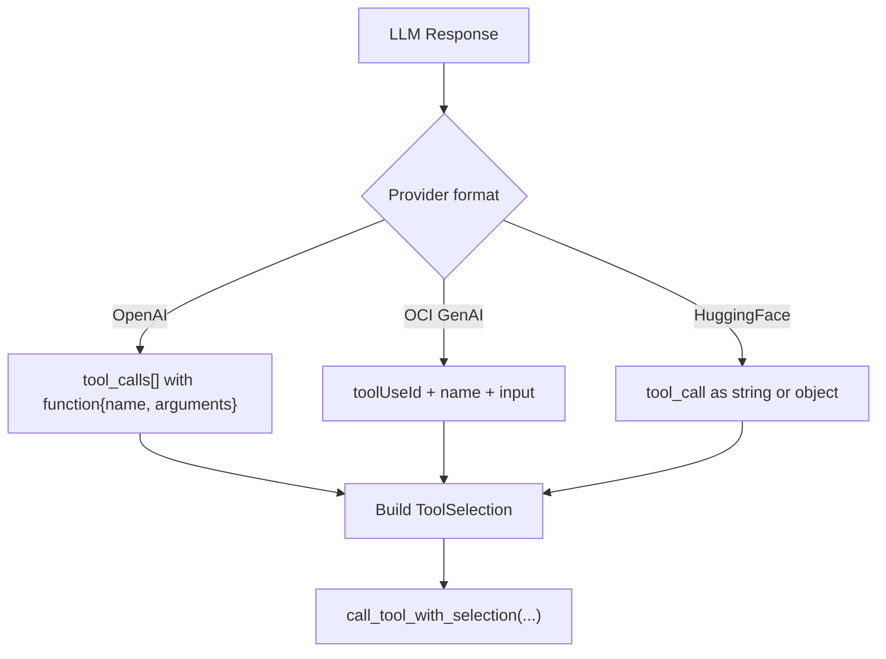
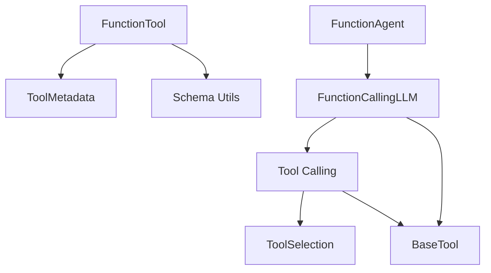

# Function Calling and Tool Integration

<cite>
**Referenced Files in This Document**
- [function_tool.py](file://llama-index-core/llama_index/core/tools/function_tool.py)
- [types.py](file://llama-index-core/llama_index/core/tools/types.py)
- [calling.py](file://llama-index-core/llama_index/core/tools/calling.py)
- [utils.py](file://llama-index-core/llama_index/core/tools/utils.py)
- [function_calling.py](file://llama-index-core/llama_index/core/llms/function_calling.py)
- [function_agent.py](file://llama-index-core/llama_index/core/agent/workflow/function_agent.py)
- [react_agent.py](file://llama-index-core/llama_index/core/agent/workflow/react_agent.py)
- [types.py](file://llama-index-core/llama_index/core/agent/react/types.py)
- [test_function_calling.py](file://llama-index-core/tests/llms/test_function_calling.py)
- [test_function_call.py](file://llama-index-core/tests/agent/workflow/test_function_call.py)
- [base.py](file://llama-index-integrations/llms/llama-index-llms-huggingface-api/llama_index/llms/huggingface_api/base.py)
- [base.py](file://llama-index-integrations/llms/llama-index-llms-oci-genai/llama_index/llms/oci_genai/base.py)
- [utils.py](file://llama-index-integrations/llms/llama-index-llms-oci-data-science/llama_index/llms/oci_data_science/utils.py)
</cite>

## Table of Contents
1. [Introduction](#introduction)
2. [Project Structure](#project-structure)
3. [Core Components](#core-components)
4. [Architecture Overview](#architecture-overview)
5. [Detailed Component Analysis](#detailed-component-analysis)
6. [Dependency Analysis](#dependency-analysis)
7. [Performance Considerations](#performance-considerations)
8. [Troubleshooting Guide](#troubleshooting-guide)
9. [Conclusion](#conclusion)
10. [Appendices](#appendices)

## Introduction
This document explains how LlamaIndex enables function calling and tool integration across LLMs and agents. It covers the ToolSelection model, function schema generation, tool execution workflows, and integration with ReAct and function-calling agents. It also documents both JSON schema and OpenAI-style function tool formats, error handling, parameter validation, response formatting, best practices, security considerations, and performance optimization.

## Project Structure
The function calling and tool integration capability spans several modules:
- Tools: tool definitions, schemas, execution, and adapters
- LLMs: function calling interface and orchestration
- Agents: workflow-based agents that consume tool outputs and drive conversations
- Tests: verification of tool selection, execution, and error handling

**Diagram sources**
- [function_tool.py](file://llama-index-core/llama_index/core/tools/function_tool.py#L67-L449)
- [types.py](file://llama-index-core/llama_index/core/tools/types.py#L17-L280)
- [utils.py](file://llama-index-core/llama_index/core/tools/utils.py#L21-L109)
- [calling.py](file://llama-index-core/llama_index/core/tools/calling.py#L10-L107)
- [function_calling.py](file://llama-index-core/llama_index/core/llms/function_calling.py#L24-L347)
- [function_agent.py](file://llama-index-core/llama_index/core/agent/workflow/function_agent.py#L18-L196)
- [react_agent.py](file://llama-index-core/llama_index/core/agent/workflow/react_agent.py#L123-L153)
- [types.py](file://llama-index-core/llama_index/core/agent/react/types.py#L9-L76)

**Section sources**
- [function_tool.py](file://llama-index-core/llama_index/core/tools/function_tool.py#L1-L449)
- [types.py](file://llama-index-core/llama_index/core/tools/types.py#L1-L280)
- [utils.py](file://llama-index-core/llama_index/core/tools/utils.py#L1-L109)
- [calling.py](file://llama-index-core/llama_index/core/tools/calling.py#L1-L107)
- [function_calling.py](file://llama-index-core/llama_index/core/llms/function_calling.py#L1-L347)
- [function_agent.py](file://llama-index-core/llama_index/core/agent/workflow/function_agent.py#L1-L196)
- [react_agent.py](file://llama-index-core/llama_index/core/agent/workflow/react_agent.py#L1-L153)
- [types.py](file://llama-index-core/llama_index/core/agent/react/types.py#L1-L76)

## Core Components
- ToolMetadata and ToolOutput define the function schema and standardized tool output representation.
- FunctionTool wraps arbitrary functions into callable tools with automatic schema inference and optional callbacks.
- Tool calling utilities provide synchronous and asynchronous execution with robust error handling.
- FunctionCallingLLM defines the interface for LLMs that support function/tool calling, including streaming and parallel tool invocation.
- FunctionAgent orchestrates LLM-tool interactions with scratchpad and memory integration.
- ReAct agent integrates reasoning steps and tool use into a structured thought-action-observation loop.

**Section sources**
- [types.py](file://llama-index-core/llama_index/core/tools/types.py#L17-L280)
- [function_tool.py](file://llama-index-core/llama_index/core/tools/function_tool.py#L67-L449)
- [calling.py](file://llama-index-core/llama_index/core/tools/calling.py#L10-L107)
- [function_calling.py](file://llama-index-core/llama_index/core/llms/function_calling.py#L24-L347)
- [function_agent.py](file://llama-index-core/llama_index/core/agent/workflow/function_agent.py#L18-L196)
- [react_agent.py](file://llama-index-core/llama_index/core/agent/workflow/react_agent.py#L123-L153)

## Architecture Overview
The end-to-end function calling pipeline:
1. LLM generates ToolSelection(s) indicating which tools to call with what arguments.
2. Tool selection is resolved to a concrete tool by name.
3. Tool is invoked with validated parameters; output is normalized to ToolOutput.
4. Agent consumes tool outputs to update memory/scratchpad and decide next steps.

**Diagram sources**
- [function_calling.py](file://llama-index-core/llama_index/core/llms/function_calling.py#L35-L266)
- [calling.py](file://llama-index-core/llama_index/core/tools/calling.py#L63-L83)
- [function_agent.py](file://llama-index-core/llama_index/core/agent/workflow/function_agent.py#L100-L145)

## Detailed Component Analysis

### Tool Metadata and Schemas
- ToolMetadata encapsulates tool name, description, and JSON schema for parameters.
- ToolOutput normalizes tool results into content blocks and tracks raw inputs/outputs and exceptions.
- DefaultToolFnSchema provides a minimal schema with a single input string when none is provided.
- ToolMetadata.to_openai_tool converts the schema to OpenAI-style tool format with sanitization of names.

**Diagram sources**
- [types.py](file://llama-index-core/llama_index/core/tools/types.py#L17-L166)

**Section sources**
- [types.py](file://llama-index-core/llama_index/core/tools/types.py#L17-L166)

### FunctionTool and Automatic Schema Generation
- FunctionTool wraps a function and exposes sync/async callables.
- Automatic schema inference from function signatures and docstrings.
- Supports callbacks to override default ToolOutput or content.
- Handles context injection via annotated Context parameters.

**Diagram sources**
- [function_tool.py](file://llama-index-core/llama_index/core/tools/function_tool.py#L67-L449)

**Section sources**
- [function_tool.py](file://llama-index-core/llama_index/core/tools/function_tool.py#L67-L449)
- [utils.py](file://llama-index-core/llama_index/core/tools/utils.py#L21-L109)

### Tool Execution Utilities
- call_tool and acall_tool normalize single-argument vs keyword-argument invocation.
- call_tool_with_selection resolves ToolSelection to a tool and executes it.
- Robust error handling returns ToolOutput with is_error=True and captured exception.

**Diagram sources**
- [calling.py](file://llama-index-core/llama_index/core/tools/calling.py#L10-L33)

**Section sources**
- [calling.py](file://llama-index-core/llama_index/core/tools/calling.py#L10-L107)

### Function Calling LLM Interface
- FunctionCallingLLM defines chat_with_tools, achat_with_tools, stream_chat_with_tools, and astream_chat_with_tools.
- get_tool_calls_from_response extracts ToolSelection from LLM responses.
- predict_and_call and apredict_and_call orchestrate tool prediction, execution, and aggregation of results.
- Compatibility checks for tool_required parameter across LLM implementations.

**Diagram sources**
- [function_calling.py](file://llama-index-core/llama_index/core/llms/function_calling.py#L35-L334)

**Section sources**
- [function_calling.py](file://llama-index-core/llama_index/core/llms/function_calling.py#L24-L347)

### FunctionAgent Workflow
- FunctionAgent integrates with FunctionCallingLLM to request tool calls and handle results.
- Maintains a scratchpad of conversation messages and appends tool results.
- Honors return_direct semantics to terminate early when appropriate.

**Diagram sources**
- [function_agent.py](file://llama-index-core/llama_index/core/agent/workflow/function_agent.py#L100-L195)

**Section sources**
- [function_agent.py](file://llama-index-core/llama_index/core/agent/workflow/function_agent.py#L18-L196)

### ReAct Agent Integration
- ReAct agent composes reasoning steps and integrates tool use into a structured loop.
- Uses formatter and output parser to produce tool-ready prompts and parse outputs.
- Works with both function-calling LLMs and non-function-calling LLMs via shared interfaces.

**Diagram sources**
- [react_agent.py](file://llama-index-core/llama_index/core/agent/workflow/react_agent.py#L123-L153)
- [types.py](file://llama-index-core/llama_index/core/agent/react/types.py#L9-L76)

**Section sources**
- [react_agent.py](file://llama-index-core/llama_index/core/agent/workflow/react_agent.py#L123-L153)
- [types.py](file://llama-index-core/llama_index/core/agent/react/types.py#L9-L76)

### Tool Selection Model and Formats
- ToolSelection is produced by LLMs and consumed by tool executors.
- OpenAI-style tool format is supported via ToolMetadata.to_openai_tool.
- Some integrations parse tool_calls from provider-specific response structures.

**Diagram sources**
- [base.py](file://llama-index-integrations/llms/llama-index-llms-huggingface-api/llama_index/llms/huggingface_api/base.py#L584-L611)
- [base.py](file://llama-index-integrations/llms/llama-index-llms-oci-genai/llama_index/llms/oci_genai/base.py#L439-L453)
- [types.py](file://llama-index-core/llama_index/core/tools/types.py#L89-L103)

**Section sources**
- [base.py](file://llama-index-integrations/llms/llama-index-llms-huggingface-api/llama_index/llms/huggingface_api/base.py#L584-L611)
- [base.py](file://llama-index-integrations/llms/llama-index-llms-oci-genai/llama_index/llms/oci_genai/base.py#L439-L453)
- [types.py](file://llama-index-core/llama_index/core/tools/types.py#L89-L103)

## Dependency Analysis
Key dependencies and relationships:
- FunctionTool depends on ToolMetadata and schema utilities for parameter validation.
- Tool calling utilities depend on ToolSelection resolution and BaseTool abstraction.
- FunctionAgent depends on FunctionCallingLLM and ToolOutput normalization.
- FunctionCallingLLM orchestrates LLM-specific tool extraction and tool execution.

**Diagram sources**
- [function_tool.py](file://llama-index-core/llama_index/core/tools/function_tool.py#L67-L449)
- [types.py](file://llama-index-core/llama_index/core/tools/types.py#L17-L280)
- [calling.py](file://llama-index-core/llama_index/core/tools/calling.py#L10-L107)
- [function_agent.py](file://llama-index-core/llama_index/core/agent/workflow/function_agent.py#L18-L196)
- [function_calling.py](file://llama-index-core/llama_index/core/llms/function_calling.py#L24-L347)

**Section sources**
- [function_tool.py](file://llama-index-core/llama_index/core/tools/function_tool.py#L67-L449)
- [types.py](file://llama-index-core/llama_index/core/tools/types.py#L17-L280)
- [calling.py](file://llama-index-core/llama_index/core/tools/calling.py#L10-L107)
- [function_agent.py](file://llama-index-core/llama_index/core/agent/workflow/function_agent.py#L18-L196)
- [function_calling.py](file://llama-index-core/llama_index/core/llms/function_calling.py#L24-L347)

## Performance Considerations
- Prefer async tool execution when tools are I/O-bound to maximize throughput.
- Limit tool description lengths to avoid OpenAI tool payload limits.
- Use allow_parallel_tool_calls to reduce round-trips when tools are independent.
- Cache expensive schema computations and reuse ToolMetadata where possible.
- Minimize tool argument sizes by passing only necessary fields.

[No sources needed since this section provides general guidance]

## Troubleshooting Guide
Common issues and resolutions:
- Tool raises exception: Tool execution captures exceptions and returns ToolOutput with is_error=True and exception attached.
- No tool calls detected: LLM.get_tool_calls_from_response can enforce error_on_no_tool_call to fail fast.
- Tool selection mismatch: Ensure ToolSelection.tool_name matches ToolMetadata.name; sanitize names per OpenAI requirements.
- Parameter validation failures: ToolMetadata.fn_schema enforces JSON schema; adjust function signatures or provide explicit fn_schema.
- Streaming tool calls: Some providers stream tool_call objects; ensure parsing handles both string and object forms.

**Section sources**
- [calling.py](file://llama-index-core/llama_index/core/tools/calling.py#L25-L33)
- [function_calling.py](file://llama-index-core/llama_index/core/llms/function_calling.py#L191-L200)
- [types.py](file://llama-index-core/llama_index/core/tools/types.py#L62-L72)
- [test_function_calling.py](file://llama-index-core/tests/llms/test_function_calling.py#L119-L154)
- [base.py](file://llama-index-integrations/llms/llama-index-llms-huggingface-api/llama_index/llms/huggingface_api/base.py#L598-L609)

## Conclusion
LlamaIndex provides a cohesive framework for function calling and tool integration:
- Tools are defined with automatic schema inference and standardized outputs.
- LLMs expose a unified function calling interface with streaming and parallelism.
- Agents orchestrate tool use with memory and reasoning loops.
- Robust error handling and validation ensure reliable workflows.
Adopt the patterns documented here to build secure, maintainable, and performant function calling systems.

[No sources needed since this section summarizes without analyzing specific files]

## Appendices

### Best Practices
- Design tools with clear, concise descriptions and explicit parameter types.
- Use return_direct judiciously to avoid premature termination in multi-step tasks.
- Validate inputs against ToolMetadata.fn_schema and handle missing or malformed parameters gracefully.
- Keep tool responsibilities narrow and composable for easier testing and reuse.
- Monitor tool latency and batch independent tools when possible.

[No sources needed since this section provides general guidance]

### Security Considerations
- Restrict tool capabilities to least privilege; avoid exposing sensitive operations.
- Sanitize tool names and validate inputs to prevent injection attacks.
- Log tool invocations with redacted parameters for auditability.
- Use tool_required mode when strict tool-only responses are desired.

[No sources needed since this section provides general guidance]

### Example Workflows
- Implementing a custom tool: Define a function with typed parameters; wrap with FunctionTool.from_defaults to auto-generate schema and description.
- Defining function schemas: Provide fn_schema explicitly for complex inputs or to override inferred types.
- Handling tool execution results: Use ToolOutput.content or blocks to format final responses; honor return_direct to stop early.

**Section sources**
- [function_tool.py](file://llama-index-core/llama_index/core/tools/function_tool.py#L158-L253)
- [types.py](file://llama-index-core/llama_index/core/tools/types.py#L89-L103)
- [test_function_call.py](file://llama-index-core/tests/agent/workflow/test_function_call.py#L436-L458)