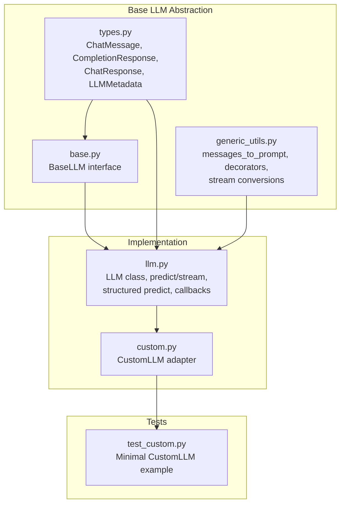
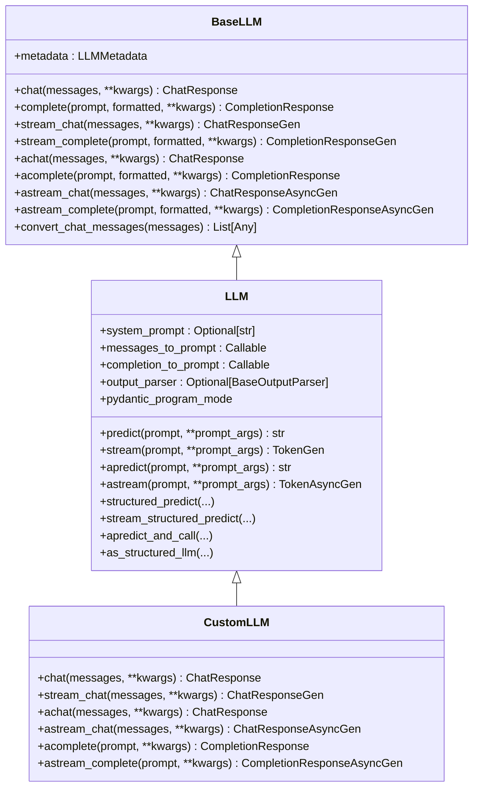
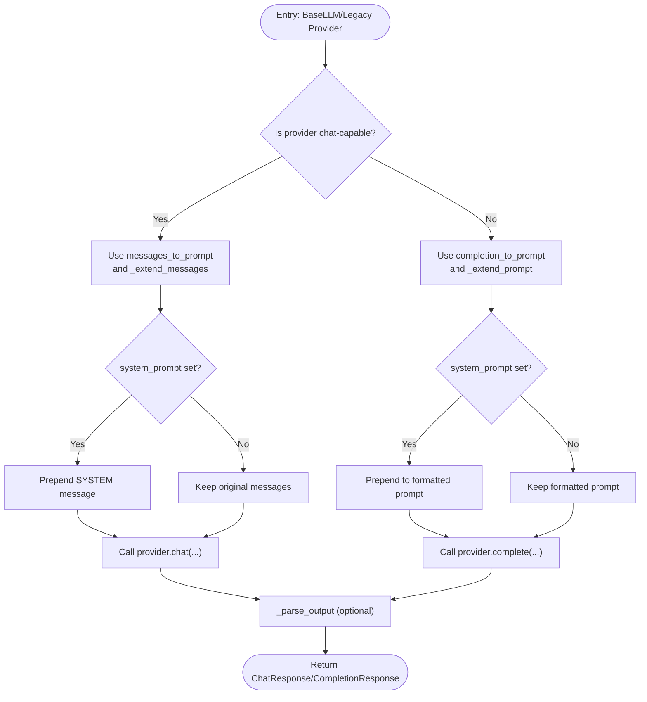
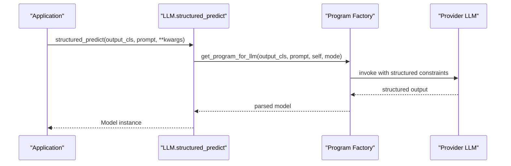
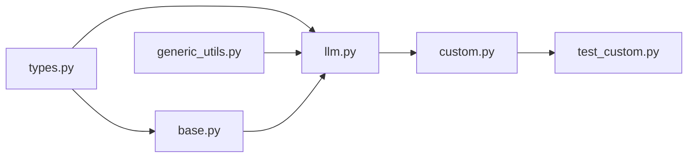

# LLM Base Abstraction

<cite>
**Referenced Files in This Document**
- [base.py](file://llama-index-core/llama_index/core/base/llms/base.py)
- [types.py](file://llama-index-core/llama_index/core/base/llms/types.py)
- [generic_utils.py](file://llama-index-core/llama_index/core/base/llms/generic_utils.py)
- [llm.py](file://llama-index-core/llama_index/core/llms/llm.py)
- [custom.py](file://llama-index-core/llama_index/core/llms/custom.py)
- [test_custom.py](file://llama-index-core/tests/llms/test_custom.py)
- [__init__.py](file://llama-index-core/llama_index/core/callbacks/__init__.py)
- [utils.py](file://llama-index-core/llama-index-core/llama_index/core/callbacks/utils.py)
</cite>

## Table of Contents
1. [Introduction](#introduction)
2. [Project Structure](#project-structure)
3. [Core Components](#core-components)
4. [Architecture Overview](#architecture-overview)
5. [Detailed Component Analysis](#detailed-component-analysis)
6. [Dependency Analysis](#dependency-analysis)
7. [Performance Considerations](#performance-considerations)
8. [Troubleshooting Guide](#troubleshooting-guide)
9. [Conclusion](#conclusion)

## Introduction
This document explains the LLM base abstraction layer in LlamaIndex, focusing on the BaseLLM interface and the LLM implementation that powers all LLM integrations. It covers the core methods for chat and completion (including streaming and async variants), the prompt formatting pipeline, message extension with system prompts, output parsing, and how to extend the base class for custom LLM providers. It also describes integration with callbacks, instrumentation, and the templating system.

## Project Structure
The LLM abstraction lives under the core base and implementation modules:
- Base interface and shared types: base/llms
- LLM implementation and helpers: llms
- Tests for custom LLM patterns: tests/llms

**Diagram sources**
- [base.py](file://llama-index-core/llama_index/core/base/llms/base.py#L25-L292)
- [types.py](file://llama-index-core/llama_index/core/base/llms/types.py#L538-L747)
- [generic_utils.py](file://llama-index-core/llama_index/core/base/llms/generic_utils.py#L36-L308)
- [llm.py](file://llama-index-core/llama_index/core/llms/llm.py#L163-L931)
- [custom.py](file://llama-index-core/llama_index/core/llms/custom.py#L22-L92)
- [test_custom.py](file://llama-index-core/tests/llms/test_custom.py#L12-L69)

**Section sources**
- [base.py](file://llama-index-core/llama_index/core/base/llms/base.py#L25-L292)
- [types.py](file://llama-index-core/llama_index/core/base/llms/types.py#L538-L747)
- [generic_utils.py](file://llama-index-core/llama_index/core/base/llms/generic_utils.py#L36-L308)
- [llm.py](file://llama-index-core/llama_index/core/llms/llm.py#L163-L931)
- [custom.py](file://llama-index-core/llama_index/core/llms/custom.py#L22-L92)
- [test_custom.py](file://llama-index-core/tests/llms/test_custom.py#L12-L69)

## Core Components
- BaseLLM: Abstract interface defining chat, complete, streaming, and async endpoints. It also provides a default conversion utility for chat messages and requires subclasses to implement metadata.
- LLM: Concrete implementation that orchestrates templating, system prompt injection, output parsing, and structured prediction. It delegates actual inference to underlying providers via the abstract methods.
- Types: Strongly typed message and response models, roles, and metadata used across the LLM stack.
- Generic utilities: Utilities for prompt/message conversion, streaming normalization, and convenience decorators.

Key responsibilities:
- BaseLLM: Define the contract for all LLM providers.
- LLM: Manage prompt lifecycle, system prompt and wrapper injection, output parsing, and structured prediction orchestration.
- Types: Provide consistent data structures for messages, responses, and metadata.
- Generic utilities: Normalize between chat and completion APIs and handle streaming conversions.

**Section sources**
- [base.py](file://llama-index-core/llama_index/core/base/llms/base.py#L25-L292)
- [llm.py](file://llama-index-core/llama_index/core/llms/llm.py#L163-L931)
- [types.py](file://llama-index-core/llama_index/core/base/llms/types.py#L538-L747)
- [generic_utils.py](file://llama-index-core/llama_index/core/base/llms/generic_utils.py#L36-L308)

## Architecture Overview
The LLM abstraction separates concerns between interface definition, implementation orchestration, and shared utilities.

**Diagram sources**
- [base.py](file://llama-index-core/llama_index/core/base/llms/base.py#L25-L292)
- [llm.py](file://llama-index-core/llama_index/core/llms/llm.py#L163-L931)
- [custom.py](file://llama-index-core/llama_index/core/llms/custom.py#L22-L92)

## Detailed Component Analysis

### BaseLLM: Abstract Interface
- Purpose: Defines the canonical LLM interface for all providers.
- Core methods:
  - chat/messages: Chat-style interaction with a sequence of messages.
  - complete/prompt: Text completion for non-chat models.
  - stream_*: Synchronous streaming variants.
  - a*_: Async variants of all endpoints.
- Utility: convert_chat_messages normalizes mixed-content messages to text for providers that require pure text.

Behavioral guarantees:
- All methods are abstract and must be implemented by concrete providers.
- Metadata exposes capabilities like is_chat_model, context window, and model name.

**Section sources**
- [base.py](file://llama-index-core/llama_index/core/base/llms/base.py#L25-L292)

### LLM: Implementation and Orchestration
- Attributes:
  - system_prompt: Prepended to prompts and messages.
  - messages_to_prompt, completion_to_prompt: Callables to transform sequences to prompts and vice versa.
  - output_parser: Optional parser to format templates and messages, and to parse outputs.
  - pydantic_program_mode: Controls structured prediction behavior.
- Prompt pipeline:
  - _get_prompt/_get_messages: Apply templating, optional output parser formatting, and system prompt injection.
  - _extend_prompt/_extend_messages: Prepend system prompt to the formatted prompt or to the message list.
- Structured prediction:
  - structured_predict, stream_structured_predict, astructured_predict, astream_structured_predict: Orchestrate program-based structured outputs.
- Convenience methods:
  - predict/stream/apredict/astream: Unified entry points that route to either chat or completion based on metadata.is_chat_model, apply system prompt and output parsing, and normalize streaming tokens.

Notes:
- Streaming with output parsers is not supported; an exception is raised when attempting to stream with an output parser configured.

**Section sources**
- [llm.py](file://llama-index-core/llama_index/core/llms/llm.py#L163-L931)

### Types: Messages, Responses, and Metadata
- ChatMessage: Rich message model supporting roles, content blocks, and backward-compatible content strings.
- CompletionResponse and ChatResponse: Standardized response models with text, deltas, raw, and additional metadata.
- LLMMetadata: Capability flags (is_chat_model, is_function_calling_model), context window, and model name.

These types unify how providers exchange data and enable consistent behavior across different LLM backends.

**Section sources**
- [types.py](file://llama-index-core/llama_index/core/base/llms/types.py#L538-L747)

### Generic Utilities: Prompt and Stream Conversions
- messages_to_prompt/prompt_to_messages: Convert between message sequences and prompt strings.
- Decorators and generators: Convert between chat and completion responses and streams, enabling seamless interoperability for providers that expose only one API style.

These utilities allow LLM to adapt to both chat and completion providers uniformly.

**Section sources**
- [generic_utils.py](file://llama-index-core/llama_index/core/base/llms/generic_utils.py#L36-L308)

### Extending BaseLLM: CustomLLM Adapter Pattern
- CustomLLM demonstrates how to build a minimal adapter:
  - Implement metadata and complete/stream_complete.
  - Delegate chat/stream_chat to complete/stream_complete using a decorator that converts messages to prompts.
  - Provide async wrappers that delegate to sync methods.
- Example pattern:
  - See the minimal TestLLM in tests that inherits from CustomLLM and implements complete and stream_complete.

This pattern enables quick integration of new providers without reimplementing the entire orchestration layer.

**Section sources**
- [custom.py](file://llama-index-core/llama_index/core/llms/custom.py#L22-L92)
- [test_custom.py](file://llama-index-core/tests/llms/test_custom.py#L12-L69)

### Prompt Formatting Pipeline

**Diagram sources**
- [llm.py](file://llama-index-core/llama_index/core/llms/llm.py#L253-L302)
- [generic_utils.py](file://llama-index-core/llama_index/core/base/llms/generic_utils.py#L36-L50)

### Structured Prediction Flow

**Diagram sources**
- [llm.py](file://llama-index-core/llama_index/core/llms/llm.py#L306-L425)

## Dependency Analysis
- BaseLLM depends on:
  - Types for message/response models and metadata.
  - Callback instrumentation for tracing spans.
- LLM depends on:
  - BaseLLM for interface.
  - Types for message/response models and metadata.
  - Generic utilities for prompt/message conversions.
  - Callbacks and instrumentation for event emission.
  - Output parser interface for formatting and parsing.
- CustomLLM depends on:
  - LLM base class and generic response conversion utilities.

**Diagram sources**
- [base.py](file://llama-index-core/llama_index/core/base/llms/base.py#L25-L292)
- [types.py](file://llama-index-core/llama_index/core/base/llms/types.py#L538-L747)
- [generic_utils.py](file://llama-index-core/llama_index/core/base/llms/generic_utils.py#L36-L308)
- [llm.py](file://llama-index-core/llama_index/core/llms/llm.py#L163-L931)
- [custom.py](file://llama-index-core/llama_index/core/llms/custom.py#L22-L92)
- [test_custom.py](file://llama-index-core/tests/llms/test_custom.py#L12-L69)

**Section sources**
- [base.py](file://llama-index-core/llama_index/core/base/llms/base.py#L25-L292)
- [llm.py](file://llama-index-core/llama_index/core/llms/llm.py#L163-L931)
- [custom.py](file://llama-index-core/llama_index/core/llms/custom.py#L22-L92)
- [generic_utils.py](file://llama-index-core/llama_index/core/base/llms/generic_utils.py#L36-L308)
- [types.py](file://llama-index-core/llama_index/core/base/llms/types.py#L538-L747)

## Performance Considerations
- Streaming: Prefer streaming APIs for long responses to reduce latency and memory overhead.
- Output parsing: Avoid applying output parsers during streaming; they are applied after completion to minimize overhead.
- System prompt injection: Adding a system prompt is O(n) in prompt length; keep system prompts concise.
- Structured prediction: Program-based structured prediction adds overhead; use only when required.

## Troubleshooting Guide
Common issues and resolutions:
- Invalid message content: BaseLLM.convert_chat_messages raises an error for unsupported content types. Ensure message content is text or a list of TextBlock.
- Streaming with output parser: LLM stream methods explicitly raise an error when an output parser is configured. Remove the output parser or disable streaming.
- Missing callback manager: BaseLLM enforces a default callback manager if not provided. Ensure callback manager is properly configured if you rely on instrumentation.

**Section sources**
- [base.py](file://llama-index-core/llama_index/core/base/llms/base.py#L50-L68)
- [llm.py](file://llama-index-core/llama_index/core/llms/llm.py#L676-L678)
- [llm.py](file://llama-index-core/llama_index/core/llms/llm.py#L29-L37)

## Conclusion
The LLM base abstraction cleanly separates the interface from implementation, enabling a unified developer experience across diverse LLM providers. LLM centralizes prompt formatting, system prompt injection, output parsing, and structured prediction, while BaseLLM defines a minimal, extensible contract. The generic utilities and adapter pattern simplify adding new providers, and the integration with callbacks and instrumentation provides robust observability.