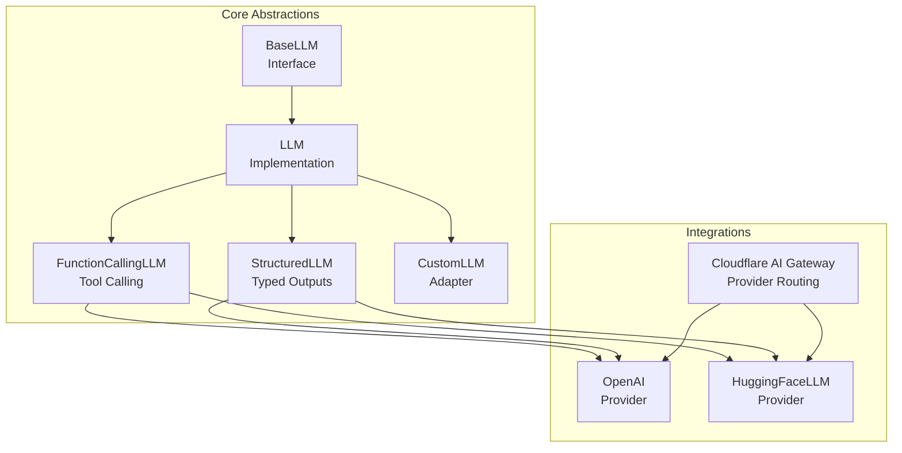
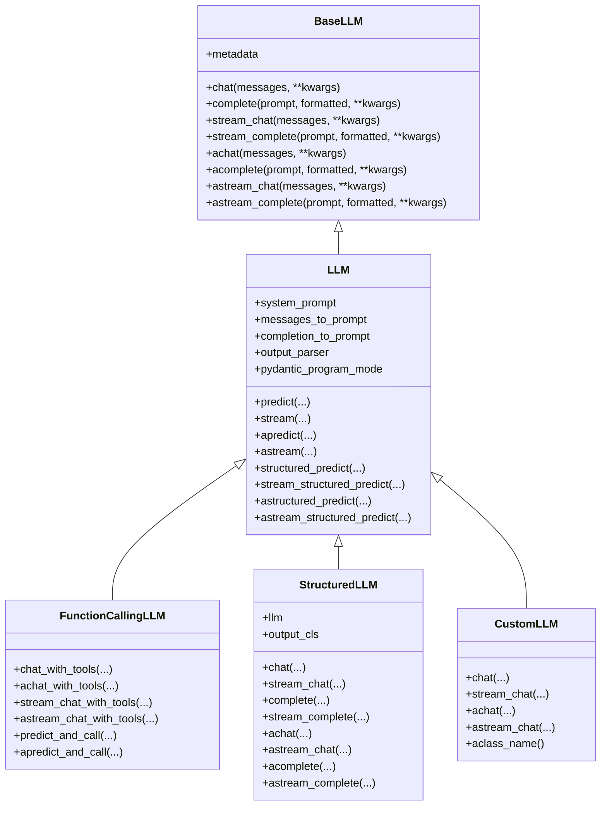
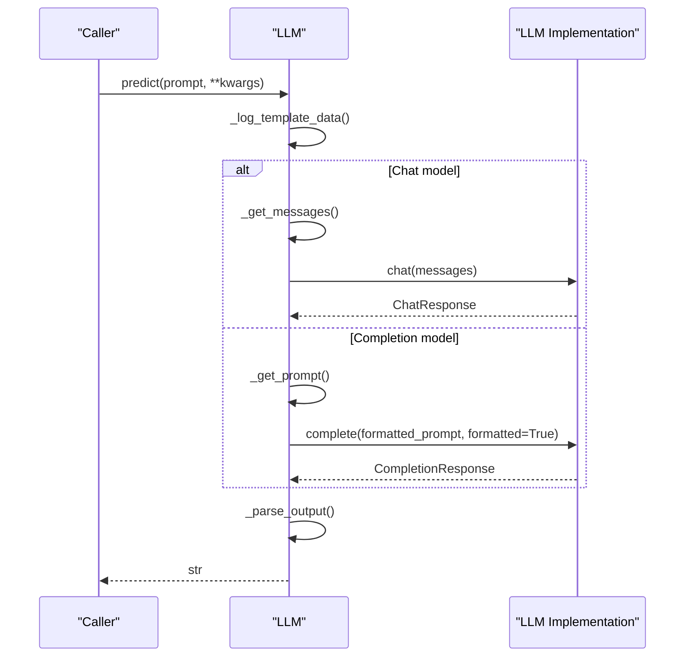
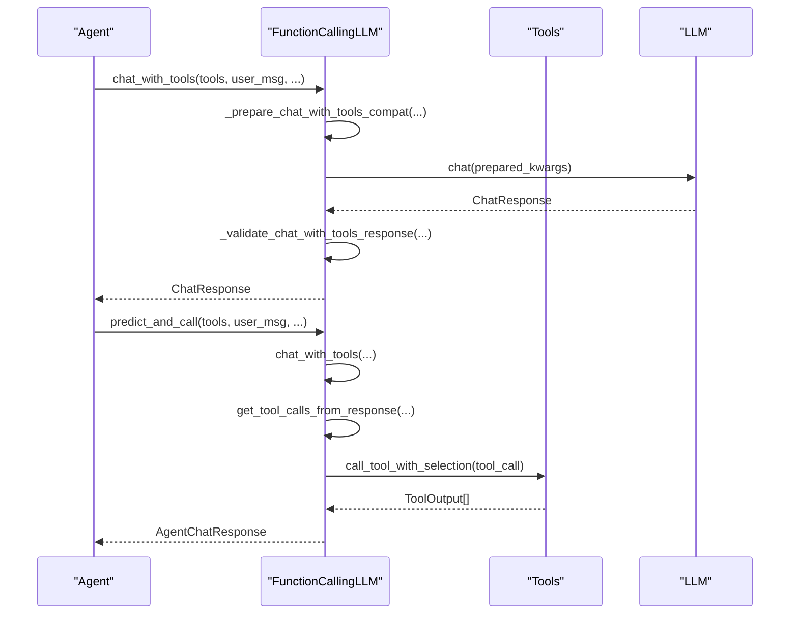
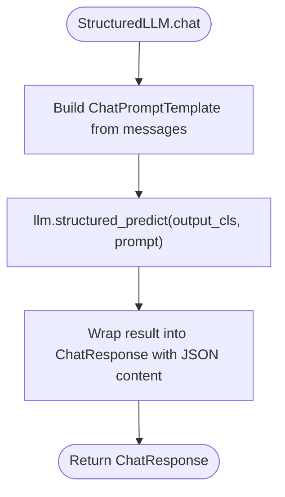
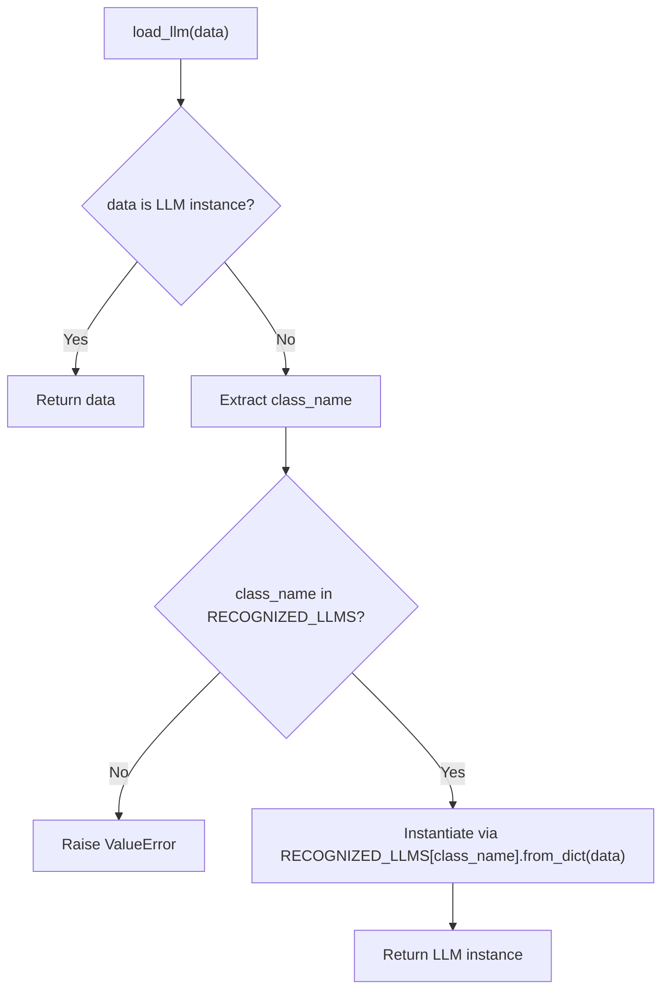
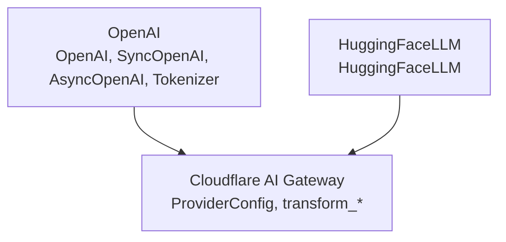
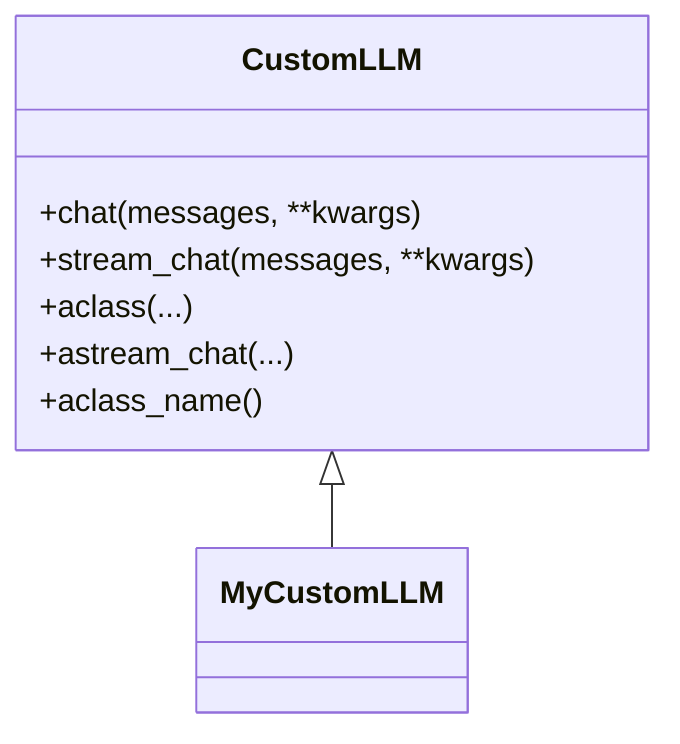
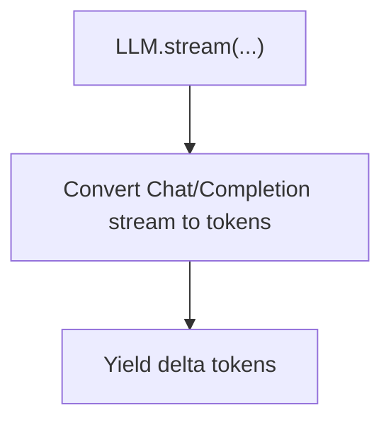
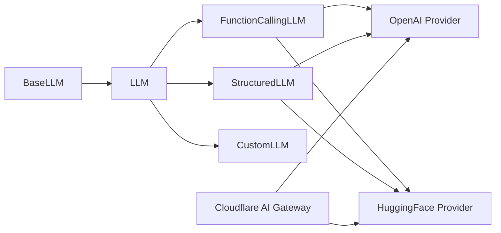

# LLM Integration

<cite>
**Referenced Files in This Document**
- [base.py](file://llama-index-core/llama_index/core/base/llms/base.py)
- [llm.py](file://llama-index-core/llama_index/core/llms/llm.py)
- [function_calling.py](file://llama-index-core/llama_index/core/llms/function_calling.py)
- [structured_llm.py](file://llama-index-core/llama_index/core/llms/structured_llm.py)
- [custom.py](file://llama-index-core/llama_index/core/llms/custom.py)
- [loading.py](file://llama-index-core/llama_index/core/llms/loading.py)
- [__init__.py](file://llama-index-integrations/llms/llama-index-llms-openai/llama_index/llms/openai/__init__.py)
- [__init__.py](file://llama-index-integrations/llms/llama-index-llms-huggingface/llama_index/llms/huggingface/__init__.py)
- [providers.py](file://llama-index-integrations/llms/llama-index-llms-cloudflare-ai-gateway/llama_index/llms/cloudflare_ai_gateway/providers.py)
- [mappings.json](file://llama-index-cli/llama_index/cli/upgrade/mappings.json)
- [modules.md](file://docs/src/content/docs/framework/module_guides/models/llms/modules.md)
- [test_llms_huggingface.py](file://llama-index-integrations/llms/llama-index-llms-huggingface/tests/test_llms_huggingface.py)
- [test_llms_llama.py](file://llama-index-integrations/llms/llama-index-llms-meta/tests/test_llms_llama.py)
- [test_llms_llama_api.py](file://llama-index-integrations/llms/llama-index-llms-llama-api/tests/test_llms_llama_api.py)
- [test_empty.py](file://llama-index-integrations/llms/llama-index-llms-contextual/tests/test_empty.py)
- [test_llms_openai_like.py](file://llama-index-integrations/llms/llama-index-llms-openai-like/tests/test_llms_openai_like.py)
- [client.py](file://llama-index-integrations/llms/llama-index-llms-oci-data-science/llama_index/llms/oci_data_science/client.py)
- [test_client.py](file://llama-index-utils/llama-index-utils-qianfan/tests/test_client.py)
</cite>

## Table of Contents
1. [Introduction](#introduction)
2. [Project Structure](#project-structure)
3. [Core Components](#core-components)
4. [Architecture Overview](#architecture-overview)
5. [Detailed Component Analysis](#detailed-component-analysis)
6. [Dependency Analysis](#dependency-analysis)
7. [Performance Considerations](#performance-considerations)
8. [Troubleshooting Guide](#troubleshooting-guide)
9. [Conclusion](#conclusion)
10. [Appendices](#appendices)

## Introduction
This document explains LlamaIndex’s comprehensive language model abstraction and integration system. It covers the LLM base class, provider loading mechanisms, function calling patterns, and structured output handling. You will learn how built-in LLM implementations integrate with the unified interface, how to develop custom LLMs, and how to configure provider-specific behaviors. Advanced topics include streaming responses, batch processing, async operations, model selection, fallback strategies, and production best practices. Practical examples show how to integrate new LLM providers, implement custom LLM classes, and handle different output formats.

## Project Structure
LlamaIndex organizes LLM abstractions and integrations across core modules and integration packages:
- Core abstractions define the BaseLLM interface and the LLM implementation that adds convenience methods, structured outputs, and streaming helpers.
- Function calling and structured LLM wrappers extend the base to support tool calling and typed outputs.
- Integration packages provide concrete LLM implementations (e.g., OpenAI, Hugging Face) and provider-specific adapters.
- CLI mappings and module guides enumerate supported providers and examples.

**Diagram sources**
- [base.py](file://llama-index-core/llama_index/core/base/llms/base.py#L25-L292)
- [llm.py](file://llama-index-core/llama_index/core/llms/llm.py#L163-L931)
- [function_calling.py](file://llama-index-core/llama_index/core/llms/function_calling.py#L24-L347)
- [structured_llm.py](file://llama-index-core/llama_index/core/llms/structured_llm.py#L32-L164)
- [custom.py](file://llama-index-core/llama_index/core/llms/custom.py#L22-L92)
- [__init__.py](file://llama-index-integrations/llms/llama-index-llms-openai/llama_index/llms/openai/__init__.py#L1-L5)
- [__init__.py](file://llama-index-integrations/llms/llama-index-llms-huggingface/llama_index/llms/huggingface/__init__.py#L1-L6)
- [providers.py](file://llama-index-integrations/llms/llama-index-llms-cloudflare-ai-gateway/llama_index/llms/cloudflare_ai_gateway/providers.py#L1-L162)

**Section sources**
- [base.py](file://llama-index-core/llama_index/core/base/llms/base.py#L25-L292)
- [llm.py](file://llama-index-core/llama_index/core/llms/llm.py#L163-L931)
- [function_calling.py](file://llama-index-core/llama_index/core/llms/function_calling.py#L24-L347)
- [structured_llm.py](file://llama-index-core/llama_index/core/llms/structured_llm.py#L32-L164)
- [custom.py](file://llama-index-core/llama_index/core/llms/custom.py#L22-L92)
- [modules.md](file://docs/src/content/docs/framework/module_guides/models/llms/modules.md#L1-L68)

## Core Components
- BaseLLM: Defines the canonical interface for chat, completion, streaming, and async endpoints. It also normalizes message content and exposes metadata.
- LLM: Implements convenience methods for templating, system prompts, output parsing, and structured prediction. It supports both sync and async operations and token streaming conversion helpers.
- FunctionCallingLLM: Extends LLM to enable tool calling via chat with tools, including synchronous, asynchronous, streaming variants, and validation hooks.
- StructuredLLM: Wraps another LLM to enforce a fixed output schema, delegating to structured prediction APIs for chat and streaming.
- CustomLLM: Provides a minimal adapter for custom LLMs by requiring only completion endpoints and deriving chat/streaming via decorators.

Key responsibilities:
- Unified interface across providers
- Prompt formatting and system prompt injection
- Structured output generation and streaming
- Function/tool calling orchestration
- Streaming token extraction helpers
- Async and sync operation symmetry

**Section sources**
- [base.py](file://llama-index-core/llama_index/core/base/llms/base.py#L25-L292)
- [llm.py](file://llama-index-core/llama_index/core/llms/llm.py#L163-L931)
- [function_calling.py](file://llama-index-core/llama_index/core/llms/function_calling.py#L24-L347)
- [structured_llm.py](file://llama-index-core/llama_index/core/llms/structured_llm.py#L32-L164)
- [custom.py](file://llama-index-core/llama_index/core/llms/custom.py#L22-L92)

## Architecture Overview
The LLM integration architecture centers on a shared BaseLLM interface and a layered implementation stack. Providers implement the interface and are discovered and loaded through a registry. FunctionCallingLLM and StructuredLLM add higher-level capabilities on top of the base implementation.

**Diagram sources**
- [base.py](file://llama-index-core/llama_index/core/base/llms/base.py#L25-L292)
- [llm.py](file://llama-index-core/llama_index/core/llms/llm.py#L163-L931)
- [function_calling.py](file://llama-index-core/llama_index/core/llms/function_calling.py#L24-L347)
- [structured_llm.py](file://llama-index-core/llama_index/core/llms/structured_llm.py#L32-L164)
- [custom.py](file://llama-index-core/llama_index/core/llms/custom.py#L22-L92)

## Detailed Component Analysis

### LLM Base Class and Implementation
- Responsibilities:
  - Templating and prompt/message formatting
  - System prompt injection and query wrapper prompt support
  - Output parsing and extension of prompts/messages
  - Structured prediction entry points (sync/async/streaming)
  - Token streaming conversion helpers for completions and chats
- Notable methods:
  - predict/apredict and stream/astream for text generation
  - structured_predict/astructured_predict and streaming variants
  - Helpers to convert streaming responses to token streams

**Diagram sources**
- [llm.py](file://llama-index-core/llama_index/core/llms/llm.py#L588-L725)

**Section sources**
- [llm.py](file://llama-index-core/llama_index/core/llms/llm.py#L163-L931)

### Function Calling Patterns
- FunctionCallingLLM extends LLM to support tool/function calling:
  - chat_with_tools/achat_with_tools for synchronous/asynchronous tool invocation
  - stream_chat_with_tools/astream_chat_with_tools for streaming
  - predict_and_call/apredict_and_call orchestrates tool selection and execution
  - Validation hooks and compatibility checks for tool_required and parallel tool calls
- Tool selection is represented by a structured ToolSelection model.

**Diagram sources**
- [function_calling.py](file://llama-index-core/llama_index/core/llms/function_calling.py#L35-L334)

**Section sources**
- [function_calling.py](file://llama-index-core/llama_index/core/llms/function_calling.py#L24-L347)

### Structured Output Handling
- StructuredLLM wraps an inner LLM and enforces a fixed output schema:
  - Delegates chat to structured_predict and streams partial outputs
  - Converts chat to completion via decorators for completion endpoints
  - Exposes async equivalents for structured operations

**Diagram sources**
- [structured_llm.py](file://llama-index-core/llama_index/core/llms/structured_llm.py#L52-L71)

**Section sources**
- [structured_llm.py](file://llama-index-core/llama_index/core/llms/structured_llm.py#L32-L164)

### Provider Loading Mechanisms
- Registry-driven discovery:
  - RECOGNIZED_LLMS maps class_name to LLM subclasses
  - load_llm(data) resolves by class_name and instantiates via from_dict
- Conditional imports enable optional providers (e.g., OpenAI, Azure OpenAI, HuggingFace Inference API)
- CLI mappings and module guides enumerate supported providers and example links

**Diagram sources**
- [loading.py](file://llama-index-core/llama_index/core/llms/loading.py#L35-L47)

**Section sources**
- [loading.py](file://llama-index-core/llama_index/core/llms/loading.py#L1-L47)
- [mappings.json](file://llama-index-cli/llama_index/cli/upgrade/mappings.json#L951-L981)
- [modules.md](file://docs/src/content/docs/framework/module_guides/models/llms/modules.md#L1-L68)

### Built-in LLM Implementations and Provider-Specific Configurations
- OpenAI: Provides both sync and async clients and tokenizer utilities.
- HuggingFace: Offers a local or hosted inference client.
- Cloudflare AI Gateway: Routes requests to providers by endpoint regex and class name.

**Diagram sources**
- [__init__.py](file://llama-index-integrations/llms/llama-index-llms-openai/llama_index/llms/openai/__init__.py#L1-L5)
- [__init__.py](file://llama-index-integrations/llms/llama-index-llms-huggingface/llama_index/llms/huggingface/__init__.py#L1-L6)
- [providers.py](file://llama-index-integrations/llms/llama-index-llms-cloudflare-ai-gateway/llama_index/llms/cloudflare_ai_gateway/providers.py#L1-L162)

**Section sources**
- [__init__.py](file://llama-index-integrations/llms/llama-index-llms-openai/llama_index/llms/openai/__init__.py#L1-L5)
- [__init__.py](file://llama-index-integrations/llms/llama-index-llms-huggingface/llama_index/llms/huggingface/__init__.py#L1-L6)
- [providers.py](file://llama-index-integrations/llms/llama-index-llms-cloudflare-ai-gateway/llama_index/llms/cloudflare_ai_gateway/providers.py#L1-L162)

### Custom LLM Development
- Implement a subclass of CustomLLM and provide:
  - metadata property
  - complete and stream_complete methods
- CustomLLM derives chat/stream_chat from completion endpoints and applies callbacks automatically.

**Diagram sources**
- [custom.py](file://llama-index-core/llama_index/core/llms/custom.py#L22-L92)

**Section sources**
- [custom.py](file://llama-index-core/llama_index/core/llms/custom.py#L22-L92)

### Streaming Responses
- Token streaming helpers convert completion/chat generators to token streams.
- StructuredLLM and FunctionCallingLLM expose streaming variants for structured and tool-calling scenarios.
- Provider integrations demonstrate streaming for both sync and async contexts.

**Diagram sources**
- [llm.py](file://llama-index-core/llama_index/core/llms/llm.py#L99-L144)
- [client.py](file://llama-index-integrations/llms/llama-index-llms-oci-data-science/llama_index/llms/oci_data_science/client.py#L471-L717)
- [test_client.py](file://llama-index-utils/llama-index-utils-qianfan/tests/test_client.py#L76-L87)

**Section sources**
- [llm.py](file://llama-index-core/llama_index/core/llms/llm.py#L99-L144)
- [client.py](file://llama-index-integrations/llms/llama-index-llms-oci-data-science/llama_index/llms/oci_data_science/client.py#L471-L717)
- [test_client.py](file://llama-index-utils/llama-index-utils-qianfan/tests/test_client.py#L76-L87)

### Async LLM Operations
- All BaseLLM endpoints have async counterparts with identical signatures.
- LLM provides async wrappers around sync methods and delegates to underlying implementations.
- StructuredLLM and FunctionCallingLLM expose async structured and tool-calling variants.

**Section sources**
- [base.py](file://llama-index-core/llama_index/core/base/llms/base.py#L180-L292)
- [llm.py](file://llama-index-core/llama_index/core/llms/llm.py#L682-L775)
- [structured_llm.py](file://llama-index-core/llama_index/core/llms/structured_llm.py#L104-L164)
- [function_calling.py](file://llama-index-core/llama_index/core/llms/function_calling.py#L268-L334)

### Batch Processing
- LLM does not define a dedicated batch method. Use concurrent.futures or asyncio.gather to process multiple prompts concurrently against the same LLM instance.
- For structured outputs, call structured_predict or astructured_predict per prompt and aggregate results.

[No sources needed since this section provides general guidance]

### Practical Examples

- Integrating a new LLM provider:
  - Implement a subclass of BaseLLM or extend LLM/FunctionCallingLLM
  - Register it in the loader registry by adding its class_name and type to the recognized map
  - Ensure metadata exposes model capabilities (chat vs completion, function calling, streaming)
  - Add provider-specific configuration (endpoint, headers, auth) and streaming support if applicable

- Implementing a custom LLM class:
  - Subclass CustomLLM and implement metadata, complete, stream_complete
  - Optionally override chat/stream_chat to customize message formatting
  - Use class_name to register and load via the loader

- Handling different output formats:
  - Use structured_predict/astructured_predict for typed outputs
  - Apply output parsers during prompt formatting or via LLM.output_parser
  - For streaming, avoid applying output parsers during stream; parse after completion

**Section sources**
- [loading.py](file://llama-index-core/llama_index/core/llms/loading.py#L35-L47)
- [custom.py](file://llama-index-core/llama_index/core/llms/custom.py#L22-L92)
- [llm.py](file://llama-index-core/llama_index/core/llms/llm.py#L306-L584)

### Advanced Topics

- Model selection:
  - Use metadata to detect chat, function-calling, and streaming capabilities
  - Select providers based on cost, latency, and output quality
  - Combine with provider routing (e.g., Cloudflare AI Gateway) for dynamic endpoint selection

- Fallback strategies:
  - Maintain a list of LLM instances and retry on failure
  - Prefer function-calling-capable models for tool-heavy workflows
  - Gracefully degrade from streaming to non-streaming responses

- Performance optimization:
  - Enable streaming for long responses to reduce perceived latency
  - Use structured outputs to minimize retries and improve accuracy
  - Cache prompts and reuse templates where safe

**Section sources**
- [providers.py](file://llama-index-integrations/llms/llama-index-llms-cloudflare-ai-gateway/llama_index/llms/cloudflare_ai_gateway/providers.py#L1-L162)
- [llm.py](file://llama-index-core/llama_index/core/llms/llm.py#L306-L584)

## Dependency Analysis
The LLM ecosystem exhibits layered dependencies:
- BaseLLM defines the contract; LLM implements convenience and structured features; FunctionCallingLLM and StructuredLLM build on LLM
- Integrations depend on external libraries and are conditionally imported
- Provider routing utilities help map endpoints to provider configurations

**Diagram sources**
- [base.py](file://llama-index-core/llama_index/core/base/llms/base.py#L25-L292)
- [llm.py](file://llama-index-core/llama_index/core/llms/llm.py#L163-L931)
- [function_calling.py](file://llama-index-core/llama_index/core/llms/function_calling.py#L24-L347)
- [structured_llm.py](file://llama-index-core/llama_index/core/llms/structured_llm.py#L32-L164)
- [custom.py](file://llama-index-core/llama_index/core/llms/custom.py#L22-L92)
- [providers.py](file://llama-index-integrations/llms/llama-index-llms-cloudflare-ai-gateway/llama_index/llms/cloudflare_ai_gateway/providers.py#L1-L162)

**Section sources**
- [loading.py](file://llama-index-core/llama_index/core/llms/loading.py#L1-L47)
- [providers.py](file://llama-index-integrations/llms/llama-index-llms-cloudflare-ai-gateway/llama_index/llms/cloudflare_ai_gateway/providers.py#L1-L162)

## Performance Considerations
- Prefer streaming for interactive experiences to lower initial latency
- Use structured outputs to reduce post-processing and retries
- Minimize prompt formatting overhead by caching templates and reusing LLM instances
- For tool-heavy workflows, choose function-calling-capable models to avoid iterative refinement loops

[No sources needed since this section provides general guidance]

## Troubleshooting Guide
Common issues and resolutions:
- Invalid LLM name during loading:
  - Ensure class_name matches a registered provider and the provider package is installed
- Function calling not supported:
  - Verify the model is marked as a function-calling model and the provider supports tool_required
- Streaming output parser errors:
  - Output parsers are not supported during streaming; apply them after completion
- Provider routing mismatches:
  - Confirm endpoint regex and class name detection align with provider expectations

**Section sources**
- [loading.py](file://llama-index-core/llama_index/core/llms/loading.py#L35-L47)
- [function_calling.py](file://llama-index-core/llama_index/core/llms/function_calling.py#L181-L201)
- [llm.py](file://llama-index-core/llama_index/core/llms/llm.py#L676-L774)
- [providers.py](file://llama-index-integrations/llms/llama-index-llms-cloudflare-ai-gateway/llama_index/llms/cloudflare_ai_gateway/providers.py#L134-L162)

## Conclusion
LlamaIndex’s LLM integration system provides a robust, extensible abstraction that unifies diverse language models behind a consistent interface. With structured outputs, function calling, streaming, and async support, developers can rapidly integrate new providers, implement custom LLMs, and build production-grade applications. Use the registry and provider routing utilities to scale across providers, and adopt structured outputs and streaming for optimal performance and user experience.

[No sources needed since this section summarizes without analyzing specific files]

## Appendices

### Example Validation Tests
- These tests confirm that provider classes inherit from the BaseLLM interface, ensuring compatibility with the unified LLM stack.

**Section sources**
- [test_llms_huggingface.py](file://llama-index-integrations/llms/llama-index-llms-huggingface/tests/test_llms_huggingface.py#L1-L8)
- [test_llms_llama.py](file://llama-index-integrations/llms/llama-index-llms-meta/tests/test_llms_llama.py#L1-L8)
- [test_llms_llama_api.py](file://llama-index-integrations/llms/llama-index-llms-llama-api/tests/test_llms_llama_api.py#L1-L8)
- [test_empty.py](file://llama-index-integrations/llms/llama-index-llms-contextual/tests/test_empty.py#L1-L8)
- [test_llms_openai_like.py](file://llama-index-integrations/llms/llama-index-llms-openai-like/tests/test_llms_openai_like.py#L1-L8)