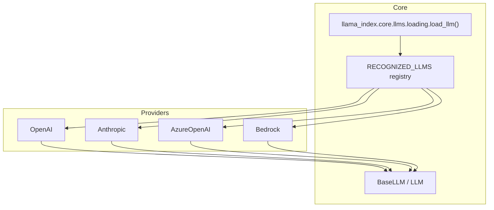
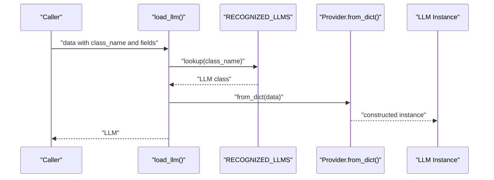
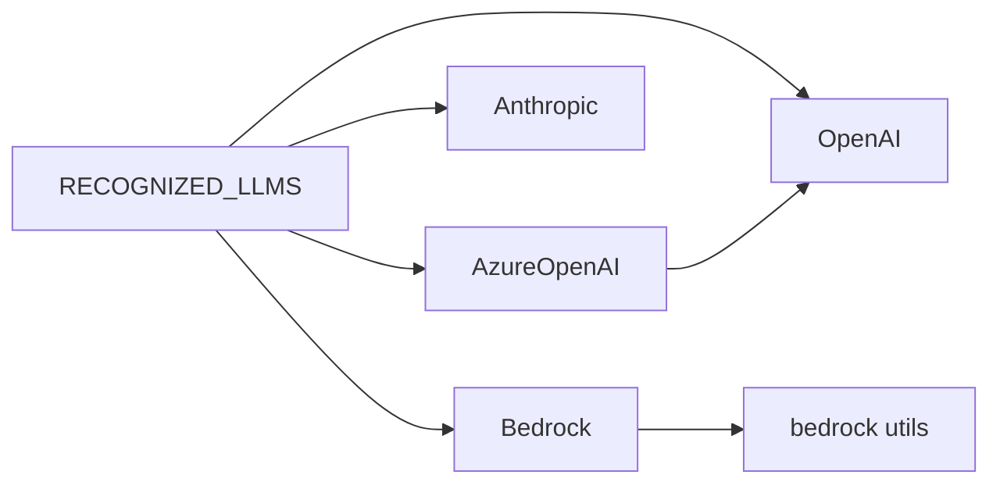

# Provider Loading and Configuration

<cite>
**Referenced Files in This Document**
- [loading.py](file://llama-index-core/llama_index/core/llms/loading.py)
- [llm.py](file://llama-index-core/llama_index/core/llms/llm.py)
- [__init__.py](file://llama-index-core/llama_index/core/llms/__init__.py)
- [base.py](file://llama-index-integrations/llms/llama-index-llms-openai/llama_index/llms/openai/base.py)
- [base.py](file://llama-index-integrations/llms/llama-index-llms-anthropic/llama_index/llms/anthropic/base.py)
- [base.py](file://llama-index-integrations/llms/llama-index-llms-azure-openai/llama_index/llms/azure_openai/base.py)
- [base.py](file://llama-index-integrations/llms/llama-index-llms-bedrock/llama_index/llms/bedrock/base.py)
- [utils.py](file://llama-index-integrations/llms/llama-index-llms-bedrock/llama_index/llms/bedrock/utils.py)
- [test_utils.py](file://llama-index-integrations/llms/llama-index-llms-bedrock/tests/test_utils.py)
- [providers.py](file://llama-index-integrations/llms/llama-index-llms-cloudflare-ai-gateway/llama_index/llms/cloudflare_ai_gateway/providers.py)
- [env.example](file://llama-index-integrations/llms/llama-index-llms-cloudflare-ai-gateway/env.example)
- [base.py](file://llama-index-integrations/llms/llama-index-llms-helicone/README.md)
- [base.py](file://llama-index-integrations/selectors/llama-index-selectors-notdiamond/llama_index/selectors/notdiamond/base.py)
- [service_context_migration.md](file://docs/src/content/docs/framework/module_guides/supporting_modules/service_context_migration.md)
</cite>

## Table of Contents
1. [Introduction](#introduction)
2. [Project Structure](#project-structure)
3. [Core Components](#core-components)
4. [Architecture Overview](#architecture-overview)
5. [Detailed Component Analysis](#detailed-component-analysis)
6. [Dependency Analysis](#dependency-analysis)
7. [Performance Considerations](#performance-considerations)
8. [Troubleshooting Guide](#troubleshooting-guide)
9. [Conclusion](#conclusion)
10. [Appendices](#appendices)

## Introduction
This document explains how LLM providers are dynamically loaded and configured in LlamaIndex. It focuses on the load_llm() function, the provider-specific implementations for OpenAI, Anthropic, Azure OpenAI, Bedrock, and local providers, and the patterns for environment variable configuration, API key management, and authentication. It also covers fallback mechanisms, error handling, validation, defaults, and migration from legacy configuration patterns.

## Project Structure
The LLM loading mechanism centers around a small registry and a single entry point that deserializes configuration dictionaries into LLM instances. Provider-specific implementations live in dedicated integration packages, each exposing a class with a class_name() method and a from_dict() constructor compatible with the loader.

**Diagram sources**
- [loading.py](file://llama-index-core/llama_index/core/llms/loading.py#L35-L47)
- [llm.py](file://llama-index-core/llama_index/core/llms/llm.py#L163-L200)
- [base.py](file://llama-index-integrations/llms/llama-index-llms-openai/llama_index/llms/openai/base.py#L139-L178)
- [base.py](file://llama-index-integrations/llms/llama-index-llms-anthropic/llama_index/llms/anthropic/base.py#L116-L132)
- [base.py](file://llama-index-integrations/llms/llama-index-llms-azure-openai/llama_index/llms/azure_openai/base.py#L20-L84)
- [base.py](file://llama-index-integrations/llms/llama-index-llms-bedrock/llama_index/llms/bedrock/base.py#L49-L71)

**Section sources**
- [loading.py](file://llama-index-core/llama_index/core/llms/loading.py#L1-L47)
- [llm.py](file://llama-index-core/llama_index/core/llms/llm.py#L163-L200)

## Core Components
- load_llm(data): Accepts a dictionary containing at minimum a class_name and provider-specific fields. It validates the class_name against a registry and constructs the LLM via from_dict().
- RECOGNIZED_LLMS: A registry mapping class_name strings to LLM classes. It is populated conditionally at import time for available providers (OpenAI, AzureOpenAI, HuggingFaceInferenceAPI).
- LLM: The base class that defines the interface and common behaviors (predict, stream, structured_predict, etc.). Provider classes subclass LLM and implement provider-specific logic.

Key behaviors:
- Validation: Requires class_name; raises if missing or unknown.
- Construction: Delegates to provider.from_dict(), which reads provider-specific fields and environment variables.
- Defaults: Many provider classes define sensible defaults for model, temperature, max_tokens, etc.

**Section sources**
- [loading.py](file://llama-index-core/llama_index/core/llms/loading.py#L35-L47)
- [__init__.py](file://llama-index-core/llama_index/core/llms/__init__.py#L21-L24)
- [llm.py](file://llama-index-core/llama_index/core/llms/llm.py#L588-L775)

## Architecture Overview
The provider loading pipeline is a thin orchestration layer that delegates to provider-specific constructors. Providers encapsulate authentication, environment resolution, and API client initialization.

**Diagram sources**
- [loading.py](file://llama-index-core/llama_index/core/llms/loading.py#L35-L47)

## Detailed Component Analysis

### Load LLM Entry Point
- Purpose: Deserialize a configuration dictionary into a concrete LLM instance.
- Behavior:
  - If data is already an LLM, return it.
  - Extract class_name; require it.
  - Validate against RECOGNIZED_LLMS; raise if unknown.
  - Call provider.from_dict(data) to construct the instance.

Best practices:
- Always supply class_name.
- Ensure provider-specific keys are present for the chosen provider.
- Use environment variables for secrets; avoid hardcoding.

**Section sources**
- [loading.py](file://llama-index-core/llama_index/core/llms/loading.py#L35-L47)

### OpenAI Provider
- Class: OpenAI
- Key fields: model, temperature, max_tokens, additional_kwargs, max_retries, timeout, reuse_client, api_key, api_base, api_version, callback_manager, default_headers, http_client, async_http_client.
- Authentication:
  - Supports environment variables OPENAI_API_KEY, OPENAI_API_BASE, OPENAI_API_VERSION.
  - Supports overriding via explicit parameters.
- Environment examples and defaults:
  - Defaults for base URL and API version are resolved by provider utilities.
- Streaming and structured outputs:
  - Implemented via LLM base methods.

Example configuration highlights:
- class_name: "OpenAI"
- model: "gpt-3.5-turbo"
- temperature: 0.1
- api_key: "<env: OPENAI_API_KEY>"
- api_base: "<env: OPENAI_API_BASE or default>"
- api_version: "<env: OPENAI_API_VERSION or default>"

Notes:
- Retry decorator and retry logic are integrated into the provider class.
- Function calling and tool choice are supported via provider utilities.

**Section sources**
- [base.py](file://llama-index-integrations/llms/llama-index-llms-openai/llama_index/llms/openai/base.py#L139-L200)
- [base.py](file://llama-index-integrations/llms/llama-index-llms-openai/llama_index/llms/openai/base.py#L1-L120)

### Anthropic Provider
- Class: Anthropic
- Key fields: model, temperature, max_tokens, base_url, timeout, max_retries, additional_kwargs, cache_idx, thinking_dict, tools, mcp_servers.
- Authentication:
  - Supports environment variables ANTHROPIC_API_KEY.
  - Supports base_url overrides.
- Environment examples:
  - Example env file includes ANTHROPIC_API_KEY.

Example configuration highlights:
- class_name: "Anthropic"
- model: "claude-3-sonnet-20240229"
- temperature: 0.1
- api_key: "<env: ANTHROPIC_API_KEY>"
- base_url: "<env: ANTHROPIC_BASE_URL or default>"

Notes:
- Provides tokenizer and response types tailored to Anthropic APIs.
- Supports tool use and structured outputs via provider utilities.

**Section sources**
- [base.py](file://llama-index-integrations/llms/llama-index-llms-anthropic/llama_index/llms/anthropic/base.py#L116-L188)
- [env.example](file://llama-index-integrations/llms/llama-index-llms-cloudflare-ai-gateway/env.example#L1-L5)

### Azure OpenAI Provider
- Class: AzureOpenAI (inherits from OpenAI)
- Key fields: engine (deployment name), azure_endpoint, azure_deployment, use_azure_ad, azure_ad_token_provider, api_base, api_version, and OpenAI-compatible fields.
- Authentication:
  - Supports AZURE_OPENAI_API_KEY or Azure AD token provider.
  - Validates presence of OPENAI_API_VERSION and endpoint.
- Environment variables:
  - AZURE_OPENAI_ENDPOINT, OPENAI_API_VERSION, AZURE_OPENAI_API_KEY.
- Validation:
  - Raises if api_base points to OpenAI while azure_endpoint is not provided.
  - Requires api_version for Azure OpenAI.

Example configuration highlights:
- class_name: "AzureOpenAI"
- engine: "<your-deployment-name>"
- model: "gpt-35-turbo"
- azure_endpoint: "<env: AZURE_OPENAI_ENDPOINT>"
- api_version: "<env: OPENAI_API_VERSION>"
- api_key: "<env: AZURE_OPENAI_API_KEY or via token provider>"

Notes:
- Resolves engine alias parameters (deployment_name, deployment_id, deployment, azure_deployment).
- Resets api_base to None if it matches default OpenAI base URL.

**Section sources**
- [base.py](file://llama-index-integrations/llms/llama-index-llms-azure-openai/llama_index/llms/azure_openai/base.py#L20-L100)
- [base.py](file://llama-index-integrations/llms/llama-index-llms-azure-openai/llama_index/llms/azure_openai/base.py#L186-L200)

### Bedrock Provider
- Class: Bedrock (deprecated; use bedrock-converse instead)
- Key fields: model, temperature, max_tokens, context_size, profile_name, AWS credentials, region_name, botocore_config, max_retries, timeout, guardrail_identifier, guardrail_version, trace, additional_kwargs.
- Authentication:
  - Uses AWS credentials (access key, secret key, session token) or IAM roles/profiles.
  - Uses boto3 session and botocore config.
- Provider detection:
  - get_provider(model) selects provider class based on model ARN/prefix.
  - Tests validate mapping for Meta, Amazon, Anthropic, Mistral, Cohere, AI21.

Example configuration highlights:
- class_name: "Bedrock"
- model: "amazon.titan-text-express-v1"
- region_name: "us-east-1"
- aws_access_key_id: "<env: AWS_ACCESS_KEY_ID>"
- aws_secret_access_key: "<env: AWS_SECRET_ACCESS_KEY>"
- additional_kwargs: "{}"

Notes:
- Deprecated in favor of llama-index-llms-bedrock-converse.
- Context size defaults are derived from provider utilities.

**Section sources**
- [base.py](file://llama-index-integrations/llms/llama-index-llms-bedrock/llama_index/llms/bedrock/base.py#L49-L130)
- [utils.py](file://llama-index-integrations/llms/llama-index-llms-bedrock/llama_index/llms/bedrock/utils.py#L1-L40)
- [test_utils.py](file://llama-index-integrations/llms/llama-index-llms-bedrock/tests/test_utils.py#L14-L55)

### Local and Gateway Providers
- Cloudflare AI Gateway:
  - Supports routing to multiple providers via a single gateway.
  - Environment variables include OPENAI_API_KEY, ANTHROPIC_API_KEY, CLOUDFLARE_ACCOUNT_ID, CLOUDFLARE_API_KEY, CLOUDFLARE_GATEWAY.
  - Notes indicate default base URL and routing by model string.
- Helicone:
  - Single HELICONE_API_KEY required; default base URL is documented.
  - Routes to correct provider based on model string.

Example configuration highlights:
- class_name: "CloudflareAIGateway"
- api_key: "<env: HELICONE_API_KEY>"
- api_base: "<env: HELICONE_API_BASE or default>"
- model: "gpt-4"

Notes:
- Provider selection logic can infer provider from base URL or class name.

**Section sources**
- [providers.py](file://llama-index-integrations/llms/llama-index-llms-cloudflare-ai-gateway/llama_index/llms/cloudflare_ai_gateway/providers.py#L117-L149)
- [env.example](file://llama-index-integrations/llms/llama-index-llms-cloudflare-ai-gateway/env.example#L1-L5)
- [base.py](file://llama-index-integrations/llms/llama-index-llms-helicone/README.md#L80-L84)

### Selector-Based Dynamic LLM Creation
- NotDiamondSelector demonstrates dynamic creation of LLM instances from a configuration object.
- Supported providers include openai, anthropic, cohere, mistral, togetherai.
- Uses environment variables for API keys.

Example configuration highlights:
- provider: "openai"
- model: "gpt-3.5-turbo"
- api_key: "<env: OPENAI_API_KEY>"

**Section sources**
- [base.py](file://llama-index-integrations/selectors/llama-index-selectors-notdiamond/llama_index/selectors/notdiamond/base.py#L72-L105)

## Dependency Analysis
- Registry population:
  - OpenAI and AzureOpenAI are conditionally added to RECOGNIZED_LLMS if their packages are importable.
  - HuggingFaceInferenceAPI is conditionally added similarly.
- Provider inheritance:
  - AzureOpenAI inherits from OpenAI, reusing OpenAI’s from_dict and client initialization logic.
- Provider utilities:
  - Bedrock provider utilities map model identifiers to provider classes and handle streaming and retry logic.

**Diagram sources**
- [loading.py](file://llama-index-core/llama_index/core/llms/loading.py#L6-L32)
- [base.py](file://llama-index-integrations/llms/llama-index-llms-azure-openai/llama_index/llms/azure_openai/base.py#L13-L17)
- [base.py](file://llama-index-integrations/llms/llama-index-llms-bedrock/llama_index/llms/bedrock/utils.py#L1-L40)

**Section sources**
- [loading.py](file://llama-index-core/llama_index/core/llms/loading.py#L6-L32)
- [base.py](file://llama-index-integrations/llms/llama-index-llms-azure-openai/llama_index/llms/azure_openai/base.py#L13-L17)
- [base.py](file://llama-index-integrations/llms/llama-index-llms-bedrock/llama_index/llms/bedrock/utils.py#L1-L40)

## Performance Considerations
- Client reuse:
  - OpenAI provider exposes reuse_client to reduce overhead for high-volume async calls.
- Retries and timeouts:
  - OpenAI and Anthropic providers implement retry decorators and configurable timeouts.
  - Bedrock sets botocore retries and timeouts via Config.
- Streaming:
  - LLM base methods provide streaming for both chat and completion, enabling token streaming and reduced latency.

Recommendations:
- Enable reuse_client for high-throughput async workloads.
- Tune max_retries and timeout according to SLAs.
- Prefer streaming for interactive applications.

**Section sources**
- [base.py](file://llama-index-integrations/llms/llama-index-llms-openai/llama_index/llms/openai/base.py#L100-L117)
- [base.py](file://llama-index-integrations/llms/llama-index-llms-bedrock/llama_index/llms/bedrock/base.py#L175-L190)
- [llm.py](file://llama-index-core/llama_index/core/llms/llm.py#L633-L775)

## Troubleshooting Guide
Common issues and resolutions:
- Missing class_name:
  - Symptom: ValueError indicating class_name is required.
  - Resolution: Ensure configuration includes class_name matching a registered provider.
- Unknown provider:
  - Symptom: ValueError indicating invalid LLM name.
  - Resolution: Confirm provider package is installed and importable; check class_name spelling.
- Azure OpenAI misconfiguration:
  - Symptom: Validation error requiring AZURE_OPENAI_ENDPOINT or OPENAI_API_VERSION.
  - Resolution: Set AZURE_OPENAI_ENDPOINT and OPENAI_API_VERSION; ensure api_base is not pointing to OpenAI when using Azure.
- Bedrock provider mismatch:
  - Symptom: Incorrect provider inferred from model ARN.
  - Resolution: Verify model string and ensure get_provider(model) resolves to expected provider; consult tests for expected mappings.
- Gateway routing:
  - Symptom: Unexpected provider selection.
  - Resolution: Confirm base URL and model string routing; provider inference logic matches base URL or class name.

**Section sources**
- [loading.py](file://llama-index-core/llama_index/core/llms/loading.py#L35-L47)
- [base.py](file://llama-index-integrations/llms/llama-index-llms-azure-openai/llama_index/llms/azure_openai/base.py#L186-L200)
- [test_utils.py](file://llama-index-integrations/llms/llama-index-llms-bedrock/tests/test_utils.py#L14-L55)
- [providers.py](file://llama-index-integrations/llms/llama-index-llms-cloudflare-ai-gateway/llama_index/llms/cloudflare_ai_gateway/providers.py#L117-L149)

## Conclusion
LlamaIndex’s provider loading mechanism is intentionally minimal and extensible. The load_llm() function centralizes construction, while provider classes encapsulate environment resolution, authentication, and API specifics. By adhering to standardized configuration patterns, environment variables, and validation, teams can reliably switch providers, manage secrets, and operate at scale.

## Appendices

### Configuration Validation and Defaults
- Validation:
  - AzureOpenAI enforces presence of api_version and proper endpoint configuration.
  - Bedrock enforces context_size for non-foundation models.
- Defaults:
  - OpenAI/AzureOpenAI: sensible defaults for model, temperature, max_tokens.
  - Anthropic: default model and max_tokens.
  - Bedrock: context_size defaults from provider utilities.

**Section sources**
- [base.py](file://llama-index-integrations/llms/llama-index-llms-azure-openai/llama_index/llms/azure_openai/base.py#L186-L200)
- [base.py](file://llama-index-integrations/llms/llama-index-llms-bedrock/llama_index/llms/bedrock/base.py#L160-L166)

### Migration from Legacy Patterns
- ServiceContext to Settings:
  - Global Settings object replaces ServiceContext for default LLM/embedding configuration.
  - Prevents unintended loading of unused providers and centralizes defaults.

**Section sources**
- [service_context_migration.md](file://docs/src/content/docs/framework/module_guides/supporting_modules/service_context_migration.md#L1-L30)