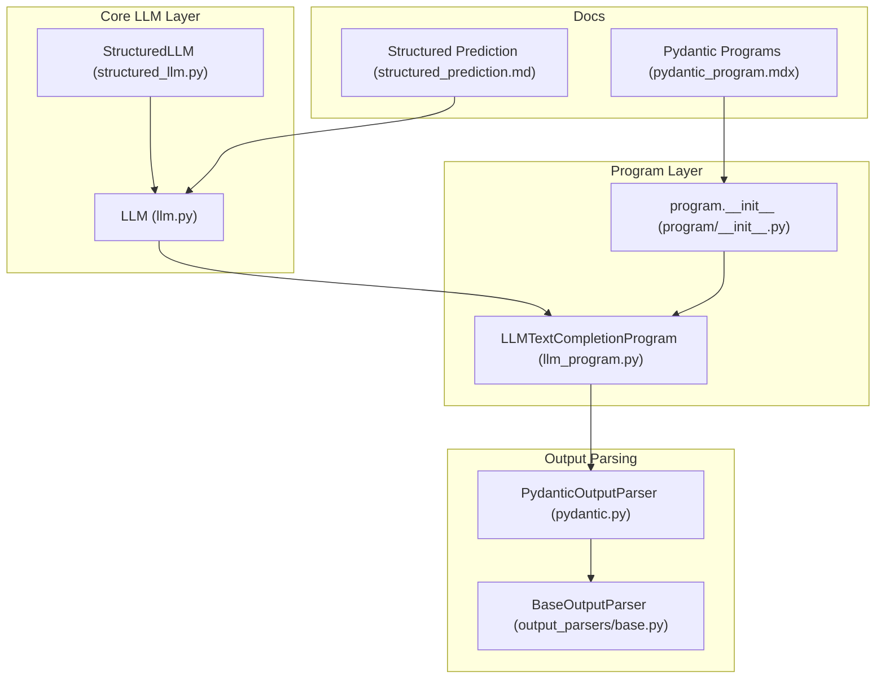
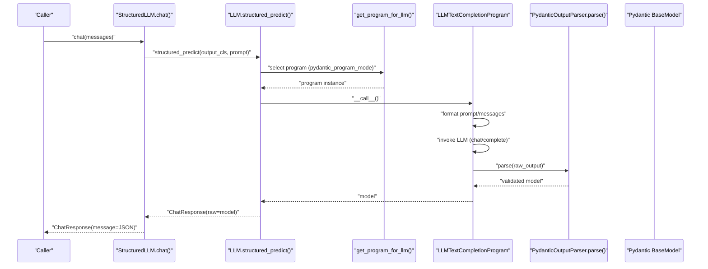
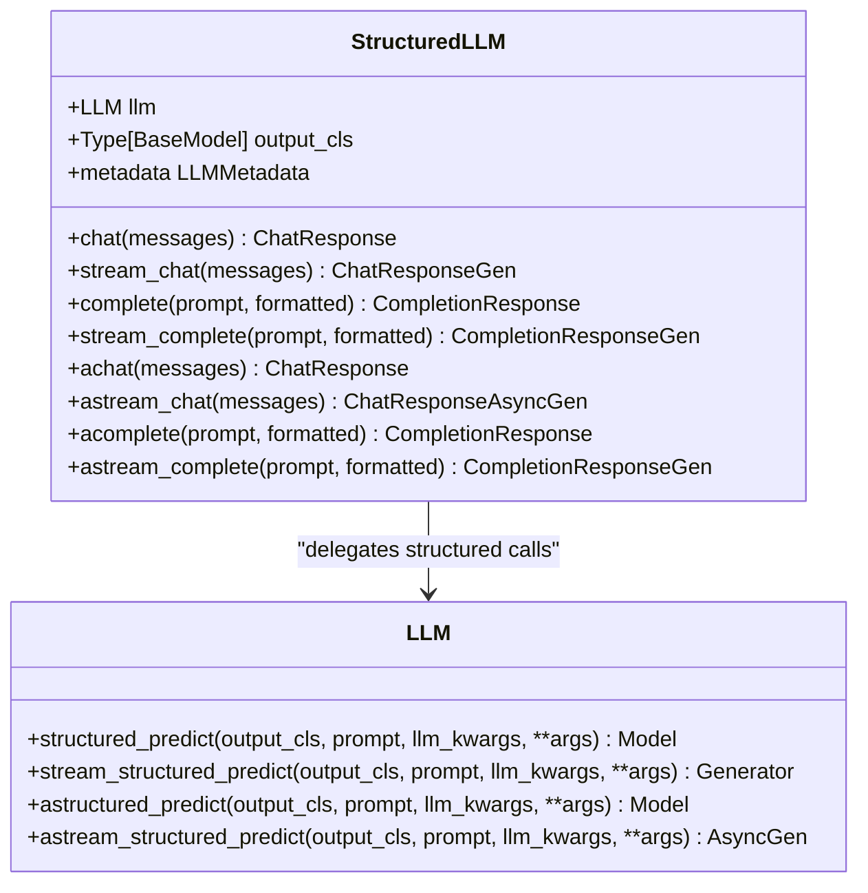
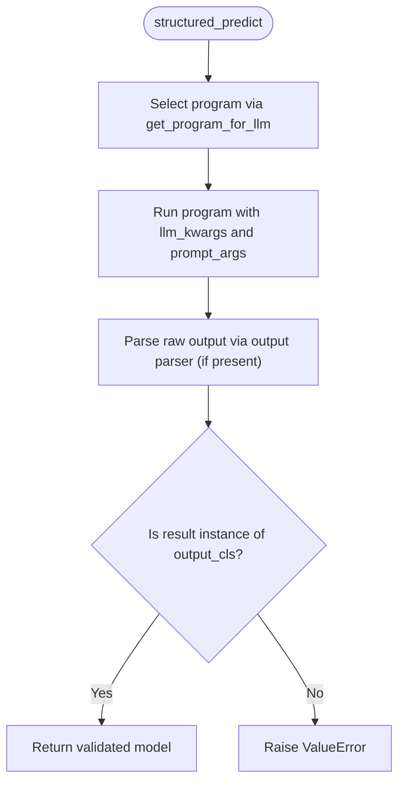
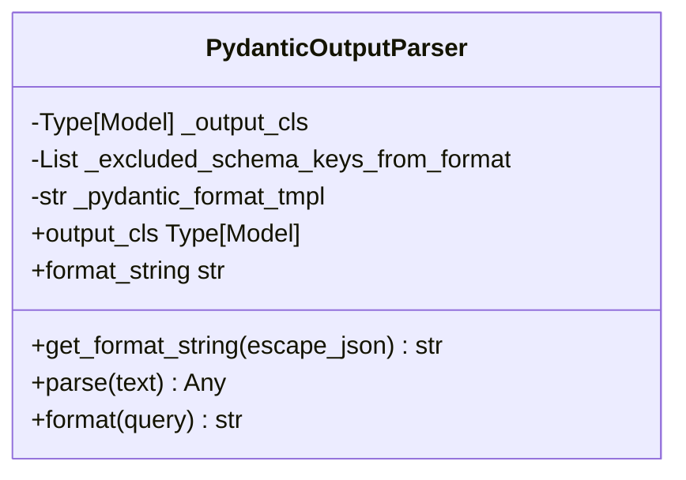
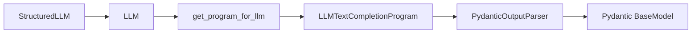

# Structured Outputs and Pydantic Integration

<cite>
**Referenced Files in This Document**
- [structured_llm.py](file://llama-index-core/llama_index/core/llms/structured_llm.py)
- [llm.py](file://llama-index-core/llama_index/core/llms/llm.py)
- [pydantic.py](file://llama-index-core/llama_index/core/output_parsers/pydantic.py)
- [base.py](file://llama-index-core/llama_index/core/output_parsers/base.py)
- [llm_program.py](file://llama-index-core/llama_index/core/program/llm_program.py)
- [__init__.py](file://llama-index-core/llama_index/core/program/__init__.py)
- [pydantic_program.mdx](file://docs/src/content/docs/framework/module_guides/querying/structured_outputs/pydantic_program.mdx)
- [structured_prediction.md](file://docs/src/content/docs/framework/understanding/extraction/structured_prediction.md)
</cite>

## Table of Contents
1. [Introduction](#introduction)
2. [Project Structure](#project-structure)
3. [Core Components](#core-components)
4. [Architecture Overview](#architecture-overview)
5. [Detailed Component Analysis](#detailed-component-analysis)
6. [Dependency Analysis](#dependency-analysis)
7. [Performance Considerations](#performance-considerations)
8. [Troubleshooting Guide](#troubleshooting-guide)
9. [Conclusion](#conclusion)
10. [Appendices](#appendices)

## Introduction
This document explains how LlamaIndex generates structured outputs using Pydantic models. It focuses on the structured_llm.py implementation and its role in orchestrating structured predictions via the underlying LLM interface. It documents the synchronous and asynchronous structured prediction APIs, streaming variants, and the integration with Pydantic program modes, output parsers, and validation mechanisms. Practical guidance is included for designing robust schemas, configuring output parsers, handling validation errors, leveraging streaming for partial structured outputs, and optimizing performance.

## Project Structure
The structured output pipeline spans several modules:
- LLM interface and structured prediction methods
- Structured LLM wrapper that adapts any LLM to produce Pydantic models
- Output parsers that extract and validate JSON against a Pydantic schema
- Program abstractions that encapsulate structured prediction workflows
- Documentation that describes program modes and usage patterns

**Diagram sources**
- [structured_llm.py](file://llama-index-core/llama_index/core/llms/structured_llm.py#L32-L164)
- [llm.py](file://llama-index-core/llama_index/core/llms/llm.py#L306-L584)
- [llm_program.py](file://llama-index-core/llama_index/core/program/llm_program.py#L10-L135)
- [pydantic.py](file://llama-index-core/llama_index/core/output_parsers/pydantic.py#L18-L68)
- [base.py](file://llama-index-core/llama_index/core/output_parsers/base.py#L7-L17)
- [__init__.py](file://llama-index-core/llama_index/core/program/__init__.py#L1-L14)
- [pydantic_program.mdx](file://docs/src/content/docs/framework/module_guides/querying/structured_outputs/pydantic_program.mdx#L1-L38)
- [structured_prediction.md](file://docs/src/content/docs/framework/understanding/extraction/structured_prediction.md)

**Section sources**
- [structured_llm.py](file://llama-index-core/llama_index/core/llms/structured_llm.py#L32-L164)
- [llm.py](file://llama-index-core/llama_index/core/llms/llm.py#L306-L584)
- [pydantic.py](file://llama-index-core/llama_index/core/output_parsers/pydantic.py#L18-L68)
- [llm_program.py](file://llama-index-core/llama_index/core/program/llm_program.py#L10-L135)
- [__init__.py](file://llama-index-core/llama_index/core/program/__init__.py#L1-L14)
- [pydantic_program.mdx](file://docs/src/content/docs/framework/module_guides/querying/structured_outputs/pydantic_program.mdx#L1-L38)
- [structured_prediction.md](file://docs/src/content/docs/framework/understanding/extraction/structured_prediction.md)

## Core Components
- StructuredLLM: A thin adapter around any LLM that forces all chat and streaming endpoints to return a Pydantic BaseModel instance by delegating to the underlying LLM’s structured_predict methods.
- LLM.structured_predict and async counterparts: The core engine that selects a program based on pydantic_program_mode, runs the prompt, and returns validated Pydantic models.
- LLMTextCompletionProgram: A program that uses generic text completion plus a PydanticOutputParser to produce structured outputs.
- PydanticOutputParser: Extracts JSON from raw LLM output and validates it against a target Pydantic schema.
- Program registry and modes: Program selection is delegated to get_program_for_llm, enabling different strategies (text completion, function calling, prepackaged) depending on provider capabilities.

Key responsibilities:
- Schema-driven formatting and injection into prompts
- Robust JSON extraction and validation
- Streaming of partial structured outputs
- Event dispatching for structured prediction lifecycle

**Section sources**
- [structured_llm.py](file://llama-index-core/llama_index/core/llms/structured_llm.py#L32-L164)
- [llm.py](file://llama-index-core/llama_index/core/llms/llm.py#L306-L584)
- [llm_program.py](file://llama-index-core/llama_index/core/program/llm_program.py#L10-L135)
- [pydantic.py](file://llama-index-core/llama_index/core/output_parsers/pydantic.py#L18-L68)
- [base.py](file://llama-index-core/llama_index/core/output_parsers/base.py#L7-L17)

## Architecture Overview
The structured output pipeline integrates LLMs, programs, and parsers to produce validated Pydantic models. The flow below maps the actual code paths.

**Diagram sources**
- [structured_llm.py](file://llama-index-core/llama_index/core/llms/structured_llm.py#L52-L71)
- [llm.py](file://llama-index-core/llama_index/core/llms/llm.py#L346-L364)
- [llm_program.py](file://llama-index-core/llama_index/core/program/llm_program.py#L82-L107)
- [pydantic.py](file://llama-index-core/llama_index/core/output_parsers/pydantic.py#L60-L63)

## Detailed Component Analysis

### StructuredLLM Adapter
StructuredLLM wraps an arbitrary LLM and ensures all chat and streaming chat calls return a Pydantic BaseModel by delegating to the underlying LLM’s structured_predict methods. It also exposes convenience completion and async endpoints that reuse the same pattern.

Highlights:
- Delegates chat to LLM.structured_predict
- Wraps ChatMessage sequences into a ChatPromptTemplate for program compatibility
- Streams structured outputs by yielding ChatResponse items containing partial JSON
- Async variants mirror sync behavior with async program calls

**Diagram sources**
- [structured_llm.py](file://llama-index-core/llama_index/core/llms/structured_llm.py#L32-L164)
- [llm.py](file://llama-index-core/llama_index/core/llms/llm.py#L306-L584)

**Section sources**
- [structured_llm.py](file://llama-index-core/llama_index/core/llms/structured_llm.py#L32-L164)

### LLM Structured Prediction Methods
The LLM class defines the core structured prediction APIs:
- structured_predict: Synchronous structured prediction using a selected program
- stream_structured_predict: Streaming structured prediction, yielding partial models
- astructured_predict and astream_structured_predict: Async equivalents
- Program selection is delegated to get_program_for_llm with pydantic_program_mode

Behavioral notes:
- Prompts are formatted and optionally extended with system prompts and wrappers
- Output parsers can be attached to prompts or LLMs to format and parse outputs
- Events are dispatched around structured prediction lifecycle

**Diagram sources**
- [llm.py](file://llama-index-core/llama_index/core/llms/llm.py#L346-L364)
- [llm_program.py](file://llama-index-core/llama_index/core/program/llm_program.py#L82-L107)

**Section sources**
- [llm.py](file://llama-index-core/llama_index/core/llms/llm.py#L306-L584)
- [llm_program.py](file://llama-index-core/llama_index/core/program/llm_program.py#L10-L135)

### PydanticOutputParser
The PydanticOutputParser:
- Generates a JSON schema string from the target BaseModel
- Optionally excludes keys from the schema when rendering instructions
- Injects schema-based formatting into prompts
- Extracts JSON from raw LLM output and validates it against the schema

Key methods:
- get_format_string: Builds a schema-instruction string and optionally escapes braces
- parse: Extracts JSON and validates it into the target BaseModel
- format: Appends formatting instructions to queries

**Diagram sources**
- [pydantic.py](file://llama-index-core/llama_index/core/output_parsers/pydantic.py#L18-L68)

**Section sources**
- [pydantic.py](file://llama-index-core/llama_index/core/output_parsers/pydantic.py#L18-L68)
- [base.py](file://llama-index-core/llama_index/core/output_parsers/base.py#L7-L17)

### Program Modes and Integration
Program modes determine how structured outputs are produced:
- Text Completion Programs: Use generic completion + output parsing
- Function Calling Programs: Use provider-native function calling APIs
- Prepackaged Programs: Use curated program types

The program registry exports BasePydanticProgram and concrete implementations, while documentation pages describe usage patterns and examples.

**Section sources**
- [__init__.py](file://llama-index-core/llama_index/core/program/__init__.py#L1-L14)
- [pydantic_program.mdx](file://docs/src/content/docs/framework/module_guides/querying/structured_outputs/pydantic_program.mdx#L1-L38)

## Dependency Analysis
The structured output stack exhibits clear layering:
- StructuredLLM depends on LLM for structured_predict and streaming variants
- LLM depends on program selection and output parsing
- Programs depend on PydanticOutputParser for validation
- Documentation guides define program modes and usage

**Diagram sources**
- [structured_llm.py](file://llama-index-core/llama_index/core/llms/structured_llm.py#L32-L164)
- [llm.py](file://llama-index-core/llama_index/core/llms/llm.py#L346-L364)
- [llm_program.py](file://llama-index-core/llama_index/core/program/llm_program.py#L10-L135)
- [pydantic.py](file://llama-index-core/llama_index/core/output_parsers/pydantic.py#L18-L68)

**Section sources**
- [structured_llm.py](file://llama-index-core/llama_index/core/llms/structured_llm.py#L32-L164)
- [llm.py](file://llama-index-core/llama_index/core/llms/llm.py#L306-L584)
- [llm_program.py](file://llama-index-core/llama_index/core/program/llm_program.py#L10-L135)
- [pydantic.py](file://llama-index-core/llama_index/core/output_parsers/pydantic.py#L18-L68)

## Performance Considerations
- Prefer streaming structured outputs when latency-sensitive workflows require early partial results. The LLM layer supports stream_structured_predict and astream_structured_predict.
- Minimize schema verbosity by excluding unnecessary keys from format instructions to reduce prompt size.
- Choose provider-native function calling when available for reduced round trips and improved reliability.
- Avoid attaching heavy output parsers during streaming, as the current streaming path does not support output parsing.
- Tune pydantic_program_mode to match provider capabilities and latency requirements.

[No sources needed since this section provides general guidance]

## Troubleshooting Guide
Common issues and recovery patterns:
- Validation errors: PydanticOutputParser.parse raises validation errors when JSON extraction fails or schema validation fails. Wrap calls with try/except and re-prompt with clearer instructions or refined schemas.
- Type mismatches: LLMTextCompletionProgram checks that the parser returns the expected output_cls and raises a ValueError otherwise. Ensure the output parser matches the intended model.
- Streaming limitations: Output parsing is not supported in streaming paths. If you need structured parsing with streaming, consider validating partial JSON externally or switching to non-streaming structured_predict.
- Program mode mismatch: If a function-calling program is selected but the provider does not support it, fallback to text completion programs or adjust pydantic_program_mode.

**Section sources**
- [pydantic.py](file://llama-index-core/llama_index/core/output_parsers/pydantic.py#L60-L63)
- [llm_program.py](file://llama-index-core/llama_index/core/program/llm_program.py#L103-L106)
- [llm.py](file://llama-index-core/llama_index/core/llms/llm.py#L676-L677)
- [llm.py](file://llama-index-core/llama_index/core/llms/llm.py#L772-L773)

## Conclusion
LlamaIndex’s structured output system centers on the LLM interface’s structured_predict family of methods, which delegate to pluggable programs and parsers. StructuredLLM provides a convenient adapter to force any LLM into returning Pydantic models. PydanticOutputParser supplies schema-aware formatting and robust validation. With streaming support and configurable program modes, the system balances flexibility, correctness, and performance.

[No sources needed since this section summarizes without analyzing specific files]

## Appendices

### API Reference Highlights
- StructuredLLM.chat/stream_chat/achat/astream_chat: Adapt chat calls to return Pydantic models
- LLM.structured_predict/stream_structured_predict/astructured_predict/astream_structured_predict: Core structured prediction APIs
- PydanticOutputParser.get_format_string/format/parse: Schema formatting and validation
- Program modes: Text completion, function calling, and prepackaged programs

**Section sources**
- [structured_llm.py](file://llama-index-core/llama_index/core/llms/structured_llm.py#L52-L164)
- [llm.py](file://llama-index-core/llama_index/core/llms/llm.py#L306-L584)
- [pydantic.py](file://llama-index-core/llama_index/core/output_parsers/pydantic.py#L18-L68)
- [pydantic_program.mdx](file://docs/src/content/docs/framework/module_guides/querying/structured_outputs/pydantic_program.mdx#L1-L38)