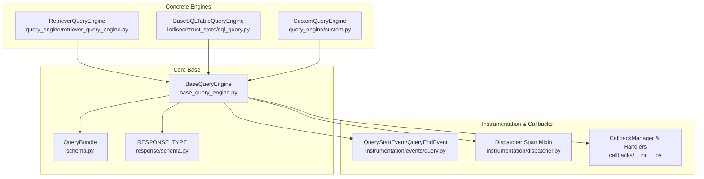
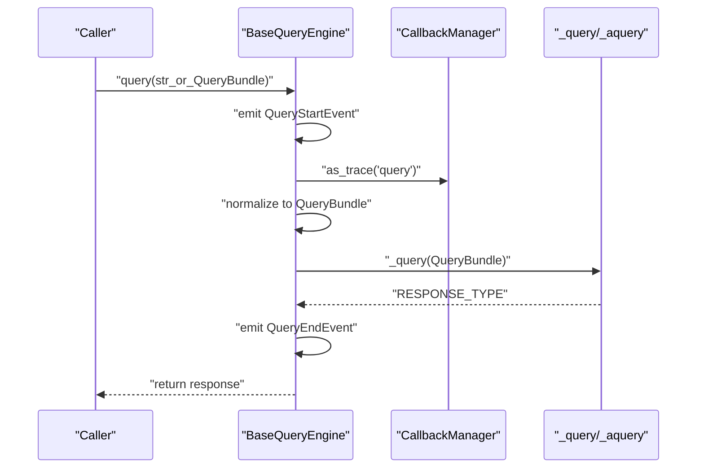
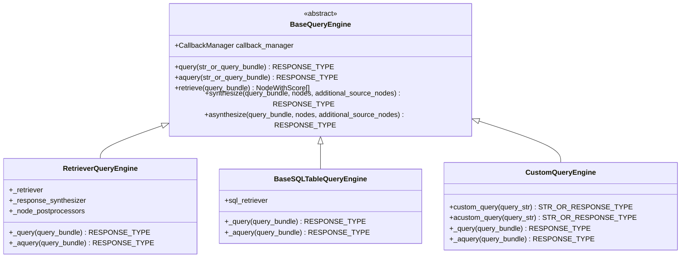
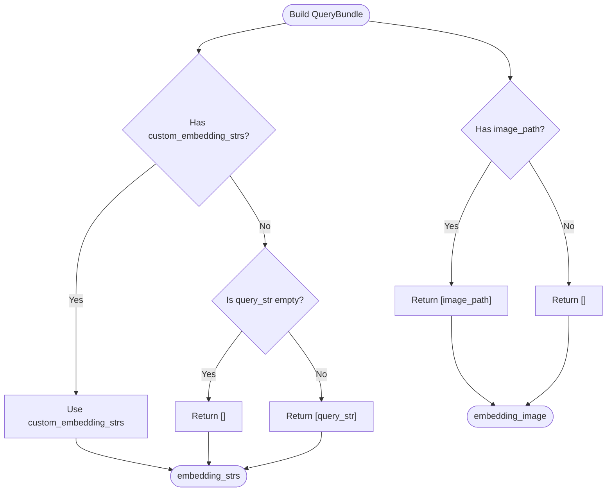
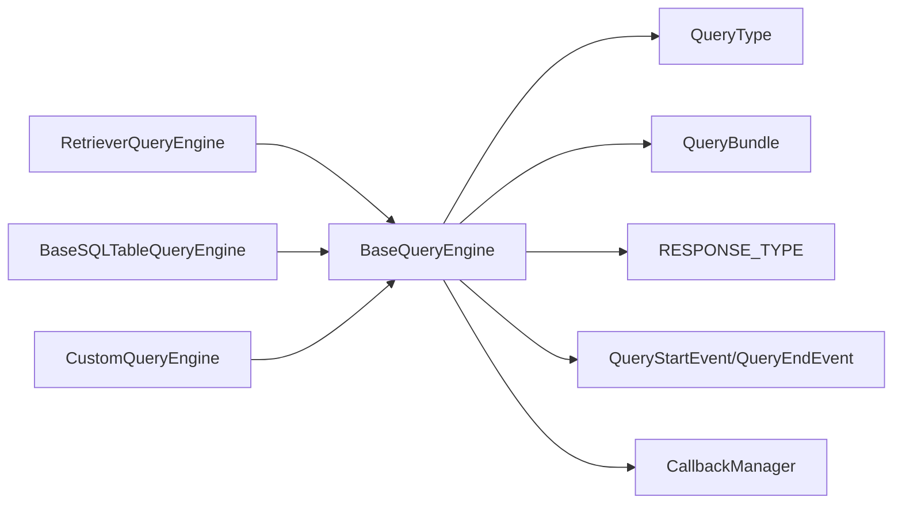

# Base Query Engine

<cite>
**Referenced Files in This Document**
- [base_query_engine.py](file://llama-index-core/llama_index/core/base/base_query_engine.py)
- [schema.py](file://llama-index-core/llama_index/core/schema.py)
- [response/schema.py](file://llama-index-core/llama_index/core/base/response/schema.py)
- [events/query.py](file://llama-index-core/llama_index/core/instrumentation/events/query.py)
- [dispatcher.py](file://llama-index-core/llama_index/core/instrumentation/dispatcher.py)
- [callbacks/__init__.py](file://llama-index-core/llama_index/core/callbacks/__init__.py)
- [custom.py](file://llama-index-core/llama_index/core/query_engine/custom.py)
- [retriever_query_engine.py](file://llama-index-core/llama_index/core/query_engine/retriever_query_engine.py)
- [sql_query.py](file://llama-index-core/llama_index/core/indices/struct_store/sql_query.py)
</cite>

## Table of Contents
1. [Introduction](#introduction)
2. [Project Structure](#project-structure)
3. [Core Components](#core-components)
4. [Architecture Overview](#architecture-overview)
5. [Detailed Component Analysis](#detailed-component-analysis)
6. [Dependency Analysis](#dependency-analysis)
7. [Performance Considerations](#performance-considerations)
8. [Troubleshooting Guide](#troubleshooting-guide)
9. [Conclusion](#conclusion)

## Introduction
This document explains the BaseQueryEngine class and its central role in the LlamaIndex query processing architecture. It covers the abstract base class design, the public query and aquery entry points, asynchronous support, callback and instrumentation integration, the QueryBundle interface, response handling, and practical extension patterns. It also addresses thread safety, error handling, and performance optimization techniques.

## Project Structure
BaseQueryEngine resides in the core base module and is extended by specialized engines such as RetrieverQueryEngine and BaseSQLTableQueryEngine. Supporting types and responses live in schema and response modules, while instrumentation and callbacks provide tracing and event hooks.

**Diagram sources**
- [base_query_engine.py](file://llama-index-core/llama_index/core/base/base_query_engine.py#L22-L94)
- [schema.py](file://llama-index-core/llama_index/core/schema.py#L1363-L1408)
- [response/schema.py](file://llama-index-core/llama_index/core/base/response/schema.py#L239-L242)
- [events/query.py](file://llama-index-core/llama_index/core/instrumentation/events/query.py#L6-L40)
- [dispatcher.py](file://llama-index-core/llama_index/core/instrumentation/dispatcher.py#L1-L9)
- [callbacks/__init__.py](file://llama-index-core/llama_index/core/callbacks/__init__.py#L1-L18)
- [retriever_query_engine.py](file://llama-index-core/llama_index/core/query_engine/retriever_query_engine.py#L25-L226)
- [sql_query.py](file://llama-index-core/llama_index/core/indices/struct_store/sql_query.py#L321-L468)
- [custom.py](file://llama-index-core/llama_index/core/query_engine/custom.py#L16-L78)

**Section sources**
- [base_query_engine.py](file://llama-index-core/llama_index/core/base/base_query_engine.py#L22-L94)
- [schema.py](file://llama-index-core/llama_index/core/schema.py#L1363-L1408)
- [response/schema.py](file://llama-index-core/llama_index/core/base/response/schema.py#L239-L242)
- [events/query.py](file://llama-index-core/llama_index/core/instrumentation/events/query.py#L6-L40)
- [dispatcher.py](file://llama-index-core/llama_index/core/instrumentation/dispatcher.py#L1-L9)
- [callbacks/__init__.py](file://llama-index-core/llama_index/core/callbacks/__init__.py#L1-L18)
- [retriever_query_engine.py](file://llama-index-core/llama_index/core/query_engine/retriever_query_engine.py#L25-L226)
- [sql_query.py](file://llama-index-core/llama_index/core/indices/struct_store/sql_query.py#L321-L468)
- [custom.py](file://llama-index-core/llama_index/core/query_engine/custom.py#L16-L78)

## Core Components
- BaseQueryEngine: Abstract base class defining the query lifecycle, asynchronous support, and optional retrieve/synthesize hooks. It integrates instrumentation via a dispatcher span mixin and callback tracing.
- QueryBundle: A typed data structure carrying the query string and optional embeddings/images for multimodal or embedding-based queries.
- RESPONSE_TYPE: Union of supported response types including standard, streaming, and Pydantic responses.
- Instrumentation: QueryStartEvent and QueryEndEvent emitted around query execution; DispatcherSpanMixin adds span wrapping.
- Callbacks: CallbackManager enables tracing and event emission during query execution.

Key responsibilities:
- Normalize input to QueryBundle
- Emit instrumentation events
- Delegate to protected abstract methods for execution
- Support synchronous and asynchronous flows

**Section sources**
- [base_query_engine.py](file://llama-index-core/llama_index/core/base/base_query_engine.py#L22-L94)
- [schema.py](file://llama-index-core/llama_index/core/schema.py#L1363-L1408)
- [response/schema.py](file://llama-index-core/llama_index/core/base/response/schema.py#L239-L242)
- [events/query.py](file://llama-index-core/llama_index/core/instrumentation/events/query.py#L6-L40)
- [dispatcher.py](file://llama-index-core/llama_index/core/instrumentation/dispatcher.py#L1-L9)
- [callbacks/__init__.py](file://llama-index-core/llama_index/core/callbacks/__init__.py#L1-L18)

## Architecture Overview
The BaseQueryEngine orchestrates a standardized flow for all query engines:
- Accept a string or QueryBundle
- Wrap in a QueryBundle if needed
- Emit a start event
- Trace the operation via CallbackManager
- Call the protected abstract _query or _aquery
- Emit an end event with the response
- Return the response

**Diagram sources**
- [base_query_engine.py](file://llama-index-core/llama_index/core/base/base_query_engine.py#L38-L48)
- [events/query.py](file://llama-index-core/llama_index/core/instrumentation/events/query.py#L6-L40)
- [callbacks/__init__.py](file://llama-index-core/llama_index/core/callbacks/__init__.py#L1-L18)

## Detailed Component Analysis

### BaseQueryEngine
- Initialization: Stores a CallbackManager (defaults to empty if none provided).
- Public API:
  - query: Synchronous entry point; normalizes input, emits events, traces, and delegates to _query.
  - aquery: Asynchronous entry point; mirrors query with async delegation to _aquery.
- Protected abstract API:
  - _query: Implemented by subclasses to perform the actual work.
  - _aquery: Implemented by subclasses to perform async work.
- Optional helpers:
  - retrieve/synthesize/asynthesize: Raise NotImplementedError by default; engines that support retrieval and synthesis override them.
- Instrumentation:
  - Uses dispatcher.span decorators and emits QueryStartEvent/QueryEndEvent.
- Prompt integration:
  - Inherits from PromptMixin; subclasses can expose prompt modules via _get_prompt_modules and update prompts via _update_prompts.

**Diagram sources**
- [base_query_engine.py](file://llama-index-core/llama_index/core/base/base_query_engine.py#L22-L94)
- [retriever_query_engine.py](file://llama-index-core/llama_index/core/query_engine/retriever_query_engine.py#L25-L226)
- [sql_query.py](file://llama-index-core/llama_index/core/indices/struct_store/sql_query.py#L321-L468)
- [custom.py](file://llama-index-core/llama_index/core/query_engine/custom.py#L16-L78)

**Section sources**
- [base_query_engine.py](file://llama-index-core/llama_index/core/base/base_query_engine.py#L22-L94)

### QueryBundle Interface
- Purpose: Encapsulates the user query and optional embeddings/images for multimodal or embedding-based retrieval.
- Fields:
  - query_str: The primary query string.
  - image_path: Optional image path for multimodal queries.
  - custom_embedding_strs: Optional list of strings used for generating embeddings.
  - embedding: Optional precomputed embedding vector.
- Computed properties:
  - embedding_strs: Returns custom_embedding_strs or defaults to [query_str] (or [] if empty).
  - embedding_image: Returns [image_path] if present, else [].
- QueryType: Union[str, QueryBundle].

**Diagram sources**
- [schema.py](file://llama-index-core/llama_index/core/schema.py#L1363-L1408)

**Section sources**
- [schema.py](file://llama-index-core/llama_index/core/schema.py#L1363-L1408)

### Response Handling Mechanisms
- RESPONSE_TYPE union supports:
  - Standard Response
  - StreamingResponse
  - AsyncStreamingResponse
  - PydanticResponse
- Engines return one of these types; callers receive the appropriate variant depending on the engine’s implementation and configuration.

Practical implications:
- Engines may stream tokens or chunks; callers should handle streaming variants accordingly.
- PydanticResponse allows structured outputs when configured.

**Section sources**
- [response/schema.py](file://llama-index-core/llama_index/core/base/response/schema.py#L239-L242)

### Instrumentation Features
- Events:
  - QueryStartEvent: Emitted before execution.
  - QueryEndEvent: Emitted after completion with the response.
- Dispatcher:
  - BaseQueryEngine uses dispatcher.span decorators to wrap query/aquery.
  - DispatcherSpanMixin integrates with the instrumentation subsystem.

Integration pattern:
- Engines inherit instrumentation capabilities automatically.
- Observability stacks can subscribe to these events for tracing and metrics.

**Section sources**
- [events/query.py](file://llama-index-core/llama_index/core/instrumentation/events/query.py#L6-L40)
- [dispatcher.py](file://llama-index-core/llama_index/core/instrumentation/dispatcher.py#L1-L9)
- [base_query_engine.py](file://llama-index-core/llama_index/core/base/base_query_engine.py#L38-L48)

### Callback Integration Patterns
- CallbackManager:
  - Passed into BaseQueryEngine constructor; used to trace the "query" operation.
  - Provides event emission and handlers for metrics/logging.
- Handler types include token counting, debug printing, and others.

Usage:
- Engines can reuse the inherited callback_manager for nested operations (e.g., response synthesis).
- Handlers attached to the callback_manager observe query lifecycle events.

**Section sources**
- [callbacks/__init__.py](file://llama-index-core/llama_index/core/callbacks/__init__.py#L1-L18)
- [base_query_engine.py](file://llama-index-core/llama_index/core/base/base_query_engine.py#L25-L29)

### Practical Extension Examples

#### Extending BaseQueryEngine with a Custom Engine
- Pattern: Subclass BaseQueryEngine and implement _query and _aquery.
- Example engines:
  - CustomQueryEngine: Demonstrates a simplified custom engine that converts strings to responses and optionally streams.
  - RetrieverQueryEngine: Implements retrieval, optional postprocessing, and synthesis.
  - BaseSQLTableQueryEngine: Implements SQL retrieval and optional synthesis with prompts.

Implementation tips:
- Use QueryBundle for normalized input.
- Leverage callback_manager.as_trace for nested operations.
- Emit instrumentation events around major steps.

**Section sources**
- [custom.py](file://llama-index-core/llama_index/core/query_engine/custom.py#L16-L78)
- [retriever_query_engine.py](file://llama-index-core/llama_index/core/query_engine/retriever_query_engine.py#L25-L226)
- [sql_query.py](file://llama-index-core/llama_index/core/indices/struct_store/sql_query.py#L321-L468)

#### Asynchronous Query Support
- Implement _aquery in addition to _query.
- Engines like BaseSQLTableQueryEngine and RetrieverQueryEngine demonstrate async retrieval and synthesis.

Best practices:
- Ensure async paths propagate cancellation and exceptions.
- Use callback_manager.as_trace consistently in async contexts.

**Section sources**
- [base_query_engine.py](file://llama-index-core/llama_index/core/base/base_query_engine.py#L50-L59)
- [sql_query.py](file://llama-index-core/llama_index/core/indices/struct_store/sql_query.py#L438-L468)
- [retriever_query_engine.py](file://llama-index-core/llama_index/core/query_engine/retriever_query_engine.py#L190-L226)

### Thread Safety Considerations
- BaseQueryEngine stores a CallbackManager instance; ensure it is safe to share across threads if used concurrently.
- Engines should avoid mutating shared mutable state during query execution.
- When integrating external services, use thread-safe clients and guard shared resources.

[No sources needed since this section provides general guidance]

### Error Handling Patterns
- NotImplementedError for unsupported operations (retrieve/synthesize/asynthesize) encourages explicit overrides in engines that support them.
- Asynchronous engines should propagate exceptions from _aquery to callers.
- Instrumentation ensures errors are captured via events and spans.

**Section sources**
- [base_query_engine.py](file://llama-index-core/llama_index/core/base/base_query_engine.py#L62-L84)

## Dependency Analysis
BaseQueryEngine depends on:
- Schema types: QueryBundle, QueryType, NodeWithScore
- Response types: RESPONSE_TYPE
- Instrumentation: DispatcherSpanMixin, QueryStartEvent/QueryEndEvent
- Callbacks: CallbackManager

Concrete engines depend on BaseQueryEngine and often on:
- Retrievers and response synthesizers
- LLMs and prompt templates
- Postprocessors

**Diagram sources**
- [base_query_engine.py](file://llama-index-core/llama_index/core/base/base_query_engine.py#L22-L94)
- [schema.py](file://llama-index-core/llama_index/core/schema.py#L1363-L1408)
- [response/schema.py](file://llama-index-core/llama_index/core/base/response/schema.py#L239-L242)
- [events/query.py](file://llama-index-core/llama_index/core/instrumentation/events/query.py#L6-L40)
- [callbacks/__init__.py](file://llama-index-core/llama_index/core/callbacks/__init__.py#L1-L18)
- [retriever_query_engine.py](file://llama-index-core/llama_index/core/query_engine/retriever_query_engine.py#L25-L226)
- [sql_query.py](file://llama-index-core/llama_index/core/indices/struct_store/sql_query.py#L321-L468)
- [custom.py](file://llama-index-core/llama_index/core/query_engine/custom.py#L16-L78)

**Section sources**
- [base_query_engine.py](file://llama-index-core/llama_index/core/base/base_query_engine.py#L22-L94)
- [retriever_query_engine.py](file://llama-index-core/llama_index/core/query_engine/retriever_query_engine.py#L25-L226)
- [sql_query.py](file://llama-index-core/llama_index/core/indices/struct_store/sql_query.py#L321-L468)
- [custom.py](file://llama-index-core/llama_index/core/query_engine/custom.py#L16-L78)

## Performance Considerations
- Minimize redundant normalization: If callers pass QueryBundle, avoid re-wrapping.
- Stream responses when possible to reduce latency and memory footprint.
- Reuse CallbackManager across nested operations to avoid overhead.
- Keep prompt updates minimal; prompt validation occurs in engines like BaseSQLTableQueryEngine.
- For async engines, ensure efficient async retrieval and synthesis pipelines.

[No sources needed since this section provides general guidance]

## Troubleshooting Guide
Common issues and resolutions:
- Unsupported retrieve/synthesize: If your engine does not support retrieval or synthesis, expect NotImplementedError; override these methods explicitly if needed.
- Missing instrumentation: Ensure dispatcher.span decorators are applied to your _query/_aquery methods.
- Callback not firing: Verify that CallbackManager is provided and handlers are registered.
- Incorrect response type: Confirm your engine returns one of the types in RESPONSE_TYPE.

**Section sources**
- [base_query_engine.py](file://llama-index-core/llama_index/core/base/base_query_engine.py#L62-L84)
- [events/query.py](file://llama-index-core/llama_index/core/instrumentation/events/query.py#L6-L40)
- [callbacks/__init__.py](file://llama-index-core/llama_index/core/callbacks/__init__.py#L1-L18)

## Conclusion
BaseQueryEngine defines a consistent, extensible foundation for query execution in LlamaIndex. By normalizing inputs, emitting instrumentation events, and integrating with callbacks, it enables robust, observable, and customizable query engines. Concrete engines like RetrieverQueryEngine, BaseSQLTableQueryEngine, and CustomQueryEngine demonstrate how to implement retrieval, synthesis, and custom logic while leveraging the shared infrastructure.