# Custom Query Engine Development

<cite>
**Referenced Files in This Document**
- [base_query_engine.py](file://llama-index-core/llama_index/core/base/base_query_engine.py)
- [custom.py](file://llama-index-core/llama_index/core/query_engine/custom.py)
- [retriever_query_engine.py](file://llama-index-core/llama_index/core/query_engine/retriever_query_engine.py)
- [multistep_query_engine.py](file://llama-index-core/llama_index/core/query_engine/multistep_query_engine.py)
- [router_query_engine.py](file://llama-index-core/llama_index/core/query_engine/router_query_engine.py)
- [factory.py](file://llama-index-core/llama_index/core/response_synthesizers/factory.py)
- [refine.py](file://llama-index-core/llama_index/core/response_synthesizers/refine.py)
- [tree_summarize.py](file://llama-index-core/llama_index/core/response_synthesizers/tree_summarize.py)
- [fusion_retriever.py](file://llama-index-core/llama_index/core/retrievers/fusion_retriever.py)
- [router_retriever.py](file://llama-index-core/llama_index/core/retrievers/router_retriever.py)
</cite>

## Table of Contents
1. [Introduction](#introduction)
2. [Project Structure](#project-structure)
3. [Core Components](#core-components)
4. [Architecture Overview](#architecture-overview)
5. [Detailed Component Analysis](#detailed-component-analysis)
6. [Dependency Analysis](#dependency-analysis)
7. [Performance Considerations](#performance-considerations)
8. [Testing Strategies](#testing-strategies)
9. [Production Deployment Considerations](#production-deployment-considerations)
10. [Troubleshooting Guide](#troubleshooting-guide)
11. [Conclusion](#conclusion)

## Introduction
This document explains how to develop custom query engines in LlamaIndex. It focuses on the factory pattern for query engine creation, custom retrieval strategies, and integrated response synthesis approaches. You will learn how to compose different retrievers and synthesizers into cohesive pipelines, implement custom scoring functions, integrate external APIs, and adopt robust testing and deployment practices.

## Project Structure
The relevant parts of the codebase for custom query engines are organized around three pillars:
- Base abstractions for query engines
- Factory-based response synthesizers
- Retrievers and router engines that orchestrate retrieval and synthesis

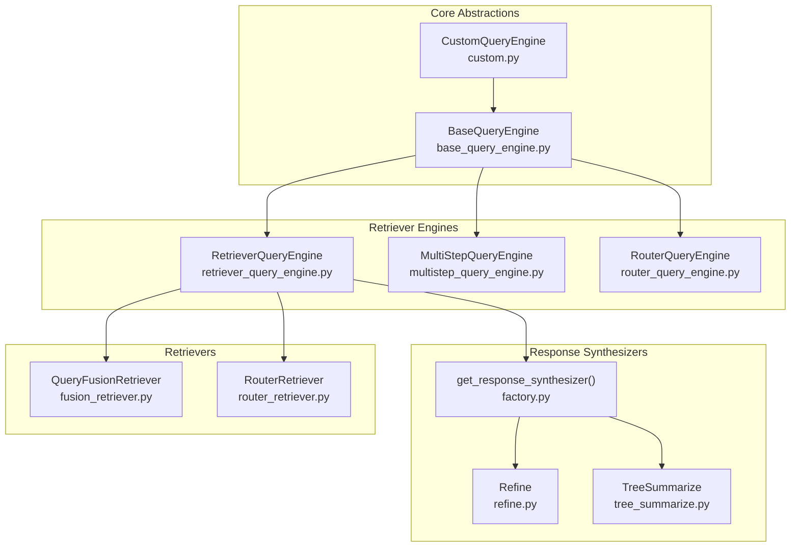

**Diagram sources**
- [base_query_engine.py](file://llama-index-core/llama_index/core/base/base_query_engine.py#L22-L94)
- [custom.py](file://llama-index-core/llama_index/core/query_engine/custom.py#L16-L78)
- [retriever_query_engine.py](file://llama-index-core/llama_index/core/query_engine/retriever_query_engine.py#L25-L226)
- [multistep_query_engine.py](file://llama-index-core/llama_index/core/query_engine/multistep_query_engine.py#L26-L179)
- [router_query_engine.py](file://llama-index-core/llama_index/core/query_engine/router_query_engine.py#L95-L398)
- [factory.py](file://llama-index-core/llama_index/core/response_synthesizers/factory.py#L33-L152)
- [refine.py](file://llama-index-core/llama_index/core/response_synthesizers/refine.py#L108-L522)
- [tree_summarize.py](file://llama-index-core/llama_index/core/response_synthesizers/tree_summarize.py#L17-L231)
- [fusion_retriever.py](file://llama-index-core/llama_index/core/retrievers/fusion_retriever.py#L33-L305)
- [router_retriever.py](file://llama-index-core/llama_index/core/retrievers/router_retriever.py#L20-L143)

**Section sources**
- [base_query_engine.py](file://llama-index-core/llama_index/core/base/base_query_engine.py#L22-L94)
- [factory.py](file://llama-index-core/llama_index/core/response_synthesizers/factory.py#L33-L152)

## Core Components
- BaseQueryEngine defines the contract for synchronous and asynchronous query execution, and exposes hooks for instrumentation and callbacks.
- CustomQueryEngine provides a convenient Pydantic-based abstraction for building custom engines with optional async support.
- RetrieverQueryEngine composes a retriever with a response synthesizer via a factory, enabling flexible retrieval and synthesis pipelines.
- RouterQueryEngine selects among multiple query engines and aggregates their responses.
- MultiStepQueryEngine orchestrates iterative query decomposition and synthesis.
- Response synthesizer factory returns concrete synthesizers based on mode and configuration.
- Refine and TreeSummarize implement iterative refinement and hierarchical summarization.

**Section sources**
- [base_query_engine.py](file://llama-index-core/llama_index/core/base/base_query_engine.py#L22-L94)
- [custom.py](file://llama-index-core/llama_index/core/query_engine/custom.py#L16-L78)
- [retriever_query_engine.py](file://llama-index-core/llama_index/core/query_engine/retriever_query_engine.py#L25-L226)
- [router_query_engine.py](file://llama-index-core/llama_index/core/query_engine/router_query_engine.py#L95-L398)
- [multistep_query_engine.py](file://llama-index-core/llama_index/core/query_engine/multistep_query_engine.py#L26-L179)
- [factory.py](file://llama-index-core/llama_index/core/response_synthesizers/factory.py#L33-L152)
- [refine.py](file://llama-index-core/llama_index/core/response_synthesizers/refine.py#L108-L522)
- [tree_summarize.py](file://llama-index-core/llama_index/core/response_synthesizers/tree_summarize.py#L17-L231)

## Architecture Overview
The recommended architecture for a custom query engine pipeline:
- Retrieve relevant nodes from one or more retrievers
- Optionally post-process nodes
- Synthesize a final response using a configured synthesizer
- Aggregate or route responses across multiple engines when needed

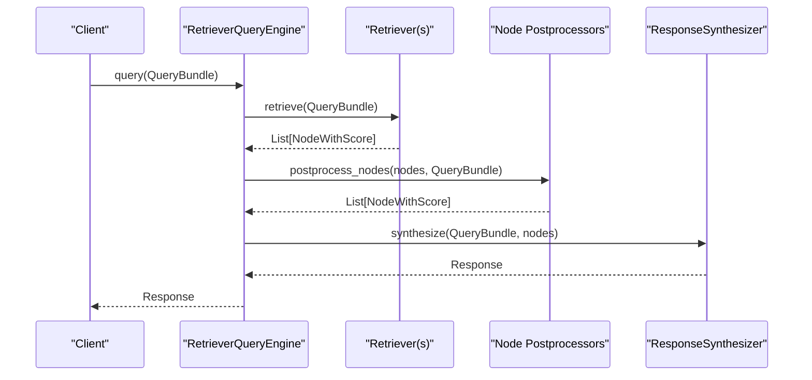

**Diagram sources**
- [retriever_query_engine.py](file://llama-index-core/llama_index/core/query_engine/retriever_query_engine.py#L148-L203)
- [factory.py](file://llama-index-core/llama_index/core/response_synthesizers/factory.py#L33-L152)

## Detailed Component Analysis

### Factory Pattern for Response Synthesizers
The factory returns a synthesizer instance based on the chosen mode and configuration. It wires templates, prompt helpers, and streaming/async options.

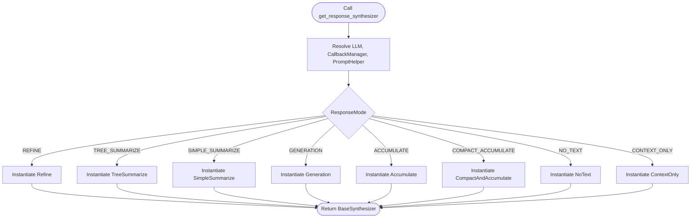

**Diagram sources**
- [factory.py](file://llama-index-core/llama_index/core/response_synthesizers/factory.py#L33-L152)

**Section sources**
- [factory.py](file://llama-index-core/llama_index/core/response_synthesizers/factory.py#L33-L152)

### RetrieverQueryEngine Pipeline
RetrieverQueryEngine encapsulates retrieval, optional postprocessing, and synthesis. It supports async retrieval and synthesis and exposes convenience constructors.

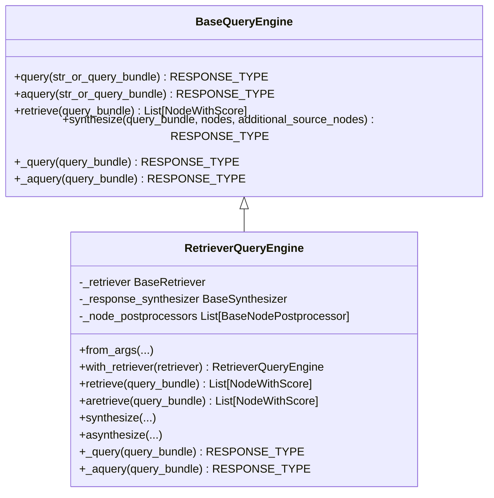

**Diagram sources**
- [base_query_engine.py](file://llama-index-core/llama_index/core/base/base_query_engine.py#L22-L94)
- [retriever_query_engine.py](file://llama-index-core/llama_index/core/query_engine/retriever_query_engine.py#L25-L226)

**Section sources**
- [retriever_query_engine.py](file://llama-index-core/llama_index/core/query_engine/retriever_query_engine.py#L25-L226)

### RouterQueryEngine: Multi-Engine Orchestration
RouterQueryEngine selects one or multiple engines based on a selector and combines their responses with a summarizer.

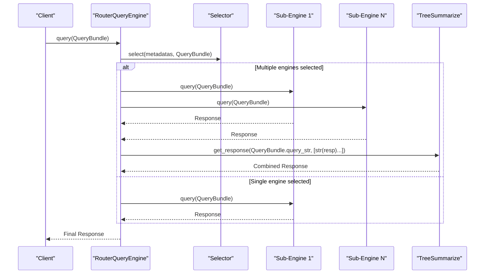

**Diagram sources**
- [router_query_engine.py](file://llama-index-core/llama_index/core/query_engine/router_query_engine.py#L95-L248)
- [tree_summarize.py](file://llama-index-core/llama_index/core/response_synthesizers/tree_summarize.py#L17-L231)

**Section sources**
- [router_query_engine.py](file://llama-index-core/llama_index/core/query_engine/router_query_engine.py#L95-L248)

### MultiStepQueryEngine: Iterative Decomposition
MultiStepQueryEngine iteratively decomposes a query using a query transform, executes against a base engine, and synthesizes a final response.

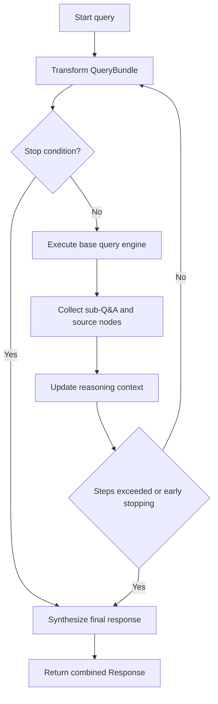

**Diagram sources**
- [multistep_query_engine.py](file://llama-index-core/llama_index/core/query_engine/multistep_query_engine.py#L126-L179)

**Section sources**
- [multistep_query_engine.py](file://llama-index-core/llama_index/core/query_engine/multistep_query_engine.py#L26-L179)

### Custom Retrieval Strategies

#### Fusion Retrieval
QueryFusionRetriever generates multiple queries and fuses results from multiple retrievers using configurable fusion modes.

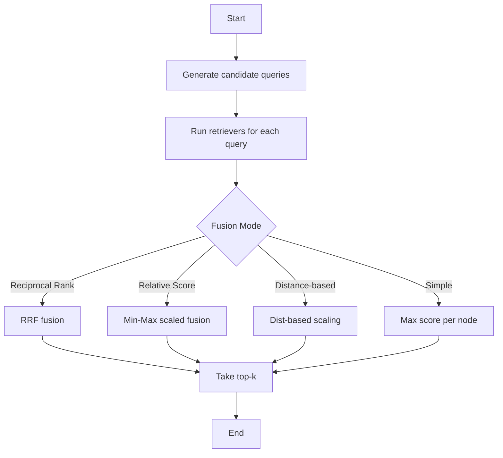

**Diagram sources**
- [fusion_retriever.py](file://llama-index-core/llama_index/core/retrievers/fusion_retriever.py#L33-L305)

**Section sources**
- [fusion_retriever.py](file://llama-index-core/llama_index/core/retrievers/fusion_retriever.py#L33-L305)

#### Router Retriever
RouterRetriever selects one or multiple retrievers based on a selector and metadata.

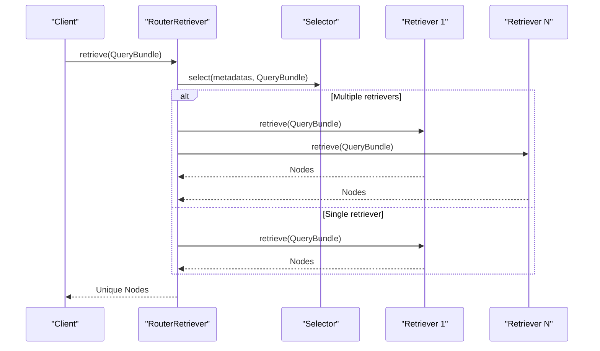

**Diagram sources**
- [router_retriever.py](file://llama-index-core/llama_index/core/retrievers/router_retriever.py#L78-L143)

**Section sources**
- [router_retriever.py](file://llama-index-core/llama_index/core/retrievers/router_retriever.py#L20-L143)

### Integrated Response Synthesis Approaches

#### Refine: Iterative Answer Refinement
Refine progressively refines an initial answer by incorporating new context chunks, optionally using structured programs for validation.

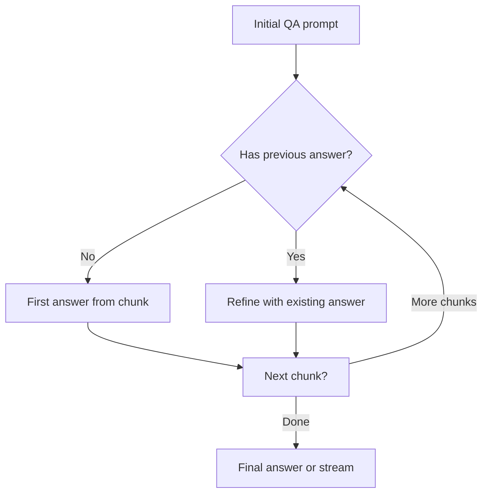

**Diagram sources**
- [refine.py](file://llama-index-core/llama_index/core/response_synthesizers/refine.py#L162-L348)

**Section sources**
- [refine.py](file://llama-index-core/llama_index/core/response_synthesizers/refine.py#L108-L522)

#### TreeSummarize: Hierarchical Aggregation
TreeSummarize recursively summarizes groups of chunks until a single response remains, supporting both sync and async modes.

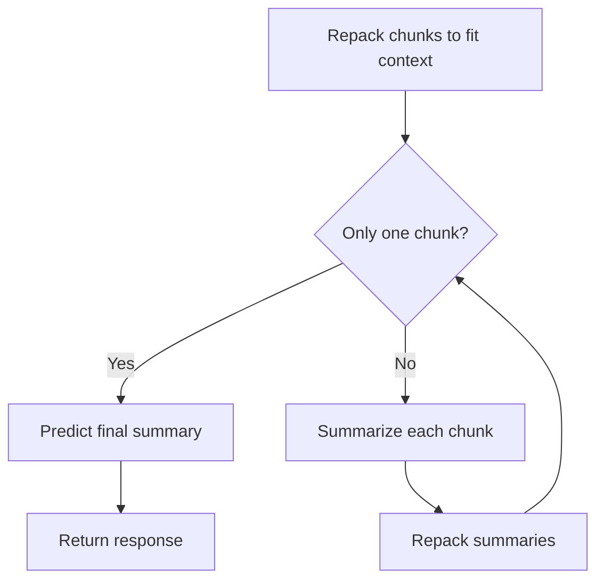

**Diagram sources**
- [tree_summarize.py](file://llama-index-core/llama_index/core/response_synthesizers/tree_summarize.py#L134-L231)

**Section sources**
- [tree_summarize.py](file://llama-index-core/llama_index/core/response_synthesizers/tree_summarize.py#L17-L231)

### Building Specialized Query Engines

- CustomQueryEngine: Extend the Pydantic-based engine to implement domain-specific logic. It supports both sync and async custom query methods and integrates with the callback manager.
- RetrieverQueryEngine: Compose any retriever with a synthesizer created via the factory. Use from_args to configure templates, modes, and streaming.
- RouterQueryEngine: Route to multiple engines and combine results with TreeSummarize.
- MultiStepQueryEngine: Chain query transforms with a base engine and synthesizer for iterative reasoning.

**Section sources**
- [custom.py](file://llama-index-core/llama_index/core/query_engine/custom.py#L16-L78)
- [retriever_query_engine.py](file://llama-index-core/llama_index/core/query_engine/retriever_query_engine.py#L62-L128)
- [router_query_engine.py](file://llama-index-core/llama_index/core/query_engine/router_query_engine.py#L136-L158)
- [multistep_query_engine.py](file://llama-index-core/llama_index/core/query_engine/multistep_query_engine.py#L47-L74)

### Implementing Custom Scoring Functions
To implement custom scoring:
- Use a custom retriever that computes NodeWithScore.scores according to your metric.
- Optionally wrap multiple retrievers with QueryFusionRetriever to combine heterogeneous scores.
- Post-process nodes with a BaseNodePostprocessor to normalize or adjust scores before synthesis.

Note: The repository does not include a dedicated scoring interface; implement scoring in your retriever or postprocessor.

[No sources needed since this subsection provides general guidance]

### Integrating External APIs
Common patterns:
- Custom retriever: Implement retrieve/aretrieve to call external APIs and return NodeWithScore lists.
- Custom synthesizer: Implement a custom BaseSynthesizer subclass or use the factory with a custom program_factory to integrate external APIs during prompting.
- RouterQueryEngine: Wrap external query engines behind QueryEngineTool to enable selection and aggregation.

**Section sources**
- [router_query_engine.py](file://llama-index-core/llama_index/core/query_engine/router_query_engine.py#L95-L248)

## Dependency Analysis
The following diagram highlights key dependencies among query engines, retrievers, and synthesizers.

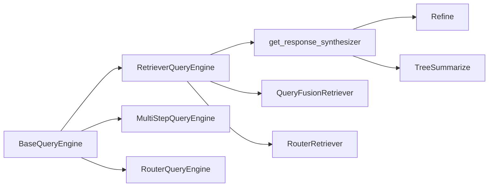

**Diagram sources**
- [base_query_engine.py](file://llama-index-core/llama_index/core/base/base_query_engine.py#L22-L94)
- [retriever_query_engine.py](file://llama-index-core/llama_index/core/query_engine/retriever_query_engine.py#L25-L226)
- [multistep_query_engine.py](file://llama-index-core/llama_index/core/query_engine/multistep_query_engine.py#L26-L179)
- [router_query_engine.py](file://llama-index-core/llama_index/core/query_engine/router_query_engine.py#L95-L398)
- [factory.py](file://llama-index-core/llama_index/core/response_synthesizers/factory.py#L33-L152)
- [refine.py](file://llama-index-core/llama_index/core/response_synthesizers/refine.py#L108-L522)
- [tree_summarize.py](file://llama-index-core/llama_index/core/response_synthesizers/tree_summarize.py#L17-L231)
- [fusion_retriever.py](file://llama-index-core/llama_index/core/retrievers/fusion_retriever.py#L33-L305)
- [router_retriever.py](file://llama-index-core/llama_index/core/retrievers/router_retriever.py#L20-L143)

**Section sources**
- [retriever_query_engine.py](file://llama-index-core/llama_index/core/query_engine/retriever_query_engine.py#L25-L226)
- [router_query_engine.py](file://llama-index-core/llama_index/core/query_engine/router_query_engine.py#L95-L398)
- [factory.py](file://llama-index-core/llama_index/core/response_synthesizers/factory.py#L33-L152)

## Performance Considerations
- Asynchronous execution: Prefer async retrieval and synthesis where supported to reduce latency under I/O-bound workloads.
- Streaming synthesis: Enable streaming in synthesizers to return partial results and improve perceived latency.
- Prompt packing: Use prompt helpers to pack contexts efficiently and avoid oversized prompts.
- Fusion strategies: Choose fusion modes based on dataset characteristics; reciprocal rank fusion often improves diversity.
- Selector caching: Cache selector decisions when metadata is static to avoid repeated LLM calls.
- Node deduplication: Ensure retrievers return unique nodes to prevent redundant synthesis.

[No sources needed since this section provides general guidance]

## Testing Strategies
- Unit tests for custom retrievers: Mock external APIs and assert NodeWithScore counts and ordering.
- Integration tests for RetrieverQueryEngine: Verify retrieval, postprocessing, and synthesis flows with synthetic data.
- RouterQueryEngine tests: Validate selector logic and response combination behavior across multiple engines.
- MultiStepQueryEngine tests: Confirm iterative query decomposition and early stopping conditions.
- Synthesizer tests: Test both sync and async paths, streaming vs. non-streaming, and structured output modes.

[No sources needed since this section provides general guidance]

## Production Deployment Considerations
- Instrumentation and observability: Use callback managers and spans to track query performance and errors.
- Resilience: Add retries and fallbacks for external API calls; implement timeouts and circuit breaker patterns.
- Scaling: Deploy horizontally and shard indices; use async patterns to maximize throughput.
- Monitoring: Track latency, token usage, and error rates; alert on regressions.
- Versioning: Pin LLM providers and model versions; validate synthesizer configurations across environments.

[No sources needed since this section provides general guidance]

## Troubleshooting Guide
- Retrieval returns empty nodes: Verify retriever configuration and index population; check postprocessors for unintended filtering.
- Excessive latency: Enable streaming, reduce top_k, or switch to faster LLMs; profile async bottlenecks.
- Synthesis errors: Inspect prompt templates and context packing; validate structured output schemas.
- Router selection failures: Ensure selector metadata is populated and consistent; confirm tools or retrievers are wrapped correctly.

**Section sources**
- [router_query_engine.py](file://llama-index-core/llama_index/core/query_engine/router_query_engine.py#L160-L203)
- [retriever_query_engine.py](file://llama-index-core/llama_index/core/query_engine/retriever_query_engine.py#L190-L220)

## Conclusion
By leveraging the factory pattern for response synthesis, composing flexible retrievers, and orchestrating multiple engines, you can build robust and extensible custom query engines. Combine retrieval strategies, synthesis modes, and routing logic to match your use case, and adopt rigorous testing and deployment practices to ensure reliability and performance.