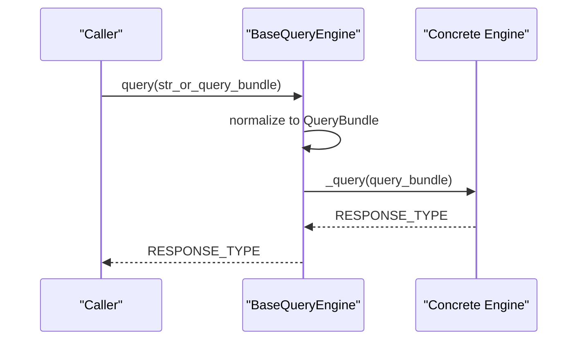
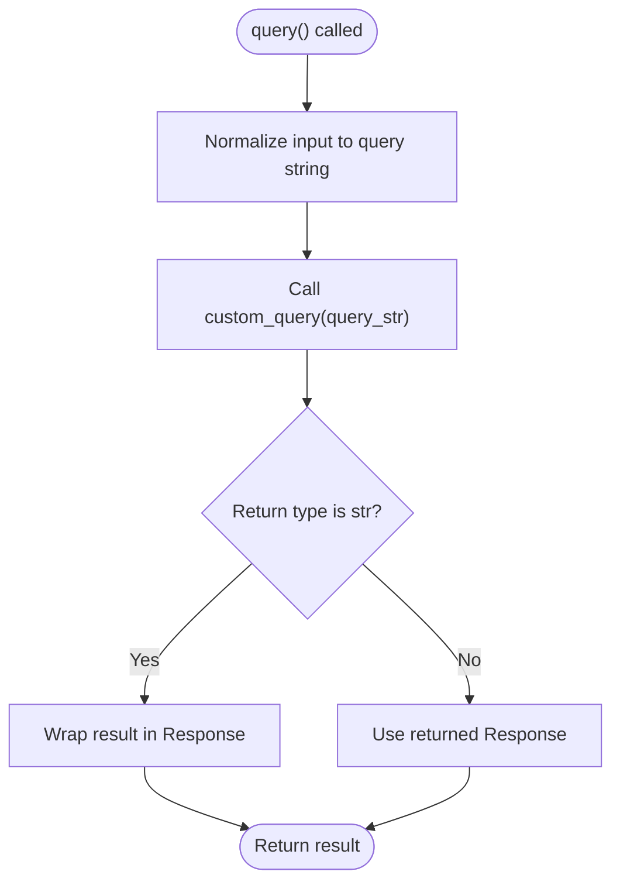
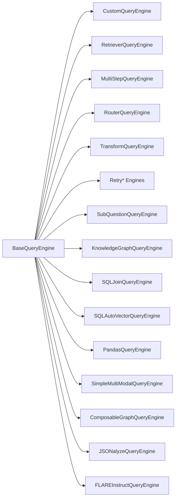

# Custom Query Engines

<cite>
**Referenced Files in This Document**
- [base_query_engine.py](file://llama-index-core/llama_index/core/base/base_query_engine.py)
- [custom.py](file://llama-index-core/llama_index/core/query_engine/custom.py)
- [__init__.py](file://llama-index-core/llama_index/core/query_engine/__init__.py)
- [retriever_query_engine.py](file://llama-index-core/llama_index/core/query_engine/retriever_query_engine.py)
- [multistep_query_engine.py](file://llama-index-core/llama_index/core/query_engine/multistep_query_engine.py)
- [router_query_engine.py](file://llama-index-core/llama_index/core/query_engine/router_query_engine.py)
- [transform_query_engine.py](file://llama-index-core/llama_index/core/query_engine/transform_query_engine.py)
- [retry_query_engine.py](file://llama-index-core/llama_index/core/query_engine/retry_query_engine.py)
- [retry_source_query_engine.py](file://llama-index-core/llama_index/core/query_engine/retry_source_query_engine.py)
- [sub_question_query_engine.py](file://llama-index-core/llama_index/core/query_engine/sub_question_query_engine.py)
- [knowledge_graph_query_engine.py](file://llama-index-core/llama_index/core/query_engine/knowledge_graph_query_engine.py)
- [sql_join_query_engine.py](file://llama-index-core/llama_index/core/query_engine/sql_join_query_engine.py)
- [sql_vector_query_engine.py](file://llama-index-core/llama_index/core/query_engine/sql_vector_query_engine.py)
- [pandas_query_engine.py](file://llama-index-core/llama_index/core/query_engine/pandas/pandas_query_engine.py)
- [multi_modal.py](file://llama-index-core/llama_index/core/query_engine/multi_modal.py)
- [graph_query_engine.py](file://llama-index-core/llama_index/core/query_engine/graph_query_engine.py)
- [jsonalyze_query_engine.py](file://llama-index-core/llama_index/core/query_engine/jsonalyze/jsonalyze_query_engine.py)
- [flare/base.py](file://llama-index-core/llama_index/core/query_engine/flare/base.py)
- [cogniswitch_query_engine.py](file://llama-index-core/llama_index/core/query_engine/cogniswitch_query_engine.py)
- [citation_query_engine.py](file://llama-index-core/llama_index/core/query_engine/citation_query_engine.py)
</cite>

## Table of Contents
1. [Introduction](#introduction)
2. [Project Structure](#project-structure)
3. [Core Components](#core-components)
4. [Architecture Overview](#architecture-overview)
5. [Detailed Component Analysis](#detailed-component-analysis)
6. [Dependency Analysis](#dependency-analysis)
7. [Performance Considerations](#performance-considerations)
8. [Troubleshooting Guide](#troubleshooting-guide)
9. [Conclusion](#conclusion)
10. [Appendices](#appendices)

## Introduction
This document explains how to build custom query engines tailored to specific requirements in the LlamaIndex ecosystem. It covers the BaseQueryEngine interface, the CustomQueryEngine pattern, and how to compose engines with existing components. You will learn how to handle parameters, integrate external APIs, optimize performance, and maintain compatibility with LlamaIndex while extending functionality.

## Project Structure
The query engine subsystem is organized around a shared interface and multiple built-in implementations. The core interface resides under the base module, while concrete engines live under the query_engine package. The package’s public exports enumerate supported engines and types.

```mermaid
graph TB
subgraph "Core Base"
BQE["BaseQueryEngine<br/>interface"]
end
subgraph "Built-in Engines"
RQE["RetrieverQueryEngine"]
MSE["MultiStepQueryEngine"]
RQE2["RouterQueryEngine"]
TQE["TransformQueryEngine"]
RE["Retry* Engines"]
SQE["SubQuestionQueryEngine"]
KGE["KnowledgeGraphQueryEngine"]
SJE["SQLJoinQueryEngine"]
SVE["SQLAutoVectorQueryEngine"]
PQE["PandasQueryEngine"]
MMQ["SimpleMultiModalQueryEngine"]
GQE["ComposableGraphQueryEngine"]
JQE["JSONalyzeQueryEngine"]
FQE["FLAREInstructQueryEngine"]
CQE["CustomQueryEngine"]
end
BQE --> RQE
BQE --> MSE
BQE --> RQE2
BQE --> TQE
BQE --> RE
BQE --> SQE
BQE --> KGE
BQE --> SJE
BQE --> SVE
BQE --> PQE
BQE --> MMQ
BQE --> GQE
BQE --> JQE
BQE --> FQE
BQE --> CQE
```

**Diagram sources**
- [base_query_engine.py](file://llama-index-core/llama_index/core/base/base_query_engine.py#L22-L94)
- [__init__.py](file://llama-index-core/llama_index/core/query_engine/__init__.py#L1-L88)

**Section sources**
- [__init__.py](file://llama-index-core/llama_index/core/query_engine/__init__.py#L1-L88)

## Core Components
- BaseQueryEngine defines the contract for synchronous and asynchronous queries, retrieval, synthesis, and instrumentation hooks. It standardizes how engines receive a QueryBundle or string, emit lifecycle events, and propagate results.
- CustomQueryEngine extends BaseQueryEngine and adds a Pydantic-powered configuration surface. It delegates query execution to a custom_query method (and optional acustom_query), normalizing string vs Response outputs.

Key responsibilities:
- Query orchestration: accept str or QueryBundle, normalize to query string, and return Response or str.
- Async support: optional asynchronous custom path with default fallback to sync.
- Parameter handling: subclasses can expose Pydantic fields; prompts are integrated via PromptMixin.
- Compatibility: integrates with CallbackManager and instrumentation spans.

**Section sources**
- [base_query_engine.py](file://llama-index-core/llama_index/core/base/base_query_engine.py#L22-L94)
- [custom.py](file://llama-index-core/llama_index/core/query_engine/custom.py#L16-L78)

## Architecture Overview
The LlamaIndex query engine architecture centers on a single interface with many composition patterns. Engines can wrap retrievers, routers, transformers, retry policies, and specialized synthesizers. Custom engines plug seamlessly because they inherit the same interface and lifecycle hooks.

```mermaid
classDiagram
class BaseQueryEngine {
+query(str_or_query_bundle) RESPONSE_TYPE
+aquery(str_or_query_bundle) RESPONSE_TYPE
+retrieve(query_bundle) NodeWithScore[]
+synthesize(query_bundle, nodes, additional_source_nodes) RESPONSE_TYPE
+_query(query_bundle) RESPONSE_TYPE
+_aquery(query_bundle) RESPONSE_TYPE
}
class CustomQueryEngine {
+callback_manager
+custom_query(query_str) STR_OR_RESPONSE_TYPE
+acustom_query(query_str) STR_OR_RESPONSE_TYPE
+query(...) RESPONSE_TYPE
+aquery(...) RESPONSE_TYPE
}
class RetrieverQueryEngine
class MultiStepQueryEngine
class RouterQueryEngine
class TransformQueryEngine
class RetryQueryEngine
class RetrySourceQueryEngine
class RetryGuidelineQueryEngine
class SubQuestionQueryEngine
class KnowledgeGraphQueryEngine
class SQLJoinQueryEngine
class SQLAutoVectorQueryEngine
class PandasQueryEngine
class SimpleMultiModalQueryEngine
class ComposableGraphQueryEngine
class JSONalyzeQueryEngine
class FLAREInstructQueryEngine
CustomQueryEngine --|> BaseQueryEngine
RetrieverQueryEngine --|> BaseQueryEngine
MultiStepQueryEngine --|> BaseQueryEngine
RouterQueryEngine --|> BaseQueryEngine
TransformQueryEngine --|> BaseQueryEngine
RetryQueryEngine --|> BaseQueryEngine
RetrySourceQueryEngine --|> BaseQueryEngine
RetryGuidelineQueryEngine --|> BaseQueryEngine
SubQuestionQueryEngine --|> BaseQueryEngine
KnowledgeGraphQueryEngine --|> BaseQueryEngine
SQLJoinQueryEngine --|> BaseQueryEngine
SQLAutoVectorQueryEngine --|> BaseQueryEngine
PandasQueryEngine --|> BaseQueryEngine
SimpleMultiModalQueryEngine --|> BaseQueryEngine
ComposableGraphQueryEngine --|> BaseQueryEngine
JSONalyzeQueryEngine --|> BaseQueryEngine
FLAREInstructQueryEngine --|> BaseQueryEngine
```

**Diagram sources**
- [base_query_engine.py](file://llama-index-core/llama_index/core/base/base_query_engine.py#L22-L94)
- [custom.py](file://llama-index-core/llama_index/core/query_engine/custom.py#L16-L78)
- [retriever_query_engine.py](file://llama-index-core/llama_index/core/query_engine/retriever_query_engine.py)
- [multistep_query_engine.py](file://llama-index-core/llama_index/core/query_engine/multistep_query_engine.py)
- [router_query_engine.py](file://llama-index-core/llama_index/core/query_engine/router_query_engine.py)
- [transform_query_engine.py](file://llama-index-core/llama_index/core/query_engine/transform_query_engine.py)
- [retry_query_engine.py](file://llama-index-core/llama_index/core/query_engine/retry_query_engine.py)
- [retry_source_query_engine.py](file://llama-index-core/llama_index/core/query_engine/retry_source_query_engine.py)
- [sub_question_query_engine.py](file://llama-index-core/llama_index/core/query_engine/sub_question_query_engine.py)
- [knowledge_graph_query_engine.py](file://llama-index-core/llama_index/core/query_engine/knowledge_graph_query_engine.py)
- [sql_join_query_engine.py](file://llama-index-core/llama_index/core/query_engine/sql_join_query_engine.py)
- [sql_vector_query_engine.py](file://llama-index-core/llama_index/core/query_engine/sql_vector_query_engine.py)
- [pandas_query_engine.py](file://llama-index-core/llama_index/core/query_engine/pandas/pandas_query_engine.py)
- [multi_modal.py](file://llama-index-core/llama_index/core/query_engine/multi_modal.py)
- [graph_query_engine.py](file://llama-index-core/llama_index/core/query_engine/graph_query_engine.py)
- [jsonalyze_query_engine.py](file://llama-index-core/llama_index/core/query_engine/jsonalyze/jsonalyze_query_engine.py)
- [flare/base.py](file://llama-index-core/llama_index/core/query_engine/flare/base.py)

## Detailed Component Analysis

### BaseQueryEngine: Interface and Lifecycle
- Provides synchronous and asynchronous entry points that normalize inputs to a QueryBundle and emit instrumentation events.
- Exposes retrieve and synthesize for engines that separate retrieval and synthesis steps.
- Enforces abstract methods for internal query execution (_query, _aquery) to ensure consistent behavior across implementations.

**Diagram sources**
- [base_query_engine.py](file://llama-index-core/llama_index/core/base/base_query_engine.py#L38-L48)

**Section sources**
- [base_query_engine.py](file://llama-index-core/llama_index/core/base/base_query_engine.py#L22-L94)

### CustomQueryEngine: Pattern and Composition
- Extends BaseModel and BaseQueryEngine, enabling Pydantic field-based configuration and callback integration.
- Delegates execution to custom_query (and optional acustom_query), returning either a Response object or a plain string.
- Raises NotImplementedError for _query/_aquery to prevent misuse of the internal interface when using the custom path.

Implementation pattern:
- Define Pydantic fields for parameters (e.g., external API keys, thresholds).
- Implement custom_query to process the normalized query string and return a Response or str.
- Optionally implement acustom_query for async execution.

**Diagram sources**
- [custom.py](file://llama-index-core/llama_index/core/query_engine/custom.py#L37-L49)

**Section sources**
- [custom.py](file://llama-index-core/llama_index/core/query_engine/custom.py#L16-L78)

### Retrieval-Heavy Engines
- RetrieverQueryEngine: wraps a retriever to fetch nodes, then synthesizes a final response.
- MultiStepQueryEngine: orchestrates multiple steps (e.g., transformations, routing) before synthesis.
- RouterQueryEngine: routes queries to appropriate retrievers or engines based on query characteristics.
- TransformQueryEngine: applies transformations to query bundles prior to retrieval/synthesis.

Composition tips:
- Inject retrievers, postprocessors, and synthesizers via constructor parameters.
- Use callback_manager for tracing and metrics.
- Keep parameter exposure minimal and explicit via Pydantic fields.

**Section sources**
- [retriever_query_engine.py](file://llama-index-core/llama_index/core/query_engine/retriever_query_engine.py)
- [multistep_query_engine.py](file://llama-index-core/llama_index/core/query_engine/multistep_query_engine.py)
- [router_query_engine.py](file://llama-index-core/llama_index/core/query_engine/router_query_engine.py)
- [transform_query_engine.py](file://llama-index-core/llama_index/core/query_engine/transform_query_engine.py)

### Reliability and Retry Engines
- RetryQueryEngine, RetrySourceQueryEngine, RetryGuidelineQueryEngine: wrap another engine and apply retry policies for robustness.
- Useful for noisy external APIs or transient failures.

Best practices:
- Configure retry limits, backoff strategies, and failure criteria.
- Log retries and outcomes via callback_manager.
- Combine with timeouts and circuit-breaker logic externally if needed.

**Section sources**
- [retry_query_engine.py](file://llama-index-core/llama_index/core/query_engine/retry_query_engine.py)
- [retry_source_query_engine.py](file://llama-index-core/llama_index/core/query_engine/retry_source_query_engine.py)

### Specialized Engines
- SubQuestionQueryEngine: decomposes a query into sub-questions, aggregates answers.
- KnowledgeGraphQueryEngine: leverages graph structures for reasoning.
- SQLJoinQueryEngine / SQLAutoVectorQueryEngine: combine retrieval with SQL logic.
- PandasQueryEngine: executes pandas-based transformations on tabular data.
- SimpleMultiModalQueryEngine: handles multimodal inputs.
- ComposableGraphQueryEngine: composes multiple graph-based engines.
- JSONalyzeQueryEngine: specialized JSON processing.
- FLAREInstructQueryEngine: instruction-based refinement.

Integration tips:
- Reuse existing retrievers and postprocessors.
- Parameterize behavior via Pydantic fields exposed by each engine.
- Ensure consistent result formatting (Response) for interoperability.

**Section sources**
- [sub_question_query_engine.py](file://llama-index-core/llama_index/core/query_engine/sub_question_query_engine.py)
- [knowledge_graph_query_engine.py](file://llama-index-core/llama_index/core/query_engine/knowledge_graph_query_engine.py)
- [sql_join_query_engine.py](file://llama-index-core/llama_index/core/query_engine/sql_join_query_engine.py)
- [sql_vector_query_engine.py](file://llama-index-core/llama_index/core/query_engine/sql_vector_query_engine.py)
- [pandas_query_engine.py](file://llama-index-core/llama_index/core/query_engine/pandas/pandas_query_engine.py)
- [multi_modal.py](file://llama-index-core/llama_index/core/query_engine/multi_modal.py)
- [graph_query_engine.py](file://llama-index-core/llama_index/core/query_engine/graph_query_engine.py)
- [jsonalyze_query_engine.py](file://llama-index-core/llama_index/core/query_engine/jsonalyze/jsonalyze_query_engine.py)
- [flare/base.py](file://llama-index-core/llama_index/core/query_engine/flare/base.py)

### Hybrid and Ensemble Methods
- Hybrid engines: combine multiple retrievers or engines with weighted scores or fusion strategies.
- Ensemble methods: aggregate results from several engines (e.g., average, voting, rerankers).
- Specialized processing: incorporate external APIs, domain-specific parsers, or custom rerankers.

Implementation guidance:
- Build a CustomQueryEngine wrapper that invokes multiple underlying engines and merges results.
- Use QueryBundle to carry metadata and enable consistent scoring/reranking.
- Apply postprocessing (e.g., re-ranking, filtering) via postprocessor chain.

[No sources needed since this section provides general guidance]

### Domain-Specific Engines
- Example patterns:
  - Financial: integrate with market data APIs inside custom_query, cache results, and return structured responses.
  - Legal: wrap a knowledge graph engine and add citation extraction and grounding.
  - Scientific: combine vector retrieval with SQL-backed metadata filters.

Parameter handling:
- Expose API credentials, endpoints, and thresholds as Pydantic fields.
- Validate inputs early and normalize query semantics.

Result formatting:
- Always return a Response object for consistency with LlamaIndex pipelines.
- Attach metadata (sources, tokens, latency) via Response.extra_info.

[No sources needed since this section provides general guidance]

### Integrating External APIs
- Use acustom_query for async I/O to external services.
- Wrap exceptions and translate them to LlamaIndex-friendly errors.
- Add timeouts and retries at the adapter level.

[No sources needed since this section provides general guidance]

### Optimizing Query Performance
- Minimize round trips: batch requests, cache frequently used results.
- Tune retriever parameters (top_k, similarity threshold).
- Use lightweight postprocessors and avoid heavy transformations in hot paths.
- Instrument with callback_manager to profile bottlenecks.

[No sources needed since this section provides general guidance]

## Dependency Analysis
The query engine ecosystem exhibits clear separation of concerns:
- Base interface decouples engines from implementation details.
- Built-in engines depend on retrievers, postprocessors, and synthesizers.
- Custom engines depend on the base interface and can reuse existing components.

**Diagram sources**
- [base_query_engine.py](file://llama-index-core/llama_index/core/base/base_query_engine.py#L22-L94)
- [__init__.py](file://llama-index-core/llama_index/core/query_engine/__init__.py#L1-L88)

**Section sources**
- [__init__.py](file://llama-index-core/llama_index/core/query_engine/__init__.py#L1-L88)

## Performance Considerations
- Prefer async I/O in custom engines to avoid blocking.
- Cache expensive computations and API calls.
- Limit result sets (top_k) and filter aggressively.
- Use instrumentation to identify slow paths and optimize accordingly.

[No sources needed since this section provides general guidance]

## Troubleshooting Guide
Common issues and remedies:
- Not returning a Response: Ensure custom_query returns a Response or a string wrapped into one.
- Missing async support: Implement acustom_query or rely on the default sync fallback.
- Incorrect parameter exposure: Use Pydantic fields to keep configuration explicit and validated.
- Instrumentation gaps: Verify callback_manager is set and spans are emitted.

Debugging tips:
- Enable verbose logging for callback_manager and instrumentation.
- Profile query execution with callback traces.
- Validate inputs early and log QueryBundle contents.

**Section sources**
- [custom.py](file://llama-index-core/llama_index/core/query_engine/custom.py#L37-L49)
- [base_query_engine.py](file://llama-index-core/llama_index/core/base/base_query_engine.py#L38-L48)

## Conclusion
Custom query engines fit seamlessly into the LlamaIndex architecture by adhering to BaseQueryEngine’s interface and leveraging built-in composition patterns. Use CustomQueryEngine for straightforward custom logic, integrate external APIs thoughtfully, and compose engines to meet domain-specific needs. Maintain compatibility by returning Response objects, exposing parameters via Pydantic, and instrumenting your engines for observability.

[No sources needed since this section summarizes without analyzing specific files]

## Appendices

### Practical Implementation Checklist
- Define Pydantic fields for engine parameters.
- Implement custom_query (and acustom_query if applicable).
- Normalize inputs and return a Response object.
- Integrate with callback_manager and instrumentation.
- Compose with existing retrievers/postprocessors/synthesizers as needed.

[No sources needed since this section provides general guidance]