# Query Processing

<cite>
**Referenced Files in This Document**
- [base_query_engine.py](file://llama-index-core/llama_index/core/base/base_query_engine.py)
- [base.py](file://llama-index-core/llama_index/core/response_synthesizers/base.py)
- [refine.py](file://llama-index-core/llama_index/core/response_synthesizers/refine.py)
- [tree_summarize.py](file://llama-index-core/llama_index/core/response_synthesizers/tree_summarize.py)
- [simple_summarize.py](file://llama-index-core/llama_index/core/response_synthesizers/simple_summarize.py)
- [factory.py](file://llama-index-core/llama_index/core/response_synthesizers/factory.py)
- [type.py](file://llama-index-core/llama_index/core/response_synthesizers/type.py)
- [retriever_query_engine.py](file://llama-index-core/llama_index/core/query_engine/retriever_query_engine.py)
- [multistep_query_engine.py](file://llama-index-core/llama_index/core/query_engine/multistep_query_engine.py)
- [custom.py](file://llama-index-core/llama_index/core/query_engine/custom.py)
</cite>

## Table of Contents
1. [Introduction](#introduction)
2. [Project Structure](#project-structure)
3. [Core Components](#core-components)
4. [Architecture Overview](#architecture-overview)
5. [Detailed Component Analysis](#detailed-component-analysis)
6. [Dependency Analysis](#dependency-analysis)
7. [Performance Considerations](#performance-considerations)
8. [Troubleshooting Guide](#troubleshooting-guide)
9. [Conclusion](#conclusion)
10. [Appendices](#appendices)

## Introduction
This document explains the LlamaIndex query processing system with a focus on the query engine architecture, the base query engine interface, and response synthesis mechanisms. It covers built-in response synthesizers (refine, tree summarize, simple summarize), the factory that configures synthesizers by mode, and practical patterns for creating custom query engines and query transformations. It also provides guidance on context management, response quality optimization, and handling complex query scenarios.

## Project Structure
The query processing system centers around:
- A base query engine interface that defines the contract for query execution and synthesis.
- A response synthesizer framework that encapsulates different strategies for transforming retrieved nodes into final responses.
- Concrete query engines that orchestrate retrieval, optional post-processing, and synthesis.
- A factory and enumeration that select synthesis strategies by mode.

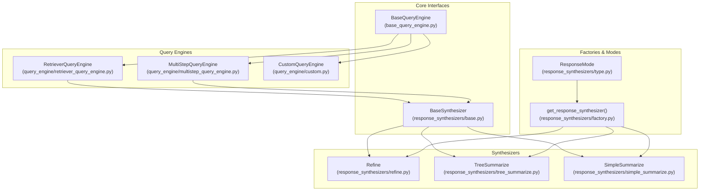

**Diagram sources**
- [base_query_engine.py](file://llama-index-core/llama_index/core/base/base_query_engine.py#L22-L94)
- [base.py](file://llama-index-core/llama_index/core/response_synthesizers/base.py#L53-L322)
- [refine.py](file://llama-index-core/llama_index/core/response_synthesizers/refine.py#L108-L522)
- [tree_summarize.py](file://llama-index-core/llama_index/core/response_synthesizers/tree_summarize.py#L17-L231)
- [simple_summarize.py](file://llama-index-core/llama_index/core/response_synthesizers/simple_summarize.py#L15-L110)
- [factory.py](file://llama-index-core/llama_index/core/response_synthesizers/factory.py#L33-L152)
- [type.py](file://llama-index-core/llama_index/core/response_synthesizers/type.py#L4-L58)
- [retriever_query_engine.py](file://llama-index-core/llama_index/core/query_engine/retriever_query_engine.py#L25-L226)
- [multistep_query_engine.py](file://llama-index-core/llama_index/core/query_engine/multistep_query_engine.py#L26-L179)
- [custom.py](file://llama-index-core/llama_index/core/query_engine/custom.py#L16-L78)

**Section sources**
- [base_query_engine.py](file://llama-index-core/llama_index/core/base/base_query_engine.py#L22-L94)
- [retriever_query_engine.py](file://llama-index-core/llama_index/core/query_engine/retriever_query_engine.py#L25-L226)
- [multistep_query_engine.py](file://llama-index-core/llama_index/core/query_engine/multistep_query_engine.py#L26-L179)
- [custom.py](file://llama-index-core/llama_index/core/query_engine/custom.py#L16-L78)
- [base.py](file://llama-index-core/llama_index/core/response_synthesizers/base.py#L53-L322)
- [factory.py](file://llama-index-core/llama_index/core/response_synthesizers/factory.py#L33-L152)
- [type.py](file://llama-index-core/llama_index/core/response_synthesizers/type.py#L4-L58)

## Core Components
- BaseQueryEngine: Defines the query and synthesize interfaces, and provides tracing and callback hooks. It separates synchronous and asynchronous execution and raises NotImplementedError for retrieve/synthesize when unsupported by a concrete engine.
- BaseSynthesizer: Provides a unified abstraction for response synthesis, including prompt preparation, metadata handling, and response wrapping. It supports both string and streaming responses and integrates with structured LLM outputs.
- ResponseMode: Enumerates synthesis strategies (refine, compact, simple_summarize, tree_summarize, generation, no_text, context_only, accumulate, compact_accumulate).
- get_response_synthesizer: Factory that instantiates a synthesizer according to ResponseMode and configuration (templates, streaming, async, structured output, etc.).

Key responsibilities:
- Query engines orchestrate retrieval and optional postprocessing, then delegate synthesis to a synthesizer.
- Synthesizers manage prompt packing/truncation, iterative refinement, and response formatting.

**Section sources**
- [base_query_engine.py](file://llama-index-core/llama_index/core/base/base_query_engine.py#L22-L94)
- [base.py](file://llama-index-core/llama_index/core/response_synthesizers/base.py#L53-L322)
- [type.py](file://llama-index-core/llama_index/core/response_synthesizers/type.py#L4-L58)
- [factory.py](file://llama-index-core/llama_index/core/response_synthesizers/factory.py#L33-L152)

## Architecture Overview
The query pipeline typically follows:
- A query enters a query engine (e.g., RetrieverQueryEngine).
- The engine retrieves nodes and applies optional postprocessors.
- The engine delegates synthesis to a configured BaseSynthesizer.
- The synthesizer selects a strategy (e.g., Refine, TreeSummarize, SimpleSummarize) and produces a Response, StreamingResponse, or PydanticResponse.

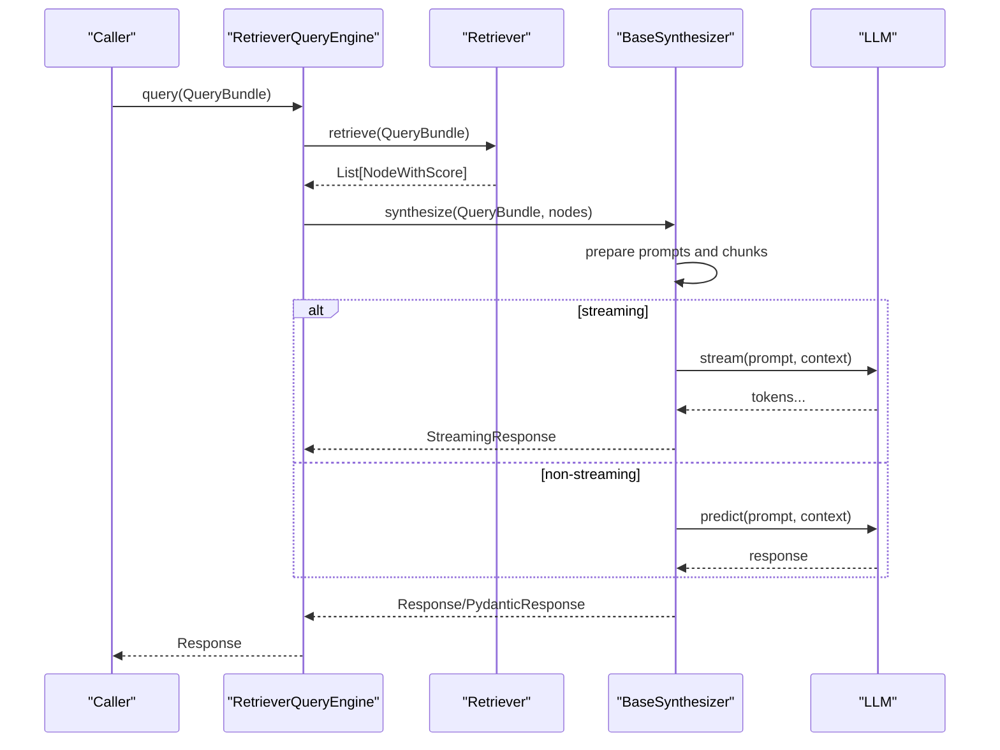

**Diagram sources**
- [retriever_query_engine.py](file://llama-index-core/llama_index/core/query_engine/retriever_query_engine.py#L190-L220)
- [base.py](file://llama-index-core/llama_index/core/response_synthesizers/base.py#L192-L322)
- [refine.py](file://llama-index-core/llama_index/core/response_synthesizers/refine.py#L162-L200)
- [tree_summarize.py](file://llama-index-core/llama_index/core/response_synthesizers/tree_summarize.py#L134-L231)
- [simple_summarize.py](file://llama-index-core/llama_index/core/response_synthesizers/simple_summarize.py#L76-L110)

## Detailed Component Analysis

### Base Query Engine Interface
- Provides synchronous and asynchronous query entry points, converting strings to QueryBundle automatically.
- Emits instrumentation events and uses a callback manager for tracing.
- Exposes retrieve and synthesize methods with default NotImplemented behavior for engines that do not support them.

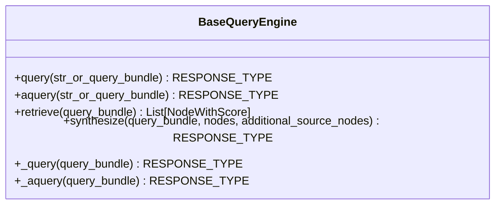

**Diagram sources**
- [base_query_engine.py](file://llama-index-core/llama_index/core/base/base_query_engine.py#L22-L94)

**Section sources**
- [base_query_engine.py](file://llama-index-core/llama_index/core/base/base_query_engine.py#L22-L94)

### Response Synthesizer Framework
- BaseSynthesizer centralizes prompt handling, callback events, and response wrapping.
- Supports structured outputs via StructuredLLM and returns PydanticResponse when configured.
- Handles empty node lists and streaming vs non-streaming responses.

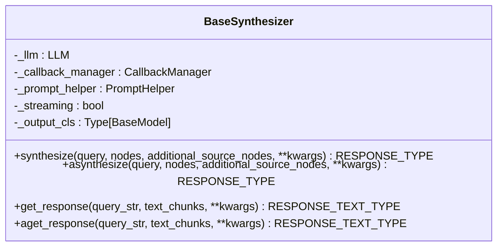

**Diagram sources**
- [base.py](file://llama-index-core/llama_index/core/response_synthesizers/base.py#L53-L322)

**Section sources**
- [base.py](file://llama-index-core/llama_index/core/response_synthesizers/base.py#L53-L322)

### Refine Synthesis Strategy
- Iteratively refines an answer across multiple text chunks using a text-qa prompt for the first chunk and a refine prompt for subsequent chunks.
- Supports structured answer filtering via a program factory and streaming mode.
- Uses PromptHelper to repack prompts and manage context window constraints.

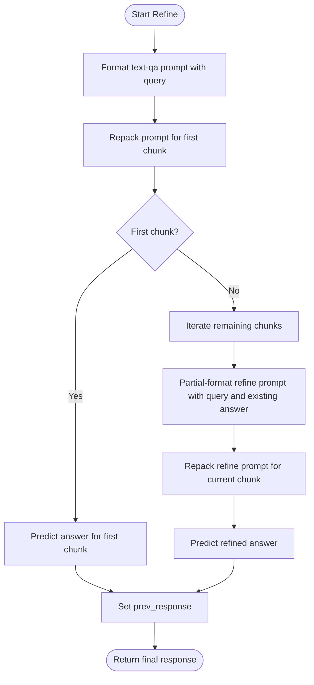

**Diagram sources**
- [refine.py](file://llama-index-core/llama_index/core/response_synthesizers/refine.py#L162-L200)
- [refine.py](file://llama-index-core/llama_index/core/response_synthesizers/refine.py#L275-L348)

**Section sources**
- [refine.py](file://llama-index-core/llama_index/core/response_synthesizers/refine.py#L108-L522)

### Tree Summarize Synthesis Strategy
- Recursively summarizes text chunks in a bottom-up tree manner.
- Packs chunks to fit the LLM context window, summarizes leaf chunks, and recurses until a single summary remains.
- Supports both synchronous and asynchronous recursion.

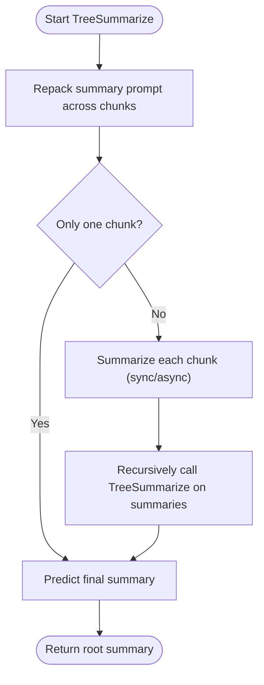

**Diagram sources**
- [tree_summarize.py](file://llama-index-core/llama_index/core/response_synthesizers/tree_summarize.py#L134-L231)

**Section sources**
- [tree_summarize.py](file://llama-index-core/llama_index/core/response_synthesizers/tree_summarize.py#L17-L231)

### Simple Summarize Synthesis Strategy
- Concatenates all chunks into one and truncates to fit the prompt context window, then predicts a single response.
- Supports streaming and structured outputs.

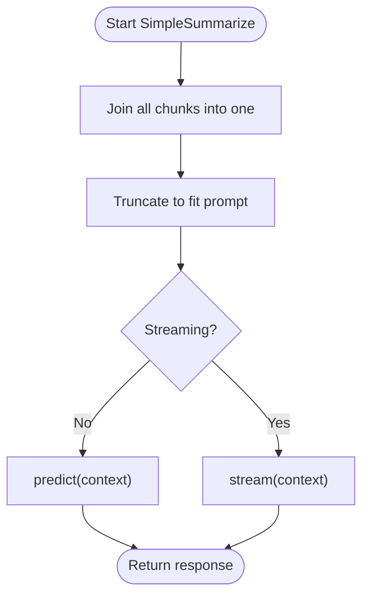

**Diagram sources**
- [simple_summarize.py](file://llama-index-core/llama_index/core/response_synthesizers/simple_summarize.py#L76-L110)

**Section sources**
- [simple_summarize.py](file://llama-index-core/llama_index/core/response_synthesizers/simple_summarize.py#L15-L110)

### Response Mode Enumeration and Factory
- ResponseMode enumerates synthesis strategies and documents their behavior.
- get_response_synthesizer constructs the appropriate synthesizer based on ResponseMode and configuration, wiring templates, streaming, async, and structured output options.

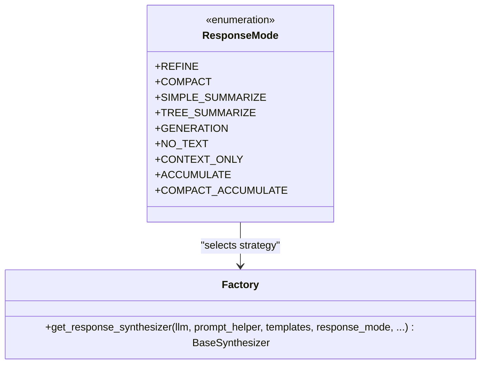

**Diagram sources**
- [type.py](file://llama-index-core/llama_index/core/response_synthesizers/type.py#L4-L58)
- [factory.py](file://llama-index-core/llama_index/core/response_synthesizers/factory.py#L33-L152)

**Section sources**
- [type.py](file://llama-index-core/llama_index/core/response_synthesizers/type.py#L4-L58)
- [factory.py](file://llama-index-core/llama_index/core/response_synthesizers/factory.py#L33-L152)

### Retriever-Based Query Engine
- Orchestrates retrieval, optional node postprocessing, and synthesis.
- Exposes a convenience constructor that builds a response synthesizer via the factory using ResponseMode and related parameters.

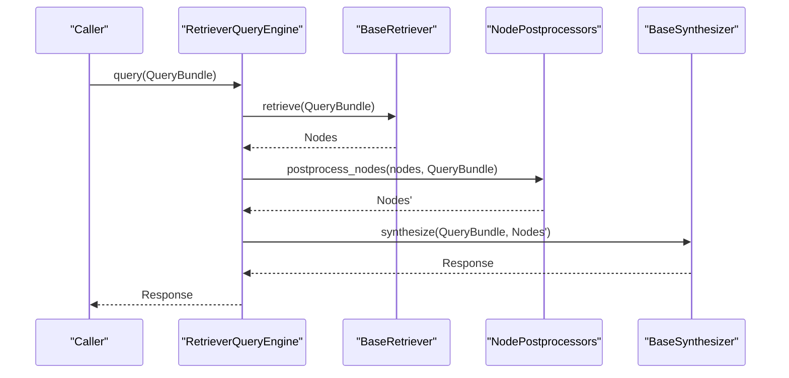

**Diagram sources**
- [retriever_query_engine.py](file://llama-index-core/llama_index/core/query_engine/retriever_query_engine.py#L190-L220)
- [retriever_query_engine.py](file://llama-index-core/llama_index/core/query_engine/retriever_query_engine.py#L130-L188)

**Section sources**
- [retriever_query_engine.py](file://llama-index-core/llama_index/core/query_engine/retriever_query_engine.py#L25-L226)

### Multi-Step Query Engine
- Decomposes a query iteratively using a query transformation, executes queries against a base engine, aggregates intermediate results, and synthesizes a final response.
- Supports early stopping via a stop function and combines reasoning across steps.

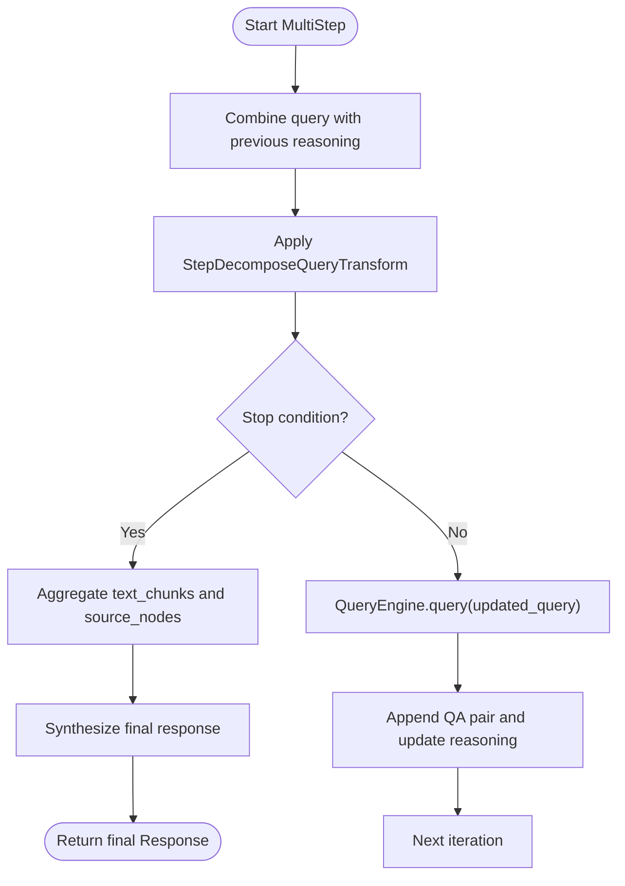

**Diagram sources**
- [multistep_query_engine.py](file://llama-index-core/llama_index/core/query_engine/multistep_query_engine.py#L126-L179)

**Section sources**
- [multistep_query_engine.py](file://llama-index-core/llama_index/core/query_engine/multistep_query_engine.py#L26-L179)

### Custom Query Engine
- Allows implementing domain-specific query logic by overriding custom_query (and optionally acustom_query).
- Wraps string outputs into Response automatically.

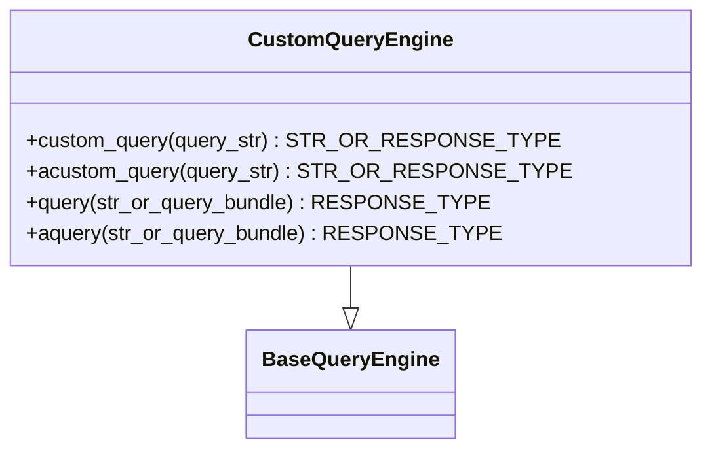

**Diagram sources**
- [custom.py](file://llama-index-core/llama_index/core/query_engine/custom.py#L16-L78)

**Section sources**
- [custom.py](file://llama-index-core/llama_index/core/query_engine/custom.py#L16-L78)

## Dependency Analysis
- Query engines depend on retrievers and optional postprocessors; they delegate synthesis to BaseSynthesizer.
- BaseSynthesizer depends on LLM, CallbackManager, PromptHelper, and optional structured output classes.
- get_response_synthesizer depends on ResponseMode and default prompt selectors to instantiate the correct synthesizer subclass.
- MultiStepQueryEngine composes a base query engine and a query transformation to produce iterative queries.

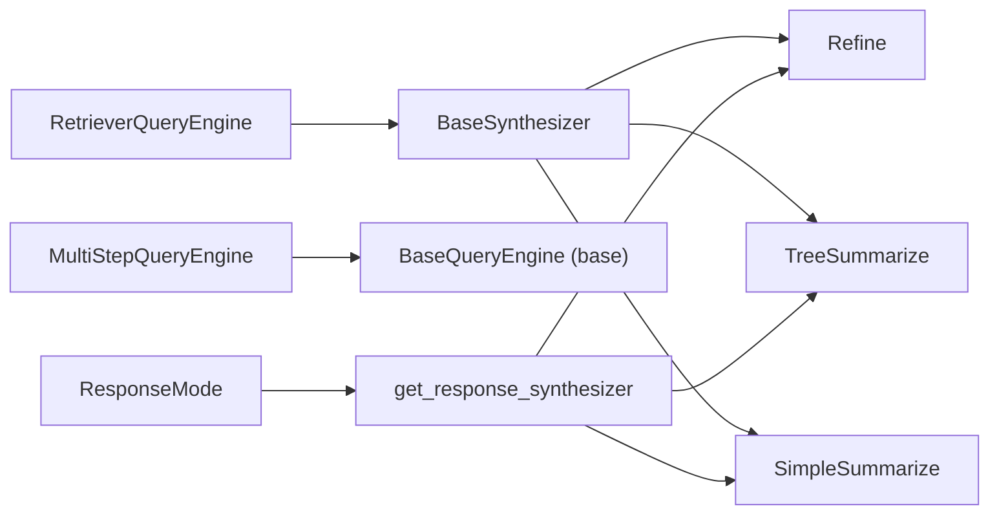

**Diagram sources**
- [retriever_query_engine.py](file://llama-index-core/llama_index/core/query_engine/retriever_query_engine.py#L25-L226)
- [multistep_query_engine.py](file://llama-index-core/llama_index/core/query_engine/multistep_query_engine.py#L26-L179)
- [base.py](file://llama-index-core/llama_index/core/response_synthesizers/base.py#L53-L322)
- [factory.py](file://llama-index-core/llama_index/core/response_synthesizers/factory.py#L33-L152)
- [type.py](file://llama-index-core/llama_index/core/response_synthesizers/type.py#L4-L58)

**Section sources**
- [retriever_query_engine.py](file://llama-index-core/llama_index/core/query_engine/retriever_query_engine.py#L25-L226)
- [multistep_query_engine.py](file://llama-index-core/llama_index/core/query_engine/multistep_query_engine.py#L26-L179)
- [base.py](file://llama-index-core/llama_index/core/response_synthesizers/base.py#L53-L322)
- [factory.py](file://llama-index-core/llama_index/core/response_synthesizers/factory.py#L33-L152)
- [type.py](file://llama-index-core/llama_index/core/response_synthesizers/type.py#L4-L58)

## Performance Considerations
- Choose synthesis mode based on trade-offs:
  - Refine: highest quality for long contexts but more LLM calls.
  - TreeSummarize: good balance; reduces calls via recursive summarization.
  - SimpleSummarize: fastest but fails if combined context exceeds window.
  - Compact modes reduce calls by packing chunks first.
- Streaming can improve latency and UX for long responses.
- Use structured outputs to enforce consistent response formats and enable filtering/validation.
- PromptHelper repacking/truncation prevents oversized prompts and avoids failures.
- Asynchronous synthesis and aggregation (TreeSummarize with use_async) can improve throughput.

[No sources needed since this section provides general guidance]

## Troubleshooting Guide
Common issues and resolutions:
- Empty node list:
  - Synthesizer returns an empty response or an empty streaming response when no nodes are provided.
- Oversized prompts:
  - Use PromptHelper repack/truncate to fit context windows; TreeSummarize and Refine handle repacking internally.
- Streaming with structured outputs:
  - Some strategies do not support streaming with structured answer filtering; avoid mixing these options.
- Validation errors in structured responses:
  - Refine handles validation errors gracefully by falling back to defaults or continuing refinement.
- Missing retrieve/synthesize:
  - Engines that do not support retrieve/synthesize will raise NotImplementedError; use engines that implement these methods or call query directly.

**Section sources**
- [base.py](file://llama-index-core/llama_index/core/response_synthesizers/base.py#L192-L322)
- [refine.py](file://llama-index-core/llama_index/core/response_synthesizers/refine.py#L138-L146)
- [refine.py](file://llama-index-core/llama_index/core/response_synthesizers/refine.py#L249-L253)

## Conclusion
LlamaIndex’s query processing system cleanly separates retrieval, postprocessing, and synthesis. The BaseQueryEngine and BaseSynthesizer abstractions enable flexible composition and configuration. Built-in strategies like Refine, TreeSummarize, and SimpleSummarize cover a wide range of quality/performance needs, while the factory and mode enumeration simplify configuration. Custom engines and multi-step transformations extend the system to complex scenarios.

[No sources needed since this section summarizes without analyzing specific files]

## Appendices

### Practical Examples and Patterns

- Create a custom query engine:
  - Implement a subclass of CustomQueryEngine and override custom_query (and optionally acustom_query). Use the provided query/aquery wrappers to return either a string or a Response object.
  - Reference: [custom.py](file://llama-index-core/llama_index/core/query_engine/custom.py#L16-L78)

- Configure response synthesis:
  - Use get_response_synthesizer with ResponseMode and template parameters to select and configure a synthesizer.
  - Reference: [factory.py](file://llama-index-core/llama_index/core/response_synthesizers/factory.py#L33-L152), [type.py](file://llama-index-core/llama_index/core/response_synthesizers/type.py#L4-L58)

- Handle complex query scenarios:
  - Use MultiStepQueryEngine to decompose and iteratively refine answers across steps, combining reasoning and stopping criteria.
  - Reference: [multistep_query_engine.py](file://llama-index-core/llama_index/core/query_engine/multistep_query_engine.py#L26-L179)

- Manage context and optimize response quality:
  - Prefer TreeSummarize for long contexts; Refine for highest fidelity; SimpleSummarize for speed when context fits.
  - Enable streaming for interactive UX; use structured outputs for consistent parsing.
  - Reference: [tree_summarize.py](file://llama-index-core/llama_index/core/response_synthesizers/tree_summarize.py#L17-L231), [refine.py](file://llama-index-core/llama_index/core/response_synthesizers/refine.py#L108-L522), [simple_summarize.py](file://llama-index-core/llama_index/core/response_synthesizers/simple_summarize.py#L15-L110)