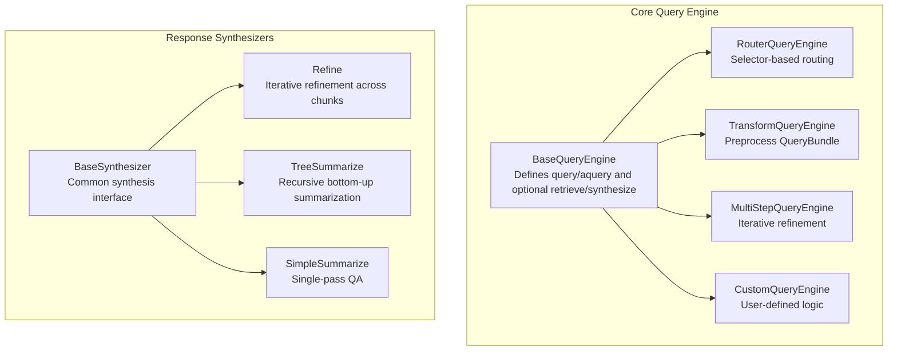
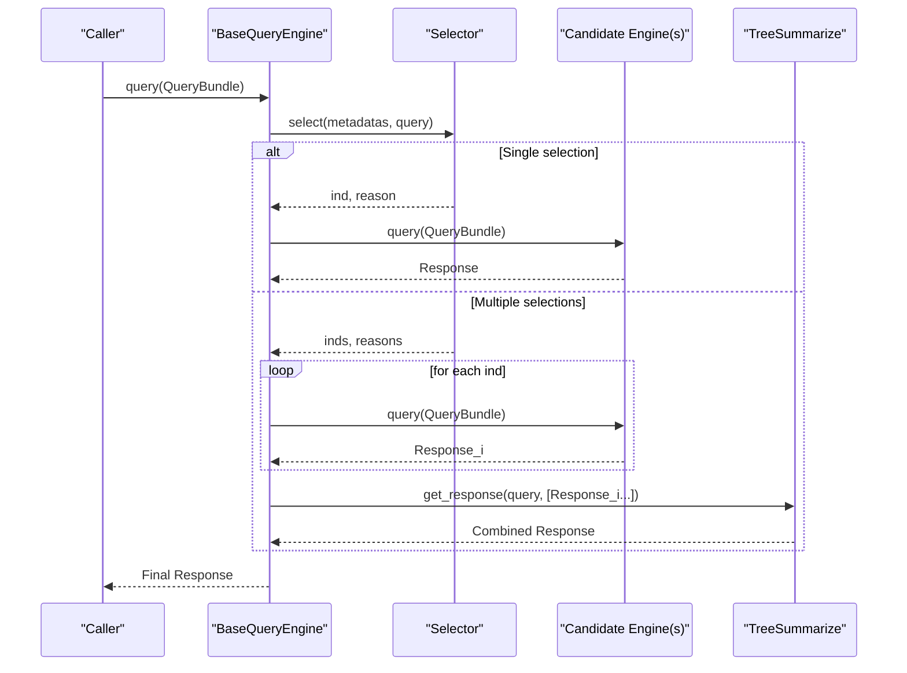
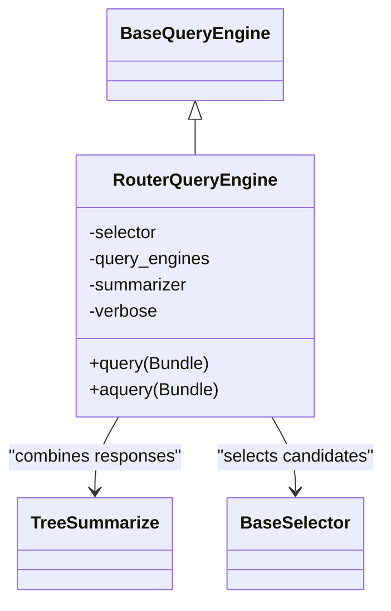
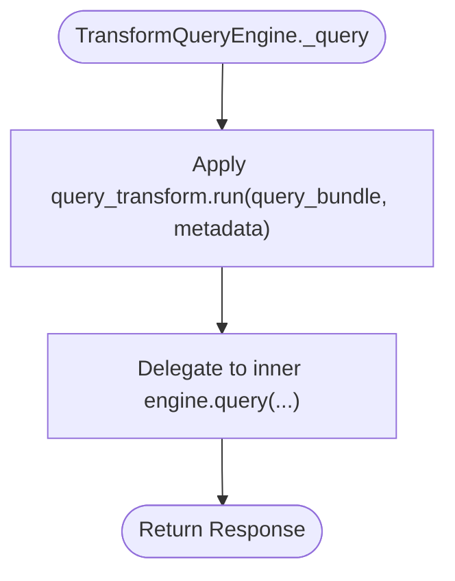
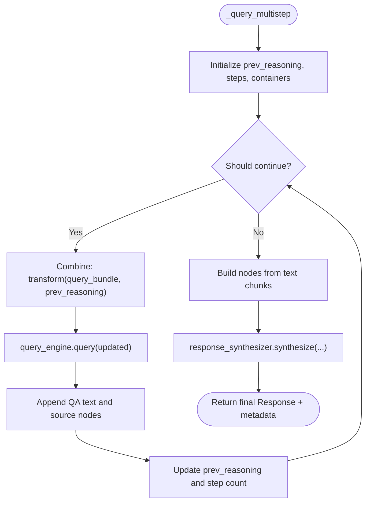
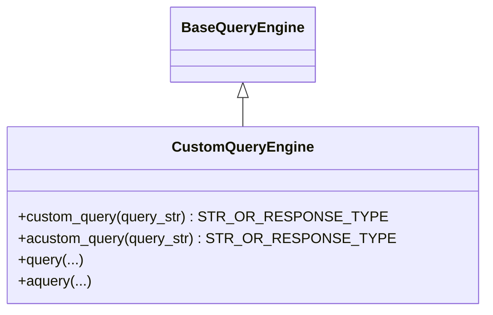
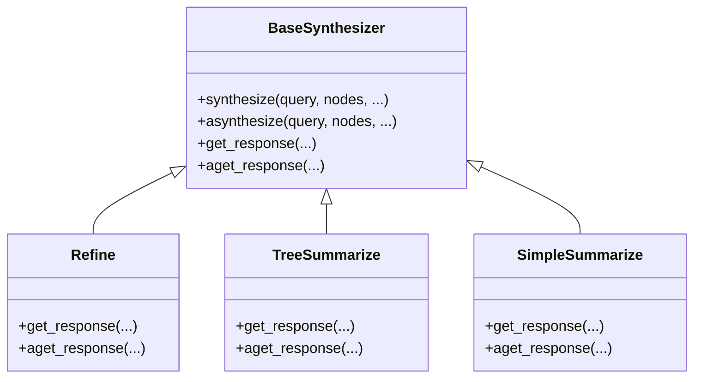
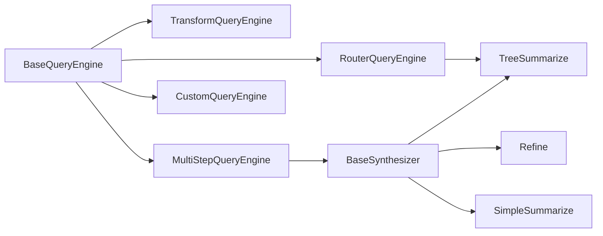

# Query Processing

<cite>
**Referenced Files in This Document**
- [base_query_engine.py](file://llama-index-core/llama_index/core/base/base_query_engine.py)
- [__init__.py](file://llama-index-core/llama_index/core/query_engine/__init__.py)
- [router_query_engine.py](file://llama-index-core/llama_index/core/query_engine/router_query_engine.py)
- [transform_query_engine.py](file://llama-index-core/llama_index/core/query_engine/transform_query_engine.py)
- [multistep_query_engine.py](file://llama-index-core/llama_index/core/query_engine/multistep_query_engine.py)
- [custom.py](file://llama-index-core/llama_index/core/query_engine/custom.py)
- [base.py](file://llama-index-core/llama_index/core/response_synthesizers/base.py)
- [refine.py](file://llama-index-core/llama_index/core/response_synthesizers/refine.py)
- [tree_summarize.py](file://llama-index-core/llama_index/core/response_synthesizers/tree_summarize.py)
- [simple_summarize.py](file://llama-index-core/llama_index/core/response_synthesizers/simple_summarize.py)
</cite>

## Table of Contents
1. [Introduction](#introduction)
2. [Project Structure](#project-structure)
3. [Core Components](#core-components)
4. [Architecture Overview](#architecture-overview)
5. [Detailed Component Analysis](#detailed-component-analysis)
6. [Dependency Analysis](#dependency-analysis)
7. [Performance Considerations](#performance-considerations)
8. [Troubleshooting Guide](#troubleshooting-guide)
9. [Conclusion](#conclusion)

## Introduction
This document explains LlamaIndex’s query processing pipeline with a focus on query execution and response synthesis. It covers simple query engines, router-based engines, transform engines, and custom implementations. It also documents response synthesizers (refine, tree summarize, simple summarize), query transformations, multi-step processing, and streaming responses. Practical guidance is included for building custom engines, orchestrating complex workflows, optimizing response quality, and debugging performance.

## Project Structure
The query processing system centers around a shared base query engine and a set of specialized engines and synthesizers. Engines implement a unified interface for synchronous and asynchronous query execution, while synthesizers encapsulate response generation strategies.

```mermaid
graph TB
subgraph "Core Query Engine"
BQE["BaseQueryEngine<br/>Defines query/aquery and optional retrieve/synthesize"]
RQE["RouterQueryEngine<br/>Selector-based routing"]
TRE["TransformQueryEngine<br/>Preprocess QueryBundle"]
MSE["MultiStepQueryEngine<br/>Iterative refinement"]
CQE["CustomQueryEngine<br/>User-defined logic"]
end
subgraph "Response Synthesizers"
BS["BaseSynthesizer<br/>Common synthesis interface"]
REF["Refine<br/>Iterative refinement across chunks"]
TS["TreeSummarize<br/>Recursive bottom-up summarization"]
SS["SimpleSummarize<br/>Single-pass QA"]
end
BQE --> RQE
BQE --> TRE
BQE --> MSE
BQE --> CQE
BS --> REF
BS --> TS
BS --> SS
```

**Diagram sources**
- [base_query_engine.py](file://llama-index-core/llama_index/core/base/base_query_engine.py#L22-L94)
- [router_query_engine.py](file://llama-index-core/llama_index/core/query_engine/router_query_engine.py#L95-L248)
- [transform_query_engine.py](file://llama-index-core/llama_index/core/query_engine/transform_query_engine.py#L11-L95)
- [multistep_query_engine.py](file://llama-index-core/llama_index/core/query_engine/multistep_query_engine.py#L26-L179)
- [custom.py](file://llama-index-core/llama_index/core/query_engine/custom.py#L16-L78)
- [base.py](file://llama-index-core/llama_index/core/response_synthesizers/base.py#L53-L322)
- [refine.py](file://llama-index-core/llama_index/core/response_synthesizers/refine.py#L108-L522)
- [tree_summarize.py](file://llama-index-core/llama_index/core/response_synthesizers/tree_summarize.py#L17-L231)
- [simple_summarize.py](file://llama-index-core/llama_index/core/response_synthesizers/simple_summarize.py#L15-L110)

**Section sources**
- [__init__.py](file://llama-index-core/llama_index/core/query_engine/__init__.py#L1-L88)
- [base_query_engine.py](file://llama-index-core/llama_index/core/base/base_query_engine.py#L22-L94)

## Core Components
- BaseQueryEngine: Defines the canonical query interface with synchronous and asynchronous methods, and optional retrieval and synthesis hooks. It emits instrumentation events and integrates with a callback manager.
- RouterQueryEngine: Routes a query to one or more candidate engines using a selector and optionally combines results via a summarizer.
- TransformQueryEngine: Applies a pre-defined query transformation to the incoming QueryBundle before delegating to another engine.
- MultiStepQueryEngine: Iteratively decomposes and re-formulates a query using a step-wise transform, collecting intermediate results and synthesizing a final response.
- CustomQueryEngine: A Pydantic-enabled engine allowing users to plug in custom logic via custom_query/acustom_query.
- Response Synthesizers: Abstractions for generating answers from retrieved chunks, including Refine, TreeSummarize, and SimpleSummarize.

Key capabilities:
- Unified query lifecycle: query/aquery, optional retrieve/synthesize, and instrumentation.
- Selector-driven routing with optional multi-selection and aggregation.
- Query transformation prior to engine execution.
- Multi-step iterative reasoning with optional early stopping.
- Structured and streaming synthesis with configurable templates and output classes.

**Section sources**
- [base_query_engine.py](file://llama-index-core/llama_index/core/base/base_query_engine.py#L22-L94)
- [router_query_engine.py](file://llama-index-core/llama_index/core/query_engine/router_query_engine.py#L95-L248)
- [transform_query_engine.py](file://llama-index-core/llama_index/core/query_engine/transform_query_engine.py#L11-L95)
- [multistep_query_engine.py](file://llama-index-core/llama_index/core/query_engine/multistep_query_engine.py#L26-L179)
- [custom.py](file://llama-index-core/llama_index/core/query_engine/custom.py#L16-L78)
- [base.py](file://llama-index-core/llama_index/core/response_synthesizers/base.py#L53-L322)

## Architecture Overview
The system separates concerns between routing/transforming queries and synthesizing responses. Engines receive a QueryBundle and return a Response-like object. Synthesizers operate over node content and produce final answers, optionally streaming tokens.

```mermaid
sequenceDiagram
participant Client as "Caller"
participant Engine as "BaseQueryEngine"
participant Selector as "Selector"
participant SubEng as "Candidate Engine(s)"
participant Summ as "TreeSummarize"
Client->>Engine : query(QueryBundle)
Engine->>Selector : select(metadatas, query)
alt Single selection
Selector-->>Engine : ind, reason
Engine->>SubEng : query(QueryBundle)
SubEng-->>Engine : Response
else Multiple selections
Selector-->>Engine : inds, reasons
loop for each ind
Engine->>SubEng : query(QueryBundle)
SubEng-->>Engine : Response_i
end
Engine->>Summ : get_response(query, [Response_i...])
Summ-->>Engine : Combined Response
end
Engine-->>Client : Final Response
```

**Diagram sources**
- [router_query_engine.py](file://llama-index-core/llama_index/core/query_engine/router_query_engine.py#L160-L203)
- [router_query_engine.py](file://llama-index-core/llama_index/core/query_engine/router_query_engine.py#L205-L248)
- [tree_summarize.py](file://llama-index-core/llama_index/core/response_synthesizers/tree_summarize.py#L134-L231)

## Detailed Component Analysis

### Simple Query Engines
- BaseQueryEngine: Provides query/aquery entry points, instrumentation, and optional retrieve/synthesize. It wraps string queries into QueryBundle and delegates to internal protected methods.
- RetrieverQueryEngine: Delegates to a retriever to fetch nodes and optionally to a synthesizer to produce a response.
- SQL engines: Available via the query engine init export (e.g., SQLTableRetrieverQueryEngine, NLSQLTableQueryEngine, PGVectorSQLQueryEngine).

Practical notes:
- Use BaseQueryEngine for minimal boilerplate when composing engines.
- For retrieval-centric flows, pair a retriever with a synthesizer.

**Section sources**
- [base_query_engine.py](file://llama-index-core/llama_index/core/base/base_query_engine.py#L38-L94)
- [__init__.py](file://llama-index-core/llama_index/core/query_engine/__init__.py#L4-L8)

### Router Query Engines
RouterQueryEngine selects one or more engines based on a selector and optional metadata. It supports:
- Single selection with a final response.
- Multi-selection with aggregation via TreeSummarize.
- Synchronous and asynchronous orchestration.
- Verbose mode and selector result metadata.

```mermaid
classDiagram
class BaseQueryEngine
class RouterQueryEngine {
-selector
-query_engines
-summarizer
-verbose
+query(Bundle)
+aquery(Bundle)
}
class TreeSummarize
class BaseSelector
BaseQueryEngine <|-- RouterQueryEngine
RouterQueryEngine --> TreeSummarize : "combines responses"
RouterQueryEngine --> BaseSelector : "selects candidates"
```

**Diagram sources**
- [router_query_engine.py](file://llama-index-core/llama_index/core/query_engine/router_query_engine.py#L95-L130)
- [tree_summarize.py](file://llama-index-core/llama_index/core/response_synthesizers/tree_summarize.py#L17-L51)

**Section sources**
- [router_query_engine.py](file://llama-index-core/llama_index/core/query_engine/router_query_engine.py#L95-L248)

### Transform Query Engines
TransformQueryEngine applies a BaseQueryTransform to the QueryBundle before delegating to another engine. It forwards retrieve, synthesize, and query operations with the transformed bundle.

```mermaid
flowchart TD
Start(["TransformQueryEngine._query"]) --> Apply["Apply query_transform.run(query_bundle, metadata)"]
Apply --> Delegate["Delegate to inner engine.query(...)"]
Delegate --> End(["Return Response"])
```

**Diagram sources**
- [transform_query_engine.py](file://llama-index-core/llama_index/core/query_engine/transform_query_engine.py#L82-L95)

**Section sources**
- [transform_query_engine.py](file://llama-index-core/llama_index/core/query_engine/transform_query_engine.py#L11-L95)

### Multi-Step Query Engines
MultiStepQueryEngine iteratively reformulates a query using a StepDecomposeQueryTransform, collects sub-responses, and synthesizes a final answer. It supports:
- Early stopping via a stop function.
- Accumulation of reasoning traces and sub-QA pairs.
- Asynchronous synthesis.

```mermaid
flowchart TD
Enter(["_query_multistep"]) --> Init["Initialize prev_reasoning, steps, containers"]
Init --> Loop{"Should continue?"}
Loop --> |Yes| Combine["Combine: transform(query_bundle, prev_reasoning)"]
Combine --> Run["query_engine.query(updated)"]
Run --> Append["Append QA text and source nodes"]
Append --> Update["Update prev_reasoning and step count"]
Update --> Loop
Loop --> |No| BuildNodes["Build nodes from text chunks"]
BuildNodes --> Synthesize["response_synthesizer.synthesize(...)"]
Synthesize --> Exit(["Return final Response + metadata"])
```

**Diagram sources**
- [multistep_query_engine.py](file://llama-index-core/llama_index/core/query_engine/multistep_query_engine.py#L126-L179)
- [multistep_query_engine.py](file://llama-index-core/llama_index/core/query_engine/multistep_query_engine.py#L82-L114)

**Section sources**
- [multistep_query_engine.py](file://llama-index-core/llama_index/core/query_engine/multistep_query_engine.py#L26-L179)

### Custom Query Implementations
CustomQueryEngine enables user-defined logic by implementing custom_query (and optionally acustom_query). It integrates with the callback manager and returns either a string or a Response-like object.

```mermaid
classDiagram
class BaseQueryEngine
class CustomQueryEngine {
+custom_query(query_str) STR_OR_RESPONSE_TYPE
+acustom_query(query_str) STR_OR_RESPONSE_TYPE
+query(...)
+aquery(...)
}
BaseQueryEngine <|-- CustomQueryEngine
```

**Diagram sources**
- [custom.py](file://llama-index-core/llama_index/core/query_engine/custom.py#L16-L78)

**Section sources**
- [custom.py](file://llama-index-core/llama_index/core/query_engine/custom.py#L16-L78)

### Response Synthesizers
ResponseSynthesizer abstractions unify response generation across strategies. They accept a QueryBundle and a list of nodes, repack content to fit the LLM context, and return a Response-like object supporting strings, generators, or structured outputs.

- BaseSynthesizer: Common interface, instrumentation, and output preparation. Handles empty nodes, streaming, and structured LLM outputs.
- Refine: Iteratively refines an answer across chunks, optionally using structured programs and streaming.
- TreeSummarize: Bottom-up recursive summarization with optional async task batching.
- SimpleSummarize: Single-pass QA synthesis by concatenating chunks and truncating to context.

```mermaid
classDiagram
class BaseSynthesizer {
+synthesize(query, nodes, ...)
+asynthesize(query, nodes, ...)
+get_response(...)
+aget_response(...)
}
class Refine {
+get_response(...)
+aget_response(...)
}
class TreeSummarize {
+get_response(...)
+aget_response(...)
}
class SimpleSummarize {
+get_response(...)
+aget_response(...)
}
BaseSynthesizer <|-- Refine
BaseSynthesizer <|-- TreeSummarize
BaseSynthesizer <|-- SimpleSummarize
```

**Diagram sources**
- [base.py](file://llama-index-core/llama_index/core/response_synthesizers/base.py#L53-L322)
- [refine.py](file://llama-index-core/llama_index/core/response_synthesizers/refine.py#L108-L522)
- [tree_summarize.py](file://llama-index-core/llama_index/core/response_synthesizers/tree_summarize.py#L17-L231)
- [simple_summarize.py](file://llama-index-core/llama_index/core/response_synthesizers/simple_summarize.py#L15-L110)

**Section sources**
- [base.py](file://llama-index-core/llama_index/core/response_synthesizers/base.py#L53-L322)
- [refine.py](file://llama-index-core/llama_index/core/response_synthesizers/refine.py#L108-L522)
- [tree_summarize.py](file://llama-index-core/llama_index/core/response_synthesizers/tree_summarize.py#L17-L231)
- [simple_summarize.py](file://llama-index-core/llama_index/core/response_synthesizers/simple_summarize.py#L15-L110)

## Dependency Analysis
- Engines depend on BaseQueryEngine for the query lifecycle and instrumentation.
- Router engines depend on a selector and a summarizer (TreeSummarize) for multi-result aggregation.
- Transform engines depend on a BaseQueryTransform to mutate the QueryBundle.
- Multi-step engines depend on a StepDecomposeQueryTransform and a BaseSynthesizer for final synthesis.
- Synthesizers depend on LLMs, PromptHelper, and optional structured output classes.

```mermaid
graph LR
BQE["BaseQueryEngine"] --> RQE["RouterQueryEngine"]
BQE --> TRE["TransformQueryEngine"]
BQE --> MSE["MultiStepQueryEngine"]
BQE --> CQE["CustomQueryEngine"]
RQE --> TS["TreeSummarize"]
MSE --> RS["BaseSynthesizer"]
RS --> REF["Refine"]
RS --> TS
RS --> SS["SimpleSummarize"]
```

**Diagram sources**
- [base_query_engine.py](file://llama-index-core/llama_index/core/base/base_query_engine.py#L22-L94)
- [router_query_engine.py](file://llama-index-core/llama_index/core/query_engine/router_query_engine.py#L95-L130)
- [transform_query_engine.py](file://llama-index-core/llama_index/core/query_engine/transform_query_engine.py#L11-L44)
- [multistep_query_engine.py](file://llama-index-core/llama_index/core/query_engine/multistep_query_engine.py#L47-L80)
- [base.py](file://llama-index-core/llama_index/core/response_synthesizers/base.py#L53-L94)
- [refine.py](file://llama-index-core/llama_index/core/response_synthesizers/refine.py#L108-L146)
- [tree_summarize.py](file://llama-index-core/llama_index/core/response_synthesizers/tree_summarize.py#L17-L51)
- [simple_summarize.py](file://llama-index-core/llama_index/core/response_synthesizers/simple_summarize.py#L15-L31)

**Section sources**
- [__init__.py](file://llama-index-core/llama_index/core/query_engine/__init__.py#L1-L88)

## Performance Considerations
- Streaming synthesis: Prefer streaming for long-form responses to reduce latency and memory footprint. Avoid streaming with structured answer filtering.
- Asynchronous orchestration: Use async variants where appropriate; TreeSummarize supports async and can batch tasks.
- Prompt packing: Synthesizers rely on PromptHelper to repack content; ensure templates fit the LLM context window to avoid truncation overhead.
- Selector cost: Router engines incur selector computation and potentially multiple engine invocations; cache selector results when feasible.
- Multi-step limits: Configure num_steps and early stopping to bound computation; tune stop functions to detect convergence.
- Callback and instrumentation: Enable callback managers for tracing; excessive instrumentation can add overhead.

[No sources needed since this section provides general guidance]

## Troubleshooting Guide
Common issues and remedies:
- Empty or invalid responses: BaseSynthesizer returns a standardized “Empty Response” when nodes are absent; verify retrieval and node content.
- Selector failures: Router engines raise explicit errors when selection fails; ensure metadata completeness and selector correctness.
- Streaming vs structured filtering: Refuse to combine streaming with structured filtering; pick one mode.
- Multi-step divergence: Adjust stop function or early stopping; limit steps to prevent runaway loops.
- Instrumentation and callbacks: Use callback manager events to trace query and synthesis stages; inspect logs for bottlenecks.

**Section sources**
- [base.py](file://llama-index-core/llama_index/core/response_synthesizers/base.py#L206-L226)
- [router_query_engine.py](file://llama-index-core/llama_index/core/query_engine/router_query_engine.py#L192-L193)
- [refine.py](file://llama-index-core/llama_index/core/response_synthesizers/refine.py#L138-L145)
- [multistep_query_engine.py](file://llama-index-core/llama_index/core/query_engine/multistep_query_engine.py#L69-L70)

## Conclusion
LlamaIndex’s query processing architecture cleanly separates routing, transformation, and synthesis. By composing BaseQueryEngine with router, transform, and multi-step engines—and pairing them with flexible synthesizers—you can build robust, efficient, and extensible retrieval-augmented generation systems. Use streaming, structured outputs, and instrumentation to optimize quality and performance, and apply router and multi-step strategies to handle complex, multi-hop queries.